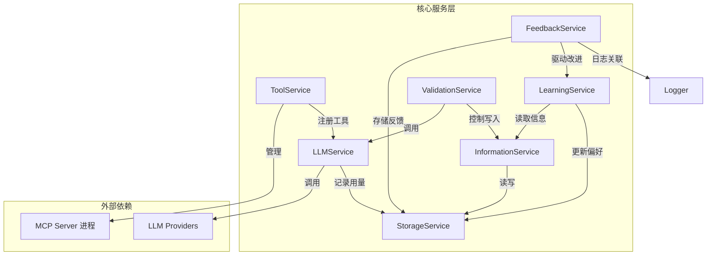
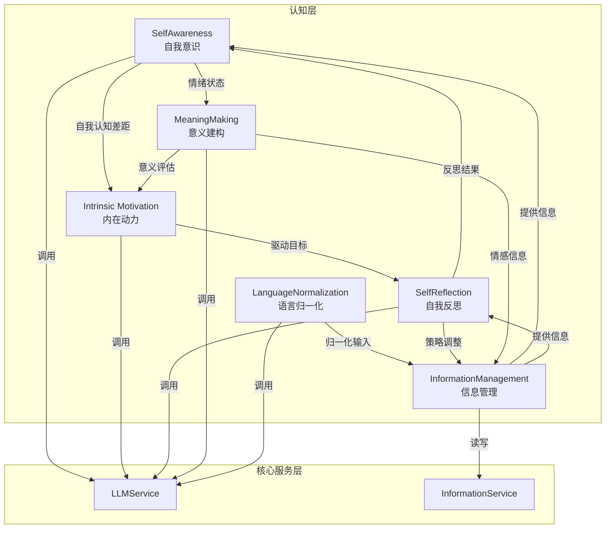
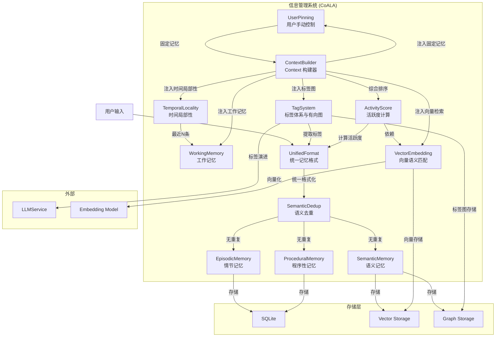
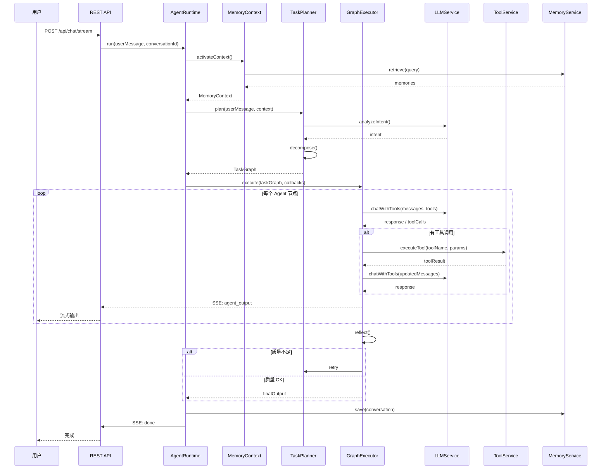
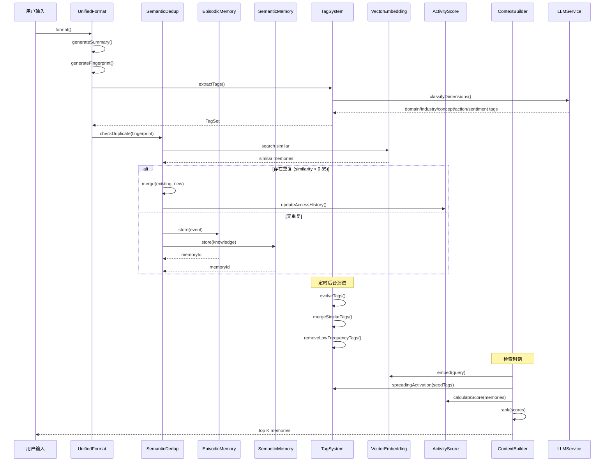
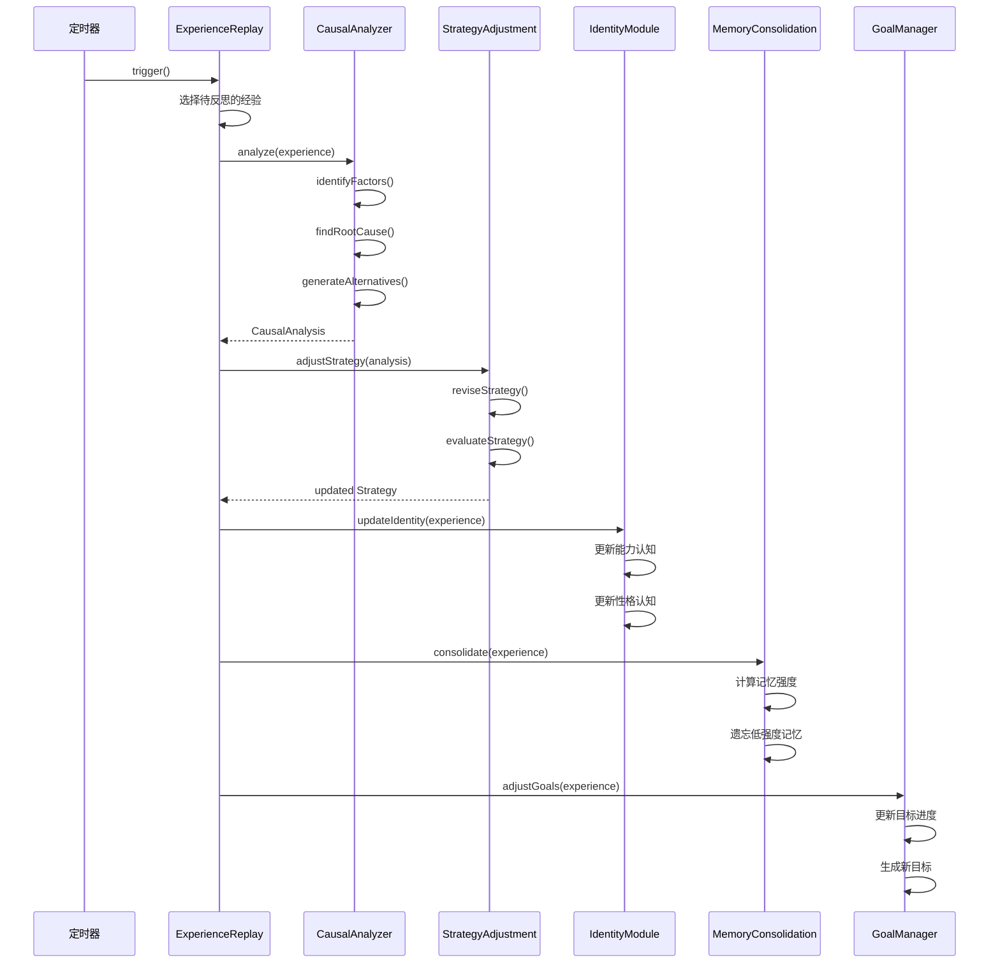
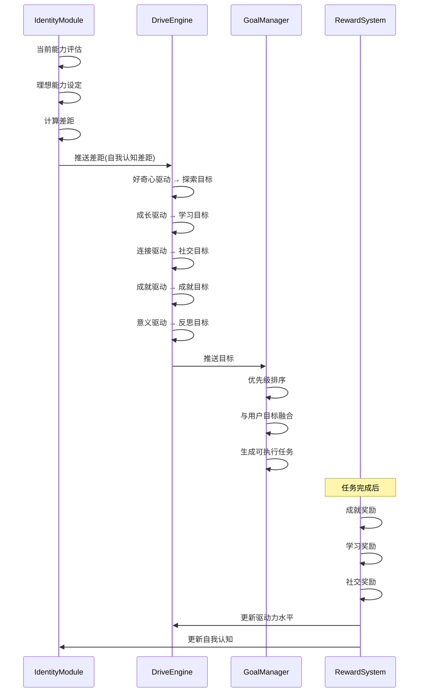

# Brian-Agent 后端产品需求文档 (PRD-Background)

> 版本: v1.1 | 日期: 2026-07-12 | 状态: 需求设计阶段

---

## 目录

1. [后端整体架构](#一后端整体架构)
2. [基础设施层](#二基础设施层)
3. [核心服务层](#三核心服务层)
4. [认知层](#四认知层)
5. [Agent 框架层](#五agent-框架层)
6. [应用层](#六应用层)
7. [模块间关系图](#七模块间关系图)
8. [附录：技术选型与工程规范](#八附录技术选型与工程规范)

---

## 一、后端整体架构

### 1.1 设计原则

| 原则 | 含义 | 技术实现 |
|------|------|----------|
| **高性能** | 低延迟响应，高吞吐量 | 异步非阻塞 I/O、连接池复用、缓存策略、流式输出 |
| **高可用** | 故障隔离，优雅降级 | 健康检查、超时熔断、错误重试、优雅关闭 |
| **高可维护** | 模块化、可测试、可观测 | 分层架构、依赖注入、结构化日志、全链路 traceId |
| **敏捷开发** | 快速迭代，持续交付 | 模块解耦、接口优先、渐进增强、特性开关 |

### 1.2 五层架构

```
┌──────────────────────────────────────────────────────────────────┐
│  应用层 (Application)                                            │
│  HTTP REST API / SSE / WebSocket / 中间件 / 请求校验 / 认证       │
├──────────────────────────────────────────────────────────────────┤
│  Agent 框架层 (Agent Framework)                                  │
│  Meta-Agent → Agent 模块 → TaskPlanner → GraphExecutor          │
│  AgentLibrary | SkillManager | AgentBuilder                      │
├──────────────────────────────────────────────────────────────────┤
│  认知层 (Cognitive Layer)                                        │
│  信息管理 | 自我意识 | 内在动力 | 自我反思 | 意义建构 | 语言归一化  │
├──────────────────────────────────────────────────────────────────┤
│  核心服务层 (Core Services)                                      │
│  LLMService | InformationService | ToolService | StorageService │
│  LearningService | FeedbackService | ValidationService          │
├──────────────────────────────────────────────────────────────────┤
│  基础设施层 (Infrastructure)                                      │
│  Config | Logger | Database | Server | Auth | Cache | Health    │
└──────────────────────────────────────────────────────────────────┘
```

### 1.3 目录结构

```
backend/src/
├── infrastructure/           # 基础设施层
│   ├── config.ts             # 统一配置管理 (Zod schema)
│   ├── logger.ts             # 结构化日志 + 全链路 traceId
│   ├── database.ts           # SQLite 初始化 + schema migration
│   ├── server.ts             # HTTP/SSE/WebSocket 服务器
│   ├── auth.ts               # 认证与授权
│   ├── cache.ts              # 内存缓存 (LRU)
│   └── health.ts             # 健康检查
│
├── core/                     # 核心服务层
│   ├── llm/                  # LLM 服务
│   │   ├── index.ts          # LLMService 统一入口
│   │   ├── adapters/         # OpenAI / Anthropic / Google 适配器
│   │   │   ├── openai.ts
│   │   │   ├── anthropic.ts
│   │   │   └── google.ts
│   │   ├── streaming.ts      # 流式调用
│   │   ├── embedding.ts      # Embedding 生成 (内嵌 + 远程)
│   │   ├── toolCalling.ts    # 工具调用 (function calling)
│   │   └── modelConfig.ts    # 模型配置管理
│   │
│   ├── information/           # 信息管理服务 (CoALA)
│   │   ├── index.ts          # InformationService 统一入口
│   │   ├── working.ts        # 工作记忆 (当前任务上下文)
│   │   ├── episodic.ts       # 情节记忆 (事件时间线)
│   │   ├── semantic.ts       # 语义记忆 (知识图谱 + 向量)
│   │   ├── procedural.ts     # 程序性记忆 (技能/模式)
│   │   ├── unifiedFormat.ts  # 统一记忆格式
│   │   ├── dedup.ts          # 语义去重
│   │   ├── activityScore.ts  # 活跃度计算
│   │   ├── embedding.ts      # 向量语义匹配 (内嵌/远程)
│   │   ├── tagSystem.ts      # 标签体系与有向图
│   │   ├── temporalLocality.ts # 时间局部性
│   │   ├── userPinning.ts    # 用户手动控制
│   │   └── context.ts        # Context 构建器
│   │
│   ├── tools/                # 工具服务
│   │   ├── index.ts          # ToolService
│   │   ├── registry.ts       # 工具注册表
│   │   ├── mcpClient.ts      # MCP 协议客户端 (stdio/HTTP)
│   │   └── builtin.ts        # 内置工具 (文件操作、计算等)
│   │
│   ├── storage/              # 存储服务
│   │   ├── index.ts          # StorageService
│   │   ├── sqlite.ts         # 关系型数据
│   │   ├── vector.ts         # 向量存储
│   │   ├── graph.ts          # 图存储
│   │   └── timeseries.ts     # 时序数据
│   │
│   ├── learning/             # 学习服务
│   │   ├── index.ts          # LearningService
│   │   ├── passive.ts        # 被动学习 (对话提取)
│   │   ├── queue.ts          # 待学习队列 (用户控制)
│   │   ├── batcher.ts        # 学习分批器 (主题分组)
│   │   ├── planner.ts        # 分阶段学习计划
│   │   ├── active.ts         # 主动学习 (闲时回顾)
│   │   ├── visualization.ts  # 学习可视化
│   │   └── tagIntegration.ts # Tag 集成
│   │
│   ├── feedback/             # 反馈服务
│   │   ├── index.ts          # FeedbackService
│   │   ├── collector.ts      # 反馈收集 (评价/报错/上下文/日志)
│   │   ├── analyzer.ts       # 反馈分析
│   │   └── correlator.ts     # 日志关联 (traceId)
│   │
│   └── validation/           # 校验服务
│       ├── index.ts          # ValidationService
│       ├── scorer.ts         # 评分 Worker Agent
│       └── gatekeeper.ts     # 记忆写入门控
│
├── cognitive/                # 认知层
│   ├── information/           # 信息管理 (CoALA 认知框架)
│   │   ├── index.ts            # 信息管理系统入口
│   │   ├── working.ts          # 工作记忆
│   │   ├── episodic.ts         # 情节记忆
│   │   ├── semantic.ts         # 语义记忆
│   │   ├── procedural.ts       # 程序性记忆
│   │   ├── unifiedFormat.ts    # 统一记忆格式
│   │   ├── dedup.ts            # 语义去重
│   │   ├── activityScore.ts    # 活跃度计算
│   │   ├── embedding.ts        # 向量语义匹配
│   │   ├── tagSystem.ts        # 标签体系与有向图
│   │   ├── temporalLocality.ts # 时间局部性
│   │   ├── userPinning.ts      # 用户手动控制
│   │   └── context.ts          # Context 构建器
│   │
│   ├── selfAwareness/        # 自我意识
│   │   ├── identity.ts       # 身份认知模块
│   │   ├── metaCognition.ts  # 元认知监控模块
│   │   └── emotionState.ts   # 情绪状态模块
│   │
│   ├── motivation/           # 内在动力
│   │   ├── goalManager.ts    # 目标管理
│   │   ├── driveEngine.ts    # 驱动力引擎
│   │   └── rewardSystem.ts   # 奖励系统
│   │
│   ├── reflection/           # 自我反思
│   │   ├── experienceReplay.ts # 经验回放
│   │   ├── causalAnalyzer.ts   # 因果分析
│   │   └── strategyAdjust.ts   # 策略调整
│   │
│   ├── meaning/              # 意义建构
│   │   ├── empathyEngine.ts    # 共情引擎
│   │   ├── valueEvaluator.ts   # 价值评估
│   │   └── meaningAssigner.ts  # 意义赋予
│   │
│   └── language/             # 语言归一化
│       ├── index.ts            # 归一化流水线
│       ├── languageDetect.ts   # 语言检测与分词
│       ├── standardize.ts      # 字符标准化
│       ├── correct.ts          # 错别字纠正
│       ├── redundancy.ts       # 冗余修饰去除
│       ├── syntax.ts           # 句法重构
│       ├── semantics.ts        # 语义提取
│       ├── rhetoric.ts         # 修辞分析
│       └── sentiment.ts        # 情感标注
│
├── agent/                    # Agent 框架层
│   ├── metaAgent.ts          # Meta-Agent (元 Agent 工厂 + 调度入口)
│   ├── agentLibrary.ts       # Agent 库 (存储/遗忘曲线/反馈强化/概率优化)
│   ├── module.ts             # Agent 模块主入口 (三层架构)
│   ├── strategy/             # 调度策略层
│   │   ├── index.ts          # 策略选择器
│   │   ├── react.ts          # ReACT 循环策略
│   │   ├── planExecute.ts    # Plan-Execute 两阶段策略
│   │   ├── cot.ts            # Chain-of-Thought 策略
│   │   ├── conditionalGraph.ts # Conditional Graph 策略
│   │   └── hybrid.ts         # 混合策略
│   ├── capability/           # 底层能力层
│   │   ├── llmConfig.ts      # LLM 配置
│   │   ├── promptTemplate.ts # Prompt 模板 (含 Soul 注入)
│   │   ├── skillBinding.ts   # Skill 绑定
│   │   ├── mcpBinding.ts     # MCP 端点绑定
│   │   └── soulConfig.ts     # Soul 人格配置
│   ├── infra/                # 基础设施层
│   │   ├── inputAdapter.ts   # 输入适配器
│   │   ├── stateManager.ts   # 状态管理
│   │   └── outputFormatter.ts # 输出格式化
│   ├── lifecycle.ts          # Agent 生命周期管理
│   ├── planner.ts            # TaskPlanner 任务分解
│   ├── executor.ts           # GraphExecutor 多策略融合执行
│   │   ├── dsg.ts            # DSG 有向状态图
│   │   ├── pregel.ts         # Pregel BSP 并行模型
│   │   ├── checkpoint.ts     # Checkpoint & Resume
│   │   ├── subAgent.ts       # Sub-Agent 委托
│   │   ├── fanOut.ts         # 并行扇出与汇总
│   │   └── reflector.ts      # 自省节点
│   ├── skillManager.ts       # Skill 生命周期管理
│   ├── agentBuilder.ts       # Agent 构建器
│   └── types.ts              # Agent 类型定义
│
├── routes/                   # 应用层
│   ├── index.ts              # 路由注册
│   ├── chat.ts               # /api/chat (含 SSE 流式)
│   ├── config.ts             # /api/config
│   ├── information.ts         # /api/information (信息管理)
│   ├── library.ts            # /api/library
│   ├── mcp.ts                # /api/mcp
│   ├── skill.ts              # /api/skill
│   ├── agent.ts              # /api/agent
│   ├── feedback.ts            # /api/feedback
│   ├── stats.ts              # /api/stats
│   └── ws.ts                 # WebSocket 处理
│
├── shared/                   # 跨模块共享
│   ├── types.ts              # 全局类型定义
│   ├── errors.ts             # 错误类型定义
│   ├── constants.ts          # 常量定义
│   └── utils.ts              # 工具函数
│
├── app.ts                    # Express 应用组装
├── main.ts                   # 入口
└── middleware/                # 中间件
    ├── traceId.ts            # traceId 注入
    ├── errorHandler.ts       # 全局错误处理
    └── rateLimiter.ts        # 速率限制
```

---

## 二、基础设施层

### 2.1 模块层级总览

```
基础设施层
├── 2.1 ConfigManager              # 配置管理
│   ├── 2.1.1 Schema 定义          # Zod 类型校验
│   ├── 2.1.2 三级合并             # 默认值 → 文件 → 环境变量
│   ├── 2.1.3 热更新               # 文件监听自动重载
│   └── 2.1.4 配置导出             # 类型安全的全局配置单例
│
├── 2.2 Logger                     # 日志系统
│   ├── 2.2.1 结构化日志           # JSON 格式，按天轮转
│   ├── 2.2.2 全链路 traceId       # 请求级 UUID 贯穿所有调用
│   ├── 2.2.3 日志级别             # DEBUG / INFO / WARN / ERROR / REQ / RES / AGENT
│   └── 2.2.4 日志输出             # 控制台 + 文件，支持 ELK 集成
│
├── 2.3 Database                   # 数据库
│   ├── 2.3.1 SQLite 初始化        # 连接池管理
│   ├── 2.3.2 Schema Migration     # 版本化迁移脚本
│   ├── 2.3.3 核心表结构           # 见下方详细表结构
│   └── 2.3.4 索引优化             # 查询性能索引
│
├── 2.4 Server                     # 服务器
│   ├── 2.4.1 HTTP Server          # Express 配置
│   ├── 2.4.2 SSE 支持             # Server-Sent Events 流式
│   ├── 2.4.3 WebSocket             # 实时双向通信
│   ├── 2.4.4 中间件链             # CORS / Helmet / BodyParser / TraceId
│   └── 2.4.5 优雅关闭             # 信号处理 + 连接排空
│
├── 2.5 Auth                       # 认证与授权
│   ├── 2.5.1 本地密码认证         # bcrypt 哈希 + session
│   ├── 2.5.2 Session 管理         # 内存 session + 持久化
│   └── 2.5.3 授权中间件           # 路由级鉴权
│
├── 2.6 Cache                      # 缓存
│   ├── 2.6.1 LRU 内存缓存         # 常用数据缓存
│   ├── 2.6.2 TTL 过期             # 自动过期清理
│   └── 2.6.3 缓存 Key 规范        # 统一命名约定
│
└── 2.7 Health                     # 健康检查
    ├── 2.7.1 存活检查             # /health → 200
    └── 2.7.2 就绪检查             # /health/ready → DB + LLM 连通性
```

### 2.2 各子模块详细设计

---

#### 2.1 ConfigManager — 配置管理

**原理与问题**：集中管理应用配置，解决配置散落、类型不安全、环境差异问题。使用 Zod 进行运行时校验，确保配置在启动时就能发现错误。

**设计思想**：三级合并策略（默认值 → 配置文件 → 环境变量），支持文件监听热更新，类型安全的全局单例。

**最小功能单元**：

| 功能单元 | 职责 | 输入 | 输出 |
|----------|------|------|------|
| `defineSchema()` | 定义配置结构 | Zod schema | 类型安全的 Config 类型 |
| `loadDefaults()` | 加载默认值 | — | 默认配置对象 |
| `loadFromFile()` | 加载配置文件 | 文件路径 | 文件配置对象 |
| `loadFromEnv()` | 加载环境变量 | process.env | 环境变量配置对象 |
| `merge()` | 合并配置 | 三层配置对象 | 最终配置对象 |
| `validate()` | 校验配置合法性 | 配置对象 | 校验结果 (ok/error) |
| `watch()` | 监听文件变化 | 文件路径 | 热更新事件 |
| `get()` | 获取配置项 | key 路径 | 配置值 |

**配置项清单**：

```typescript
interface AppConfig {
  // 服务器
  port: number
  host: string
  corsOrigin: string

  // 数据
  dataDir: string
  dbPath: string
  graphDbPath: string
  vectorDbPath: string
  configFilePath: string

  // 日志
  logDir: string
  logLevel: 'debug' | 'info' | 'warn' | 'error'

  // 默认 LLM
  defaultModel: string
  defaultProvider: string

  // 记忆
  memory: {
    workingCapacity: number       // 工作记忆容量，默认 7
    sensoryDurationMs: number     // 感觉记忆持续时间，默认 3000
    embeddingModel: string        // 内嵌 embedding 模型
    embeddingDimension: number    // 向量维度
    dedupThreshold: number        // 去重相似度阈值，默认 0.85
    organizerIntervalMs: number   // 整理间隔，默认 3600000 (1h)
    consolidationIntervalMs: number // 巩固间隔，默认 3600000 (1h)
    tagEvolutionIntervalMs: number  // 标签演进间隔
    maxContextTokens: number      // 上下文最大 token 数
  }

  // Agent
  agent: {
    maxIterations: number         // 最大循环次数，默认 5
    maxParallelAgents: number     // 最大并行 Agent 数，默认 4
    defaultStrategy: string       // 默认调度策略
    executionTimeoutMs: number    // 执行超时
  }

  // 速率限制
  rateLimits: {
    daily: number
    weekly: number
    monthly: number
  }

  // 认证
  auth: {
    sessionSecret: string
    sessionMaxAge: number
  }
}
```

---

#### 2.2 Logger — 日志系统

**原理与问题**：为解决分布式追踪和多模块日志混乱问题，实现结构化日志 + 全链路 traceId。每个请求入口生成 UUID，贯穿所有后续调用（用户请求 → Orchestrator → Agent → LLM → 响应），全部携带同一个 traceId。

**设计思想**：基于 winston 或 pino 实现，支持 JSON 格式输出（便于 ELK 采集），按天轮转日志文件，区分不同日志级别用于不同场景。

**最小功能单元**：

| 功能单元 | 职责 | 输入 | 输出 |
|----------|------|------|------|
| `createLogger()` | 创建日志实例 | 配置 | Logger 实例 |
| `debug()` | 调试日志 | module, message, data | 写入日志 |
| `info()` | 信息日志 | module, message, data | 写入日志 |
| `warn()` | 警告日志 | module, message, data | 写入日志 |
| `error()` | 错误日志 | module, message, data | 写入日志 |
| `request()` | 请求日志 | method, url, body | 写入日志 |
| `response()` | 响应日志 | method, url, status, latency | 写入日志 |
| `agent()` | Agent 专用日志 | agentName, event, data | 写入日志 |
| `generateTraceId()` | 生成 traceId | — | UUID |
| `setTraceId()` | 设置当前 traceId | traceId | — |
| `getTraceId()` | 获取当前 traceId | — | traceId |
| `rotateLog()` | 日志轮转 | — | 新日志文件 |

---

#### 2.3 Database — 数据库

**原理与问题**：SQLite 作为本地优先的嵌入式数据库，零配置、低资源占用。通过 better-sqlite3 实现同步高性能操作。需要 schema migration 机制支持版本化升级。

**设计思想**：版本化 migration 脚本，支持 up/down 迁移。核心表按业务领域划分，索引按查询模式优化。

**最小功能单元**：

| 功能单元 | 职责 | 输入 | 输出 |
|----------|------|------|------|
| `init()` | 初始化数据库连接 | dbPath | Database 实例 |
| `runMigration()` | 执行迁移 | 版本号 | 成功/失败 |
| `createTable()` | 创建表 | DDL | 执行结果 |
| `createIndex()` | 创建索引 | DDL | 执行结果 |
| `getInstance()` | 获取数据库实例 | — | Database |
| `close()` | 关闭连接 | — | — |

**核心表结构**：

```sql
-- 会话
CREATE TABLE conversations (
  id TEXT PRIMARY KEY,
  user_id TEXT NOT NULL,
  title TEXT,
  created_at INTEGER NOT NULL,
  updated_at INTEGER NOT NULL
);

-- 消息
CREATE TABLE messages (
  id TEXT PRIMARY KEY,
  conversation_id TEXT NOT NULL,
  role TEXT NOT NULL CHECK(role IN ('user', 'assistant', 'system', 'agent')),
  agent_id TEXT,
  content TEXT NOT NULL,
  summary TEXT,
  tokens INTEGER DEFAULT 0,
  latency_ms INTEGER DEFAULT 0,
  created_at INTEGER NOT NULL,
  FOREIGN KEY (conversation_id) REFERENCES conversations(id)
);

-- 记忆节点 (图存储)
CREATE TABLE memory_nodes (
  id TEXT PRIMARY KEY,
  type TEXT NOT NULL CHECK(type IN ('memory', 'tag', 'concept', 'entity')),
  content TEXT NOT NULL,
  metadata TEXT DEFAULT '{}',
  salience_score REAL DEFAULT 0.5,
  emotional_tag TEXT,
  retrieval_count INTEGER DEFAULT 0,
  last_retrieved INTEGER,
  strength REAL DEFAULT 0.5,
  decay_rate REAL DEFAULT 0.05,
  created_at INTEGER NOT NULL,
  updated_at INTEGER NOT NULL
);

-- 记忆边 (图存储)
CREATE TABLE memory_edges (
  id TEXT PRIMARY KEY,
  source_node_id TEXT NOT NULL,
  target_node_id TEXT NOT NULL,
  weight REAL DEFAULT 0.5,
  label TEXT,
  activation_count INTEGER DEFAULT 0,
  direction TEXT CHECK(direction IN ('undirected', 'directed')) DEFAULT 'undirected',
  created_at INTEGER NOT NULL,
  updated_at INTEGER NOT NULL,
  FOREIGN KEY (source_node_id) REFERENCES memory_nodes(id),
  FOREIGN KEY (target_node_id) REFERENCES memory_nodes(id)
);

-- Agent 调度链
CREATE TABLE agent_chains (
  id TEXT PRIMARY KEY,
  conversation_id TEXT NOT NULL,
  message_id TEXT NOT NULL,
  chain_data TEXT NOT NULL,
  created_at INTEGER NOT NULL,
  FOREIGN KEY (conversation_id) REFERENCES conversations(id)
);

-- 调用历史
CREATE TABLE call_history (
  id INTEGER PRIMARY KEY AUTOINCREMENT,
  model TEXT NOT NULL,
  provider TEXT NOT NULL,
  tokens INTEGER NOT NULL,
  latency_ms INTEGER NOT NULL,
  created_at INTEGER NOT NULL
);

-- 用户偏好
CREATE TABLE user_preferences (
  id TEXT PRIMARY KEY,
  user_id TEXT NOT NULL,
  category TEXT NOT NULL CHECK(category IN ('aesthetic', 'content', 'communication', 'behavior')),
  key TEXT NOT NULL,
  value TEXT NOT NULL,
  confidence REAL DEFAULT 0.5,
  source TEXT,
  created_at INTEGER NOT NULL,
  updated_at INTEGER NOT NULL
);

-- 时序数据
CREATE TABLE time_series_data (
  id INTEGER PRIMARY KEY AUTOINCREMENT,
  metric TEXT NOT NULL,
  value REAL NOT NULL,
  timestamp INTEGER NOT NULL,
  tags TEXT DEFAULT '{}'
);

-- 反馈
CREATE TABLE feedback (
  id TEXT PRIMARY KEY,
  message_id TEXT NOT NULL,
  conversation_id TEXT,
  user_id TEXT NOT NULL,
  rating TEXT NOT NULL CHECK(rating IN ('good', 'neutral', 'bad')),
  reason TEXT,
  -- 报错信息
  error_info TEXT,
  -- 用户允许时收集的上下文
  include_context INTEGER DEFAULT 0,
  original_question TEXT,
  original_answer TEXT,
  context_messages TEXT,
  -- 关联日志
  log_trace_id TEXT,
  related_logs TEXT,
  -- 处理状态
  status TEXT DEFAULT 'pending' CHECK(status IN ('pending', 'reviewed', 'resolved', 'dismissed')),
  created_at INTEGER NOT NULL,
  updated_at INTEGER NOT NULL
);

-- Skill 定义
CREATE TABLE skills (
  id TEXT PRIMARY KEY,
  name TEXT NOT NULL,
  description TEXT,
  mode TEXT NOT NULL CHECK(mode IN ('user', 'llm', 'manual')),
  user_input TEXT,
  user_output TEXT,
  user_process TEXT,
  normalized_spec TEXT,
  manual_content TEXT,
  review TEXT,
  active INTEGER DEFAULT 1,
  created_at INTEGER NOT NULL,
  updated_at INTEGER NOT NULL
);

-- 自定义 Agent
CREATE TABLE custom_agents (
  id TEXT PRIMARY KEY,
  name TEXT NOT NULL,
  role TEXT NOT NULL,
  description TEXT,
  strategy TEXT,
  capabilities TEXT,
  infra TEXT,
  active INTEGER DEFAULT 1,
  created_at INTEGER NOT NULL,
  updated_at INTEGER NOT NULL
);

-- MCP 安装记录
CREATE TABLE mcp_installed (
  id TEXT PRIMARY KEY,
  package_name TEXT NOT NULL,
  display_name TEXT,
  version TEXT,
  tools_json TEXT,
  active INTEGER DEFAULT 1,
  installed_at INTEGER NOT NULL
);

-- 知识库路径
CREATE TABLE library_paths (
  id TEXT PRIMARY KEY,
  path TEXT NOT NULL UNIQUE,
  enabled INTEGER DEFAULT 1,
  created_at INTEGER NOT NULL
);
```

---

#### 2.4 Server — 服务器

**原理与问题**：统一管理 HTTP、SSE、WebSocket 三种通信协议，支持中间件链、优雅关闭。Express 作为 HTTP 框架，结合原生 SSE 支持和 ws 库的 WebSocket。

**设计思想**：中间件洋葱模型，traceId 注入作为第一个中间件，错误处理作为最后一个中间件。优雅关闭通过信号处理 + 连接排空实现。

**最小功能单元**：

| 功能单元 | 职责 | 输入 | 输出 |
|----------|------|------|------|
| `createServer()` | 创建服务器实例 | config | Express app |
| `setupMiddleware()` | 配置中间件链 | app | — |
| `setupRoutes()` | 注册路由 | app | — |
| `setupWebSocket()` | 配置 WebSocket | server | — |
| `start()` | 启动服务器 | port | — |
| `gracefulShutdown()` | 优雅关闭 | signal | — |

---

#### 2.5 Auth — 认证与授权

**原理与问题**：本地优先的桌面应用，使用简单的密码认证 + session 机制。前端登录后，后端签发 session 并存储，后续请求携带 session cookie。

**设计思想**：密码 bcrypt 哈希存储，session 基于内存 + 可选的 SQLite 持久化。中间件级别鉴权，路由级白名单。

**最小功能单元**：

| 功能单元 | 职责 | 输入 | 输出 |
|----------|------|------|------|
| `hashPassword()` | 密码哈希 | 明文密码 | bcrypt hash |
| `verifyPassword()` | 密码验证 | 明文 + hash | 验证结果 |
| `createSession()` | 创建会话 | userId | sessionId |
| `validateSession()` | 校验会话 | sessionId | 用户信息 |
| `destroySession()` | 销毁会话 | sessionId | — |
| `authMiddleware()` | 鉴权中间件 | req, res, next | — |

---

#### 2.6 Cache — 缓存

**原理与问题**：减少重复计算和数据库查询，提升响应速度。使用 LRU 淘汰策略，设置 TTL 过期时间。

**设计思想**：基于 `lru-cache` 库实现，按缓存域分类管理。提供统一的 get/set/delete 接口。

**最小功能单元**：

| 功能单元 | 职责 | 输入 | 输出 |
|----------|------|------|------|
| `createCache()` | 创建缓存实例 | maxSize, ttl | Cache 实例 |
| `get()` | 获取缓存 | key | value 或 undefined |
| `set()` | 设置缓存 | key, value | — |
| `delete()` | 删除缓存 | key | — |
| `clear()` | 清空缓存 | — | — |
| `has()` | 检查是否存在 | key | boolean |

---

#### 2.7 Health — 健康检查

**原理与问题**：为监控和运维提供应用状态检查。分为存活检查（进程是否运行）和就绪检查（依赖服务是否可用）。

**设计思想**：Kubernetes 风格的健康检查端点，存活检查返回 200 即可，就绪检查需要验证 DB 连接和 LLM Provider 连通性。

**最小功能单元**：

| 功能单元 | 职责 | 输入 | 输出 |
|----------|------|------|------|
| `checkLiveness()` | 存活检查 | — | { status: 'ok' } |
| `checkReadiness()` | 就绪检查 | — | { status, db, llm } |
| `checkDB()` | 数据库连通性 | — | boolean |
| `checkLLM()` | LLM Provider 连通性 | — | boolean |

---

## 三、核心服务层

### 3.1 模块层级总览

```
核心服务层
├── 3.1 LLMService                 # LLM 服务
│   ├── 3.1.0 ModelRegistry        # 模型注册中心 (注册/筛选/选取)
│   ├── 3.1.1 Provider Adapter     # 多 Provider 适配
│   │   ├── OpenAI Adapter
│   │   ├── Anthropic Adapter
│   │   └── Google Adapter
│   ├── 3.1.2 Chat                 # 对话 (chat completion)
│   ├── 3.1.3 Streaming            # 流式对话 (SSE)
│   ├── 3.1.4 Tool Calling         # 工具调用 (function calling)
│   ├── 3.1.5 Embedding             # 文本向量化
│   │   ├── 内嵌 embedding (Transformers.js)
│   │   └── 远程 embedding (API)
│   ├── 3.1.6 Model Config         # 模型配置管理
│   │   ├── Provider CRUD
│   │   ├── Model CRUD
│   │   ├── 连接验证
│   │   └── 配额查询
│   └── 3.1.7 Quota & Rate Limit   # 配额与速率限制
│
├── 3.2 InformationService          # 信息管理服务 (详见第四章)
│
├── 3.3 ToolService                # 工具服务
│   ├── 3.3.1 Tool Registry        # 工具注册表
│   ├── 3.3.2 MCP Client           # MCP 协议客户端
│   │   ├── stdio 通信
│   │   ├── HTTP 通信
│   │   ├── 握手协议
│   │   └── 工具发现
│   ├── 3.3.3 Built-in Tools       # 内置工具
│   │   ├── 文件操作
│   │   ├── Shell 命令执行
│   │   ├── 网络请求
│   │   └── 计算工具
│   └── 3.3.4 Tool Execution       # 工具执行引擎
│
├── 3.4 StorageService             # 存储服务
│   ├── 3.4.1 SQLite Storage       # 关系型存储
│   ├── 3.4.2 Vector Storage       # 向量存储
│   ├── 3.4.3 Graph Storage        # 图存储
│   └── 3.4.4 Time Series Storage  # 时序存储
│
├── 3.5 LearningService            # 学习服务
│   ├── 3.5.1 Passive Learning     # 被动学习 (对话提取)
│   ├── 3.5.2 Learning Queue       # 待学习队列 (用户可视化控制)
│   ├── 3.5.3 Learning Batcher     # 学习分批器 (主题分组)
│   ├── 3.5.4 Learning Planner     # 分阶段学习计划
│   ├── 3.5.5 Active Learning      # 主动学习 (闲时回顾)
│   ├── 3.5.6 Learning Visualization # 学习可视化 (Brian 页面)
│   └── 3.5.7 Tag Integration      # Tag 集成 (纳入标签图)
│
├── 3.6 FeedbackService            # 反馈服务
│   ├── 3.6.1 Feedback Collector   # 反馈收集 (报错/评价/上下文/日志)
│   ├── 3.6.2 Feedback Analyzer    # 反馈分析 (模式识别/改进建议)
│   └── 3.6.3 Log Correlator       # 日志关联 (traceId 关联)
│
└── 3.7 ValidationService          # 校验服务
    ├── 3.7.1 Scoring Worker       # 评分 Worker Agent
    └── 3.7.2 Memory Gatekeeper    # 记忆写入门控
```

### 3.2 各子模块详细设计

---

#### 3.1 LLMService — LLM 服务

**原理与问题**：统一管理多个 LLM Provider 的调用，解决不同 Provider 的 API 差异、流式/非流式、工具调用、Embedding 等功能差异。通过适配器模式屏蔽底层差异。用户配置的所有模型需要统一注册，当封装 Agent 时从注册中心选取合适的模型。

**设计思想**：适配器模式 + 注册中心模式。每个 Provider 实现统一接口，所有配置的模型注册到 ModelRegistry。LLMService 根据 Agent 需求从注册中心选取最佳模型。支持 OpenAI 兼容协议的统一适配器，减少重复代码。

**模型注册中心流程**：

```
用户配置 Provider 和 Model
        │
        ▼
   ModelRegistry.register(model)
        │
        ├── 验证连接可用性
        ├── 记录模型能力 (chat/stream/toolCall/embed)
        ├── 记录配额信息
        └── 模型进入可用池
        │
        ▼
  Agent 构建时: ModelRegistry.select(criteria)
        │
        ├── 根据任务需求匹配模型能力
        ├── 根据配额筛选可用模型
        ├── 根据成本/速度排序
        └── 返回最优模型
```

##### 3.1.0 ModelRegistry — 模型注册中心

| 功能单元 | 职责 | 输入 | 输出 |
|----------|------|------|------|
| `register()` | 注册模型 | model config | modelId |
| `unregister()` | 注销模型 | modelId | — |
| `listAll()` | 列出所有已注册模型 | — | RegisteredModel[] |
| `listByProvider()` | 按 Provider 列出 | providerId | RegisteredModel[] |
| `listByCapability()` | 按能力筛选 | capability | RegisteredModel[] |
| `select()` | 为 Agent 选取最优模型 | criteria (task, cost, speed) | RegisteredModel |
| `getModel()` | 获取模型详情 | modelId | RegisteredModel |
| `verify()` | 验证模型可用性 | modelId | boolean |
| `getQuota()` | 获取模型配额 | modelId | QuotaInfo |
| `getStats()` | 获取模型使用统计 | modelId | ModelStats |

**注册模型数据模型**：

```typescript
interface RegisteredModel {
  id: string
  providerId: string
  providerType: 'openai' | 'anthropic' | 'google'
  modelName: string
  displayName: string
  capabilities: {
    chat: boolean
    stream: boolean
    toolCall: boolean
    embed: boolean
  }
  config: {
    temperature: number
    maxTokens: number
    apiKey: string
    baseUrl: string
  }
  quota: {
    daily: number
    weekly: number
    monthly: number
    used: number
  }
  stats: {
    totalCalls: number
    totalTokens: number
    avgLatency: number
    successRate: number
  }
  status: 'active' | 'inactive' | 'error'
  registeredAt: number
}
```

**模型选择策略**：

| 策略 | 说明 | 适用场景 |
|------|------|----------|
| `best_quality` | 选择质量最高的模型 | 复杂推理、代码生成 |
| `lowest_cost` | 选择成本最低的模型 | 简单问答、批量处理 |
| `fastest` | 选择响应最快的模型 | 实时对话、流式输出 |
| `most_available` | 选择配额最充足的模型 | 高峰期、大量请求 |
| `auto` | 根据任务自动选择 | 默认策略 |

**最小功能单元**：

##### 3.1.1 Provider Adapter — 多 Provider 适配

| 功能单元 | 职责 | 输入 | 输出 |
|----------|------|------|------|
| `OpenAIAdapter` | OpenAI 兼容协议适配 | — | 适配器实例 |
| `AnthropicAdapter` | Anthropic 协议适配 | — | 适配器实例 |
| `GoogleAdapter` | Google Gemini 协议适配 | — | 适配器实例 |
| `getAdapter()` | 获取对应适配器 | providerType | Adapter 实例 |

**Provider 支持矩阵**：

| Provider | 类型 | chat | stream | toolCall | embed |
|----------|------|------|--------|----------|-------|
| OpenAI | openai | ✓ | ✓ | ✓ | ✓ |
| Anthropic | anthropic | ✓ | ✓ | ✓ | ✗ |
| Google | google | ✓ | ✓ | ✓ | ✓ |
| DeepSeek | openai | ✓ | ✓ | ✗ | ✗ |
| 智谱 GLM | openai | ✓ | ✓ | ✓ | ✓ |
| Moonshot | openai | ✓ | ✓ | ✗ | ✗ |
| 通义千问 | openai | ✓ | ✓ | ✗ | ✓ |
| 自定义 | openai | ✓ | ✓ | ✗ | ✗ |

##### 3.1.2 Chat — 对话

| 功能单元 | 职责 | 输入 | 输出 |
|----------|------|------|------|
| `chat()` | 非流式对话 | messages, options | LLMResponse |
| `buildRequest()` | 构建请求体 | messages, options | request body |
| `parseResponse()` | 解析响应 | raw response | LLMResponse |
| `handleError()` | 错误处理 | error | 标准化错误 |

##### 3.1.3 Streaming — 流式对话

| 功能单元 | 职责 | 输入 | 输出 |
|----------|------|------|------|
| `chatStream()` | 流式对话 | messages, options | AsyncGenerator<StreamChunk> |
| `parseSSEChunk()` | 解析 SSE 数据块 | raw chunk | StreamChunk |
| `handleStreamError()` | 流式错误处理 | error | 标准化错误 |

##### 3.1.4 Tool Calling — 工具调用

| 功能单元 | 职责 | 输入 | 输出 |
|----------|------|------|------|
| `chatWithTools()` | 带工具调用的对话 | messages, tools, options | LLMResponse |
| `formatTools()` | 格式化工具定义 | Tool[] | Provider 格式的工具列表 |
| `parseToolCalls()` | 解析工具调用 | response | ToolCall[] |

##### 3.1.5 Embedding — 文本向量化

| 功能单元 | 职责 | 输入 | 输出 |
|----------|------|------|------|
| `embed()` | 文本向量化 | texts: string[] | number[][] |
| `embedLocal()` | 内嵌 embedding | texts | vectors (本地模型) |
| `embedRemote()` | 远程 embedding | texts | vectors (API 调用) |

**Embedding 方案**：

| 方案 | 模型 | 资源 | 维度 | 适用场景 |
|------|------|------|------|----------|
| 内嵌 (默认) | all-MiniLM-L6-v2 | ~80MB, CPU | 384 | 英文为主 |
| 内嵌 (中文) | bge-small-zh | ~100MB, CPU | 512 | 中文为主 |
| 远程 | 调用 Provider embedding API | 无本地开销 | 取决于模型 | 高精度需求 |

##### 3.1.6 Model Config — 模型配置管理

| 功能单元 | 职责 | 输入 | 输出 |
|----------|------|------|------|
| `getConfig()` | 获取全局配置 | — | ModelConfig |
| `updateConfig()` | 更新全局配置 | partial config | ModelConfig |
| `addProvider()` | 添加 Provider | provider info | Provider |
| `updateProvider()` | 更新 Provider | id, updates | Provider |
| `deleteProvider()` | 删除 Provider | id | — |
| `addModel()` | 添加模型 | providerId, model info | Model |
| `updateModel()` | 更新模型 | id, updates | Model |
| `deleteModel()` | 删除模型 | id | — |
| `verifyConnection()` | 测试连接 | providerId | boolean |
| `fetchQuota()` | 查询配额 | providerId | QuotaInfo |
| `persist()` | 持久化配置到文件 | — | — |

##### 3.1.7 Quota & Rate Limit — 配额与速率限制

| 功能单元 | 职责 | 输入 | 输出 |
|----------|------|------|------|
| `recordCall()` | 记录调用 | tokens, latency | — |
| `checkQuota()` | 检查配额 | — | { allowed, remaining } |
| `getUsageStats()` | 获取用量统计 | window | UsageStats |
| `getTokenMatrix()` | 获取 Token 贡献矩阵 | year | TokenMatrix |

---

#### 3.3 ToolService — 工具服务

**原理与问题**：Agent 需要调用外部工具完成任务。工具分为内置工具（本地能力）和 MCP 工具（外部协议）。需要统一的注册、发现、执行机制。

**设计思想**：注册表模式 + 适配器模式。所有工具注册到 ToolRegistry，通过统一接口执行。MCP 协议客户端作为特殊适配器，管理 MCP 服务器进程和工具发现。

##### 3.3.1 Tool Registry — 工具注册表

**最小功能单元**：

| 功能单元 | 职责 | 输入 | 输出 |
|----------|------|------|------|
| `register()` | 注册工具 | Tool | toolId |
| `unregister()` | 注销工具 | toolId | — |
| `list()` | 列出所有工具 | — | Tool[] |
| `get()` | 获取工具详情 | toolId | Tool |
| `execute()` | 执行工具 | toolName, params | 执行结果 |
| `getToolsForLLM()` | 获取 LLM 格式的工具列表 | — | LLM Tool format |

##### 3.3.2 MCP Client — MCP 协议客户端

**最小功能单元**：

| 功能单元 | 职责 | 输入 | 输出 |
|----------|------|------|------|
| `installMcp()` | 安装 MCP 包 | packageName | McpPackage |
| `uninstallMcp()` | 卸载 MCP 包 | packageId | — |
| `startMcpServer()` | 启动 MCP 服务器进程 | config | process |
| `stopMcpServer()` | 停止 MCP 服务器 | serverId | — |
| `handshake()` | 握手机制 | — | 握手结果 |
| `discoverTools()` | 发现工具列表 | — | McpTool[] |
| `callTool()` | 调用 MCP 工具 | toolName, params | 调用结果 |
| `listInstalled()` | 列出已安装 | — | McpPackage[] |
| `getMcpMarket()` | 获取 MCP 市场列表 | — | McpPackage[] |
| `syncMarket()` | 同步社区列表 | — | McpPackage[] |

##### 3.3.3 Built-in Tools — 内置工具

| 功能单元 | 职责 | 输入 | 输出 |
|----------|------|------|------|
| `FileReadTool` | 读取文件 | path | content |
| `FileWriteTool` | 写入文件 | path, content | — |
| `FileListTool` | 列出目录 | path | file list |
| `ShellExecTool` | 执行 Shell 命令 | command | stdout/stderr |
| `WebFetchTool` | 网络请求 | url | response |
| `CalculatorTool` | 数学计算 | expression | result |

##### 3.3.4 Tool Execution — 工具执行引擎

| 功能单元 | 职责 | 输入 | 输出 |
|----------|------|------|------|
| `executeTool()` | 统一执行入口 | toolName, params | 执行结果 |
| `validateParams()` | 参数校验 | params, schema | 校验结果 |
| `formatResult()` | 结果格式化 | raw result | 格式化结果 |
| `handleToolError()` | 工具错误处理 | error | 标准化错误 |

---

#### 3.4 StorageService — 存储服务

**原理与问题**：后端需要多种存储引擎支持不同数据模型。SQLite 存储关系数据，向量存储支持语义检索，图存储支持知识图谱，时序存储支持统计监控。

**设计思想**：工厂模式 + 接口统一。每种存储引擎实现统一接口，StorageService 作为聚合入口，提供统一访问。

##### 3.4.1 SQLite Storage — 关系型存储

| 功能单元 | 职责 | 输入 | 输出 |
|----------|------|------|------|
| `query()` | 执行查询 | SQL, params | rows |
| `execute()` | 执行写操作 | SQL, params | 影响行数 |
| `transaction()` | 事务操作 | callback | 回调结果 |
| `prepare()` | 预编译语句 | SQL | Statement |

##### 3.4.2 Vector Storage — 向量存储

| 功能单元 | 职责 | 输入 | 输出 |
|----------|------|------|------|
| `createIndex()` | 创建索引 | name, dimension | — |
| `addVector()` | 添加向量 | indexName, vector, metadata | — |
| `search()` | 向量检索 | indexName, queryVector, topK | SearchResult[] |
| `deleteVector()` | 删除向量 | indexName, id | — |
| `deleteIndex()` | 删除索引 | name | — |

##### 3.4.3 Graph Storage — 图存储

| 功能单元 | 职责 | 输入 | 输出 |
|----------|------|------|------|
| `createNode()` | 创建节点 | node | MemoryNode |
| `getNode()` | 获取节点 | id | MemoryNode |
| `getAllNodes()` | 获取所有节点 | — | MemoryNode[] |
| `updateNode()` | 更新节点 | id, updates | — |
| `deleteNode()` | 删除节点 | id | — |
| `createEdge()` | 创建边 | edge | MemoryEdge |
| `getEdge()` | 获取边 | id | MemoryEdge |
| `getEdgesBySource()` | 按源节点获取边 | sourceId | MemoryEdge[] |
| `getEdgesByTarget()` | 按目标节点获取边 | targetId | MemoryEdge[] |
| `updateEdge()` | 更新边 | id, updates | — |
| `deleteEdge()` | 删除边 | id | — |
| `getNeighbors()` | 获取邻居节点 | nodeId, depth | MemoryNode[] |

##### 3.4.4 Time Series Storage — 时序存储

| 功能单元 | 职责 | 输入 | 输出 |
|----------|------|------|------|
| `insert()` | 插入数据点 | metric, value, timestamp, tags | — |
| `query()` | 查询时序数据 | metric, timeRange | DataPoint[] |
| `aggregate()` | 聚合查询 | metric, aggregateFn, timeRange | AggregateResult |

---

#### 3.5 LearningService — 学习服务

**原理与问题**：被动学习从对话中提取知识的速度较慢，用户需要有可见的"待学习列表"来控制学习优先级。学习任务应该按相关性分批处理，并且分阶段执行，避免大任务导致其他任务饿死。学习到的内容需要可视化展示，并通过 tag 模块的规则纳入标签图中。

**设计思想**：用户可控 + 分批分阶段 + 可视化 + tag 集成。被动学习提取的知识进入待学习队列，用户可查看、优先排序、跳过。学习任务按主题相关性自动分组，每个阶段有明确的执行计划。学习结果在 Brian 页面可视化展示，内容自动按 tag 规则生成标签并纳入标签图。

**学习全流程**：

```
对话流 → 被动学习提取 → 待学习队列
                            │
                    ┌───────┼───────┐
                    │       │       │
              用户查看队列  用户排序  用户跳过
                    │       │       │
                    └───────┼───────┘
                            │
                    分批分组 (相关主题)
                            │
                    分阶段学习计划
                    ├── 阶段1: 基础概念
                    ├── 阶段2: 关联知识
                    └── 阶段3: 深度理解
                            │
                    学习执行 (Meta-Agent)
                            │
                    ┌───────┼───────┐
                    │       │       │
               tag 标注   纳入标签图  可视化展示
```

##### 3.5.1 Passive Learning — 被动学习

| 功能单元 | 职责 | 输入 | 输出 |
|----------|------|------|------|
| `onMessage()` | 监听消息 | message | — |
| `extractKnowledge()` | 提取可学习知识点 | message content | KnowledgeItem[] |
| `extractPreference()` | 提取用户偏好 | message content | UserPreference |
| `updateUserProfile()` | 更新用户画像 | preference | UserProfile |
| `detectKnowledgeGap()` | 检测知识缺口 | message | KnowledgeGap |
| `enqueueLearning()` | 加入待学习队列 | knowledgeItems | — |

##### 3.5.2 Learning Queue — 待学习队列（用户可视化控制）

**原理**：被动学习提取的知识点进入队列，用户可通过 API 查看队列内容，手动控制优先级和跳过。

| 功能单元 | 职责 | 输入 | 输出 |
|----------|------|------|------|
| `getQueue()` | 获取待学习队列 | — | LearningQueueItem[] |
| `prioritize()` | 调整优先级 | itemId, priority | — |
| `skip()` | 跳过不需要的学习 | itemId | — |
| `batchApprove()` | 批量批准学习 | itemIds | — |
| `getQueueStats()` | 队列统计 | — | QueueStats |

##### 3.5.3 Learning Batcher — 学习分批器

**原理**：将待学习内容按主题相关性分组，相关的内容一起学习，提高学习效率。使用标签共现和语义相似度计算相关性。

| 功能单元 | 职责 | 输入 | 输出 |
|----------|------|------|------|
| `batch()` | 分批学习内容 | queue items | LearningBatch[] |
| `calculateRelevance()` | 计算相关性 | itemA, itemB | relevance score |
| `groupByTopic()` | 按主题分组 | items | topic groups |
| `estimateBatchSize()` | 估算批次大小 | items | batch size |

##### 3.5.4 Learning Planner — 分阶段学习计划

**原理**：每个学习批次分为多个阶段执行，避免大任务导致其他任务饿死。阶段之间有时间间隔，确保系统资源合理分配。

**阶段划分**：

| 阶段 | 说明 | 预计耗时 | 优先级 |
|------|------|----------|--------|
| 阶段1: 基础 | 理解核心概念和定义 | 短 | 高 |
| 阶段2: 关联 | 建立与已有知识的关联 | 中 | 中 |
| 阶段3: 深度 | 深入理解细节和边界 | 长 | 低 |
| 阶段4: 巩固 | 回顾和强化记忆 | 短 | 低 |

| 功能单元 | 职责 | 输入 | 输出 |
|----------|------|------|------|
| `createPlan()` | 创建学习计划 | batch | LearningPlan |
| `getNextPhase()` | 获取下一阶段 | planId | LearningPhase |
| `completePhase()` | 完成当前阶段 | planId, phaseId | — |
| `isStarvation()` | 检测是否有任务饿死 | — | boolean |
| `rebalance()` | 重新平衡计划 | — | updated plans |

##### 3.5.5 Active Learning — 主动学习

| 功能单元 | 职责 | 输入 | 输出 |
|----------|------|------|------|
| `schedule()` | 调度学习任务 | interval | — |
| `isIdle()` | 判断系统空闲 | — | boolean |
| `reviewHistory()` | 回顾历史对话 | — | LearningInsight[] |
| `consolidateKnowledge()` | 巩固知识 | insights | — |
| `generateQuestions()` | 生成自我提问 | knowledge gap | Question[] |

##### 3.5.6 Learning Visualization — 学习可视化

**原理**：学习到的内容在 Brian 页面可视化展示，包括：从对话中学习到的知识、自学习学到的知识、学习进度、知识图谱变化。

| 功能单元 | 职责 | 输入 | 输出 |
|----------|------|------|------|
| `getLearnedKnowledge()` | 获取已学习知识 | filters | KnowledgeItem[] |
| `getLearningProgress()` | 获取学习进度 | — | Progress |
| `getKnowledgeGraph()` | 获取知识图谱 | — | GraphData |
| `getRecentInsights()` | 获取最近洞见 | limit | Insight[] |
| `getTagChanges()` | 获取标签变化 | — | TagChange[] |

##### 3.5.7 Tag Integration — Tag 集成

**原理**：学习到的内容按 tag 模块的规则自动生成标签，并纳入标签有向图中。标签包括领域、行业、概念、动作、情感维度。

| 功能单元 | 职责 | 输入 | 输出 |
|----------|------|------|------|
| `extractTags()` | 提取学习内容的标签 | knowledgeItem | TagSet |
| `integrateToGraph()` | 纳入标签图 | tags | — |
| `updateTagWeights()` | 更新标签权重 | tagIds | — |
| `getAffectedTags()` | 获取受影响的标签 | knowledgeItem | tags |

---

#### 3.6 FeedbackService — 反馈服务

**原理与问题**：系统的持续改进依赖用户反馈。反馈不仅是简单的"好/中/差"评价，还需要包含报错信息、用户允许时收集的原始回答内容和上下文、以及相关日志，才能完整定位问题。参考 OpenHuman 的 Feedback 模块设计。

**设计思想**：多维反馈收集 + 日志关联 + 分析驱动改进。反馈收集模块支持四种反馈类型：评价反馈、报错反馈、上下文反馈（需用户授权）、日志关联反馈。通过 traceId 将反馈与请求日志关联，形成完整的诊断链路。

##### 3.6.1 Feedback Collector — 反馈收集

**四种反馈类型**：

| 反馈类型 | 说明 | 触发方式 | 必需字段 |
|----------|------|----------|----------|
| 评价反馈 | 用户对回答的好/中/差评价 | 用户点击评价按钮 | rating, reason(可选) |
| 报错反馈 | 提交当前报错信息 | 用户点击报错/手动提交 | error_info |
| 上下文反馈 | 用户允许时收集原始回答及上下文 | 用户勾选"包含上下文" | original_question, original_answer, context_messages |
| 日志关联 | 关联本次回答的日志内容 | 自动通过 traceId 关联 | log_trace_id, related_logs |

**反馈提交流程**：

```
用户触发反馈
  │
  ├── 评价反馈: 点击 👍/😐/👎
  │   ├── 弹出评价详情框
  │   ├── 用户可选填写原因
  │   └── 提交
  │
  ├── 报错反馈: 点击报错按钮
  │   ├── 自动收集当前错误信息
  │   ├── 用户可补充描述
  │   └── 提交
  │
  ├── 上下文收集: 用户勾选"包含上下文"
  │   ├── 收集当前回答的原始内容
  │   ├── 收集对话上下文 (最近 N 条消息)
  │   └── 与反馈关联存储
  │
  └── 日志关联: 自动
      ├── 通过 traceId 关联请求日志
      ├── 提取相关日志内容
      └── 与反馈关联存储
```

**最小功能单元**：

| 功能单元 | 职责 | 输入 | 输出 |
|----------|------|------|------|
| `submitFeedback()` | 提交反馈 | FeedbackInput | feedbackId |
| `submitRating()` | 提交评价 | messageId, rating, reason | feedbackId |
| `submitErrorReport()` | 提交报错 | errorInfo, description | feedbackId |
| `collectContext()` | 收集上下文 | messageId, conversationId | context data |
| `getFeedback()` | 获取反馈详情 | feedbackId | Feedback |
| `listFeedback()` | 列出反馈 | filters | Feedback[] |
| `updateStatus()` | 更新处理状态 | feedbackId, status | — |
| `deleteFeedback()` | 删除反馈 | feedbackId | — |

##### 3.6.2 Feedback Analyzer — 反馈分析

**分析维度**：

| 分析维度 | 说明 | 输出 |
|----------|------|------|
| 评价统计 | 正面/中性/负面反馈比例 | 统计图表数据 |
| 趋势分析 | 评价趋势随时间变化 | 趋势数据 |
| 问题分类 | 负面反馈按问题类型分类 | 分类统计 |
| 高频问题 | 重复出现的问题 | 问题列表 |
| 改进建议 | 基于分析生成改进建议 | 建议列表 |

**最小功能单元**：

| 功能单元 | 职责 | 输入 | 输出 |
|----------|------|------|------|
| `analyze()` | 分析反馈模式 | feedbacks | FeedbackAnalysis |
| `getPositiveCount()` | 正面反馈数 | timeRange | number |
| `getNegativeCount()` | 负面反馈数 | timeRange | number |
| `getRatingDistribution()` | 评价分布 | timeRange | distribution |
| `getTrend()` | 趋势分析 | timeRange | trend data |
| `classifyIssues()` | 问题分类 | negative feedbacks | classified issues |
| `getCommonIssues()` | 高频问题 | threshold | string[] |
| `generateSuggestions()` | 生成改进建议 | analysis | suggestions |

##### 3.6.3 Log Correlator — 日志关联

**原理**：每次请求都有唯一的 traceId，贯穿整个调用链。反馈提交时，通过 traceId 关联该次请求的完整日志，提取关键信息（如 LLM 调用的 prompt、response、错误堆栈等），辅助问题定位。

**最小功能单元**：

| 功能单元 | 职责 | 输入 | 输出 |
|----------|------|------|------|
| `correlateByTraceId()` | 按 traceId 关联日志 | traceId | 相关日志条目 |
| `extractKeyLogs()` | 提取关键日志 | logs, filters | 关键日志 |
| `extractErrorLogs()` | 提取错误日志 | logs | 错误日志 |
| `extractLLMLogs()` | 提取 LLM 调用日志 | logs | LLM 日志 |
| `attachToFeedback()` | 关联到反馈 | feedbackId, logs | — |

**反馈数据模型**：

```typescript
interface Feedback {
  id: string
  messageId: string
  conversationId: string
  userId: string

  // 评价
  rating: 'good' | 'neutral' | 'bad'
  reason?: string

  // 报错信息
  errorInfo?: {
    errorType: string
    errorMessage: string
    stackTrace?: string
    timestamp: number
  }

  // 上下文 (用户允许时收集)
  includeContext: boolean
  originalQuestion?: string
  originalAnswer?: string
  contextMessages?: {
    role: string
    content: string
    timestamp: number
  }[]

  // 日志关联
  logTraceId?: string
  relatedLogs?: {
    level: string
    module: string
    message: string
    timestamp: number
  }[]

  // 处理状态
  status: 'pending' | 'reviewed' | 'resolved' | 'dismissed'

  createdAt: number
  updatedAt: number
}
```

---

#### 3.7 ValidationService — 校验服务

**原理与问题**：模型的回答质量参差不齐，需要评分机制确保加入记忆的内容质量。参考 PDR 中"回答校验机制"的设计。

**设计思想**：Worker Agent 模式。评分 Worker Agent 对回答进行多维度评分（准确性、完整性、相关性、深度、清晰性），低于阈值则重新生成。Memory Gatekeeper 控制记忆写入策略。

##### 3.7.1 Scoring Worker — 评分 Worker Agent

| 功能单元 | 职责 | 输入 | 输出 |
|----------|------|------|------|
| `scoreAnswer()` | 评分回答 | question, answer, context | ScoreResult |
| `validateAndImprove()` | 校验并改进 | question, answer, context | { finalAnswer, score, retryCount } |
| `generateImprovedAnswer()` | 生成改进回答 | question, answer, feedback | improved answer |
| `getThreshold()` | 获取阈值 | — | number (默认 90) |

**评分维度**（每项 0-20 分）：

| 维度 | 说明 | 权重 |
|------|------|------|
| 准确性 | 事实是否正确，是否有幻觉 | 20% |
| 完整性 | 是否覆盖了问题的所有方面 | 20% |
| 相关性 | 是否直接回答了问题核心 | 20% |
| 深度 | 分析是否深入，是否提供了额外价值 | 20% |
| 清晰性 | 表达是否清晰易懂 | 20% |

##### 3.7.2 Memory Gatekeeper — 记忆写入门控

| 功能单元 | 职责 | 输入 | 输出 |
|----------|------|------|------|
| `shouldWriteToMemory()` | 判断是否写入记忆 | question, answer, context, userApproved | boolean |
| `setPolicy()` | 设置写入策略 | policy | — |
| `getPolicy()` | 获取写入策略 | — | MemoryWritePolicy |

**写入策略**：

| 策略 | 说明 |
|------|------|
| `always` | 始终写入 |
| `auto_high_score` | 评分 >= 90 自动写入 |
| `user_approved` | 仅用户认可的写入 |

---

## 四、认知层

### 4.1 模块层级总览

```
认知层
├── 4.1 信息管理 (Information Management) — 基于 CoALA 认知框架
│   ├── 4.1.1 WorkingMemory        # 工作记忆 (当前任务上下文)
│   ├── 4.1.2 EpisodicMemory       # 情节记忆 (具体事件时间线)
│   ├── 4.1.3 SemanticMemory        # 语义记忆 (知识图谱 + 向量)
│   ├── 4.1.4 ProceduralMemory      # 程序性记忆 (技能/模式)
│   ├── 4.1.5 统一记忆格式          # UnifiedMemoryFormat
│   ├── 4.1.6 语义去重              # SemanticDedup
│   ├── 4.1.7 活跃度计算            # ActivityScore (调用频率 + 时间衰减 + 语义相似度 + 关联深度)
│   ├── 4.1.8 向量语义匹配          # EmbeddingMatching (内嵌/远程 embedding)
│   ├── 4.1.9 标签体系与有向图       # Tag System & Directed Graph
│   │   ├── 多维度标签分类 (领域/行业/概念/动作/情感)
│   │   ├── 标签有向图构建 (共现关系 + 权重)
│   │   ├── 图扩散激活检索 (≤3跳可靠, 4-5跳中可靠, >5跳不可靠)
│   │   └── 标签体系演进 (定时后台计算)
│   ├── 4.1.10 时间局部性           # Temporal Locality (最近N条直接注入)
│   ├── 4.1.11 用户手动控制         # User Pinning (固定/取消固定记忆)
│   └── 4.1.12 Context 构建器       # Context Builder (CurrentMsg + LastNMsg + TopKMemory)
│
├── 4.2 自我意识 (Self-Awareness)
│   ├── 4.2.1 IdentityModule       # 身份认知
│   ├── 4.2.2 MetaCognitionModule  # 元认知监控
│   └── 4.2.3 EmotionStateModule   # 情绪状态
│
├── 4.3 内在动力 (Intrinsic Motivation)
│   ├── 4.3.1 GoalManager          # 目标管理
│   ├── 4.3.2 DriveEngine          # 驱动力引擎
│   └── 4.3.3 RewardSystem         # 奖励系统
│
├── 4.4 自我反思 (Self-Reflection)
│   ├── 4.4.1 ExperienceReplay     # 经验回放
│   ├── 4.4.2 CausalAnalyzer       # 因果分析
│   └── 4.4.3 StrategyAdjustment   # 策略调整
│
├── 4.5 意义建构 (Meaning-Making)
│   ├── 4.5.1 EmpathyEngine        # 共情引擎
│   ├── 4.5.2 ValueEvaluator       # 价值评估
│   └── 4.5.3 MeaningAssigner      # 意义赋予
│
└── 4.6 语言归一化 (Language Normalization)
    ├── 4.6.1 LanguageDetect       # 语言检测与分词
    ├── 4.6.2 CharacterStandardize # 字符标准化
    ├── 4.6.3 TextCorrection        # 错别字纠正
    ├── 4.6.4 RedundancyRemoval     # 冗余修饰去除
    ├── 4.6.5 SyntaxRestructure     # 句法重构
    ├── 4.6.6 SemanticExtraction    # 语义提取
    ├── 4.6.7 RhetoricAnalysis      # 修辞分析
    ├── 4.6.8 TemporalExtraction    # 时间特征提取
    └── 4.6.9 SentimentAnnotation   # 情感标注
```

### 4.2 各子模块详细设计

---

#### 4.1 信息管理 — Information Management (基于 CoALA 认知框架)

**原理与问题**：传统记忆系统将"存储"和"检索"作为核心，但忽略了信息的组织方式。CoALA (Cognitive Architecture for Language Agents) 将记忆分为四类：工作记忆、情节记忆、语义记忆、程序性记忆。人类记忆还具有跳跃性——从 A 关联到 B 再到 C 再到 D，关联跳数越多越不可靠，激活次数越高的节点越可靠。同时，相同语义的内容可能以不同形式重复出现，需要语义去重避免冗余存储。

**设计思想**：基于 CoALA 框架的四类记忆 + 统一格式 + 标签有向图。感觉记忆（瞬时缓冲区）不作为长期管理范畴。通过多维度标签体系组织信息，标签之间形成有向图，模拟人类记忆的跳跃联想。标签体系需要后台持续演进。

##### 4.1.1 WorkingMemory — 工作记忆

**原理**：CoALA 定义的工作记忆是当前任务相关的临时信息。存储当前对话上下文、Agent 推理中间结果。容量有限（动态调整），生命周期限定在单次对话。

**最小功能单元**：

| 功能单元 | 职责 | 输入 | 输出 |
|----------|------|------|------|
| `add()` | 添加工作项 | content, type, relevance | itemId |
| `retrieve()` | 检索所有项 | — | WorkingMemoryItem[] |
| `getById()` | 按 ID 获取 | id | WorkingMemoryItem |
| `updateRelevance()` | 更新相关性 | id, relevance | — |
| `consolidate()` | 巩固到长期记忆 | — | 待巩固的项 |
| `clear()` | 清空 | — | — |
| `getSize()` | 获取当前大小 | — | number |
| `getCapacity()` | 获取最大容量 | — | number |

##### 4.1.2 EpisodicMemory — 情节记忆

**原理**：CoALA 定义的情节记忆是具体经历和事件。存储历史对话记录、Agent 执行轨迹。沿时间线组织，每条记忆包含时间戳、上下文、情感标记。

**最小功能单元**：

| 功能单元 | 职责 | 输入 | 输出 |
|----------|------|------|------|
| `store()` | 存储事件 | event | memoryId |
| `retrieve()` | 检索事件 | query | MemoryItem[] |
| `retrieveByTimeRange()` | 按时间范围检索 | start, end | MemoryItem[] |
| `retrieveByEmotion()` | 按情感标记检索 | emotionTag | MemoryItem[] |
| `update()` | 更新事件 | id, updates | — |
| `delete()` | 删除事件 | id | — |

##### 4.1.3 SemanticMemory — 语义记忆

**原理**：CoALA 定义的语义记忆是抽象知识和概念。存储标签体系、概念关系、知识图谱。基于向量嵌入 + 图结构，支持语义相似度检索和图遍历。

**最小功能单元**：

| 功能单元 | 职责 | 输入 | 输出 |
|----------|------|------|------|
| `store()` | 存储语义知识 | knowledge | memoryId |
| `retrieve()` | 语义检索 | query | MemoryItem[] |
| `retrieveByConcept()` | 按概念检索 | concept | MemoryItem[] |
| `retrieveByRelation()` | 按关系检索 | relation | MemoryItem[] |
| `update()` | 更新知识 | id, updates | — |
| `delete()` | 删除知识 | id | — |

##### 4.1.4 ProceduralMemory — 程序性记忆

**原理**：CoALA 定义的程序性记忆是"如何做"的技能。将 Skill 定义、Soul 模板、Work 方案作为程序性记忆管理。

**最小功能单元**：

| 功能单元 | 职责 | 输入 | 输出 |
|----------|------|------|------|
| `store()` | 存储技能 | skill | memoryId |
| `retrieve()` | 检索技能 | query | MemoryItem[] |
| `retrieveByTask()` | 按任务类型检索 | taskType | MemoryItem[] |
| `update()` | 更新技能 | id, updates | — |
| `delete()` | 删除技能 | id | — |

##### 4.1.5 统一记忆格式 — UnifiedMemoryFormat

**原理**：四类记忆虽然有不同特征，但需要统一的数据结构来管理。统一格式确保跨类型检索的一致性，同时通过 `accessHistory` 记录每次调用的上下文和评分，用于活跃度计算。

```typescript
interface UnifiedMemoryItem {
  id: string
  type: 'episodic' | 'semantic' | 'procedural'

  // 原始内容
  rawContent: string
  // 规范化摘要（语言学压缩，≤200字）
  summary: string
  // 语义指纹（embedding 向量或内容哈希，用于去重）
  semanticFingerprint: string

  // 角色属性
  role: 'user' | 'assistant' | 'system' | 'agent'
  agentId?: string

  // 多维度标签
  tags: {
    domain: string[]       // 领域：计算机科学、数学、经济学...
    industry: string[]     // 行业：互联网、金融、医疗...
    concept: string[]      // 概念：微服务、分布式、Kubernetes...
    action: string[]       // 动作：搜索、分析、生成...
    sentiment: string      // 情感倾向
  }

  // 调用历史（用于活跃度计算）
  accessHistory: {
    timestamp: number
    context: string
    score: number
  }[]

  // 时间
  createdAt: number
  lastAccessedAt: number
  temporalDecay: number

  // 关联
  relatedMemories: {
    memoryId: string
    relation: string       // follows, references, contradicts, extends
    weight: number
  }[]
}
```

**最小功能单元**：

| 功能单元 | 职责 | 输入 | 输出 |
|----------|------|------|------|
| `format()` | 统一格式化 | raw data | UnifiedMemoryItem |
| `generateSummary()` | 生成摘要 | rawContent | summary |
| `generateFingerprint()` | 生成语义指纹 | content | fingerprint |
| `extractTags()` | 提取标签 | content | tags |
| `validate()` | 校验格式 | item | validation result |

##### 4.1.6 语义去重 — SemanticDedup

**原理**：存储新记忆时，生成 `semanticFingerprint`（embedding 向量），在已有记忆中搜索相似度高于阈值（0.85）的记忆。如果找到则合并（更新 accessHistory），避免相同语义的内容重复存储。

**最小功能单元**：

| 功能单元 | 职责 | 输入 | 输出 |
|----------|------|------|------|
| `checkDuplicate()` | 检查重复 | newMemory | 重复记忆或 null |
| `merge()` | 合并记忆 | existing, new | 合并后的记忆 |
| `calculateSimilarity()` | 计算语义相似度 | a, b | similarity score |

##### 4.1.7 活跃度计算 — ActivityScore

**原理**：记忆的活跃度由四个维度综合计算：调用频率（40%）、时间衰减（30%）、语义相似度（20%）、关联深度（10%）。活跃度决定记忆被检索的优先级。

**活跃度计算公式**：

```
memoryScore = 0.4 × frequencyScore + 0.3 × temporalScore + 0.2 × semanticScore + 0.1 × relationScore

其中:
- frequencyScore = min(accessCount / 10, 1)          // 调用频率
- temporalScore = exp(-timeSinceLastAccess / 7天)      // 时间衰减，7天半衰期
- semanticScore = cosineSimilarity(queryEmbedding, fingerprint) // 语义相似度
- relationScore = max(0, 1 - relationDepth / 5)        // 关联深度，超过5跳为0
```

**最小功能单元**：

| 功能单元 | 职责 | 输入 | 输出 |
|----------|------|------|------|
| `calculateScore()` | 计算综合活跃度 | memory, query | score |
| `calculateFrequencyScore()` | 计算调用频率分 | accessHistory | frequency score |
| `calculateTemporalScore()` | 计算时间衰减分 | lastAccessedAt, now | temporal score |
| `calculateSemanticScore()` | 计算语义相似度分 | queryEmbedding, fingerprint | semantic score |
| `calculateRelationScore()` | 计算关联深度分 | memory, context | relation score |
| `updateAccessHistory()` | 更新调用历史 | memoryId, context, score | — |

##### 4.1.8 向量语义匹配 — EmbeddingMatching

**原理**：如果配置了向量模型，记忆存储和检索时进行语义向量匹配。评估内嵌 embedding 模型的硬件资源成本，如果不高则内嵌一个轻量模型（如 all-MiniLM-L6-v2，~80MB 内存，CPU 运行），否则使用远程 embedding API。

**硬件资源评估**：

| 方案 | 模型 | 资源 | 维度 | 适用场景 |
|------|------|------|------|----------|
| 内嵌 (默认) | all-MiniLM-L6-v2 | ~80MB 内存, CPU | 384 | 英文为主 |
| 内嵌 (中文优化) | bge-small-zh | ~100MB 内存, CPU | 512 | 中文为主 |
| 远程 | Provider embedding API | 无本地开销 | 取决于模型 | 高精度需求 |

**评估结论**：内嵌模型资源成本极低（<100MB 内存），在低性能主机（4GB RAM）上完全可行，推荐默认内嵌。

**最小功能单元**：

| 功能单元 | 职责 | 输入 | 输出 |
|----------|------|------|------|
| `embed()` | 文本向量化 | texts | vectors |
| `embedLocal()` | 内嵌 embedding | texts | vectors |
| `embedRemote()` | 远程 embedding | texts | vectors |
| `search()` | 向量相似度检索 | queryVector, topK | SearchResult[] |
| `initModel()` | 初始化 embedding 模型 | modelName | — |

##### 4.1.9 标签体系与有向图 — Tag System & Directed Graph

**原理**：人类记忆具有跳跃性——从 A 关联到 B 再到 C 再到 D。标签体系通过多维度分类（领域、行业、概念、动作、情感）将消息分类，标签之间形成有向图，关联程度用跳数衡量：
- ≤3 跳：高可靠，直接作为上下文注入
- 4-5 跳：中可靠，选择性注入
- >5 跳：低可靠，不注入
- 节点激活次数越高 → 权重越高
- 最近激活的节点 → 权重更高
- 标签体系是一个需要不断演进的过程，在后台以一定速率计算更新

**多维度标签分类**：

**消息示例**："Kubernetes 中如何优化 Go 微服务的 goroutine 调度"

**标签提取结果**：

```
领域: [计算机科学, 分布式系统]
行业: [互联网, 云计算]
概念: [Kubernetes, Go, 微服务, goroutine, 调度优化]
动作: [问题, 优化]
情感: 中性
```

**标签有向图规则**：

```
Kubernetes ──0.8──→ 微服务
     │               │
     │ 0.6           │ 0.7
     ▼               ▼
goroutine ──0.9──→ Go

边权重计算:
- 共现频率: 两个标签一起出现的次数
- 语义关系: 标签之间的语义相关度
- 时间衰减: 最近共现的权重更高
```

**图扩散激活检索**：

从查询中提取的种子标签（seed tags）出发，沿图扩散激活相邻节点，激活值随跳数衰减：

```
activation(node) = sum(activation(parent) × edgeWeight × decayFactor)
decayFactor = 0.7^(depth - 1)  // 每跳衰减 30%
```

**标签体系演进**（后台定时任务）：

1. 扫描所有记忆，提取新概念
2. 对未分类概念调用 LLM 进行维度归类
3. 更新标签图，重新计算边权重
4. 合并相似标签（如 "K8s" 和 "Kubernetes"）
5. 移除低频标签（出现次数 < 阈值）

**最小功能单元**：

| 功能单元 | 职责 | 输入 | 输出 |
|----------|------|------|------|
| `extractTags()` | 提取多维度标签 | content | TagSet |
| `classifyDomain()` | 领域分类 | content | domain tags |
| `classifyIndustry()` | 行业分类 | content | industry tags |
| `classifyConcept()` | 概念分类 | content | concept tags |
| `classifyAction()` | 动作分类 | content | action tags |
| `classifySentiment()` | 情感分类 | content | sentiment tag |
| `buildTagGraph()` | 构建标签有向图 | tags | TagGraph |
| `calculateEdgeWeight()` | 计算边权重 | tagA, tagB | weight |
| `spreadingActivation()` | 图扩散激活 | seedTags, maxDepth | activated nodes |
| `getTagNeighbors()` | 获取标签邻居 | tag, depth | neighbor tags |
| `evolveTags()` | 标签体系演进 | — | 演进结果 |
| `mergeSimilarTags()` | 合并相似标签 | — | 合并结果 |
| `removeLowFrequencyTags()` | 移除低频标签 | threshold | 移除结果 |

##### 4.1.10 时间局部性 — Temporal Locality

**原理**：最近聊的内容通常与当前话题相关。最近 N 条消息（默认 20 条）不需要检索，直接注入上下文。权重随时间衰减：`freshness = exp(-index / 10)`。

**最小功能单元**：

| 功能单元 | 职责 | 输入 | 输出 |
|----------|------|------|------|
| `getRecentMessages()` | 获取最近消息 | conversationId, count | Message[] |
| `calculateFreshness()` | 计算新鲜度 | index, total | freshness score |
| `injectRecentContext()` | 注入最近上下文 | messages, context | updated context |

##### 4.1.11 用户手动控制 — User Pinning

**原理**：用户可以手动选择将特定记忆固定在上下文中，不受分数和容量限制。已固定的记忆始终出现在上下文中，用户可以手动设置优先级。

**最小功能单元**：

| 功能单元 | 职责 | 输入 | 输出 |
|----------|------|------|------|
| `pinMemory()` | 固定记忆 | memoryId | — |
| `unpinMemory()` | 取消固定 | memoryId | — |
| `getPinnedMemories()` | 获取固定记忆 | — | MemoryItem[] |
| `setPriority()` | 设置优先级 | memoryId, priority | — |
| `isPinned()` | 检查是否固定 | memoryId | boolean |

##### 4.1.12 Context 构建器 — Context Builder

**原理**：根据当前用户输入，构建包含当前消息、最近对话历史、相关记忆的完整上下文。Context = CurrentMsg + LastNMsg + TopK_MemoryMsg。

**Context 构建流程**：

```
用户输入
  │
  ├── 步骤1: 提取当前消息语义向量
  │
  ├── 步骤2: 检索最近 N 条对话历史 (时间局部性)
  │
  ├── 步骤3: 基于语义相似度 + 图扩散检索相关记忆
  │
  ├── 步骤4: 注入用户固定的记忆 (pinned)
  │
  ├── 步骤5: 综合排序（相关性 + 时间 + 强度）
  │
  └── 步骤6: 构建最终 Context 字符串
```

**最小功能单元**：

| 功能单元 | 职责 | 输入 | 输出 |
|----------|------|------|------|
| `buildContext()` | 构建上下文 | userInput, conversationId | Context |
| `activateMemories()` | 激活相关记忆 | query | MemoryItem[] |
| `injectCurrentMsg()` | 注入当前消息 | msg | — |
| `injectHistory()` | 注入历史消息 | conversationId, windowSize | — |
| `injectPinnedMemories()` | 注入固定记忆 | — | — |
| `injectMemories()` | 注入检索到的记忆 | memories, maxCount | — |
| `rankItems()` | 综合排序 | items | 排序后的 items |
| `formatContext()` | 格式化为字符串 | contextItems | 格式化字符串 |
| `estimateTokens()` | 估算 Token 数 | context | tokenCount |

---

#### 4.2 自我意识 — Self-Awareness

**原理与问题**：基于 RSMT (Recursive Self-Modeling Theory) 的四层自我意识模型，建立 Agent 的自我认知、元认知监控和情绪感知能力。解决 "soul erosion"（长期交互中身份一致性退化）问题。

**设计思想**：四个层级递进：L1 核心自我（身份边界）→ L2 扩展自我（自传体记忆）→ L3 反思自我（元认知）→ L4 社会自我（心智理论）。参考 Oracle AI 的五支柱功能意识模型。

##### 4.2.1 IdentityModule — 身份认知

**原理**：建立和维护 Agent 的自我认知，包括能力清单、限制认知、性格特征、价值观。根据经验持续更新自我认知。

**最小功能单元**：

| 功能单元 | 职责 | 输入 | 输出 |
|----------|------|------|------|
| `getIdentity()` | 获取身份认知 | — | Identity |
| `updateIdentity()` | 更新身份认知 | experience | updated Identity |
| `getCapabilities()` | 获取能力清单 | — | Capability[] |
| `updateCapability()` | 更新某项能力 | skill, level, confidence | — |
| `getLimitations()` | 获取限制认知 | — | Limitation[] |
| `getPersonality()` | 获取性格特征 | — | Personality |
| `getValues()` | 获取价值观 | — | Value[] |
| `checkConsistency()` | 检查身份一致性 | behavior | 一致性检查结果 |

##### 4.2.2 MetaCognitionModule — 元认知监控

**原理**：监控和调节自己的思考过程。记录思考步骤、评估信心水平、检测认知偏差、自我校正。参考认知心理学中的元认知理论。

**最小功能单元**：

| 功能单元 | 职责 | 输入 | 输出 |
|----------|------|------|------|
| `startMonitor()` | 开始监控 | task | — |
| `recordStep()` | 记录思考步骤 | step, duration, outcome | — |
| `evaluateConfidence()` | 评估信心 | current state | confidence score |
| `detectErrors()` | 检测错误 | output | errors |
| `detectBiases()` | 检测认知偏差 | reasoning | biases |
| `suggestCorrection()` | 建议校正 | errors | corrections |
| `getCognitiveLoad()` | 获取认知负荷 | — | load level |
| `endMonitor()` | 结束监控 | — | monitoring report |

##### 4.2.3 EmotionStateModule — 情绪状态

**原理**：基于 KokoroSystem EX 的 Emotional Resonance Architecture，用 LLM 解释上下文并更新情感状态。情感作为全局调制器，影响记忆强度、决策偏好、问题解决策略。

**最小功能单元**：

| 功能单元 | 职责 | 输入 | 输出 |
|----------|------|------|------|
| `getCurrentEmotion()` | 获取当前情绪 | — | EmotionState |
| `updateEmotion()` | 更新情绪状态 | context, triggers | updated EmotionState |
| `detectUserEmotion()` | 检测用户情绪 | userInput | emotion |
| `getEmotionEffects()` | 获取情绪影响 | emotion | effects on cognition |
| `regulateEmotion()` | 调节情绪 | target state | regulation action |
| `getEmotionHistory()` | 获取情绪历史 | timeRange | EmotionState[] |

---

#### 4.3 内在动力 — Intrinsic Motivation

**原理与问题**：基于 Autotelic AI 概念（The Tao of Agency），Agent 自己生成目标而非被动执行。参考 World-Model + Self-Model 框架，驱动力来源于"自我认知差距"。

**驱动公式**：`内在驱动力 = f(自我认知差距, 环境新奇度, 成长机会, 社会连接, 意义追求)`

##### 4.3.1 GoalManager — 目标管理

**原理**：管理多层次目标（长期 → 中期 → 短期 → 当前任务），支持目标分解、优先级排序、进度追踪、冲突解决。

**最小功能单元**：

| 功能单元 | 职责 | 输入 | 输出 |
|----------|------|------|------|
| `createGoal()` | 创建目标 | goal | goalId |
| `decomposeGoal()` | 分解目标 | goalId | subGoals |
| `prioritize()` | 优先级排序 | goals | 排序后的 goals |
| `trackProgress()` | 进度追踪 | goalId | progress |
| `resolveConflicts()` | 冲突解决 | goal1, goal2 | resolution |
| `getActiveGoals()` | 获取活动目标 | — | Goal[] |
| `completeGoal()` | 完成目标 | goalId | — |
| `generateAutonomousGoal()` | 生成自主目标 | selfModel | Goal |

##### 4.3.2 DriveEngine — 驱动力引擎

**原理**：产生和调节内在驱动力。五种驱动类型：好奇心驱动、成长驱动、连接驱动、成就驱动、意义驱动。未满足的驱动力会增强，已满足的会减弱。

**最小功能单元**：

| 功能单元 | 职责 | 输入 | 输出 |
|----------|------|------|------|
| `getDrives()` | 获取所有驱动力 | — | Drives |
| `activateDrive()` | 激活驱动力 | driveType, trigger | — |
| `deactivateDrive()` | 停用驱动力 | driveType | — |
| `getDominantDrive()` | 获取主导驱动力 | — | driveType |
| `balanceDrives()` | 平衡驱动力 | — | 调整后的 drives |
| `decayDrives()` | 驱动力衰减 | — | 衰减后的 drives |

##### 4.3.3 RewardSystem — 奖励系统

**原理**：产生内部奖励信号，强化有益行为。奖励类型：成就奖励（完成目标）、学习奖励（获得新知识）、社交奖励（情感连接）。

**最小功能单元**：

| 功能单元 | 职责 | 输入 | 输出 |
|----------|------|------|------|
| `generateReward()` | 产生奖励 | event | RewardSignal |
| `calculateRewardMagnitude()` | 计算奖励强度 | event | magnitude |
| `applyReward()` | 应用奖励 | reward | 对系统的影响 |
| `getRewardHistory()` | 获取奖励历史 | timeRange | RewardSignal[] |

---

#### 4.4 自我反思 — Self-Reflection

**原理与问题**：Agent 需要能够回顾过去行为、分析成败原因、调整策略。参考人类自我反思的心理机制。

##### 4.4.1 ExperienceReplay — 经验回放

**原理**：将经历编码为结构化数据，定期回放关键经验，按类型、结果、情绪等维度分类存储。

**最小功能单元**：

| 功能单元 | 职责 | 输入 | 输出 |
|----------|------|------|------|
| `storeExperience()` | 存储经验 | experience | experienceId |
| `retrieveExperience()` | 检索经验 | query | Experience[] |
| `replay()` | 回放经验 | experienceIds | 回放结果 |
| `classify()` | 分类经验 | experience | category |
| `scheduleReplay()` | 调度回放任务 | interval | — |

##### 4.4.2 CausalAnalyzer — 因果分析

**原理**：分析成功/失败的原因，识别影响因素并分配权重，找到根本原因，生成替代方案。

**最小功能单元**：

| 功能单元 | 职责 | 输入 | 输出 |
|----------|------|------|------|
| `analyze()` | 因果分析 | experience | CausalAnalysis |
| `identifyFactors()` | 识别影响因素 | experience | Factor[] |
| `assignWeights()` | 分配权重 | factors | weighted factors |
| `findRootCause()` | 找到根因 | factors | rootCause |
| `generateAlternatives()` | 生成替代方案 | analysis | Alternative[] |

##### 4.4.3 StrategyAdjustment — 策略调整

**原理**：根据反思结果调整行为策略。策略生成、修订、评估、迁移。

**最小功能单元**：

| 功能单元 | 职责 | 输入 | 输出 |
|----------|------|------|------|
| `generateStrategy()` | 生成策略 | experience | Strategy |
| `reviseStrategy()` | 修订策略 | strategy, analysis | revised Strategy |
| `evaluateStrategy()` | 评估策略有效性 | strategy | effectiveness |
| `applyStrategy()` | 应用策略 | strategy | — |
| `migrateStrategy()` | 策略迁移 | strategy, newContext | adapted Strategy |

---

#### 4.5 意义建构 — Meaning-Making

**原理与问题**：Agent 需要理解任务的意义，建立与用户的情感连接，进行价值判断。参考 Oracle AI 的功能性意识理论。

##### 4.5.1 EmpathyEngine — 共情引擎

**原理**：理解和回应用户的情感状态。从用户语言中识别情感，理解情感背后的原因，生成适当的情感回应。

**最小功能单元**：

| 功能单元 | 职责 | 输入 | 输出 |
|----------|------|------|------|
| `detectEmotion()` | 检测情感 | userInput | emotion |
| `inferEmotionCause()` | 推断情感原因 | emotion, context | cause |
| `generateEmpatheticResponse()` | 生成共情回应 | userEmotion | response |
| `adjustBehavior()` | 调整行为 | emotion | behavior adjustment |
| `storeEmotionalEvent()` | 存储情感事件 | event | memory |
| `retrieveEmotionalMemory()` | 检索情感记忆 | context | memories |

##### 4.5.2 ValueEvaluator — 价值评估

**原理**：从多维度评估任务的价值（工具价值、情感价值、成长价值），与长期目标对齐程度，决定优先级。

**最小功能单元**：

| 功能单元 | 职责 | 输入 | 输出 |
|----------|------|------|------|
| `evaluate()` | 评估价值 | task | ValueAssessment |
| `evaluateInstrumental()` | 评估工具价值 | task | score |
| `evaluateEmotional()` | 评估情感价值 | task | score |
| `evaluateGrowth()` | 评估成长价值 | task | score |
| `alignWithGoals()` | 目标对齐评估 | task, goals | alignment score |
| `prioritize()` | 价值排序 | tasks | 排序后的 tasks |

##### 4.5.3 MeaningAssigner — 意义赋予

**原理**：从表面行为中挖掘深层意义，将经历与 Agent 的身份和目标关联，赋予经历个人意义。

**最小功能单元**：

| 功能单元 | 职责 | 输入 | 输出 |
|----------|------|------|------|
| `assignMeaning()` | 赋予意义 | experience | MeaningAssignment |
| `mineMeaning()` | 挖掘深层意义 | surface behavior | deeper meaning |
| `relateToIdentity()` | 关联身份 | experience | personal significance |
| `storeMeaning()` | 存储意义 | meaning | memory |
| `retrieveMeaning()` | 检索意义 | context | meanings |

---

#### 4.6 语言归一化 — Language Normalization

**原理与问题**：将人类语言的多样性表达归一化为统一的语义表示。参考 UMR (Uniform Meaning Representation) 框架，解决中英文语言差异（形合 vs 意合）、冗余修饰、复杂语言现象（反讽、隐喻、反问、成语）等问题。

**设计思想**：多阶段流水线处理。0→0.5→1→2→3→4→5→6→7→8 共 10 个阶段，逐步将原始输入转化为结构化语义表示。

##### 4.6.1 LanguageDetect — 语言检测与分词

**原理**：检测输入文本的语言（中/英），进行分词。中文使用 jieba 分词，英文使用 NLP tokenizer。

**最小功能单元**：

| 功能单元 | 职责 | 输入 | 输出 |
|----------|------|------|------|
| `detect()` | 检测语言 | text | { language, confidence } |
| `tokenize()` | 分词 | text, language | tokens |

##### 4.6.2 CharacterStandardize — 字符标准化

**原理**：全角转半角、大小写统一、去除多余空白和特殊符号。

**最小功能单元**：

| 功能单元 | 职责 | 输入 | 输出 |
|----------|------|------|------|
| `fullToHalf()` | 全角转半角 | text | standardized text |
| `normalizeCase()` | 大小写统一 | text | normalized text |
| `removeNoise()` | 去除噪声符号 | text | cleaned text |
| `standardize()` | 统一标准化 | text | StandardizedText |

##### 4.6.3 TextCorrection — 错别字纠正

**原理**：使用 LLM 识别并纠正错别字，去除无意义噪声。

**最小功能单元**：

| 功能单元 | 职责 | 输入 | 输出 |
|----------|------|------|------|
| `correct()` | 纠错 | text | CorrectedText |
| `detectErrors()` | 检测错误 | text | errors |
| `removeNoise()` | 去除噪声 | text | cleaned text |

##### 4.6.4 RedundancyRemoval — 冗余修饰去除

**原理**：去除冗余修饰和重复强调，保留核心语义。如 "最最最最爱的" → "爱的"。

**最小功能单元**：

| 功能单元 | 职责 | 输入 | 输出 |
|----------|------|------|------|
| `removeDegreeWords()` | 去除程度副词 | text | reduced text |
| `removeRepetition()` | 去除重复强调 | text | reduced text |
| `calculateInformationLoss()` | 计算信息损失 | original, reduced | loss score |

##### 4.6.5 SyntaxRestructure — 句法重构

**原理**：将不同句子结构（SV/SVC/SVO/SVOO/SVOC）归一化为标准 SVO 结构，优化语序。

**最小功能单元**：

| 功能单元 | 职责 | 输入 | 输出 |
|----------|------|------|------|
| `identifyStructure()` | 识别句子结构 | text | SentenceStructure |
| `restructure()` | 重构为标准结构 | text | RestructuredText |
| `normalizeToSVO()` | 归一化为 SVO | any structure | SVO structure |

##### 4.6.6 SemanticExtraction — 语义提取

**原理**：提取语义表示（主语、谓语、宾语、修饰词）。基于 FrameNet/PropBank 的语义角色标注（SRL）。

**最小功能单元**：

| 功能单元 | 职责 | 输入 | 输出 |
|----------|------|------|------|
| `extractSemantics()` | 提取语义 | text | SemanticRepresentation |
| `extractSubject()` | 提取主语 | text | subject |
| `extractPredicate()` | 提取谓语 | text | predicate |
| `extractObject()` | 提取宾语 | text | object |
| `extractModifiers()` | 提取修饰词 | text | modifiers |
| `annotateSemanticRoles()` | 标注语义角色 | text | predicate-argument structure |

##### 4.6.7 RhetoricAnalysis — 修辞分析

**原理**：分析修辞特征（反讽、隐喻、反问、成语、夸张），识别实际语义。

**最小功能单元**：

| 功能单元 | 职责 | 输入 | 输出 |
|----------|------|------|------|
| `analyze()` | 分析修辞 | text | RhetoricalFeatures |
| `detectIrony()` | 检测反讽 | text | irony result |
| `detectMetaphor()` | 检测隐喻 | text | metaphor annotations |
| `detectRhetoricalQuestion()` | 检测反问 | text | rhetorical question result |
| `detectIdiom()` | 检测成语 | text | idiom annotations |
| `detectHyperbole()` | 检测夸张 | text | hyperbole result |

##### 4.6.8 TemporalExtraction — 时间特征提取

**原理**：提取文本中的时间特征（时态、体、时间标记、绝对时间、相对时间）。

**最小功能单元**：

| 功能单元 | 职责 | 输入 | 输出 |
|----------|------|------|------|
| `extract()` | 提取时间特征 | text | TemporalFeatures |
| `detectTense()` | 检测时态 | text | past/present/future |
| `detectAspect()` | 检测体 | text | aspect |
| `extractAbsoluteTime()` | 提取绝对时间 | text | ISO time |
| `extractRelativeTime()` | 提取相对时间 | text | relative time |

##### 4.6.9 SentimentAnnotation — 情感标注

**原理**：分析文本情感极性、强度、情感词，特别处理否定和反讽对情感极性的影响。

**最小功能单元**：

| 功能单元 | 职责 | 输入 | 输出 |
|----------|------|------|------|
| `annotate()` | 标注情感 | text | SentimentAnnotation |
| `detectPolarity()` | 检测极性 | text | positive/negative/neutral |
| `detectIntensity()` | 检测强度 | text | intensity |
| `detectNegation()` | 检测否定 | text | negation result |
| `detectSarcasm()` | 检测反讽 | text | sarcasm result |

**归一化示例**：

| 原始表达 | 归一化结果 | 情感 |
|----------|-----------|------|
| 中国是我最爱的国家 | 我爱中国 | positive(0.9) |
| 美丽的中国是我最最最最爱的国家 | 我爱中国 | positive(1.0) |
| 我最不爱的是俄罗斯 | 我不爱俄罗斯 | negative(0.9) |
| 这天气可真是"好"得不得了 | 天气不好 | negative(0.85), sarcasm:true |
| 听完领导的发言，心里拔凉拔凉的 | 我感到失望 | negative(0.7), metaphor:true |
| 你还真以为我会相信？ | 我不相信 | negative(0.6), rhetorical:true |

---

## 五、Agent 框架层

### 5.0 Meta-Agent — 元 Agent（Agent 工厂 + 调度入口）

**原理与问题**：调度的最基本单位是 Agent，Agent = 策略(ReACT等) + Skill + MCP + Prompt + Soul + LLM。当用户输入或自学习输入到达时，需要一个顶层组件来根据任务构建完整的 Work Agent、提交给编排器执行、并将构建的 Agent 保存复用。同时需要管理 Agent 的生命周期，包括遗忘曲线、反馈驱动的强化/削弱、以及概率性优化以避免单次错误导致永久问题。

**设计思想**：工厂模式 + Agent 库 + 遗忘曲线。Meta-Agent 是系统的顶层入口，负责：
1. 接收输入（用户主动输入、自学习输入）
2. 分析任务，构建完整的 Work Agent（从 Agent 库复用或新建）
3. 提交给 GraphExecutor 编排执行
4. 保存成功构建的 Agent 到 Agent 库
5. 管理 Agent 库的遗忘曲线、反馈驱动的增强/削弱、概率性优化

**Meta-Agent 调度流程**：

```
输入 (用户输入 / 自学习输入)
        │
        ▼
   Meta-Agent
        │
        ├── 1. 分析任务特征
        │
        ├── 2. 查询 Agent 库 (是否有相似任务的 Agent?)
        │       │
        │       ├── 命中: 复用已有 Agent (调整配置)
        │       └── 未命中: 构建新的 Work Agent
        │              ├── 从 ModelRegistry 选取最优 LLM
        │              ├── 从 Skill 库匹配 Skill
        │              ├── 从 MCP 已安装列表匹配工具
        │              ├── 生成/复用 Prompt
        │              ├── 配置 Soul 人格
        │              └── 选择调度策略
        │
        ├── 3. 提交 Agent 到 GraphExecutor 编排执行
        │
        ├── 4. 收集执行结果和反馈
        │
        └── 5. 保存/更新 Agent 到 Agent 库
               ├── 记录创建时间 (用于遗忘曲线)
               ├── 记录调用次数
               └── 记录反馈评分
```

**Agent 库 — Agent Library**：

```
Agent 库 = {
  agents: WorkAgent[],
  
  遗忘曲线:
    - 每个 Agent 有初始强度 1.0
    - 随时间衰减: strength = initial × exp(-λ × days_since_last_use)
    - 低于阈值 (0.2) 的 Agent 进入休眠
    - 休眠超过 30 天的 Agent 被归档删除
  
  反馈驱动强化/削弱:
    - 用户正面反馈 → strength += 0.1
    - 用户负面反馈 → strength -= 0.15
    - 连续 3 次正面反馈 → 标记为"可靠 Agent"
    - 连续 3 次负面反馈 → 标记为"需审查 Agent"
  
  概率性优化:
    - 每个 Agent 有一定概率被 Meta-Agent 主动优化
    - 优化概率 = f(反馈评分, 使用频率, 创建时间)
    - 优化方式: 调整 Prompt / 更换模型 / 调整策略
    - 优化后与原 Agent 对比评估，保留更优者
    - 目的: 避免因单次错误反馈导致永久劣化
}
```

##### 5.0.1 Meta-Agent 核心功能

| 功能单元 | 职责 | 输入 | 输出 |
|----------|------|------|------|
| `receive()` | 接收输入 | input (user/self-learn) | task |
| `analyze()` | 分析任务特征 | task | TaskFeatures |
| `buildAgent()` | 构建 Work Agent | taskFeatures | WorkAgent |
| `reuseAgent()` | 从库中复用 Agent | taskFeatures | WorkAgent (or null) |
| `submit()` | 提交到编排器 | agent, task | executionId |
| `saveAgent()` | 保存 Agent 到库 | agent | agentId |
| `getAgent()` | 从库获取 Agent | agentId | WorkAgent |

##### 5.0.2 Agent Library — Agent 库管理

| 功能单元 | 职责 | 输入 | 输出 |
|----------|------|------|------|
| `store()` | 存储 Agent | agent | agentId |
| `findSimilar()` | 查找相似 Agent | taskFeatures | WorkAgent[] |
| `getAll()` | 获取所有 Agent | — | WorkAgent[] |
| `delete()` | 删除 Agent | agentId | — |
| `getStats()` | 获取库统计 | — | LibraryStats |

##### 5.0.3 Forgetting Curve — 遗忘曲线

**原理**：Agent 库中的 Agent 随时间衰减，未被使用的 Agent 逐渐遗忘。参考艾宾浩斯遗忘曲线。

**遗忘公式**：

```
strength = initial_strength × exp(-λ × days_since_last_use)

其中:
- initial_strength: 初始强度 (创建时设为 1.0)
- λ: 衰减速率 (默认 0.05，即约 14 天衰减到 0.5)
- days_since_last_use: 距上次使用的天数
```

| 功能单元 | 职责 | 输入 | 输出 |
|----------|------|------|------|
| `calculateStrength()` | 计算当前强度 | agent | strength |
| `applyDecay()` | 应用衰减 | — | 衰减后的 agents |
| `archiveDormant()` | 归档休眠 Agent | threshold | 归档数量 |
| `getDecayCurve()` | 获取遗忘曲线数据 | agentId | curve data |

##### 5.0.4 Feedback-Driven Reinforcement — 反馈驱动强化/削弱

**原理**：用户反馈直接影响 Agent 的强度和可靠性。正面反馈增强，负面反馈削弱。连续反馈模式决定 Agent 的可靠性标记。

| 功能单元 | 职责 | 输入 | 输出 |
|----------|------|------|------|
| `applyFeedback()` | 应用反馈 | agentId, feedback | updated agent |
| `strengthen()` | 强化 Agent | agentId | — |
| `weaken()` | 削弱 Agent | agentId | — |
| `evaluateReliability()` | 评估可靠性 | agentId | reliability score |
| `getFeedbackHistory()` | 获取反馈历史 | agentId | Feedback[] |

##### 5.0.5 Probabilistic Optimization — 概率性优化

**原理**：每个 Agent 有一定概率被 Meta-Agent 主动优化，通过调整 Prompt、更换模型、调整策略等方式尝试改进。优化后与原 Agent 对比评估，保留更优者。确保不会因单次错误反馈导致永久劣化。

| 功能单元 | 职责 | 输入 | 输出 |
|----------|------|------|------|
| `shouldOptimize()` | 判断是否应优化 | agent | boolean |
| `calculateOptimizeProbability()` | 计算优化概率 | agent | probability |
| `optimize()` | 执行优化 | agent | optimized agent |
| `compare()` | 对比评估 | original, optimized | better one |
| `rollback()` | 回滚优化 | agentId, version | — |

**优化策略**：

| 策略 | 说明 | 触发条件 |
|------|------|----------|
| Prompt 调整 | 微调系统提示词 | 反馈评分偏低 |
| 模型更换 | 换用更优模型 | 连续低分 |
| 策略切换 | 更换调度策略 | 任务类型不匹配 |
| 随机探索 | 随机尝试新配置 | 概率性触发 |

### 5.1 模块层级总览

```
Agent 框架层
├── 5.0 Meta-Agent                 # 元 Agent (Agent 工厂 + 调度入口)
│   ├── 5.0.1 Meta-Agent 核心      # 接收输入 → 构建 Agent → 提交编排
│   ├── 5.0.2 Agent Library        # Agent 库 (存储/查找/复用)
│   ├── 5.0.3 Forgetting Curve     # 遗忘曲线 (时间衰减)
│   ├── 5.0.4 Feedback Reinforcement # 反馈驱动强化/削弱
│   └── 5.0.5 Probabilistic Optimization # 概率性优化
│
├── 5.1 Agent 模块 (Agent = LLM + Prompt + Skill + MCP + Soul)
│   ├── 5.1.1 调度策略层 (Strategy Layer)
│   │   ├── ReACT Agent             # 思考→行动→观察 循环
│   │   ├── Plan-Execute Agent      # 先规划后执行 两阶段
│   │   ├── Chain-of-Thought Agent  # 逐步推理链
│   │   ├── Conditional Graph Agent # 条件路由图 (借鉴 LangGraph)
│   │   └── 策略融合机制            # 多策略动态切换/组合
│   │
│   ├── 5.1.2 底层能力层 (Capability Layer)
│   │   ├── LLM 配置               # 模型选择、temperature、maxTokens
│   │   ├── Prompt 模板 (含 Soul)  # 系统提示词 + 人格注入
│   │   ├── Skill 绑定             # 绑定到 Agent 的 Skill 列表
│   │   ├── MCP 端点绑定           # 绑定到 Agent 的 MCP 工具
│   │   └── Soul 人格配置          # 沟通风格、性格、内容规则、温度偏好
│   │
│   ├── 5.1.3 基础设施层 (Infrastructure Layer)
│   │   ├── 输入适配器 (Input Adapter)     # 接收并标准化输入
│   │   ├── 状态管理 (State Management)    # 运行中状态读写
│   │   └── 输出格式化 (Output Formatter)  # 输出结构化和流式格式化
│   │
│   └── 5.1.4 Agent 生命周期管理   # 创建 → 激活 → 执行 → 完成/失败 → 销毁
│
├── 5.2 TaskPlanner                 # 任务规划器
│   ├── 5.2.1 意图分析             # LLM 驱动，非正则
│   ├── 5.2.2 任务分解             # 生成执行图
│   └── 5.2.3 子任务分配           # 分配给合适的 Agent
│
├── 5.3 GraphExecutor               # 图执行器 (多策略融合)
│   ├── 5.3.1 DSG 有向状态图       # 借鉴 LangGraph StateGraph
│   ├── 5.3.2 Pregel BSP 并行模型  # 借鉴 Google Pregel
│   ├── 5.3.3 ReACT 循环式执行     # 借鉴 LangChain ReACT
│   ├── 5.3.4 Plan-Execute 两阶段  # 借鉴 OpenHuman
│   ├── 5.3.5 Conditional Graph    # 借鉴 LangGraph 条件边
│   ├── 5.3.6 Sub-Agent 委托       # 借鉴 Hermes 子代理
│   ├── 5.3.7 Checkpoint & Resume  # 借鉴 OpenHuman 检查点
│   ├── 5.3.8 策略交叉融合机制     # 多策略组合与动态切换
│   ├── 5.3.9 ParallelFanOut & Reduce/Join # 并行扇出与结果汇总
│   └── 5.3.10 Reflector 自省节点  # 质量评估与重试决策
│
├── 5.4 SkillManager                # 技能管理器
│   ├── 5.4.1 Skill CRUD
│   ├── 5.4.2 Skill 生命周期
│   ├── 5.4.3 Skill 创建模式 (user/llm/manual)
│   └── 5.4.4 Skill 评审
│
└── 5.5 AgentBuilder                # Agent 构建器
    ├── 5.5.1 Custom Agent CRUD
    ├── 5.5.2 LLM 辅助生成 Prompt
    ├── 5.5.3 LLM 辅助生成 Soul
    └── 5.5.4 LLM 推荐 Skill/MCP
```

### 5.2 各子模块详细设计

---

#### 5.1 Agent 模块 — 三层架构

**原理与问题**：Agent 是系统的核心执行单元。现有 Agent 框架（Hermes、OpenHuman、OpenClaw）中 Agent 定义分散，缺乏统一的分层抽象。Agent 需要同时处理"如何调度"（策略）、"有什么能力"（能力）、"如何接收和输出数据"（基础设施）三个维度的问题。

**设计思想**：借鉴 OpenHuman 的 Orchestrator 图结构、Hermes 的 Sub-Agent 委托、LangGraph 的 StateGraph 等设计，将 Agent 定义为三层架构。Agent = LLM + Prompt + Skill + MCP + Soul，五个组件统一在底层能力层管理。

**Agent 定义数据模型**：

```typescript
interface Agent {
  id: string
  name: string
  role: 'coordinator' | 'searcher' | 'caller' | 'skiller' | 'generator' | 'custom'
  description: string

  // ── 调度策略层 ──
  strategy: {
    type: 'react' | 'plan-execute' | 'cot' | 'conditional-graph' | 'hybrid'
    maxIterations: number
    stopConditions: string[]
    toolSelectionMode: 'auto' | 'manual' | 'hybrid'
    // 混合策略配置
    hybridConfig?: {
      primaryStrategy: string
      fallbackStrategy: string
      switchCondition: string
    }
  }

  // ── 底层能力层 ──
  capabilities: {
    llm: {
      modelId: string
      temperature?: number
      maxTokens?: number
    }
    prompt: {
      system: string                // 系统提示词，支持 {{variable}}
      instruction: string           // 任务指令
      variables: Record<string, VariableDef>
      templates: PromptTemplate[]
    }
    skills: SkillRef[]
    mcpEndpoints: McpRef[]
    soul: {
      style: string                 // 沟通风格
      personality: string           // 性格描述
      contentRules: string[]        // 内容规则
      constraints: string[]         // 约束条件
      temperatureProfile: {         // 温度偏好
        creative: number
        analytical: number
        factual: number
      }
    }
    sources: {
      knowledgeBase: string[]
      webSearch: boolean
      searchEngine?: string
    }
  }

  // ── 基础设施层 ──
  infra: {
    inputAdapter: {
      parser: string                // 输入解析器类型
      preprocessor: string          // 预处理器
      maxInputLength: number
    }
    stateManager: {
      maxContextSize: number
      persistState: boolean
      stateSchema: Record<string, unknown>
    }
    outputFormatter: {
      format: 'text' | 'json' | 'markdown' | 'stream'
      streaming: boolean
      template: string
    }
  }

  active: boolean
  createdAt: string
  updatedAt: string
}
```

##### 5.1.1 调度策略层 (Strategy Layer)

**原理**：不同的任务需要不同的调度策略。简单问答用 CoT，复杂多步任务用 ReACT 或 Plan-Execute，多 Agent 协作用 Conditional Graph。策略层负责决定 Agent 如何执行任务。

**五种调度策略**：

| 策略 | 来源 | 适用场景 | 核心机制 |
|------|------|----------|----------|
| **ReACT** | LangChain | 需要工具调用的多步任务 | 思考→行动→观察→思考 循环 |
| **Plan-Execute** | OpenHuman | 复杂任务分解 | 先规划完整计划，再逐步执行 |
| **Chain-of-Thought** | 基础推理 | 简单问答、分析推理 | 逐步推理链，输出最终答案 |
| **Conditional Graph** | LangGraph | 多 Agent 协作 | 状态图 + 条件边 + 循环 |
| **Hybrid** | 自定义融合 | 复合场景 | 根据任务特征动态切换策略 |

**策略选择决策树**：

```
任务复杂度评估
  │
  ├── 简单（单步可完成）
  │   └── CoT Agent
  │
  ├── 中等（需要工具/多步推理）
  │   └── ReACT Agent
  │
  ├── 复杂（需要预先规划）
  │   └── Plan-Execute Agent
  │
  └── 多 Agent 协作
      └── Conditional Graph Agent
```

**最小功能单元**：

| 功能单元 | 职责 | 输入 | 输出 |
|----------|------|------|------|
| `selectStrategy()` | 选择调度策略 | task, agent | strategy type |
| `executeReACT()` | ReACT 循环执行 | task, tools | result |
| `executePlanExecute()` | 先规划后执行 | task | plan + result |
| `executeCoT()` | 链式推理执行 | task | result |
| `executeConditionalGraph()` | 条件图执行 | stateGraph | result |
| `executeHybrid()` | 混合策略执行 | task, strategies | result |
| `switchStrategy()` | 运行时切换策略 | currentStrategy, reason | newStrategy |

##### 5.1.2 底层能力层 (Capability Layer)

**原理**：Agent 的能力由五个组件决定 — LLM 提供推理能力，Prompt 提供任务指令，Skill 提供领域能力，MCP 提供外部工具，Soul 提供人格风格。五个组件可自由组合，实现不同的 Agent 行为。

**设计思想**：组件化 + 依赖注入。每个组件独立定义、独立管理，Agent 运行时按需组装。LLM 辅助生成 Prompt 和 Soul 降低配置门槛。

**LLM 配置**：

| 功能单元 | 职责 | 输入 | 输出 |
|----------|------|------|------|
| `selectModel()` | 选择模型 | task, agent | modelId |
| `configureTemperature()` | 配置温度 | task, soul | temperature |
| `configureMaxTokens()` | 配置最大 Token | task | maxTokens |

**Prompt 模板（含 Soul）**：

| 功能单元 | 职责 | 输入 | 输出 |
|----------|------|------|------|
| `buildSystemPrompt()` | 构建系统提示词 | soul, work, tools | system prompt |
| `buildTaskPrompt()` | 构建任务提示词 | instruction, variables | task prompt |
| `injectSoul()` | 注入人格配置 | soul, prompt | soul-infused prompt |
| `injectVariables()` | 注入变量 | template, variables | filled template |
| `injectTools()` | 注入工具描述 | tools, prompt | tool-augmented prompt |
| `getSoulTemplate()` | 获取 Soul 模板 | style | template |
| `getWorkTemplate()` | 获取 Work 模板 | taskType | template |
| `getSkillTemplate()` | 获取 Skill 模板 | skillType | template |

**Soul 人格配置**：

| 功能单元 | 职责 | 输入 | 输出 |
|----------|------|------|------|
| `defineStyle()` | 定义沟通风格 | style description | style config |
| `definePersonality()` | 定义性格特征 | traits | personality config |
| `defineContentRules()` | 定义内容规则 | rules | content rules |
| `defineConstraints()` | 定义约束条件 | constraints | constraint config |
| `defineTemperatureProfile()` | 定义温度偏好 | creative, analytical, factual | temperature profile |

**Skill / MCP 绑定**：

| 功能单元 | 职责 | 输入 | 输出 |
|----------|------|------|------|
| `bindSkill()` | 绑定 Skill | skillId | — |
| `unbindSkill()` | 解绑 Skill | skillId | — |
| `bindMcp()` | 绑定 MCP 端点 | mcpId | — |
| `unbindMcp()` | 解绑 MCP 端点 | mcpId | — |
| `getAvailableTools()` | 获取可用工具列表 | agent | Tool[] |
| `getToolsForLLM()` | 获取 LLM 格式工具列表 | agent | LLM Tool format |

##### 5.1.3 基础设施层 (Infrastructure Layer)

**原理**：Agent 执行时需要处理输入数据、管理运行中的状态、格式化输出。这三个职责独立于调度策略和底层能力，是 Agent 运行的"管道"。

**设计思想**：借鉴 OpenHuman 的输入/输出流管理和 Hermes 的对话循环设计。输入适配器负责解析和预处理，状态管理器负责运行中数据的读写，输出格式化器负责结果的结构化输出。

**输入适配器 (Input Adapter)**：

| 功能单元 | 职责 | 输入 | 输出 |
|----------|------|------|------|
| `parseInput()` | 解析原始输入 | raw input | ParsedInput |
| `validateInput()` | 校验输入合法性 | parsed input | validation result |
| `preprocess()` | 预处理输入 | parsed input | preprocessed input |
| `extractContext()` | 提取上下文信息 | input | context |

**状态管理 (State Management)**：

| 功能单元 | 职责 | 输入 | 输出 |
|----------|------|------|------|
| `initState()` | 初始化运行状态 | agent | AgentState |
| `getState()` | 获取当前状态 | — | AgentState |
| `updateState()` | 更新状态 | partial state | — |
| `persistState()` | 持久化状态 | — | — |
| `restoreState()` | 恢复状态 | stateId | AgentState |
| `checkpoint()` | 创建检查点 | label | checkpointId |
| `rollback()` | 回滚到检查点 | checkpointId | — |

**输出格式化 (Output Formatter)**：

| 功能单元 | 职责 | 输入 | 输出 |
|----------|------|------|------|
| `formatOutput()` | 格式化输出 | raw output, format | formatted output |
| `formatAsText()` | 纯文本格式化 | output | text |
| `formatAsJSON()` | JSON 结构化 | output | JSON |
| `formatAsMarkdown()` | Markdown 格式化 | output | markdown |
| `formatAsStream()` | 流式格式化 | output chunks | SSE stream |
| `applyTemplate()` | 应用输出模板 | output, template | templated output |

##### 5.1.4 Agent 生命周期管理

**Agent 状态机**：

```
idle → (activate) → running → (complete) → completed
                   ↘ (error) → failed
                   ↘ (cancel) → idle
completed → (reactivate) → running
```

| 功能单元 | 职责 | 输入 | 输出 |
|----------|------|------|------|
| `createAgent()` | 创建 Agent 实例 | definition | Agent |
| `activate()` | 激活 Agent | agentId | — |
| `deactivate()` | 停用 Agent | agentId | — |
| `getStatus()` | 获取状态 | agentId | status |
| `cancel()` | 取消执行 | agentId | — |
| `destroy()` | 销毁 Agent | agentId | — |

---

#### 5.2 TaskPlanner — 任务规划器

**原理与问题**：使用 LLM 分析用户意图（而非正则匹配），将复杂任务分解为子任务图，分配给合适的 Agent。

**设计思想**：LLM 驱动的任务分解。参考 ReACT 和 Plan-Execute 模式，生成有向图（支持 DAG，也支持循环边），节点是子任务，边是依赖关系。

**最小功能单元**：

| 功能单元 | 职责 | 输入 | 输出 |
|----------|------|------|------|
| `plan()` | 规划任务 | userMessage, memoryContext | TaskGraph |
| `analyzeIntent()` | 分析意图 | userMessage | Intent |
| `decompose()` | 分解任务 | intent | SubTask[] |
| `buildTaskGraph()` | 构建任务图 | subTasks | TaskGraph (含 DAG + 循环) |
| `assignAgents()` | 分配 Agent | subTasks, availableAgents | assignment |
| `estimateComplexity()` | 估算复杂度 | subTasks | complexity score |
| `selectStrategy()` | 推荐策略 | complexity, intent | strategy type |

---

#### 5.3 GraphExecutor — 图执行器（多策略融合）

**原理与问题**：现有 Agent 框架各有其执行模型优势，但互相割裂。LangChain 擅长 ReACT 循环，LangGraph 擅长条件状态图，OpenHuman 擅长 Plan-Execute + Checkpoint，Hermes 擅长 Sub-Agent 委托，Google Pregel 擅长大规模并行。需要将这些模型融合为一个统一的执行器。

**设计思想**：策略融合 + 动态切换。GraphExecutor 不是单一执行模型，而是多策略的编排器。根据任务特征选择最优策略，支持运行时策略切换和策略组合。

**核心数据结构**：

```typescript
interface GraphState {
  // 任务信息
  userMessage: string
  taskPlan: SubTask[]
  subTaskResults: Map<string, any>

  // 记忆上下文
  memoryContext: MemoryItem[]

  // 执行控制
  iterationCount: number
  maxIterations: number
  currentStrategy: StrategyType

  // 质量评估
  qualityScore: number
  qualityThreshold: number

  // 结果
  finalOutput: string
  errors: Error[]
  trace: TraceEntry[]

  // 检查点
  checkpoints: Map<string, GraphState>
}

interface GraphNode {
  id: string
  agent: Agent
  inputMapper: (state: GraphState) => any
  outputReducer: (state: GraphState, output: any) => GraphState
}

interface GraphEdge {
  from: string
  to: string
  type: 'sequential' | 'conditional' | 'parallel' | 'loop'
  condition?: (state: GraphState) => boolean
  priority?: number
}
```

##### 5.3.1 DSG 有向状态图 — 借鉴 LangGraph StateGraph

**原理**：借鉴 LangGraph 的 StateGraph 设计，将 Agent 执行建模为有向状态图。节点代表状态/操作，边代表状态转移，支持条件边和循环边。与 LangGraph 不同，DSG 允许节点内的 Agent 有独立的调度策略（ReACT/CoT/Plan-Execute）。

**与 LangGraph 的对比**：

| 特性 | LangGraph | Brian DSG |
|------|-----------|-----------|
| 状态图 | StateGraph | DSG (兼容 StateGraph 语义) |
| 条件边 | ✓ | ✓ |
| 循环 | ✓ | ✓ |
| Checkpoint | 内置 | ✓ (借鉴 OpenHuman) |
| 节点内策略 | 单一 | 可嵌套 (ReACT/CoT/Plan-Execute) |
| 并行 | 有限 | ✓ (Pregel BSP) |

**最小功能单元**：

| 功能单元 | 职责 | 输入 | 输出 |
|----------|------|------|------|
| `createGraph()` | 创建状态图 | nodes, edges | StateGraph |
| `addNode()` | 添加节点 | node | — |
| `addEdge()` | 添加边 | edge | — |
| `addConditionalEdge()` | 添加条件边 | from, conditions, to | — |
| `addLoopEdge()` | 添加循环边 | from, to, maxIterations | — |
| `getState()` | 获取当前状态 | — | GraphState |
| `updateState()` | 更新状态 | partial state | — |
| `topologicalSort()` | 拓扑排序 | graph | 执行顺序 |
| `detectCycle()` | 检测循环 | graph | cycles |

##### 5.3.2 Pregel BSP 并行计算模型 — 借鉴 Google Pregel

**原理**：借鉴 Google Pregel 的 Bulk Synchronous Parallel (BSP) 模型。将并行执行分为多个超步 (Superstep)，每个超步内各节点并行计算，超步间通过屏障同步。适合大规模并行任务。

**BSP 超步模型**：

```
Superstep 1: 所有节点并行计算
    │
    ▼
Barrier: 同步等待所有节点完成
    │
    ▼
Superstep 2: 基于上一步结果继续计算
    │
    ▼
Barrier: 同步等待
    │
    ...
    │
    ▼
Final: 汇总结果
```

**最小功能单元**：

| 功能单元 | 职责 | 输入 | 输出 |
|----------|------|------|------|
| `fanOut()` | 并行扇出 | subTasks | parallel workers |
| `executeInParallel()` | 并行执行 | tasks | results |
| `barrier()` | 同步屏障 | — | — |
| `superstep()` | 执行一个超步 | state | updated state |
| `reduce()` | 结果汇总 | results | aggregated result |
| `broadcast()` | 广播消息 | message | — |

##### 5.3.3 ReACT 循环式执行 — 借鉴 LangChain ReACT

**原理**：借鉴 LangChain 的 ReACT (Reasoning + Acting) 模式。Agent 在思考→行动→观察→思考的循环中执行任务，每轮调用 LLM 决定下一步行动，支持工具调用。

**ReACT 循环流程**：

```
Thought: 分析当前状态，决定下一步
    │
    ▼
Action: 执行工具调用或生成输出
    │
    ▼
Observation: 观察执行结果
    │
    ▼
[判断是否完成]
    ├── 未完成 → Thought (继续循环)
    └── 完成 → 输出最终答案
```

**最小功能单元**：

| 功能单元 | 职责 | 输入 | 输出 |
|----------|------|------|------|
| `think()` | 思考下一步 | state, history | thought |
| `act()` | 执行行动 | thought, tools | action result |
| `observe()` | 观察结果 | action result | observation |
| `shouldContinue()` | 判断是否继续 | state | boolean |
| `executeReACTLoop()` | 执行完整 ReACT 循环 | task, tools | result |

##### 5.3.4 Plan-Execute 两阶段式 — 借鉴 OpenHuman

**原理**：借鉴 OpenHuman 的 Orchestrator 设计。先由 Planner 生成完整执行计划，再由 Executor 逐步执行。支持计划执行过程中的暂停、恢复和调整。

**两阶段流程**：

```
Phase 1: Plan
  用户输入 → LLM 分析 → 生成步骤计划 → 用户确认(可选)
    │
    ▼
Phase 2: Execute
  逐步执行计划 → 每步完成后检查结果 → 异常时调整计划
```

**最小功能单元**：

| 功能单元 | 职责 | 输入 | 输出 |
|----------|------|------|------|
| `generatePlan()` | 生成执行计划 | task | Plan |
| `validatePlan()` | 校验计划 | plan | validation result |
| `executeStep()` | 执行单个步骤 | step | step result |
| `adjustPlan()` | 调整计划 | plan, feedback | adjusted plan |
| `pauseExecution()` | 暂停执行 | — | checkpoint |
| `resumeExecution()` | 恢复执行 | checkpoint | — |

##### 5.3.5 Conditional Graph 条件路由 — 借鉴 LangGraph

**原理**：借鉴 LangGraph 的条件边 (ConditionalEdge) 设计。根据运行时状态动态决定下一步路由，支持多分支决策。

**条件路由示例**：

```
Reflector 节点
  │
  ├── qualityScore >= 90 → 输出最终结果
  ├── qualityScore >= 60 → Generator (优化)
  └── qualityScore < 60 → TaskPlanner (重新规划)
```

**最小功能单元**：

| 功能单元 | 职责 | 输入 | 输出 |
|----------|------|------|------|
| `evaluateCondition()` | 评估条件 | state, condition | boolean |
| `route()` | 路由到下一节点 | state, edges | next node |
| `evaluateMultiBranch()` | 多分支评估 | state, branches | selected branch |
| `getEligibleEdges()` | 获取符合条件的边 | state, edges | eligible edges |

##### 5.3.6 Sub-Agent 委托 — 借鉴 Hermes

**原理**：借鉴 Hermes 的 Sub-Agent 委托机制。主 Agent 可以创建子 Agent 来处理子任务，子 Agent 有独立的 LLM 调用和工具访问权限。支持 parallel workstreams（并行工作流）。

**委托流程**：

```
主 Agent (Coordinator)
  │
  ├── 创建子 Agent A → 处理子任务 1
  ├── 创建子 Agent B → 处理子任务 2
  └── 创建子 Agent C → 处理子任务 3
       │
       等待所有子 Agent 完成
       │
       汇总结果
```

**最小功能单元**：

| 功能单元 | 职责 | 输入 | 输出 |
|----------|------|------|------|
| `spawnSubAgent()` | 创建子 Agent | parentId, task | subAgent |
| `delegate()` | 委托任务 | subAgent, task | — |
| `monitorSubAgent()` | 监控子 Agent | subAgentId | status stream |
| `aggregateResults()` | 汇总子 Agent 结果 | subAgentIds | aggregated result |
| `terminateSubAgent()` | 终止子 Agent | subAgentId | — |

##### 5.3.7 Checkpoint & Resume — 借鉴 OpenHuman

**原理**：借鉴 OpenHuman 的 Checkpoint 机制。在关键节点创建状态快照，支持暂停后恢复执行，以及执行失败后的回滚重试。

**最小功能单元**：

| 功能单元 | 职责 | 输入 | 输出 |
|----------|------|------|------|
| `createCheckpoint()` | 创建检查点 | label | checkpointId |
| `listCheckpoints()` | 列出检查点 | — | Checkpoint[] |
| `restoreFromCheckpoint()` | 从检查点恢复 | checkpointId | GraphState |
| `deleteCheckpoint()` | 删除检查点 | checkpointId | — |
| `autoCheckpoint()` | 自动创建检查点 | trigger | — |

##### 5.3.8 策略交叉融合机制

**原理**：单一策略无法覆盖所有场景。策略融合机制允许在同一个执行图中组合多种策略，并根据运行时状态动态切换。例如：Plan-Execute 的整体框架中，每个执行步骤内部使用 ReACT 循环；或者 Pregel 并行扇出后，每个并行节点使用 CoT 策略。

**融合模式**：

| 融合模式 | 说明 | 示例 |
|----------|------|------|
| **嵌套** | 策略 A 内部嵌套策略 B | Plan-Execute 的每个步骤内部使用 ReACT |
| **串联** | 策略 A 完成后切换到策略 B | ReACT 执行 → 失败 → 切换到 Plan-Execute |
| **并行混合** | 不同分支使用不同策略 | Pregel FanOut 中节点 A 用 ReACT，节点 B 用 CoT |
| **动态切换** | 运行时根据条件切换策略 | 检测到多 Agent 需求 → 切换到 Conditional Graph |

**策略选择矩阵**：

| 任务特征 | 推荐策略 | 备选策略 |
|----------|----------|----------|
| 单步问答 | CoT | — |
| 需要工具调用 | ReACT | Plan-Execute |
| 复杂多步 | Plan-Execute | ReACT + Checkpoint |
| 多 Agent 协作 | Conditional Graph | Pregel BSP |
| 大规模并行 | Pregel BSP | Conditional Graph |
| 需要自省 | ReACT + Reflector | Plan-Execute + Reflector |

**最小功能单元**：

| 功能单元 | 职责 | 输入 | 输出 |
|----------|------|------|------|
| `analyzeTask()` | 分析任务特征 | task | task features |
| `recommendStrategy()` | 推荐策略 | task features | strategy list |
| `composeStrategies()` | 组合策略 | strategies | composed strategy |
| `switchStrategy()` | 运行时切换 | current, reason | new strategy |
| `getActiveStrategy()` | 获取当前策略 | — | strategy |

##### 5.3.9 ParallelFanOut & Reduce/Join — 并行扇出与结果汇总

**原理**：当任务图中有多个无依赖的节点时，并行执行以提升效率。借鉴 Pregel 的 fan-out 和 fan-in 模式。

**最小功能单元**：

| 功能单元 | 职责 | 输入 | 输出 |
|----------|------|------|------|
| `fanOut()` | 并行扇出 | nodes | parallel workers |
| `executeParallel()` | 并行执行 | workers | results |
| `reduce()` | 结果汇总 | results | aggregated result |
| `join()` | 等待所有完成 | workers | — |
| `getParallelizableNodes()` | 获取可并行节点 | graph | nodes |

##### 5.3.10 Reflector 自省节点 — 质量评估与重试决策

**原理**：借鉴 OpenHuman 的 Reflector 和 LangGraph 的条件边。每次执行完成后，评估输出质量。质量不足则触发重试或策略切换。

**最小功能单元**：

| 功能单元 | 职责 | 输入 | 输出 |
|----------|------|------|------|
| `reflect()` | 自省评估 | output, context | quality score |
| `shouldRetry()` | 判断是否重试 | score, maxIterations | boolean |
| `shouldSwitchStrategy()` | 判断是否切换策略 | score, retryCount | boolean |
| `generateFeedback()` | 生成改进反馈 | output | feedback |
| `getRetryStrategy()` | 获取重试策略 | feedback | strategy |

**执行流程总览**：

```
Coordinator
    │
    ▼
TaskPlanner (分析意图 → 分解任务 → 选择策略)
    │
    ▼
GraphExecutor
    │
    ├── 策略选择: ReACT / Plan-Execute / CoT / Conditional Graph / Hybrid
    │
    ├── ParallelFanOut → [Agent A, Agent B, Agent C] (并行)
    │                            │
    │                       Reduce/Join
    │                            │
    ├── Generator (汇总生成)
    │
    ├── Reflector (自省评估)
    │         │
    │    ┌────┴────┐
    │   OK     Not OK
    │    │        │
    │    ▼        ▼
    │  输出   重试/切换策略
    │
    └── Checkpoint (每步存快照)
```

---

#### 5.4 SkillManager — 技能管理器

**原理与问题**：管理 Agent 的自定义 Skill 生命周期。用户可以通过 user/llm/manual 三种模式创建 Skill，LLM 辅助规范化。

**设计思想**：CRUD + 生命周期管理。Skill 作为程序性记忆的一部分，可以激活/去激活。LLM 评审提供质量反馈。

**最小功能单元**：

| 功能单元 | 职责 | 输入 | 输出 |
|----------|------|------|------|
| `list()` | 列出 Skill | search, status | AgentSkill[] |
| `get()` | 获取详情 | id | AgentSkill |
| `create()` | 创建 Skill | input | AgentSkill |
| `update()` | 更新 Skill | id, updates | AgentSkill |
| `delete()` | 删除 Skill | id | — |
| `toggle()` | 激活/去激活 | id | AgentSkill |
| `preview()` | 预览规范化结果 | input | AgentSkill |
| `review()` | LLM 评价 | id | SkillReview |

**三种创建模式**：

| 模式 | 流程 | 说明 |
|------|------|------|
| `user` | 用户指定输入/输出/过程 → LLM 规范化 | 生成 JSON Schema + 约束 + 示例 |
| `manual` | 用户完全手写 → LLM 评价 | 返回评分 + 优化建议 |
| `llm` | LLM 自动生成 | 基于描述自动生成完整 Skill |

---

#### 5.5 AgentBuilder — Agent 构建器

**原理与问题**：支持自定义 Agent（LLM + Prompt + Skill + MCP + Soul 自由组装）。LLM 辅助生成 Prompt、Soul、推荐 Skill/MCP。

**设计思想**：组件化组装。AgentBuilder 提供 CRUD 和 LLM 辅助生成功能，降低 Agent 创建门槛。

**最小功能单元**：

| 功能单元 | 职责 | 输入 | 输出 |
|----------|------|------|------|
| `list()` | 列出自定义 Agent | — | CustomAgent[] |
| `get()` | 获取详情 | id | CustomAgent |
| `create()` | 创建 Agent | input | CustomAgent |
| `update()` | 更新 Agent | id, updates | CustomAgent |
| `delete()` | 删除 Agent | id | — |
| `toggle()` | 激活/去激活 | id | CustomAgent |
| `generatePrompt()` | LLM 生成 Prompt | purpose, constraints | AgentPrompt |
| `generateSoul()` | LLM 生成 Soul | purpose, preference | AgentSoul |
| `suggestSkills()` | LLM 推荐 Skill/MCP | purpose, description | suggestions |
| `validateAgent()` | 校验 Agent 配置 | agent | validation result |
| `clone()` | 克隆 Agent | id | new Agent |

---

## 六、应用层

### 6.1 模块层级总览

```
应用层
├── 6.1 HTTP REST API              # 资源管理
│   ├── 6.1.1 /api/chat            # 对话接口
│   ├── 6.1.2 /api/config          # 配置接口
│   ├── 6.1.3 /api/memory          # 信息管理接口
│   ├── 6.1.4 /api/library         # 知识库接口
│   ├── 6.1.5 /api/mcp             # MCP 接口 (市场 + 安装管理)
│   ├── 6.1.6 /api/skill           # Skill 接口 (双模式创建)
│   ├── 6.1.7 /api/agent           # 自定义 Agent 接口 (LLM 辅助生成)
│   ├── 6.1.8 /api/feedback         # 反馈接口 (评价/报错/上下文/日志)
│   └── 6.1.9 /api/stats           # 统计接口
│
├── 6.2 SSE Streaming               # 流式输出
│
├── 6.3 WebSocket                   # 实时通信
│
└── 6.4 Middleware                   # 中间件
    ├── 6.4.1 TraceId 中间件
    ├── 6.4.2 Error Handler 中间件
    └── 6.4.3 Rate Limiter 中间件
```

### 6.2 各子模块详细设计

---

#### 6.1 HTTP REST API

**API 路由总览**：

| 路由 | 方法 | 说明 |
|------|------|------|
| `/api/chat` | POST | 非流式聊天 |
| `/api/chat/stream` | POST | SSE 流式聊天 |
| `/api/chat/chain/:messageId` | GET | 获取 Agent 调度链 |
| `/api/config` | GET/PUT | 全局配置 |
| `/api/config/provider` | POST | 添加 Provider |
| `/api/config/provider/:id` | PUT/DELETE | 更新/删除 Provider |
| `/api/config/model` | POST | 添加模型 |
| `/api/config/model/:id` | PUT/DELETE | 更新/删除模型 |
| `/api/config/verify/:providerId` | POST | 测试连接 |
| `/api/config/quota/:providerId` | GET | 查询配额 |
| `/api/memory` | GET | 获取记忆列表 |
| `/api/memory/tags` | GET | 获取标签列表 |
| `/api/memory/tag-graph` | GET | 标签图数据 |
| `/api/memory/by-tag/:tag` | GET | 按标签查询 |
| `/api/memory/groups` | GET | 标签组 |
| `/api/memory/organize` | POST | 手动整理 |
| `/api/memory/:id` | DELETE | 删除记忆 |
| `/api/memory/pin/:id` | POST | 固定/取消固定记忆 |
| `/api/library/paths` | GET/POST | 知识库路径 |
| `/api/library/paths/:id` | DELETE | 删除路径 |
| `/api/library/check-path` | POST | 检查路径 |
| `/api/mcp/market` | GET | MCP 市场列表 (支持搜索) |
| `/api/mcp/market/:id` | GET | MCP 详情 (含工具列表) |
| `/api/mcp/market/:id` | POST | 安装 MCP |
| `/api/mcp/market/:id` | DELETE | 卸载 MCP |
| `/api/mcp/market/sync` | POST | 同步社区列表 |
| `/api/mcp/installed` | GET | 已安装列表 |
| `/api/skill` | GET | Skill 列表展示 |
| `/api/skill/:id` | GET | Skill 详情 |
| `/api/skill/create` | POST | 创建 Skill (双模式) |
| `/api/skill/:id` | PUT | 更新 Skill |
| `/api/skill/:id` | DELETE | 删除 Skill |
| `/api/skill/:id/toggle` | POST | 激活/去激活 |
| `/api/skill/:id/preview` | POST | 预览 LLM 规范化结果 |
| `/api/skill/:id/review` | POST | LLM 评价 Skill |
| `/api/agent` | GET | 自定义 Agent 列表 |
| `/api/agent/:id` | GET | Agent 详情 |
| `/api/agent/create` | POST | 创建 Agent |
| `/api/agent/:id` | PUT | 更新 Agent |
| `/api/agent/:id` | DELETE | 删除 |
| `/api/agent/:id/toggle` | POST | 激活/去激活 |
| `/api/agent/generate-prompt` | POST | LLM 生成 Prompt |
| `/api/agent/generate-soul` | POST | LLM 生成 Soul |
| `/api/agent/suggest-skills` | POST | LLM 推荐 Skill/MCP |
| `/api/agent/models` | GET | 获取可用模型列表 (供下拉选择) |
| `/api/feedback` | POST | 提交反馈 |
| `/api/feedback/:id` | GET | 获取反馈详情 |
| `/api/feedback/list` | GET | 列出反馈 (支持筛选) |
| `/api/feedback/:id/status` | PUT | 更新处理状态 |
| `/api/feedback/stats` | GET | 反馈统计 |
| `/api/stats` | GET | 综合统计 |
| `/health` | GET | 健康检查 |
| `/health/ready` | GET | 就绪检查 |
| `/api/auth/login` | POST | 登录 |
| `/api/auth/logout` | POST | 登出 |
| `/api/auth/session` | GET | 检查会话 |

---

#### 6.1.5 MCP 管理 — 市场接入与安装管理

**原理与问题**：MCP (Model Context Protocol) 是 Agent 接入外部工具的标准化协议。用户需要浏览 MCP 市场、搜索工具、查看详情（含工具列表）、安装/卸载 MCP 包。后端需要管理 MCP 服务器进程的生命周期。

**设计思想**：市场 + 本地管理 双层架构。市场层负责与社区 MCP 仓库同步，本地层负责已安装 MCP 的进程管理和工具发现。安装时启动 MCP 服务器子进程，通过 stdio 或 HTTP 通信。

**功能清单**：

| 功能 | 说明 | 用户操作 |
|------|------|----------|
| 市场浏览 | 展示 MCP 社区可用包列表 | 列表展示，支持搜索 |
| 详情查看 | 查看 MCP 包的工具列表、版本、作者 | 点击进入详情页 |
| 安装 | 从市场安装 MCP 包到本地 | 点击安装按钮 |
| 卸载 | 从本地卸载已安装的 MCP 包 | 点击卸载按钮 |
| 已安装管理 | 查看已安装的 MCP 列表 | 已安装列表页 |
| 同步 | 与社区仓库同步最新列表 | 手动/定时同步 |

**MCP 安装流程**：

```
用户选择 MCP 包 → 点击安装
  │
  ├── 1. npm install / npx 下载包
  │
  ├── 2. 启动 MCP 服务器子进程
  │
  ├── 3. 握手机制 (initialize → initialized)
  │
  ├── 4. 获取工具列表 (tools/list)
  │
  ├── 5. 注册工具到 ToolRegistry
  │
  └── 6. 持久化安装记录到 SQLite
```

**API 详细设计**：

| 路由 | 方法 | 请求参数 | 响应 |
|------|------|----------|------|
| `/api/mcp/market` | GET | `?search=关键词&category=分类` | `{ packages: McpPackage[] }` |
| `/api/mcp/market/:id` | GET | — | `{ package: McpPackage, tools: McpTool[] }` |
| `/api/mcp/market/:id` | POST | `{ packageName, version? }` | `{ ok, installed }` |
| `/api/mcp/market/:id` | DELETE | — | `{ ok }` |
| `/api/mcp/market/sync` | POST | — | `{ ok, newCount }` |
| `/api/mcp/installed` | GET | — | `{ packages: InstalledMcp[] }` |

**MCP 数据模型**：

```typescript
interface McpPackage {
  id: string
  name: string
  displayName: string
  description: string
  author: string
  version: string
  repository: string
  packageName: string
  category: string          // 分类：搜索、文件、数据库、开发工具...
  tags: string[]
  tools: McpTool[]          // 提供的工具列表
  installed: boolean        // 是否已安装
  installedVersion?: string
  active: boolean
}

interface McpTool {
  name: string
  description: string
  inputSchema: JSONSchema   // 输入参数 JSON Schema
}

interface InstalledMcp {
  id: string
  packageName: string
  displayName: string
  version: string
  tools: McpTool[]
  active: boolean
  serverStatus: 'running' | 'stopped' | 'error'
  installedAt: string
}
```

**最小功能单元**：

| 功能单元 | 职责 | 输入 | 输出 |
|----------|------|------|------|
| `getMarket()` | 获取市场列表 | search, category | McpPackage[] |
| `getPackageDetail()` | 获取包详情 | packageId | McpPackage + tools |
| `installPackage()` | 安装 MCP 包 | packageName, version | 安装结果 |
| `uninstallPackage()` | 卸载 MCP 包 | packageId | 卸载结果 |
| `syncMarket()` | 同步社区列表 | — | 同步结果 |
| `getInstalled()` | 获取已安装列表 | — | InstalledMcp[] |
| `startMcpServer()` | 启动 MCP 服务器 | config | process |
| `stopMcpServer()` | 停止 MCP 服务器 | serverId | — |
| `discoverTools()` | 发现工具列表 | serverId | McpTool[] |
| `getServerStatus()` | 获取服务器状态 | serverId | status |

---

#### 6.1.6 Skill 管理 — 双模式创建

**原理与问题**：Skill 是 Agent 的可复用能力单元。用户创建 Skill 有两种场景：一是知道 Skill 的输入输出和大致流程，需要 LLM 帮助规范化；二是完全自己编写 Skill 内容，需要 LLM 评审质量。两种模式需要不同的处理流程。

**设计思想**：双模式设计。模式一（user 模式）：用户指定输入/输出/过程 → LLM 规范化生成 JSON Schema + 约束 + 示例。模式二（manual 模式）：用户完全手写 → LLM 评价给出评分 + 优化建议。两种模式统一存储，统一管理。

**Skill 功能清单**：

| 功能 | 说明 | 用户操作 |
|------|------|----------|
| 列表展示 | 展示所有 Skill，支持搜索和状态筛选 | 列表页 |
| 详情查看 | 查看 Skill 完整定义 | 点击进入详情 |
| 新增 (模式一) | 用户指定输入/输出/过程 → LLM 规范化 | 填写表单 → 预览 → 确认创建 |
| 新增 (模式二) | 用户完全手写 → LLM 评价 | 填写内容 → 查看评价 → 确认创建 |
| 激活/去激活 | 控制 Skill 是否可用 | 开关切换 |
| 删除 | 删除 Skill | 确认删除 |
| 编辑 | 编辑已有 Skill | 修改后保存 |

**模式一：user 模式（LLM 规范化）**

```
用户输入:
  - 输入是什么？ → "一个文件路径"
  - 输出是什么？ → "文件内容摘要"
  - 执行过程是什么？ → "读取文件，提取关键信息，生成摘要"

LLM 规范化:
  ┌─────────────────────────────────────────────┐
  │ 生成:                                       │
  │ 1. JSON Schema (input validation)           │
  │ 2. JSON Schema (output format)              │
  │ 3. 结构化执行步骤 (process)                 │
  │ 4. 约束条件 (constraints)                   │
  │ 5. 示例 (examples)                          │
  └─────────────────────────────────────────────┘

用户预览规范化结果 → 确认 → 创建 Skill
```

**模式二：manual 模式（LLM 评价）**

```
用户输入:
  - 完整 Skill 内容 (手写)

LLM 评价:
  ┌─────────────────────────────────────────────┐
  │ 评分维度:                                   │
  │ 1. 完整性 (是否包含必要部分)                 │
  │ 2. 清晰性 (描述是否清晰)                     │
  │ 3. 可执行性 (是否可被 Agent 执行)            │
  │ 4. 安全性 (是否有潜在风险)                   │
  │                                             │
  │ 输出:                                       │
  │ - 总分 (0-100)                              │
  │ - 各维度评分                                │
  │ - 优化建议列表                              │
  └─────────────────────────────────────────────┘

用户查看评价和建议 → 决定是否修改 → 确认创建
```

**API 详细设计**：

| 路由 | 方法 | 请求参数 | 响应 |
|------|------|----------|------|
| `/api/skill` | GET | `?search=&status=active\|inactive` | `{ skills: AgentSkill[] }` |
| `/api/skill/:id` | GET | — | `{ skill: AgentSkill }` |
| `/api/skill/create` | POST | `{ mode, ... }` | `{ skill: AgentSkill }` |
| `/api/skill/:id` | PUT | `{ updates }` | `{ skill: AgentSkill }` |
| `/api/skill/:id` | DELETE | — | `{ ok }` |
| `/api/skill/:id/toggle` | POST | — | `{ skill: AgentSkill }` |
| `/api/skill/:id/preview` | POST | `{ userInput, userOutput, userProcess }` | `{ preview: NormalizedSkill }` |
| `/api/skill/:id/review` | POST | `{ manualContent }` | `{ review: SkillReview }` |

**创建 Skill 请求体**：

```typescript
// 模式一：user 模式
{
  mode: 'user',
  name: string,
  description: string,
  userInput: string,      // "一个文件路径"
  userOutput: string,     // "文件内容摘要"
  userProcess: string     // "读取文件，提取关键信息，生成摘要"
}

// 模式二：manual 模式
{
  mode: 'manual',
  name: string,
  description: string,
  manualContent: string   // 用户手写的完整 Skill 内容
}
```

**Skill 数据模型**：

```typescript
interface AgentSkill {
  id: string
  name: string
  description: string
  mode: 'user' | 'manual'

  // 用户指定 (user 模式)
  userInput?: string
  userOutput?: string
  userProcess?: string

  // LLM 规范化后 (user 模式)
  normalizedSpec?: {
    input: JSONSchema
    output: JSONSchema
    process: string
    constraints: string[]
    examples: { input: string; output: string }[]
  }

  // 手写内容 (manual 模式)
  manualContent?: string

  // LLM 评价
  review?: {
    score: number           // 总分 0-100
    breakdown: {
      completeness: number  // 完整性
      clarity: number       // 清晰性
      executability: number // 可执行性
      safety: number        // 安全性
    }
    summary: string
    suggestions: string[]
    reviewedAt: string
  }

  active: boolean
  createdAt: string
  updatedAt: string
}
```

**最小功能单元**：

| 功能单元 | 职责 | 输入 | 输出 |
|----------|------|------|------|
| `list()` | 列出 Skill | search, status | AgentSkill[] |
| `get()` | 获取详情 | id | AgentSkill |
| `create()` | 创建 Skill | input (mode + data) | AgentSkill |
| `update()` | 更新 Skill | id, updates | AgentSkill |
| `delete()` | 删除 Skill | id | — |
| `toggle()` | 激活/去激活 | id | AgentSkill |
| `normalize()` | LLM 规范化 (user 模式) | userInput, userOutput, userProcess | NormalizedSkill |
| `preview()` | 预览规范化结果 | input | NormalizedSkill |
| `review()` | LLM 评价 (manual 模式) | manualContent | SkillReview |
| `validateName()` | 校验名称唯一性 | name | boolean |

---

#### 6.1.7 自定义 Agent 管理 — 组件化组装 + LLM 辅助生成

**原理与问题**：一个完整的 Agent 由 LLM 模型 + Prompt + Skill + MCP + Soul 五个组件组成。用户需要能够自由组装这些组件创建自定义 Agent。除了 LLM 模型选择外，其他各个组件需要 LLM 辅助生成，降低配置门槛。

**设计思想**：组件化组装 + LLM 辅助生成。每个 Agent 的五个组件独立管理、按需组合。LLM 辅助生成 Prompt、Soul、推荐 Skill/MCP。LLM 模型从已配置的 Provider 列表中下拉选择。

**Agent 完整构成**：

```
Agent = LLM + Prompt + Skill + MCP + Soul + Sources
         │       │       │      │      │       │
         │       │       │      │      │       └── 信源配置 (知识库 + 联网搜索)
         │       │       │      │      │
         │       │       │      │      └── 人格配置 (风格/性格/内容规则/约束)
         │       │       │      │
         │       │       │      └── MCP 工具 (从已安装列表勾选)
         │       │       │
         │       │       └── Skill 绑定 (从 Skill 列表勾选)
         │       │
         │       └── Prompt 模板 (系统提示词 + 指令 + 变量注入)
         │
         └── LLM 模型 (下拉选择已配置的模型)
```

**Agent 功能清单**：

| 功能 | 说明 | 操作方式 |
|------|------|----------|
| 列表展示 | 展示所有自定义 Agent | 列表页 |
| 新增 | 创建完整的 Agent | 填写配置表单 |
| 编辑 | 修改 Agent 配置 | 编辑表单 |
| 删除 | 删除 Agent | 确认删除 |
| 激活/去激活 | 控制 Agent 是否可用 | 开关切换 |
| LLM 模型选择 | 从已配置的模型中下拉选择 | 下拉列表 |
| Prompt 编辑 | 编辑系统提示词 + 指令 + 变量 | 文本编辑 + 变量注入 |
| LLM 生成 Prompt | 大模型根据项目指导自动生成 Prompt | 输入用途 → 生成 |
| Skill 绑定 | 从 Skill 列表中勾选绑定 | 多选勾选 |
| MCP 绑定 | 从已安装 MCP 列表中勾选绑定 | 多选勾选 |
| LLM 生成 Soul | 大模型根据偏好生成 Soul 配置 | 输入偏好 → 生成 |
| LLM 推荐 | 大模型推荐 Skill 和 MCP | 输入用途 → 推荐列表 |
| 信源配置 | 配置知识库路径 + 是否联网搜索 | 勾选配置 |

**Agent 创建流程**：

```
用户进入 Agent 创建页面
  │
  ├── 步骤1: 基础信息
  │   ├── Agent 名称
  │   ├── 角色描述
  │   └── 调度策略选择 (ReACT / Plan-Execute / CoT / Conditional Graph)
  │
  ├── 步骤2: LLM 模型选择
  │   ├── 下拉选择已配置的 Provider
  │   ├── 下拉选择 Provider 下的模型
  │   ├── 配置 temperature
  │   └── 配置 maxTokens
  │
  ├── 步骤3: Prompt 配置
  │   ├── 系统提示词 (System Prompt)
  │   ├── 任务指令 (Instruction)
  │   ├── 变量定义 ({{variable}} 占位符)
  │   └── [LLM 辅助生成] 输入用途 → 大模型生成 Prompt
  │
  ├── 步骤4: Skill 绑定
  │   ├── 展示已创建的 Skill 列表 (勾选)
  │   └── [LLM 推荐] 大模型根据 Agent 用途推荐 Skill
  │
  ├── 步骤5: MCP 绑定
  │   ├── 展示已安装的 MCP 工具列表 (勾选)
  │   └── [LLM 推荐] 大模型根据 Agent 用途推荐 MCP
  │
  ├── 步骤6: Soul 配置
  │   ├── 沟通风格 (正式/轻松/技术/友好...)
  │   ├── 性格描述 (好奇/严谨/幽默/共情...)
  │   ├── 内容规则 (禁止/要求/偏好)
  │   ├── 约束条件
  │   ├── 温度偏好 (创意类/分析类/事实类)
  │   └── [LLM 辅助生成] 输入偏好描述 → 大模型生成 Soul
  │
  ├── 步骤7: 信源配置
  │   ├── 知识库路径 (勾选已配置的知识库)
  │   └── 联网搜索开关 (是否启用 Web Search)
  │
  └── 步骤8: 确认创建
```

**LLM 辅助生成能力**：

| 能力 | 触发方式 | 输入 | 输出 |
|------|----------|------|------|
| 生成 Prompt | 用户输入 Agent 用途和约束 | purpose, constraints | 完整系统提示词 + 指令 |
| 生成 Soul | 用户输入风格偏好 | purpose, preference | 完整 Soul 配置 |
| 推荐 Skill | 分析 Agent 用途 | purpose, description | 推荐 Skill 列表 + 理由 |
| 推荐 MCP | 分析 Agent 用途 | purpose, description | 推荐 MCP 列表 + 理由 |

**Agent 数据模型**：

```typescript
interface CustomAgent {
  id: string
  name: string
  role: string              // 角色定义
  description: string

  // 调度策略
  strategy: {
    type: 'react' | 'plan-execute' | 'cot' | 'conditional-graph'
    maxIterations: number
    stopConditions: string[]
  }

  // LLM 模型选择
  llm: {
    providerId: string       // 下拉选择的 Provider
    modelId: string          // 下拉选择的模型
    temperature: number
    maxTokens: number
  }

  // Prompt 配置
  prompt: {
    system: string           // 系统提示词
    instruction: string      // 任务指令
    variables: VariableDef[] // 变量定义 {{variable}}
  }

  // 绑定 Skill
  skills: {
    skillId: string
    name: string
  }[]

  // 绑定 MCP
  mcpEndpoints: {
    mcpId: string
    packageName: string
    tools: string[]          // 选用的工具列表
  }[]

  // Soul 配置
  soul: {
    style: string            // 沟通风格
    personality: string      // 性格描述
    contentRules: string[]   // 内容规则
    constraints: string[]    // 约束条件
    temperatureProfile: {    // 温度偏好
      creative: number
      analytical: number
      factual: number
    }
  }

  // 信源配置
  sources: {
    knowledgeBase: string[]  // 知识库路径
    webSearch: boolean       // 是否联网搜索
    searchEngine?: string    // 搜索引擎
  }

  active: boolean
  createdAt: string
  updatedAt: string
}
```

**API 详细设计**：

| 路由 | 方法 | 请求参数 | 响应 |
|------|------|----------|------|
| `/api/agent` | GET | `?search=` | `{ agents: CustomAgent[] }` |
| `/api/agent/:id` | GET | — | `{ agent: CustomAgent }` |
| `/api/agent/create` | POST | `{ agent: CreateAgentInput }` | `{ agent: CustomAgent }` |
| `/api/agent/:id` | PUT | `{ updates }` | `{ agent: CustomAgent }` |
| `/api/agent/:id` | DELETE | — | `{ ok }` |
| `/api/agent/:id/toggle` | POST | — | `{ agent: CustomAgent }` |
| `/api/agent/models` | GET | — | `{ providers: ProviderWithModels[] }` |
| `/api/agent/generate-prompt` | POST | `{ purpose, constraints }` | `{ system, instruction, variables }` |
| `/api/agent/generate-soul` | POST | `{ purpose, preference }` | `{ style, personality, contentRules, constraints }` |
| `/api/agent/suggest-skills` | POST | `{ purpose, description }` | `{ skills: SuggestedSkill[] }` |
| `/api/agent/suggest-mcps` | POST | `{ purpose, description }` | `{ mcps: SuggestedMcp[] }` |

**LLM 辅助生成 Prompt 示例**：

```
用户输入:
  purpose: "一个代码审查 Agent，专注于代码质量和安全性"
  constraints: "不要给出过于主观的建议，只关注客观问题"

LLM 生成:
  system: "你是一个专业的代码审查 Agent。你的职责是审查代码质量、安全性和最佳实践。..."
  instruction: "请审查以下代码，关注：1. 潜在 Bug 2. 安全漏洞 3. 性能问题 4. 代码风格..."
  variables: [
    { name: "code", description: "待审查的代码", required: true },
    { name: "language", description: "编程语言", required: true },
    { name: "focus", description: "审查重点", required: false }
  ]
```

**LLM 辅助生成 Soul 示例**：

```
用户输入:
  purpose: "技术文档助手"
  preference: "专业但不冷漠，偶尔幽默"

LLM 生成:
  style: "专业友好的技术沟通风格，使用清晰的技术术语但不晦涩"
  personality: "严谨认真，乐于助人，偶尔展现技术幽默感"
  contentRules: [
    "代码示例必须包含注释",
    "涉及安全问题时必须给出警告",
    "优先使用官方文档作为参考"
  ]
  constraints: [
    "不提供法律建议",
    "不帮助生成恶意代码",
    "不确定时主动说明"
  ]
```

**最小功能单元**：

| 功能单元 | 职责 | 输入 | 输出 |
|----------|------|------|------|
| `list()` | 列出 Agent | search | CustomAgent[] |
| `get()` | 获取详情 | id | CustomAgent |
| `create()` | 创建 Agent | input | CustomAgent |
| `update()` | 更新 Agent | id, updates | CustomAgent |
| `delete()` | 删除 Agent | id | — |
| `toggle()` | 激活/去激活 | id | CustomAgent |
| `getAvailableModels()` | 获取可用模型列表 | — | ProviderWithModels[] |
| `generatePrompt()` | LLM 生成 Prompt | purpose, constraints | AgentPrompt |
| `generateSoul()` | LLM 生成 Soul | purpose, preference | AgentSoul |
| `suggestSkills()` | LLM 推荐 Skill | purpose, description | suggestions |
| `suggestMcps()` | LLM 推荐 MCP | purpose, description | suggestions |
| `validateAgent()` | 校验 Agent 配置 | agent | validation result |
| `clone()` | 克隆 Agent | id | new Agent |

---

#### 6.1.8 反馈管理 — 评价/报错/上下文/日志多维收集

**原理与问题**：用户在使用过程中会遇到各种问题——模型回答质量不佳、系统报错、输出不符合预期。反馈不仅需要收集用户的主观评价，还需要在用户允许的情况下收集原始回答内容、对话上下文以及关联的日志，才能完整定位问题。

**设计思想**：多维反馈收集 + 日志关联。反馈模块支持四种反馈类型：评价反馈（好/中/差）、报错反馈、上下文反馈（用户授权）、日志关联反馈（traceId 自动关联）。所有反馈统一存储，支持分析驱动改进。

**反馈功能清单**：

| 功能 | 说明 | 触发方式 |
|------|------|----------|
| 评价反馈 | 用户对回答的好/中/差评价，可选填写原因 | 点击 👍/😐/👎 |
| 报错反馈 | 提交当前系统报错信息 | 点击报错按钮 |
| 上下文收集 | 用户允许时收集原始回答及上下文 | 用户勾选"包含上下文" |
| 日志关联 | 自动通过 traceId 关联请求日志 | 自动 |
| 反馈列表 | 查看所有反馈，支持筛选 | 管理页面 |
| 状态管理 | 标记反馈处理状态 | 状态变更 |

**API 详细设计**：

| 路由 | 方法 | 请求参数 | 响应 |
|------|------|----------|------|
| `/api/feedback` | POST | `{ messageId, rating, reason?, errorInfo?, includeContext?, logTraceId? }` | `{ feedback }` |
| `/api/feedback/:id` | GET | — | `{ feedback }` |
| `/api/feedback/list` | GET | `?status=&rating=&start=&end=` | `{ feedbacks, total }` |
| `/api/feedback/:id/status` | PUT | `{ status }` | `{ feedback }` |
| `/api/feedback/stats` | GET | `?start=&end=` | `{ stats }` |

**提交反馈请求体**：

```typescript
// 评价反馈 (最小)
{
  messageId: string,
  conversationId: string,
  rating: 'good' | 'neutral' | 'bad',
  reason?: string
}

// 评价 + 上下文 (用户授权)
{
  messageId: string,
  conversationId: string,
  rating: 'good' | 'neutral' | 'bad',
  reason?: string,
  includeContext: true,
  logTraceId: string
}

// 报错反馈
{
  messageId: string,
  conversationId: string,
  rating: 'bad',
  reason?: string,
  errorInfo: {
    errorType: string,
    errorMessage: string,
    stackTrace?: string
  },
  logTraceId: string
}
```

**最小功能单元**：

| 功能单元 | 职责 | 输入 | 输出 |
|----------|------|------|------|
| `submitFeedback()` | 提交反馈 | input | feedback |
| `getFeedback()` | 获取反馈详情 | id | feedback |
| `listFeedback()` | 列出反馈 | filters | feedback list |
| `updateStatus()` | 更新处理状态 | id, status | — |
| `getStats()` | 获取反馈统计 | timeRange | stats |
| `collectContext()` | 收集上下文 | messageId, conversationId | context data |
| `correlateLogs()` | 关联日志 | traceId | logs |

---

#### 6.2 SSE Streaming — 流式输出

**原理与问题**：使用 Server-Sent Events (SSE) 实现流式输出，前端逐字显示 LLM 回复和 Agent 状态。

**最小功能单元**：

| 功能单元 | 职责 | 输入 | 输出 |
|----------|------|------|------|
| `setupSSE()` | 建立 SSE 连接 | req, res | — |
| `sendEvent()` | 发送 SSE 事件 | event | — |
| `sendText()` | 发送文本块 | text | — |
| `sendAgentEvent()` | 发送 Agent 事件 | event | — |
| `sendDone()` | 发送完成事件 | fullText, agentChain | — |
| `sendError()` | 发送错误事件 | error | — |
| `close()` | 关闭连接 | — | — |

---

#### 6.3 WebSocket — 实时通信

**原理与问题**：提供双向实时通信，用于推送 Agent 状态更新、输出流、调度链更新等。

**消息类型**：

| 类型 | 说明 |
|------|------|
| `agent_created` | Agent 创建通知 |
| `agent_status_change` | 状态变化 |
| `agent_output` | 输出流 |
| `agent_complete` | 完成 |
| `agent_error` | 错误 |
| `chain_update` | 调度链更新 |
| `memory_activated` | 记忆激活 |
| `strategy_selected` | 策略选择 |

**最小功能单元**：

| 功能单元 | 职责 | 输入 | 输出 |
|----------|------|------|------|
| `setupWS()` | 建立 WebSocket 服务 | server | — |
| `handleConnection()` | 处理新连接 | ws | — |
| `handleMessage()` | 处理消息 | message | — |
| `broadcast()` | 广播消息 | event | — |
| `sendToUser()` | 发送给特定用户 | userId, event | — |

---

#### 6.4 Middleware — 中间件

##### 6.4.1 TraceId 中间件

| 功能单元 | 职责 | 输入 | 输出 |
|----------|------|------|------|
| `generateTraceId()` | 生成 traceId | — | UUID |
| `injectTraceId()` | 注入到请求上下文 | req, res, next | — |

##### 6.4.2 Error Handler 中间件

| 功能单元 | 职责 | 输入 | 输出 |
|----------|------|------|------|
| `handleError()` | 全局错误处理 | err, req, res, next | 错误响应 |

##### 6.4.3 Rate Limiter 中间件

| 功能单元 | 职责 | 输入 | 输出 |
|----------|------|------|------|
| `checkRateLimit()` | 检查速率限制 | req | { allowed, remaining } |
| `applyRateLimit()` | 应用速率限制 | req, res, next | — |

---

## 七、模块间关系图

### 7.1 整体架构层级关系

```mermaid
graph TB
    subgraph Application["应用层 (Application)"]
        REST[REST API]
        SSE[SSE Streaming]
        WS[WebSocket]
        MW[Middleware]
    end

    subgraph AgentFramework["Agent 框架层 (Agent Framework)"]
        MA[Meta-Agent<br/>元 Agent 工厂]
        AR[Agent 模块<br/>三层架构]
        TP[TaskPlanner]
        GE[GraphExecutor<br/>多策略融合]
        SM[SkillManager]
        AB[AgentBuilder]
        AL[AgentLibrary<br/>Agent 库]
    end

    subgraph Cognitive["认知层 (Cognitive Layer)"]
        IMG[InformationManagement<br/>信息管理]
        SA[SelfAwareness]
        IM[Intrinsic Motivation]
        SR[SelfReflection]
        MM[MeaningMaking]
        LN[Language Normalization]
    end

    subgraph Core["核心服务层 (Core Services)"]
        LLM[LLMService]
        INFO[InformationService]
        TS[ToolService]
        SS[StorageService]
        LS[LearningService]
        FS[FeedbackService]
        VS[ValidationService]
    end

    subgraph Infra["基础设施层 (Infrastructure)"]
        CFG[Config]
        LOG[Logger]
        DB[Database]
        SRV[Server]
        AUTH[Auth]
        CACHE[Cache]
        HEALTH[Health]
    end

    Application --> AgentFramework
    AgentFramework --> Cognitive
    AgentFramework --> Core
    Cognitive --> Core
    Core --> Infra
```



### 7.2 核心服务层内部关系



### 7.3 认知层内部关系



### 7.4 信息管理系统内部关系



### 7.5 Agent 执行流程



### 7.6 信息存储与检索流程



### 7.7 自我反思流程



### 7.8 内在动力生成流程



---

## 八、附录：技术选型与工程规范

### 8.1 技术栈

| 分类 | 技术 | 选型理由 |
|------|------|----------|
| 运行时 | Node.js 20+ / TypeScript 5+ | 类型安全，全栈统一语言 |
| Web 框架 | Express 4.x | 成熟稳定，生态丰富 |
| 数据库 | better-sqlite3 | 零配置嵌入式，高性能同步 |
| 向量存储 | 内嵌 Transformers.js + 文件存储 | 本地优先，无外部依赖 |
| 图存储 | SQLite 模拟图结构 | 轻量级，无需额外数据库 |
| 日志 | winston / pino | 结构化日志，按天轮转 |
| 配置校验 | Zod | 运行时类型安全 |
| 缓存 | lru-cache | 内存 LRU 缓存 |
| 认证 | bcrypt + express-session | 本地密码认证 |
| ID 生成 | uuid | 通用唯一标识 |
| 测试 | vitest | Vite 生态，速度快 |
| 构建 | tsc / tsx | TypeScript 编译/运行 |

### 8.2 工程规范

**代码规范**：
- ESLint + Prettier 统一代码风格
- TypeScript strict mode
- 模块化：单一职责原则，每个文件不超过 300 行
- 命名规范：文件名 kebab-case，类名 PascalCase，函数/变量 camelCase

**接口设计**：
- RESTful API 设计
- 统一响应格式 `{ ok: boolean, data?: T, error?: string }`
- 统一错误码体系
- 输入校验：Zod schema

**性能要求**：
- API 响应时间 P99 < 2s
- SSE 流式首字延迟 < 1s
- 内存占用 < 500MB
- 数据库 WAL 模式，连接池复用

**质量保障**：
- 单元测试覆盖率 > 80%
- 核心路径集成测试
- 错误处理：每个 async 函数必须有 try-catch
- 日志：关键操作必须记录日志

**扩展性考虑**：
- 适配器模式支持切换 LLM Provider
- 存储层接口抽象，支持未来切换数据库（如 KùzuDB、LanceDB）
- 插件化 Tool 注册机制
- 中间件洋葱模型，支持灵活扩展

---

> **文档版本**: v1.1
> **最后更新**: 2026-07-12
> **状态**: 需求设计阶段，待评审确认后进入开发