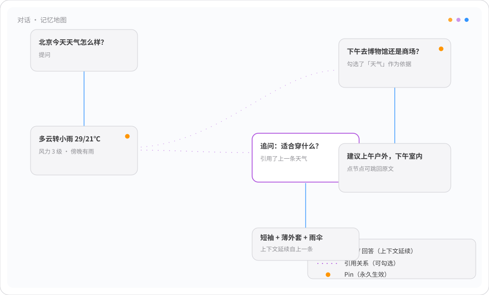
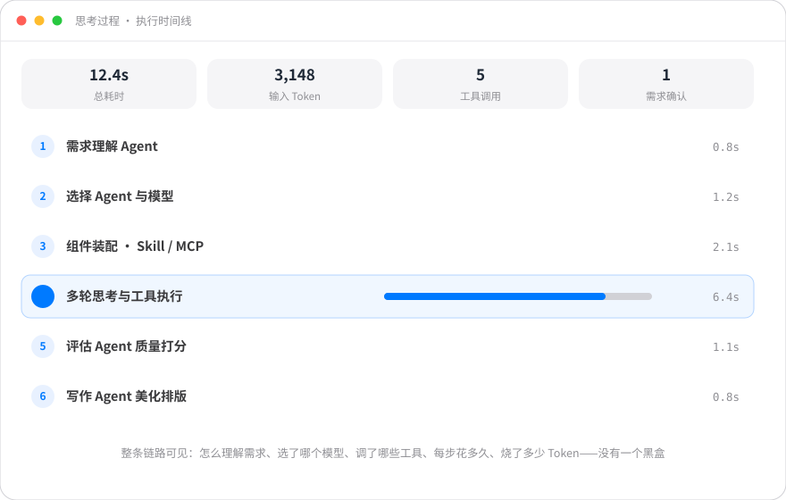
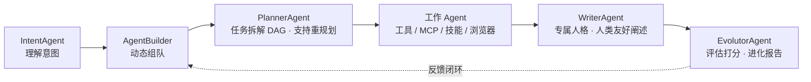

<div align="center">

<a id="top"></a>


[](LICENSE)
[](https://nodejs.org)
[](https://www.typescriptlang.org)
[](https://vuejs.org)
[](#quality)
[](#install)

[亮点功能](#features) · [安装与部署](#install) · [架构](#architecture) · [文档](#docs) · [交流群](#community)


*左边，是你和 AI 的全部记忆画成的一张可操作地图；右边，是正常的对话问答。*


</div>

---

<div align="center">

## 😮‍💨 你一定经历过

</div>

<div align="center">
  
</div>

问题不在模型不够聪明，而在**「记忆方式」错了**——现在几乎所有 AI 的记忆都只有一招：把最近 N 轮硬塞进上下文。

Brian-Agent 的答案：**把记忆变成一张你能看见、能操作、能生长的地图。**

---

<a id="features"></a>

<div align="center">

## ✨ 亮点功能

</div>

<h3 align="center">🗺️ 01 · 记忆地图 —— 你终于能「看见」AI 记住了什么</h3>

<div align="center">
  
</div>

打开对话页，左边不是滚动的气泡，而是一张关系网。每条消息是一个节点，连线是它引用过的关系。更关键的是——**这张图可以操作**：

- **想让 AI 参考哪段旧对话，就勾选哪段。** 本轮回答只读取「你勾选的消息 + 你钉住的消息」，其余一律不进上下文。记忆不再靠它猜，而是你说了算；
- **关键信息，Pin 一次永久生效。** 「我在戒烟，别再推荐酒吧」「代码统一用 TypeScript」——钉住后每轮都在场，不用反复叮嘱；
- **点一下节点，就跳回原文。** 想复盘两周前那次决策怎么来的？直接点过去。

<div align="center">
  
</div>

> **结果很直接：** 上下文更短、回答更准、Token 更省——而且你第一次确切知道，AI 这一轮到底「记得」了什么。

<h3 align="center">🌱 02 · 越长越懂你 —— 它不只是记住，它会长</h3>

你说过的每句话、AI 回过的每段内容，都会在后台被悄悄加工：生成摘要、抽取标签、算出语义向量、提取关键词。时间一长，这些零散信息自己长出了关系——

**涌现图（Tag Graph）**：聊了两个月后打开它，你会发现「旅行规划、天气、地铁出行、博物馆」竟然连成了一整片——这是你自己的知识结构，第一次被真实地画了出来。

<div align="center">
  
</div>

**关键词图（Keyword Graph）**：「灵光一闪」也可以被复现——大脑里的联想往往是被某一个词激活的。点一个词，牵出一整片相关记忆。

<div align="center">
  
</div>

| 🔗 发现你从没意识到的联系 | 🧭 顺着网找记忆 | ✨ 恰到好处地「走神」 |
|---|---|---|
| 节点越大关联越多，颜色越红出现越频繁。有时你会盯着图愣一下：「原来我最近一直在纠结这件事。」 | 除了字面相似，它还沿标签和关键词的关系去捞旧事，常能想起靠搜索根本找不到的过去。 | 检索时掺入极少量看似无关的记忆，避免每次只盯着眼前那点上下文。最好的灵感，常来自意料之外。 |

> **七路混合召回**：`钉选 → 引用 → 时间线 → 标签图谱 → 向量语义 → 全文关键词 → 随机采样`，按优先级互补取材，单路失败自动降级，绝不只靠向量相似度。

<h3 align="center">🔍 03 · 可见的思考 —— 它会主动停下来问：「你是这个意思吗？」</h3>

<div align="center">
  
</div>

AI 最让人不安的，是你永远不知道它「以为」你要什么。Brian-Agent 把这一层彻底摊开：

- **理解没把握时，它先问你，而不是硬答。** 把「它理解成的需求」「匹配度」「判断依据」摆给你看，再让你决定；
- **每次回答都有评分和优化建议。** 点「评估结果」，就能看到这次回答被打了多少分、哪里还能更好；
- **失败也能复盘。** 错误回复会完整保留并标注，附带可复制的 TraceID，定位问题不求人。

<div align="center">
  
</div>

> 一个愿意承认「我可能理解错了」的 AI，比一个永远自信地答错的 AI，可信太多。

<h3 align="center">🧠 04 · 第二大脑 —— 把你的 100 篇笔记，喂成会回答的第二大脑</h3>

你电脑里一定躺着几百篇 Markdown 笔记，写了就再也没打开过。资料库让它们重新活过来：

| 能力 | 说明 |
|---|---|
| 📂 **一个路径就接进来** | 支持直接添加本地目录，自动扫描成目录树，内容完全留在本机 |
| 📖 **开启自学习，让它替你读书** | 系统空闲时自动阅读文档，把长文切块、提炼成知识点，沉淀进记忆网络。下次提问自然参与回答 |
| 🎯 **选中一段，当场就问** | 框选看不懂的段落 → 右键「解释选中内容」→ 答案固定成卡片贴在文档旁（纸质书边注形态），下次打开还在 |
| 💡 **不止积累，还给洞察** | 模式识别 / 趋势分析 / 异常检测 / 关联发现——比如发现一个反复出现却一直被你忽略的主题 |
| 🎚️ **学不学、多主动，你说了算** | 随机因子调高，它空闲时更爱自发学习；想安静，随时暂停 |
| 👤 **它会慢慢形成「你」的画像** | 行业、知识领域、文风、学习倾向持续更新，并保留历史版本，能看到「它眼中的我」的变化 |

<h3 align="center">🤖 05 · 一支会自我进化的 Agent 团队</h3>

一次问答背后是一支分工明确的 Agent 团队，而非单个大模型裸奔：



- **多 Agent 协作**：意图理解 → 动态组建系统 Agent（AgentLibrary 统一管理）→ 任务 DAG 规划 → 执行 → 人格化写作 → 评估进化；任务 DAG 流水图、Agent 执行状态图（灰=待执行/黄=进行中/绿=成功/红=失败）全程可视化；
- **Soul 人格**：每个 Agent 绑定人格灵魂（身份定位、信条、纪律），按任务语义自动生成匹配的人格；
- **自我进化闭环**：从文档 / 对话 / Tag 图三种模式自学习，Evolutor Agent 定期评估并产出进化报告；
- **CDT 浏览器自动化**：Chrome 指纹反检测（bot.sannysoft.com 14+ 检测项实测通过）+ **继承本机 Chrome 登录态**，自动化直接操作你已登录的站点；
- **技能沙箱**：技能代码在 isolated-vm（V8 隔离实例）中硬隔离执行，沙箱初始化失败直接拒绝启动，绝不静默降级。

<h3 align="center">🔒 06 · 你的数据，从头到尾都在你手里</h3>

| 🔒 全在本机 | 🔑 API Key 自己保管 | 📦 解压即用 | 🧩 开源，可自建 |
|---|---|---|---|
| 对话、记忆、资料、画像，全在本机，不上传，不经过任何第三方服务器。 | 内置 OpenAI / Anthropic / DeepSeek / 智谱 / 通义 / 火山引擎等目录，用哪家、花多少你说了算，还能设每日/每月用量上限。 | 发行包内含运行环境，Linux / macOS / Windows 全覆盖，目标机器无需安装任何依赖；程序与数据分离，升级重装都不丢数据。 | Apache 2.0，代码全开放。个人用是本地 Agent，想给团队用也能改造成服务。 |

---

<div align="center">

## ⚖️ 一张表看懂：它和「套壳聊天」的差距

</div>

| 你在意的事 | 常见聊天产品 | Brian-Agent |
|:---:|---|---|
| 长对话记忆 | 自动塞最近 N 轮，容易断片 | 勾选引用 + Pin，你说了算 |
| 记忆长什么样 | 一堆散乱历史 | 一张可拖可点、能看见关系的记忆地图 |
| 越用越懂你 | 基本不变 | 主动学习、知识沉淀、画像持续更新 |
| 本地资料 | 通常不支持 | 本地 Markdown 资料库 + 自学习 + 选中即问 |
| 思考透明 | 黑盒 | 需求确认、工具调用、耗时与评分全可见 |
| 数据归属 | 在平台服务器 | 全在本机，API Key 自己保管 |
| 模型选择 | 平台指定 | 主流提供商任选，含用量限额 |
| 部署形态 | 只能用云 | 本地运行，也能自建为服务 |

---

<a id="install"></a>

<div align="center">

## 🚀 安装与部署

</div>

<div align="center">
  
</div>

### 系统要求

| 项目 | 要求 |
|------|------|
| 操作系统 | Linux x64 · macOS（Intel / Apple Silicon）· Windows x64 |
| Node.js | 仅 **npm 安装方式**需要 18+；一键脚本 / 发行包 / 便携模式**无需 Node**（运行时已内置） |
| 磁盘 | 预留 1GB 以上（发行包内置 Chrome for Testing 时更大） |
| 网络 | 调用模型 API 需可访问对应提供商端点；MCP / 浏览器自动化按需 |

### 四种安装方式

> **发布状态说明**：方式 A / B 依赖 GitHub Releases 上传 4 个平台产物与 npm 包发布——**当前仓库尚未发布**，
> 暂不可用；请先使用 **方式 C / D**（本地构建，完全自包含，三平台均已验证可行）。
> 发布流程见 [packaging/npm/README.md](packaging/npm/README.md)（创建 Release `v<版本>` 并上传平台压缩包 → `npm publish`）。

<details>
<summary><b>方式 A · 一键脚本（Linux / macOS）— 待 Release 发布后可用</b></summary>

无需 Node，脚本自动从 GitHub Releases 下载对应平台发行包并完成安装：

```bash
curl -fsSL https://raw.githubusercontent.com/zhaoxuan-inside/brian-agent/main/packaging/install.sh | bash

# 可选参数
#   --systemd     安装后自动注册 systemd 常驻服务
#   --from <file> 离线安装本地已有的发行包

# Windows（PowerShell）
iwr https://raw.githubusercontent.com/zhaoxuan-inside/brian-agent/main/packaging/install.ps1 -OutFile install.ps1; .\install.ps1
```

</details>

<details>
<summary><b>方式 B · npm 全局包（已有 Node 18+ 的机器）— 待 npm 包发布后可用</b></summary>

```bash
npm i -g brian-agent
```

postinstall 自动识别平台并下载运行时与原生模块，装完即可在**任意目录**使用 `brian` 命令
（下载失败不阻断安装，可稍后 `npm rebuild -g brian-agent` 重试）。

</details>

<details open>
<summary><b>方式 C · 离线安装（本地构建，当前推荐）✅</b></summary>

在有网的构建机上打好发行包，拷贝到目标机器离线安装——不依赖任何外部发布，三平台均可：

```bash
# 构建机：一键打包全部 4 个目标 + .deb + SHA256SUMS（要求构建机为 Node 22）
python3 packaging/pack.py
python3 packaging/pack.py --targets linux-x64,win32-x64   # 仅指定目标
python3 packaging/pack.py --skip-chromium                 # 不内置 Chrome（体积 -150MB/目标）

# 产物在 dist-pack/：Linux/macOS 为 .tar.gz，Windows 为 .zip，Linux 另有 .deb
# 支持在任一平台交叉打包全部目标（Linux 产 .deb 需本机有 dpkg-deb）

# 目标机：离线安装
./packaging/install.sh --from dist-pack/brian-agent-linux-x64.tar.gz        # Linux/macOS
.\install.ps1 -From dist-pack\brian-agent-win32-x64.zip                     # Windows
sudo dpkg -i dist-pack/brian-agent-linux-x64.deb                            # Linux .deb（含 /usr/bin/brian）

brian start        # 启动 → http://127.0.0.1:8000，打开 /config 填入 API Key 即可对话
```

</details>

<details open>
<summary><b>方式 D · 便携模式（免安装，解压即用）✅</b></summary>

不装进系统也可以——解压直接运行，数据落在包内 `data/`，适合 U 盘随身携带：

```bash
tar -xzf brian-agent-linux-x64.tar.gz && cd brian-agent-linux-x64
./brian.sh start                    # Windows: brian.cmd start
```

| 平台 | 产物 | 启动方式 |
|------|------|---------|
| Linux | `brian-agent-linux-x64.tar.gz` 或 `.deb` | 解压后 `./brian.sh start`；`.deb` 安装后直接用 `brian` 命令（/usr/bin/brian） |
| macOS（Intel / Apple Silicon） | `brian-agent-darwin-*.tar.gz` | 解压 → `xattr -dr com.apple.quarantine brian-agent-*` → `./brian.sh start` * |
| Windows | `brian-agent-win32-x64.zip` | 解压 → `brian.cmd start`（前台：`brian.cmd serve`） |

\* Intel Mac（darwin-x64）暂未内置 isolated-vm 预编译二进制，JS 技能沙箱自动降级禁用（启动时警告，其余功能完整）；Apple Silicon 不受影响。

</details>

### 常驻服务（systemd，Linux 可选）

`.deb` 安装后服务已注册，直接启用即可；一键脚本加 `--systemd` 参数也会自动安装：

```bash
sudo systemctl enable --now brian-agent   # 开机自启 + 立即启动
systemctl status brian-agent              # 查看状态
```

### 开发模式（源码运行）

```bash
git clone https://github.com/zhaoxuan-inside/brian-agent.git brian-agent && cd brian-agent

npm install          # 安装依赖（postinstall 自动就位原生模块）

./brian start        # 启动后端(:8000) + 前端(:5173)
./brian open         # 浏览器打开前端

# 开发调试
./brian dev          # 前台全栈，改完代码看日志，Ctrl+C 关闭
./brian serve        # 只跑后端（headless）
```

### brian CLI 命令速查

| 命令 | 说明 | 命令 | 说明 |
|------|------|------|------|
| `brian start [backend\|frontend]` | 后台启动（默认全部） | `brian stop [service]` | 停止（先 SIGTERM 优雅关闭） |
| `brian restart [service]` | 重启 | `brian status` | 查看运行状态与访问地址 |
| `brian logs [service]` | 实时跟踪日志 | `brian open` | 浏览器打开前端（未运行则自动启动） |
| `brian dev` | 前台全栈（Ctrl+C 一键停止） | `brian serve` | 前台 headless 后端 |
| `brian doctor` | 环境与依赖自检 | `brian clean` | 清理 /tmp 日志与 PID 残留 |

### 环境变量

| 变量 | 默认值 | 说明 |
|------|--------|------|
| `BRIAN_PORT` | `8000` | 后端端口（前端开发模式 Vite 固定 5173，代理 `/api` 与 `/ws`） |
| `BRIAN_HOST` | `127.0.0.1` | 监听地址，对外服务设 `0.0.0.0` |
| `BRIAN_DATA_DIR` | `~/.brian-agent`（Windows `%APPDATA%\brian-agent`） | 数据目录；便携模式固定为包内 `data/` |

### 首次运行须知

- 包内**不含数据库**：`data/` 在首次运行时自动创建（表结构与默认配置种子自动初始化）；
- **通用目录数据已随包预置**：13 家模型提供商目录与 MCP 提供商列表（阿里云百炼 / ModelScope / GitHub / Smithery 等）首次运行时自动导入；提供商目录**不含 API Key**，需在 `/config` 页选择提供商并填入自己的 Key 才能开始对话；
- **个人数据不打包**：API Key、对话、记忆等只存在于你的数据目录；
- **程序与数据分离**：升级、重装都不影响数据；Windows 首次运行若被 SmartScreen 拦截，选择「仍要运行」。

### 升级

```bash
npm update -g brian-agent                          # npm 方式（待 npm 包发布后可用）
./packaging/install.sh --from <新版发行包>          # 离线方式：重新执行即可覆盖升级
# 或覆盖解压新发行包 / sudo dpkg -i 新 .deb
```

数据目录与程序目录独立，升级后对话、记忆、配置原样保留。

> 更多打包原理与部署细节见 [packaging/README.md](packaging/README.md) 与 [docs/打包部署.md](docs/打包部署.md)。

---

<a id="architecture"></a>

<div align="center">

## 🏗️ 架构一览

</div>

npm workspaces 单仓库，后端按 DDD 分为 5 个严格分层的包，依赖单向：`base ← core ← runtime ← agent ← application`；前端经 Vite 代理访问后端。

| 包 | 层级 | 职责 |
|----|------|------|
| `@brian-agent/base` | 基础构件层 | RelationDB(SQLite) / GraphDB / VectorDB(LanceDB) / LLM / MCP / MQ / CDT 浏览器 / Prompts / Skill 沙箱 / Soul / Cron / Stream / 反馈 |
| `@brian-agent/core` | 基础层 | InfoCore(记忆核心) / LLMCore / MCPCore / SkillCore / SoulCore / MQCore / CDTCore |
| `@brian-agent/runtime` | 编排内核 | Runtime v2「代码即编排」：Session / Runs / 两级 Agent Loop（迭代预算 + 真取消）/ Tools / 事件总线 |
| `@brian-agent/agent` | Agent 层 | AgentLibrary / AgentBuilder / AgentContext / AgentExecution + Planner / Writer / Evolutor / Intent / Summary |
| `@brian-agent/application` | 应用层 | Chat / Config / SelfLearning / UserProfile / Visualization |
| `@brian-agent/frontend` | 前端 | Vue 3 + Pinia + Vite + Tailwind CSS（Apple 风格主题，明暗双主题 + 中英双语），Notion 式块渲染 |
| `@brian-agent/shared` | 共享 | Zod schema + TypeScript 类型 |

**技术栈**：TypeScript · 纯 `node:http` + `ws`（无 Web 框架）· better-sqlite3 / isolated-vm / LanceDB（离线预编译原生件）· SSE 流式 · Node 22。

---

<a id="quality"></a>

<div align="center">

## 🧪 质量与测试

</div>

全仓库统一五参方法签名（`Promise<boolean> method(input, context, output, …)`）+ AOP 织入，506 个公开方法由脚本自动生成索引。

```bash
npm run test          # 后端 5 层 vitest（1800+ 用例，逐工作区聚合执行）
npm run typecheck     # 后端 5 层 tsc --noEmit
npm run lint          # 前端 ESLint
npm run lint:backend  # 后端 ESLint
npm run build         # 按依赖顺序构建全部（前端含 vue-tsc 类型检查）
npm run docs:index    # 重新生成方法自动索引
```

---

<a id="docs"></a>

<div align="center">

## 📚 文档

</div>

| 文档 | 内容 |
|------|------|
| [docs/AgentThink.md](docs/_0_DesignPrinciples/AgentThink.md) | 设计哲学与 Agent 思考模型 |
| [docs/index.md](docs/index.md) | 文档总索引（需求关键词 → 文档 → 代码 三跳可达） |
| [docs/使用手册.md](docs/使用手册.md) | 日常启动/关闭与管理操作 |
| [docs/打包部署.md](docs/打包部署.md) | 打包原理与部署细节 |
| [docs/_01_TerminologyStandardization.md](docs/_01_TerminologyStandardization.md) | 术语标准化（msg_id / interact_id / work_id / session_id） |
| [docs/_1_DevStandards/DevStandards.md](docs/_1_DevStandards/DevStandards.md) | 开发强制规范（方法签名 / AOP / 分层） |
| [docs/TODO-List.md](docs/TODO-List.md) | 待开发功能清单 |

---

<a id="community"></a>

<div align="center">

## 💬 交流

使用技巧、问题反馈、更新预告都在群里。扫下面的二维码，或直接搜索群号加入。

| QQ 群（群号 `942758906`） | 微信群 |
|:---:|:---:|
|  |  |
| 扫码加入，或 QQ 搜索群号 | 微信扫一扫，直接进群（群满时可先加 QQ 群备用） |

---

**Brian-Agent · 一个会记住你、也会自己长大的本地个人 Agent**

GitHub · TypeScript · Vue 3 · Apache 2.0

</div>
