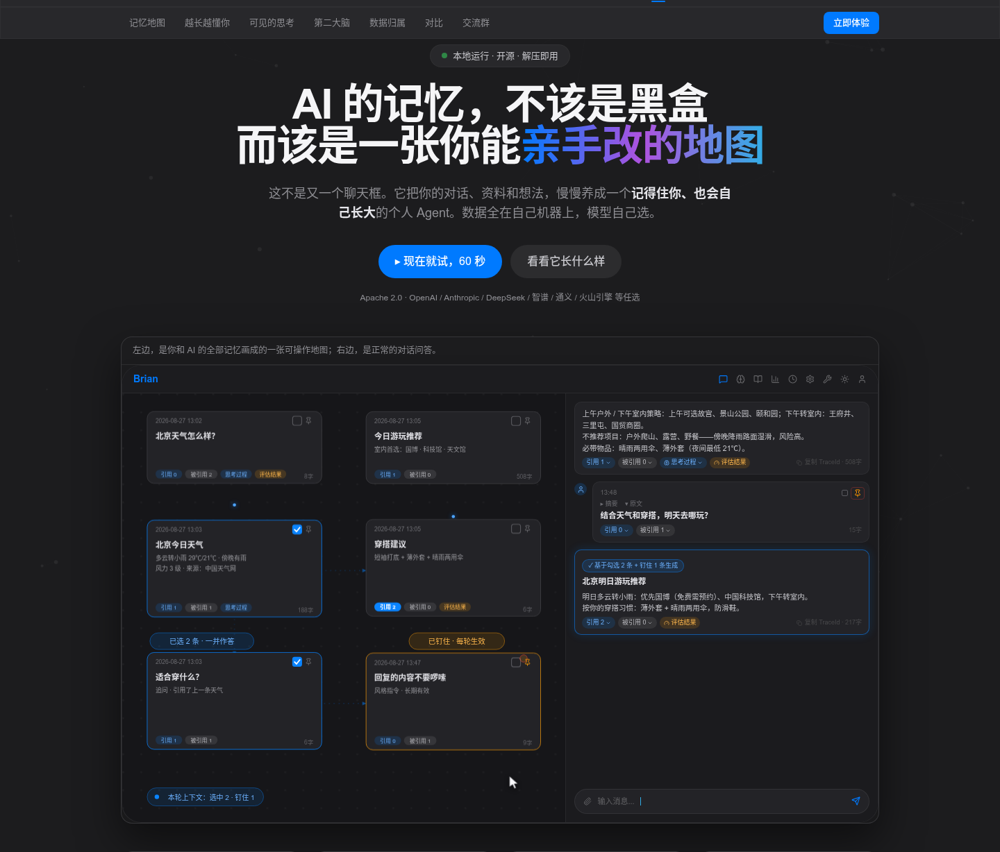
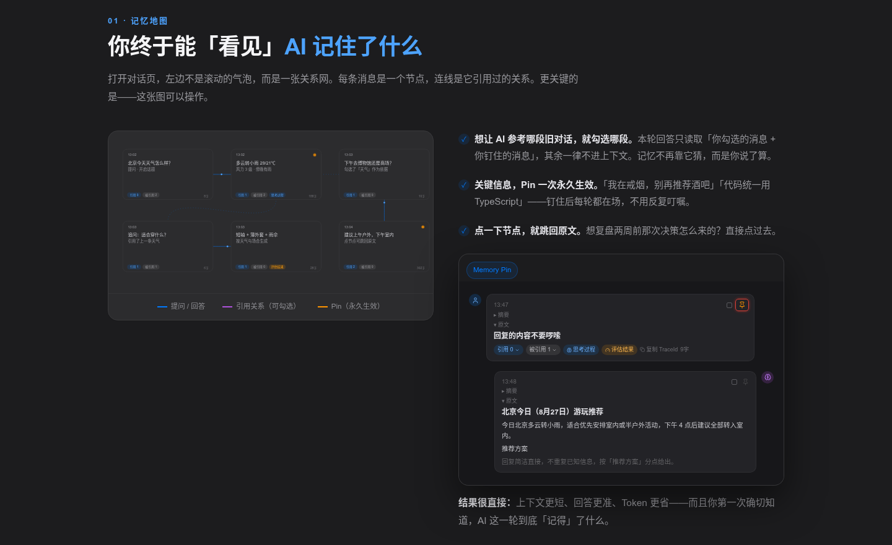
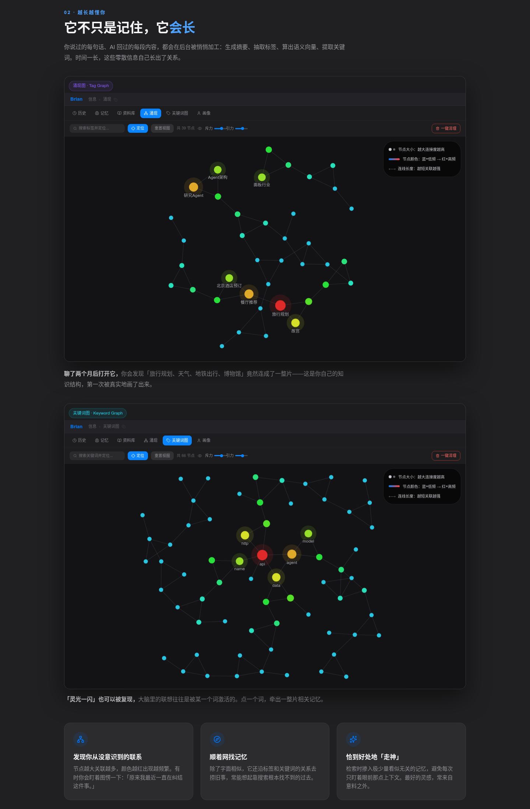
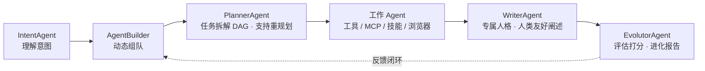

# Brian-Agent

一个具备**记忆、人格、反思与自我进化**能力的本地个人 Agent —— 不是做一个「工具」，而是做一个「人」。

对话被组织成一张可操作的**记忆地图**：想让 AI 参考哪段旧对话就勾选哪段，关键信息 Pin 一次永久生效；上下文按**七路混合召回**取材；一支多 Agent 团队负责规划、执行、写作与评估，并从你的文档与对话中持续学习进化。**数据 100% 留在本机，模型任选。**

[](LICENSE)


<details>
<summary>📷 产品预览（点击展开）</summary>







</details>

## 核心特性

| 特性 | 说明 |
|------|------|
| **ChatMap 记忆地图** | 对话是一张可操作的关系图：勾选引用、Pin 钉住、点节点跳回原文，上下文由你说了算 |
| **七路混合记忆召回** | 钉选 → 引用 → 时间线 → 标签图谱 → 向量 → 全文 → 随机，按优先级互补取材，单路失败自动降级 |
| **涌现图 & 关键词图** | 基于共现关系的知识图谱，自动发现记忆中的隐藏关联，反哺检索质量 |
| **多 Agent 协作** | 意图理解 → 动态组队 → 任务 DAG 规划 → 执行 → 人格化写作 → 评估进化，全程 DAG 可视化 |
| **自我进化闭环** | 从文档 / 对话 / Tag 图三种模式自学习，Evolutor Agent 定期评估并产出进化报告 |
| **Soul 人格 & 用户画像** | 每个 Agent 绑定人格灵魂；画像持续沉淀，可回溯「它眼中的我」的历史版本 |
| **CDT 浏览器自动化** | Chrome 指纹反检测（sannysoft 14+ 项通过）+ 继承本机 Chrome 登录态 |
| **资料库阅读器** | 本地 Markdown 目录接入，划词即问，问答以纸质书边注形态对齐正文 |
| **技能沙箱** | isolated-vm 硬隔离执行；沙箱初始化失败拒绝启动，绝不静默降级 |
| **全链路可观测** | 需求确认、执行时间线、Token/耗时、评分反馈、TraceID 复盘，没有一个黑盒 |
| **数据 100% 本机** | 对话 / 记忆 / 资料 / 画像不上传；API Key 自保管，可设用量上限 |

### 多 Agent 协作流程



## 快速开始

```bash
# 1. 安装（当前发布阶段推荐离线安装，详见下方「安装部署」）
python3 packaging/pack.py --targets linux-x64            # 构建机需 Node 22
./packaging/install.sh --from dist-pack/brian-agent-linux-x64.tar.gz

# 2. 启动
brian start           # → http://127.0.0.1:8000

# 3. 打开 /config，选一家模型提供商、填入自己的 API Key，开始对话
```

## 安装部署

| 方式 | 平台 | 前置条件 | 状态 |
|------|------|---------|------|
| [A · 一键脚本](#a--一键脚本linux--macos) | Linux / macOS | 无需 Node | ⏳ 待 Release 发布 |
| [B · npm 全局包](#b--npm-全局包) | 全平台 | Node 18+ | ⏳ 待 npm 包发布 |
| [C · 离线安装](#c--离线安装当前推荐) | 全平台 | 构建机 Node 22 | ✅ 当前推荐 |
| [D · 便携模式](#d--便携模式解压即用) | 全平台 | 无 | ✅ 可用 |

> A / B 依赖 GitHub Releases 上传平台产物与 npm 包发布，当前仓库尚未发布；发布流程见 [packaging/npm/README.md](packaging/npm/README.md)。

### A · 一键脚本（Linux / macOS）

```bash
curl -fsSL https://raw.githubusercontent.com/zhaoxuan-inside/brian-agent/main/packaging/install.sh | bash
# 可选：--systemd 注册常驻服务；--from <file> 离线安装

# Windows（PowerShell）
iwr https://raw.githubusercontent.com/zhaoxuan-inside/brian-agent/main/packaging/install.ps1 -OutFile install.ps1; .\install.ps1
```

### B · npm 全局包

```bash
npm i -g brian-agent      # postinstall 自动下载平台运行时；失败可 npm rebuild -g 重试
```

### C · 离线安装（当前推荐）

在有网的构建机上打包，拷贝到目标机安装。不依赖任何外部发布，支持交叉打包全部平台：

```bash
python3 packaging/pack.py                              # 全部 4 目标 + .deb + SHA256SUMS
python3 packaging/pack.py --targets linux-x64,win32-x64  # 仅指定目标
python3 packaging/pack.py --skip-chromium                # 不内置 Chrome（-150MB/目标）

# 目标机安装
./packaging/install.sh --from dist-pack/brian-agent-linux-x64.tar.gz   # Linux / macOS
.\install.ps1 -From dist-pack\brian-agent-win32-x64.zip                # Windows
sudo dpkg -i dist-pack/brian-agent-linux-x64.deb                       # Linux .deb（含 /usr/bin/brian）
```

### D · 便携模式（解压即用）

数据落在包内 `data/`，适合 U 盘随身携带：

| 平台 | 产物 | 启动 |
|------|------|------|
| Linux | `brian-agent-linux-x64.tar.gz` / `.deb` | `./brian.sh start`；`.deb` 装后直接 `brian` |
| macOS | `brian-agent-darwin-*.tar.gz` | `xattr -dr com.apple.quarantine brian-agent-*` → `./brian.sh start` |
| Windows | `brian-agent-win32-x64.zip` | `brian.cmd start` |

> Intel Mac（darwin-x64）暂未内置 isolated-vm 预编译件，JS 技能沙箱自动降级禁用（其余功能完整）；Apple Silicon 不受影响。

### 系统要求

| 项目 | 要求 |
|------|------|
| 操作系统 | Linux x64 · macOS（Intel / Apple Silicon）· Windows x64 |
| Node.js | 仅 npm 安装方式需要 18+；其余方式无需 Node（运行时已内置） |
| 磁盘 | 1GB 以上（内置 Chrome for Testing 时更大） |

### 常驻服务与开发模式

```bash
# systemd 常驻（.deb 已注册；一键脚本 --systemd 同效）
sudo systemctl enable --now brian-agent

# 开发模式（源码运行）
git clone https://github.com/zhaoxuan-inside/brian-agent.git && cd brian-agent
npm install            # postinstall 自动就位原生模块
./brian start          # 后端 :8000 + 前端 :5173
./brian dev            # 前台全栈，Ctrl+C 一键停止
```

### 环境变量

| 变量 | 默认值 | 说明 |
|------|--------|------|
| `BRIAN_PORT` | `8000` | 后端端口 |
| `BRIAN_HOST` | `127.0.0.1` | 监听地址（对外设 `0.0.0.0`） |
| `BRIAN_DATA_DIR` | `~/.brian-agent` | 数据目录（Windows `%APPDATA%\brian-agent`） |

> 程序与数据分离：升级 / 重装不影响数据。Windows 首次运行被 SmartScreen 拦截时选择「仍要运行」。

## brian CLI

| 命令 | 说明 | 命令 | 说明 |
|------|------|------|------|
| `brian start [svc]` | 后台启动 | `brian stop [svc]` | 优雅停止 |
| `brian restart [svc]` | 重启 | `brian status` | 运行状态 |
| `brian logs [svc]` | 跟踪日志 | `brian open` | 浏览器打开前端 |
| `brian dev` | 前台全栈 | `brian serve` | 前台 headless 后端 |
| `brian doctor` | 环境自检 | `brian clean` | 清理日志与 PID |

## 架构

npm workspaces 单仓库，后端按 DDD 严格分层，依赖单向：`base ← core ← runtime ← agent ← application`。

| 包 | 层级 | 职责 |
|----|------|------|
| `@brian-agent/base` | 基础构件层 | RelationDB(SQLite) / GraphDB / VectorDB(LanceDB) / LLM / MCP / MQ / CDT / Prompts / Skill 沙箱 / Soul / Cron / Stream |
| `@brian-agent/core` | 基础层 | InfoCore(记忆核心) / LLMCore / MCPCore / SkillCore / SoulCore / MQCore / CDTCore |
| `@brian-agent/runtime` | 编排内核 | Runtime v2「代码即编排」：Session / Runs / 两级 Agent Loop（迭代预算 + 真取消）/ Tools / 事件总线 |
| `@brian-agent/agent` | Agent 层 | AgentLibrary / AgentBuilder / AgentExecution + Planner / Writer / Evolutor / Intent / Summary |
| `@brian-agent/application` | 应用层 | Chat / Config / SelfLearning / UserProfile / Visualization |
| `@brian-agent/frontend` | 前端 | Vue 3 + Pinia + Vite + Tailwind CSS，Notion 式块渲染，明暗双主题 + 中英双语 |
| `@brian-agent/shared` | 共享 | Zod schema + TypeScript 类型 |

技术栈：TypeScript · 纯 `node:http` + `ws`（无 Web 框架）· better-sqlite3 / isolated-vm / LanceDB · SSE 流式 · Node 22。

## 质量与测试

全仓库统一五参方法签名（`Promise<boolean> method(input, context, output, …)`）+ AOP 织入，506 个公开方法由脚本自动生成索引。

```bash
npm run test          # 后端 5 层 vitest（1800+ 用例，聚合执行）
npm run typecheck     # tsc --noEmit
npm run lint:backend  # 后端 ESLint
npm run build         # 按依赖顺序构建全部（前端含 vue-tsc）
npm run docs:index    # 重新生成方法自动索引
```

## 文档

| 文档 | 内容 |
|------|------|
| [AgentThink](docs/_0_DesignPrinciples/AgentThink.md) | 设计哲学与 Agent 思考模型 |
| [文档总索引](docs/index.md) | 需求关键词 → 文档 → 代码 三跳可达 |
| [使用手册](docs/使用手册.md) | 日常启动 / 关闭与管理 |
| [打包部署](docs/打包部署.md) | 打包原理与部署细节 |
| [开发规范](docs/_1_DevStandards/DevStandards.md) | 方法签名 / AOP / 分层强制规范 |
| [TODO-List](docs/TODO-List.md) | 待开发功能清单 |

## 交流

QQ 群 `942758906`（扫码或搜索群号）；微信群扫一扫直接进群，群满时先加 QQ 群备用。

| QQ 群 | 微信群 |
|:---:|:---:|
|  |  |

## 许可证

[Apache-2.0](LICENSE)
