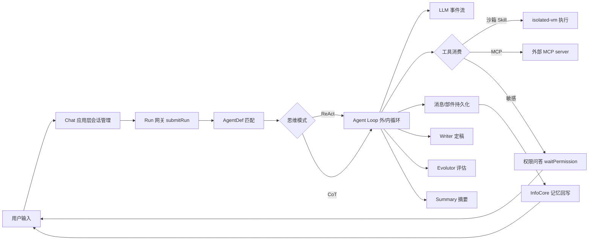

# 01 需求与业务原理(_01_business)

> 状态:confirmed　更新:2026-09-26
> 来源:P0 澄清记录(00_p0_clarification.md)+ 存量代码反向梳理 + README.md

## 1. 需求背景

Brian-Agent 是一个**具备记忆、人格、反思与自我进化能力的本地个人 Agent**——产品目标不是做一个"工具",而是做一个"人"。数据 100% 留在本机(SQLite + LanceDB + 文件),模型任选(多供应商策略族)。

现状痛点(产品视角):
1. 通用对话产品无长期记忆:跨会话遗忘,无法沉淀用户偏好与知识。
2. 工具型 Agent 缺乏人格连续性与自我演化:不会复盘、不会淘汰差的执行策略。
3. 云端 Agent 隐私成本高:个人资料必须上传才能被利用。

## 2. 目标与非目标

| 类型 | 内容 |
|---|---|
| 目标 In | 本地全量数据(记忆/向量/图谱/日志);七路混合记忆召回;多 Agent 协作(Intent→Builder→Loop→Writer→Evolutor);自我进化闭环(评估→淘汰→重建);Soul 人格与用户画像;CDT 浏览器自动化(继承本机登录态);isolated-vm 技能沙箱;MCP 外部工具通道;全链路可观测(trace_id + Metrics spans + Report 事件流);零 Web 框架依赖(node:http);离线分发(prebuilt 原生二进制) |
| 非目标 Out | 不做多租户/云端 SaaS;不做移动端原生 App;不做分布式部署;不引入 Web 框架(Express/Koa);前端不做服务端渲染 |

## 3. 用户故事

```text
作为个人用户,我希望与 Agent 对话时它记住我过去的偏好与资料,以便无需重复交代背景。
作为个人用户,我希望看到 Agent 的思考过程与工具调用,以便信任并干预它的行为。
作为个人用户,我希望敏感工具执行前获得询问,以便拦截危险动作。
作为个人用户,我希望在记忆地图上勾选引用/Pin/跳回原文,以便精确控制上下文注入。
作为个人用户,我希望 Agent 自动复盘评估并淘汰低效执行方式,以便越用越顺手。
作为开发者(本人),我希望代码可索引、文档与代码一致,以便长期低心智负担地演进。
```

## 4. 业务流程



## 5. 领域概念表

| 概念 | 定义 | 与其他概念的关系 |
|---|---|---|
| Info(记忆) | 用户对话中沉淀的记忆条目,带类型(REQUEST/TRACE/…)、标签、向量 | InfoCore 管理;被七路召回引用 |
| Session | 会话。双层:应用层 chat_session + 运行时 runtime_session/message/part 三表 | Chat 与 Runtime 各持一份,消息回写对齐 |
| Run | 一次执行单元:从 submitRun 到 settleRun 的全生命周期 | RunGateway 管理;Lane 控制并发 |
| AgentDef | 运行时 Agent 声明(向量+规则匹配) | Loop 执行的执行体 |
| Agent(库) | AgentLibrary 中可复用的 Agent 定义(snapshot) | matchAgent 选中后实例化为 Run |
| Skill | 一等工具:内置 5 系统技能 + 用户技能(isolated-vm 沙箱)+ MCP 包装(mcp_exec) | 取代旧 Tool 概念的执行面 |
| MCP | Model Context Protocol 外部工具通道 | 生命周期由 MCPProvider/MCPCoreProvider 管理 |
| ToolProvider | 内置纯函数工具原语(JSON/XML/Cron/Regex/ID/HTTP) | 旧"Tool"概念的收窄残留,单一事实源 |
| Soul | 人格提示词实体 | matchSoul 注入 LLM 系统提示 |
| Trace | trace_id 贯穿的执行踪迹 = Metrics(spans) + Report(事件) + InfoCore TRACE 条目 | 全链路可观测 |
| Run 报告(Report) | 会话级流式事件通道(SSE 帧底座) | Report.pushText/pushEvent |
| 用户画像(UserProfile) | 从对话自动归纳的用户维度画像 | WriterAgent.saveUserProfile |
| 自学习(SelfLearning) | 本地知识库扫描→任务队列→insights→知识激活 | Application 层独立模块 |
| Lane | Run 的并发通道与信号量 | RunGateway 内部 |

## 6. 边界与异常场景

| 场景 | 触发条件 | 期望行为 |
|---|---|---|
| 敏感工具调用 | 工具被标记需授权 | RunGateway.waitPermission 挂起,前端 /api/chat/permission/answer 应答后继续 |
| LLM 供应商故障 | 某策略请求失败 | 策略族 failover,事件流报错帧 |
| 会话溢出 | checkSessionOverflow 超限 | 拒绝新建或滚动摘要 |
| 沙箱执行异常 | isolated-vm 抛错 | fail-fast,错误经 Output.error 上报 |
| 迭代超预算 | IterationBudget 耗尽 | 终止循环并 settleRun(带原因) |
| 启动种子失败 | seed JSON 缺失/损坏 | 静默跳过,不阻塞启动 |
| WebSocket 未启用 | /ws 仅 echo 占位 | 推送一律走 SSE(StreamProvider) |

## 7. 验收标准(EARS)

存量功能回归(本次重构不得破坏):

```text
WHEN 用户发送一条消息 THE SYSTEM SHALL 完整走 通 submitRun→Loop→Writer→记忆回写 链路并以 SSE 结构化帧返回。
WHEN 匹配不到合适 Agent THE SYSTEM SHALL 降级到默认执行体并记录 evolution(Output.error_code)。
WHEN 敏感工具触发 THE SYSTEM SHALL 挂起等待用户授权应答。
WHEN 启动时 THE SYSTEM SHALL 按 SchemaInitializer 建表并应用系统种子,失败不阻塞。
WHEN 运行 npm test THE SYSTEM SHALL 5/5 工作区全部通过。
```

本次需求(R1~R4)验收见 `00_p0_clarification.md` 第 3 节。

R5 历史会话卡片与图谱治理验收(EARS):

```text
WHEN 用户进入「信息 > 历史」页面 THE SYSTEM SHALL 展示会话卡片，包含8~12字标题、创建时间、全量Token消耗、成对问答轮数、总字符数（问+答）、默认前4个标签及超出时的“更多标签”按钮。
WHEN 会话标题生成或更新时 THE SYSTEM SHALL 从源头控制标题长度在8~12字以内。
WHEN 用户点击标签更多按钮 THE SYSTEM SHALL 弹出模态框展示该会话全部关联标签。
WHEN 用户删除会话 THE SYSTEM SHALL 级联删除会话表、消息、运行时表、llm_call_log全量Token记录及编排轨迹，同时仅解除图谱消息关联，保留共享Tag/keyword图节点。
WHEN 执行图节点修复学习 THE SYSTEM SHALL 检测并物理删除完全无消息关联的孤立图节点与游离边。
WHEN 用户点击卡片空白或主体区域 THE SYSTEM SHALL 路由跳转至 /chat?session={sessionId}。
```

R6 三表重构与复选框上下文增强验收(EARS):

```text
WHEN 系统初始化存储层 THE SYSTEM SHALL 创建 dialog、execute、context 三张物理表并建立索引，同时通过 info_raw 视图保证旧调用兼容。
WHEN 智能体产生问答消息（REQUEST/RESPONSE）THE SYSTEM SHALL 持久化至 dialog 表，不含执行过程字段。
WHEN 智能体产生中间执行日志（组件调用、思考反思等）THE SYSTEM SHALL 结构化记录至 execute 表（含组件类型、执行序号、输入、输出及耗时 gap）。
WHEN 触发上下文构建且用户勾选了历史消息 THE SYSTEM SHALL 将选中消息存入 citing 候选，并从 context 表反查被选消息当时使用的上下文消息回填至 timeline 候选。
WHEN 用户刷新页面 THE SYSTEM SHALL 自动重置前端复选与 Pin 置顶状态，不影响已持久化的历史问答快照。
```

## 8. 未决问题

| 问题 | 影响 | 状态 |
|---|---|---|
| IntentAgent.understandRequirement 无生产调用方 | 潜在死代码,留任务卡核查 | open |
| /ws WebSocket 仅 echo 占位 | 文档中标注为占位通道 | resolved(记录现状) |
| AgentExecution v1 与 Runtime Loop v2 并存 | 新代码一律走 v2;v1 保留兼容 | resolved(记录现状) |
| R5 会话卡片改造与图数据治理 | 经 P0 澄清完成确认 | confirmed |
| R6 消息三表重构与上下文回溯 | 用户已确认三表字段设计与前端生命周期 | confirmed |

