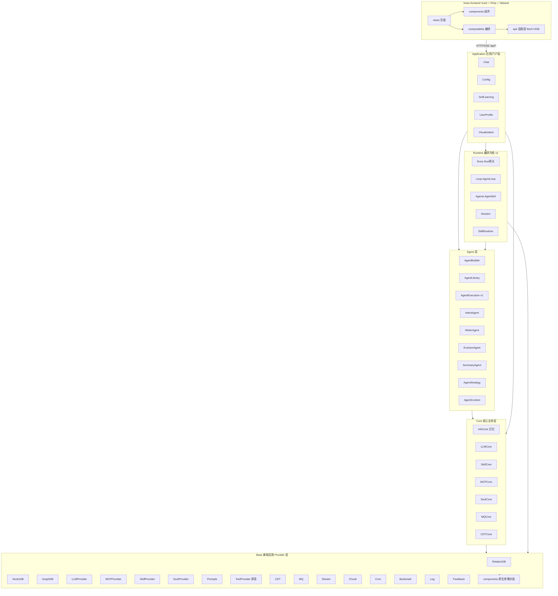

# 01 架构与模块职责(_04_framework_design)

> 状态:reviewed　更新:2026-09-30(chg-045 ADR-013)

## 1. 分层架构图

npm workspaces 单仓库;后端依赖严格单向,前端经 HTTP/SSE 访问 Application 层。

依赖方向(自上而下单向,禁止反向/循环):`application → runtime → agent → core → base`;frontend → application(HTTP 契约)。共用件:shared(Zod 契约 + TaskEvent/RunObservation 观测契约与唯一 reducer,ADR-013)、各层 `shared/`(Base/base 类型与 AOP、Core 匹配引擎共用件、Runtime IterationBudget、Agent AgentKit)。

## 2. 模块职责表

| 模块 | 层 | 职责 | 对应 _01 需求 | 对外暴露(见 _06) |
|---|---|---|---|---|
| dev-server | 入口 | HTTP/WS 服务器 + 组合根 buildContext + 路由 | 全部 | ~125 条 /api/* 路由 |
| Application/Chat | app | 会话管理、SSE 对话编排(openChatStreamV2) | US-1/2/3 | /api/chat/*(13) |
| Application/Config | app | 配置树/模型/供应商/人格/MCP 配置 | US-6 | /api/config*(12) |
| Application/SelfLearning | app | 知识库扫描、任务队列、insights、知识激活 | US-5 | /api/learning/*(12) |
| Application/UserProfile | app | 用户画像维度分析/生成 | US-5 | /api/profile/*(8) |
| Application/Visualization | app | 消息图/DAG/Agent 追溯可视化 | US-2 | /api/visualization/* |
| Runtime/Runs | app | Run 生命周期网关、Lane 并发、权限问答 | US-1/3 | 内部接口 |
| Runtime/Loop | app | 两级 ReAct/CoT 循环、工具消费、消息部件持久化 | US-1/2 | 内部接口 |
| Runtime/Agents | app | AgentDef 声明与向量+规则匹配 | US-1 | 内部接口 |
| Runtime/Session | app | runtime_session/message/part 三表 | US-1 | 内部接口 |
| Runtime/SkillRuntime | app | 技能注册/执行、5 内置技能、zodToJSONSchema | US-4 | 内部接口 + /api/skill |
| Agent/*(9 模块) | app | Agent 构建/库/策略/上下文/执行(v1)/Intent/Writer/Evolutor/Summary | US-1/5/6 | /api/agent*、/api/library/* |
| Core/InfoCore | domain | 记忆核心:save/vector/tag/summary、共现图与引文图 | US-1/5 | /api/memory/*(9) |
| Core/LLMCore·SkillCore·MCPCore·SoulCore | domain | 匹配/配额/老化/优化 | US-1/4 | 内部接口 |
| Core/MQCore·CDTCore | domain | 队列 worker、浏览器动作编排 | US-4 | /api/cdt/*(17) |
| Base/*(19 Provider) | infra | 存储三库/LLM 策略族/MCP/沙箱/Soul/提示词/工具原语/CDT/MQ/Observability(事件总线)/Stream(纯传输)/Chunk/Cron/Bookmark/Log/Feedback | 全部 | /api/vectordb、/api/bookmark、/api/tool/*、/api/cron、/api/monitor、/api/analytics、/api/llm/token-usage、/api/feedback、/api/prompts |
| shared(workspace) | common | Zod schema + TS 类型契约 | — | npm 包 |
| brian-frontend | UI | 全部页面与交互 | 全部 | 页面路由(见 _06 路由契约) |

## 3. 依赖规则

- 单向依赖:application → runtime → agent → core → base;下层禁止 import 上层。
- 跨模块调用只走对方 Access(access/*Access.ts);禁止绕过 Access 直用 Service。
- 外部组件只在 Base/components 与各 Provider infrastructure 内 import;业务代码零直接依赖(node:http/ws 在 dev-server 入口豁免)。
- algorithm 类纯工具在各层 `shared/`;公共基类只在 Base/shared/base。

## 4. 公共机制

| 机制 | 方案 | 说明 |
|---|---|---|
| 配置 | Config 模块配置树 + 环境变量(BRIAN_PORT/HOST/DATA_DIR) | 配置变更历史与 Diff 落库 |
| 日志 | LogProvider(老化)+ AopProxy 统一访问日志 | no-console 为 lint error |
| 异常 | Output.error/error_code 统一承载;ValidationError 等 Base/shared/errors | 禁止吞异常 |
| 追踪 | Metrics.spans + trace_id 贯穿三库;Report 事件流 | Access 层 AOP 自动进出入计时 |
| 事务 | SQLite WAL;跨库无分布式事务,以单库批次为准 | — |
| 组合根 | dev-server buildContext 手动构造全部 Access 注入 | 本次 R3 拆分为域容器 |
| 种子 | seed/systemSeed.ts 启动时按表导入,失败不阻塞 | — |
| 分发 | prebuilt 原生二进制 + packaging/pack.py(tar.gz/zip/deb/SEA) | postinstall 复制预编译产物 |
