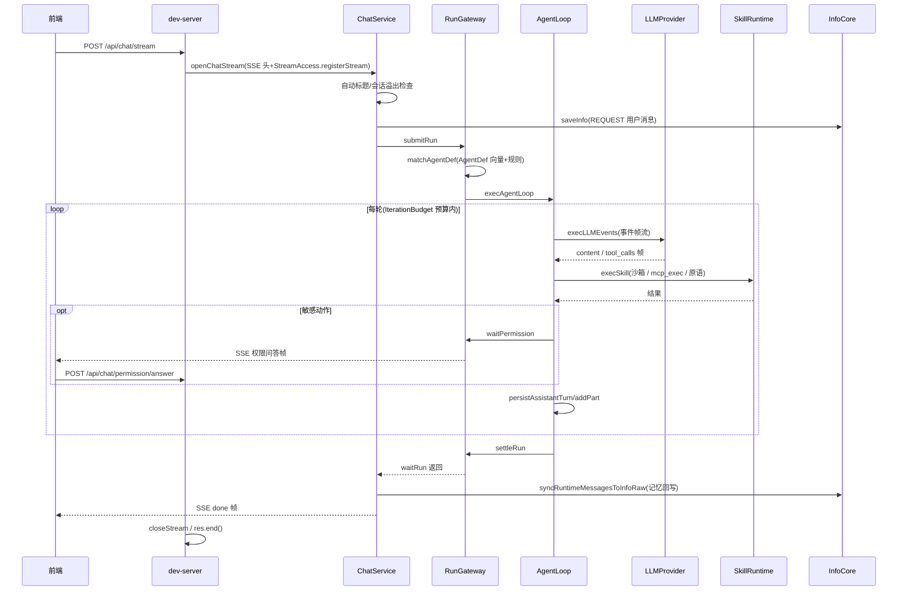

# 02 数据流与调用流(_04_framework_design)

> 状态:reviewed　更新:2026-09-26

## 1. 核心数据流:一次对话(SSE)



副链:WriterAgent.execWrite(定稿)→ UserProfile.saveUserProfile(画像);EvolutorAgent 评估(评估→淘汰→重建);SummaryAgent 生成摘要/标题。

## 2. 主调用链(节点标注)

```text
POST /api/chat/stream(dev-server,入口豁免)
→ ChatAccess.openChatStream(Access,AOP 织入)
→ ChatService.openChatStreamV2(orchestration)
  → SessionAccess.addSession(Runtime/Session)
  → RunGatewayAccess.submitRun(Runtime/Runs)
  → AgentDefAccess.matchAgentDef(Runtime/Agents)
  → LoopAccess.execAgentLoop → AgentLoopService.runOuterLoop/runInnerLoop
    → callLLMTurn → LLMAccess.execLLMEvents → LLMEventsRunner → 供应商 Strategy
    → consumeToolCalls → SkillRuntimeAccess.execSkill
  → RunGatewayAccess.waitRun
  → InfoCoreAccess.saveInfo / syncRuntimeMessagesToInfoRaw(Core/InfoCore)
```

## 3. 数据模型概览

| 实体 | 关键字段 | 存储 | 归属模块 |
|---|---|---|---|
| info(记忆) | id/type(REQUEST/TRACE/…)/content/tags/vector | brian.db + vectordb | Core/InfoCore |
| chat_session / chat_message | session_id/title/pin/日期 | brian.db | Application/Chat |
| runtime_session / runtime_message / runtime_message_part | run_id/role/part(json) | brian.db | Runtime/Session |
| agent_def / agent(库) | snapshot(tools[]: kind skill\|mcp)/向量 | brian.db + vectordb | Runtime/Agents、Agent/AgentLibrary |
| skill / mcp_server | 入口/sandbox/市场元数据 | brian.db | Base/Skill·MCPProvider |
| llm 配置与用量 | provider/quota/tokens | brian.db | Base/LLMProvider、Core/LLMCore |
| 日志(老化) | level/trace_id/meta | brian_log.db | Base/LogProvider |
| 图(共现/引文/消息图) | node/edge | graph.db(leangraph) | Core/InfoCore、Application/Visualization |
| 书签树 | folder/item | brian.db | Base/BookmarkProvider |
| cron 任务 | 表达式/运行记录 | brian.db | Base/CronProvider |
| 反馈 | analysis/过程日志 | brian.db | Base/FeedbackHandler |

(完整字段以各 `*SchemaInitializer` DDL 为权威,见 _06/02 数据模型。)

## 4. 容量与扩展假设

- 预期:单用户本地使用,记忆条目十万级、消息百万级内流畅;SQLite WAL 单写者满足单人交互负载。
- 边界:多用户并发/跨机部署超出现有假设(非目标);向量库换型或检索量大时迁移专门引擎(见 _02 A1)。
- 观测开销:AOP 切面仅 Access 层,spans 环形缓冲,日志老化由 LogProvider 承担。
