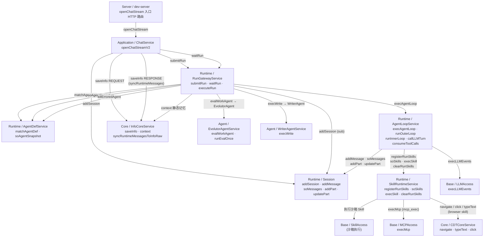
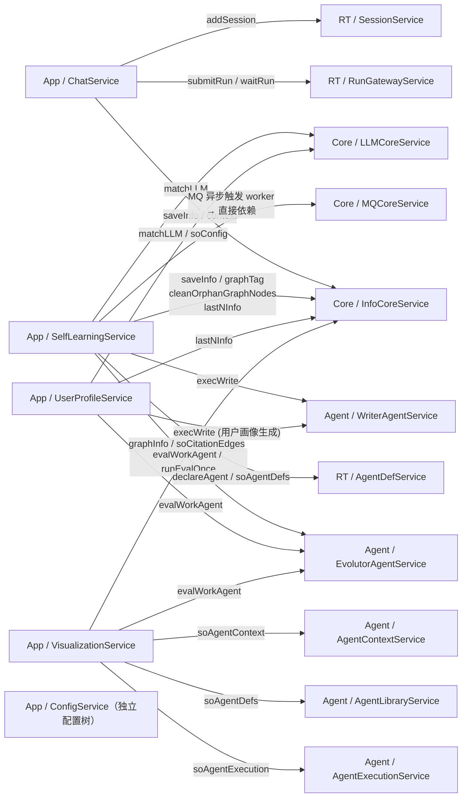
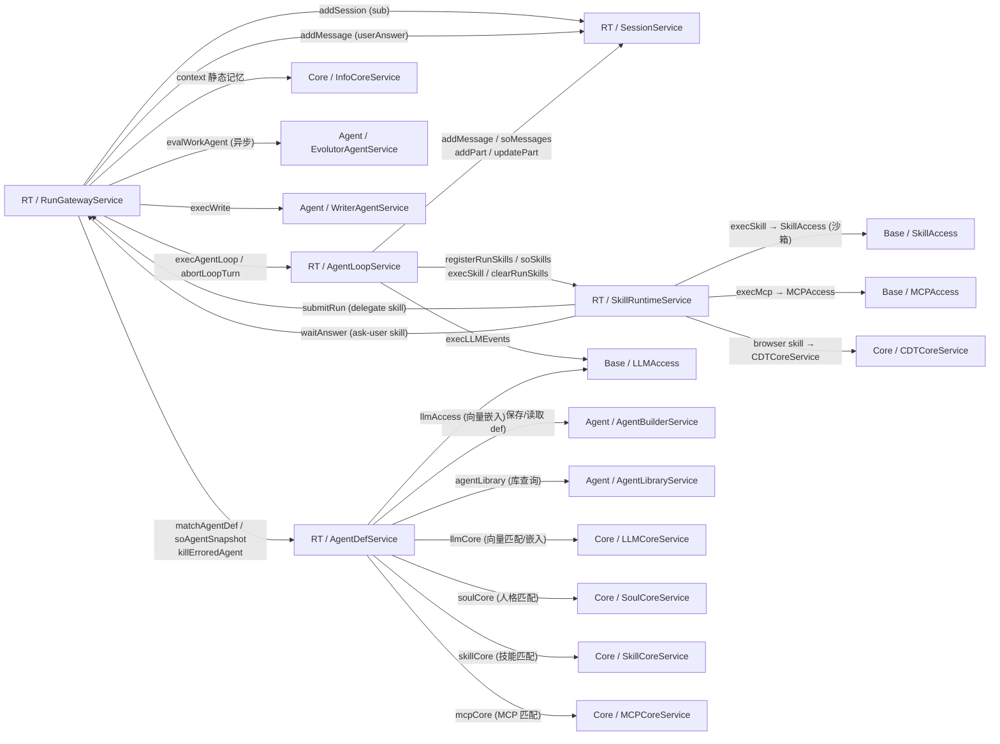
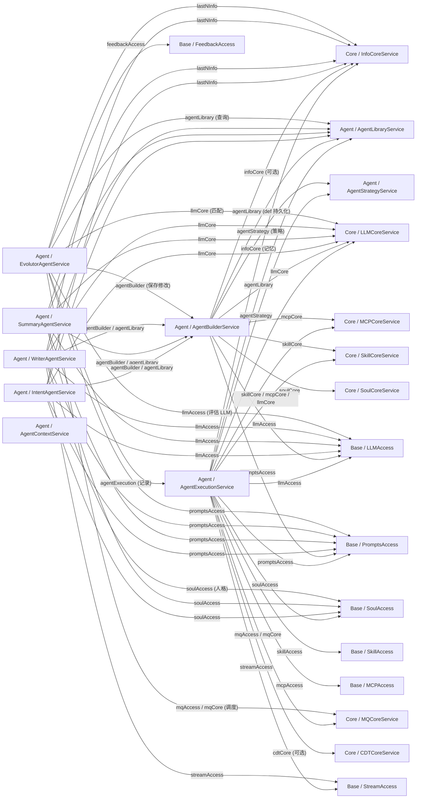
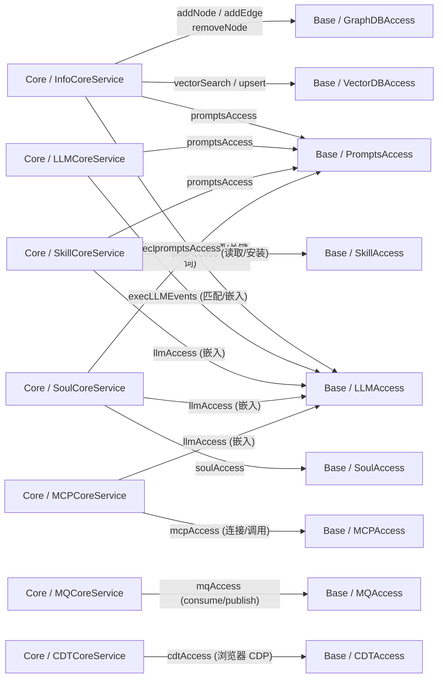
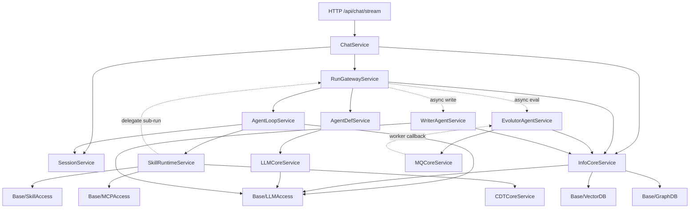

# _11 后端方法依赖树

> 状态: auto-generated　更新: 2026-09-30
>
> **规则说明**
> - 依赖单元粒度：**模块（Service）**，节点名 = `层/模块名`。
> - 有向边 A → B 表示「A 的方法内部调用了 B 暴露的 Access 方法」（跨模块调用，仅走 Access 入口）。
> - **MQ 透传**：若 A 通过 `mqAccess.publish` 发消息、B 通过 `mqCore` worker 消费，忽略 MQ 中间对象，直接记 A → B。
> - **中间对象（Runner/Helper/内部 private 类）** 不单独成节点，其调用归属于宿主 Service。
> - Base 层的 `RelationDBAccess`（SQLite）、`LLMAccess`、`PromptsAccess`、`SoulAccess`、`SkillAccess`、`MCPAccess`、`GraphDBAccess`、`ChunkAccess`、`StreamAccess`(纯传输)、`ObservabilityAccess`(事件总线,ADR-013)、`FeedbackAccess` 作为基础设施叶节点，不再向下展开。

---

## 1. 全局分层依赖方向

```
Server(入口) → Application → Runtime → Agent → Core → Base(基础设施)
                    ↘           ↘        ↘
                   Agent      Agent      Core
```

> 依赖方向单向向下，禁止反向或循环。

---

## 2. 主调用链：对话 SSE 全链路

> **chg-045 变更注记（ADR-013，2026-09-30）**
> - 新增节点：`Base / ObservabilityProvider`（ObservabilityAccess/EventDispatcher/EventLogSink/RunStateSink）。所有业务节点新增观测旁路 `Report.emit → EventDispatcher →(SSE 帧 + task_event_record 批量落库 + run_state_record 直更)`。
> - 删除节点：`server/thinkingBlocks`（2037 行离线重放）、`server/executionAnalyzer`（1433 行分析器）及其 `/api/chat/thinking`、`/api/chat/thinking/step-content` 路由；读侧统一为 `GET /api/chat/observation`（seq 重放）。
> - 边修正：`StreamService.publishEvent/pushEvent/pushText` 边删除（落库/裸通道职责移除，StreamService 瘦身为纯传输）；WriterAgent/AgentExecution 裸通道边改为 `Report.emit` 标准事件；RunGatewayService 新增 `publishRunMerge`（委派收口事件化）与 `soContextSources`（context.built.sources）。




---

## 3. 完整模块依赖树（按层展开）

### 3.1 Application 层



### 3.2 Runtime 层



### 3.3 Agent 层



### 3.4 Core 层



---

## 4. MQ 异步调用穿透索引

> MQ 中间对象（topic/queue）忽略，直接标注发布方 → 消费方（最终执行方）。

| 发布方（publish） | Topic/Channel | 消费方（最终执行） |
|---|---|---|
| `EvolutorAgentService.scheduleMQ` | `eval.*` | `EvolutorAgentService` worker（内部自消费） |
| `SelfLearningService.startLearning` | `learning.*` | `SelfLearningService` tick 内部循环 |
| `AgentExecutionService` | `orchestration.*` | `MQCoreService` → `AgentExecutionService.runWork` |
| `EvolutorAgentService.triggerEval` | `eval.trigger` | `MQCoreService` → `EvolutorAgentService.runEvalOnce` |

> MQCoreService 的职责是 worker 调度：从 MQAccess 消费后反调上层 Agent 方法，依赖树中体现为 `Core/MQCore → Agent/EvolutorAgent` 和 `Core/MQCore → Agent/AgentExecution` 的反向调用。

---

## 5. 完整依赖矩阵（调用方 → 被调用方）

| 调用方（Caller） | 被调用方（Callee） | 主要调用方法 |
|---|---|---|
| Server / dev-server | App / ChatService | `openChatStream` |
| Server / dev-server | App / SelfLearningService | `startLearning` 等 |
| Server / dev-server | App / ConfigService | `getConfig / setConfig` |
| Server / dev-server | App / UserProfileService | `generateProfile` |
| Server / dev-server | App / VisualizationService | `soMessageGraph / soAgentDag` |
| Server / dev-server | RT / RunGatewayService | `answerPermission / answerUserAsk` |
| **App / ChatService** | RT / RunGatewayService | `submitRun, waitRun` |
| App / ChatService | RT / SessionService | `addSession` |
| App / ChatService | Core / InfoCoreService | `saveInfo, context, syncRuntimeMessages` |
| **App / SelfLearningService** | Core / InfoCoreService | `saveInfo, graphTag, cleanOrphanGraphNodes, lastNInfo` |
| App / SelfLearningService | Core / LLMCoreService | `matchLLM` |
| App / SelfLearningService | Core / MQCoreService | MQ 触发 worker |
| App / SelfLearningService | Agent / EvolutorAgentService | `evalWorkAgent, runEvalOnce` |
| App / SelfLearningService | Agent / WriterAgentService | `execWrite` |
| App / SelfLearningService | RT / AgentDefService | `declareAgent, soAgentDefs` |
| **App / UserProfileService** | Agent / WriterAgentService | `execWrite` |
| App / UserProfileService | Agent / EvolutorAgentService | `evalWorkAgent` |
| App / UserProfileService | Core / InfoCoreService | `lastNInfo` |
| App / UserProfileService | Core / LLMCoreService | `matchLLM` |
| **App / VisualizationService** | Agent / AgentExecutionService | `soAgentExecution` |
| App / VisualizationService | Agent / AgentLibraryService | `soAgentDefs` |
| App / VisualizationService | Agent / AgentContextService | `soAgentContext` |
| App / VisualizationService | Core / InfoCoreService | `graphInfo, soCitationEdges` |
| App / VisualizationService | Agent / EvolutorAgentService | `soEvalHistory` |
| **RT / RunGatewayService** | RT / SessionService | `addSession, addMessage` |
| RT / RunGatewayService | RT / AgentDefService | `matchAgentDef, soAgentSnapshot, killErroredAgent` |
| RT / RunGatewayService | RT / AgentLoopService | `execAgentLoop, abortLoopTurn` |
| RT / RunGatewayService | Core / InfoCoreService | `context（静态记忆）` |
| RT / RunGatewayService | Agent / EvolutorAgentService | `evalWorkAgent（异步）` |
| RT / RunGatewayService | Agent / WriterAgentService | `execWrite` |
| **RT / AgentLoopService** | RT / SessionService | `addMessage, soMessages, addPart, updatePart` |
| RT / AgentLoopService | RT / SkillRuntimeService | `registerRunSkills, soSkills, execSkill, clearRunSkills` |
| RT / AgentLoopService | Base / LLMAccess | `execLLMEvents` |
| **RT / SkillRuntimeService** | Base / SkillAccess | `execSkill（沙箱）` |
| RT / SkillRuntimeService | Base / MCPAccess | `execMcp（mcp_exec）` |
| RT / SkillRuntimeService | Core / CDTCoreService | `navigate, typeText, click, scroll, evaluate` |
| RT / SkillRuntimeService | RT / RunGatewayService | `submitRun（delegate skill）, waitUserAnswer（ask-user）` |
| **RT / AgentDefService** | Agent / AgentBuilderService | `getAgentDef, saveAgentDef` |
| RT / AgentDefService | Agent / AgentLibraryService | `soAgentDefs` |
| RT / AgentDefService | Core / LLMCoreService | `embed（向量嵌入）` |
| RT / AgentDefService | Core / SoulCoreService | `matchSoul` |
| RT / AgentDefService | Core / SkillCoreService | `matchSkill` |
| RT / AgentDefService | Core / MCPCoreService | `matchMCP` |
| RT / AgentDefService | Base / LLMAccess | `embed` |
| **Agent / EvolutorAgentService** | Core / InfoCoreService | `lastNInfo` |
| Agent / EvolutorAgentService | Agent / AgentBuilderService | `patchAgentDef` |
| Agent / EvolutorAgentService | Agent / AgentLibraryService | `soAgentDefs` |
| Agent / EvolutorAgentService | Agent / AgentExecutionService | `recordEval` |
| Agent / EvolutorAgentService | Core / LLMCoreService | `matchLLM` |
| Agent / EvolutorAgentService | Core / MQCoreService | MQ 调度 |
| Agent / EvolutorAgentService | Base / LLMAccess | `execLLMEvents` |
| Agent / EvolutorAgentService | Base / PromptsAccess | `execPrompt` |
| Agent / EvolutorAgentService | Base / FeedbackAccess | `saveFeedback` |
| **Agent / WriterAgentService** | Core / InfoCoreService | `lastNInfo` |
| Agent / WriterAgentService | Agent / AgentBuilderService | `getAgentDef` |
| Agent / WriterAgentService | Agent / AgentLibraryService | `soAgentDefs` |
| Agent / WriterAgentService | Core / LLMCoreService | `matchLLM` |
| Agent / WriterAgentService | Base / LLMAccess | `execLLMEvents` |
| Agent / WriterAgentService | Base / PromptsAccess | `execPrompt` |
| Agent / WriterAgentService | Base / SoulAccess | `getSoul` |
| Agent / WriterAgentService | Base / Report.emit(→ObservabilityAccess) | `reply.delta` |
| **Agent / SummaryAgentService** | Core / InfoCoreService | `lastNInfo` |
| Agent / SummaryAgentService | Agent / AgentBuilderService | `getAgentDef` |
| Agent / SummaryAgentService | Agent / AgentLibraryService | `soAgentDefs` |
| Agent / SummaryAgentService | Core / LLMCoreService | `matchLLM` |
| Agent / SummaryAgentService | Base / LLMAccess | `execLLMEvents` |
| Agent / SummaryAgentService | Base / PromptsAccess | `execPrompt` |
| Agent / SummaryAgentService | Base / SoulAccess | `getSoul` |
| **Agent / IntentAgentService** | Core / InfoCoreService | `lastNInfo` |
| Agent / IntentAgentService | Agent / AgentBuilderService | `getAgentDef` |
| Agent / IntentAgentService | Agent / AgentLibraryService | `soAgentDefs` |
| Agent / IntentAgentService | Core / LLMCoreService | `matchLLM` |
| Agent / IntentAgentService | Base / LLMAccess | `execLLMEvents` |
| Agent / IntentAgentService | Base / PromptsAccess | `execPrompt` |
| Agent / IntentAgentService | Base / SoulAccess | `getSoul` |
| **Agent / AgentBuilderService** | Agent / AgentLibraryService | `saveAgent, soAgentDefs` |
| Agent / AgentBuilderService | Agent / AgentStrategyService | `soStrategy` |
| Agent / AgentBuilderService | Core / LLMCoreService | `matchLLM / embed` |
| Agent / AgentBuilderService | Core / MCPCoreService | `matchMCP` |
| Agent / AgentBuilderService | Core / SkillCoreService | `matchSkill` |
| Agent / AgentBuilderService | Core / SoulCoreService | `matchSoul` |
| Agent / AgentBuilderService | Core / InfoCoreService | `lastNInfo（可选）` |
| Agent / AgentBuilderService | Base / LLMAccess | `execLLMEvents` |
| Agent / AgentBuilderService | Base / PromptsAccess | `execPrompt` |
| **Agent / AgentExecutionService** | Agent / AgentLibraryService | `soAgentDefs` |
| Agent / AgentExecutionService | Agent / AgentStrategyService | `soStrategy` |
| Agent / AgentExecutionService | Core / LLMCoreService | `matchLLM` |
| Agent / AgentExecutionService | Core / MCPCoreService | `matchMCP` |
| Agent / AgentExecutionService | Core / SkillCoreService | `matchSkill` |
| Agent / AgentExecutionService | Core / MQCoreService | MQ 触发 |
| Agent / AgentExecutionService | Core / InfoCoreService | `saveInfo, lastNInfo` |
| Agent / AgentExecutionService | Core / CDTCoreService | `navigate（可选）` |
| Agent / AgentExecutionService | Base / LLMAccess | `execLLMEvents` |
| Agent / AgentExecutionService | Base / SoulAccess | `getSoul` |
| Agent / AgentExecutionService | Base / SkillAccess | `execSkill` |
| Agent / AgentExecutionService | Base / MCPAccess | `execMcp` |
| Agent / AgentExecutionService | Base / PromptsAccess | `execPrompt` |
| Agent / AgentExecutionService | Base / Report.emit(→ObservabilityAccess) | `think.delta/skill.*` |
| **Core / InfoCoreService** | Base / LLMAccess | `execLLMEvents（摘要/关键词）` |
| Core / InfoCoreService | Base / VectorDBAccess | `upsert, search` |
| Core / InfoCoreService | Base / GraphDBAccess | `addNode, addEdge, removeNode, query` |
| Core / InfoCoreService | Base / PromptsAccess | `execPrompt` |
| **Core / LLMCoreService** | Base / LLMAccess | `execLLMEvents, embed` |
| Core / LLMCoreService | Base / PromptsAccess | `execPrompt` |
| **Core / SkillCoreService** | Base / SkillAccess | `getSkill, installSkill` |
| Core / SkillCoreService | Base / LLMAccess | `embed` |
| Core / SkillCoreService | Base / PromptsAccess | `execPrompt` |
| **Core / SoulCoreService** | Base / SoulAccess | `getSoul, listSouls` |
| Core / SoulCoreService | Base / LLMAccess | `embed` |
| Core / SoulCoreService | Base / PromptsAccess | `execPrompt` |
| **Core / MCPCoreService** | Base / MCPAccess | `connect, callTool` |
| Core / MCPCoreService | Base / LLMAccess | `embed` |
| **Core / MQCoreService** | Base / MQAccess | `consume, publish` |
| **Core / CDTCoreService** | Base / CDTAccess | `navigate, evaluate, type, click` |

---

## 6. 关键循环 & 特殊回调说明

| 模式 | 描述 |
|---|---|
| **SkillRuntime → RunGateway（delegate skill）** | AgentLoop 调用 `execSkill(skill_builtin-delegate)` → SkillRuntimeService 内部调用 RunGateway.submitRun 发起子 Agent Run，RunGateway 启动新 Loop（LaneKind.Subagent）。形式上是回调，但走的是独立 Lane，不构成同步循环。 |
| **SkillRuntime → RunGateway（ask-user skill）** | `skill_builtin-ask-user` 执行时调用 RunGateway.waitUserAnswer 阻塞等待，前端回答后 RunGateway.answerUserAsk 解除阻塞。 |
| **RunGateway → EvolutorAgent（异步 eval）** | `executeRunEvaluation` 通过 `scheduleCurator`（后台 LaneSemaphore）异步调用，不阻塞主流程。 |
| **MQCoreService → AgentExecutionService（MQ worker）** | MQCoreService 作为 worker 框架，消费 orchestration 队列后反调 AgentExecutionService，属于 MQ 透传依赖（Core → Agent 反向）。此为架构中唯一允许的向上回调，经 MQ 解耦。 |
| **SelfLearning 内部 tick** | `startLearning` 设立定时 tick（内部 setTimeout 循环），自驱 document/conversation/tag_maintenance 三类 Pass；不经外部模块，属于内部 orchestration。 |

---

## 7. 依赖树精简图（重点主链）



> 实线 = 同步调用；虚线 = 异步/回调。

---

## 8. 普通方法与普通方法细粒度调用树（Method-to-Method Call Trees）

> 依据 `hs-project-skill` 方法规范：
> - **`orchestration` 编排方法（≤30 行）**：只做调度与流程控制，按顺序调用私有步骤、数据处理方法、算法方法与跨模块 Access。
> - **`data` 数据处理方法**：负责参数校验、数据模型组装、数据库 CRUD 封装、上下文切片组装，不藏隐式 IO 或分流。
> - **`algorithm` 算法方法**：纯计算、无 IO、确定性逻辑（BM25 打分、余弦相似度、Prompt 渲染、Token 计算等）。
> - **调用流向规则**：`orchestration → orchestration / data / algorithm`，禁止 `algorithm` 反向依赖 `orchestration`。

```
[公开入口 Entry (orchestration)]
   ├── [私有校验/装配 (data)]
   ├── [核心算法计算 (algorithm)]
   ├── [子业务步骤 (orchestration / data)]
   └── [跨模块 Access 调用 (orchestration)]
```

---

### 8.1 对话与执行主链路细粒度方法树

一次用户提问（SSE 对话流）从 HTTP 接入层至底层技能执行的完整方法调用树：

```text
ChatService.openChatStream (orchestration)
├── ChatService.checkSessionExists (data) → RelationDBAccess.selectOneDB
└── ChatService.openChatStreamV2 (orchestration)
    ├── ChatService.autoGenerateSessionTitleIfEmpty (orchestration)
    │   ├── RelationDBAccess.selectOneDB
    │   ├── generateTitleFromFirstMessage (algorithm: 首句 8~12 字符裁剪)
    │   └── ChatService.updateSessionTitle (data) → RelationDBAccess.updateDB
    ├── ChatService.checkSessionOverflow (data) → RelationDBAccess.selectOneDB + countDB
    ├── SessionAccess.addSession (orchestration) → SessionService.addSession → RelationDBAccess.insert
    ├── RunGatewayAccess.submitRun (orchestration) → RunGatewayService.submitRun
    │   ├── RunGatewayService.soRuntimeSessionId (orchestration) → SessionAccess.addSession
    │   ├── RunGatewayService.soLaneKey (data: 生成 laneKey 'session:sessionId')
    │   ├── RunGatewayService.soLane (data: 获取或初始化 SessionLane)
    │   ├── RunGatewayService.enqueueByQueueMode (orchestration, 若当前 Lane 繁忙)
    │   │   ├── RunGatewayService.insertQueuedRun (data) → RelationDBAccess.insert
    │   │   └── RunGatewayService.maybeDrainLane (orchestration)
    │   └── RunGatewayService.startRun (orchestration)
    │       ├── RelationDBAccess.insert (写入 runtime_run_record: running)
    │       └── RunGatewayService.executeRun (orchestration, 异步主调度)
    │           ├── RunGatewayService.soRunSessionId (data)
    │           ├── RunGatewayService.buildStaticMemory (orchestration)
    │           │   ├── InfoCoreAccess.context (详见 8.2 记忆召回树)
    │           │   └── formatContextCategories (data: 组装 memoryCategories)
    │           ├── RunGatewayService.matchAgent (orchestration)
    │           │   └── AgentDefAccess.matchAgentDef (详见 8.3 Agent 选举树)
    │           ├── RunGatewayService.soSnapshot (orchestration)
    │           │   └── AgentDefAccess.soAgentSnapshot → AgentDefService.soAgentSnapshot
    │           ├── RunGatewayService.publishAgentComponents (data: 上报 AgentComponents 事件)
    │           ├── RunGatewayService.prepareLoopInput (data: 组装内置与绑定技能清单)
    │           ├── RunGatewayService.decideThoughtMode (algorithm: 根据技能特征判定 CoT / ReAct)
    │           ├── RunGatewayService.prepareLoopContext (data: 拼接静态记忆与 system 提示词)
    │           ├── LoopAccess.execAgentLoop (orchestration) → AgentLoopService.execAgentLoop
    │           │   ├── AgentLoopService.validateLoopInput (data)
    │           │   ├── AgentLoopService.prepareLoopContext (orchestration)
    │           │   │   ├── AgentLoopService.wireExternalSignal (data: 挂接 AbortController)
    │           │   │   ├── AgentLoopService.registerRunSkills (orchestration) → SkillRuntimeAccess.registerRunSkills
    │           │   │   ├── AgentLoopService.soLoopSkillSpecs (orchestration) → SkillRuntimeAccess.soSkills
    │           │   │   ├── AgentLoopService.persistUserMessage (orchestration) → SessionAccess.addMessage
    │           │   │   └── AgentLoopService.publishRunStatus (data: 上报 RunStarted 事件)
    │           │   ├── AgentLoopService.runOuterLoop (orchestration)
    │           │   │   └── AgentLoopService.runInnerLoop (orchestration)
    │           │   │       └── AgentLoopService.runInnerTurn (orchestration, 多轮循环)
    │           │   │           ├── AgentLoopService.consumeBudget (algorithm: 预算扣减与宽限期判定)
    │           │   │           ├── AgentLoopService.callLLMTurn (orchestration)
    │           │   │           │   ├── AgentLoopService.prepareLLMTurnInput (data)
    │           │   │           │   │   └── AgentLoopService.prepareModelMessages (orchestration)
    │           │   │           │   │       ├── SessionAccess.soMessages → SessionService.soMessages
    │           │   │           │   │       └── AgentLoopService.assistantToWire (data)
    │           │   │           │   │           ├── AgentLoopService.toWireSkillCall (data) → fetchExecuteIO
    │           │   │           │   │           └── AgentLoopService.toSkillResultMessage (data) → fetchExecuteIO
    │           │   │           │   ├── LLMAccess.execLLMEvents (orchestration) → LLMService.execLLMEvents
    │           │   │           │   │   ├── LLMService.validateEventsInput (data)
    │           │   │           │   │   ├── LLMService.resolveCandidateModels (data)
    │           │   │           │   │   ├── LLMEventsRunner.run (orchestration: 供应商流式通信)
    │           │   │           │   │   └── LLMService.recordLLMCallMetrics (data: 记录 Token 与首字延迟)
    │           │   │           │   └── AgentLoopService.fillTurnResult (data)
    │           │   │           ├── AgentLoopService.flushDeltaBuffer (data: 推送 reasoning / text delta)
    │           │   │           ├── AgentLoopService.persistAssistantTurn (orchestration)
    │           │   │           │   ├── SessionAccess.addMessage (data) → RelationDBAccess.insert
    │           │   │           │   ├── AgentLoopService.persistTurnParts (orchestration)
    │           │   │           │   │   ├── AgentLoopService.addTurnPart (orchestration) → SessionAccess.addPart
    │           │   │           │   │   └── AgentLoopService.addSkillPart (orchestration) → SessionAccess.addPart
    │           │   │           │   └── AgentLoopService.persistRunRoundOrg (data) → RelationDBAccess.insert
    │           │   │           ├── AgentLoopService.emitLoopTurnResult (data: 上报 LoopTurnResult 事件)
    │           │   │           └── AgentLoopService.consumeToolCalls (orchestration, 若 finish_reason='tool-calls')
    │           │   │               ├── AgentLoopService.soSkillPart (data) → SessionAccess.soMessages
    │           │   │               ├── AgentLoopService.askPermission (orchestration, 敏感技能权限门禁)
    │           │   │               │   ├── permissionGate.wait (阻塞等待用户授权)
    │           │   │               │   └── permissionAudit.asked / answered (审计留痕)
    │           │   │               ├── AgentLoopService.markPartRunning (data) → SessionAccess.updatePart
    │           │   │               ├── AgentLoopService.execLoopSkill (orchestration)
    │           │   │               │   └── SkillRuntimeAccess.execSkill (orchestration) → SkillRuntimeService.execSkill
    │           │   │               │       ├── SkillRuntimeService.prepareSkillContext (data)
    │           │   │               │       ├── SkillRuntimeService.prepareSkillArgs (data: Zod Schema 校验)
    │           │   │               │       └── SkillRuntimeService.executeSkillSafely (orchestration)
    │           │   │               │           ├── 沙箱执行 (SkillAccess.execSkill)
    │           │   │               │           ├── MCP 网关 (mcpExecTool → MCPAccess.execMcp)
    │           │   │               │           ├── 浏览器动作 (CDTCoreAccess.navigate / click / typeText)
    │           │   │               │           ├── 子代理派发 (delegateSkill → RunGatewayAccess.submitRun [穿透])
    │           │   │               │           └── 用户问询 (askUserSkill → RunGatewayAccess.waitUserAnswer [穿透])
    │           │   │               └── AgentLoopService.completeSkillPart (data) → SessionAccess.updatePart
    │           │   └── AgentLoopService.settleLoop (orchestration)
    │           │       └── SkillRuntimeAccess.clearRunSkills → SkillRuntimeService.clearRunSkills
    │           ├── RunGatewayService.finishRunByLane (orchestration)
    │           │   ├── RunGatewayService.joinChildRuns (orchestration: 等待 subagent 完成)
    │           │   ├── RunGatewayService.collectChildResults (data: 汇聚子 Agent 产出)
    │           │   ├── RunGatewayService.updateDelegatePartOutputs (data) → RelationDBAccess.update
    │           │   ├── RunGatewayService.executeRunEvaluation (orchestration, 异步评估)
    │           │   │   └── EvolutorAgentAccess.evalWorkAgent (详见 8.5 评估进化树)
    │           │   └── RunGatewayService.executeRunWriting (orchestration, 写作润色)
    │           │       └── WriterAgentAccess.execWrite (详见 8.5 写作树)
    │           ├── RunGatewayService.settleRun (orchestration) → RelationDBAccess.update
    │           └── RunGatewayService.drainFollowups (orchestration: 消费 steering 残留消息)
    ├── InfoCoreAccess.saveInfo (orchestration: 提前写入 REQUEST 消息)
    ├── RunGatewayAccess.waitRun (orchestration) → RunGatewayService.waitRun
    └── ChatService.syncRuntimeMessagesToInfoRaw (orchestration: 对话消息回写记忆表)
        ├── RelationDBAccess.queryRaw (读取 runtime_message_record)
        └── InfoCoreAccess.saveInfo (存储 dialog 记录与 CITATION 引用关系)
```

---

### 8.2 记忆保存与多维召回细粒度方法树

记忆写入（saveInfo）与上下文装配（context）的方法级调用树：

```text
InfoCoreService.saveInfo (orchestration)
├── InfoCoreService.persistDialogRecord (data) → RelationDBAccess.insert (写入 dialog 表)
├── InfoCoreService.vectorInfo (orchestration: 异步向量化)
│   ├── InfoCoreService.getInfoVectorConfig (data) → RelationDBAccess.select
│   ├── InfoCoreService.generateEmbedding (orchestration) → LLMAccess.embed
│   └── InfoCoreService.upsertVector (data) → VectorDBAccess.upsert
├── InfoCoreService.tagInfo (orchestration: 标签提取与共现图)
│   ├── InfoCoreService.getInfoTagConfig (data) → RelationDBAccess.select
│   ├── InfoCoreService.extractTags (algorithm: 正则/分词提取 Tag)
│   ├── InfoCoreService.insertTag (data) → RelationDBAccess.insert (写入 info_tag 表)
│   ├── InfoCoreService.maintainTagVector (orchestration: 维护 Tag 向量)
│   ├── InfoCoreService.graphTag (orchestration: 图节点连接)
│   │   ├── InfoCoreService.ensureTagNode (data) → GraphDBAccess.addNode
│   │   ├── InfoCoreService.searchSimilarTags (data) → VectorDBAccess.search
│   │   └── InfoCoreService.connectSimilarTags (data) → GraphDBAccess.addEdge
│   └── InfoCoreService.buildCooccurEdges (data) → GraphDBAccess.addEdge (同消息 Tag 共现边)
├── InfoCoreService.keywordInfo (orchestration: 关键词提取)
│   ├── InfoCoreService.extractKeywords (algorithm: 文本 TF-IDF / 关键词分析)
│   ├── RelationDBAccess.executeRaw (批量插入 info_keyword 表)
│   └── InfoCoreService.buildKeywordCooccurEdges (data) → GraphDBAccess.addEdge
└── InfoCoreService.summaryInfo (orchestration: 摘要生成)
    ├── InfoCoreService.getInfoSummaryConfig (data) → RelationDBAccess.select
    ├── InfoCoreService.isSummaryEligibleType (algorithm: 判断消息长度与类型门槛)
    ├── InfoCoreService.generateSummaryText (orchestration)
    │   └── InfoCoreService.execSummaryLLM (orchestration) → PromptsAccess.execPrompt + LLMAccess.execLLM
    └── RelationDBAccess.insert (写入 info_summary 表)

InfoCoreService.context (orchestration: 六维上下文构建)
├── InfoCoreService.validateContextInput (data)
├── InfoCoreService.getInfoContextConfig (data) → RelationDBAccess.select
├── InfoCoreService.prepareContextBuildPlan (data)
├── InfoCoreService.timedContextPhase (orchestration: 阶段计时与 Metrics 上报)
├── InfoCoreService.collectPinnedCandidates (data) → RelationDBAccess.select (从 context 表读取置顶)
├── InfoCoreService.collectSelectedOrTimelineCandidates (orchestration)
│   ├── InfoCoreService.lastNInfoTimeline (data: 会话内按时间取最近 N 条)
│   ├── InfoCoreService.collectCitingCandidates (data: 显式勾选引用的消息)
│   ├── InfoCoreService.queryHistoricalContextIds (data: 从 context 表反查历史上下文快照)
│   └── InfoCoreService.fetchHistoricalContextRecords (data: 批量回表取消息实体)
├── InfoCoreService.extractCurrentCandidate (data: 当次用户问题)
├── InfoCoreService.resolveWeakDimensionLimits (data)
├── InfoCoreService.collectWeakDimensionCandidates (orchestration: Promise.all 并发三路弱关联召回)
│   ├── InfoCoreService.collectTagRelativeCandidates (orchestration)
│   │   └── InfoCoreService.relationKInfo (orchestration: 图共现关联检索)
│   │       ├── InfoCoreService.ensureSelfTagNames (data) → RelationDBAccess.select
│   │       ├── InfoCoreService.collectRelatedTags (data) → GraphDBAccess.getNeighbors
│   │       ├── InfoCoreService.findInfoWeightsByTags (data) → RelationDBAccess.select
│   │       └── InfoCoreService.loadRelatedInfo (data) → RelationDBAccess.select
│   ├── InfoCoreService.collectSimilarityCandidates (orchestration)
│   │   └── InfoCoreService.similarKInfo (orchestration: 向量相似度检索)
│   │       ├── InfoCoreService.generateEmbedding (orchestration) → LLMAccess.embed
│   │       ├── InfoCoreService.searchInfoVectors (data) → VectorDBAccess.search
│   │       └── InfoCoreService.toScoredInfoList (data)
│   └── InfoCoreService.collectKeywordCandidates (orchestration)
│       └── InfoCoreService.keywordKInfo (orchestration: 关键词全文检索)
│           ├── InfoCoreService.extractKeywords (algorithm)
│           └── RelationDBAccess.queryRaw (LIKE / MATCH 查询)
├── InfoCoreService.collectRandomCandidates (data: 全局/会话内随机抽样漫游)
├── InfoCoreService.excludeCurrentFromWeakDimensions (data: 去重排除当次消息)
├── InfoCoreService.buildContextCandidatesMap (data: 汇总 6 维候选集)
├── InfoCoreService.parseContextPriorityList (data: 依权重排序合并)
├── InfoCoreService.prefetchContextSummaries (data: 批量附加摘要)
├── InfoCoreService.collectDedupedContextItems (data: 最终去重与截断)
├── InfoCoreService.buildContextCategories (data: 格式化为分类字典)
└── InfoCoreService.fillContextTriplesAndPersist (data)
    └── InfoCoreService.persistContextSourceMap (data) → RelationDBAccess.insert (写入 context 表快照)
```

---

### 8.3 Agent 级联选举与构建细粒度方法树

```text
AgentDefService.matchAgentDef (orchestration)
├── AgentDefService.soActiveDefs (orchestration: 读取并缓存活跃 AgentDef)
│   └── AgentDefService.loadActiveDefs (data) → RelationDBAccess.select
├── AgentDefService.tryMatchDirect (data: 精确匹配 agent_ref 或显式指定 def_id)
├── AgentDefService.matchCascaded (orchestration: 三级级联漏斗匹配)
│   ├── AgentDefService.filterByBM25 (orchestration: Stage 1 文本词频粗筛)
│   │   ├── FunnelSelector.funnelBm25Stage (algorithm: 绝对置信度 raw/ideal 得分)
│   │   └── AgentDefService.soMatchBm25Threshold (data)
│   ├── AgentDefService.filterByVector (orchestration: Stage 2 向量余弦相似度精筛)
│   │   ├── AgentDefService.soTaskEmbedding (orchestration) → LLMAccess.embed
│   │   ├── FunnelSelector.funnelVectorStage (algorithm: 余弦相似度计算)
│   │   └── AgentDefService.soMatchVectorThreshold (data)
│   └── AgentDefService.soLLMRankedDef (orchestration: Stage 3 LLM 裁判裁决)
│       ├── AgentDefService.soCandidateProfiles (data: 候选画像脱敏瘦身)
│       ├── AgentDefService.renderMatchPrompt (data: 组装裁判 Prompt)
│       ├── LLMAccess.execLLM (orchestration) → LLMService.execLLM
│       └── AgentDefService.parseAndEvaluateLLMResult (data: 解析决策与置信度)
└── AgentDefService.buildAndAssignNewDef (orchestration, 若 3 级均未命中既有 Agent 则自动构建)
    ├── AgentDefService.buildNewDef (orchestration)
    │   ├── AgentBuilderAccess.buildAgent (orchestration) → AgentBuilderService.buildAgent
    │   │   ├── AgentBuilderService.matchPromptForAgent (orchestration: 漏斗匹配系统提示词模板)
    │   │   ├── AgentBuilderService.matchLlmForAgent (orchestration) → LLMCoreAccess.matchLLM
    │   │   ├── SoulCoreAccess.matchSoul (orchestration: 漏斗匹配人格设定)
    │   │   ├── SkillCoreAccess.matchSkill (orchestration: 漏斗匹配候选技能)
    │   │   ├── MCPCoreAccess.matchMCP (orchestration: 漏斗匹配 MCP 工具)
    │   │   └── AgentLibraryAccess.saveAgent (data) → RelationDBAccess.insert
    │   └── AgentDefService.insertDefFromAgent (data) → RelationDBAccess.insert (写入 runtime_agent_def 表)
    └── AgentDefService.soAgentSnapshot (orchestration: 生成运行快照)
```

---

### 8.4 评估进化与写作润色细粒度方法树

```text
EvolutorAgentService.evalWorkAgent (orchestration: 运行质量后置评估)
├── EvolutorAgentService.resolveEvalContext (data)
│   └── AgentBuilderAccess.buildSystemAgent (orchestration: 确保评估 Agent 就绪)
├── EvolutorAgentService.loadTraceContext (data) → AgentExecutionAccess.soTrace (读取执行轨迹)
├── EvolutorAgentService.renderPrompt (data: 渲染评估 Prompt 模板)
├── EvolutorAgentService.execEvalLlm (orchestration) → LLMAccess.execLLM
├── EvolutorAgentService.saveWorkEvaluation (data) → RelationDBAccess.insert (写入 agent_evaluation 表)
├── EvolutorAgentService.refreshEvalScore (data: 重新计算 Agent 历史平均分与健康度)
│   └── AgentLibraryAccess.updateAgent (data) → RelationDBAccess.update
├── EvolutorAgentService.dispatchOptimizeMessage (orchestration: 触发异步优化消息)
│   └── MQAccess.sendMQ (data) → 写入 mq 表 (eval.optimize 队列)
├── EvolutorAgentService.submitEvalFeedback (data) → FeedbackAccess.submitAgentFeedback
└── EvolutorAgentService.disbandBadAgent (orchestration: 连续低分 Agent 自动淘汰解散)
    ├── AgentLibraryAccess.delAgent (data) → RelationDBAccess.delete
    └── EvolutorAgentService.disableRuntimeDefs (data) → RelationDBAccess.update (标记 def 失效)

WriterAgentService.execWrite (orchestration: 最终回复润色与定稿)
├── WriterAgentService.prepareWriterAgent (data)
│   └── AgentBuilderAccess.buildSystemAgent (orchestration: 确保写作 Agent 就绪)
├── WriterAgentService.resolveWritePreferences (data: 读取用户偏好画像与排版格式约束)
├── WriterAgentService.buildSessionContext (orchestration) → InfoCoreAccess.context (召回相关上下文)
├── WriterAgentService.loadSoulContent (data) → SoulAccess.soSoulById (注入语气与口吻)
├── WriterAgentService.renderWritePrompt (data: 组装包含各子任务原始结果的写作 Prompt)
├── WriterAgentService.execWriterLlm (orchestration) → LLMAccess.execLLMEvents (注入 extra.thinking=disabled 极速定稿)
├── WriterAgentService.applyWriteResult (data: 解析富文本块与 Mermaid 图表)
├── WriterAgentService.recordTrace (data) → TraceStore.save
└── WriterAgentService.recordWriterUsage (data) → AgentLibraryAccess.recordAgentUsage
```

---

### 8.5 通用组件三级漏斗选举细粒度方法树

SkillCore / SoulCore / MCPCore / Prompt 统一复用 `FunnelSelector` 通用组件选举漏斗：

```text
FunnelSelector.selectComponent (orchestration 通用算法骨架)
├── FunnelSelector.buildFunnelDocText (algorithm: 组装 "名称 + 摘要 + 用法" 检索文档)
├── FunnelSelector.funnelBm25Stage (algorithm: BM25 词频打分)
│   ├── BM25.score (algorithm)
│   └── FunnelSelector.absoluteConfidence (algorithm: raw / ideal 归一化得分)
│       └── [若置信度 ≥ 90 且质量护栏通过 → 直接采纳免 LLM (短路返回)]
├── FunnelSelector.funnelVectorStage (algorithm: 向量余弦相似度打分)
│   ├── LLMAccess.embed (orchestration: 提取嵌入向量)
│   ├── FunnelSelector.cosineSimilarity (algorithm: 向量点积与模长计算)
│   └── [若余弦相似度 ≥ 85 且质量护栏通过 → 直接采纳免 LLM (短路返回)]
└── FunnelSelector.funnelLlmStage (orchestration: LLM 最终裁决)
    ├── FunnelSelector.renderLlmPrompt (data: 组装前 top-K 候选打分 Prompt)
    ├── LLMAccess.execLLM (orchestration)
    └── FunnelSelector.parseLlmScoreOutput (data: 提取最佳命中与采纳理由)
```

---

### 8.6 自学习与图治理全链路细粒度方法树

```text
SelfLearningService.startLearning (orchestration: 启动自学习任务引擎)
├── SelfLearningService.tick (orchestration: 定时自驱事件循环)
│   ├── SelfLearningService.runModePass('DOCUMENT') (orchestration: 文档知识库扫描)
│   │   ├── ChunkAccess.chunkText (orchestration) → ChunkService.chunkText (长文分块)
│   │   └── InfoCoreAccess.saveInfo (存储文档片段为 DOCUMENT 记忆)
│   ├── SelfLearningService.runModePass('CONVERSATION') (orchestration: 历史对话深度学习)
│   │   ├── InfoCoreAccess.lastNInfo (提取历史问答对)
│   │   └── EvolutorAgentAccess.runEvalOnce (深度反思 Agent 执行效果)
│   └── SelfLearningService.runModePass('TAG_MAINTENANCE') (orchestration: 标签图谱维护与治理)
│       ├── SelfLearningService.startTagConnectionEstablishment (orchestration: 建立相似标签弱关联边)
│       │   └── InfoCoreAccess.graphTag → GraphDBAccess.addEdge
│       ├── SelfLearningService.startTagActivation (orchestration: 标签热度激活与共现权重强化)
│       │   └── GraphDBAccess.activateGraphEdge
│       ├── SelfLearningService.startTagAging (orchestration: 标签关系半衰期老化)
│       │   └── GraphDBAccess.ageGraphEdge
│       └── SelfLearningService.startOrphanTagCheck (orchestration: 孤立节点精准清理)
│           └── InfoCoreAccess.cleanOrphanGraphNodes (orchestration)
│               ├── GraphDBAccess.selectGraph (扫描所有 Tag / Keyword 节点)
│               ├── RelationDBAccess.count (反查 info_tag / info_keyword 引用数)
│               └── GraphDBAccess.removeGraphNode (物理删除引用计数为 0 的孤立图节点)
└── SelfLearningService.configSelfLearning (data: 调整学习周期、学习模式与任务参数)
```

---

### 8.7 方法调用规则总结表

| 调用层级 | 允许的被调用类型 | 典型示例 | 架构约束 |
|---|---|---|---|
| **Access 接入层** | 对应 Service 方法 | `ChatAccess.openChatStream` → `ChatService.openChatStream` | 纯 AOP 门面，只做拦截与转发 |
| **Service 编排方法** (`orchestration`) | 私有子方法、数据方法、算法方法、外部 Access | `RunGatewayService.executeRun` → `buildStaticMemory`, `matchAgent`, `LoopAccess.execAgentLoop` | 方法体 ≤30 行，保持薄调度 |
| **数据处理方法** (`data`) | 数据库 API、数据转换函数、同模块数据方法 | `InfoCoreService.persistDialogRecord` → `RelationDBAccess.insert` | 不藏复杂 IO 与跨层业务逻辑 |
| **通用算法方法** (`algorithm`) | 纯数学函数、同模块算法函数 | `FunnelSelector.cosineSimilarity`、`generateTitleFromFirstMessage` | 纯计算、无副作用、必须有单测 |
| **MQ 异步调用** | 消费方 Worker / Service 方法 | `EvolutorAgent.dispatchOptimizeMessage` → `EvolutorAgent.runOptimize` | 忽略 MQ 中间件，直接建立透传调用 |
| **Skill 执行调用** | 内置/沙箱/MCP/CDT/子代理实现 | `SkillRuntime.execSkill` → `mcpExecTool` / `delegateSkill` | 统一通过 SkillRuntime 隔离分发 |

