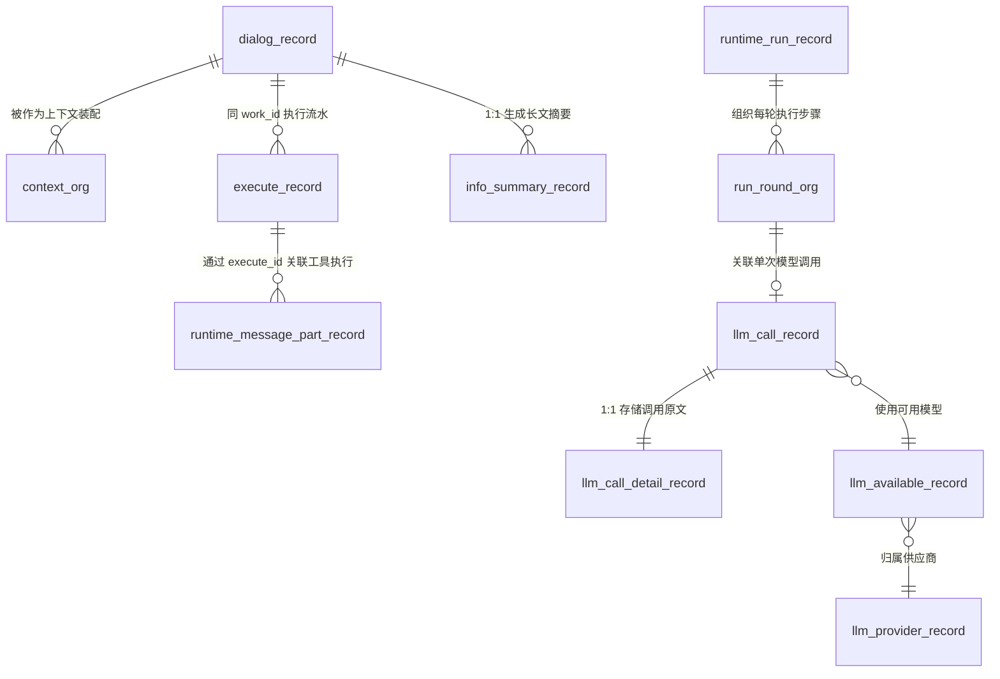
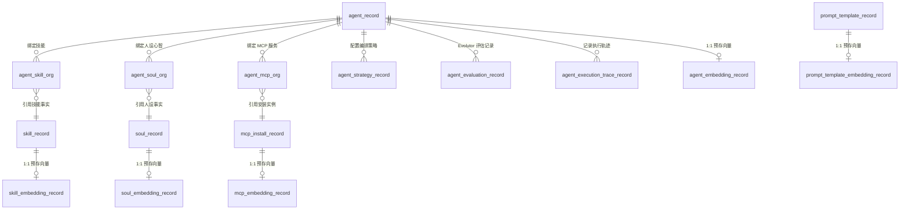
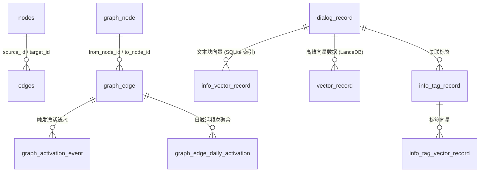

# _12_db_schema.md: 数据库全量架构与表结构规范手册

> **状态**: confirmed / maintained  
> **规范依据**: [ADR-003 本地三库](file://./_03_tech_stack/ADR-003-local-three-stores.md) · [ADR-013 统一事件总线与可观测投影](file://./_03_tech_stack/ADR-013-unified-event-bus-observability.md) · [ADR-010 消息三表重构](file://./_03_tech_stack/ADR-010-three-tables-dialog-execute-context.md) · [ADR-012 记录/组织二分存储模型与全量规范化](file://./_03_tech_stack/ADR-012-record-org-dichotomy-storage.md)  
> **目标定位**: 本项目（brian-agent）所有物理数据库、逻辑表结构、字段契约、索引约束与实体拓扑的**唯一事实源规范文档**。

---

## 目录

1. [第一章：存储架构与设计模型](#第一章存储架构与设计模型)
   - [1.1 多库分工与物理拓扑](#11-多库分工与物理拓扑)
   - [1.2 「记录/组织」二分存储模型](#12-记录组织二分存储模型)
   - [1.3 通用公共字段与命名规范](#13-通用公共字段与命名规范)
   - [1.4 幂等初始化与平滑迁移规范](#14-幂等初始化与平滑迁移规范)
2. [第二章：全库全景索引矩阵](#第二章全库全景索引矩阵)
   - [2.1 物理数据库分布概览](#21-物理数据库分布概览)
   - [2.2 全量数据表快速索引](#22-全量数据表快速索引)
3. [第三章：分领域表结构详细规范](#第三章分领域表结构详细规范)
   - [一、记忆与问答域 (Memory & Dialogue Domain)](#domain-memory_dialog)
   - [二、Runtime 编排内核域 (Runtime Orchestration Domain)](#domain-runtime_orchestration)
   - [三、智能体与策略域 (Agent & Strategy Domain)](#domain-agent_strategy)
   - [四、基建与能力组件定义域 (Capability Providers & Infrastructure Domain)](#domain-infrastructure_providers)
   - [五、全链路用量与追踪域 (Trace, Usage & Observability Domain)](#domain-trace_observability)
   - [六、应用扩展与自学习域 (Application Features Domain)](#domain-application_features)
   - [七、图数据库域 (Graph Database: graph.db & leangraph)](#domain-graph_database)
   - [八、向量数据库域 (Vector Database: LanceDB vectordb)](#domain-vector_database)
   - [九、历史演进与保留表 (Legacy & Historical Orchestration Tables)](#domain-legacy_orchestration)
4. [第四章：实体拓扑与关联关系图 (Mermaid)](#第四章实体拓扑与关联关系图-mermaid)
   - [4.1 问答、执行与上下文装配主链](#41-问答执行与上下文装配主链)
   - [4.2 Agent 与能力组件装配拓扑](#42-agent-与能力组件装配拓扑)
   - [4.3 TraceBase 全链路用量统计拓扑](#43-tracebase-全链路用量统计拓扑)
   - [4.4 知识图谱与向量索引拓扑](#44-知识图谱与向量索引拓扑)
5. [第五章：数据库运维与高可用机制](#第五章数据库运维与高可用机制)
   - [5.1 SQLite WAL Checkpoint 与并发写机制](#51-sqlite-wal-checkpoint-与并发写机制)
   - [5.2 零依赖 100% 本机冷备与恢复](#52-零依赖-100-本机冷备与恢复)

---

## 第一章：存储架构与设计模型

### 1.1 多库分工与物理拓扑

Brian Agent 坚持 **100% 数据归属本机** 的隐私安全架构，杜绝依赖外部数据库中间件（如 MySQL、PostgreSQL、Qdrant 等）。系统采用 **SQLite(WAL) + LanceDB + leangraph** 组合形态：

| 数据库文件路径 | 存储引擎 | 访问封装组件 | 架构职责 |
|---|---|---|---|
| `data/brian.db` | SQLite 3 (WAL 模式, Foreign Keys ON) | `RelationDBAccess` (Base/RelationDBProvider) | **业务主库**：承载问答事实、执行流水、Agent 定义、能力组件配置、上下文组织与 TraceBase 用量 |
| `data/brian_log.db` | SQLite 3 (WAL 模式) | `LogAccess` (Base/LogProvider) | **运行日志库**：物理隔离系统运行日志流水，防止高频日志 I/O 抢占主业务库锁 |
| `data/graph.db` | SQLite 3 (`leangraph` 驱动) | `GraphDBAccess` (Base/GraphDBProvider) | **图数据库**：存储知识图谱节点（`nodes`）、拓扑边（`edges`）及图激活衰减统计 |
| `data/vectordb/` | LanceDB (列式向量文件) | `VectorDBAccess` (Base/VectorDBProvider) | **向量数据库**：存储多维密集向量（`vector_record.lance`），支持余弦相似度极速近邻检索 |

### 1.2 「记录/组织」二分存储模型

依据 **ADR-012** 规范，全系统关系数据表严格划分为两类形态：

1. **记录数据 (`xxx_record`)**：
   - **语义**: 一行数据表达一个**独立事实、内容实体、历史流水或配置定义本身**。
   - **生命周期约束**: 删除该行即意味着丢失该业务事实本身（如问答事实 `dialog_record`、执行轨迹 `execute_record`、技能代码 `skill_record`）。
2. **组织数据 (`xxx_org`)**：
   - **语义**: 一行数据表达**多个实体 ID 间的关联关系、聚合统计、索引快照或时序投影**。
   - **生命周期约束**: 删除该行不影响被指向的目标记录本身，仅破坏索引或关联拓扑（如上下文映射 `context_org`、Agent 技能绑定 `agent_skill_org`、日聚合用量 `agent_usage_org`）。
3. **配置记录 (`xxx_config_record` / `xxx_config`)**：
   - **语义**: 遵循通用键值对 `(config_key, config_value, value_type, description, updated)` 统一结构，为各 Provider 提供运行时动态参数热更新。

### 1.3 通用公共字段与命名规范

全库数据表遵循以下统一的列命名与字段契约：

| 字段名 | 类型 | 约束 | 语义与业务约定 |
|---|---|---|---|
| `id` | `TEXT` | `PRIMARY KEY` | 实体全局唯一主键（UUID 字符串，由 `IdGenerator.generate()` 生成） |
| `trace_id` | `TEXT` | `NOT NULL DEFAULT ''` | **全链路追踪 ID**：串联前后端请求、SSE 推送、LLM 调用、Tool 执行与日志排查。定义/配置行置空 |
| `created` | `INTEGER` | `NOT NULL` | 创建时间毫秒时间戳（`IdGenerator.now()`，UNIX Epoch ms） |
| `updated` | `INTEGER` | `NOT NULL` | 最后更新时间毫秒时间戳（UNIX Epoch ms） |
| `title` | `TEXT` | 统一展示名 | 替代历史残留的 `name`、`xxx_name`、`xxx_title` |
| `brief` | `TEXT` | 统一简介 | 替代历史残留的 `description`、`summary`、`xxx_brief` |
| `content` | `TEXT` | 统一正文 | 替代历史残留的 `text`、`body`、`payload` |
| `url` | `TEXT` | 统一网络地址 | 替代历史残留的 `endpoint`、`base_url`、`link` |
| `<col>_length` | `INTEGER` | 长度统计列 | 配合大文本字段维护字数统计（如 `input_length`、`output_length`、`summary_length`） |

### 1.4 幂等初始化与平滑迁移规范

- 所有模块在 DDD 基础设施层均实现独立的 `*SchemaInitializer`（如 `InfoCoreSchemaInitializer`、`LLMSchemaInitializer`、`TraceSchemaInitializer` 等）。
- 系统在 `dev-server.ts` 启动时按依赖拓扑自动执行 `init()`。
- 迁移语句全部包含幂等容错机制：`ALTER TABLE ... RENAME TO` 与 `ALTER TABLE ... ADD COLUMN` 均通过 `try/catch` 忽略已存在或已迁移状态，确保全新初始化与历史存量平滑升级均能 100% 成功。

---

## 第二章：全库全景索引矩阵

### 2.1 物理数据库分布概览

| 数据库标识 | 物理路径 | 表数量 | 存储范式 | 核心承载模块 |
|---|---|---|---|---|
| 业务主库 | `data/brian.db` | 139 | 关系型 (WAL) | InfoCore, Runtime, Agent, Capabilities, TraceBase, Config |
| 日志专库 | `data/brian_log.db` | 7 | 关系型 (WAL) | LogProvider, TraceBase 日志沉淀 |
| 图数据库 | `data/graph.db` | 6 | 图拓扑 + 关系表 | GraphDBProvider, LeanGraph 节点/边及激活事件 |
| 向量专库 | `data/vectordb/vector_record.lance` | 1 | 列式 Arrow 向量 | VectorDBProvider, InfoCore 向量检索 |

### 2.2 全量数据表快速索引

| 序号 | 领域模块 | 数据表名 (`Table Name`) | 物理所属库 | 存储分类 | 核心职责说明 |
|---|---|---|---|---|---|
| 1 | 一、记忆与问答域 | [`dialog_record`](#table-dialog-record) | `brian.db` | 记录表 (Record) | 专职记录用户与 Agent 的真实问答事实（REQUEST/RESPONSE），彻底剥离内部执行轨迹以保证首屏与历史查询极速加载。 |
| 1a | 一、记忆与问答域 | [`dialog_embedding_record`](#table-dialog-embedding-record) | `brian.db` | 记录表 (Record) | 轮次话题向量表（chg-059）：按 work_id 每轮固化"请求+回复"拼接 embedding，供 Agent 选举话题连续性匹配。 |
| 2 | 一、记忆与问答域 | [`execute_record`](#table-execute-record) | `brian.db` | 记录表 (Record) | 专职记录 Agent 内部执行步骤流水（LLM/Skill/MCP/CDT/Permission），包含执行次序、输入输出参数及执行耗时。 |
| 3 | 一、记忆与问答域 | [`context_org`](#table-context-org) | `brian.db` | 组织表 (Org) | 组织关联表：记录每次问答或执行轮次装配使用的上下文映射快照（PINNED/CITING/TIMELINE/TAG_RELATIVE/SIMILARITY/KEYWORD/RANDOM）。 |
| 4 | 一、记忆与问答域 | [`info_vector_record`](#table-info-vector-record) | `brian.db` | 记录表 (Record) | 文本块向量记录表，存储分块文本对应的 embedding 向量数据与源信息映射。 |
| 5 | 一、记忆与问答域 | [`info_tag_record`](#table-info-tag-record) | `brian.db` | 记录表 (Record) | 记忆标签记录表，存储基于 LLM 提取或人工标注的信息标签，支持标签关联检索。 |
| 6 | 一、记忆与问答域 | [`info_tag_vector_record`](#table-info-tag-vector-record) | `brian.db` | 记录表 (Record) | 标签向量记录表，存储标签本身的向量表征，用于语义层面的标签召回与聚类。 |
| 7 | 一、记忆与问答域 | [`info_summary_record`](#table-info-summary-record) | `brian.db` | 记录表 (Record) | 记忆摘要记录表，存储对话或文本的长文凝练摘要及摘要长度统计。 |
| 8 | 一、记忆与问答域 | [`info_keyword_org`](#table-info-keyword-org) | `brian.db` | 全文虚表 (FTS5) | SQLite FTS5 全文倒排索引虚拟表，使用 unicode61 分词器，提供对话关键词高效检索。 |
| 9 | 一、记忆与问答域 | [`chat_session_record`](#table-chat-session-record) | `brian.db` | 记录表 (Record) | 前端应用层对话会话记录表，记录会话基本属性、激活状态与创建时间。 |
| 10 | 一、记忆与问答域 | [`chat_config`](#table-chat-config) | `brian.db` | 配置表 (Config) | 聊天应用配置表，存储会话管理与前端展现相关配置。 |
| 11 | 一、记忆与问答域 | [`info_config_record`](#table-info-config-record) | `brian.db` | 配置表 (Config) | 记忆全局配置表，控制记忆存活天数与生命周期。 |
| 12 | 一、记忆与问答域 | [`info_context_config_record`](#table-info-context-config-record) | `brian.db` | 配置表 (Config) | 上下文装配配置表，控制时序、标签、相似度、关键词等候选集配比与截断上限。 |
| 13 | 一、记忆与问答域 | [`info_summary_config_record`](#table-info-summary-config-record) | `brian.db` | 配置表 (Config) | 记忆摘要生成配置表，控制自动生成摘要的触发阈值与目标消息类型。 |
| 14 | 一、记忆与问答域 | [`info_tag_config_record`](#table-info-tag-config-record) | `brian.db` | 配置表 (Config) | 记忆标签提取配置表，控制标签提取 Prompt 模板与 Top-K 提取上限。 |
| 15 | 一、记忆与问答域 | [`info_vector_config_record`](#table-info-vector-config-record) | `brian.db` | 配置表 (Config) | 向量检索与分块配置表，控制分块大小（chunk_size）、重叠长度（overlap）与向量维度。 |
| 16 | 二、Runtime | [`runtime_session_record`](#table-runtime-session-record) | `brian.db` | 记录表 (Record) | 运行时核心会话记录表，以 session_key 唯一标识一个智能体运行时会话上下文与消息序列号游标。 |
| 17 | 二、Runtime | [`runtime_message_record`](#table-runtime-message-record) | `brian.db` | 记录表 (Record) | 运行时消息记录表，记录进入 Agent 循环的核心消息（system/user/assistant/tool），维护严格递增 seq。 |
| 18 | 二、Runtime | [`runtime_message_part_record`](#table-runtime-message-part-record) | `brian.db` | 记录表 (Record) | 运行时消息分段记录表，支持流式文本块、思考过程块、工具调用（通过 execute_id 关联 execute_record）。 |
| 19 | 二、Runtime | [`runtime_run_record`](#table-runtime-run-record) | `brian.db` | 记录表 (Record) | 运行时单次 Run 执行任务事实表，维护状态机（accepted/running/paused/finished/failed）、车道类型与预算消耗。 |
| 20 | 二、Runtime | [`run_round_org`](#table-run-round-org) | `brian.db` | 组织表 (Org) | Run 轮次组织关联表，组织每轮循环对应的 llm_call_id、助理消息 id 与终止原因。 |
| 21 | 二、Runtime | [`runtime_agent_def_record`](#table-runtime-agent-def-record) | `brian.db` | 记录表 (Record) | 运行时 Agent 实例定义表，包含绑定的 Prompt 模板、LLM 模型、Soul 心智、技能工具清单与步数预算。 |
| 22 | 二、Runtime | [`runtime_session_config_record`](#table-runtime-session-config-record) | `brian.db` | 配置表 (Config) | 运行时会话管理配置表。 |
| 23 | 二、Runtime | [`runtime_runs_config_record`](#table-runtime-runs-config-record) | `brian.db` | 配置表 (Config) | 运行时 Run 调度执行配置表。 |
| 24 | 二、Runtime | [`runtime_agents_config_record`](#table-runtime-agents-config-record) | `brian.db` | 配置表 (Config) | 运行时 Agent 实例管理配置表。 |
| 25 | 二、Runtime | [`runtime_config`](#table-runtime-config) | `brian.db` | 配置表 (Config) | 运行时全局系统配置表。 |
| 26 | 二、Runtime | [`runtime_bus_config`](#table-runtime-bus-config) | `brian.db` | 配置表 (Config) | 运行时事件总线通道配置表。 |
| 27 | 二、Runtime | [`runtime_event`](#table-runtime-event) | `brian.db` | 记录表 (Record) | 运行时事件流水记录表。 |
| 28 | 二、Runtime | [`runtime_metrics`](#table-runtime-metrics) | `brian.db` | 记录表 (Record) | 运行时执行度量指标记录表。 |
| 29 | 三、智能体与策略域 | [`agent_record`](#table-agent-record) | `brian.db` | 记录表 (Record) | 智能体核心定义记录表，存储 Agent 标识、名称、简介、绑定的 Soul、默认 LLM 及能力配置。 |
| 29a | 三、智能体与策略域 | [`agent_embedding_record`](#table-agent-embedding-record) | `brian.db` | 记录表 (Record) | 智能体向量记录表，存储 Agent 标题与描述的 Embedding 向量，加速选举阶段内存余弦匹配。 |
| 29b | 三、智能体与策略域 | [`agent_example_embedding_record`](#table-agent-example-embedding-record) | `brian.db` | 记录表 (Record) | 智能体正/负工作范例向量表（example_type=positive/negative），供语义路由器 Max-Sim 提升与硬阻断/软惩罚裁决。 |
| 30 | 三、智能体与策略域 | [`agent_skill_org`](#table-agent-skill-org) | `brian.db` | 组织表 (Org) | Agent 与 Skill 技能多对多组织关联表。 |
| 31 | 三、智能体与策略域 | [`agent_soul_org`](#table-agent-soul-org) | `brian.db` | 组织表 (Org) | Agent 与 Soul 人设心智多对多组织关联表。 |
| 32 | 三、智能体与策略域 | [`agent_mcp_org`](#table-agent-mcp-org) | `brian.db` | 组织表 (Org) | Agent 与 MCP 服务多对多组织关联表。 |
| 33 | 三、智能体与策略域 | [`agent_strategy_record`](#table-agent-strategy-record) | `brian.db` | 记录表 (Record) | 智能体编排策略记录表，定义工作流拓扑、触发条件与策略规则。 |
| 34 | 三、智能体与策略域 | [`agent_evaluation_record`](#table-agent-evaluation-record) | `brian.db` | 记录表 (Record) | 智能体评估记录表，由 EvolutorAgent 写入评估打分、缺陷分析与进化建议。 |
| 35 | 三、智能体与策略域 | [`agent_opt_rule_record`](#table-agent-opt-rule-record) | `brian.db` | 记录表 (Record) | 智能体规则优化记录表，记录进化生成的优化规则。 |
| 36 | 三、智能体与策略域 | [`agent_execution_trace_record`](#table-agent-execution-trace-record) | `brian.db` | 记录表 (Record) | Agent 执行编排轨迹记录表，服务于链路回放、Evolutor 反思与前端可视化。 |
| 37 | 三、智能体与策略域 | [`agent_context`](#table-agent-context) | `brian.db` | 组织表 (Org) | Agent 上下文组织表。 |
| 38 | 三、智能体与策略域 | [`agent_context_item`](#table-agent-context-item) | `brian.db` | 记录表 (Record) | Agent 上下文项明细记录表。 |
| 39 | 三、智能体与策略域 | [`writer_agent_user_profile_record`](#table-writer-agent-user-profile-record) | `brian.db` | 记录表 (Record) | Writer 写作智能体个性化用户偏好表，记录语言、风格、深度与格式偏好。 |
| 40 | 三、智能体与策略域 | [`agent_builder_config_record`](#table-agent-builder-config-record) | `brian.db` | 配置表 (Config) | Agent 构建器配置表。 |
| 41 | 三、智能体与策略域 | [`agent_context_config_record`](#table-agent-context-config-record) | `brian.db` | 配置表 (Config) | Agent 上下文管理配置表。 |
| 42 | 三、智能体与策略域 | [`agent_execution_config_record`](#table-agent-execution-config-record) | `brian.db` | 配置表 (Config) | Agent 执行器配置表。 |
| 43 | 三、智能体与策略域 | [`agent_library_config_record`](#table-agent-library-config-record) | `brian.db` | 配置表 (Config) | Agent 库管理配置表。 |
| 44 | 三、智能体与策略域 | [`agent_strategy_config_record`](#table-agent-strategy-config-record) | `brian.db` | 配置表 (Config) | Agent 策略引擎配置表。 |
| 45 | 三、智能体与策略域 | [`evolutor_agent_config_record`](#table-evolutor-agent-config-record) | `brian.db` | 配置表 (Config) | Evolutor 进化智能体配置表。 |
| 46 | 三、智能体与策略域 | [`writer_agent_config_record`](#table-writer-agent-config-record) | `brian.db` | 配置表 (Config) | Writer 写作智能体全局配置表。 |
| 47 | 四、基建与能力组件定义域 | [`llm_provider_record`](#table-llm-provider-record) | `brian.db` | 记录表 (Record) | LLM 供应商事实表（OpenAI/Anthropic/Ollama/DeepSeek/vLLM 等），存储 API 端点、密钥与配额上限。 |
| 48 | 四、基建与能力组件定义域 | [`llm_available_record`](#table-llm-available-record) | `brian.db` | 记录表 (Record) | LLM 可用模型定义表，存储模型标识、类型（text/embedding/multimodal，R7 值域收敛 vision→multimodal）、默认标识与上下文长度限制。 |
| 49 | 四、基建与能力组件定义域 | [`llm_cache_record`](#table-llm-cache-record) | `brian.db` | 记录表 (Record) | LLM 供应商模型元数据探测缓存表。 |
| 50 | 四、基建与能力组件定义域 | [`llm_call_record`](#table-llm-call-record) | `brian.db` | 记录表 (Record) | LLM 单次调用计量事实表（调用方、耗时、Token 输入输出、执行状态与错误码）。 |
| 51 | 四、基建与能力组件定义域 | [`llm_call_detail_record`](#table-llm-call-detail-record) | `brian.db` | 记录表 (Record) | LLM 调用原文记录表（1:1 关联 llm_call_record），完整保存输入 Prompt 与生成 Output（单字段上限 200,000 字符）。 |
| 52 | 四、基建与能力组件定义域 | [`llm_provider_quota_record`](#table-llm-provider-quota-record) | `brian.db` | 记录表 (Record) | LLM 供应商多周期配额管控表（日/周/月 Token 与调用次数配额限制）。 |
| 53 | 四、基建与能力组件定义域 | [`llm_config_record`](#table-llm-config-record) | `brian.db` | 配置表 (Config) | LLM Provider 基础配置表。 |
| 54 | 四、基建与能力组件定义域 | [`llm_core_config_record`](#table-llm-core-config-record) | `brian.db` | 配置表 (Config) | LLM 核心业务层配置表（重生成率、相似度阈值等）。 |
| 55 | 四、基建与能力组件定义域 | [`mcp_provider_record`](#table-mcp-provider-record) | `brian.db` | 记录表 (Record) | MCP 供应商与协议源记录表。 |
| 56 | 四、基建与能力组件定义域 | [`mcp_install_record`](#table-mcp-install-record) | `brian.db` | 记录表 (Record) | MCP 服务安装实例记录表，存储 command、args、env 配置及 stdio 通信参数。 |
| 57 | 四、基建与能力组件定义域 | [`mcp_cache_record`](#table-mcp-cache-record) | `brian.db` | 记录表 (Record) | MCP 工具与资源探测缓存表。 |
| 57a | 四、基建与能力组件定义域 | [`mcp_embedding_record`](#table-mcp-embedding-record) | `brian.db` | 记录表 (Record) | MCP 服务向量记录表，存储 MCP 标题与描述的 Embedding 向量，加速组件筛选阶段向量匹配。 |
| 57b | 四、基建与能力组件定义域 | [`mcp_example_embedding_record`](#table-mcp-example-embedding-record) | `brian.db` | 记录表 (Record) | MCP 正/负工作范例向量表（example_type=positive/negative），供语义路由器双向裁决。 |
| 58 | 四、基建与能力组件定义域 | [`mcp_config_record`](#table-mcp-config-record) | `brian.db` | 配置表 (Config) | MCP Provider 基础配置表。 |
| 59 | 四、基建与能力组件定义域 | [`mcp_core_config_record`](#table-mcp-core-config-record) | `brian.db` | 配置表 (Config) | MCP 核心业务层匹配与推荐配置表。 |
| 60 | 四、基建与能力组件定义域 | [`skill_record`](#table-skill-record) | `brian.db` | 记录表 (Record) | Skill 技能定义事实表，存储技能名称、简要描述与完整 Markdown 执行规范/代码。 |
| 61 | 四、基建与能力组件定义域 | [`skill_opt_rule`](#table-skill-opt-rule) | `brian.db` | 记录表 (Record) | Skill 技能老化淘汰与优化规则表。 |
| 61a | 四、基建与能力组件定义域 | [`skill_embedding_record`](#table-skill-embedding-record) | `brian.db` | 记录表 (Record) | Skill 技能向量记录表，存储技能标题与描述的 Embedding 向量，加速组件筛选阶段向量匹配。 |
| 61b | 四、基建与能力组件定义域 | [`skill_example_embedding_record`](#table-skill-example-embedding-record) | `brian.db` | 记录表 (Record) | Skill 正/负工作范例向量表（example_type=positive/negative），供语义路由器双向裁决。 |
| 62 | 四、基建与能力组件定义域 | [`skill_config_record`](#table-skill-config-record) | `brian.db` | 配置表 (Config) | Skill Provider 基础配置表。 |
| 63 | 四、基建与能力组件定义域 | [`skill_core_config_record`](#table-skill-core-config-record) | `brian.db` | 配置表 (Config) | Skill 核心业务层匹配与检索配置表。 |
| 64 | 四、基建与能力组件定义域 | [`soul_record`](#table-soul-record) | `brian.db` | 记录表 (Record) | Soul 心智人设定义事实表，存储人设名称、特征描述与完整人设 Markdown 契约。 |
| 65 | 四、基建与能力组件定义域 | [`soul_opt_rule`](#table-soul-opt-rule) | `brian.db` | 记录表 (Record) | Soul 人设老化与优化规则表。 |
| 65a | 四、基建与能力组件定义域 | [`soul_embedding_record`](#table-soul-embedding-record) | `brian.db` | 记录表 (Record) | Soul 人设向量记录表，存储人设简介与用法的 Embedding 向量，加速组件筛选阶段向量匹配。 |
| 65b | 四、基建与能力组件定义域 | [`soul_example_embedding_record`](#table-soul-example-embedding-record) | `brian.db` | 记录表 (Record) | Soul 正/负工作范例向量表（example_type=positive/negative），供语义路由器双向裁决。 |
| 66 | 四、基建与能力组件定义域 | [`soul_config_record`](#table-soul-config-record) | `brian.db` | 配置表 (Config) | Soul Provider 基础配置表。 |
| 67 | 四、基建与能力组件定义域 | [`soul_core_config_record`](#table-soul-core-config-record) | `brian.db` | 配置表 (Config) | Soul 核心业务层匹配与注入配置表。 |
| 68 | 四、基建与能力组件定义域 | [`prompt_template_record`](#table-prompt-template-record) | `brian.db` | 记录表 (Record) | Prompt 模板定义表，存储带参数占位符的标准化系统提示词。 |
| 68a | 四、基建与能力组件定义域 | [`prompt_template_embedding_record`](#table-prompt-template-embedding-record) | `brian.db` | 记录表 (Record) | Prompt 模板向量记录表，存储模板标题与描述的 Embedding 向量，加速提示词筛选阶段向量匹配。 |
| 68b | 四、基建与能力组件定义域 | [`prompt_template_example_embedding_record`](#table-prompt-template-example-embedding-record) | `brian.db` | 记录表 (Record) | Prompt 模板正/负工作范例向量表（example_type=positive/negative），供语义路由器双向裁决。 |
| 68c | 四、基建与能力组件定义域 | [`election_config_record`](#table-election-config-record) | `brian.db` | 记录表 (Record) | 统一选举阈值配置表，按组件持久化阈值 JSON（BM25/向量正例/正例范例/反例阈值与综合得分权重），覆盖引擎默认值（R8 chg-058）。 |
| 69 | 四、基建与能力组件定义域 | [`prompts_config_record`](#table-prompts-config-record) | `brian.db` | 配置表 (Config) | Prompts Provider 基础配置表。 |
| 70 | 四、基建与能力组件定义域 | [`cdt_login_credential_record`](#table-cdt-login-credential-record) | `brian.db` | 记录表 (Record) | CDT 浏览器自动化凭证记录表，存储目标站点的加密认证信息。 |
| 71 | 四、基建与能力组件定义域 | [`cdt_page_session_record`](#table-cdt-page-session-record) | `brian.db` | 记录表 (Record) | CDT 浏览器页面会话记录表，记录活跃 Tab 与调试会话生命周期。 |
| 72 | 四、基建与能力组件定义域 | [`cdt_config_record`](#table-cdt-config-record) | `brian.db` | 配置表 (Config) | CDT 浏览器控制配置表。 |
| 73 | 四、基建与能力组件定义域 | [`cron_task_record`](#table-cron-task-record) | `brian.db` | 记录表 (Record) | 定时调度任务定义表，存储 Cron 表达式、执行目标与启用状态。 |
| 74 | 四、基建与能力组件定义域 | [`cron_task_run_record`](#table-cron-task-run-record) | `brian.db` | 记录表 (Record) | 定时任务触发执行流水表。 |
| 75 | 四、基建与能力组件定义域 | [`queue_message_record`](#table-queue-message-record) | `brian.db` | 记录表 (Record) | 本地消息队列流水表，支持异步解耦、死信重试与消息状态流转。 |
| 76 | 四、基建与能力组件定义域 | [`mq_config_record`](#table-mq-config-record) | `brian.db` | 配置表 (Config) | 本地 MQ 消息队列配置表。 |
| 77 | 四、基建与能力组件定义域 | [`feedback_record`](#table-feedback-record) | `brian.db` | 记录表 (Record) | 用户交互反馈记录表，记录好评/差评打分、文本原因及关联工作 ID。 |
| 78 | 四、基建与能力组件定义域 | [`feedback_process_log_record`](#table-feedback-process-log-record) | `brian.db` | 记录表 (Record) | 用户反馈异步处理流水表。 |
| 79 | 四、基建与能力组件定义域 | [`feedback_config_record`](#table-feedback-config-record) | `brian.db` | 配置表 (Config) | 反馈处理器配置表。 |
| 80 | 四、基建与能力组件定义域 | [`bookmark_folder_record`](#table-bookmark-folder-record) | `brian.db` | 记录表 (Record) | 书签文件夹分组记录表。 |
| 81 | 四、基建与能力组件定义域 | [`bookmark_item_record`](#table-bookmark-item-record) | `brian.db` | 记录表 (Record) | 书签条目记录表。 |
| 82 | 四、基建与能力组件定义域 | [`tool_config_record`](#table-tool-config-record) | `brian.db` | 配置表 (Config) | 工具层通用配置表（如 HTTP 超时等）。 |
| 83 | 四、基建与能力组件定义域 | [`relationdb_config`](#table-relationdb-config) | `brian.db` | 配置表 (Config) | 关系数据库驱动与连接配置表。 |
| 84 | 四、基建与能力组件定义域 | [`relationdb_config_record`](#table-relationdb-config-record) | `brian.db` | 配置表 (Config) | 关系数据库系统配置记录表。 |
| 85 | 五、全链路用量与追踪域 | [`usage_event_record`](#table-usage-event-record) | `brian.db` | 记录表 (Record) | TraceBase 统一用量事件流水表，汇聚所有组件（agent/soul/skill/mcp/prompt/llm_provider）的单次使用事件与 Token 计量。 |
| 86 | 五、全链路用量与追踪域 | [`agent_usage_org`](#table-agent-usage-org) | `brian.db` | 组织表 (Org) | Agent 日聚合用量组织表（按 agent_id 与 usage_date 唯一聚合统计调用频次）。 |
| 87 | 五、全链路用量与追踪域 | [`soul_usage_org`](#table-soul-usage-org) | `brian.db` | 组织表 (Org) | Soul 日聚合用量组织表（按 soul_id 与 usage_date 唯一聚合）。 |
| 88 | 五、全链路用量与追踪域 | [`skill_usage_org`](#table-skill-usage-org) | `brian.db` | 组织表 (Org) | Skill 日聚合用量组织表（按 skill_id 与 usage_date 唯一聚合）。 |
| 89 | 五、全链路用量与追踪域 | [`mcp_usage_org`](#table-mcp-usage-org) | `brian.db` | 组织表 (Org) | MCP 日聚合用量组织表（按 mcp_install_id 与 usage_date 唯一聚合）。 |
| 90 | 五、全链路用量与追踪域 | [`prompt_template_usage_org`](#table-prompt-template-usage-org) | `brian.db` | 组织表 (Org) | Prompt 模板日聚合用量组织表（按 prompt_template_id 与 usage_date 唯一聚合）。 |
| 91 | 五、全链路用量与追踪域 | [`llm_usage_org`](#table-llm-usage-org) | `brian.db` | 组织表 (Org) | LLM 模型日聚合用量组织表（按 llm_available_id 与 usage_date 聚合调用次数与输入输出 Token）。 |
| 92 | 五、全链路用量与追踪域 | [`llm_provider_usage_org`](#table-llm-provider-usage-org) | `brian.db` | 组织表 (Org) | LLM 供应商日聚合用量组织表（按 llm_provider_id 与 usage_date 唯一聚合）。 |
| 93 | 五、全链路用量与追踪域 | [`task_event_record`](#table-task-event-record) | `brian.db` | 记录表 (Record) | 任务事件日志全量表（ADR-013）：run 内单调 seq 记录全部 TaskEvent（含 payload/span/ref），实时下发与历史重放唯一事实源。 |
| 93a | 五、全链路用量与追踪域 | [`run_state_record`](#table-run-state-record) | `brian.db` | 记录表 (Record) | run 状态快照表（ADR-013）：phase/round/token 计数平铺列，O(1) 状态查询面。 |
| 94 | 五、全链路用量与追踪域 | [`stream_config_record`](#table-stream-config-record) | `brian.db` | 配置表 (Config) | 流式分发网关配置表。 |
| 95 | 五、全链路用量与追踪域 | [`log_record`](#table-log-record) | `brian_log.db` | 记录表 (Record) | 系统全局运行日志表（落于 brian_log.db，物理隔离主库写入并发），记录日志级别、模块源、消息、调用方、耗时与 Trace 链路。 |
| 96 | 五、全链路用量与追踪域 | [`log_rule_record`](#table-log-rule-record) | `brian_log.db` | 记录表 (Record) | 日志收集过滤规则表，控制特定模块与方法的日志采样开关。 |
| 97 | 五、全链路用量与追踪域 | [`log_config_record`](#table-log-config-record) | `brian_log.db` | 配置表 (Config) | 日志系统全局配置表。 |
| 98 | 六、应用扩展与自学习域 | [`user_profile_record`](#table-user-profile-record) | `brian.db` | 记录表 (Record) | 用户画像主版本记录表，存储生成的阶段性用户偏好摘要与演进总结。 |
| 99 | 六、应用扩展与自学习域 | [`user_profile_direction_record`](#table-user-profile-direction-record) | `brian.db` | 记录表 (Record) | 用户画像维度定义表（如技术偏好、语言习惯、行业背景等），包含专属分析提示词与模型参数。 |
| 100 | 六、应用扩展与自学习域 | [`user_profile_dim_record`](#table-user-profile-dim-record) | `brian.db` | 记录表 (Record) | 用户画像维度事实明细表，记录各维度的判定值与置信度打分（佐证依据拆分至 user_profile_dim_evidence_record）。 |
| 101 | 六、应用扩展与自学习域 | [`user_profile_dim_evidence_record`](#table-user-profile-dim-evidence-record) | `brian.db` | 记录表 (Record) | 用户画像维度佐证依据表 (ADR-012 拆分)，1:N 记录各维度判定的真实推演依据。 |
| 102 | 六、应用扩展与自学习域 | [`user_profile_config_record`](#table-user-profile-config-record) | `brian.db` | 配置表 (Config) | 用户画像分析器配置表。 |
| 103 | 六、应用扩展与自学习域 | [`self_learning_library`](#table-self-learning-library) | `brian.db` | 记录表 (Record) | 自学习资料库记录表，管理用户上传的知识库集合与来源分类。 |
| 104 | 六、应用扩展与自学习域 | [`self_learning_file`](#table-self-learning-file) | `brian.db` | 记录表 (Record) | 自学习资料文件记录表，存储文件元数据、提取状态与存储路径。 |
| 105 | 六、应用扩展与自学习域 | [`self_learning_task`](#table-self-learning-task) | `brian.db` | 记录表 (Record) | 自学习抽取与消化任务流水表。 |
| 106 | 六、应用扩展与自学习域 | [`self_learning_result`](#table-self-learning-result) | `brian.db` | 记录表 (Record) | 自学习提取的沉淀成果事实表（知识点、问答对、规则）。 |
| 107 | 六、应用扩展与自学习域 | [`self_learning_result_tag`](#table-self-learning-result-tag) | `brian.db` | 组织表 (Org) | 自学习成果与知识标签的关联组织表。 |
| 108 | 六、应用扩展与自学习域 | [`self_learning_builtin_task`](#table-self-learning-builtin-task) | `brian.db` | 记录表 (Record) | 系统内置自学习任务定义表。 |
| 109 | 六、应用扩展与自学习域 | [`document_annotation`](#table-document-annotation) | `brian.db` | 记录表 (Record) | 文档高亮与批注记录表，支持基于原文锚点的知识提炼。 |
| 110 | 六、应用扩展与自学习域 | [`self_learning_config_record`](#table-self-learning-config-record) | `brian.db` | 配置表 (Config) | 自学习引擎运行配置表。 |
| 111 | 六、应用扩展与自学习域 | [`visualization_config_record`](#table-visualization-config-record) | `brian.db` | 配置表 (Config) | 前端图谱与全景可视化配置表（最大节点数、摘要长度截断等）。 |
| 112 | 六、应用扩展与自学习域 | [`config_registry_record`](#table-config-registry-record) | `brian.db` | 记录表 (Record) | 配置中心注册表，声明所有系统配置项的 Key、类型、所属模块、默认值与描述。 |
| 113 | 六、应用扩展与自学习域 | [`config_config_record`](#table-config-config-record) | `brian.db` | 配置表 (Config) | 配置中心生效配置存储表。 |
| 114 | 六、应用扩展与自学习域 | [`config_layer_privilege_record`](#table-config-layer-privilege-record) | `brian.db` | 记录表 (Record) | 分层架构权限约束表，定义各架构层级（Base/Core/Runtime/Agent/Application）的读写权限。 |
| 115 | 六、应用扩展与自学习域 | [`config_module_privilege_record`](#table-config-module-privilege-record) | `brian.db` | 记录表 (Record) | 模块级细粒度权限约束表，定义模块间的配置修改边界。 |
| 116 | 六、应用扩展与自学习域 | [`config_snapshot_record`](#table-config-snapshot-record) | `brian.db` | 记录表 (Record) | 配置全局快照表，支持一键保存与配置回滚。 |
| 117 | 六、应用扩展与自学习域 | [`config_history_record`](#table-config-history-record) | `brian.db` | 记录表 (Record) | 配置修改审计流水表，记录修改人、旧值、新值与操作时间。 |
| 118 | 七、图数据库域 | [`nodes`](#table-nodes) | `graph.db` | 图拓扑表 (Graph) | LeanGraph 原生图节点表，存储节点唯一 ID、Label 数组与 JSON 属性集合。 |
| 119 | 七、图数据库域 | [`edges`](#table-edges) | `graph.db` | 图拓扑表 (Graph) | LeanGraph 原生图拓扑边表，存储关系类型、源节点 source_id、目标节点 target_id 与 JSON 属性集合（外键级联删除）。 |
| 120 | 七、图数据库域 | [`graph_node`](#table-graph-node) | `graph.db` | 记录表 (Record) | 图节点业务元数据表，记录节点分类（concept/tag/document/agent）与文本内容。 |
| 121 | 七、图数据库域 | [`graph_edge`](#table-graph-edge) | `graph.db` | 记录表 (Record) | 图边业务关系表，维护边权重（weight）、最后激活时间及活跃状态（外键级联删除）。 |
| 122 | 七、图数据库域 | [`graph_activation_event`](#table-graph-activation-event) | `graph.db` | 记录表 (Record) | 图边激活事件流水表，记录每次问答或联想推理时被激活动作。 |
| 123 | 七、图数据库域 | [`graph_edge_daily_activation`](#table-graph-edge-daily-activation) | `graph.db` | 组织表 (Org) | 图边日激活频次聚合统计表，基于 (graph_edge_id, stat_date) 唯一索引累加。 |
| 124 | 七、图数据库域 | [`graphdb_config_record`](#table-graphdb-config-record) | `brian.db` | 配置表 (Config) | 图数据库连接与索引构建配置表。 |
| 125 | 八、向量数据库域 | [`vector_record`](#table-vector-record) | `vectordb/vector_record.lance` | 列式向量表 (Vector) | LanceDB 列式向量表，存储向量数据（Float32 固定维度数组）、文本内容、用户标识与 JSON 元数据。 |
| 126 | 八、向量数据库域 | [`vectordb_config_record`](#table-vectordb-config-record) | `brian.db` | 配置表 (Config) | 向量库运行时参数配置表（索引类型、距离度量函数等）。 |
| 127 | 九、历史演进与保留表 | [`orchestration_work`](#table-orchestration-work) | `brian.db` | 兼容保留表 (Legacy) | 旧版编排 Work 事实表。 |
| 128 | 九、历史演进与保留表 | [`orchestration_strategy`](#table-orchestration-strategy) | `brian.db` | 兼容保留表 (Legacy) | 旧版编排策略定义表。 |
| 129 | 九、历史演进与保留表 | [`orchestration_strategy_execution`](#table-orchestration-strategy-execution) | `brian.db` | 兼容保留表 (Legacy) | 旧版编排策略执行记录表。 |
| 130 | 九、历史演进与保留表 | [`orchestration_task_agent`](#table-orchestration-task-agent) | `brian.db` | 兼容保留表 (Legacy) | 旧版任务-Agent 映射表。 |
| 131 | 九、历史演进与保留表 | [`orchestration_agent_dag`](#table-orchestration-agent-dag) | `brian.db` | 兼容保留表 (Legacy) | 旧版 Agent DAG 拓扑定义表。 |
| 132 | 九、历史演进与保留表 | [`orchestration_agent_dag_record`](#table-orchestration-agent-dag-record) | `brian.db` | 兼容保留表 (Legacy) | 旧版 Agent DAG 记录表。 |
| 133 | 九、历史演进与保留表 | [`orchestration_agent_execution`](#table-orchestration-agent-execution) | `brian.db` | 兼容保留表 (Legacy) | 旧版 Agent 执行记录表。 |
| 134 | 九、历史演进与保留表 | [`orchestration_node_type`](#table-orchestration-node-type) | `brian.db` | 兼容保留表 (Legacy) | 旧版 DAG 节点类型枚举表。 |
| 135 | 九、历史演进与保留表 | [`orchestration_jsonnode_trace`](#table-orchestration-jsonnode-trace) | `brian.db` | 兼容保留表 (Legacy) | 旧版 JSON 节点执行链路跟踪表。 |
| 136 | 九、历史演进与保留表 | [`orchestration_config`](#table-orchestration-config) | `brian.db` | 兼容保留表 (Legacy) | 旧版编排全局配置表。 |
| 137 | 九、历史演进与保留表 | [`agent_llm`](#table-agent-llm) | `brian.db` | 兼容保留表 (Legacy) | 旧版 Agent-LLM 映射表（已退役，并入 agent_record.llm_id）。 |
| 138 | 九、历史演进与保留表 | [`llm_enable`](#table-llm-enable) | `brian.db` | 兼容保留表 (Legacy) | 旧版 LLM 启用开关表。 |
| 139 | 九、历史演进与保留表 | [`llm_model`](#table-llm-model) | `brian.db` | 兼容保留表 (Legacy) | 旧版 LLM 模型表。 |
| 140 | 九、历史演进与保留表 | [`llm_call_log`](#table-llm-call-log) | `brian.db` | 兼容保留表 (Legacy) | 旧版 LLM 调用日志表（已改名 llm_call_record）。 |
| 141 | 九、历史演进与保留表 | [`log_rule`](#table-log-rule) | `brian_log.db` | 兼容保留表 (Legacy) | 旧版日志规则表（已规范为 log_rule_record）。 |
| 142 | 九、历史演进与保留表 | [`log_config`](#table-log-config) | `brian_log.db` | 兼容保留表 (Legacy) | 旧版日志配置表（已规范为 log_config_record）。 |

---

## 第三章：分领域表结构详细规范

<a id="domain-memory_dialog"></a>

### 一、记忆与问答域 (Memory & Dialogue Domain)

> **领域概述**: 负责用户与 Agent 交互问答记录、组件执行流水、上下文时序与引用快照映射、记忆向量/标签/摘要及全文检索索引。

<a id="table-dialog-record"></a>

#### 3.1.dialog_record (`dialog_record`)

- **所属数据库**: `brian.db`
- **二分分类**: `record`
- **业务职责**: 专职记录用户与 Agent 的真实问答事实（REQUEST/RESPONSE），彻底剥离内部执行轨迹以保证首屏与历史查询极速加载。

**字段定义列表**:

| 列名 | 数据类型 | 允许为空 | 默认值 | 主键 | 业务含义与约束说明 |
|---|---|---|---|---|---|
| `id` | `TEXT` | **NOT NULL** | - | ✅ PK | 唯一主键 (UUID) |
| `created` | `INTEGER` | **NOT NULL** | - | - | 创建时间戳 (毫秒 ms) |
| `updated` | `INTEGER` | **NOT NULL** | - | - | 更新时间戳 (毫秒 ms) |
| `session_id` | `TEXT` | **NOT NULL** | - | - | 会话 ID，关联会话主记录 |
| `work_id` | `TEXT` | **NOT NULL** | - | - | 工作流或单次问答轮次 ID (UUID) |
| `type` | `TEXT` | **NOT NULL** | - | - | 类型枚举标识 |
| `dialog` | `TEXT` | **NOT NULL** | - | - | 问答对话正文文本 |
| `dialog_length` | `INTEGER` | **NOT NULL** | `0` | - | - |
| `dialog_brief` | `TEXT` | **NOT NULL** | `''` | - | - |
| `trace_id` | `TEXT` | **NOT NULL** | `''` | - | 全链路追踪 ID (UUID)，跨模块调用与日志审计唯一凭据 |

**索引定义列表**:

| 索引名称 | 唯一性 | 包含字段 | 优化场景与作用 |
|---|---|---|---|
| `idx_dialog_sess_time` | 普通索引 | `session_id`, `created` | 加速基于 `session_id`, `created` 的条件过滤与范围检索 |
| `idx_dialog_created` | 普通索引 | `created` | 加速基于 `created` 的条件过滤与范围检索 |
| `idx_dialog_work_id` | 普通索引 | `work_id` | 加速基于 `work_id` 的条件过滤与范围检索 |
| `idx_dialog_session_id` | 普通索引 | `session_id` | 加速基于 `session_id` 的条件过滤与范围检索 |
| `sqlite_autoindex_dialog_record_1` | ✅ UNIQUE | `id` | 加速基于 `id` 的条件过滤与范围检索 |

<details>
<summary><b>查看 DDL 创建语句</b></summary>

```sql
CREATE TABLE "dialog_record" (
        "id"            TEXT    NOT NULL PRIMARY KEY,
        "created"       INTEGER NOT NULL,
        "updated"       INTEGER NOT NULL,
        "session_id"    TEXT    NOT NULL,
        "work_id"       TEXT    NOT NULL,
        "type"          TEXT    NOT NULL,
        "dialog"        TEXT    NOT NULL,
        "dialog_length" INTEGER NOT NULL DEFAULT 0,
        "dialog_brief"  TEXT    NOT NULL DEFAULT '',
        "trace_id"      TEXT    NOT NULL DEFAULT ''
      )
```

</details>

<a id="table-dialog-embedding-record"></a>

#### 3.1.dialog_embedding_record (`dialog_embedding_record`)

- **所属数据库**: `brian.db`
- **二分分类**: `record`
- **业务职责**: 专职固化"一轮问答"的话题向量（chg-059）：存在向量模型时，将本轮用户请求与系统回复拼接文本计算一个 embedding，按 `work_id`（= run_id）幂等落库；供 RunGateway 选举的会话话题连续性匹配层（dialog_topic_match）消费，实现"同一会话同一话题沿用同一 Agent"。

**字段定义列表**:

| 列名 | 数据类型 | 允许为空 | 默认值 | 主键 | 业务含义与约束说明 |
|---|---|---|---|---|---|
| `id` | `TEXT` | **NOT NULL** | - | ✅ PK | 唯一主键 (UUID) |
| `created` | `INTEGER` | **NOT NULL** | - | - | 创建时间戳 (毫秒 ms) |
| `updated` | `INTEGER` | **NOT NULL** | - | - | 更新时间戳 (毫秒 ms) |
| `session_id` | `TEXT` | **NOT NULL** | - | - | 会话 ID（chat_session 与 runtime_session 共用同一 session_key） |
| `work_id` | `TEXT` | **NOT NULL** | - | ✅ UNIQUE | 轮次 ID (= run_id)，每轮问答仅一条向量记录 |
| `embedding` | `TEXT` | **NOT NULL** | - | - | 轮次向量 JSON 数组（请求+回复拼接文本的 embedding） |
| `dimension` | `INTEGER` | **NOT NULL** | `0` | - | 向量维度（1024/768 等），跨维度向量不可比，匹配时按维度过滤 |

**索引定义列表**:

| 索引名称 | 唯一性 | 包含字段 | 优化场景与作用 |
|---|---|---|---|
| `idx_dialog_embedding_session_id` | 普通索引 | `session_id` | 加速会话内轮次向量检索 |
| `idx_dialog_embedding_work_id` | ✅ UNIQUE | `work_id` | 轮次幂等 upsert 依据（每轮一条） |

<details>
<summary><b>查看 DDL 创建语句</b></summary>

```sql
CREATE TABLE IF NOT EXISTS "dialog_embedding_record" (
        "id"         TEXT    NOT NULL PRIMARY KEY,
        "created"    INTEGER NOT NULL,
        "updated"    INTEGER NOT NULL,
        "session_id" TEXT    NOT NULL,
        "work_id"    TEXT    NOT NULL UNIQUE,
        "embedding"  TEXT    NOT NULL,
        "dimension"  INTEGER NOT NULL DEFAULT 0
      )
```

</details>

<a id="table-execute-record"></a>

#### 3.1.execute_record (`execute_record`)

- **所属数据库**: `brian.db`
- **二分分类**: `record`
- **业务职责**: 专职记录 Agent 内部执行步骤流水（LLM/Skill/MCP/CDT/Permission），包含执行次序、输入输出参数及执行耗时。

**字段定义列表**:

| 列名 | 数据类型 | 允许为空 | 默认值 | 主键 | 业务含义与约束说明 |
|---|---|---|---|---|---|
| `id` | `TEXT` | **NOT NULL** | - | ✅ PK | 唯一主键 (UUID) |
| `created` | `INTEGER` | **NOT NULL** | - | - | 创建时间戳 (毫秒 ms) |
| `updated` | `INTEGER` | **NOT NULL** | - | - | 更新时间戳 (毫秒 ms) |
| `session_id` | `TEXT` | **NOT NULL** | - | - | 会话 ID，关联会话主记录 |
| `work_id` | `TEXT` | **NOT NULL** | - | - | 工作流或单次问答轮次 ID (UUID) |
| `run_id` | `TEXT` | **NOT NULL** | `''` | - | Runtime Run 执行任务 ID (UUID) |
| `trace_id` | `TEXT` | **NOT NULL** | `''` | - | 全链路追踪 ID (UUID)，跨模块调用与日志审计唯一凭据 |
| `agent_id` | `TEXT` | **NOT NULL** | `''` | - | 智能体 ID，关联 agent_record.id |
| `exec_no` | `INTEGER` | **NOT NULL** | `0` | - | - |
| `component_id` | `TEXT` | **NOT NULL** | `''` | - | - |
| `component_type` | `TEXT` | **NOT NULL** | `''` | - | - |
| `input` | `TEXT` | **NOT NULL** | `''` | - | 输入参数或 Prompt 正文 |
| `input_length` | `INTEGER` | **NOT NULL** | `0` | - | 输入字符数统计 |
| `output` | `TEXT` | **NOT NULL** | `''` | - | 输出结果或响应内容 |
| `output_length` | `INTEGER` | **NOT NULL** | `0` | - | 输出字符数统计 |
| `gap` | `INTEGER` | **NOT NULL** | `0` | - | 执行耗时 (毫秒 ms) |
| `status` | `TEXT` | **NOT NULL** | `'ok'` | - | 状态标识枚举 |

**索引定义列表**:

| 索引名称 | 唯一性 | 包含字段 | 优化场景与作用 |
|---|---|---|---|
| `idx_execute_created` | 普通索引 | `created` | 加速基于 `created` 的条件过滤与范围检索 |
| `idx_execute_work_exec_no` | 普通索引 | `work_id`, `exec_no` | 加速基于 `work_id`, `exec_no` 的条件过滤与范围检索 |
| `idx_execute_session_id` | 普通索引 | `session_id` | 加速基于 `session_id` 的条件过滤与范围检索 |
| `idx_execute_work_id` | 普通索引 | `work_id` | 加速基于 `work_id` 的条件过滤与范围检索 |
| `sqlite_autoindex_execute_record_1` | ✅ UNIQUE | `id` | 加速基于 `id` 的条件过滤与范围检索 |

<details>
<summary><b>查看 DDL 创建语句</b></summary>

```sql
CREATE TABLE "execute_record" (
        "id"             TEXT    NOT NULL PRIMARY KEY,
        "created"        INTEGER NOT NULL,
        "updated"        INTEGER NOT NULL,
        "session_id"     TEXT    NOT NULL,
        "work_id"        TEXT    NOT NULL,
        "run_id"         TEXT    NOT NULL DEFAULT '',
        "trace_id"       TEXT    NOT NULL DEFAULT '',
        "agent_id"       TEXT    NOT NULL DEFAULT '',
        "exec_no"        INTEGER NOT NULL DEFAULT 0,
        "component_id"   TEXT    NOT NULL DEFAULT '',
        "component_type" TEXT    NOT NULL DEFAULT '',
        "input"          TEXT    NOT NULL DEFAULT '',
        "input_length"   INTEGER NOT NULL DEFAULT 0,
        "output"         TEXT    NOT NULL DEFAULT '',
        "output_length"  INTEGER NOT NULL DEFAULT 0,
        "gap"            INTEGER NOT NULL DEFAULT 0
      , "status" TEXT NOT NULL DEFAULT 'ok')
```

</details>

<a id="table-context-org"></a>

#### 3.1.context_org (`context_org`)

- **所属数据库**: `brian.db`
- **二分分类**: `org`
- **业务职责**: 组织关联表：记录每次问答或执行轮次装配使用的上下文映射快照（PINNED/CITING/TIMELINE/TAG_RELATIVE/SIMILARITY/KEYWORD/RANDOM）。

**字段定义列表**:

| 列名 | 数据类型 | 允许为空 | 默认值 | 主键 | 业务含义与约束说明 |
|---|---|---|---|---|---|
| `id` | `TEXT` | **NOT NULL** | - | ✅ PK | 唯一主键 (UUID) |
| `created` | `INTEGER` | **NOT NULL** | - | - | 创建时间戳 (毫秒 ms) |
| `updated` | `INTEGER` | **NOT NULL** | - | - | 更新时间戳 (毫秒 ms) |
| `session_id` | `TEXT` | **NOT NULL** | `''` | - | 会话 ID，关联会话主记录 |
| `work_id` | `TEXT` | **NOT NULL** | - | - | 工作流或单次问答轮次 ID (UUID) |
| `dialog_id` | `TEXT` | **NOT NULL** | - | - | 关联的目标问答事实 ID，指向 dialog_record.id |
| `type` | `TEXT` | **NOT NULL** | - | - | 类型枚举标识 |
| `source` | `TEXT` | **NOT NULL** | `''` | - | - |
| `info_id` | `TEXT` | **NOT NULL** | `''` | - | - |
| `trace_id` | `TEXT` | **NOT NULL** | `''` | - | 全链路追踪 ID (UUID)，跨模块调用与日志审计唯一凭据 |

**索引定义列表**:

| 索引名称 | 唯一性 | 包含字段 | 优化场景与作用 |
|---|---|---|---|
| `idx_context_work_source` | 普通索引 | `work_id`, `source` | 加速基于 `work_id`, `source` 的条件过滤与范围检索 |
| `idx_context_work_type` | 普通索引 | `work_id`, `type` | 加速基于 `work_id`, `type` 的条件过滤与范围检索 |
| `idx_context_sess_type` | 普通索引 | `session_id`, `type` | 加速基于 `session_id`, `type` 的条件过滤与范围检索 |
| `idx_context_dialog_id` | 普通索引 | `dialog_id` | 加速基于 `dialog_id` 的条件过滤与范围检索 |
| `idx_context_session_id` | 普通索引 | `session_id` | 加速基于 `session_id` 的条件过滤与范围检索 |
| `idx_context_work_id` | 普通索引 | `work_id` | 加速基于 `work_id` 的条件过滤与范围检索 |
| `sqlite_autoindex_context_org_1` | ✅ UNIQUE | `id` | 加速基于 `id` 的条件过滤与范围检索 |

<details>
<summary><b>查看 DDL 创建语句</b></summary>

```sql
CREATE TABLE "context_org" (
        "id"         TEXT    NOT NULL PRIMARY KEY,
        "created"    INTEGER NOT NULL,
        "updated"    INTEGER NOT NULL,
        "session_id" TEXT    NOT NULL DEFAULT '',
        "work_id"    TEXT    NOT NULL,
        "dialog_id"  TEXT    NOT NULL,
        "type"       TEXT    NOT NULL
      , "source" TEXT NOT NULL DEFAULT '', "info_id" TEXT NOT NULL DEFAULT '', "trace_id" TEXT NOT NULL DEFAULT '')
```

</details>

<a id="table-info-vector-record"></a>

#### 3.1.info_vector_record (`info_vector_record`)

- **所属数据库**: `brian.db`
- **二分分类**: `record`
- **业务职责**: 文本块向量记录表，存储分块文本对应的 embedding 向量数据与源信息映射。

**字段定义列表**:

| 列名 | 数据类型 | 允许为空 | 默认值 | 主键 | 业务含义与约束说明 |
|---|---|---|---|---|---|
| `id` | `TEXT` | **NOT NULL** | - | ✅ PK | 唯一主键 (UUID) |
| `created` | `INTEGER` | **NOT NULL** | - | - | 创建时间戳 (毫秒 ms) |
| `updated` | `INTEGER` | **NOT NULL** | - | - | 更新时间戳 (毫秒 ms) |
| `info_id` | `TEXT` | **NOT NULL** | - | - | - |
| `embedding` | `TEXT` | **NOT NULL** | - | - | - |
| `trace_id` | `TEXT` | **NOT NULL** | `''` | - | 全链路追踪 ID (UUID)，跨模块调用与日志审计唯一凭据 |

**索引定义列表**:

| 索引名称 | 唯一性 | 包含字段 | 优化场景与作用 |
|---|---|---|---|
| `sqlite_autoindex_info_vector_record_2` | ✅ UNIQUE | `info_id` | 加速基于 `info_id` 的条件过滤与范围检索 |
| `sqlite_autoindex_info_vector_record_1` | ✅ UNIQUE | `id` | 加速基于 `id` 的条件过滤与范围检索 |

<details>
<summary><b>查看 DDL 创建语句</b></summary>

```sql
CREATE TABLE "info_vector_record" (
        "id"        TEXT    NOT NULL PRIMARY KEY,
        "created"   INTEGER NOT NULL,
        "updated"   INTEGER NOT NULL,
        "info_id"   TEXT    NOT NULL UNIQUE,
        "embedding" TEXT    NOT NULL
      , "trace_id" TEXT NOT NULL DEFAULT '')
```

</details>

<a id="table-info-tag-record"></a>

#### 3.1.info_tag_record (`info_tag_record`)

- **所属数据库**: `brian.db`
- **二分分类**: `record`
- **业务职责**: 记忆标签记录表，存储基于 LLM 提取或人工标注的信息标签，支持标签关联检索。

**字段定义列表**:

| 列名 | 数据类型 | 允许为空 | 默认值 | 主键 | 业务含义与约束说明 |
|---|---|---|---|---|---|
| `id` | `TEXT` | **NOT NULL** | - | ✅ PK | 唯一主键 (UUID) |
| `created` | `INTEGER` | **NOT NULL** | - | - | 创建时间戳 (毫秒 ms) |
| `updated` | `INTEGER` | **NOT NULL** | - | - | 更新时间戳 (毫秒 ms) |
| `info_id` | `TEXT` | **NOT NULL** | - | - | - |
| `tag` | `TEXT` | **NOT NULL** | - | - | - |
| `trace_id` | `TEXT` | **NOT NULL** | `''` | - | 全链路追踪 ID (UUID)，跨模块调用与日志审计唯一凭据 |

**索引定义列表**:

| 索引名称 | 唯一性 | 包含字段 | 优化场景与作用 |
|---|---|---|---|
| `idx_info_tag_tag` | 普通索引 | `tag` | 加速基于 `tag` 的条件过滤与范围检索 |
| `idx_info_tag_info_id` | 普通索引 | `info_id` | 加速基于 `info_id` 的条件过滤与范围检索 |
| `sqlite_autoindex_info_tag_record_2` | ✅ UNIQUE | `info_id`, `tag` | 加速基于 `info_id`, `tag` 的条件过滤与范围检索 |
| `sqlite_autoindex_info_tag_record_1` | ✅ UNIQUE | `id` | 加速基于 `id` 的条件过滤与范围检索 |

<details>
<summary><b>查看 DDL 创建语句</b></summary>

```sql
CREATE TABLE "info_tag_record" (
        "id"        TEXT    NOT NULL PRIMARY KEY,
        "created"   INTEGER NOT NULL,
        "updated"   INTEGER NOT NULL,
        "info_id"   TEXT    NOT NULL,
        "tag"       TEXT    NOT NULL, "trace_id" TEXT NOT NULL DEFAULT '',
        UNIQUE("info_id", "tag")
      )
```

</details>

<a id="table-info-tag-vector-record"></a>

#### 3.1.info_tag_vector_record (`info_tag_vector_record`)

- **所属数据库**: `brian.db`
- **二分分类**: `record`
- **业务职责**: 标签向量记录表，存储标签本身的向量表征，用于语义层面的标签召回与聚类。

**字段定义列表**:

| 列名 | 数据类型 | 允许为空 | 默认值 | 主键 | 业务含义与约束说明 |
|---|---|---|---|---|---|
| `id` | `TEXT` | **NOT NULL** | - | ✅ PK | 唯一主键 (UUID) |
| `created` | `INTEGER` | **NOT NULL** | - | - | 创建时间戳 (毫秒 ms) |
| `updated` | `INTEGER` | **NOT NULL** | - | - | 更新时间戳 (毫秒 ms) |
| `tag_id` | `TEXT` | **NOT NULL** | - | - | - |
| `embedding` | `TEXT` | **NOT NULL** | - | - | - |
| `trace_id` | `TEXT` | **NOT NULL** | `''` | - | 全链路追踪 ID (UUID)，跨模块调用与日志审计唯一凭据 |

**索引定义列表**:

| 索引名称 | 唯一性 | 包含字段 | 优化场景与作用 |
|---|---|---|---|
| `sqlite_autoindex_info_tag_vector_record_2` | ✅ UNIQUE | `tag_id` | 加速基于 `tag_id` 的条件过滤与范围检索 |
| `sqlite_autoindex_info_tag_vector_record_1` | ✅ UNIQUE | `id` | 加速基于 `id` 的条件过滤与范围检索 |

<details>
<summary><b>查看 DDL 创建语句</b></summary>

```sql
CREATE TABLE "info_tag_vector_record" (
        "id"        TEXT    NOT NULL PRIMARY KEY,
        "created"   INTEGER NOT NULL,
        "updated"   INTEGER NOT NULL,
        "tag_id"    TEXT    NOT NULL UNIQUE,
        "embedding" TEXT    NOT NULL
      , "trace_id" TEXT NOT NULL DEFAULT '')
```

</details>

<a id="table-info-summary-record"></a>

#### 3.1.info_summary_record (`info_summary_record`)

- **所属数据库**: `brian.db`
- **二分分类**: `record`
- **业务职责**: 记忆摘要记录表，存储对话或文本的长文凝练摘要及摘要长度统计。

**字段定义列表**:

| 列名 | 数据类型 | 允许为空 | 默认值 | 主键 | 业务含义与约束说明 |
|---|---|---|---|---|---|
| `id` | `TEXT` | **NOT NULL** | - | ✅ PK | 唯一主键 (UUID) |
| `created` | `INTEGER` | **NOT NULL** | - | - | 创建时间戳 (毫秒 ms) |
| `updated` | `INTEGER` | **NOT NULL** | - | - | 更新时间戳 (毫秒 ms) |
| `info_id` | `TEXT` | **NOT NULL** | - | - | - |
| `summary` | `TEXT` | **NOT NULL** | - | - | - |
| `trace_id` | `TEXT` | **NOT NULL** | `''` | - | 全链路追踪 ID (UUID)，跨模块调用与日志审计唯一凭据 |

**索引定义列表**:

| 索引名称 | 唯一性 | 包含字段 | 优化场景与作用 |
|---|---|---|---|
| `sqlite_autoindex_info_summary_record_2` | ✅ UNIQUE | `info_id` | 加速基于 `info_id` 的条件过滤与范围检索 |
| `sqlite_autoindex_info_summary_record_1` | ✅ UNIQUE | `id` | 加速基于 `id` 的条件过滤与范围检索 |

<details>
<summary><b>查看 DDL 创建语句</b></summary>

```sql
CREATE TABLE "info_summary_record" (
        "id"        TEXT    NOT NULL PRIMARY KEY,
        "created"   INTEGER NOT NULL,
        "updated"   INTEGER NOT NULL,
        "info_id"   TEXT    NOT NULL UNIQUE,
        "summary"   TEXT    NOT NULL
      , "trace_id" TEXT NOT NULL DEFAULT '')
```

</details>

<a id="table-info-keyword-org"></a>

#### 3.1.info_keyword_org (`info_keyword_org`)

- **所属数据库**: `brian.db`
- **二分分类**: `virtual_fts5`
- **业务职责**: SQLite FTS5 全文倒排索引虚拟表，使用 unicode61 分词器，提供对话关键词高效检索。

**字段定义列表**:

| 列名 | 数据类型 | 允许为空 | 默认值 | 主键 | 业务含义与约束说明 |
|---|---|---|---|---|---|
| `info_id` | `ANY` | NULL | - | - | - |
| `word` | `ANY` | NULL | - | - | - |

<details>
<summary><b>查看 DDL 创建语句</b></summary>

```sql
CREATE VIRTUAL TABLE "info_keyword_org" USING fts5(
        "info_id",
        "word",
        tokenize='unicode61'
      )
```

</details>

<a id="table-chat-session-record"></a>

#### 3.1.chat_session_record (`chat_session_record`)

- **所属数据库**: `brian.db`
- **二分分类**: `record`
- **业务职责**: 前端应用层对话会话记录表，记录会话基本属性、激活状态与创建时间。

**字段定义列表**:

| 列名 | 数据类型 | 允许为空 | 默认值 | 主键 | 业务含义与约束说明 |
|---|---|---|---|---|---|
| `id` | `TEXT` | **NOT NULL** | - | ✅ PK | 唯一主键 (UUID) |
| `created` | `INTEGER` | **NOT NULL** | - | - | 创建时间戳 (毫秒 ms) |
| `updated` | `INTEGER` | **NOT NULL** | - | - | 更新时间戳 (毫秒 ms) |
| `session_id` | `TEXT` | **NOT NULL** | - | - | 会话 ID，关联会话主记录 |
| `session_title` | `TEXT` | **NOT NULL** | `'新会话'` | - | - |
| `trace_id` | `TEXT` | **NOT NULL** | `''` | - | 全链路追踪 ID (UUID)，跨模块调用与日志审计唯一凭据 |

**索引定义列表**:

| 索引名称 | 唯一性 | 包含字段 | 优化场景与作用 |
|---|---|---|---|
| `idx_chat_session_updated` | 普通索引 | `updated` | 加速基于 `updated` 的条件过滤与范围检索 |
| `idx_chat_session_created` | 普通索引 | `created` | 加速基于 `created` 的条件过滤与范围检索 |
| `idx_chat_session_session_id` | 普通索引 | `session_id` | 加速基于 `session_id` 的条件过滤与范围检索 |
| `sqlite_autoindex_chat_session_record_2` | ✅ UNIQUE | `session_id` | 加速基于 `session_id` 的条件过滤与范围检索 |
| `sqlite_autoindex_chat_session_record_1` | ✅ UNIQUE | `id` | 加速基于 `id` 的条件过滤与范围检索 |

<details>
<summary><b>查看 DDL 创建语句</b></summary>

```sql
CREATE TABLE "chat_session_record" (
        id TEXT PRIMARY KEY NOT NULL,
        created INTEGER NOT NULL,
        updated INTEGER NOT NULL,
        session_id TEXT NOT NULL UNIQUE,
        session_title TEXT NOT NULL DEFAULT '新会话'
      , "trace_id" TEXT NOT NULL DEFAULT '')
```

</details>

<a id="table-chat-config"></a>

#### 3.1.chat_config (`chat_config`)

- **所属数据库**: `brian.db`
- **二分分类**: `config`
- **业务职责**: 聊天应用配置表，存储会话管理与前端展现相关配置。

**字段定义列表**:

| 列名 | 数据类型 | 允许为空 | 默认值 | 主键 | 业务含义与约束说明 |
|---|---|---|---|---|---|
| `id` | `TEXT` | **NOT NULL** | - | ✅ PK | 唯一主键 (UUID) |
| `created` | `INTEGER` | **NOT NULL** | - | - | 创建时间戳 (毫秒 ms) |
| `updated` | `INTEGER` | **NOT NULL** | - | - | 更新时间戳 (毫秒 ms) |
| `max_messages_per_session` | `INTEGER` | **NOT NULL** | `1000` | - | - |
| `sse_heartbeat_interval_ms` | `INTEGER` | **NOT NULL** | `30000` | - | - |
| `default_history_lastN` | `INTEGER` | **NOT NULL** | `50` | - | - |

**索引定义列表**:

| 索引名称 | 唯一性 | 包含字段 | 优化场景与作用 |
|---|---|---|---|
| `sqlite_autoindex_chat_config_1` | ✅ UNIQUE | `id` | 加速基于 `id` 的条件过滤与范围检索 |

<details>
<summary><b>查看 DDL 创建语句</b></summary>

```sql
CREATE TABLE chat_config (
        id TEXT PRIMARY KEY NOT NULL,
        created INTEGER NOT NULL,
        updated INTEGER NOT NULL,
        max_messages_per_session INTEGER NOT NULL DEFAULT 1000,
        sse_heartbeat_interval_ms INTEGER NOT NULL DEFAULT 30000,
        default_history_lastN INTEGER NOT NULL DEFAULT 50
      )
```

</details>

<a id="table-info-config-record"></a>

#### 3.1.info_config_record (`info_config_record`)

- **所属数据库**: `brian.db`
- **二分分类**: `config`
- **业务职责**: 记忆全局配置表，控制记忆存活天数与生命周期。

**字段定义列表**:

| 列名 | 数据类型 | 允许为空 | 默认值 | 主键 | 业务含义与约束说明 |
|---|---|---|---|---|---|
| `id` | `TEXT` | **NOT NULL** | - | ✅ PK | 唯一主键 (UUID) |
| `created` | `INTEGER` | **NOT NULL** | - | - | 创建时间戳 (毫秒 ms) |
| `updated` | `INTEGER` | **NOT NULL** | - | - | 更新时间戳 (毫秒 ms) |
| `alive_max_days` | `INTEGER` | **NOT NULL** | `30` | - | - |
| `trace_id` | `TEXT` | **NOT NULL** | `''` | - | 全链路追踪 ID (UUID)，跨模块调用与日志审计唯一凭据 |

**索引定义列表**:

| 索引名称 | 唯一性 | 包含字段 | 优化场景与作用 |
|---|---|---|---|
| `sqlite_autoindex_info_config_record_1` | ✅ UNIQUE | `id` | 加速基于 `id` 的条件过滤与范围检索 |

<details>
<summary><b>查看 DDL 创建语句</b></summary>

```sql
CREATE TABLE "info_config_record" (
        "id"              TEXT    NOT NULL PRIMARY KEY,
        "created"         INTEGER NOT NULL,
        "updated"         INTEGER NOT NULL,
        "alive_max_days"  INTEGER NOT NULL DEFAULT 30
      , "trace_id" TEXT NOT NULL DEFAULT '')
```

</details>

<a id="table-info-context-config-record"></a>

#### 3.1.info_context_config_record (`info_context_config_record`)

- **所属数据库**: `brian.db`
- **二分分类**: `config`
- **业务职责**: 上下文装配配置表，控制时序、标签、相似度、关键词等候选集配比与截断上限。

**字段定义列表**:

| 列名 | 数据类型 | 允许为空 | 默认值 | 主键 | 业务含义与约束说明 |
|---|---|---|---|---|---|
| `id` | `TEXT` | **NOT NULL** | - | ✅ PK | 唯一主键 (UUID) |
| `created` | `INTEGER` | **NOT NULL** | - | - | 创建时间戳 (毫秒 ms) |
| `updated` | `INTEGER` | **NOT NULL** | - | - | 更新时间戳 (毫秒 ms) |
| `base_timeline_count` | `INTEGER` | **NOT NULL** | `500` | - | - |
| `base_tag_relative_count` | `INTEGER` | **NOT NULL** | `200` | - | - |
| `base_similarity_count` | `INTEGER` | **NOT NULL** | `150` | - | - |
| `base_keyword_count` | `INTEGER` | **NOT NULL** | `100` | - | - |
| `base_random_count` | `INTEGER` | **NOT NULL** | `50` | - | - |
| `total` | `INTEGER` | **NOT NULL** | `1000` | - | - |
| `max_context_items` | `INTEGER` | **NOT NULL** | `200` | - | - |
| `enable_snapshot_persistence` | `INTEGER` | **NOT NULL** | `1` | - | - |
| `priority_order` | `TEXT` | **NOT NULL** | `'PINNED,TIMELINE,TAG_RELATIVE,SIMILARITY,KEYWORD,RANDOM'` | - | - |
| `random_max_percent` | `INTEGER` | **NOT NULL** | `20` | - | - |
| `tag_relative_max_percent` | `INTEGER` | **NOT NULL** | `20` | - | - |
| `similarity_max_percent` | `INTEGER` | **NOT NULL** | `15` | - | - |
| `keyword_max_percent` | `INTEGER` | **NOT NULL** | `10` | - | - |
| `keyword_score_threshold` | `INTEGER` | **NOT NULL** | `95` | - | - |
| `trace_id` | `TEXT` | **NOT NULL** | `''` | - | 全链路追踪 ID (UUID)，跨模块调用与日志审计唯一凭据 |

**索引定义列表**:

| 索引名称 | 唯一性 | 包含字段 | 优化场景与作用 |
|---|---|---|---|
| `sqlite_autoindex_info_context_config_record_1` | ✅ UNIQUE | `id` | 加速基于 `id` 的条件过滤与范围检索 |

<details>
<summary><b>查看 DDL 创建语句</b></summary>

```sql
CREATE TABLE "info_context_config_record" (
        "id"                      TEXT    NOT NULL PRIMARY KEY,
        "created"                 INTEGER NOT NULL,
        "updated"                 INTEGER NOT NULL,
        "base_timeline_count"     INTEGER NOT NULL DEFAULT 500,
        "base_tag_relative_count" INTEGER NOT NULL DEFAULT 200,
        "base_similarity_count"   INTEGER NOT NULL DEFAULT 150,
        "base_keyword_count"      INTEGER NOT NULL DEFAULT 100,
        "base_random_count"       INTEGER NOT NULL DEFAULT 50,
        "total"                   INTEGER NOT NULL DEFAULT 1000
      , "max_context_items" INTEGER NOT NULL DEFAULT 200, "enable_snapshot_persistence" INTEGER NOT NULL DEFAULT 1, "priority_order" TEXT NOT NULL DEFAULT 'PINNED,TIMELINE,TAG_RELATIVE,SIMILARITY,KEYWORD,RANDOM', "random_max_percent" INTEGER NOT NULL DEFAULT 20, "tag_relative_max_percent" INTEGER NOT NULL DEFAULT 20, "similarity_max_percent" INTEGER NOT NULL DEFAULT 15, "keyword_max_percent" INTEGER NOT NULL DEFAULT 10, "keyword_score_threshold" INTEGER NOT NULL DEFAULT 95, "trace_id" TEXT NOT NULL DEFAULT '')
```

</details>

<a id="table-info-summary-config-record"></a>

#### 3.1.info_summary_config_record (`info_summary_config_record`)

- **所属数据库**: `brian.db`
- **二分分类**: `config`
- **业务职责**: 记忆摘要生成配置表，控制自动生成摘要的触发阈值与目标消息类型。

**字段定义列表**:

| 列名 | 数据类型 | 允许为空 | 默认值 | 主键 | 业务含义与约束说明 |
|---|---|---|---|---|---|
| `id` | `TEXT` | **NOT NULL** | - | ✅ PK | 唯一主键 (UUID) |
| `created` | `INTEGER` | **NOT NULL** | - | - | 创建时间戳 (毫秒 ms) |
| `updated` | `INTEGER` | **NOT NULL** | - | - | 更新时间戳 (毫秒 ms) |
| `llm_id` | `TEXT` | **NOT NULL** | - | - | LLM 模型 ID，关联 llm_available_record.id |
| `prompt_template_id` | `TEXT` | **NOT NULL** | - | - | 提示词模板 ID，关联 prompt_template_record.id |
| `enable` | `INTEGER` | **NOT NULL** | `1` | - | 启用状态 (1=启用, 0=禁用) |
| `threshold` | `INTEGER` | **NOT NULL** | `100` | - | - |
| `info_types` | `TEXT` | **NOT NULL** | `'RESPONSE'` | - | - |
| `trace_id` | `TEXT` | **NOT NULL** | `''` | - | 全链路追踪 ID (UUID)，跨模块调用与日志审计唯一凭据 |

**索引定义列表**:

| 索引名称 | 唯一性 | 包含字段 | 优化场景与作用 |
|---|---|---|---|
| `sqlite_autoindex_info_summary_config_record_1` | ✅ UNIQUE | `id` | 加速基于 `id` 的条件过滤与范围检索 |

<details>
<summary><b>查看 DDL 创建语句</b></summary>

```sql
CREATE TABLE "info_summary_config_record" (
        "id"                  TEXT    NOT NULL PRIMARY KEY,
        "created"             INTEGER NOT NULL,
        "updated"             INTEGER NOT NULL,
        "llm_id"              TEXT    NOT NULL,
        "prompt_template_id"  TEXT    NOT NULL,
        "enable"              INTEGER NOT NULL DEFAULT 1
      , "threshold" INTEGER NOT NULL DEFAULT 100, "info_types" TEXT NOT NULL DEFAULT 'RESPONSE', "trace_id" TEXT NOT NULL DEFAULT '')
```

</details>

<a id="table-info-tag-config-record"></a>

#### 3.1.info_tag_config_record (`info_tag_config_record`)

- **所属数据库**: `brian.db`
- **二分分类**: `config`
- **业务职责**: 记忆标签提取配置表，控制标签提取 Prompt 模板与 Top-K 提取上限。

**字段定义列表**:

| 列名 | 数据类型 | 允许为空 | 默认值 | 主键 | 业务含义与约束说明 |
|---|---|---|---|---|---|
| `id` | `TEXT` | **NOT NULL** | - | ✅ PK | 唯一主键 (UUID) |
| `created` | `INTEGER` | **NOT NULL** | - | - | 创建时间戳 (毫秒 ms) |
| `updated` | `INTEGER` | **NOT NULL** | - | - | 更新时间戳 (毫秒 ms) |
| `llm_id` | `TEXT` | **NOT NULL** | - | - | LLM 模型 ID，关联 llm_available_record.id |
| `prompt_template_id` | `TEXT` | **NOT NULL** | - | - | 提示词模板 ID，关联 prompt_template_record.id |
| `tag_top_k` | `INTEGER` | **NOT NULL** | `5` | - | - |
| `enable` | `INTEGER` | **NOT NULL** | `1` | - | 启用状态 (1=启用, 0=禁用) |
| `trace_id` | `TEXT` | **NOT NULL** | `''` | - | 全链路追踪 ID (UUID)，跨模块调用与日志审计唯一凭据 |

**索引定义列表**:

| 索引名称 | 唯一性 | 包含字段 | 优化场景与作用 |
|---|---|---|---|
| `sqlite_autoindex_info_tag_config_record_1` | ✅ UNIQUE | `id` | 加速基于 `id` 的条件过滤与范围检索 |

<details>
<summary><b>查看 DDL 创建语句</b></summary>

```sql
CREATE TABLE "info_tag_config_record" (
        "id"                  TEXT    NOT NULL PRIMARY KEY,
        "created"             INTEGER NOT NULL,
        "updated"             INTEGER NOT NULL,
        "llm_id"              TEXT    NOT NULL,
        "prompt_template_id"  TEXT    NOT NULL,
        "tag_top_k"           INTEGER NOT NULL DEFAULT 5,
        "enable"              INTEGER NOT NULL DEFAULT 1
      , "trace_id" TEXT NOT NULL DEFAULT '')
```

</details>

<a id="table-info-vector-config-record"></a>

#### 3.1.info_vector_config_record (`info_vector_config_record`)

- **所属数据库**: `brian.db`
- **二分分类**: `config`
- **业务职责**: 向量检索与分块配置表，控制分块大小（chunk_size）、重叠长度（overlap）与向量维度。

**字段定义列表**:

| 列名 | 数据类型 | 允许为空 | 默认值 | 主键 | 业务含义与约束说明 |
|---|---|---|---|---|---|
| `id` | `TEXT` | **NOT NULL** | - | ✅ PK | 唯一主键 (UUID) |
| `created` | `INTEGER` | **NOT NULL** | - | - | 创建时间戳 (毫秒 ms) |
| `updated` | `INTEGER` | **NOT NULL** | - | - | 更新时间戳 (毫秒 ms) |
| `llm_id` | `TEXT` | **NOT NULL** | - | - | LLM 模型 ID，关联 llm_available_record.id |
| `dimension` | `INTEGER` | **NOT NULL** | `1024` | - | - |
| `enable` | `INTEGER` | **NOT NULL** | `1` | - | 启用状态 (1=启用, 0=禁用) |
| `chunk_size` | `INTEGER` | **NOT NULL** | `512` | - | - |
| `chunk_overlap` | `INTEGER` | **NOT NULL** | `64` | - | - |
| `trace_id` | `TEXT` | **NOT NULL** | `''` | - | 全链路追踪 ID (UUID)，跨模块调用与日志审计唯一凭据 |

**索引定义列表**:

| 索引名称 | 唯一性 | 包含字段 | 优化场景与作用 |
|---|---|---|---|
| `sqlite_autoindex_info_vector_config_record_1` | ✅ UNIQUE | `id` | 加速基于 `id` 的条件过滤与范围检索 |

<details>
<summary><b>查看 DDL 创建语句</b></summary>

```sql
CREATE TABLE "info_vector_config_record" (
        "id"        TEXT    NOT NULL PRIMARY KEY,
        "created"   INTEGER NOT NULL,
        "updated"   INTEGER NOT NULL,
        "llm_id"    TEXT    NOT NULL,
        "dimension" INTEGER NOT NULL DEFAULT 1024,
        "enable"    INTEGER NOT NULL DEFAULT 1
      , "chunk_size" INTEGER NOT NULL DEFAULT 512, "chunk_overlap" INTEGER NOT NULL DEFAULT 64, "trace_id" TEXT NOT NULL DEFAULT '')
```

</details>

---

<a id="domain-runtime_orchestration"></a>

### 二、Runtime 编排内核域 (Runtime Orchestration Domain)

> **领域概述**: 负责 Agent Runtime v2 的会话管理、Run 状态机、多轮调用组织、消息分段及事件总线调度。

<a id="table-runtime-session-record"></a>

#### 3.2.runtime_session_record (`runtime_session_record`)

- **所属数据库**: `brian.db`
- **二分分类**: `record`
- **业务职责**: 运行时核心会话记录表，以 session_key 唯一标识一个智能体运行时会话上下文与消息序列号游标。

**字段定义列表**:

| 列名 | 数据类型 | 允许为空 | 默认值 | 主键 | 业务含义与约束说明 |
|---|---|---|---|---|---|
| `id` | `TEXT` | **NOT NULL** | - | ✅ PK | 唯一主键 (UUID) |
| `created` | `INTEGER` | **NOT NULL** | - | - | 创建时间戳 (毫秒 ms) |
| `updated` | `INTEGER` | **NOT NULL** | - | - | 更新时间戳 (毫秒 ms) |
| `session_key` | `TEXT` | **NOT NULL** | - | - | 运行时会话唯一键名（用于路由与并发隔离） |
| `title` | `TEXT` | **NOT NULL** | `''` | - | 展示标题或名称 (统一规范列) |
| `agent_def_id` | `TEXT` | **NOT NULL** | `''` | - | - |
| `status` | `TEXT` | **NOT NULL** | `'active'` | - | 状态标识枚举 |
| `last_seq` | `INTEGER` | **NOT NULL** | `0` | - | - |
| `trace_id` | `TEXT` | **NOT NULL** | `''` | - | 全链路追踪 ID (UUID)，跨模块调用与日志审计唯一凭据 |

**索引定义列表**:

| 索引名称 | 唯一性 | 包含字段 | 优化场景与作用 |
|---|---|---|---|
| `idx_runtime_session_status` | 普通索引 | `status` | 加速基于 `status` 的条件过滤与范围检索 |
| `sqlite_autoindex_runtime_session_record_2` | ✅ UNIQUE | `session_key` | 加速基于 `session_key` 的条件过滤与范围检索 |
| `sqlite_autoindex_runtime_session_record_1` | ✅ UNIQUE | `id` | 加速基于 `id` 的条件过滤与范围检索 |

<details>
<summary><b>查看 DDL 创建语句</b></summary>

```sql
CREATE TABLE "runtime_session_record" (
        "id"           TEXT    NOT NULL PRIMARY KEY,
        "created"      INTEGER NOT NULL,
        "updated"      INTEGER NOT NULL,
        "session_key"  TEXT    NOT NULL UNIQUE,
        "title"        TEXT    NOT NULL DEFAULT '',
        "agent_def_id" TEXT    NOT NULL DEFAULT '',
        "status"       TEXT    NOT NULL DEFAULT 'active',
        "last_seq"     INTEGER NOT NULL DEFAULT 0
      , "trace_id" TEXT NOT NULL DEFAULT '')
```

</details>

<a id="table-runtime-message-record"></a>

#### 3.2.runtime_message_record (`runtime_message_record`)

- **所属数据库**: `brian.db`
- **二分分类**: `record`
- **业务职责**: 运行时消息记录表，记录进入 Agent 循环的核心消息（system/user/assistant/tool），维护严格递增 seq。

**字段定义列表**:

| 列名 | 数据类型 | 允许为空 | 默认值 | 主键 | 业务含义与约束说明 |
|---|---|---|---|---|---|
| `id` | `TEXT` | **NOT NULL** | - | ✅ PK | 唯一主键 (UUID) |
| `created` | `INTEGER` | **NOT NULL** | - | - | 创建时间戳 (毫秒 ms) |
| `updated` | `INTEGER` | **NOT NULL** | - | - | 更新时间戳 (毫秒 ms) |
| `session_id` | `TEXT` | **NOT NULL** | - | - | 会话 ID，关联会话主记录 |
| `run_id` | `TEXT` | **NOT NULL** | `''` | - | Runtime Run 执行任务 ID (UUID) |
| `role` | `TEXT` | **NOT NULL** | - | - | 消息发送角色 (system/user/assistant/tool) |
| `content` | `TEXT` | **NOT NULL** | `''` | - | 正文内容 (统一规范列) |
| `seq` | `INTEGER` | **NOT NULL** | - | - | 会话内消息严格递增序号 |
| `token_count` | `INTEGER` | **NOT NULL** | `0` | - | 单条消息 Token 估算量 |
| `trace_id` | `TEXT` | **NOT NULL** | `''` | - | 全链路追踪 ID (UUID)，跨模块调用与日志审计唯一凭据 |

**索引定义列表**:

| 索引名称 | 唯一性 | 包含字段 | 优化场景与作用 |
|---|---|---|---|
| `idx_runtime_message_run` | 普通索引 | `run_id` | 加速基于 `run_id` 的条件过滤与范围检索 |
| `idx_runtime_message_session` | 普通索引 | `session_id`, `seq` | 加速基于 `session_id`, `seq` 的条件过滤与范围检索 |
| `sqlite_autoindex_runtime_message_record_1` | ✅ UNIQUE | `id` | 加速基于 `id` 的条件过滤与范围检索 |

<details>
<summary><b>查看 DDL 创建语句</b></summary>

```sql
CREATE TABLE "runtime_message_record" (
        "id"          TEXT    NOT NULL PRIMARY KEY,
        "created"     INTEGER NOT NULL,
        "updated"     INTEGER NOT NULL,
        "session_id"  TEXT    NOT NULL,
        "run_id"      TEXT    NOT NULL DEFAULT '',
        "role"        TEXT    NOT NULL,
        "content"     TEXT    NOT NULL DEFAULT '',
        "seq"         INTEGER NOT NULL,
        "token_count" INTEGER NOT NULL DEFAULT 0
      , "trace_id" TEXT NOT NULL DEFAULT '')
```

</details>

<a id="table-runtime-message-part-record"></a>

#### 3.2.runtime_message_part_record (`runtime_message_part_record`)

- **所属数据库**: `brian.db`
- **二分分类**: `record`
- **业务职责**: 运行时消息分段记录表，支持流式文本块、思考过程块、工具调用（通过 execute_id 关联 execute_record）。

**字段定义列表**:

| 列名 | 数据类型 | 允许为空 | 默认值 | 主键 | 业务含义与约束说明 |
|---|---|---|---|---|---|
| `id` | `TEXT` | **NOT NULL** | - | ✅ PK | 唯一主键 (UUID) |
| `created` | `INTEGER` | **NOT NULL** | - | - | 创建时间戳 (毫秒 ms) |
| `updated` | `INTEGER` | **NOT NULL** | - | - | 更新时间戳 (毫秒 ms) |
| `msg_id` | `TEXT` | **NOT NULL** | - | - | - |
| `run_id` | `TEXT` | **NOT NULL** | `''` | - | Runtime Run 执行任务 ID (UUID) |
| `part_type` | `TEXT` | **NOT NULL** | - | - | 消息片段类型 (text/think/tool_use/tool_result) |
| `part_order` | `INTEGER` | **NOT NULL** | - | - | 消息内部片段排序次序 (0-indexed) |
| `content` | `TEXT` | **NOT NULL** | `''` | - | 正文内容 (统一规范列) |
| `tool_id` | `TEXT` | **NOT NULL** | `''` | - | 工具分段对应的工具标识 |
| `execute_id` | `TEXT` | **NOT NULL** | `''` | - | 工具分段关联的执行记录 ID，指向 execute_record.id (ADR-012:工具 I/O 唯一事实源,经本列回查 input/output) |
| `status` | `TEXT` | **NOT NULL** | `'pending'` | - | 状态标识枚举 |
| `block_type` | `TEXT` | **NOT NULL** | `''` | - | - |
| `block_meta` | `TEXT` | **NOT NULL** | `''` | - | - |
| `token_count` | `INTEGER` | **NOT NULL** | `0` | - | 单条消息 Token 估算量 |
| `elapsed_ms` | `INTEGER` | **NOT NULL** | `0` | - | 执行耗时 (毫秒 ms) |
| `trace_id` | `TEXT` | **NOT NULL** | `''` | - | 全链路追踪 ID (UUID)，跨模块调用与日志审计唯一凭据 |

**索引定义列表**:

| 索引名称 | 唯一性 | 包含字段 | 优化场景与作用 |
|---|---|---|---|
| `idx_runtime_message_part_status` | 普通索引 | `status` | 加速基于 `status` 的条件过滤与范围检索 |
| `idx_runtime_message_part_message` | 普通索引 | `msg_id`, `part_order` | 加速基于 `msg_id`, `part_order` 的条件过滤与范围检索 |
| `sqlite_autoindex_runtime_message_part_record_1` | ✅ UNIQUE | `id` | 加速基于 `id` 的条件过滤与范围检索 |

<details>
<summary><b>查看 DDL 创建语句</b></summary>

```sql
CREATE TABLE "runtime_message_part_record" (
        "id"          TEXT    NOT NULL PRIMARY KEY,
        "created"     INTEGER NOT NULL,
        "updated"     INTEGER NOT NULL,
        "msg_id"      TEXT    NOT NULL,
        "run_id"      TEXT    NOT NULL DEFAULT '',
        "part_type"   TEXT    NOT NULL,
        "part_order"  INTEGER NOT NULL,
        "content"     TEXT    NOT NULL DEFAULT '',
        "tool_id"     TEXT    NOT NULL DEFAULT '',
        "execute_id"  TEXT    NOT NULL DEFAULT '',
        "status"      TEXT    NOT NULL DEFAULT 'pending',
        "block_type"  TEXT    NOT NULL DEFAULT '',
        "block_meta"  TEXT    NOT NULL DEFAULT '',
        "token_count" INTEGER NOT NULL DEFAULT 0,
        "elapsed_ms"  INTEGER NOT NULL DEFAULT 0
      , "trace_id" TEXT NOT NULL DEFAULT '')
```

> **迁移说明 (ADR-012)**：由 `SessionSchemaInitializer.initPartTable()` 幂等迁移——`ADD COLUMN "execute_id"` 补列并 `DROP COLUMN "input_json"/"output_json"`（工具 I/O 唯一事实源收敛至 `execute_record`，经 `execute_id` 关联）。

</details>

<a id="table-runtime-run-record"></a>

#### 3.2.runtime_run_record (`runtime_run_record`)

- **所属数据库**: `brian.db`
- **二分分类**: `record`
- **业务职责**: 运行时单次 Run 执行任务事实表，维护状态机（accepted/running/paused/finished/failed）、车道类型与预算消耗。

**字段定义列表**:

| 列名 | 数据类型 | 允许为空 | 默认值 | 主键 | 业务含义与约束说明 |
|---|---|---|---|---|---|
| `id` | `TEXT` | **NOT NULL** | - | ✅ PK | 唯一主键 (UUID) |
| `created` | `INTEGER` | **NOT NULL** | - | - | 创建时间戳 (毫秒 ms) |
| `updated` | `INTEGER` | **NOT NULL** | - | - | 更新时间戳 (毫秒 ms) |
| `session_key` | `TEXT` | **NOT NULL** | - | - | 运行时会话唯一键名（用于路由与并发隔离） |
| `session_id` | `TEXT` | **NOT NULL** | `''` | - | 会话 ID，关联会话主记录 |
| `agent_def_id` | `TEXT` | **NOT NULL** | `''` | - | - |
| `lane` | `TEXT` | **NOT NULL** | `'session'` | - | - |
| `status` | `TEXT` | **NOT NULL** | `'accepted'` | - | 状态标识枚举 |
| `stop_reason` | `TEXT` | **NOT NULL** | `''` | - | - |
| `queue_mode` | `TEXT` | **NOT NULL** | `''` | - | - |
| `budget_total` | `INTEGER` | **NOT NULL** | `60` | - | - |
| `budget_used` | `INTEGER` | **NOT NULL** | `0` | - | - |
| `accepted_at` | `INTEGER` | **NOT NULL** | `0` | - | - |
| `started_at` | `INTEGER` | NULL | - | - | - |
| `settled_at` | `INTEGER` | NULL | - | - | - |
| `metrics_json` | `TEXT` | **NOT NULL** | `'{}'` | - | - |
| `trace_id` | `TEXT` | **NOT NULL** | `''` | - | 全链路追踪 ID (UUID)，跨模块调用与日志审计唯一凭据 |

**索引定义列表**:

| 索引名称 | 唯一性 | 包含字段 | 优化场景与作用 |
|---|---|---|---|
| `idx_runtime_run_status` | 普通索引 | `status` | 加速基于 `status` 的条件过滤与范围检索 |
| `idx_runtime_run_session` | 普通索引 | `session_key`, `created` | 加速基于 `session_key`, `created` 的条件过滤与范围检索 |
| `sqlite_autoindex_runtime_run_record_1` | ✅ UNIQUE | `id` | 加速基于 `id` 的条件过滤与范围检索 |

<details>
<summary><b>查看 DDL 创建语句</b></summary>

```sql
CREATE TABLE "runtime_run_record" (
        "id"            TEXT    NOT NULL PRIMARY KEY,
        "created"       INTEGER NOT NULL,
        "updated"       INTEGER NOT NULL,
        "session_key"   TEXT    NOT NULL,
        "session_id"    TEXT    NOT NULL DEFAULT '',
        "agent_def_id"  TEXT    NOT NULL DEFAULT '',
        "lane"          TEXT    NOT NULL DEFAULT 'session',
        "status"        TEXT    NOT NULL DEFAULT 'accepted',
        "stop_reason"   TEXT    NOT NULL DEFAULT '',
        "queue_mode"    TEXT    NOT NULL DEFAULT '',
        "budget_total"  INTEGER NOT NULL DEFAULT 60,
        "budget_used"   INTEGER NOT NULL DEFAULT 0,
        "accepted_at"   INTEGER NOT NULL DEFAULT 0,
        "started_at"    INTEGER,
        "settled_at"    INTEGER
      , "metrics_json" TEXT NOT NULL DEFAULT '{}', "trace_id" TEXT NOT NULL DEFAULT '')
```

</details>

<a id="table-run-round-org"></a>

#### 3.2.run_round_org (`run_round_org`)

- **所属数据库**: `brian.db`
- **二分分类**: `org`
- **业务职责**: Run 轮次组织关联表（ADR-012 唯一事实源）：组织每轮循环对应的 llm_call_id、助理消息 id 与终止原因，思考全景/回放链路按本表还原轮次。

**字段定义列表**:

| 列名 | 数据类型 | 允许为空 | 默认值 | 主键 | 业务含义与约束说明 |
|---|---|---|---|---|---|
| `id` | `TEXT` | **NOT NULL** | - | ✅ PK | 唯一主键 (UUID) |
| `created` | `INTEGER` | **NOT NULL** | - | - | 创建时间戳 (毫秒 ms) |
| `updated` | `INTEGER` | **NOT NULL** | - | - | 更新时间戳 (毫秒 ms) |
| `trace_id` | `TEXT` | **NOT NULL** | `''` | - | 全链路追踪 ID (UUID)，跨模块调用与日志审计唯一凭据 |
| `run_id` | `TEXT` | **NOT NULL** | - | - | Runtime Run 执行任务 ID (UUID)，指向 runtime_run_record.id |
| `round` | `INTEGER` | **NOT NULL** | - | - | 工作流或问答所属轮次号 (0, 1, 2...) |
| `llm_call_id` | `TEXT` | **NOT NULL** | `''` | - | 本轮 LLM 调用计量 ID，指向 llm_call_record.id（输出原文经 llm_call_detail_record 还原） |
| `assistant_message_id` | `TEXT` | **NOT NULL** | `''` | - | 本轮助手消息 ID，指向 runtime_message_record.id（输入上下文按 seq 还原） |
| `stop_reason` | `TEXT` | **NOT NULL** | `''` | - | 本轮终止原因标识 |

**索引定义列表**:

| 索引名称 | 唯一性 | 包含字段 | 优化场景与作用 |
|---|---|---|---|
| `uq_run_round_org_run_round` | ✅ UNIQUE | `run_id`, `round` | 保证同一 Run 内轮次号唯一，加速轮次定位 |
| `idx_run_round_org_run` | 普通索引 | `run_id` | 加速基于 `run_id` 的条件过滤与范围检索 |
| `sqlite_autoindex_run_round_org_1` | ✅ UNIQUE | `id` | 加速基于 `id` 的条件过滤与范围检索 |

<details>
<summary><b>查看 DDL 创建语句</b></summary>

```sql
CREATE TABLE IF NOT EXISTS "run_round_org" (
        "id"                   TEXT    NOT NULL PRIMARY KEY,
        "created"              INTEGER NOT NULL,
        "updated"              INTEGER NOT NULL,
        "trace_id"             TEXT    NOT NULL DEFAULT '',
        "run_id"               TEXT    NOT NULL,
        "round"                INTEGER NOT NULL,
        "llm_call_id"          TEXT    NOT NULL DEFAULT '',
        "assistant_message_id" TEXT    NOT NULL DEFAULT '',
        "stop_reason"          TEXT    NOT NULL DEFAULT ''
      )
```

</details>

<a id="table-runtime-agent-def-record"></a>

#### 3.2.runtime_agent_def_record (`runtime_agent_def_record`)

- **所属数据库**: `brian.db`
- **二分分类**: `record`
- **业务职责**: 运行时 Agent 实例定义表，包含绑定的 Prompt 模板、LLM 模型、Soul 心智、技能工具清单与步数预算。

**字段定义列表**:

| 列名 | 数据类型 | 允许为空 | 默认值 | 主键 | 业务含义与约束说明 |
|---|---|---|---|---|---|
| `id` | `TEXT` | **NOT NULL** | - | ✅ PK | 唯一主键 (UUID) |
| `created` | `INTEGER` | **NOT NULL** | - | - | 创建时间戳 (毫秒 ms) |
| `updated` | `INTEGER` | **NOT NULL** | - | - | 更新时间戳 (毫秒 ms) |
| `name` | `TEXT` | **NOT NULL** | - | - | - |
| `mode` | `TEXT` | **NOT NULL** | `'primary'` | - | - |
| `agent_ref` | `TEXT` | **NOT NULL** | `''` | - | - |
| `task_signature` | `TEXT` | **NOT NULL** | `''` | - | - |
| `prompt_template_id` | `TEXT` | **NOT NULL** | `''` | - | 提示词模板 ID，关联 prompt_template_record.id |
| `model_id` | `TEXT` | **NOT NULL** | `''` | - | - |
| `soul_id` | `TEXT` | **NOT NULL** | `''` | - | - |
| `tools_json` | `TEXT` | **NOT NULL** | `''` | - | - |
| `temperature` | `REAL` | NULL | - | - | - |
| `budget_total` | `INTEGER` | **NOT NULL** | `60` | - | - |
| `status` | `TEXT` | **NOT NULL** | `'active'` | - | 状态标识枚举 |
| `agent_purpose` | `TEXT` | **NOT NULL** | `''` | - | - |
| `trace_id` | `TEXT` | **NOT NULL** | `''` | - | 全链路追踪 ID (UUID)，跨模块调用与日志审计唯一凭据 |

**索引定义列表**:

| 索引名称 | 唯一性 | 包含字段 | 优化场景与作用 |
|---|---|---|---|
| `idx_runtime_agent_def_signature` | 普通索引 | `task_signature` | 加速基于 `task_signature` 的条件过滤与范围检索 |
| `idx_runtime_agent_def_status` | 普通索引 | `status` | 加速基于 `status` 的条件过滤与范围检索 |
| `sqlite_autoindex_runtime_agent_def_record_2` | ✅ UNIQUE | `name` | 加速基于 `name` 的条件过滤与范围检索 |
| `sqlite_autoindex_runtime_agent_def_record_1` | ✅ UNIQUE | `id` | 加速基于 `id` 的条件过滤与范围检索 |

<details>
<summary><b>查看 DDL 创建语句</b></summary>

```sql
CREATE TABLE "runtime_agent_def_record" (
        "id"                 TEXT    NOT NULL PRIMARY KEY,
        "created"            INTEGER NOT NULL,
        "updated"            INTEGER NOT NULL,
        "name"               TEXT    NOT NULL UNIQUE,
        "mode"               TEXT    NOT NULL DEFAULT 'primary',
        "agent_ref"          TEXT    NOT NULL DEFAULT '',
        "task_signature"     TEXT    NOT NULL DEFAULT '',
        "prompt_template_id" TEXT    NOT NULL DEFAULT '',
        "model_id"           TEXT    NOT NULL DEFAULT '',
        "soul_id"            TEXT    NOT NULL DEFAULT '',
        "tools_json"         TEXT    NOT NULL DEFAULT '',
        "temperature"        REAL,
        "budget_total"       INTEGER NOT NULL DEFAULT 60,
        "status"             TEXT    NOT NULL DEFAULT 'active'
      , "agent_purpose" TEXT NOT NULL DEFAULT '', "trace_id" TEXT NOT NULL DEFAULT '')
```

</details>

<a id="table-runtime-session-config-record"></a>

#### 3.2.runtime_session_config_record (`runtime_session_config_record`)

- **所属数据库**: `brian.db`
- **二分分类**: `config`
- **业务职责**: 运行时会话管理配置表。

**字段定义列表**:

| 列名 | 数据类型 | 允许为空 | 默认值 | 主键 | 业务含义与约束说明 |
|---|---|---|---|---|---|
| `config_key` | `TEXT` | **NOT NULL** | - | ✅ PK | 配置项唯一键名 (Primary Key) |
| `config_value` | `TEXT` | **NOT NULL** | - | - | 配置项取值 (字符串序列化存储) |
| `value_type` | `TEXT` | **NOT NULL** | - | - | 配置值类型 (STRING/INT/FLOAT/BOOL/JSON) |
| `description` | `TEXT` | NULL | - | - | 配置项功能描述与说明 |
| `updated` | `INTEGER` | **NOT NULL** | - | - | 更新时间戳 (毫秒 ms) |
| `trace_id` | `TEXT` | **NOT NULL** | `''` | - | 全链路追踪 ID (UUID)，跨模块调用与日志审计唯一凭据 |

**索引定义列表**:

| 索引名称 | 唯一性 | 包含字段 | 优化场景与作用 |
|---|---|---|---|
| `sqlite_autoindex_runtime_session_config_record_1` | ✅ UNIQUE | `config_key` | 加速基于 `config_key` 的条件过滤与范围检索 |

<details>
<summary><b>查看 DDL 创建语句</b></summary>

```sql
CREATE TABLE "runtime_session_config_record" (
        "config_key"   TEXT    NOT NULL PRIMARY KEY,
        "config_value" TEXT    NOT NULL,
        "value_type"   TEXT    NOT NULL,
        "description"  TEXT,
        "updated"      INTEGER NOT NULL
      , "trace_id" TEXT NOT NULL DEFAULT '')
```

</details>

<a id="table-runtime-runs-config-record"></a>

#### 3.2.runtime_runs_config_record (`runtime_runs_config_record`)

- **所属数据库**: `brian.db`
- **二分分类**: `config`
- **业务职责**: 运行时 Run 调度执行配置表。

**字段定义列表**:

| 列名 | 数据类型 | 允许为空 | 默认值 | 主键 | 业务含义与约束说明 |
|---|---|---|---|---|---|
| `config_key` | `TEXT` | **NOT NULL** | - | ✅ PK | 配置项唯一键名 (Primary Key) |
| `config_value` | `TEXT` | **NOT NULL** | - | - | 配置项取值 (字符串序列化存储) |
| `value_type` | `TEXT` | **NOT NULL** | - | - | 配置值类型 (STRING/INT/FLOAT/BOOL/JSON) |
| `description` | `TEXT` | NULL | - | - | 配置项功能描述与说明 |
| `updated` | `INTEGER` | **NOT NULL** | - | - | 更新时间戳 (毫秒 ms) |
| `trace_id` | `TEXT` | **NOT NULL** | `''` | - | 全链路追踪 ID (UUID)，跨模块调用与日志审计唯一凭据 |

**索引定义列表**:

| 索引名称 | 唯一性 | 包含字段 | 优化场景与作用 |
|---|---|---|---|
| `sqlite_autoindex_runtime_runs_config_record_1` | ✅ UNIQUE | `config_key` | 加速基于 `config_key` 的条件过滤与范围检索 |

<details>
<summary><b>查看 DDL 创建语句</b></summary>

```sql
CREATE TABLE "runtime_runs_config_record" (
        "config_key"   TEXT    NOT NULL PRIMARY KEY,
        "config_value" TEXT    NOT NULL,
        "value_type"   TEXT    NOT NULL,
        "description"  TEXT,
        "updated"      INTEGER NOT NULL
      , "trace_id" TEXT NOT NULL DEFAULT '')
```

</details>

<a id="table-runtime-agents-config-record"></a>

#### 3.2.runtime_agents_config_record (`runtime_agents_config_record`)

- **所属数据库**: `brian.db`
- **二分分类**: `config`
- **业务职责**: 运行时 Agent 实例管理配置表。

**字段定义列表**:

| 列名 | 数据类型 | 允许为空 | 默认值 | 主键 | 业务含义与约束说明 |
|---|---|---|---|---|---|
| `config_key` | `TEXT` | **NOT NULL** | - | ✅ PK | 配置项唯一键名 (Primary Key) |
| `config_value` | `TEXT` | **NOT NULL** | - | - | 配置项取值 (字符串序列化存储) |
| `value_type` | `TEXT` | **NOT NULL** | - | - | 配置值类型 (STRING/INT/FLOAT/BOOL/JSON) |
| `description` | `TEXT` | NULL | - | - | 配置项功能描述与说明 |
| `updated` | `INTEGER` | **NOT NULL** | - | - | 更新时间戳 (毫秒 ms) |
| `trace_id` | `TEXT` | **NOT NULL** | `''` | - | 全链路追踪 ID (UUID)，跨模块调用与日志审计唯一凭据 |

**索引定义列表**:

| 索引名称 | 唯一性 | 包含字段 | 优化场景与作用 |
|---|---|---|---|
| `sqlite_autoindex_runtime_agents_config_record_1` | ✅ UNIQUE | `config_key` | 加速基于 `config_key` 的条件过滤与范围检索 |

<details>
<summary><b>查看 DDL 创建语句</b></summary>

```sql
CREATE TABLE "runtime_agents_config_record" (
        "config_key"   TEXT    NOT NULL PRIMARY KEY,
        "config_value" TEXT    NOT NULL,
        "value_type"   TEXT    NOT NULL,
        "description"  TEXT,
        "updated"      INTEGER NOT NULL
      , "trace_id" TEXT NOT NULL DEFAULT '')
```

</details>

<a id="table-runtime-config"></a>

#### 3.2.runtime_config (`runtime_config`)

- **所属数据库**: `brian.db`
- **二分分类**: `config`
- **业务职责**: 运行时全局系统配置表。

**字段定义列表**:

| 列名 | 数据类型 | 允许为空 | 默认值 | 主键 | 业务含义与约束说明 |
|---|---|---|---|---|---|
| `config_key` | `TEXT` | **NOT NULL** | - | ✅ PK | 配置项唯一键名 (Primary Key) |
| `config_value` | `TEXT` | **NOT NULL** | - | - | 配置项取值 (字符串序列化存储) |
| `value_type` | `TEXT` | **NOT NULL** | - | - | 配置值类型 (STRING/INT/FLOAT/BOOL/JSON) |
| `description` | `TEXT` | NULL | - | - | 配置项功能描述与说明 |
| `updated` | `INTEGER` | **NOT NULL** | - | - | 更新时间戳 (毫秒 ms) |

**索引定义列表**:

| 索引名称 | 唯一性 | 包含字段 | 优化场景与作用 |
|---|---|---|---|
| `sqlite_autoindex_runtime_config_1` | ✅ UNIQUE | `config_key` | 加速基于 `config_key` 的条件过滤与范围检索 |

<details>
<summary><b>查看 DDL 创建语句</b></summary>

```sql
CREATE TABLE "runtime_config" (
    "config_key"   TEXT    NOT NULL PRIMARY KEY,
    "config_value" TEXT    NOT NULL,
    "value_type"   TEXT    NOT NULL,
    "description"  TEXT,
    "updated"      INTEGER NOT NULL
  )
```

</details>

<a id="table-runtime-bus-config"></a>

#### 3.2.runtime_bus_config (`runtime_bus_config`)

- **所属数据库**: `brian.db`
- **二分分类**: `config`
- **业务职责**: 运行时事件总线通道配置表。

**字段定义列表**:

| 列名 | 数据类型 | 允许为空 | 默认值 | 主键 | 业务含义与约束说明 |
|---|---|---|---|---|---|
| `config_key` | `TEXT` | **NOT NULL** | - | ✅ PK | 配置项唯一键名 (Primary Key) |
| `config_value` | `TEXT` | **NOT NULL** | - | - | 配置项取值 (字符串序列化存储) |
| `value_type` | `TEXT` | **NOT NULL** | - | - | 配置值类型 (STRING/INT/FLOAT/BOOL/JSON) |
| `description` | `TEXT` | NULL | - | - | 配置项功能描述与说明 |
| `updated` | `INTEGER` | **NOT NULL** | - | - | 更新时间戳 (毫秒 ms) |

**索引定义列表**:

| 索引名称 | 唯一性 | 包含字段 | 优化场景与作用 |
|---|---|---|---|
| `sqlite_autoindex_runtime_bus_config_1` | ✅ UNIQUE | `config_key` | 加速基于 `config_key` 的条件过滤与范围检索 |

<details>
<summary><b>查看 DDL 创建语句</b></summary>

```sql
CREATE TABLE "runtime_bus_config" (
        "config_key"   TEXT    NOT NULL PRIMARY KEY,
        "config_value" TEXT    NOT NULL,
        "value_type"   TEXT    NOT NULL,
        "description"  TEXT,
        "updated"      INTEGER NOT NULL
      )
```

</details>

<a id="table-runtime-event"></a>

#### 3.2.runtime_event (`runtime_event`)

- **所属数据库**: `brian.db`
- **二分分类**: `record`
- **业务职责**: 运行时事件流水记录表。

**字段定义列表**:

| 列名 | 数据类型 | 允许为空 | 默认值 | 主键 | 业务含义与约束说明 |
|---|---|---|---|---|---|
| `id` | `TEXT` | **NOT NULL** | - | ✅ PK | 唯一主键 (UUID) |
| `created` | `INTEGER` | **NOT NULL** | - | - | 创建时间戳 (毫秒 ms) |
| `updated` | `INTEGER` | **NOT NULL** | - | - | 更新时间戳 (毫秒 ms) |
| `session_key` | `TEXT` | **NOT NULL** | - | - | 运行时会话唯一键名（用于路由与并发隔离） |
| `run_id` | `TEXT` | **NOT NULL** | `''` | - | Runtime Run 执行任务 ID (UUID) |
| `seq` | `INTEGER` | **NOT NULL** | - | - | 会话内消息严格递增序号 |
| `event_type` | `TEXT` | **NOT NULL** | - | - | - |
| `payload_json` | `TEXT` | **NOT NULL** | `'{}'` | - | - |
| `ts` | `INTEGER` | **NOT NULL** | - | - | - |

**索引定义列表**:

| 索引名称 | 唯一性 | 包含字段 | 优化场景与作用 |
|---|---|---|---|
| `idx_runtime_event_session` | 普通索引 | `session_key`, `seq` | 加速基于 `session_key`, `seq` 的条件过滤与范围检索 |
| `sqlite_autoindex_runtime_event_1` | ✅ UNIQUE | `id` | 加速基于 `id` 的条件过滤与范围检索 |

<details>
<summary><b>查看 DDL 创建语句</b></summary>

```sql
CREATE TABLE "runtime_event" (
        "id"           TEXT    NOT NULL PRIMARY KEY,
        "created"      INTEGER NOT NULL,
        "updated"      INTEGER NOT NULL,
        "session_key"  TEXT    NOT NULL,
        "run_id"       TEXT    NOT NULL DEFAULT '',
        "seq"          INTEGER NOT NULL,
        "event_type"   TEXT    NOT NULL,
        "payload_json" TEXT    NOT NULL DEFAULT '{}',
        "ts"           INTEGER NOT NULL
      )
```

</details>

<a id="table-runtime-metrics"></a>

#### 3.2.runtime_metrics (`runtime_metrics`)

- **所属数据库**: `brian.db`
- **二分分类**: `record`
- **业务职责**: 运行时执行度量指标记录表。

**字段定义列表**:

| 列名 | 数据类型 | 允许为空 | 默认值 | 主键 | 业务含义与约束说明 |
|---|---|---|---|---|---|
| `id` | `TEXT` | **NOT NULL** | - | ✅ PK | 唯一主键 (UUID) |
| `created` | `INTEGER` | **NOT NULL** | - | - | 创建时间戳 (毫秒 ms) |
| `updated` | `INTEGER` | **NOT NULL** | - | - | 更新时间戳 (毫秒 ms) |
| `run_id` | `TEXT` | **NOT NULL** | - | - | Runtime Run 执行任务 ID (UUID) |
| `session_key` | `TEXT` | **NOT NULL** | - | - | 运行时会话唯一键名（用于路由与并发隔离） |
| `trace_id` | `TEXT` | **NOT NULL** | `''` | - | 全链路追踪 ID (UUID)，跨模块调用与日志审计唯一凭据 |
| `timings_json` | `TEXT` | **NOT NULL** | `'{}'` | - | - |
| `total_duration_ms` | `INTEGER` | **NOT NULL** | `0` | - | - |

**索引定义列表**:

| 索引名称 | 唯一性 | 包含字段 | 优化场景与作用 |
|---|---|---|---|
| `idx_runtime_metrics_trace` | 普通索引 | `trace_id` | 加速基于 `trace_id` 的条件过滤与范围检索 |
| `idx_runtime_metrics_session` | 普通索引 | `session_key` | 加速基于 `session_key` 的条件过滤与范围检索 |
| `idx_runtime_metrics_run` | 普通索引 | `run_id` | 加速基于 `run_id` 的条件过滤与范围检索 |
| `sqlite_autoindex_runtime_metrics_1` | ✅ UNIQUE | `id` | 加速基于 `id` 的条件过滤与范围检索 |

<details>
<summary><b>查看 DDL 创建语句</b></summary>

```sql
CREATE TABLE "runtime_metrics" (
        "id"                 TEXT    NOT NULL PRIMARY KEY,
        "created"            INTEGER NOT NULL,
        "updated"            INTEGER NOT NULL,
        "run_id"             TEXT    NOT NULL,
        "session_key"        TEXT    NOT NULL,
        "trace_id"           TEXT    NOT NULL DEFAULT '',
        "timings_json"       TEXT    NOT NULL DEFAULT '{}',
        "total_duration_ms"  INTEGER NOT NULL DEFAULT 0
      )
```

</details>

---

<a id="domain-agent_strategy"></a>

### 三、智能体与策略域 (Agent & Strategy Domain)

> **领域概述**: 负责 Agent 模板定义、多对多能力组织（Skill/Soul/MCP）、策略规则、进化评估及专职子 Agent 档案。

<a id="table-agent-record"></a>

#### 3.3.agent_record (`agent_record`)

- **所属数据库**: `brian.db`
- **二分分类**: `record`
- **业务职责**: 智能体核心定义记录表，存储 Agent 标识、名称、简介、绑定的 Soul、默认 LLM 及能力配置。

**字段定义列表**:

| 列名 | 数据类型 | 允许为空 | 默认值 | 主键 | 业务含义与约束说明 |
|---|---|---|---|---|---|
| `id` | `TEXT` | NULL | - | ✅ PK | 唯一主键 (UUID) |
| `created` | `INTEGER` | **NOT NULL** | - | - | 创建时间戳 (毫秒 ms) |
| `updated` | `INTEGER` | **NOT NULL** | - | - | 更新时间戳 (毫秒 ms) |
| `agent_id` | `TEXT` | **NOT NULL** | - | - | 智能体 ID，关联 agent_record.id |
| `agent_name` | `TEXT` | **NOT NULL** | - | - | - |
| `agent_type` | `TEXT` | **NOT NULL** | - | - | - |
| `strategy_id` | `TEXT` | **NOT NULL** | - | - | - |
| `soul_id` | `TEXT` | **NOT NULL** | - | - | - |
| `task_signature` | `TEXT` | **NOT NULL** | - | - | - |
| `usage_count` | `INTEGER` | **NOT NULL** | `0` | - | 统计周期内累计使用/调用次数 |
| `eval_score` | `INTEGER` | **NOT NULL** | `50` | - | - |
| `enable` | `INTEGER` | **NOT NULL** | `1` | - | 启用状态 (1=启用, 0=禁用) |
| `agent_purpose` | `TEXT` | NULL | `''` | - | - |
| `skill_ids_json` | `TEXT` | **NOT NULL** | `'[]'` | - | - |
| `mcp_ids_json` | `TEXT` | **NOT NULL** | `'[]'` | - | - |
| `prompt_template_id` | `TEXT` | **NOT NULL** | `''` | - | 提示词模板 ID，关联 prompt_template_record.id |
| `created_by` | `TEXT` | **NOT NULL** | `'user'` | - | - |
| `trace_id` | `TEXT` | **NOT NULL** | `''` | - | 全链路追踪 ID (UUID)，跨模块调用与日志审计唯一凭据 |

**索引定义列表**:

| 索引名称 | 唯一性 | 包含字段 | 优化场景与作用 |
|---|---|---|---|
| `idx_agent_type` | 普通索引 | `agent_type` | 加速基于 `agent_type` 的条件过滤与范围检索 |
| `idx_agent_updated` | 普通索引 | `updated` | 加速基于 `updated` 的条件过滤与范围检索 |
| `idx_agent_created` | 普通索引 | `created` | 加速基于 `created` 的条件过滤与范围检索 |
| `sqlite_autoindex_agent_record_2` | ✅ UNIQUE | `agent_id` | 加速基于 `agent_id` 的条件过滤与范围检索 |
| `sqlite_autoindex_agent_record_1` | ✅ UNIQUE | `id` | 加速基于 `id` 的条件过滤与范围检索 |

<details>
<summary><b>查看 DDL 创建语句</b></summary>

```sql
CREATE TABLE "agent_record" (
        id TEXT PRIMARY KEY, created INTEGER NOT NULL, updated INTEGER NOT NULL,
        agent_id TEXT NOT NULL UNIQUE, agent_name TEXT NOT NULL, agent_type TEXT NOT NULL,
        strategy_id TEXT NOT NULL, soul_id TEXT NOT NULL,
        task_signature TEXT NOT NULL, usage_count INTEGER NOT NULL DEFAULT 0,
        eval_score INTEGER NOT NULL DEFAULT 50, enable INTEGER NOT NULL DEFAULT 1
      , agent_purpose TEXT DEFAULT '', skill_ids_json TEXT NOT NULL DEFAULT '[]', mcp_ids_json TEXT NOT NULL DEFAULT '[]', prompt_template_id TEXT NOT NULL DEFAULT '', created_by TEXT NOT NULL DEFAULT 'user', "trace_id" TEXT NOT NULL DEFAULT '')
```

</details>

<a id="table-agent-embedding-record"></a>

#### 3.3.agent_embedding_record (`agent_embedding_record`)

- **所属数据库**: `brian.db`
- **二分分类**: `record`
- **业务职责**: 智能体向量记录表，存储 Agent 标题与描述的 Embedding 向量，加速智能体选举阶段的内存余弦相似度初筛匹配。

**字段定义列表**:

| 列名 | 数据类型 | 允许为空 | 默认值 | 主键 | 业务含义与约束说明 |
|---|---|---|---|---|---|
| `id` | `TEXT` | **NOT NULL** | - | ✅ PK | 唯一主键 (UUID) |
| `created` | `INTEGER` | **NOT NULL** | - | - | 创建时间戳 (毫秒 ms) |
| `updated` | `INTEGER` | **NOT NULL** | - | - | 更新时间戳 (毫秒 ms) |
| `agent_id` | `TEXT` | **NOT NULL** | - | - | 智能体 ID，关联 agent_record.id (UNIQUE) |
| `model` | `TEXT` | **NOT NULL** | - | - | 计算使用的 Embedding 模型名称 |
| `dimension` | `INTEGER` | **NOT NULL** | - | - | 向量维度 |
| `content_hash` | `TEXT` | **NOT NULL** | - | - | 向量化内容的 SHA-256 哈希，用于内容防重与变更检测 |
| `content` | `TEXT` | **NOT NULL** | - | - | 向量化源文本（标题与简介摘要组合） |
| `embedding` | `TEXT` | **NOT NULL** | - | - | 浮点向量序列化 JSON 字符串 (`[f32, ...]`) |
| `trace_id` | `TEXT` | **NOT NULL** | `''` | - | 全链路追踪 ID (UUID)，跨模块调用与日志审计唯一凭据 |

**索引定义列表**:

| 索引名称 | 唯一性 | 包含字段 | 优化场景与作用 |
|---|---|---|---|
| `idx_agent_embedding_agent_id` | ✅ UNIQUE | `agent_id` | 加速基于 `agent_id` 的 O(1) 预存向量检索与唯一性约束 |
| `sqlite_autoindex_agent_embedding_record_1` | ✅ UNIQUE | `id` | 主键唯一索引 |

<details>
<summary><b>查看 DDL 创建语句</b></summary>

```sql
CREATE TABLE "agent_embedding_record" (
  "id"           TEXT    NOT NULL PRIMARY KEY,
  "created"      INTEGER NOT NULL,
  "updated"      INTEGER NOT NULL,
  "agent_id"     TEXT    NOT NULL UNIQUE,
  "model"        TEXT    NOT NULL,
  "dimension"    INTEGER NOT NULL,
  "content_hash" TEXT    NOT NULL,
  "content"      TEXT    NOT NULL,
  "embedding"    TEXT    NOT NULL,
  "trace_id"     TEXT    NOT NULL DEFAULT ''
);
```

</details>

<a id="table-agent-example-embedding-record"></a>

#### 3.x.agent_example_embedding_record (`agent_example_embedding_record`)

- **所属数据库**: `brian.db`
- **二分分类**: `record`
- **业务职责**: 智能体正/负工作范例向量表。组件创建/编辑时由统一语义生成引擎产出范例（每条 ≤15 字，正负各 3-5 条），经 `syncComponentExamples` 按 SHA-256 内容哈希落库；语义路由器选举时 `batchGetDualExampleEmbeddings` 整批读取做 Max-Sim 提升与负向硬阻断/软惩罚裁决。

**字段定义列表**:

| 列名 | 数据类型 | 允许为空 | 默认值 | 主键 | 业务含义与约束说明 |
|---|---|---|---|---|---|
| `id` | `TEXT` | **NOT NULL** | - | ✅ PK | 唯一主键 (UUID) |
| `created` | `INTEGER` | **NOT NULL** | - | - | 创建时间戳 (毫秒 ms) |
| `updated` | `INTEGER` | **NOT NULL** | - | - | 更新时间戳 (毫秒 ms) |
| `agent_id` | `TEXT` | **NOT NULL** | - | - | 组件 ID，关联 agent_record.id |
| `example_text` | `TEXT` | **NOT NULL** | - | - | 范例原文（≤15 字用户请求） |
| `example_type` | `TEXT` | **NOT NULL** | `'positive'` | - | 范例类型：`positive` 正向（Max-Sim 提升）/ `negative` 负向（Sim≥0.85 硬阻断、0.70~0.85 软惩罚） |
| `model` | `TEXT` | **NOT NULL** | - | - | 计算使用的 Embedding 模型名称 |
| `dimension` | `INTEGER` | **NOT NULL** | - | - | 向量维度 |
| `content_hash` | `TEXT` | **NOT NULL** | - | - | `example_type:example_text` 的 SHA-256 哈希，用于内容防重与变更检测 |
| `embedding` | `TEXT` | **NOT NULL** | - | - | 浮点向量序列化 JSON 字符串 (`[f32, ...]`) |
| `trace_id` | `TEXT` | **NOT NULL** | `''` | - | 全链路追踪 ID (UUID)，跨模块调用与日志审计唯一凭据 |

**索引定义列表**:

| 索引名称 | 唯一性 | 包含字段 | 优化场景与作用 |
|---|---|---|---|
| `idx_..._type` | 普通索引 | `agent_id`, `example_type` | 加速按组件与范例类型的双向整批读取 |
| `sqlite_autoindex_agent_example_embedding_record_1` | ✅ UNIQUE | `id` | 主键唯一索引 |

<details>
<summary><b>查看 DDL 创建语句</b></summary>

```sql
CREATE TABLE "agent_example_embedding_record" (
  "id"           TEXT    NOT NULL PRIMARY KEY,
  "created"      INTEGER NOT NULL,
  "updated"      INTEGER NOT NULL,
  "agent_id"     TEXT    NOT NULL,
  "example_text" TEXT    NOT NULL,
  "example_type" TEXT    NOT NULL DEFAULT 'positive',
  "model"        TEXT    NOT NULL,
  "dimension"    INTEGER NOT NULL,
  "content_hash" TEXT    NOT NULL,
  "embedding"    TEXT    NOT NULL,
  "trace_id"     TEXT    NOT NULL DEFAULT ''
);
```

</details>

<a id="table-agent-skill-org"></a>

#### 3.3.agent_skill_org (`agent_skill_org`)

- **所属数据库**: `brian.db`
- **二分分类**: `org`
- **业务职责**: Agent 与 Skill 技能多对多组织关联表。

**字段定义列表**:

| 列名 | 数据类型 | 允许为空 | 默认值 | 主键 | 业务含义与约束说明 |
|---|---|---|---|---|---|
| `id` | `TEXT` | **NOT NULL** | - | ✅ PK | 唯一主键 (UUID) |
| `created` | `INTEGER` | **NOT NULL** | - | - | 创建时间戳 (毫秒 ms) |
| `updated` | `INTEGER` | **NOT NULL** | - | - | 更新时间戳 (毫秒 ms) |
| `agent_id` | `TEXT` | **NOT NULL** | - | - | 智能体 ID，关联 agent_record.id |
| `skill_id` | `TEXT` | **NOT NULL** | - | - | - |
| `trace_id` | `TEXT` | **NOT NULL** | `''` | - | 全链路追踪 ID (UUID)，跨模块调用与日志审计唯一凭据 |

**索引定义列表**:

| 索引名称 | 唯一性 | 包含字段 | 优化场景与作用 |
|---|---|---|---|
| `idx_agent_skill_agent_id` | 普通索引 | `agent_id` | 加速基于 `agent_id` 的条件过滤与范围检索 |
| `sqlite_autoindex_agent_skill_org_2` | ✅ UNIQUE | `agent_id`, `skill_id` | 加速基于 `agent_id`, `skill_id` 的条件过滤与范围检索 |
| `sqlite_autoindex_agent_skill_org_1` | ✅ UNIQUE | `id` | 加速基于 `id` 的条件过滤与范围检索 |

<details>
<summary><b>查看 DDL 创建语句</b></summary>

```sql
CREATE TABLE "agent_skill_org" (
        "id"          TEXT    NOT NULL PRIMARY KEY,
        "created"     INTEGER NOT NULL,
        "updated"     INTEGER NOT NULL,
        "agent_id"    TEXT    NOT NULL,
        "skill_id"    TEXT    NOT NULL, "trace_id" TEXT NOT NULL DEFAULT '',
        UNIQUE("agent_id", "skill_id")
      )
```

</details>

<a id="table-agent-soul-org"></a>

#### 3.3.agent_soul_org (`agent_soul_org`)

- **所属数据库**: `brian.db`
- **二分分类**: `org`
- **业务职责**: Agent 与 Soul 人设心智多对多组织关联表。

**字段定义列表**:

| 列名 | 数据类型 | 允许为空 | 默认值 | 主键 | 业务含义与约束说明 |
|---|---|---|---|---|---|
| `id` | `TEXT` | **NOT NULL** | - | ✅ PK | 唯一主键 (UUID) |
| `created` | `INTEGER` | **NOT NULL** | - | - | 创建时间戳 (毫秒 ms) |
| `updated` | `INTEGER` | **NOT NULL** | - | - | 更新时间戳 (毫秒 ms) |
| `agent_id` | `TEXT` | **NOT NULL** | - | - | 智能体 ID，关联 agent_record.id |
| `soul_id` | `TEXT` | **NOT NULL** | - | - | - |
| `trace_id` | `TEXT` | **NOT NULL** | `''` | - | 全链路追踪 ID (UUID)，跨模块调用与日志审计唯一凭据 |

**索引定义列表**:

| 索引名称 | 唯一性 | 包含字段 | 优化场景与作用 |
|---|---|---|---|
| `idx_agent_soul_agent_id` | 普通索引 | `agent_id` | 加速基于 `agent_id` 的条件过滤与范围检索 |
| `sqlite_autoindex_agent_soul_org_2` | ✅ UNIQUE | `agent_id` | 加速基于 `agent_id` 的条件过滤与范围检索 |
| `sqlite_autoindex_agent_soul_org_1` | ✅ UNIQUE | `id` | 加速基于 `id` 的条件过滤与范围检索 |

<details>
<summary><b>查看 DDL 创建语句</b></summary>

```sql
CREATE TABLE "agent_soul_org" (
        "id"        TEXT    NOT NULL PRIMARY KEY,
        "created"   INTEGER NOT NULL,
        "updated"   INTEGER NOT NULL,
        "agent_id"  TEXT    NOT NULL UNIQUE,
        "soul_id"    TEXT    NOT NULL
      , "trace_id" TEXT NOT NULL DEFAULT '')
```

</details>

<a id="table-agent-mcp-org"></a>

#### 3.3.agent_mcp_org (`agent_mcp_org`)

- **所属数据库**: `brian.db`
- **二分分类**: `org`
- **业务职责**: Agent 与 MCP 服务多对多组织关联表。

**字段定义列表**:

| 列名 | 数据类型 | 允许为空 | 默认值 | 主键 | 业务含义与约束说明 |
|---|---|---|---|---|---|
| `id` | `TEXT` | **NOT NULL** | - | ✅ PK | 唯一主键 (UUID) |
| `created` | `INTEGER` | **NOT NULL** | - | - | 创建时间戳 (毫秒 ms) |
| `updated` | `INTEGER` | **NOT NULL** | - | - | 更新时间戳 (毫秒 ms) |
| `agent_id` | `TEXT` | **NOT NULL** | - | - | 智能体 ID，关联 agent_record.id |
| `mcp_id` | `TEXT` | **NOT NULL** | - | - | - |
| `trace_id` | `TEXT` | **NOT NULL** | `''` | - | 全链路追踪 ID (UUID)，跨模块调用与日志审计唯一凭据 |

**索引定义列表**:

| 索引名称 | 唯一性 | 包含字段 | 优化场景与作用 |
|---|---|---|---|
| `idx_agent_mcp_agent_id` | 普通索引 | `agent_id` | 加速基于 `agent_id` 的条件过滤与范围检索 |
| `idx_agent_mcp_agent_mcp` | ✅ UNIQUE | `agent_id`, `mcp_id` | 加速基于 `agent_id`, `mcp_id` 的条件过滤与范围检索 |
| `sqlite_autoindex_agent_mcp_org_1` | ✅ UNIQUE | `id` | 加速基于 `id` 的条件过滤与范围检索 |

<details>
<summary><b>查看 DDL 创建语句</b></summary>

```sql
CREATE TABLE "agent_mcp_org" (
        "id"            TEXT    NOT NULL PRIMARY KEY,
        "created"       INTEGER NOT NULL,
        "updated"       INTEGER NOT NULL,
        "agent_id"      TEXT    NOT NULL,
        "mcp_id"        TEXT    NOT NULL
      , "trace_id" TEXT NOT NULL DEFAULT '')
```

</details>

<a id="table-agent-strategy-record"></a>

#### 3.3.agent_strategy_record (`agent_strategy_record`)

- **所属数据库**: `brian.db`
- **二分分类**: `record`
- **业务职责**: 智能体编排策略记录表，定义工作流拓扑、触发条件与策略规则。

**字段定义列表**:

| 列名 | 数据类型 | 允许为空 | 默认值 | 主键 | 业务含义与约束说明 |
|---|---|---|---|---|---|
| `id` | `TEXT` | NULL | - | ✅ PK | 唯一主键 (UUID) |
| `created` | `INTEGER` | **NOT NULL** | - | - | 创建时间戳 (毫秒 ms) |
| `updated` | `INTEGER` | **NOT NULL** | - | - | 更新时间戳 (毫秒 ms) |
| `strategy_id` | `TEXT` | **NOT NULL** | - | - | - |
| `strategy_label` | `TEXT` | **NOT NULL** | - | - | - |
| `suitable_complexity_min` | `INTEGER` | **NOT NULL** | - | - | - |
| `suitable_complexity_max` | `INTEGER` | **NOT NULL** | - | - | - |
| `suitable_domains` | `TEXT` | **NOT NULL** | - | - | - |
| `execution_rule` | `TEXT` | **NOT NULL** | - | - | - |
| `enable` | `INTEGER` | **NOT NULL** | `1` | - | 启用状态 (1=启用, 0=禁用) |
| `trace_id` | `TEXT` | **NOT NULL** | `''` | - | 全链路追踪 ID (UUID)，跨模块调用与日志审计唯一凭据 |

**索引定义列表**:

| 索引名称 | 唯一性 | 包含字段 | 优化场景与作用 |
|---|---|---|---|
| `idx_agent_strategy_enable` | 普通索引 | `enable` | 加速基于 `enable` 的条件过滤与范围检索 |
| `idx_agent_strategy_created` | 普通索引 | `created` | 加速基于 `created` 的条件过滤与范围检索 |
| `sqlite_autoindex_agent_strategy_record_2` | ✅ UNIQUE | `strategy_id` | 加速基于 `strategy_id` 的条件过滤与范围检索 |
| `sqlite_autoindex_agent_strategy_record_1` | ✅ UNIQUE | `id` | 加速基于 `id` 的条件过滤与范围检索 |

<details>
<summary><b>查看 DDL 创建语句</b></summary>

```sql
CREATE TABLE "agent_strategy_record" (
        id TEXT PRIMARY KEY, created INTEGER NOT NULL, updated INTEGER NOT NULL,
        strategy_id TEXT NOT NULL UNIQUE, strategy_label TEXT NOT NULL,
        suitable_complexity_min INTEGER NOT NULL, suitable_complexity_max INTEGER NOT NULL,
        suitable_domains TEXT NOT NULL, execution_rule TEXT NOT NULL,
        enable INTEGER NOT NULL DEFAULT 1
      , "trace_id" TEXT NOT NULL DEFAULT '')
```

</details>

<a id="table-agent-evaluation-record"></a>

#### 3.3.agent_evaluation_record (`agent_evaluation_record`)

- **所属数据库**: `brian.db`
- **二分分类**: `record`
- **业务职责**: 智能体评估记录表，由 EvolutorAgent 写入评估打分、缺陷分析与进化建议。

**字段定义列表**:

| 列名 | 数据类型 | 允许为空 | 默认值 | 主键 | 业务含义与约束说明 |
|---|---|---|---|---|---|
| `id` | `TEXT` | NULL | - | ✅ PK | 唯一主键 (UUID) |
| `created` | `INTEGER` | **NOT NULL** | - | - | 创建时间戳 (毫秒 ms) |
| `updated` | `INTEGER` | **NOT NULL** | - | - | 更新时间戳 (毫秒 ms) |
| `eval_id` | `TEXT` | **NOT NULL** | - | - | - |
| `agent_id` | `TEXT` | **NOT NULL** | - | - | 智能体 ID，关联 agent_record.id |
| `eval_type` | `TEXT` | **NOT NULL** | - | - | - |
| `work_id` | `TEXT` | **NOT NULL** | - | - | 工作流或单次问答轮次 ID (UUID) |
| `run_id` | `TEXT` | **NOT NULL** | - | - | Runtime Run 执行任务 ID (UUID) |
| `scores` | `TEXT` | **NOT NULL** | - | - | - |
| `suggestions` | `TEXT` | NULL | - | - | - |
| `need_optimize` | `INTEGER` | **NOT NULL** | `0` | - | - |
| `trace_id` | `TEXT` | **NOT NULL** | `''` | - | 全链路追踪 ID (UUID)，跨模块调用与日志审计唯一凭据 |

**索引定义列表**:

| 索引名称 | 唯一性 | 包含字段 | 优化场景与作用 |
|---|---|---|---|
| `idx_agent_eval_created` | 普通索引 | `created` | 加速基于 `created` 的条件过滤与范围检索 |
| `idx_agent_eval_type` | 普通索引 | `eval_type` | 加速基于 `eval_type` 的条件过滤与范围检索 |
| `idx_agent_eval_agent` | 普通索引 | `agent_id` | 加速基于 `agent_id` 的条件过滤与范围检索 |
| `sqlite_autoindex_agent_evaluation_record_2` | ✅ UNIQUE | `eval_id` | 加速基于 `eval_id` 的条件过滤与范围检索 |
| `sqlite_autoindex_agent_evaluation_record_1` | ✅ UNIQUE | `id` | 加速基于 `id` 的条件过滤与范围检索 |

<details>
<summary><b>查看 DDL 创建语句</b></summary>

```sql
CREATE TABLE "agent_evaluation_record" (
        id TEXT PRIMARY KEY, created INTEGER NOT NULL, updated INTEGER NOT NULL,
        eval_id TEXT NOT NULL UNIQUE, agent_id TEXT NOT NULL, eval_type TEXT NOT NULL,
        work_id TEXT NOT NULL, run_id TEXT NOT NULL,
        scores TEXT NOT NULL, suggestions TEXT, need_optimize INTEGER NOT NULL DEFAULT 0
      , "trace_id" TEXT NOT NULL DEFAULT '')
```

</details>

<a id="table-agent-opt-rule-record"></a>

#### 3.3.agent_opt_rule_record (`agent_opt_rule_record`)

- **所属数据库**: `brian.db`
- **二分分类**: `record`
- **业务职责**: 智能体规则优化记录表，记录进化生成的优化规则。

**字段定义列表**:

| 列名 | 数据类型 | 允许为空 | 默认值 | 主键 | 业务含义与约束说明 |
|---|---|---|---|---|---|
| `id` | `TEXT` | NULL | - | ✅ PK | 唯一主键 (UUID) |
| `created` | `INTEGER` | **NOT NULL** | - | - | 创建时间戳 (毫秒 ms) |
| `updated` | `INTEGER` | **NOT NULL** | - | - | 更新时间戳 (毫秒 ms) |
| `days` | `INTEGER` | **NOT NULL** | `30` | - | - |
| `min_usage_count` | `INTEGER` | **NOT NULL** | - | - | - |
| `min_eval_score` | `INTEGER` | **NOT NULL** | - | - | - |
| `trace_id` | `TEXT` | **NOT NULL** | `''` | - | 全链路追踪 ID (UUID)，跨模块调用与日志审计唯一凭据 |

**索引定义列表**:

| 索引名称 | 唯一性 | 包含字段 | 优化场景与作用 |
|---|---|---|---|
| `idx_agent_opt_rule_days` | 普通索引 | `days` | 加速基于 `days` 的条件过滤与范围检索 |
| `idx_agent_opt_rule_created` | 普通索引 | `created` | 加速基于 `created` 的条件过滤与范围检索 |
| `sqlite_autoindex_agent_opt_rule_record_1` | ✅ UNIQUE | `id` | 加速基于 `id` 的条件过滤与范围检索 |

<details>
<summary><b>查看 DDL 创建语句</b></summary>

```sql
CREATE TABLE "agent_opt_rule_record" (
        id TEXT PRIMARY KEY, created INTEGER NOT NULL, updated INTEGER NOT NULL,
        days INTEGER NOT NULL DEFAULT 30, min_usage_count INTEGER NOT NULL,
        min_eval_score INTEGER NOT NULL
      , "trace_id" TEXT NOT NULL DEFAULT '')
```

</details>

<a id="table-agent-execution-trace-record"></a>

#### 3.3.agent_execution_trace_record (`agent_execution_trace_record`)

- **所属数据库**: `brian.db`
- **二分分类**: `record`
- **业务职责**: Agent 执行编排轨迹记录表，服务于链路回放、Evolutor 反思与前端可视化。

**字段定义列表**:

| 列名 | 数据类型 | 允许为空 | 默认值 | 主键 | 业务含义与约束说明 |
|---|---|---|---|---|---|
| `id` | `TEXT` | NULL | - | ✅ PK | 唯一主键 (UUID) |
| `created` | `INTEGER` | **NOT NULL** | - | - | 创建时间戳 (毫秒 ms) |
| `updated` | `INTEGER` | **NOT NULL** | - | - | 更新时间戳 (毫秒 ms) |
| `trace_id` | `TEXT` | **NOT NULL** | - | - | 全链路追踪 ID (UUID)，跨模块调用与日志审计唯一凭据 |
| `agent_id` | `TEXT` | **NOT NULL** | - | - | 智能体 ID，关联 agent_record.id |
| `start_time` | `INTEGER` | **NOT NULL** | - | - | - |
| `end_time` | `INTEGER` | **NOT NULL** | - | - | - |
| `iterations_json` | `TEXT` | **NOT NULL** | - | - | - |
| `total_token_usage` | `INTEGER` | **NOT NULL** | - | - | - |
| `answer` | `TEXT` | NULL | - | - | - |

**索引定义列表**:

| 索引名称 | 唯一性 | 包含字段 | 优化场景与作用 |
|---|---|---|---|
| `idx_agent_execution_trace_agent` | 普通索引 | `agent_id` | 加速基于 `agent_id` 的条件过滤与范围检索 |
| `idx_agent_execution_trace_created` | 普通索引 | `created` | 加速基于 `created` 的条件过滤与范围检索 |
| `sqlite_autoindex_agent_execution_trace_record_2` | ✅ UNIQUE | `trace_id` | 加速基于 `trace_id` 的条件过滤与范围检索 |
| `sqlite_autoindex_agent_execution_trace_record_1` | ✅ UNIQUE | `id` | 加速基于 `id` 的条件过滤与范围检索 |

<details>
<summary><b>查看 DDL 创建语句</b></summary>

```sql
CREATE TABLE "agent_execution_trace_record" (
        id TEXT PRIMARY KEY, created INTEGER NOT NULL, updated INTEGER NOT NULL,
        trace_id TEXT NOT NULL UNIQUE, agent_id TEXT NOT NULL,
        start_time INTEGER NOT NULL, end_time INTEGER NOT NULL,
        iterations_json TEXT NOT NULL, total_token_usage INTEGER NOT NULL,
        answer TEXT
      )
```

</details>

<a id="table-agent-context"></a>

#### 3.3.agent_context (`agent_context`)

- **所属数据库**: `brian.db`
- **二分分类**: `org`
- **业务职责**: Agent 上下文组织表。

**字段定义列表**:

| 列名 | 数据类型 | 允许为空 | 默认值 | 主键 | 业务含义与约束说明 |
|---|---|---|---|---|---|
| `id` | `TEXT` | NULL | - | ✅ PK | 唯一主键 (UUID) |
| `created` | `INTEGER` | **NOT NULL** | - | - | 创建时间戳 (毫秒 ms) |
| `updated` | `INTEGER` | **NOT NULL** | - | - | 更新时间戳 (毫秒 ms) |
| `context_id` | `TEXT` | **NOT NULL** | - | - | - |
| `session_id` | `TEXT` | **NOT NULL** | - | - | 会话 ID，关联会话主记录 |
| `agent_id` | `TEXT` | NULL | - | - | 智能体 ID，关联 agent_record.id |
| `work_id` | `TEXT` | NULL | - | - | 工作流或单次问答轮次 ID (UUID) |
| `trace_id` | `TEXT` | NULL | - | - | 全链路追踪 ID (UUID)，跨模块调用与日志审计唯一凭据 |
| `context_total_count` | `INTEGER` | **NOT NULL** | - | - | - |
| `context_sources_summary` | `TEXT` | **NOT NULL** | - | - | - |

**索引定义列表**:

| 索引名称 | 唯一性 | 包含字段 | 优化场景与作用 |
|---|---|---|---|
| `idx_agent_context_trace_id` | 普通索引 | `trace_id` | 加速基于 `trace_id` 的条件过滤与范围检索 |
| `idx_agent_context_work_id` | 普通索引 | `work_id` | 加速基于 `work_id` 的条件过滤与范围检索 |
| `idx_agent_context_agent_id` | 普通索引 | `agent_id` | 加速基于 `agent_id` 的条件过滤与范围检索 |
| `idx_agent_context_session_id` | 普通索引 | `session_id` | 加速基于 `session_id` 的条件过滤与范围检索 |
| `idx_agent_context_updated` | 普通索引 | `updated` | 加速基于 `updated` 的条件过滤与范围检索 |
| `idx_agent_context_created` | 普通索引 | `created` | 加速基于 `created` 的条件过滤与范围检索 |
| `sqlite_autoindex_agent_context_2` | ✅ UNIQUE | `context_id` | 加速基于 `context_id` 的条件过滤与范围检索 |
| `sqlite_autoindex_agent_context_1` | ✅ UNIQUE | `id` | 加速基于 `id` 的条件过滤与范围检索 |

<details>
<summary><b>查看 DDL 创建语句</b></summary>

```sql
CREATE TABLE agent_context (
        id TEXT PRIMARY KEY, created INTEGER NOT NULL, updated INTEGER NOT NULL,
        context_id TEXT NOT NULL UNIQUE, session_id TEXT NOT NULL,
        agent_id TEXT, work_id TEXT, trace_id TEXT,
        context_total_count INTEGER NOT NULL, context_sources_summary TEXT NOT NULL
      )
```

</details>

<a id="table-agent-context-item"></a>

#### 3.3.agent_context_item (`agent_context_item`)

- **所属数据库**: `brian.db`
- **二分分类**: `record`
- **业务职责**: Agent 上下文项明细记录表。

**字段定义列表**:

| 列名 | 数据类型 | 允许为空 | 默认值 | 主键 | 业务含义与约束说明 |
|---|---|---|---|---|---|
| `id` | `TEXT` | NULL | - | ✅ PK | 唯一主键 (UUID) |
| `created` | `INTEGER` | **NOT NULL** | - | - | 创建时间戳 (毫秒 ms) |
| `updated` | `INTEGER` | **NOT NULL** | - | - | 更新时间戳 (毫秒 ms) |
| `context_id` | `TEXT` | **NOT NULL** | - | - | - |
| `info_id` | `TEXT` | **NOT NULL** | - | - | - |
| `source` | `TEXT` | **NOT NULL** | - | - | - |

**索引定义列表**:

| 索引名称 | 唯一性 | 包含字段 | 优化场景与作用 |
|---|---|---|---|
| `idx_agent_context_item_source` | 普通索引 | `source` | 加速基于 `source` 的条件过滤与范围检索 |
| `idx_agent_context_item_context_id` | 普通索引 | `context_id` | 加速基于 `context_id` 的条件过滤与范围检索 |
| `idx_agent_context_item_updated` | 普通索引 | `updated` | 加速基于 `updated` 的条件过滤与范围检索 |
| `idx_agent_context_item_created` | 普通索引 | `created` | 加速基于 `created` 的条件过滤与范围检索 |
| `sqlite_autoindex_agent_context_item_1` | ✅ UNIQUE | `id` | 加速基于 `id` 的条件过滤与范围检索 |

<details>
<summary><b>查看 DDL 创建语句</b></summary>

```sql
CREATE TABLE agent_context_item (
        id TEXT PRIMARY KEY, created INTEGER NOT NULL, updated INTEGER NOT NULL,
        context_id TEXT NOT NULL, info_id TEXT NOT NULL, source TEXT NOT NULL
      )
```

</details>

<a id="table-writer-agent-user-profile-record"></a>

#### 3.3.writer_agent_user_profile_record (`writer_agent_user_profile_record`)

- **所属数据库**: `brian.db`
- **二分分类**: `record`
- **业务职责**: Writer 写作智能体个性化用户偏好表，记录语言、风格、深度与格式偏好。

**字段定义列表**:

| 列名 | 数据类型 | 允许为空 | 默认值 | 主键 | 业务含义与约束说明 |
|---|---|---|---|---|---|
| `id` | `TEXT` | NULL | - | ✅ PK | 唯一主键 (UUID) |
| `created` | `INTEGER` | **NOT NULL** | - | - | 创建时间戳 (毫秒 ms) |
| `updated` | `INTEGER` | **NOT NULL** | - | - | 更新时间戳 (毫秒 ms) |
| `session_id` | `TEXT` | **NOT NULL** | - | - | 会话 ID，关联会话主记录 |
| `language` | `TEXT` | **NOT NULL** | `'zh-CN'` | - | - |
| `style` | `TEXT` | **NOT NULL** | `'clear'` | - | - |
| `depth` | `TEXT` | **NOT NULL** | `'medium'` | - | - |
| `format` | `TEXT` | **NOT NULL** | `'MARKDOWN'` | - | - |
| `additional_preferences` | `TEXT` | NULL | - | - | - |
| `trace_id` | `TEXT` | **NOT NULL** | `''` | - | 全链路追踪 ID (UUID)，跨模块调用与日志审计唯一凭据 |

**索引定义列表**:

| 索引名称 | 唯一性 | 包含字段 | 优化场景与作用 |
|---|---|---|---|
| `sqlite_autoindex_writer_agent_user_profile_record_2` | ✅ UNIQUE | `session_id` | 加速基于 `session_id` 的条件过滤与范围检索 |
| `sqlite_autoindex_writer_agent_user_profile_record_1` | ✅ UNIQUE | `id` | 加速基于 `id` 的条件过滤与范围检索 |

<details>
<summary><b>查看 DDL 创建语句</b></summary>

```sql
CREATE TABLE "writer_agent_user_profile_record" (
        id TEXT PRIMARY KEY, created INTEGER NOT NULL, updated INTEGER NOT NULL,
        session_id TEXT NOT NULL UNIQUE,
        language TEXT NOT NULL DEFAULT 'zh-CN',
        style TEXT NOT NULL DEFAULT 'clear',
        depth TEXT NOT NULL DEFAULT 'medium',
        format TEXT NOT NULL DEFAULT 'MARKDOWN',
        additional_preferences TEXT
      , "trace_id" TEXT NOT NULL DEFAULT '')
```

</details>

<a id="table-agent-builder-config-record"></a>

#### 3.3.agent_builder_config_record (`agent_builder_config_record`)

- **所属数据库**: `brian.db`
- **二分分类**: `config`
- **业务职责**: Agent 构建器配置表。

**字段定义列表**:

| 列名 | 数据类型 | 允许为空 | 默认值 | 主键 | 业务含义与约束说明 |
|---|---|---|---|---|---|
| `id` | `TEXT` | NULL | - | ✅ PK | 唯一主键 (UUID) |
| `created` | `INTEGER` | **NOT NULL** | - | - | 创建时间戳 (毫秒 ms) |
| `updated` | `INTEGER` | **NOT NULL** | - | - | 更新时间戳 (毫秒 ms) |
| `task_analysis_prompt_template_id` | `TEXT` | **NOT NULL** | - | - | - |
| `auto_optimize` | `INTEGER` | **NOT NULL** | `1` | - | - |
| `trace_id` | `TEXT` | **NOT NULL** | `''` | - | 全链路追踪 ID (UUID)，跨模块调用与日志审计唯一凭据 |

**索引定义列表**:

| 索引名称 | 唯一性 | 包含字段 | 优化场景与作用 |
|---|---|---|---|
| `idx_agent_builder_config_updated` | 普通索引 | `updated` | 加速基于 `updated` 的条件过滤与范围检索 |
| `idx_agent_builder_config_created` | 普通索引 | `created` | 加速基于 `created` 的条件过滤与范围检索 |
| `sqlite_autoindex_agent_builder_config_record_1` | ✅ UNIQUE | `id` | 加速基于 `id` 的条件过滤与范围检索 |

<details>
<summary><b>查看 DDL 创建语句</b></summary>

```sql
CREATE TABLE "agent_builder_config_record" (
        id TEXT PRIMARY KEY, created INTEGER NOT NULL, updated INTEGER NOT NULL,
        task_analysis_prompt_template_id TEXT NOT NULL,
        auto_optimize INTEGER NOT NULL DEFAULT 1
      , "trace_id" TEXT NOT NULL DEFAULT '')
```

</details>

<a id="table-agent-context-config-record"></a>

#### 3.3.agent_context_config_record (`agent_context_config_record`)

- **所属数据库**: `brian.db`
- **二分分类**: `config`
- **业务职责**: Agent 上下文管理配置表。

**字段定义列表**:

| 列名 | 数据类型 | 允许为空 | 默认值 | 主键 | 业务含义与约束说明 |
|---|---|---|---|---|---|
| `id` | `TEXT` | NULL | - | ✅ PK | 唯一主键 (UUID) |
| `created` | `INTEGER` | **NOT NULL** | - | - | 创建时间戳 (毫秒 ms) |
| `updated` | `INTEGER` | **NOT NULL** | - | - | 更新时间戳 (毫秒 ms) |
| `enable_snapshot_persistence` | `INTEGER` | **NOT NULL** | `1` | - | - |
| `trace_id` | `TEXT` | **NOT NULL** | `''` | - | 全链路追踪 ID (UUID)，跨模块调用与日志审计唯一凭据 |

**索引定义列表**:

| 索引名称 | 唯一性 | 包含字段 | 优化场景与作用 |
|---|---|---|---|
| `idx_agent_context_config_updated` | 普通索引 | `updated` | 加速基于 `updated` 的条件过滤与范围检索 |
| `idx_agent_context_config_created` | 普通索引 | `created` | 加速基于 `created` 的条件过滤与范围检索 |
| `sqlite_autoindex_agent_context_config_record_1` | ✅ UNIQUE | `id` | 加速基于 `id` 的条件过滤与范围检索 |

<details>
<summary><b>查看 DDL 创建语句</b></summary>

```sql
CREATE TABLE "agent_context_config_record" (
        id TEXT PRIMARY KEY, created INTEGER NOT NULL, updated INTEGER NOT NULL,
        enable_snapshot_persistence INTEGER NOT NULL DEFAULT 1
      , "trace_id" TEXT NOT NULL DEFAULT '')
```

</details>

<a id="table-agent-execution-config-record"></a>

#### 3.3.agent_execution_config_record (`agent_execution_config_record`)

- **所属数据库**: `brian.db`
- **二分分类**: `config`
- **业务职责**: Agent 执行器配置表。

**字段定义列表**:

| 列名 | 数据类型 | 允许为空 | 默认值 | 主键 | 业务含义与约束说明 |
|---|---|---|---|---|---|
| `id` | `TEXT` | NULL | - | ✅ PK | 唯一主键 (UUID) |
| `created` | `INTEGER` | **NOT NULL** | - | - | 创建时间戳 (毫秒 ms) |
| `updated` | `INTEGER` | **NOT NULL** | - | - | 更新时间戳 (毫秒 ms) |
| `think_prompt_template_id` | `TEXT` | **NOT NULL** | - | - | - |
| `reflect_prompt_template_id` | `TEXT` | **NOT NULL** | - | - | - |
| `answer_prompt_template_id` | `TEXT` | **NOT NULL** | - | - | - |
| `default_max_iterations` | `INTEGER` | **NOT NULL** | `10` | - | - |
| `async_worker_interval` | `INTEGER` | **NOT NULL** | `1000` | - | - |
| `trace_id` | `TEXT` | **NOT NULL** | `''` | - | 全链路追踪 ID (UUID)，跨模块调用与日志审计唯一凭据 |

**索引定义列表**:

| 索引名称 | 唯一性 | 包含字段 | 优化场景与作用 |
|---|---|---|---|
| `idx_agent_execution_config_updated` | 普通索引 | `updated` | 加速基于 `updated` 的条件过滤与范围检索 |
| `idx_agent_execution_config_created` | 普通索引 | `created` | 加速基于 `created` 的条件过滤与范围检索 |
| `sqlite_autoindex_agent_execution_config_record_1` | ✅ UNIQUE | `id` | 加速基于 `id` 的条件过滤与范围检索 |

<details>
<summary><b>查看 DDL 创建语句</b></summary>

```sql
CREATE TABLE "agent_execution_config_record" (
        id TEXT PRIMARY KEY, created INTEGER NOT NULL, updated INTEGER NOT NULL,
        think_prompt_template_id TEXT NOT NULL,
        reflect_prompt_template_id TEXT NOT NULL,
        answer_prompt_template_id TEXT NOT NULL,
        default_max_iterations INTEGER NOT NULL DEFAULT 10,
        async_worker_interval INTEGER NOT NULL DEFAULT 1000
      , "trace_id" TEXT NOT NULL DEFAULT '')
```

</details>

<a id="table-agent-library-config-record"></a>

#### 3.3.agent_library_config_record (`agent_library_config_record`)

- **所属数据库**: `brian.db`
- **二分分类**: `config`
- **业务职责**: Agent 库管理配置表。

**字段定义列表**:

| 列名 | 数据类型 | 允许为空 | 默认值 | 主键 | 业务含义与约束说明 |
|---|---|---|---|---|---|
| `id` | `TEXT` | NULL | - | ✅ PK | 唯一主键 (UUID) |
| `created` | `INTEGER` | **NOT NULL** | - | - | 创建时间戳 (毫秒 ms) |
| `updated` | `INTEGER` | **NOT NULL** | - | - | 更新时间戳 (毫秒 ms) |
| `prompt_template_id` | `TEXT` | **NOT NULL** | - | - | 提示词模板 ID，关联 prompt_template_record.id |
| `similarity_threshold` | `REAL` | **NOT NULL** | `0.7` | - | - |
| `max_agent_count` | `INTEGER` | **NOT NULL** | `100` | - | - |
| `regen_rate` | `INTEGER` | **NOT NULL** | `75` | - | - |
| `match_score_threshold` | `INTEGER` | **NOT NULL** | `70` | - | - |
| `match_bm25_threshold` | `INTEGER` | **NOT NULL** | `50` | - | - |
| `match_vector_threshold` | `INTEGER` | **NOT NULL** | `50` | - | - |
| `match_max_tokens` | `INTEGER` | **NOT NULL** | `512` | - | - |
| `match_enable_thinking` | `INTEGER` | **NOT NULL** | `0` | - | - |
| `trace_id` | `TEXT` | **NOT NULL** | `''` | - | 全链路追踪 ID (UUID)，跨模块调用与日志审计唯一凭据 |

**索引定义列表**:

| 索引名称 | 唯一性 | 包含字段 | 优化场景与作用 |
|---|---|---|---|
| `sqlite_autoindex_agent_library_config_record_1` | ✅ UNIQUE | `id` | 加速基于 `id` 的条件过滤与范围检索 |

<details>
<summary><b>查看 DDL 创建语句</b></summary>

```sql
CREATE TABLE "agent_library_config_record" (
        id TEXT PRIMARY KEY, created INTEGER NOT NULL, updated INTEGER NOT NULL,
        prompt_template_id TEXT NOT NULL, similarity_threshold REAL NOT NULL DEFAULT 0.7,
        max_agent_count INTEGER NOT NULL DEFAULT 100
      , regen_rate INTEGER NOT NULL DEFAULT 75, match_score_threshold INTEGER NOT NULL DEFAULT 70, match_bm25_threshold INTEGER NOT NULL DEFAULT 50, match_vector_threshold INTEGER NOT NULL DEFAULT 50, match_max_tokens INTEGER NOT NULL DEFAULT 512, match_enable_thinking INTEGER NOT NULL DEFAULT 0, "trace_id" TEXT NOT NULL DEFAULT '')
```

</details>

<a id="table-agent-strategy-config-record"></a>

#### 3.3.agent_strategy_config_record (`agent_strategy_config_record`)

- **所属数据库**: `brian.db`
- **二分分类**: `config`
- **业务职责**: Agent 策略引擎配置表。

**字段定义列表**:

| 列名 | 数据类型 | 允许为空 | 默认值 | 主键 | 业务含义与约束说明 |
|---|---|---|---|---|---|
| `id` | `TEXT` | NULL | - | ✅ PK | 唯一主键 (UUID) |
| `created` | `INTEGER` | **NOT NULL** | - | - | 创建时间戳 (毫秒 ms) |
| `updated` | `INTEGER` | **NOT NULL** | - | - | 更新时间戳 (毫秒 ms) |
| `default_strategy_id` | `TEXT` | **NOT NULL** | - | - | - |
| `match_prompt_template_id` | `TEXT` | **NOT NULL** | - | - | - |
| `trace_id` | `TEXT` | **NOT NULL** | `''` | - | 全链路追踪 ID (UUID)，跨模块调用与日志审计唯一凭据 |

**索引定义列表**:

| 索引名称 | 唯一性 | 包含字段 | 优化场景与作用 |
|---|---|---|---|
| `idx_agent_strategy_config_updated` | 普通索引 | `updated` | 加速基于 `updated` 的条件过滤与范围检索 |
| `idx_agent_strategy_config_created` | 普通索引 | `created` | 加速基于 `created` 的条件过滤与范围检索 |
| `sqlite_autoindex_agent_strategy_config_record_1` | ✅ UNIQUE | `id` | 加速基于 `id` 的条件过滤与范围检索 |

<details>
<summary><b>查看 DDL 创建语句</b></summary>

```sql
CREATE TABLE "agent_strategy_config_record" (
        id TEXT PRIMARY KEY, created INTEGER NOT NULL, updated INTEGER NOT NULL,
        default_strategy_id TEXT NOT NULL, match_prompt_template_id TEXT NOT NULL
      , "trace_id" TEXT NOT NULL DEFAULT '')
```

</details>

<a id="table-evolutor-agent-config-record"></a>

#### 3.3.evolutor_agent_config_record (`evolutor_agent_config_record`)

- **所属数据库**: `brian.db`
- **二分分类**: `config`
- **业务职责**: Evolutor 进化智能体配置表。

**字段定义列表**:

| 列名 | 数据类型 | 允许为空 | 默认值 | 主键 | 业务含义与约束说明 |
|---|---|---|---|---|---|
| `id` | `TEXT` | NULL | - | ✅ PK | 唯一主键 (UUID) |
| `created` | `INTEGER` | **NOT NULL** | - | - | 创建时间戳 (毫秒 ms) |
| `updated` | `INTEGER` | **NOT NULL** | - | - | 更新时间戳 (毫秒 ms) |
| `eval_work_prompt_template_id` | `TEXT` | **NOT NULL** | - | - | - |
| `eval_write_prompt_template_id` | `TEXT` | **NOT NULL** | - | - | - |
| `optimize_threshold` | `INTEGER` | **NOT NULL** | `60` | - | - |
| `eval_frequency_threshold` | `INTEGER` | **NOT NULL** | `5` | - | - |
| `eval_schedule_interval_ms` | `INTEGER` | **NOT NULL** | `3600000` | - | - |
| `eval_batch_size` | `INTEGER` | **NOT NULL** | `20` | - | - |
| `llm_id` | `TEXT` | NULL | - | - | LLM 模型 ID，关联 llm_available_record.id |
| `critical_disband_score` | `INTEGER` | **NOT NULL** | `30` | - | - |
| `trace_id` | `TEXT` | **NOT NULL** | `''` | - | 全链路追踪 ID (UUID)，跨模块调用与日志审计唯一凭据 |

**索引定义列表**:

| 索引名称 | 唯一性 | 包含字段 | 优化场景与作用 |
|---|---|---|---|
| `sqlite_autoindex_evolutor_agent_config_record_1` | ✅ UNIQUE | `id` | 加速基于 `id` 的条件过滤与范围检索 |

<details>
<summary><b>查看 DDL 创建语句</b></summary>

```sql
CREATE TABLE "evolutor_agent_config_record" (
        id TEXT PRIMARY KEY, created INTEGER NOT NULL, updated INTEGER NOT NULL,
        eval_work_prompt_template_id TEXT NOT NULL,
        eval_write_prompt_template_id TEXT NOT NULL,
        optimize_threshold INTEGER NOT NULL DEFAULT 60,
        eval_frequency_threshold INTEGER NOT NULL DEFAULT 5,
        eval_schedule_interval_ms INTEGER NOT NULL DEFAULT 3600000,
        eval_batch_size INTEGER NOT NULL DEFAULT 20
      , llm_id TEXT, critical_disband_score INTEGER NOT NULL DEFAULT 30, "trace_id" TEXT NOT NULL DEFAULT '')
```

</details>

<a id="table-writer-agent-config-record"></a>

#### 3.3.writer_agent_config_record (`writer_agent_config_record`)

- **所属数据库**: `brian.db`
- **二分分类**: `config`
- **业务职责**: Writer 写作智能体全局配置表。

**字段定义列表**:

| 列名 | 数据类型 | 允许为空 | 默认值 | 主键 | 业务含义与约束说明 |
|---|---|---|---|---|---|
| `id` | `TEXT` | NULL | - | ✅ PK | 唯一主键 (UUID) |
| `created` | `INTEGER` | **NOT NULL** | - | - | 创建时间戳 (毫秒 ms) |
| `updated` | `INTEGER` | **NOT NULL** | - | - | 更新时间戳 (毫秒 ms) |
| `write_prompt_template_id` | `TEXT` | **NOT NULL** | - | - | - |
| `default_language` | `TEXT` | **NOT NULL** | `'zh-CN'` | - | - |
| `default_style` | `TEXT` | **NOT NULL** | `'clear'` | - | - |
| `default_depth` | `TEXT` | **NOT NULL** | `'medium'` | - | - |
| `default_format` | `TEXT` | **NOT NULL** | `'MARKDOWN'` | - | - |
| `llm_id` | `TEXT` | NULL | - | - | LLM 模型 ID，关联 llm_available_record.id |
| `trace_id` | `TEXT` | **NOT NULL** | `''` | - | 全链路追踪 ID (UUID)，跨模块调用与日志审计唯一凭据 |

**索引定义列表**:

| 索引名称 | 唯一性 | 包含字段 | 优化场景与作用 |
|---|---|---|---|
| `sqlite_autoindex_writer_agent_config_record_1` | ✅ UNIQUE | `id` | 加速基于 `id` 的条件过滤与范围检索 |

<details>
<summary><b>查看 DDL 创建语句</b></summary>

```sql
CREATE TABLE "writer_agent_config_record" (
        id TEXT PRIMARY KEY, created INTEGER NOT NULL, updated INTEGER NOT NULL,
        write_prompt_template_id TEXT NOT NULL,
        default_language TEXT NOT NULL DEFAULT 'zh-CN',
        default_style TEXT NOT NULL DEFAULT 'clear',
        default_depth TEXT NOT NULL DEFAULT 'medium',
        default_format TEXT NOT NULL DEFAULT 'MARKDOWN'
      , llm_id TEXT, "trace_id" TEXT NOT NULL DEFAULT '')
```

</details>

---

<a id="domain-infrastructure_providers"></a>

### 四、基建与能力组件定义域 (Capability Providers & Infrastructure Domain)

> **领域概述**: 负责 LLM、MCP、Skill、Soul、Prompt、CDT、Cron、MQ、Feedback 等能力组件的配置、状态、凭证与生命周期。

<a id="table-llm-provider-record"></a>

#### 3.4.llm_provider_record (`llm_provider_record`)

- **所属数据库**: `brian.db`
- **二分分类**: `record`
- **业务职责**: LLM 供应商事实表（OpenAI/Anthropic/Ollama/DeepSeek/vLLM 等），存储 API 端点、密钥与配额上限。

**字段定义列表**:

| 列名 | 数据类型 | 允许为空 | 默认值 | 主键 | 业务含义与约束说明 |
|---|---|---|---|---|---|
| `id` | `TEXT` | **NOT NULL** | - | ✅ PK | 唯一主键 (UUID) |
| `created` | `INTEGER` | **NOT NULL** | - | - | 创建时间戳 (毫秒 ms) |
| `updated` | `INTEGER` | **NOT NULL** | - | - | 更新时间戳 (毫秒 ms) |
| `llm_provider_url` | `TEXT` | **NOT NULL** | - | - | - |
| `llm_provider_title` | `TEXT` | **NOT NULL** | - | - | - |
| `llm_provider_brief` | `TEXT` | NULL | - | - | - |
| `enable` | `INTEGER` | **NOT NULL** | `1` | - | 启用状态 (1=启用, 0=禁用) |
| `api_key` | `TEXT` | NULL | - | - | - |
| `quota_tokens_per_day` | `INTEGER` | NULL | `0` | - | - |
| `quota_tokens_per_week` | `INTEGER` | NULL | `0` | - | - |
| `quota_tokens_per_month` | `INTEGER` | NULL | `0` | - | - |
| `quota_calls_per_day` | `INTEGER` | NULL | `0` | - | - |
| `quota_calls_per_week` | `INTEGER` | NULL | `0` | - | - |
| `quota_calls_per_month` | `INTEGER` | NULL | `0` | - | - |
| `models_fetched_at` | `INTEGER` | NULL | - | - | - |
| `models_path` | `TEXT` | NULL | - | - | - |
| `chat_path` | `TEXT` | NULL | - | - | - |
| `trace_id` | `TEXT` | **NOT NULL** | `''` | - | 全链路追踪 ID (UUID)，跨模块调用与日志审计唯一凭据 |

**索引定义列表**:

| 索引名称 | 唯一性 | 包含字段 | 优化场景与作用 |
|---|---|---|---|
| `idx_llm_provider_llm_provider_title` | 普通索引 | `llm_provider_title` | 加速基于 `llm_provider_title` 的条件过滤与范围检索 |
| `idx_llm_provider_updated` | 普通索引 | `updated` | 加速基于 `updated` 的条件过滤与范围检索 |
| `idx_llm_provider_created` | 普通索引 | `created` | 加速基于 `created` 的条件过滤与范围检索 |
| `sqlite_autoindex_llm_provider_record_1` | ✅ UNIQUE | `id` | 加速基于 `id` 的条件过滤与范围检索 |

<details>
<summary><b>查看 DDL 创建语句</b></summary>

```sql
CREATE TABLE "llm_provider_record" (
        "id"                  TEXT    NOT NULL PRIMARY KEY,
        "created"             INTEGER NOT NULL,
        "updated"             INTEGER NOT NULL,
        "llm_provider_url"    TEXT    NOT NULL,
        "llm_provider_title"  TEXT    NOT NULL,
        "llm_provider_brief"  TEXT,
        "enable"              INTEGER NOT NULL DEFAULT 1
      , "api_key" TEXT, "quota_tokens_per_day" INTEGER DEFAULT 0, "quota_tokens_per_week" INTEGER DEFAULT 0, "quota_tokens_per_month" INTEGER DEFAULT 0, "quota_calls_per_day" INTEGER DEFAULT 0, "quota_calls_per_week" INTEGER DEFAULT 0, "quota_calls_per_month" INTEGER DEFAULT 0, "models_fetched_at" INTEGER, "models_path" TEXT, "chat_path" TEXT, "trace_id" TEXT NOT NULL DEFAULT '')
```

</details>

<a id="table-llm-available-record"></a>

#### 3.4.llm_available_record (`llm_available_record`)

- **所属数据库**: `brian.db`
- **二分分类**: `record`
- **业务职责**: LLM 可用模型定义表，存储模型标识、类型（text/embedding/multimodal，R7 值域收敛 vision→multimodal）、默认标识与上下文长度限制。

**字段定义列表**:

| 列名 | 数据类型 | 允许为空 | 默认值 | 主键 | 业务含义与约束说明 |
|---|---|---|---|---|---|
| `id` | `TEXT` | **NOT NULL** | - | ✅ PK | 唯一主键 (UUID) |
| `created` | `INTEGER` | **NOT NULL** | - | - | 创建时间戳 (毫秒 ms) |
| `updated` | `INTEGER` | **NOT NULL** | - | - | 更新时间戳 (毫秒 ms) |
| `llm_provider_id` | `TEXT` | **NOT NULL** | - | - | LLM 供应商 ID，关联 llm_provider_record.id |
| `llm_title` | `TEXT` | **NOT NULL** | - | - | - |
| `llm_brief` | `TEXT` | NULL | - | - | - |
| `llm_type` | `TEXT` | **NOT NULL** | `'text'` | - | 模型类型：`text` 对话 / `embedding` 向量化 / `multimodal` 多模态（R7 值域收敛） |
| `enable` | `INTEGER` | **NOT NULL** | `1` | - | 启用状态 (1=启用, 0=禁用) |
| `is_default` | `INTEGER` | **NOT NULL** | `0` | - | - |
| `max_tokens` | `INTEGER` | NULL | `0` | - | - |
| `model_usage` | `TEXT` | NULL | `''` | - | - |
| `trace_id` | `TEXT` | **NOT NULL** | `''` | - | 全链路追踪 ID (UUID)，跨模块调用与日志审计唯一凭据 |

**索引定义列表**:

| 索引名称 | 唯一性 | 包含字段 | 优化场景与作用 |
|---|---|---|---|
| `idx_llm_available_provider_title` | ✅ UNIQUE | `llm_provider_id`, `llm_title` | 加速基于 `llm_provider_id`, `llm_title` 的条件过滤与范围检索 |
| `idx_llm_available_llm_type` | 普通索引 | `llm_type` | 加速基于 `llm_type` 的条件过滤与范围检索 |
| `idx_llm_available_llm_title` | 普通索引 | `llm_title` | 加速基于 `llm_title` 的条件过滤与范围检索 |
| `idx_llm_available_llm_provider_id` | 普通索引 | `llm_provider_id` | 加速基于 `llm_provider_id` 的条件过滤与范围检索 |
| `idx_llm_available_updated` | 普通索引 | `updated` | 加速基于 `updated` 的条件过滤与范围检索 |
| `idx_llm_available_created` | 普通索引 | `created` | 加速基于 `created` 的条件过滤与范围检索 |
| `sqlite_autoindex_llm_available_record_1` | ✅ UNIQUE | `id` | 加速基于 `id` 的条件过滤与范围检索 |

<details>
<summary><b>查看 DDL 创建语句</b></summary>

```sql
CREATE TABLE "llm_available_record" (
        "id"              TEXT    NOT NULL PRIMARY KEY,
        "created"         INTEGER NOT NULL,
        "updated"         INTEGER NOT NULL,
        "llm_provider_id" TEXT    NOT NULL,
        "llm_title"       TEXT    NOT NULL,
        "llm_brief"       TEXT,
        "llm_type"        TEXT    NOT NULL DEFAULT 'text',
        "enable"          INTEGER NOT NULL DEFAULT 1,
        "is_default"      INTEGER NOT NULL DEFAULT 0,
        "max_tokens"      INTEGER DEFAULT 0
      , model_usage TEXT DEFAULT '', "trace_id" TEXT NOT NULL DEFAULT '')
```

</details>

<a id="table-llm-cache-record"></a>

#### 3.4.llm_cache_record (`llm_cache_record`)

- **所属数据库**: `brian.db`
- **二分分类**: `record`
- **业务职责**: LLM 供应商模型元数据探测缓存表。

**字段定义列表**:

| 列名 | 数据类型 | 允许为空 | 默认值 | 主键 | 业务含义与约束说明 |
|---|---|---|---|---|---|
| `id` | `TEXT` | **NOT NULL** | - | ✅ PK | 唯一主键 (UUID) |
| `created` | `INTEGER` | **NOT NULL** | - | - | 创建时间戳 (毫秒 ms) |
| `updated` | `INTEGER` | **NOT NULL** | - | - | 更新时间戳 (毫秒 ms) |
| `llm_provider_id` | `TEXT` | **NOT NULL** | - | - | LLM 供应商 ID，关联 llm_provider_record.id |
| `llm_title` | `TEXT` | **NOT NULL** | - | - | - |
| `llm_brief` | `TEXT` | NULL | - | - | - |
| `llm_param` | `TEXT` | NULL | - | - | - |
| `features` | `TEXT` | NULL | - | - | - |
| `max_tokens` | `INTEGER` | NULL | `0` | - | - |
| `trace_id` | `TEXT` | **NOT NULL** | `''` | - | 全链路追踪 ID (UUID)，跨模块调用与日志审计唯一凭据 |

**索引定义列表**:

| 索引名称 | 唯一性 | 包含字段 | 优化场景与作用 |
|---|---|---|---|
| `idx_llm_cache_llm_title` | 普通索引 | `llm_title` | 加速基于 `llm_title` 的条件过滤与范围检索 |
| `idx_llm_cache_llm_provider_id` | 普通索引 | `llm_provider_id` | 加速基于 `llm_provider_id` 的条件过滤与范围检索 |
| `idx_llm_cache_updated` | 普通索引 | `updated` | 加速基于 `updated` 的条件过滤与范围检索 |
| `idx_llm_cache_created` | 普通索引 | `created` | 加速基于 `created` 的条件过滤与范围检索 |
| `sqlite_autoindex_llm_cache_record_1` | ✅ UNIQUE | `id` | 加速基于 `id` 的条件过滤与范围检索 |

<details>
<summary><b>查看 DDL 创建语句</b></summary>

```sql
CREATE TABLE "llm_cache_record" (
        "id"              TEXT    NOT NULL PRIMARY KEY,
        "created"         INTEGER NOT NULL,
        "updated"         INTEGER NOT NULL,
        "llm_provider_id" TEXT    NOT NULL,
        "llm_title"       TEXT    NOT NULL,
        "llm_brief"       TEXT,
        "llm_param"       TEXT
      , "features" TEXT, "max_tokens" INTEGER DEFAULT 0, "trace_id" TEXT NOT NULL DEFAULT '')
```

</details>

<a id="table-llm-call-record"></a>

#### 3.4.llm_call_record (`llm_call_record`)

- **所属数据库**: `brian.db`
- **二分分类**: `record`
- **业务职责**: LLM 单次调用计量事实表（调用方、耗时、Token 输入输出、执行状态与错误码），思考全景 Token/耗时分解的唯一数据源。

**字段定义列表**:

| 列名 | 数据类型 | 允许为空 | 默认值 | 主键 | 业务含义与约束说明 |
|---|---|---|---|---|---|
| `id` | `TEXT` | **NOT NULL** | - | ✅ PK | 唯一主键 (UUID) |
| `created` | `INTEGER` | **NOT NULL** | - | - | 创建时间戳 (毫秒 ms) |
| `updated` | `INTEGER` | **NOT NULL** | `0` | - | 更新时间戳 (毫秒 ms) |
| `llm_available_id` | `TEXT` | **NOT NULL** | - | - | LLM 模型 ID，关联 llm_available_record.id |
| `session_id` | `TEXT` | **NOT NULL** | `''` | - | 会话 ID，关联会话主记录 |
| `run_id` | `TEXT` | **NOT NULL** | `''` | - | Runtime Run 执行任务 ID (UUID)（历史列 interact_id 已迁移改名） |
| `work_id` | `TEXT` | **NOT NULL** | `''` | - | 工作流或单次问答轮次 ID (UUID) |
| `input_tokens` | `INTEGER` | **NOT NULL** | `0` | - | 输入 Token 消耗数 |
| `output_tokens` | `INTEGER` | **NOT NULL** | `0` | - | 输出 Token 生成数 |
| `duration_ms` | `INTEGER` | **NOT NULL** | `0` | - | 执行耗时 (毫秒 ms) |
| `trace_id` | `TEXT` | **NOT NULL** | `''` | - | 全链路追踪 ID (UUID)，跨模块调用与日志审计唯一凭据 |
| `caller` | `TEXT` | **NOT NULL** | `''` | - | 调用方方法标识（如 matchAgentDef/callLLMTurn/execWrite/evalWorkAgent，供阶段归属） |
| `llm_title` | `TEXT` | **NOT NULL** | `''` | - | 模型展示标题（冗余快照，供按模型聚合） |
| `llm_type` | `TEXT` | **NOT NULL** | `''` | - | 模型类型标识 |
| `status` | `TEXT` | **NOT NULL** | `''` | - | 状态标识枚举 (ok/fail) |
| `error_code` | `TEXT` | **NOT NULL** | `''` | - | 失败错误码 |

**索引定义列表**:

| 索引名称 | 唯一性 | 包含字段 | 优化场景与作用 |
|---|---|---|---|
| `idx_llm_call_record_session` | 普通索引 | `session_id` | 加速基于 `session_id` 的条件过滤与范围检索 |
| `idx_llm_call_record_run` | 普通索引 | `run_id` | 加速按 Run 聚合 Token/耗时 |
| `idx_llm_call_record_work` | 普通索引 | `work_id` | 加速基于 `work_id` 的条件过滤与范围检索 |
| `sqlite_autoindex_llm_call_record_1` | ✅ UNIQUE | `id` | 加速基于 `id` 的条件过滤与范围检索 |

<details>
<summary><b>查看 DDL 创建语句</b></summary>

```sql
CREATE TABLE IF NOT EXISTS "llm_call_record" (
        "id"               TEXT    NOT NULL PRIMARY KEY,
        "created"          INTEGER NOT NULL,
        "updated"          INTEGER NOT NULL,
        "llm_available_id" TEXT    NOT NULL,
        "session_id"       TEXT    NOT NULL DEFAULT '',
        "run_id"           TEXT    NOT NULL DEFAULT '',
        "work_id"          TEXT    NOT NULL DEFAULT '',
        "input_tokens"     INTEGER NOT NULL DEFAULT 0,
        "output_tokens"    INTEGER NOT NULL DEFAULT 0,
        "duration_ms"      INTEGER NOT NULL DEFAULT 0
      )
-- 幂等迁移补列: trace_id / updated / caller / llm_title / llm_type / status / error_code (NOT NULL DEFAULT '')
-- 幂等迁移改名: interact_id → run_id
```

</details>

<a id="table-llm-call-detail-record"></a>

#### 3.4.llm_call_detail_record (`llm_call_detail_record`)

- **所属数据库**: `brian.db`
- **二分分类**: `record`
- **业务职责**: LLM 调用原文记录表（1:1 关联 llm_call_record），完整保存输入 Prompt 与生成 Output（单字段上限 200,000 字符，ADR-012 原文唯一事实源）。

**字段定义列表**:

| 列名 | 数据类型 | 允许为空 | 默认值 | 主键 | 业务含义与约束说明 |
|---|---|---|---|---|---|
| `id` | `TEXT` | **NOT NULL** | - | ✅ PK | 唯一主键 (UUID) |
| `created` | `INTEGER` | **NOT NULL** | - | - | 创建时间戳 (毫秒 ms) |
| `updated` | `INTEGER` | **NOT NULL** | - | - | 更新时间戳 (毫秒 ms) |
| `trace_id` | `TEXT` | **NOT NULL** | `''` | - | 全链路追踪 ID (UUID)，跨模块调用与日志审计唯一凭据 |
| `llm_call_id` | `TEXT` | **NOT NULL** | - | - | 关联的调用计量 ID，指向 llm_call_record.id (1:1) |
| `llm_available_id` | `TEXT` | **NOT NULL** | `''` | - | LLM 模型 ID，关联 llm_available_record.id |
| `session_id` | `TEXT` | **NOT NULL** | `''` | - | 会话 ID，关联会话主记录 |
| `run_id` | `TEXT` | **NOT NULL** | `''` | - | Runtime Run 执行任务 ID (UUID) |
| `work_id` | `TEXT` | **NOT NULL** | `''` | - | 工作流或单次问答轮次 ID (UUID) |
| `input` | `TEXT` | **NOT NULL** | `''` | - | 输入参数或 Prompt 正文 (≤200,000 字符) |
| `input_length` | `INTEGER` | **NOT NULL** | `0` | - | 输入字符数统计 |
| `output` | `TEXT` | **NOT NULL** | `''` | - | 输出结果或响应内容 (≤200,000 字符) |
| `output_length` | `INTEGER` | **NOT NULL** | `0` | - | 输出字符数统计 |

**索引定义列表**:

| 索引名称 | 唯一性 | 包含字段 | 优化场景与作用 |
|---|---|---|---|
| `idx_llm_call_detail_record_call` | ✅ UNIQUE | `llm_call_id` | 保证 1:1 关联并加速按计量 ID 取原文 |
| `idx_llm_call_detail_record_run` | 普通索引 | `run_id` | 加速基于 `run_id` 的条件过滤与范围检索 |
| `sqlite_autoindex_llm_call_detail_record_1` | ✅ UNIQUE | `id` | 加速基于 `id` 的条件过滤与范围检索 |

<details>
<summary><b>查看 DDL 创建语句</b></summary>

```sql
CREATE TABLE IF NOT EXISTS "llm_call_detail_record" (
        "id"               TEXT    NOT NULL PRIMARY KEY,
        "created"          INTEGER NOT NULL,
        "updated"          INTEGER NOT NULL,
        "trace_id"         TEXT    NOT NULL DEFAULT '',
        "llm_call_id"      TEXT    NOT NULL,
        "llm_available_id" TEXT    NOT NULL DEFAULT '',
        "session_id"       TEXT    NOT NULL DEFAULT '',
        "run_id"           TEXT    NOT NULL DEFAULT '',
        "work_id"          TEXT    NOT NULL DEFAULT '',
        "input"            TEXT    NOT NULL DEFAULT '',
        "input_length"     INTEGER NOT NULL DEFAULT 0,
        "output"           TEXT    NOT NULL DEFAULT '',
        "output_length"    INTEGER NOT NULL DEFAULT 0
      )
```

</details>

<a id="table-llm-provider-quota-record"></a>

#### 3.4.llm_provider_quota_record (`llm_provider_quota_record`)

- **所属数据库**: `brian.db`
- **二分分类**: `record`
- **业务职责**: LLM 供应商多周期配额管控表（日/周/月 Token 与调用次数配额限制）。

**字段定义列表**:

| 列名 | 数据类型 | 允许为空 | 默认值 | 主键 | 业务含义与约束说明 |
|---|---|---|---|---|---|
| `id` | `TEXT` | **NOT NULL** | - | ✅ PK | 唯一主键 (UUID) |
| `created` | `INTEGER` | **NOT NULL** | - | - | 创建时间戳 (毫秒 ms) |
| `updated` | `INTEGER` | **NOT NULL** | - | - | 更新时间戳 (毫秒 ms) |
| `llm_provider_id` | `TEXT` | **NOT NULL** | - | - | LLM 供应商 ID，关联 llm_provider_record.id |
| `quota_tokens_per_day` | `INTEGER` | **NOT NULL** | `0` | - | - |
| `quota_tokens_per_week` | `INTEGER` | **NOT NULL** | `0` | - | - |
| `quota_tokens_per_month` | `INTEGER` | **NOT NULL** | `0` | - | - |
| `quota_calls_per_day` | `INTEGER` | **NOT NULL** | `0` | - | - |
| `quota_calls_per_week` | `INTEGER` | **NOT NULL** | `0` | - | - |
| `quota_calls_per_month` | `INTEGER` | **NOT NULL** | `0` | - | - |
| `trace_id` | `TEXT` | **NOT NULL** | `''` | - | 全链路追踪 ID (UUID)，跨模块调用与日志审计唯一凭据 |

**索引定义列表**:

| 索引名称 | 唯一性 | 包含字段 | 优化场景与作用 |
|---|---|---|---|
| `idx_llm_provider_quota_llm_provider_id` | ✅ UNIQUE | `llm_provider_id` | 加速基于 `llm_provider_id` 的条件过滤与范围检索 |
| `sqlite_autoindex_llm_provider_quota_record_2` | ✅ UNIQUE | `llm_provider_id` | 加速基于 `llm_provider_id` 的条件过滤与范围检索 |
| `sqlite_autoindex_llm_provider_quota_record_1` | ✅ UNIQUE | `id` | 加速基于 `id` 的条件过滤与范围检索 |

<details>
<summary><b>查看 DDL 创建语句</b></summary>

```sql
CREATE TABLE "llm_provider_quota_record" (
        "id"                        TEXT    NOT NULL PRIMARY KEY,
        "created"                   INTEGER NOT NULL,
        "updated"                   INTEGER NOT NULL,
        "llm_provider_id"           TEXT    NOT NULL UNIQUE,
        "quota_tokens_per_day"      INTEGER NOT NULL DEFAULT 0,
        "quota_tokens_per_week"     INTEGER NOT NULL DEFAULT 0,
        "quota_tokens_per_month"    INTEGER NOT NULL DEFAULT 0,
        "quota_calls_per_day"       INTEGER NOT NULL DEFAULT 0,
        "quota_calls_per_week"      INTEGER NOT NULL DEFAULT 0,
        "quota_calls_per_month"     INTEGER NOT NULL DEFAULT 0
      , "trace_id" TEXT NOT NULL DEFAULT '')
```

</details>

<a id="table-llm-config-record"></a>

#### 3.4.llm_config_record (`llm_config_record`)

- **所属数据库**: `brian.db`
- **二分分类**: `config`
- **业务职责**: LLM Provider 基础配置表。

**字段定义列表**:

| 列名 | 数据类型 | 允许为空 | 默认值 | 主键 | 业务含义与约束说明 |
|---|---|---|---|---|---|
| `config_key` | `TEXT` | **NOT NULL** | - | ✅ PK | 配置项唯一键名 (Primary Key) |
| `config_value` | `TEXT` | **NOT NULL** | - | - | 配置项取值 (字符串序列化存储) |
| `value_type` | `TEXT` | **NOT NULL** | - | - | 配置值类型 (STRING/INT/FLOAT/BOOL/JSON) |
| `description` | `TEXT` | NULL | - | - | 配置项功能描述与说明 |
| `updated` | `INTEGER` | **NOT NULL** | - | - | 更新时间戳 (毫秒 ms) |
| `trace_id` | `TEXT` | **NOT NULL** | `''` | - | 全链路追踪 ID (UUID)，跨模块调用与日志审计唯一凭据 |

**索引定义列表**:

| 索引名称 | 唯一性 | 包含字段 | 优化场景与作用 |
|---|---|---|---|
| `sqlite_autoindex_llm_config_record_1` | ✅ UNIQUE | `config_key` | 加速基于 `config_key` 的条件过滤与范围检索 |

<details>
<summary><b>查看 DDL 创建语句</b></summary>

```sql
CREATE TABLE "llm_config_record" (
        "config_key"   TEXT    NOT NULL PRIMARY KEY,
        "config_value" TEXT    NOT NULL,
        "value_type"   TEXT    NOT NULL,
        "description"  TEXT,
        "updated"      INTEGER NOT NULL
      , "trace_id" TEXT NOT NULL DEFAULT '')
```

</details>

<a id="table-llm-core-config-record"></a>

#### 3.4.llm_core_config_record (`llm_core_config_record`)

- **所属数据库**: `brian.db`
- **二分分类**: `config`
- **业务职责**: LLM 核心业务层配置表（重生成率、相似度阈值等）。

**字段定义列表**:

| 列名 | 数据类型 | 允许为空 | 默认值 | 主键 | 业务含义与约束说明 |
|---|---|---|---|---|---|
| `id` | `TEXT` | **NOT NULL** | - | ✅ PK | 唯一主键 (UUID) |
| `created` | `INTEGER` | **NOT NULL** | - | - | 创建时间戳 (毫秒 ms) |
| `updated` | `INTEGER` | **NOT NULL** | - | - | 更新时间戳 (毫秒 ms) |
| `regen_rate` | `INTEGER` | **NOT NULL** | `75` | - | - |
| `prompt_template_id` | `TEXT` | NULL | - | - | 提示词模板 ID，关联 prompt_template_record.id |
| `score_threshold` | `INTEGER` | **NOT NULL** | `90` | - | - |
| `vector_similarity_threshold` | `REAL` | **NOT NULL** | `0.8` | - | - |
| `trace_id` | `TEXT` | **NOT NULL** | `''` | - | 全链路追踪 ID (UUID)，跨模块调用与日志审计唯一凭据 |

**索引定义列表**:

| 索引名称 | 唯一性 | 包含字段 | 优化场景与作用 |
|---|---|---|---|
| `sqlite_autoindex_llm_core_config_record_1` | ✅ UNIQUE | `id` | 加速基于 `id` 的条件过滤与范围检索 |

<details>
<summary><b>查看 DDL 创建语句</b></summary>

```sql
CREATE TABLE "llm_core_config_record" (
        "id"                  TEXT    NOT NULL PRIMARY KEY,
        "created"             INTEGER NOT NULL,
        "updated"             INTEGER NOT NULL,
        "regen_rate"          INTEGER NOT NULL DEFAULT 75,
        "prompt_template_id"  TEXT
      , "score_threshold" INTEGER NOT NULL DEFAULT 90, "vector_similarity_threshold" REAL NOT NULL DEFAULT 0.8, "trace_id" TEXT NOT NULL DEFAULT '')
```

</details>

<a id="table-mcp-provider-record"></a>

#### 3.4.mcp_provider_record (`mcp_provider_record`)

- **所属数据库**: `brian.db`
- **二分分类**: `record`
- **业务职责**: MCP 供应商与协议源记录表。

**字段定义列表**:

| 列名 | 数据类型 | 允许为空 | 默认值 | 主键 | 业务含义与约束说明 |
|---|---|---|---|---|---|
| `id` | `TEXT` | **NOT NULL** | - | ✅ PK | 唯一主键 (UUID) |
| `created` | `INTEGER` | **NOT NULL** | - | - | 创建时间戳 (毫秒 ms) |
| `updated` | `INTEGER` | **NOT NULL** | - | - | 更新时间戳 (毫秒 ms) |
| `mcp_provider_url` | `TEXT` | **NOT NULL** | - | - | - |
| `mcp_provider_title` | `TEXT` | **NOT NULL** | - | - | - |
| `mcp_provider_brief` | `TEXT` | NULL | - | - | - |
| `enable` | `INTEGER` | **NOT NULL** | `1` | - | 启用状态 (1=启用, 0=禁用) |
| `provider_code` | `TEXT` | NULL | - | - | - |
| `trace_id` | `TEXT` | **NOT NULL** | `''` | - | 全链路追踪 ID (UUID)，跨模块调用与日志审计唯一凭据 |

**索引定义列表**:

| 索引名称 | 唯一性 | 包含字段 | 优化场景与作用 |
|---|---|---|---|
| `idx_mcp_provider_title` | 普通索引 | `mcp_provider_title` | 加速基于 `mcp_provider_title` 的条件过滤与范围检索 |
| `idx_mcp_provider_updated` | 普通索引 | `updated` | 加速基于 `updated` 的条件过滤与范围检索 |
| `idx_mcp_provider_created` | 普通索引 | `created` | 加速基于 `created` 的条件过滤与范围检索 |
| `sqlite_autoindex_mcp_provider_record_1` | ✅ UNIQUE | `id` | 加速基于 `id` 的条件过滤与范围检索 |

<details>
<summary><b>查看 DDL 创建语句</b></summary>

```sql
CREATE TABLE "mcp_provider_record" (
        "id"                   TEXT    NOT NULL PRIMARY KEY,
        "created"              INTEGER NOT NULL,
        "updated"              INTEGER NOT NULL,
        "mcp_provider_url"     TEXT    NOT NULL,
        "mcp_provider_title"   TEXT    NOT NULL,
        "mcp_provider_brief"   TEXT,
        "enable"               INTEGER NOT NULL DEFAULT 1
      , "provider_code" TEXT, "trace_id" TEXT NOT NULL DEFAULT '')
```

</details>

<a id="table-mcp-install-record"></a>

#### 3.4.mcp_install_record (`mcp_install_record`)

- **所属数据库**: `brian.db`
- **二分分类**: `record`
- **业务职责**: MCP 服务安装实例记录表，存储 command、args、env 配置及 stdio 通信参数。

**字段定义列表**:

| 列名 | 数据类型 | 允许为空 | 默认值 | 主键 | 业务含义与约束说明 |
|---|---|---|---|---|---|
| `id` | `TEXT` | **NOT NULL** | - | ✅ PK | 唯一主键 (UUID) |
| `created` | `INTEGER` | **NOT NULL** | - | - | 创建时间戳 (毫秒 ms) |
| `updated` | `INTEGER` | **NOT NULL** | - | - | 更新时间戳 (毫秒 ms) |
| `mcp_provider_id` | `TEXT` | **NOT NULL** | - | - | - |
| `mcp_title` | `TEXT` | **NOT NULL** | - | - | - |
| `mcp_brief` | `TEXT` | **NOT NULL** | - | - | - |
| `mcp_install_cmd` | `TEXT` | **NOT NULL** | - | - | - |
| `mcp_start_cmd` | `TEXT` | **NOT NULL** | - | - | - |
| `mcp_stop_cmd` | `TEXT` | **NOT NULL** | - | - | - |
| `mcp_uninstall_cmd` | `TEXT` | **NOT NULL** | - | - | - |
| `enable` | `INTEGER` | **NOT NULL** | `1` | - | 启用状态 (1=启用, 0=禁用) |
| `version` | `TEXT` | NULL | - | - | - |
| `status` | `TEXT` | **NOT NULL** | `'stopped'` | - | 状态标识枚举 |
| `transport_type` | `TEXT` | NULL | - | - | - |
| `transport_config` | `TEXT` | NULL | - | - | - |
| `trace_id` | `TEXT` | **NOT NULL** | `''` | - | 全链路追踪 ID (UUID)，跨模块调用与日志审计唯一凭据 |
| `test_params_sample` | `TEXT` | NULL | `''` | - | 工具默认入参范例 JSON（MCP 安装/拉取时由 McpParamSample 生成器按 inputSchema 自动合成，前端测试弹窗预填；R7 增补，ALTER 迁移） |

**索引定义列表**:

| 索引名称 | 唯一性 | 包含字段 | 优化场景与作用 |
|---|---|---|---|
| `idx_mcp_install_uninstall_cmd` | 普通索引 | `mcp_uninstall_cmd` | 加速基于 `mcp_uninstall_cmd` 的条件过滤与范围检索 |
| `idx_mcp_install_stop_cmd` | 普通索引 | `mcp_stop_cmd` | 加速基于 `mcp_stop_cmd` 的条件过滤与范围检索 |
| `idx_mcp_install_start_cmd` | 普通索引 | `mcp_start_cmd` | 加速基于 `mcp_start_cmd` 的条件过滤与范围检索 |
| `idx_mcp_install_install_cmd` | 普通索引 | `mcp_install_cmd` | 加速基于 `mcp_install_cmd` 的条件过滤与范围检索 |
| `idx_mcp_install_brief` | 普通索引 | `mcp_brief` | 加速基于 `mcp_brief` 的条件过滤与范围检索 |
| `idx_mcp_install_title` | 普通索引 | `mcp_title` | 加速基于 `mcp_title` 的条件过滤与范围检索 |
| `idx_mcp_install_provider` | 普通索引 | `mcp_provider_id` | 加速基于 `mcp_provider_id` 的条件过滤与范围检索 |
| `idx_mcp_install_updated` | 普通索引 | `updated` | 加速基于 `updated` 的条件过滤与范围检索 |
| `idx_mcp_install_created` | 普通索引 | `created` | 加速基于 `created` 的条件过滤与范围检索 |
| `sqlite_autoindex_mcp_install_record_1` | ✅ UNIQUE | `id` | 加速基于 `id` 的条件过滤与范围检索 |

<details>
<summary><b>查看 DDL 创建语句</b></summary>

```sql
CREATE TABLE "mcp_install_record" (
        "id"                  TEXT    NOT NULL PRIMARY KEY,
        "created"             INTEGER NOT NULL,
        "updated"             INTEGER NOT NULL,
        "mcp_provider_id"     TEXT    NOT NULL,
        "mcp_title"           TEXT    NOT NULL,
        "mcp_brief"           TEXT    NOT NULL,
        "mcp_install_cmd"     TEXT    NOT NULL,
        "mcp_start_cmd"       TEXT    NOT NULL,
        "mcp_stop_cmd"        TEXT    NOT NULL,
        "mcp_uninstall_cmd"   TEXT    NOT NULL,
        "enable"              INTEGER NOT NULL DEFAULT 1
      , "version" TEXT, "status" TEXT NOT NULL DEFAULT 'stopped', "transport_type" TEXT, "transport_config" TEXT, "trace_id" TEXT NOT NULL DEFAULT '')
```

</details>

<a id="table-mcp-cache-record"></a>

#### 3.4.mcp_cache_record (`mcp_cache_record`)

- **所属数据库**: `brian.db`
- **二分分类**: `record`
- **业务职责**: MCP 工具与资源探测缓存表。

**字段定义列表**:

| 列名 | 数据类型 | 允许为空 | 默认值 | 主键 | 业务含义与约束说明 |
|---|---|---|---|---|---|
| `id` | `TEXT` | **NOT NULL** | - | ✅ PK | 唯一主键 (UUID) |
| `created` | `INTEGER` | **NOT NULL** | - | - | 创建时间戳 (毫秒 ms) |
| `updated` | `INTEGER` | **NOT NULL** | - | - | 更新时间戳 (毫秒 ms) |
| `mcp_provider_id` | `TEXT` | **NOT NULL** | - | - | - |
| `mcp_title` | `TEXT` | **NOT NULL** | - | - | - |
| `mcp_brief` | `TEXT` | **NOT NULL** | - | - | - |
| `mcp_install_cmd` | `TEXT` | **NOT NULL** | - | - | - |
| `trace_id` | `TEXT` | **NOT NULL** | `''` | - | 全链路追踪 ID (UUID)，跨模块调用与日志审计唯一凭据 |
| `test_params_sample` | `TEXT` | NULL | `''` | - | 工具默认入参范例 JSON（MCP 安装/拉取时由 McpParamSample 生成器按 inputSchema 自动合成，前端测试弹窗预填；R7 增补，ALTER 迁移） |

**索引定义列表**:

| 索引名称 | 唯一性 | 包含字段 | 优化场景与作用 |
|---|---|---|---|
| `idx_mcp_cache_install_cmd` | 普通索引 | `mcp_install_cmd` | 加速基于 `mcp_install_cmd` 的条件过滤与范围检索 |
| `idx_mcp_cache_brief` | 普通索引 | `mcp_brief` | 加速基于 `mcp_brief` 的条件过滤与范围检索 |
| `idx_mcp_cache_title` | 普通索引 | `mcp_title` | 加速基于 `mcp_title` 的条件过滤与范围检索 |
| `idx_mcp_cache_provider` | 普通索引 | `mcp_provider_id` | 加速基于 `mcp_provider_id` 的条件过滤与范围检索 |
| `idx_mcp_cache_updated` | 普通索引 | `updated` | 加速基于 `updated` 的条件过滤与范围检索 |
| `idx_mcp_cache_created` | 普通索引 | `created` | 加速基于 `created` 的条件过滤与范围检索 |
| `sqlite_autoindex_mcp_cache_record_1` | ✅ UNIQUE | `id` | 加速基于 `id` 的条件过滤与范围检索 |

<details>
<summary><b>查看 DDL 创建语句</b></summary>

```sql
CREATE TABLE "mcp_cache_record" (
        "id"                TEXT    NOT NULL PRIMARY KEY,
        "created"           INTEGER NOT NULL,
        "updated"           INTEGER NOT NULL,
        "mcp_provider_id"   TEXT    NOT NULL,
        "mcp_title"         TEXT    NOT NULL,
        "mcp_brief"         TEXT    NOT NULL,
        "mcp_install_cmd"   TEXT    NOT NULL
      , "trace_id" TEXT NOT NULL DEFAULT '')
```

</details>

<a id="table-mcp-embedding-record"></a>

#### 3.4.mcp_embedding_record (`mcp_embedding_record`)

- **所属数据库**: `brian.db`
- **二分分类**: `record`
- **业务职责**: MCP 服务向量记录表，存储 MCP 标题与描述的 Embedding 向量，加速组件漏斗筛选阶段向量余弦匹配。

**字段定义列表**:

| 列名 | 数据类型 | 允许为空 | 默认值 | 主键 | 业务含义与约束说明 |
|---|---|---|---|---|---|
| `id` | `TEXT` | **NOT NULL** | - | ✅ PK | 唯一主键 (UUID) |
| `created` | `INTEGER` | **NOT NULL** | - | - | 创建时间戳 (毫秒 ms) |
| `updated` | `INTEGER` | **NOT NULL** | - | - | 更新时间戳 (毫秒 ms) |
| `mcp_id` | `TEXT` | **NOT NULL** | - | - | MCP 服务安装 ID，关联 mcp_install_record.id (UNIQUE) |
| `model` | `TEXT` | **NOT NULL** | - | - | 计算使用的 Embedding 模型名称 |
| `dimension` | `INTEGER` | **NOT NULL** | - | - | 向量维度 |
| `content_hash` | `TEXT` | **NOT NULL** | - | - | 向量化内容的 SHA-256 哈希，用于内容防重与变更检测 |
| `content` | `TEXT` | **NOT NULL** | - | - | 向量化源文本（标题与描述摘要组合） |
| `embedding` | `TEXT` | **NOT NULL** | - | - | 浮点向量序列化 JSON 字符串 (`[f32, ...]`) |
| `trace_id` | `TEXT` | **NOT NULL** | `''` | - | 全链路追踪 ID (UUID)，跨模块调用与日志审计唯一凭据 |

**索引定义列表**:

| 索引名称 | 唯一性 | 包含字段 | 优化场景与作用 |
|---|---|---|---|
| `idx_mcp_embedding_record_mcp_id` | ✅ UNIQUE | `mcp_id` | 加速基于 `mcp_id` 的 O(1) 预存向量检索与唯一性约束 |
| `sqlite_autoindex_mcp_embedding_record_1` | ✅ UNIQUE | `id` | 主键唯一索引 |

<details>
<summary><b>查看 DDL 创建语句</b></summary>

```sql
CREATE TABLE "mcp_embedding_record" (
  "id"           TEXT    NOT NULL PRIMARY KEY,
  "created"      INTEGER NOT NULL,
  "updated"      INTEGER NOT NULL,
  "mcp_id"       TEXT    NOT NULL UNIQUE,
  "model"        TEXT    NOT NULL,
  "dimension"    INTEGER NOT NULL,
  "content_hash" TEXT    NOT NULL,
  "content"      TEXT    NOT NULL,
  "embedding"    TEXT    NOT NULL,
  "trace_id"     TEXT    NOT NULL DEFAULT ''
);
```

</details>

<a id="table-mcp-example-embedding-record"></a>

#### 3.x.mcp_example_embedding_record (`mcp_example_embedding_record`)

- **所属数据库**: `brian.db`
- **二分分类**: `record`
- **业务职责**: MCP 服务正/负工作范例向量表。组件创建/编辑时由统一语义生成引擎产出范例（每条 ≤15 字，正负各 3-5 条），经 `syncComponentExamples` 按 SHA-256 内容哈希落库；语义路由器选举时 `batchGetDualExampleEmbeddings` 整批读取做 Max-Sim 提升与负向硬阻断/软惩罚裁决。

**字段定义列表**:

| 列名 | 数据类型 | 允许为空 | 默认值 | 主键 | 业务含义与约束说明 |
|---|---|---|---|---|---|
| `id` | `TEXT` | **NOT NULL** | - | ✅ PK | 唯一主键 (UUID) |
| `created` | `INTEGER` | **NOT NULL** | - | - | 创建时间戳 (毫秒 ms) |
| `updated` | `INTEGER` | **NOT NULL** | - | - | 更新时间戳 (毫秒 ms) |
| `mcp_id` | `TEXT` | **NOT NULL** | - | - | 组件 ID，关联 mcp_install_record.id |
| `example_text` | `TEXT` | **NOT NULL** | - | - | 范例原文（≤15 字用户请求） |
| `example_type` | `TEXT` | **NOT NULL** | `'positive'` | - | 范例类型：`positive` 正向（Max-Sim 提升）/ `negative` 负向（Sim≥0.85 硬阻断、0.70~0.85 软惩罚） |
| `model` | `TEXT` | **NOT NULL** | - | - | 计算使用的 Embedding 模型名称 |
| `dimension` | `INTEGER` | **NOT NULL** | - | - | 向量维度 |
| `content_hash` | `TEXT` | **NOT NULL** | - | - | `example_type:example_text` 的 SHA-256 哈希，用于内容防重与变更检测 |
| `embedding` | `TEXT` | **NOT NULL** | - | - | 浮点向量序列化 JSON 字符串 (`[f32, ...]`) |
| `trace_id` | `TEXT` | **NOT NULL** | `''` | - | 全链路追踪 ID (UUID)，跨模块调用与日志审计唯一凭据 |

**索引定义列表**:

| 索引名称 | 唯一性 | 包含字段 | 优化场景与作用 |
|---|---|---|---|
| `idx_..._type` | 普通索引 | `mcp_id`, `example_type` | 加速按组件与范例类型的双向整批读取 |
| `sqlite_autoindex_mcp_example_embedding_record_1` | ✅ UNIQUE | `id` | 主键唯一索引 |

<details>
<summary><b>查看 DDL 创建语句</b></summary>

```sql
CREATE TABLE "mcp_example_embedding_record" (
  "id"           TEXT    NOT NULL PRIMARY KEY,
  "created"      INTEGER NOT NULL,
  "updated"      INTEGER NOT NULL,
  "mcp_id"     TEXT    NOT NULL,
  "example_text" TEXT    NOT NULL,
  "example_type" TEXT    NOT NULL DEFAULT 'positive',
  "model"        TEXT    NOT NULL,
  "dimension"    INTEGER NOT NULL,
  "content_hash" TEXT    NOT NULL,
  "embedding"    TEXT    NOT NULL,
  "trace_id"     TEXT    NOT NULL DEFAULT ''
);
```

</details>

<a id="table-mcp-config-record"></a>

#### 3.4.mcp_config_record (`mcp_config_record`)

- **所属数据库**: `brian.db`
- **二分分类**: `config`
- **业务职责**: MCP Provider 基础配置表。

**字段定义列表**:

| 列名 | 数据类型 | 允许为空 | 默认值 | 主键 | 业务含义与约束说明 |
|---|---|---|---|---|---|
| `config_key` | `TEXT` | **NOT NULL** | - | ✅ PK | 配置项唯一键名 (Primary Key) |
| `config_value` | `TEXT` | **NOT NULL** | - | - | 配置项取值 (字符串序列化存储) |
| `value_type` | `TEXT` | **NOT NULL** | - | - | 配置值类型 (STRING/INT/FLOAT/BOOL/JSON) |
| `description` | `TEXT` | NULL | - | - | 配置项功能描述与说明 |
| `updated` | `INTEGER` | **NOT NULL** | - | - | 更新时间戳 (毫秒 ms) |
| `trace_id` | `TEXT` | **NOT NULL** | `''` | - | 全链路追踪 ID (UUID)，跨模块调用与日志审计唯一凭据 |

**索引定义列表**:

| 索引名称 | 唯一性 | 包含字段 | 优化场景与作用 |
|---|---|---|---|
| `idx_mcp_config_updated` | 普通索引 | `updated` | 加速基于 `updated` 的条件过滤与范围检索 |
| `sqlite_autoindex_mcp_config_record_1` | ✅ UNIQUE | `config_key` | 加速基于 `config_key` 的条件过滤与范围检索 |

<details>
<summary><b>查看 DDL 创建语句</b></summary>

```sql
CREATE TABLE "mcp_config_record" (
        "config_key"   TEXT    NOT NULL PRIMARY KEY,
        "config_value" TEXT    NOT NULL,
        "value_type"   TEXT    NOT NULL,
        "description"  TEXT,
        "updated"      INTEGER NOT NULL
      , "trace_id" TEXT NOT NULL DEFAULT '')
```

</details>

<a id="table-mcp-core-config-record"></a>

#### 3.4.mcp_core_config_record (`mcp_core_config_record`)

- **所属数据库**: `brian.db`
- **二分分类**: `config`
- **业务职责**: MCP 核心业务层匹配与推荐配置表。

**字段定义列表**:

| 列名 | 数据类型 | 允许为空 | 默认值 | 主键 | 业务含义与约束说明 |
|---|---|---|---|---|---|
| `id` | `TEXT` | **NOT NULL** | - | ✅ PK | 唯一主键 (UUID) |
| `created` | `INTEGER` | **NOT NULL** | - | - | 创建时间戳 (毫秒 ms) |
| `updated` | `INTEGER` | **NOT NULL** | - | - | 更新时间戳 (毫秒 ms) |
| `regen_rate` | `INTEGER` | **NOT NULL** | `75` | - | - |
| `prompt_template_id` | `TEXT` | NULL | - | - | 提示词模板 ID，关联 prompt_template_record.id |
| `score_threshold` | `INTEGER` | **NOT NULL** | `90` | - | - |
| `vector_similarity_threshold` | `REAL` | **NOT NULL** | `0.8` | - | - |
| `match_cache_ttl_ms` | `INTEGER` | **NOT NULL** | `600000` | - | - |
| `match_cache_capacity` | `INTEGER` | **NOT NULL** | `500` | - | - |
| `market_install_enabled` | `INTEGER` | **NOT NULL** | `1` | - | - |
| `trace_id` | `TEXT` | **NOT NULL** | `''` | - | 全链路追踪 ID (UUID)，跨模块调用与日志审计唯一凭据 |

**索引定义列表**:

| 索引名称 | 唯一性 | 包含字段 | 优化场景与作用 |
|---|---|---|---|
| `sqlite_autoindex_mcp_core_config_record_1` | ✅ UNIQUE | `id` | 加速基于 `id` 的条件过滤与范围检索 |

<details>
<summary><b>查看 DDL 创建语句</b></summary>

```sql
CREATE TABLE "mcp_core_config_record" (
        "id"                  TEXT    NOT NULL PRIMARY KEY,
        "created"             INTEGER NOT NULL,
        "updated"             INTEGER NOT NULL,
        "regen_rate"           INTEGER NOT NULL DEFAULT 75,
        "prompt_template_id"  TEXT
      , "score_threshold" INTEGER NOT NULL DEFAULT 90, "vector_similarity_threshold" REAL NOT NULL DEFAULT 0.8, "match_cache_ttl_ms" INTEGER NOT NULL DEFAULT 600000, "match_cache_capacity" INTEGER NOT NULL DEFAULT 500, "market_install_enabled" INTEGER NOT NULL DEFAULT 1, "trace_id" TEXT NOT NULL DEFAULT '')
```

</details>

<a id="table-skill-record"></a>

#### 3.4.skill_record (`skill_record`)

- **所属数据库**: `brian.db`
- **二分分类**: `record`
- **业务职责**: Skill 技能定义事实表，存储技能名称、简要描述与完整 Markdown 执行规范/代码。

**字段定义列表**:

| 列名 | 数据类型 | 允许为空 | 默认值 | 主键 | 业务含义与约束说明 |
|---|---|---|---|---|---|
| `id` | `TEXT` | **NOT NULL** | - | ✅ PK | 唯一主键 (UUID) |
| `created` | `INTEGER` | **NOT NULL** | - | - | 创建时间戳 (毫秒 ms) |
| `updated` | `INTEGER` | **NOT NULL** | - | - | 更新时间戳 (毫秒 ms) |
| `name` | `TEXT` | **NOT NULL** | - | - | - |
| `skill_brief` | `TEXT` | **NOT NULL** | - | - | - |
| `skill_md` | `TEXT` | **NOT NULL** | - | - | - |
| `scripts` | `TEXT` | NULL | - | - | - |
| `references` | `TEXT` | NULL | - | - | - |
| `assets` | `TEXT` | NULL | - | - | - |
| `enable` | `INTEGER` | **NOT NULL** | `1` | - | 启用状态 (1=启用, 0=禁用) |
| `system` | `INTEGER` | **NOT NULL** | `0` | - | - |
| `trace_id` | `TEXT` | **NOT NULL** | `''` | - | 全链路追踪 ID (UUID)，跨模块调用与日志审计唯一凭据 |

**索引定义列表**:

| 索引名称 | 唯一性 | 包含字段 | 优化场景与作用 |
|---|---|---|---|
| `idx_skill_skill_brief` | 普通索引 | `skill_brief` | 加速基于 `skill_brief` 的条件过滤与范围检索 |
| `idx_skill_updated` | 普通索引 | `updated` | 加速基于 `updated` 的条件过滤与范围检索 |
| `idx_skill_created` | 普通索引 | `created` | 加速基于 `created` 的条件过滤与范围检索 |
| `sqlite_autoindex_skill_record_1` | ✅ UNIQUE | `id` | 加速基于 `id` 的条件过滤与范围检索 |

<details>
<summary><b>查看 DDL 创建语句</b></summary>

```sql
CREATE TABLE "skill_record" (
        "id"            TEXT    NOT NULL PRIMARY KEY,
        "created"       INTEGER NOT NULL,
        "updated"       INTEGER NOT NULL,
        "name"          TEXT    NOT NULL,
        "skill_brief"   TEXT    NOT NULL,
        "skill_md"      TEXT    NOT NULL,
        "scripts"       TEXT,
        "references"    TEXT,
        "assets"        TEXT,
        "enable"        INTEGER NOT NULL DEFAULT 1
      , "system" INTEGER NOT NULL DEFAULT 0, "trace_id" TEXT NOT NULL DEFAULT '')
```

</details>

<a id="table-skill-opt-rule"></a>

#### 3.4.skill_opt_rule (`skill_opt_rule`)

- **所属数据库**: `brian.db`
- **二分分类**: `record`
- **业务职责**: Skill 技能老化淘汰与优化规则表。

**字段定义列表**:

| 列名 | 数据类型 | 允许为空 | 默认值 | 主键 | 业务含义与约束说明 |
|---|---|---|---|---|---|
| `id` | `TEXT` | **NOT NULL** | - | ✅ PK | 唯一主键 (UUID) |
| `created` | `INTEGER` | **NOT NULL** | - | - | 创建时间戳 (毫秒 ms) |
| `updated` | `INTEGER` | **NOT NULL** | - | - | 更新时间戳 (毫秒 ms) |
| `days` | `INTEGER` | **NOT NULL** | - | - | - |
| `min_usage_count` | `INTEGER` | **NOT NULL** | - | - | - |

**索引定义列表**:

| 索引名称 | 唯一性 | 包含字段 | 优化场景与作用 |
|---|---|---|---|
| `sqlite_autoindex_skill_opt_rule_1` | ✅ UNIQUE | `id` | 加速基于 `id` 的条件过滤与范围检索 |

<details>
<summary><b>查看 DDL 创建语句</b></summary>

```sql
CREATE TABLE "skill_opt_rule" (
        "id"              TEXT    NOT NULL PRIMARY KEY,
        "created"         INTEGER NOT NULL,
        "updated"         INTEGER NOT NULL,
        "days"            INTEGER NOT NULL,
        "min_usage_count" INTEGER NOT NULL
      )
```

</details>

<a id="table-skill-embedding-record"></a>

#### 3.4.skill_embedding_record (`skill_embedding_record`)

- **所属数据库**: `brian.db`
- **二分分类**: `record`
- **业务职责**: Skill 技能向量记录表，存储技能标题与描述的 Embedding 向量，加速组件漏斗筛选阶段向量余弦匹配。

**字段定义列表**:

| 列名 | 数据类型 | 允许为空 | 默认值 | 主键 | 业务含义与约束说明 |
|---|---|---|---|---|---|
| `id` | `TEXT` | **NOT NULL** | - | ✅ PK | 唯一主键 (UUID) |
| `created` | `INTEGER` | **NOT NULL** | - | - | 创建时间戳 (毫秒 ms) |
| `updated` | `INTEGER` | **NOT NULL** | - | - | 更新时间戳 (毫秒 ms) |
| `skill_id` | `TEXT` | **NOT NULL** | - | - | 技能 ID，关联 skill_record.id (UNIQUE) |
| `model` | `TEXT` | **NOT NULL** | - | - | 计算使用的 Embedding 模型名称 |
| `dimension` | `INTEGER` | **NOT NULL** | - | - | 向量维度 |
| `content_hash` | `TEXT` | **NOT NULL** | - | - | 向量化内容的 SHA-256 哈希，用于内容防重与变更检测 |
| `content` | `TEXT` | **NOT NULL** | - | - | 向量化源文本（标题与描述摘要组合） |
| `embedding` | `TEXT` | **NOT NULL** | - | - | 浮点向量序列化 JSON 字符串 (`[f32, ...]`) |
| `trace_id` | `TEXT` | **NOT NULL** | `''` | - | 全链路追踪 ID (UUID)，跨模块调用与日志审计唯一凭据 |

**索引定义列表**:

| 索引名称 | 唯一性 | 包含字段 | 优化场景与作用 |
|---|---|---|---|
| `idx_skill_embedding_record_skill_id` | ✅ UNIQUE | `skill_id` | 加速基于 `skill_id` 的 O(1) 预存向量检索与唯一性约束 |
| `sqlite_autoindex_skill_embedding_record_1` | ✅ UNIQUE | `id` | 主键唯一索引 |

<details>
<summary><b>查看 DDL 创建语句</b></summary>

```sql
CREATE TABLE "skill_embedding_record" (
  "id"           TEXT    NOT NULL PRIMARY KEY,
  "created"      INTEGER NOT NULL,
  "updated"      INTEGER NOT NULL,
  "skill_id"     TEXT    NOT NULL UNIQUE,
  "model"        TEXT    NOT NULL,
  "dimension"    INTEGER NOT NULL,
  "content_hash" TEXT    NOT NULL,
  "content"      TEXT    NOT NULL,
  "embedding"    TEXT    NOT NULL,
  "trace_id"     TEXT    NOT NULL DEFAULT ''
);
```

</details>

<a id="table-skill-example-embedding-record"></a>

#### 3.x.skill_example_embedding_record (`skill_example_embedding_record`)

- **所属数据库**: `brian.db`
- **二分分类**: `record`
- **业务职责**: Skill 技能正/负工作范例向量表。组件创建/编辑时由统一语义生成引擎产出范例（每条 ≤15 字，正负各 3-5 条），经 `syncComponentExamples` 按 SHA-256 内容哈希落库；语义路由器选举时 `batchGetDualExampleEmbeddings` 整批读取做 Max-Sim 提升与负向硬阻断/软惩罚裁决。

**字段定义列表**:

| 列名 | 数据类型 | 允许为空 | 默认值 | 主键 | 业务含义与约束说明 |
|---|---|---|---|---|---|
| `id` | `TEXT` | **NOT NULL** | - | ✅ PK | 唯一主键 (UUID) |
| `created` | `INTEGER` | **NOT NULL** | - | - | 创建时间戳 (毫秒 ms) |
| `updated` | `INTEGER` | **NOT NULL** | - | - | 更新时间戳 (毫秒 ms) |
| `skill_id` | `TEXT` | **NOT NULL** | - | - | 组件 ID，关联 skill_record.id |
| `example_text` | `TEXT` | **NOT NULL** | - | - | 范例原文（≤15 字用户请求） |
| `example_type` | `TEXT` | **NOT NULL** | `'positive'` | - | 范例类型：`positive` 正向（Max-Sim 提升）/ `negative` 负向（Sim≥0.85 硬阻断、0.70~0.85 软惩罚） |
| `model` | `TEXT` | **NOT NULL** | - | - | 计算使用的 Embedding 模型名称 |
| `dimension` | `INTEGER` | **NOT NULL** | - | - | 向量维度 |
| `content_hash` | `TEXT` | **NOT NULL** | - | - | `example_type:example_text` 的 SHA-256 哈希，用于内容防重与变更检测 |
| `embedding` | `TEXT` | **NOT NULL** | - | - | 浮点向量序列化 JSON 字符串 (`[f32, ...]`) |
| `trace_id` | `TEXT` | **NOT NULL** | `''` | - | 全链路追踪 ID (UUID)，跨模块调用与日志审计唯一凭据 |

**索引定义列表**:

| 索引名称 | 唯一性 | 包含字段 | 优化场景与作用 |
|---|---|---|---|
| `idx_..._type` | 普通索引 | `skill_id`, `example_type` | 加速按组件与范例类型的双向整批读取 |
| `sqlite_autoindex_skill_example_embedding_record_1` | ✅ UNIQUE | `id` | 主键唯一索引 |

<details>
<summary><b>查看 DDL 创建语句</b></summary>

```sql
CREATE TABLE "skill_example_embedding_record" (
  "id"           TEXT    NOT NULL PRIMARY KEY,
  "created"      INTEGER NOT NULL,
  "updated"      INTEGER NOT NULL,
  "skill_id"     TEXT    NOT NULL,
  "example_text" TEXT    NOT NULL,
  "example_type" TEXT    NOT NULL DEFAULT 'positive',
  "model"        TEXT    NOT NULL,
  "dimension"    INTEGER NOT NULL,
  "content_hash" TEXT    NOT NULL,
  "embedding"    TEXT    NOT NULL,
  "trace_id"     TEXT    NOT NULL DEFAULT ''
);
```

</details>

<a id="table-skill-config-record"></a>

#### 3.4.skill_config_record (`skill_config_record`)

- **所属数据库**: `brian.db`
- **二分分类**: `config`
- **业务职责**: Skill Provider 基础配置表。

**字段定义列表**:

| 列名 | 数据类型 | 允许为空 | 默认值 | 主键 | 业务含义与约束说明 |
|---|---|---|---|---|---|
| `config_key` | `TEXT` | **NOT NULL** | - | ✅ PK | 配置项唯一键名 (Primary Key) |
| `config_value` | `TEXT` | **NOT NULL** | - | - | 配置项取值 (字符串序列化存储) |
| `value_type` | `TEXT` | **NOT NULL** | - | - | 配置值类型 (STRING/INT/FLOAT/BOOL/JSON) |
| `description` | `TEXT` | NULL | - | - | 配置项功能描述与说明 |
| `updated` | `INTEGER` | **NOT NULL** | - | - | 更新时间戳 (毫秒 ms) |
| `trace_id` | `TEXT` | **NOT NULL** | `''` | - | 全链路追踪 ID (UUID)，跨模块调用与日志审计唯一凭据 |

**索引定义列表**:

| 索引名称 | 唯一性 | 包含字段 | 优化场景与作用 |
|---|---|---|---|
| `sqlite_autoindex_skill_config_record_1` | ✅ UNIQUE | `config_key` | 加速基于 `config_key` 的条件过滤与范围检索 |

<details>
<summary><b>查看 DDL 创建语句</b></summary>

```sql
CREATE TABLE "skill_config_record" (
        "config_key"   TEXT    NOT NULL PRIMARY KEY,
        "config_value" TEXT    NOT NULL,
        "value_type"   TEXT    NOT NULL,
        "description"  TEXT,
        "updated"      INTEGER NOT NULL
      , "trace_id" TEXT NOT NULL DEFAULT '')
```

</details>

<a id="table-skill-core-config-record"></a>

#### 3.4.skill_core_config_record (`skill_core_config_record`)

- **所属数据库**: `brian.db`
- **二分分类**: `config`
- **业务职责**: Skill 核心业务层匹配与检索配置表。

**字段定义列表**:

| 列名 | 数据类型 | 允许为空 | 默认值 | 主键 | 业务含义与约束说明 |
|---|---|---|---|---|---|
| `id` | `TEXT` | **NOT NULL** | - | ✅ PK | 唯一主键 (UUID) |
| `created` | `INTEGER` | **NOT NULL** | - | - | 创建时间戳 (毫秒 ms) |
| `updated` | `INTEGER` | **NOT NULL** | - | - | 更新时间戳 (毫秒 ms) |
| `regen_rate` | `INTEGER` | **NOT NULL** | `75` | - | - |
| `prompt_template_id` | `TEXT` | **NOT NULL** | - | - | 提示词模板 ID，关联 prompt_template_record.id |
| `score_threshold` | `INTEGER` | **NOT NULL** | `90` | - | - |
| `vector_similarity_threshold` | `REAL` | **NOT NULL** | `0.8` | - | - |
| `match_cache_ttl_ms` | `INTEGER` | **NOT NULL** | `600000` | - | - |
| `match_cache_capacity` | `INTEGER` | **NOT NULL** | `500` | - | - |
| `github_token` | `TEXT` | **NOT NULL** | `''` | - | - |
| `github_search_enabled` | `INTEGER` | **NOT NULL** | `1` | - | - |
| `auto_generate_enabled` | `INTEGER` | **NOT NULL** | `1` | - | - |
| `trace_id` | `TEXT` | **NOT NULL** | `''` | - | 全链路追踪 ID (UUID)，跨模块调用与日志审计唯一凭据 |

**索引定义列表**:

| 索引名称 | 唯一性 | 包含字段 | 优化场景与作用 |
|---|---|---|---|
| `sqlite_autoindex_skill_core_config_record_1` | ✅ UNIQUE | `id` | 加速基于 `id` 的条件过滤与范围检索 |

<details>
<summary><b>查看 DDL 创建语句</b></summary>

```sql
CREATE TABLE "skill_core_config_record" (
        "id"                  TEXT    NOT NULL PRIMARY KEY,
        "created"             INTEGER NOT NULL,
        "updated"             INTEGER NOT NULL,
        "regen_rate"          INTEGER NOT NULL DEFAULT 75,
        "prompt_template_id"  TEXT    NOT NULL
      , "score_threshold" INTEGER NOT NULL DEFAULT 90, "vector_similarity_threshold" REAL NOT NULL DEFAULT 0.8, "match_cache_ttl_ms" INTEGER NOT NULL DEFAULT 600000, "match_cache_capacity" INTEGER NOT NULL DEFAULT 500, "github_token" TEXT NOT NULL DEFAULT '', "github_search_enabled" INTEGER NOT NULL DEFAULT 1, "auto_generate_enabled" INTEGER NOT NULL DEFAULT 1, "trace_id" TEXT NOT NULL DEFAULT '')
```

</details>

<a id="table-soul-record"></a>

#### 3.4.soul_record (`soul_record`)

- **所属数据库**: `brian.db`
- **二分分类**: `record`
- **业务职责**: Soul 心智人设定义事实表，存储人设名称、特征描述与完整人设 Markdown 契约。

**字段定义列表**:

| 列名 | 数据类型 | 允许为空 | 默认值 | 主键 | 业务含义与约束说明 |
|---|---|---|---|---|---|
| `id` | `TEXT` | **NOT NULL** | - | ✅ PK | 唯一主键 (UUID) |
| `created` | `INTEGER` | **NOT NULL** | - | - | 创建时间戳 (毫秒 ms) |
| `updated` | `INTEGER` | **NOT NULL** | - | - | 更新时间戳 (毫秒 ms) |
| `title` | `TEXT` | **NOT NULL** | `''` | - | 人设名称（5-10 字，突出核心职能；R7 语义规范增补，ALTER 迁移） |
| `soul_content` | `TEXT` | **NOT NULL** | - | - | 人设 Markdown 原文（输入/输出/功能语义契约） |
| `soul_brief` | `TEXT` | **NOT NULL** | - | - | 人设描述（30-40 字：输入定义+输出定义+功能定义） |
| `soul_usage` | `TEXT` | **NOT NULL** | - | - | - |
| `enable` | `INTEGER` | **NOT NULL** | `1` | - | 启用状态 (1=启用, 0=禁用) |
| `trace_id` | `TEXT` | **NOT NULL** | `''` | - | 全链路追踪 ID (UUID)，跨模块调用与日志审计唯一凭据 |

**索引定义列表**:

| 索引名称 | 唯一性 | 包含字段 | 优化场景与作用 |
|---|---|---|---|
| `idx_soul_title` | 普通索引 | `title` | 加速基于 `title` 的条件过滤与范围检索（R7 增补） |
| `idx_soul_soul_content` | 普通索引 | `soul_content` | 加速基于 `soul_content` 的条件过滤与范围检索 |
| `idx_soul_updated` | 普通索引 | `updated` | 加速基于 `updated` 的条件过滤与范围检索 |
| `idx_soul_created` | 普通索引 | `created` | 加速基于 `created` 的条件过滤与范围检索 |
| `sqlite_autoindex_soul_record_1` | ✅ UNIQUE | `id` | 加速基于 `id` 的条件过滤与范围检索 |

<details>
<summary><b>查看 DDL 创建语句</b></summary>

```sql
CREATE TABLE "soul_record" (
        "id"           TEXT    NOT NULL PRIMARY KEY,
        "created"      INTEGER NOT NULL,
        "updated"      INTEGER NOT NULL,
        "title"        TEXT    NOT NULL DEFAULT '',
        "soul_content" TEXT    NOT NULL,
        "soul_brief"   TEXT    NOT NULL,
        "soul_usage"   TEXT    NOT NULL,
        "enable"       INTEGER NOT NULL DEFAULT 1
      , "trace_id" TEXT NOT NULL DEFAULT '')
```

</details>

<a id="table-soul-opt-rule"></a>

#### 3.4.soul_opt_rule (`soul_opt_rule`)

- **所属数据库**: `brian.db`
- **二分分类**: `record`
- **业务职责**: Soul 人设老化与优化规则表。

**字段定义列表**:

| 列名 | 数据类型 | 允许为空 | 默认值 | 主键 | 业务含义与约束说明 |
|---|---|---|---|---|---|
| `id` | `TEXT` | **NOT NULL** | - | ✅ PK | 唯一主键 (UUID) |
| `created` | `INTEGER` | **NOT NULL** | - | - | 创建时间戳 (毫秒 ms) |
| `updated` | `INTEGER` | **NOT NULL** | - | - | 更新时间戳 (毫秒 ms) |
| `days` | `INTEGER` | **NOT NULL** | - | - | - |
| `min_usage_count` | `INTEGER` | **NOT NULL** | `0` | - | - |

**索引定义列表**:

| 索引名称 | 唯一性 | 包含字段 | 优化场景与作用 |
|---|---|---|---|
| `sqlite_autoindex_soul_opt_rule_1` | ✅ UNIQUE | `id` | 加速基于 `id` 的条件过滤与范围检索 |

<details>
<summary><b>查看 DDL 创建语句</b></summary>

```sql
CREATE TABLE "soul_opt_rule" (
        "id"              TEXT    NOT NULL PRIMARY KEY,
        "created"         INTEGER NOT NULL,
        "updated"         INTEGER NOT NULL,
        "days"            INTEGER NOT NULL,
        "min_usage_count" INTEGER NOT NULL DEFAULT 0
      )
```

</details>

<a id="table-soul-embedding-record"></a>

#### 3.4.soul_embedding_record (`soul_embedding_record`)

- **所属数据库**: `brian.db`
- **二分分类**: `record`
- **业务职责**: Soul 人设向量记录表，存储人设简介与用法的 Embedding 向量，加速组件漏斗筛选阶段向量余弦匹配。

**字段定义列表**:

| 列名 | 数据类型 | 允许为空 | 默认值 | 主键 | 业务含义与约束说明 |
|---|---|---|---|---|---|
| `id` | `TEXT` | **NOT NULL** | - | ✅ PK | 唯一主键 (UUID) |
| `created` | `INTEGER` | **NOT NULL** | - | - | 创建时间戳 (毫秒 ms) |
| `updated` | `INTEGER` | **NOT NULL** | - | - | 更新时间戳 (毫秒 ms) |
| `soul_id` | `TEXT` | **NOT NULL** | - | - | 人设 ID，关联 soul_record.id (UNIQUE) |
| `model` | `TEXT` | **NOT NULL** | - | - | 计算使用的 Embedding 模型名称 |
| `dimension` | `INTEGER` | **NOT NULL** | - | - | 向量维度 |
| `content_hash` | `TEXT` | **NOT NULL** | - | - | 向量化内容的 SHA-256 哈希，用于内容防重与变更检测 |
| `content` | `TEXT` | **NOT NULL** | - | - | 向量化源文本（人设简介与用途说明组合） |
| `embedding` | `TEXT` | **NOT NULL** | - | - | 浮点向量序列化 JSON 字符串 (`[f32, ...]`) |
| `trace_id` | `TEXT` | **NOT NULL** | `''` | - | 全链路追踪 ID (UUID)，跨模块调用与日志审计唯一凭据 |

**索引定义列表**:

| 索引名称 | 唯一性 | 包含字段 | 优化场景与作用 |
|---|---|---|---|
| `idx_soul_embedding_record_soul_id` | ✅ UNIQUE | `soul_id` | 加速基于 `soul_id` 的 O(1) 预存向量检索与唯一性约束 |
| `sqlite_autoindex_soul_embedding_record_1` | ✅ UNIQUE | `id` | 主键唯一索引 |

<details>
<summary><b>查看 DDL 创建语句</b></summary>

```sql
CREATE TABLE "soul_embedding_record" (
  "id"           TEXT    NOT NULL PRIMARY KEY,
  "created"      INTEGER NOT NULL,
  "updated"      INTEGER NOT NULL,
  "soul_id"      TEXT    NOT NULL UNIQUE,
  "model"        TEXT    NOT NULL,
  "dimension"    INTEGER NOT NULL,
  "content_hash" TEXT    NOT NULL,
  "content"      TEXT    NOT NULL,
  "embedding"    TEXT    NOT NULL,
  "trace_id"     TEXT    NOT NULL DEFAULT ''
);
```

</details>

<a id="table-soul-example-embedding-record"></a>

#### 3.x.soul_example_embedding_record (`soul_example_embedding_record`)

- **所属数据库**: `brian.db`
- **二分分类**: `record`
- **业务职责**: Soul 人设正/负工作范例向量表。组件创建/编辑时由统一语义生成引擎产出范例（每条 ≤15 字，正负各 3-5 条），经 `syncComponentExamples` 按 SHA-256 内容哈希落库；语义路由器选举时 `batchGetDualExampleEmbeddings` 整批读取做 Max-Sim 提升与负向硬阻断/软惩罚裁决。

**字段定义列表**:

| 列名 | 数据类型 | 允许为空 | 默认值 | 主键 | 业务含义与约束说明 |
|---|---|---|---|---|---|
| `id` | `TEXT` | **NOT NULL** | - | ✅ PK | 唯一主键 (UUID) |
| `created` | `INTEGER` | **NOT NULL** | - | - | 创建时间戳 (毫秒 ms) |
| `updated` | `INTEGER` | **NOT NULL** | - | - | 更新时间戳 (毫秒 ms) |
| `soul_id` | `TEXT` | **NOT NULL** | - | - | 组件 ID，关联 soul_record.id |
| `example_text` | `TEXT` | **NOT NULL** | - | - | 范例原文（≤15 字用户请求） |
| `example_type` | `TEXT` | **NOT NULL** | `'positive'` | - | 范例类型：`positive` 正向（Max-Sim 提升）/ `negative` 负向（Sim≥0.85 硬阻断、0.70~0.85 软惩罚） |
| `model` | `TEXT` | **NOT NULL** | - | - | 计算使用的 Embedding 模型名称 |
| `dimension` | `INTEGER` | **NOT NULL** | - | - | 向量维度 |
| `content_hash` | `TEXT` | **NOT NULL** | - | - | `example_type:example_text` 的 SHA-256 哈希，用于内容防重与变更检测 |
| `embedding` | `TEXT` | **NOT NULL** | - | - | 浮点向量序列化 JSON 字符串 (`[f32, ...]`) |
| `trace_id` | `TEXT` | **NOT NULL** | `''` | - | 全链路追踪 ID (UUID)，跨模块调用与日志审计唯一凭据 |

**索引定义列表**:

| 索引名称 | 唯一性 | 包含字段 | 优化场景与作用 |
|---|---|---|---|
| `idx_..._type` | 普通索引 | `soul_id`, `example_type` | 加速按组件与范例类型的双向整批读取 |
| `sqlite_autoindex_soul_example_embedding_record_1` | ✅ UNIQUE | `id` | 主键唯一索引 |

<details>
<summary><b>查看 DDL 创建语句</b></summary>

```sql
CREATE TABLE "soul_example_embedding_record" (
  "id"           TEXT    NOT NULL PRIMARY KEY,
  "created"      INTEGER NOT NULL,
  "updated"      INTEGER NOT NULL,
  "soul_id"     TEXT    NOT NULL,
  "example_text" TEXT    NOT NULL,
  "example_type" TEXT    NOT NULL DEFAULT 'positive',
  "model"        TEXT    NOT NULL,
  "dimension"    INTEGER NOT NULL,
  "content_hash" TEXT    NOT NULL,
  "embedding"    TEXT    NOT NULL,
  "trace_id"     TEXT    NOT NULL DEFAULT ''
);
```

</details>

<a id="table-soul-config-record"></a>

#### 3.4.soul_config_record (`soul_config_record`)

- **所属数据库**: `brian.db`
- **二分分类**: `config`
- **业务职责**: Soul Provider 基础配置表。

**字段定义列表**:

| 列名 | 数据类型 | 允许为空 | 默认值 | 主键 | 业务含义与约束说明 |
|---|---|---|---|---|---|
| `config_key` | `TEXT` | **NOT NULL** | - | ✅ PK | 配置项唯一键名 (Primary Key) |
| `config_value` | `TEXT` | **NOT NULL** | - | - | 配置项取值 (字符串序列化存储) |
| `value_type` | `TEXT` | **NOT NULL** | - | - | 配置值类型 (STRING/INT/FLOAT/BOOL/JSON) |
| `description` | `TEXT` | NULL | - | - | 配置项功能描述与说明 |
| `updated` | `INTEGER` | **NOT NULL** | - | - | 更新时间戳 (毫秒 ms) |
| `trace_id` | `TEXT` | **NOT NULL** | `''` | - | 全链路追踪 ID (UUID)，跨模块调用与日志审计唯一凭据 |

**索引定义列表**:

| 索引名称 | 唯一性 | 包含字段 | 优化场景与作用 |
|---|---|---|---|
| `sqlite_autoindex_soul_config_record_1` | ✅ UNIQUE | `config_key` | 加速基于 `config_key` 的条件过滤与范围检索 |

<details>
<summary><b>查看 DDL 创建语句</b></summary>

```sql
CREATE TABLE "soul_config_record" (
        "config_key"   TEXT    NOT NULL PRIMARY KEY,
        "config_value" TEXT    NOT NULL,
        "value_type"   TEXT    NOT NULL,
        "description"  TEXT,
        "updated"      INTEGER NOT NULL
      , "trace_id" TEXT NOT NULL DEFAULT '')
```

</details>

<a id="table-soul-core-config-record"></a>

#### 3.4.soul_core_config_record (`soul_core_config_record`)

- **所属数据库**: `brian.db`
- **二分分类**: `config`
- **业务职责**: Soul 核心业务层匹配与注入配置表。

**字段定义列表**:

| 列名 | 数据类型 | 允许为空 | 默认值 | 主键 | 业务含义与约束说明 |
|---|---|---|---|---|---|
| `id` | `TEXT` | **NOT NULL** | - | ✅ PK | 唯一主键 (UUID) |
| `created` | `INTEGER` | **NOT NULL** | - | - | 创建时间戳 (毫秒 ms) |
| `updated` | `INTEGER` | **NOT NULL** | - | - | 更新时间戳 (毫秒 ms) |
| `regen_rate` | `INTEGER` | **NOT NULL** | `75` | - | - |
| `prompt_template_id` | `TEXT` | NULL | - | - | 提示词模板 ID，关联 prompt_template_record.id |
| `llm_id` | `TEXT` | NULL | - | - | LLM 模型 ID，关联 llm_available_record.id |
| `score_threshold` | `INTEGER` | **NOT NULL** | `90` | - | - |
| `vector_similarity_threshold` | `REAL` | **NOT NULL** | `0.8` | - | - |
| `match_cache_ttl_ms` | `INTEGER` | **NOT NULL** | `600000` | - | - |
| `match_cache_capacity` | `INTEGER` | **NOT NULL** | `500` | - | - |
| `trace_id` | `TEXT` | **NOT NULL** | `''` | - | 全链路追踪 ID (UUID)，跨模块调用与日志审计唯一凭据 |

**索引定义列表**:

| 索引名称 | 唯一性 | 包含字段 | 优化场景与作用 |
|---|---|---|---|
| `sqlite_autoindex_soul_core_config_record_1` | ✅ UNIQUE | `id` | 加速基于 `id` 的条件过滤与范围检索 |

<details>
<summary><b>查看 DDL 创建语句</b></summary>

```sql
CREATE TABLE "soul_core_config_record" (
        "id"                  TEXT    NOT NULL PRIMARY KEY,
        "created"             INTEGER NOT NULL,
        "updated"             INTEGER NOT NULL,
        "regen_rate"          INTEGER NOT NULL DEFAULT 75,
        "prompt_template_id"  TEXT
      , "llm_id" TEXT, "score_threshold" INTEGER NOT NULL DEFAULT 90, "vector_similarity_threshold" REAL NOT NULL DEFAULT 0.8, "match_cache_ttl_ms" INTEGER NOT NULL DEFAULT 600000, "match_cache_capacity" INTEGER NOT NULL DEFAULT 500, "trace_id" TEXT NOT NULL DEFAULT '')
```

</details>

<a id="table-prompt-template-record"></a>

#### 3.4.prompt_template_record (`prompt_template_record`)

- **所属数据库**: `brian.db`
- **二分分类**: `record`
- **业务职责**: Prompt 模板定义表，存储带参数占位符的标准化系统提示词。

**字段定义列表**:

| 列名 | 数据类型 | 允许为空 | 默认值 | 主键 | 业务含义与约束说明 |
|---|---|---|---|---|---|
| `id` | `TEXT` | **NOT NULL** | - | ✅ PK | 唯一主键 (UUID) |
| `created` | `INTEGER` | **NOT NULL** | - | - | 创建时间戳 (毫秒 ms) |
| `updated` | `INTEGER` | **NOT NULL** | - | - | 更新时间戳 (毫秒 ms) |
| `prompt_template_title` | `TEXT` | **NOT NULL** | - | - | - |
| `prompt_template_brief` | `TEXT` | NULL | - | - | - |
| `prompt_template` | `TEXT` | **NOT NULL** | - | - | - |
| `enable` | `INTEGER` | **NOT NULL** | `1` | - | 启用状态 (1=启用, 0=禁用) |
| `is_system` | `INTEGER` | **NOT NULL** | `0` | - | - |
| `seed_hash` | `TEXT` | NULL | - | - | - |
| `trace_id` | `TEXT` | **NOT NULL** | `''` | - | 全链路追踪 ID (UUID)，跨模块调用与日志审计唯一凭据 |

**索引定义列表**:

| 索引名称 | 唯一性 | 包含字段 | 优化场景与作用 |
|---|---|---|---|
| `idx_prompt_template_record_updated` | 普通索引 | `updated` | 加速基于 `updated` 的条件过滤与范围检索 |
| `idx_prompt_template_record_created` | 普通索引 | `created` | 加速基于 `created` 的条件过滤与范围检索 |
| `idx_prompt_template_prompt_template_title` | 普通索引 | `prompt_template_title` | 加速基于 `prompt_template_title` 的条件过滤与范围检索 |
| `idx_prompt_template_updated` | 普通索引 | `updated` | 加速基于 `updated` 的条件过滤与范围检索 |
| `idx_prompt_template_created` | 普通索引 | `created` | 加速基于 `created` 的条件过滤与范围检索 |
| `sqlite_autoindex_prompt_template_record_1` | ✅ UNIQUE | `id` | 加速基于 `id` 的条件过滤与范围检索 |

<details>
<summary><b>查看 DDL 创建语句</b></summary>

```sql
CREATE TABLE "prompt_template_record" (
        "id"                    TEXT    NOT NULL PRIMARY KEY,
        "created"               INTEGER NOT NULL,
        "updated"               INTEGER NOT NULL,
        "prompt_template_title" TEXT    NOT NULL,
        "prompt_template_brief" TEXT,
        "prompt_template"       TEXT    NOT NULL,
        "enable"                INTEGER NOT NULL DEFAULT 1
      , "is_system" INTEGER NOT NULL DEFAULT 0, "seed_hash" TEXT, "trace_id" TEXT NOT NULL DEFAULT '')
```

</details>

<a id="table-prompt-template-embedding-record"></a>

#### 3.4.prompt_template_embedding_record (`prompt_template_embedding_record`)

- **所属数据库**: `brian.db`
- **二分分类**: `record`
- **业务职责**: Prompt 模板向量记录表，存储提示词模板标题与描述的 Embedding 向量，加速组件漏斗筛选阶段向量余弦匹配。

**字段定义列表**:

| 列名 | 数据类型 | 允许为空 | 默认值 | 主键 | 业务含义与约束说明 |
|---|---|---|---|---|---|
| `id` | `TEXT` | **NOT NULL** | - | ✅ PK | 唯一主键 (UUID) |
| `created` | `INTEGER` | **NOT NULL** | - | - | 创建时间戳 (毫秒 ms) |
| `updated` | `INTEGER` | **NOT NULL** | - | - | 更新时间戳 (毫秒 ms) |
| `prompt_template_id` | `TEXT` | **NOT NULL** | - | - | Prompt 模板 ID，关联 prompt_template_record.id (UNIQUE) |
| `model` | `TEXT` | **NOT NULL** | - | - | 计算使用的 Embedding 模型名称 |
| `dimension` | `INTEGER` | **NOT NULL** | - | - | 向量维度 |
| `content_hash` | `TEXT` | **NOT NULL** | - | - | 向量化内容的 SHA-256 哈希，用于内容防重与变更检测 |
| `content` | `TEXT` | **NOT NULL** | - | - | 向量化源文本（标题与描述摘要组合） |
| `embedding` | `TEXT` | **NOT NULL** | - | - | 浮点向量序列化 JSON 字符串 (`[f32, ...]`) |
| `trace_id` | `TEXT` | **NOT NULL** | `''` | - | 全链路追踪 ID (UUID)，跨模块调用与日志审计唯一凭据 |

**索引定义列表**:

| 索引名称 | 唯一性 | 包含字段 | 优化场景与作用 |
|---|---|---|---|
| `idx_prompt_template_embedding_record_prompt_template_id` | ✅ UNIQUE | `prompt_template_id` | 加速基于 `prompt_template_id` 的 O(1) 预存向量检索与唯一性约束 |
| `sqlite_autoindex_prompt_template_embedding_record_1` | ✅ UNIQUE | `id` | 主键唯一索引 |

<details>
<summary><b>查看 DDL 创建语句</b></summary>

```sql
CREATE TABLE "prompt_template_embedding_record" (
  "id"                 TEXT    NOT NULL PRIMARY KEY,
  "created"            INTEGER NOT NULL,
  "updated"            INTEGER NOT NULL,
  "prompt_template_id" TEXT    NOT NULL UNIQUE,
  "model"              TEXT    NOT NULL,
  "dimension"          INTEGER NOT NULL,
  "content_hash"       TEXT    NOT NULL,
  "content"            TEXT    NOT NULL,
  "embedding"          TEXT    NOT NULL,
  "trace_id"           TEXT    NOT NULL DEFAULT ''
);
```

</details>

<a id="table-prompt-template-example-embedding-record"></a>

#### 3.x.prompt_template_example_embedding_record (`prompt_template_example_embedding_record`)

- **所属数据库**: `brian.db`
- **二分分类**: `record`
- **业务职责**: Prompt 模板正/负工作范例向量表。组件创建/编辑时由统一语义生成引擎产出范例（每条 ≤15 字，正负各 3-5 条），经 `syncComponentExamples` 按 SHA-256 内容哈希落库；语义路由器选举时 `batchGetDualExampleEmbeddings` 整批读取做 Max-Sim 提升与负向硬阻断/软惩罚裁决。

**字段定义列表**:

| 列名 | 数据类型 | 允许为空 | 默认值 | 主键 | 业务含义与约束说明 |
|---|---|---|---|---|---|
| `id` | `TEXT` | **NOT NULL** | - | ✅ PK | 唯一主键 (UUID) |
| `created` | `INTEGER` | **NOT NULL** | - | - | 创建时间戳 (毫秒 ms) |
| `updated` | `INTEGER` | **NOT NULL** | - | - | 更新时间戳 (毫秒 ms) |
| `prompt_template_id` | `TEXT` | **NOT NULL** | - | - | 组件 ID，关联 prompt_template_record.id |
| `example_text` | `TEXT` | **NOT NULL** | - | - | 范例原文（≤15 字用户请求） |
| `example_type` | `TEXT` | **NOT NULL** | `'positive'` | - | 范例类型：`positive` 正向（Max-Sim 提升）/ `negative` 负向（Sim≥0.85 硬阻断、0.70~0.85 软惩罚） |
| `model` | `TEXT` | **NOT NULL** | - | - | 计算使用的 Embedding 模型名称 |
| `dimension` | `INTEGER` | **NOT NULL** | - | - | 向量维度 |
| `content_hash` | `TEXT` | **NOT NULL** | - | - | `example_type:example_text` 的 SHA-256 哈希，用于内容防重与变更检测 |
| `embedding` | `TEXT` | **NOT NULL** | - | - | 浮点向量序列化 JSON 字符串 (`[f32, ...]`) |
| `trace_id` | `TEXT` | **NOT NULL** | `''` | - | 全链路追踪 ID (UUID)，跨模块调用与日志审计唯一凭据 |

**索引定义列表**:

| 索引名称 | 唯一性 | 包含字段 | 优化场景与作用 |
|---|---|---|---|
| `idx_..._type` | 普通索引 | `prompt_template_id`, `example_type` | 加速按组件与范例类型的双向整批读取 |
| `sqlite_autoindex_prompt_template_example_embedding_record_1` | ✅ UNIQUE | `id` | 主键唯一索引 |

<details>
<summary><b>查看 DDL 创建语句</b></summary>

```sql
CREATE TABLE "prompt_template_example_embedding_record" (
  "id"           TEXT    NOT NULL PRIMARY KEY,
  "created"      INTEGER NOT NULL,
  "updated"      INTEGER NOT NULL,
  "prompt_template_id"     TEXT    NOT NULL,
  "example_text" TEXT    NOT NULL,
  "example_type" TEXT    NOT NULL DEFAULT 'positive',
  "model"        TEXT    NOT NULL,
  "dimension"    INTEGER NOT NULL,
  "content_hash" TEXT    NOT NULL,
  "embedding"    TEXT    NOT NULL,
  "trace_id"     TEXT    NOT NULL DEFAULT ''
);
```

</details>

<a id="table-election-config-record"></a>

#### 3.x.election_config_record (`election_config_record`)

- **所属数据库**: `brian.db`
- **二分分类**: `record`
- **业务职责**: 统一选举引擎(R8)阈值配置表。按组件(component=agent/llm/prompt/soul/skill/mcp)持久化阈值 JSON,覆盖引擎默认值;组件既有 config 字段映射为基础层,本表覆盖项优先。

**字段定义列表**:

| 列名 | 数据类型 | 允许为空 | 默认值 | 主键 | 业务含义与约束说明 |
|---|---|---|---|---|---|
| `id` | `TEXT` | **NOT NULL** | - | ✅ PK | 唯一主键 (UUID) |
| `created` | `INTEGER` | **NOT NULL** | - | - | 创建时间戳 (毫秒 ms) |
| `updated` | `INTEGER` | **NOT NULL** | - | - | 更新时间戳 (毫秒 ms) |
| `component` | `TEXT` | **NOT NULL** | - | - | 组件类型标识 (UNIQUE)：agent/llm/prompt/soul/skill/mcp |
| `thresholds_json` | `TEXT` | **NOT NULL** | `'{}'` | - | 阈值 JSON：bm25(90)/vectorOverall(80)/vectorExample(80)/vectorNegative(85)/vectorWeight(0.7)/bm25Weight(0.3) |
| `trace_id` | `TEXT` | **NOT NULL** | `''` | - | 全链路追踪 ID (UUID)，跨模块调用与日志审计唯一凭据 |

**索引定义列表**:

| 索引名称 | 唯一性 | 包含字段 | 优化场景与作用 |
|---|---|---|---|
| `idx_election_config_component` | ✅ UNIQUE | `component` | 加速按组件 O(1) 阈值读取与唯一性约束 |
| `sqlite_autoindex_election_config_record_1` | ✅ UNIQUE | `id` | 主键唯一索引 |

<details>
<summary><b>查看 DDL 创建语句</b></summary>

```sql
CREATE TABLE "election_config_record" (
  "id"              TEXT    NOT NULL PRIMARY KEY,
  "created"         INTEGER NOT NULL,
  "updated"         INTEGER NOT NULL,
  "component"       TEXT    NOT NULL,
  "thresholds_json" TEXT    NOT NULL DEFAULT '{}',
  "trace_id"        TEXT    NOT NULL DEFAULT ''
);
```

</details>

<a id="table-prompts-config-record"></a>

#### 3.4.prompts_config_record (`prompts_config_record`)

- **所属数据库**: `brian.db`
- **二分分类**: `config`
- **业务职责**: Prompts Provider 基础配置表。

**字段定义列表**:

| 列名 | 数据类型 | 允许为空 | 默认值 | 主键 | 业务含义与约束说明 |
|---|---|---|---|---|---|
| `config_key` | `TEXT` | **NOT NULL** | - | ✅ PK | 配置项唯一键名 (Primary Key) |
| `config_value` | `TEXT` | **NOT NULL** | - | - | 配置项取值 (字符串序列化存储) |
| `value_type` | `TEXT` | **NOT NULL** | - | - | 配置值类型 (STRING/INT/FLOAT/BOOL/JSON) |
| `description` | `TEXT` | NULL | - | - | 配置项功能描述与说明 |
| `updated` | `INTEGER` | **NOT NULL** | - | - | 更新时间戳 (毫秒 ms) |
| `trace_id` | `TEXT` | **NOT NULL** | `''` | - | 全链路追踪 ID (UUID)，跨模块调用与日志审计唯一凭据 |

**索引定义列表**:

| 索引名称 | 唯一性 | 包含字段 | 优化场景与作用 |
|---|---|---|---|
| `sqlite_autoindex_prompts_config_record_1` | ✅ UNIQUE | `config_key` | 加速基于 `config_key` 的条件过滤与范围检索 |

<details>
<summary><b>查看 DDL 创建语句</b></summary>

```sql
CREATE TABLE "prompts_config_record" (
        "config_key"   TEXT    NOT NULL PRIMARY KEY,
        "config_value" TEXT    NOT NULL,
        "value_type"   TEXT    NOT NULL,
        "description"  TEXT,
        "updated"      INTEGER NOT NULL
      , "trace_id" TEXT NOT NULL DEFAULT '')
```

</details>

<a id="table-cdt-login-credential-record"></a>

#### 3.4.cdt_login_credential_record (`cdt_login_credential_record`)

- **所属数据库**: `brian.db`
- **二分分类**: `record`
- **业务职责**: CDT 浏览器自动化凭证记录表，存储目标站点的加密认证信息。

**字段定义列表**:

| 列名 | 数据类型 | 允许为空 | 默认值 | 主键 | 业务含义与约束说明 |
|---|---|---|---|---|---|
| `id` | `TEXT` | **NOT NULL** | - | ✅ PK | 唯一主键 (UUID) |
| `created` | `INTEGER` | **NOT NULL** | - | - | 创建时间戳 (毫秒 ms) |
| `updated` | `INTEGER` | **NOT NULL** | - | - | 更新时间戳 (毫秒 ms) |
| `domain` | `TEXT` | **NOT NULL** | - | - | - |
| `login_url` | `TEXT` | **NOT NULL** | - | - | - |
| `username_field` | `TEXT` | **NOT NULL** | `''` | - | - |
| `password_field` | `TEXT` | **NOT NULL** | `''` | - | - |
| `submit_selector` | `TEXT` | **NOT NULL** | `''` | - | - |
| `logged_in_indicator` | `TEXT` | **NOT NULL** | `''` | - | - |
| `captcha_selector` | `TEXT` | **NOT NULL** | `''` | - | - |
| `username` | `TEXT` | **NOT NULL** | `''` | - | - |
| `password` | `TEXT` | **NOT NULL** | `''` | - | - |
| `cookies_json` | `TEXT` | **NOT NULL** | `'[]'` | - | - |
| `session_id` | `TEXT` | **NOT NULL** | `''` | - | 会话 ID，关联会话主记录 |
| `last_login_time` | `INTEGER` | **NOT NULL** | `0` | - | - |
| `login_success` | `INTEGER` | **NOT NULL** | `0` | - | - |
| `trace_id` | `TEXT` | **NOT NULL** | `''` | - | 全链路追踪 ID (UUID)，跨模块调用与日志审计唯一凭据 |

**索引定义列表**:

| 索引名称 | 唯一性 | 包含字段 | 优化场景与作用 |
|---|---|---|---|
| `idx_cdt_login_credential_domain` | 普通索引 | `domain` | 加速基于 `domain` 的条件过滤与范围检索 |
| `sqlite_autoindex_cdt_login_credential_record_1` | ✅ UNIQUE | `id` | 加速基于 `id` 的条件过滤与范围检索 |

<details>
<summary><b>查看 DDL 创建语句</b></summary>

```sql
CREATE TABLE "cdt_login_credential_record" (
        "id"                  TEXT    NOT NULL PRIMARY KEY,
        "created"             INTEGER NOT NULL,
        "updated"             INTEGER NOT NULL,
        "domain"              TEXT    NOT NULL,
        "login_url"           TEXT    NOT NULL,
        "username_field"      TEXT    NOT NULL DEFAULT '',
        "password_field"      TEXT    NOT NULL DEFAULT '',
        "submit_selector"     TEXT    NOT NULL DEFAULT '',
        "logged_in_indicator" TEXT    NOT NULL DEFAULT '',
        "captcha_selector"    TEXT    NOT NULL DEFAULT '',
        "username"            TEXT    NOT NULL DEFAULT '',
        "password"            TEXT    NOT NULL DEFAULT '',
        "cookies_json"        TEXT    NOT NULL DEFAULT '[]',
        "session_id"          TEXT    NOT NULL DEFAULT '',
        "last_login_time"     INTEGER NOT NULL DEFAULT 0,
        "login_success"       INTEGER NOT NULL DEFAULT 0
      , "trace_id" TEXT NOT NULL DEFAULT '')
```

</details>

<a id="table-cdt-page-session-record"></a>

#### 3.4.cdt_page_session_record (`cdt_page_session_record`)

- **所属数据库**: `brian.db`
- **二分分类**: `record`
- **业务职责**: CDT 浏览器页面会话记录表，记录活跃 Tab 与调试会话生命周期。

**字段定义列表**:

| 列名 | 数据类型 | 允许为空 | 默认值 | 主键 | 业务含义与约束说明 |
|---|---|---|---|---|---|
| `id` | `TEXT` | **NOT NULL** | - | ✅ PK | 唯一主键 (UUID) |
| `created` | `INTEGER` | **NOT NULL** | - | - | 创建时间戳 (毫秒 ms) |
| `updated` | `INTEGER` | **NOT NULL** | - | - | 更新时间戳 (毫秒 ms) |
| `session_name` | `TEXT` | **NOT NULL** | - | - | - |
| `cookies_json` | `TEXT` | **NOT NULL** | `'[]'` | - | - |
| `local_storage_json` | `TEXT` | **NOT NULL** | `'{}'` | - | - |
| `last_url` | `TEXT` | **NOT NULL** | `''` | - | - |
| `last_access_time` | `INTEGER` | **NOT NULL** | `0` | - | - |
| `trace_id` | `TEXT` | **NOT NULL** | `''` | - | 全链路追踪 ID (UUID)，跨模块调用与日志审计唯一凭据 |

**索引定义列表**:

| 索引名称 | 唯一性 | 包含字段 | 优化场景与作用 |
|---|---|---|---|
| `idx_cdt_page_session_session_name` | 普通索引 | `session_name` | 加速基于 `session_name` 的条件过滤与范围检索 |
| `sqlite_autoindex_cdt_page_session_record_1` | ✅ UNIQUE | `id` | 加速基于 `id` 的条件过滤与范围检索 |

<details>
<summary><b>查看 DDL 创建语句</b></summary>

```sql
CREATE TABLE "cdt_page_session_record" (
        "id"                 TEXT    NOT NULL PRIMARY KEY,
        "created"            INTEGER NOT NULL,
        "updated"            INTEGER NOT NULL,
        "session_name"       TEXT    NOT NULL,
        "cookies_json"       TEXT    NOT NULL DEFAULT '[]',
        "local_storage_json" TEXT    NOT NULL DEFAULT '{}',
        "last_url"           TEXT    NOT NULL DEFAULT '',
        "last_access_time"   INTEGER NOT NULL DEFAULT 0
      , "trace_id" TEXT NOT NULL DEFAULT '')
```

</details>

<a id="table-cdt-config-record"></a>

#### 3.4.cdt_config_record (`cdt_config_record`)

- **所属数据库**: `brian.db`
- **二分分类**: `config`
- **业务职责**: CDT 浏览器控制配置表。

**字段定义列表**:

| 列名 | 数据类型 | 允许为空 | 默认值 | 主键 | 业务含义与约束说明 |
|---|---|---|---|---|---|
| `config_key` | `TEXT` | **NOT NULL** | - | ✅ PK | 配置项唯一键名 (Primary Key) |
| `config_value` | `TEXT` | **NOT NULL** | - | - | 配置项取值 (字符串序列化存储) |
| `value_type` | `TEXT` | **NOT NULL** | - | - | 配置值类型 (STRING/INT/FLOAT/BOOL/JSON) |
| `description` | `TEXT` | NULL | - | - | 配置项功能描述与说明 |
| `updated` | `INTEGER` | **NOT NULL** | - | - | 更新时间戳 (毫秒 ms) |
| `trace_id` | `TEXT` | **NOT NULL** | `''` | - | 全链路追踪 ID (UUID)，跨模块调用与日志审计唯一凭据 |

**索引定义列表**:

| 索引名称 | 唯一性 | 包含字段 | 优化场景与作用 |
|---|---|---|---|
| `idx_cdt_config_updated` | 普通索引 | `updated` | 加速基于 `updated` 的条件过滤与范围检索 |
| `sqlite_autoindex_cdt_config_record_1` | ✅ UNIQUE | `config_key` | 加速基于 `config_key` 的条件过滤与范围检索 |

<details>
<summary><b>查看 DDL 创建语句</b></summary>

```sql
CREATE TABLE "cdt_config_record" (
        "config_key"   TEXT    NOT NULL PRIMARY KEY,
        "config_value" TEXT    NOT NULL,
        "value_type"   TEXT    NOT NULL,
        "description"  TEXT,
        "updated"      INTEGER NOT NULL
      , "trace_id" TEXT NOT NULL DEFAULT '')
```

</details>

<a id="table-cron-task-record"></a>

#### 3.4.cron_task_record (`cron_task_record`)

- **所属数据库**: `brian.db`
- **二分分类**: `record`
- **业务职责**: 定时调度任务定义表，存储 Cron 表达式、执行目标与启用状态。

**字段定义列表**:

| 列名 | 数据类型 | 允许为空 | 默认值 | 主键 | 业务含义与约束说明 |
|---|---|---|---|---|---|
| `id` | `TEXT` | **NOT NULL** | - | ✅ PK | 唯一主键 (UUID) |
| `name` | `TEXT` | **NOT NULL** | - | - | - |
| `description` | `TEXT` | **NOT NULL** | `''` | - | 配置项功能描述与说明 |
| `cron` | `TEXT` | **NOT NULL** | - | - | - |
| `enabled` | `INTEGER` | **NOT NULL** | `1` | - | - |
| `last_run` | `INTEGER` | **NOT NULL** | `0` | - | - |
| `next_run` | `INTEGER` | **NOT NULL** | `0` | - | - |
| `created` | `INTEGER` | **NOT NULL** | - | - | 创建时间戳 (毫秒 ms) |
| `updated` | `INTEGER` | **NOT NULL** | - | - | 更新时间戳 (毫秒 ms) |
| `trace_id` | `TEXT` | **NOT NULL** | `''` | - | 全链路追踪 ID (UUID)，跨模块调用与日志审计唯一凭据 |

**索引定义列表**:

| 索引名称 | 唯一性 | 包含字段 | 优化场景与作用 |
|---|---|---|---|
| `sqlite_autoindex_cron_task_record_2` | ✅ UNIQUE | `name` | 加速基于 `name` 的条件过滤与范围检索 |
| `sqlite_autoindex_cron_task_record_1` | ✅ UNIQUE | `id` | 加速基于 `id` 的条件过滤与范围检索 |

<details>
<summary><b>查看 DDL 创建语句</b></summary>

```sql
CREATE TABLE "cron_task_record" (
        "id"          TEXT    NOT NULL PRIMARY KEY,
        "name"        TEXT    NOT NULL UNIQUE,
        "description" TEXT    NOT NULL DEFAULT '',
        "cron"        TEXT    NOT NULL,
        "enabled"     INTEGER NOT NULL DEFAULT 1,
        "last_run"    INTEGER NOT NULL DEFAULT 0,
        "next_run"    INTEGER NOT NULL DEFAULT 0,
        "created"     INTEGER NOT NULL,
        "updated"     INTEGER NOT NULL
      , "trace_id" TEXT NOT NULL DEFAULT '')
```

</details>

<a id="table-cron-task-run-record"></a>

#### 3.4.cron_task_run_record (`cron_task_run_record`)

- **所属数据库**: `brian.db`
- **二分分类**: `record`
- **业务职责**: 定时任务触发执行流水表。

**字段定义列表**:

| 列名 | 数据类型 | 允许为空 | 默认值 | 主键 | 业务含义与约束说明 |
|---|---|---|---|---|---|
| `id` | `TEXT` | **NOT NULL** | - | ✅ PK | 唯一主键 (UUID) |
| `task_id` | `TEXT` | **NOT NULL** | - | - | - |
| `task_name` | `TEXT` | **NOT NULL** | - | - | - |
| `started_at` | `INTEGER` | **NOT NULL** | - | - | - |
| `finished_at` | `INTEGER` | **NOT NULL** | `0` | - | - |
| `status` | `TEXT` | **NOT NULL** | - | - | 状态标识枚举 |
| `result` | `TEXT` | **NOT NULL** | `''` | - | - |
| `error` | `TEXT` | **NOT NULL** | `''` | - | - |
| `created` | `INTEGER` | **NOT NULL** | - | - | 创建时间戳 (毫秒 ms) |
| `trace_id` | `TEXT` | **NOT NULL** | `''` | - | 全链路追踪 ID (UUID)，跨模块调用与日志审计唯一凭据 |

**索引定义列表**:

| 索引名称 | 唯一性 | 包含字段 | 优化场景与作用 |
|---|---|---|---|
| `idx_cron_task_run_task_id` | 普通索引 | `task_id` | 加速基于 `task_id` 的条件过滤与范围检索 |
| `sqlite_autoindex_cron_task_run_record_1` | ✅ UNIQUE | `id` | 加速基于 `id` 的条件过滤与范围检索 |

<details>
<summary><b>查看 DDL 创建语句</b></summary>

```sql
CREATE TABLE "cron_task_run_record" (
        "id"          TEXT    NOT NULL PRIMARY KEY,
        "task_id"     TEXT    NOT NULL,
        "task_name"   TEXT    NOT NULL,
        "started_at"  INTEGER NOT NULL,
        "finished_at" INTEGER NOT NULL DEFAULT 0,
        "status"      TEXT    NOT NULL,
        "result"      TEXT    NOT NULL DEFAULT '',
        "error"       TEXT    NOT NULL DEFAULT '',
        "created"     INTEGER NOT NULL
      , "trace_id" TEXT NOT NULL DEFAULT '')
```

</details>

<a id="table-queue-message-record"></a>

#### 3.4.queue_message_record (`queue_message_record`)

- **所属数据库**: `brian.db`
- **二分分类**: `record`
- **业务职责**: 本地消息队列流水表，支持异步解耦、死信重试与消息状态流转。

**字段定义列表**:

| 列名 | 数据类型 | 允许为空 | 默认值 | 主键 | 业务含义与约束说明 |
|---|---|---|---|---|---|
| `id` | `TEXT` | **NOT NULL** | - | ✅ PK | 唯一主键 (UUID) |
| `created` | `INTEGER` | **NOT NULL** | - | - | 创建时间戳 (毫秒 ms) |
| `updated` | `INTEGER` | **NOT NULL** | - | - | 更新时间戳 (毫秒 ms) |
| `queue` | `TEXT` | **NOT NULL** | - | - | - |
| `payload` | `TEXT` | **NOT NULL** | - | - | - |
| `priority` | `INTEGER` | **NOT NULL** | `5` | - | - |
| `status` | `TEXT` | **NOT NULL** | - | - | 状态标识枚举 |
| `retry_count` | `INTEGER` | **NOT NULL** | `0` | - | - |
| `max_retries` | `INTEGER` | **NOT NULL** | `3` | - | - |
| `processed_at` | `INTEGER` | NULL | - | - | - |
| `next_retry_at` | `INTEGER` | NULL | - | - | - |
| `trace_id` | `TEXT` | **NOT NULL** | `''` | - | 全链路追踪 ID (UUID)，跨模块调用与日志审计唯一凭据 |

**索引定义列表**:

| 索引名称 | 唯一性 | 包含字段 | 优化场景与作用 |
|---|---|---|---|
| `idx_queue_message_status` | 普通索引 | `status` | 加速基于 `status` 的条件过滤与范围检索 |
| `idx_queue_message_queue` | 普通索引 | `queue` | 加速基于 `queue` 的条件过滤与范围检索 |
| `idx_queue_message_updated` | 普通索引 | `updated` | 加速基于 `updated` 的条件过滤与范围检索 |
| `idx_queue_message_created` | 普通索引 | `created` | 加速基于 `created` 的条件过滤与范围检索 |
| `sqlite_autoindex_queue_message_record_1` | ✅ UNIQUE | `id` | 加速基于 `id` 的条件过滤与范围检索 |

<details>
<summary><b>查看 DDL 创建语句</b></summary>

```sql
CREATE TABLE "queue_message_record" (
        "id"           TEXT    NOT NULL PRIMARY KEY,
        "created"      INTEGER NOT NULL,
        "updated"      INTEGER NOT NULL,
        "queue"        TEXT    NOT NULL,
        "payload"      TEXT    NOT NULL,
        "priority"     INTEGER NOT NULL DEFAULT 5,
        "status"       TEXT    NOT NULL,
        "retry_count"  INTEGER NOT NULL DEFAULT 0,
        "max_retries"  INTEGER NOT NULL DEFAULT 3,
        "processed_at" INTEGER
      , "next_retry_at" INTEGER, "trace_id" TEXT NOT NULL DEFAULT '')
```

</details>

<a id="table-mq-config-record"></a>

#### 3.4.mq_config_record (`mq_config_record`)

- **所属数据库**: `brian.db`
- **二分分类**: `config`
- **业务职责**: 本地 MQ 消息队列配置表。

**字段定义列表**:

| 列名 | 数据类型 | 允许为空 | 默认值 | 主键 | 业务含义与约束说明 |
|---|---|---|---|---|---|
| `config_key` | `TEXT` | **NOT NULL** | - | ✅ PK | 配置项唯一键名 (Primary Key) |
| `config_value` | `TEXT` | **NOT NULL** | - | - | 配置项取值 (字符串序列化存储) |
| `value_type` | `TEXT` | **NOT NULL** | - | - | 配置值类型 (STRING/INT/FLOAT/BOOL/JSON) |
| `description` | `TEXT` | NULL | - | - | 配置项功能描述与说明 |
| `updated` | `INTEGER` | **NOT NULL** | - | - | 更新时间戳 (毫秒 ms) |
| `trace_id` | `TEXT` | **NOT NULL** | `''` | - | 全链路追踪 ID (UUID)，跨模块调用与日志审计唯一凭据 |

**索引定义列表**:

| 索引名称 | 唯一性 | 包含字段 | 优化场景与作用 |
|---|---|---|---|
| `sqlite_autoindex_mq_config_record_1` | ✅ UNIQUE | `config_key` | 加速基于 `config_key` 的条件过滤与范围检索 |

<details>
<summary><b>查看 DDL 创建语句</b></summary>

```sql
CREATE TABLE "mq_config_record" (
        "config_key"   TEXT    NOT NULL PRIMARY KEY,
        "config_value" TEXT    NOT NULL,
        "value_type"   TEXT    NOT NULL,
        "description"  TEXT,
        "updated"      INTEGER NOT NULL
      , "trace_id" TEXT NOT NULL DEFAULT '')
```

</details>

<a id="table-feedback-record"></a>

#### 3.4.feedback_record (`feedback_record`)

- **所属数据库**: `brian.db`
- **二分分类**: `record`
- **业务职责**: 用户交互反馈记录表，记录好评/差评打分、文本原因及关联工作 ID。

**字段定义列表**:

| 列名 | 数据类型 | 允许为空 | 默认值 | 主键 | 业务含义与约束说明 |
|---|---|---|---|---|---|
| `id` | `TEXT` | NULL | - | ✅ PK | 唯一主键 (UUID) |
| `created` | `INTEGER` | **NOT NULL** | - | - | 创建时间戳 (毫秒 ms) |
| `updated` | `INTEGER` | **NOT NULL** | - | - | 更新时间戳 (毫秒 ms) |
| `feedback_id` | `TEXT` | **NOT NULL** | - | - | - |
| `source` | `TEXT` | **NOT NULL** | `'user'` | - | - |
| `agent_id` | `TEXT` | **NOT NULL** | `''` | - | 智能体 ID，关联 agent_record.id |
| `work_id` | `TEXT` | **NOT NULL** | `''` | - | 工作流或单次问答轮次 ID (UUID) |
| `run_id` | `TEXT` | **NOT NULL** | `''` | - | Runtime Run 执行任务 ID (UUID) |
| `rating` | `INTEGER` | **NOT NULL** | `0` | - | - |
| `comment` | `TEXT` | **NOT NULL** | `''` | - | - |
| `suggestions` | `TEXT` | **NOT NULL** | `'[]'` | - | - |
| `category` | `TEXT` | **NOT NULL** | `''` | - | - |
| `metadata` | `TEXT` | **NOT NULL** | `'{}'` | - | - |

**索引定义列表**:

| 索引名称 | 唯一性 | 包含字段 | 优化场景与作用 |
|---|---|---|---|
| `idx_feedback_record_run_id` | 普通索引 | `run_id` | 加速基于 `run_id` 的条件过滤与范围检索 |
| `idx_feedback_record_agent_id` | 普通索引 | `agent_id` | 加速基于 `agent_id` 的条件过滤与范围检索 |
| `idx_feedback_record_source` | 普通索引 | `source` | 加速基于 `source` 的条件过滤与范围检索 |
| `idx_feedback_record_created` | 普通索引 | `created` | 加速基于 `created` 的条件过滤与范围检索 |
| `sqlite_autoindex_feedback_record_2` | ✅ UNIQUE | `feedback_id` | 加速基于 `feedback_id` 的条件过滤与范围检索 |
| `sqlite_autoindex_feedback_record_1` | ✅ UNIQUE | `id` | 加速基于 `id` 的条件过滤与范围检索 |

<details>
<summary><b>查看 DDL 创建语句</b></summary>

```sql
CREATE TABLE feedback_record (
        id TEXT PRIMARY KEY, created INTEGER NOT NULL, updated INTEGER NOT NULL,
        feedback_id TEXT NOT NULL UNIQUE,
        source TEXT NOT NULL DEFAULT 'user',
        agent_id TEXT NOT NULL DEFAULT '',
        work_id TEXT NOT NULL DEFAULT '',
        run_id TEXT NOT NULL DEFAULT '',
        rating INTEGER NOT NULL DEFAULT 0,
        comment TEXT NOT NULL DEFAULT '',
        suggestions TEXT NOT NULL DEFAULT '[]',
        category TEXT NOT NULL DEFAULT '',
        metadata TEXT NOT NULL DEFAULT '{}'
      )
```

</details>

<a id="table-feedback-process-log-record"></a>

#### 3.4.feedback_process_log_record (`feedback_process_log_record`)

- **所属数据库**: `brian.db`
- **二分分类**: `record`
- **业务职责**: 用户反馈异步处理流水表。

**字段定义列表**:

| 列名 | 数据类型 | 允许为空 | 默认值 | 主键 | 业务含义与约束说明 |
|---|---|---|---|---|---|
| `id` | `TEXT` | NULL | - | ✅ PK | 唯一主键 (UUID) |
| `created` | `INTEGER` | **NOT NULL** | - | - | 创建时间戳 (毫秒 ms) |
| `updated` | `INTEGER` | **NOT NULL** | - | - | 更新时间戳 (毫秒 ms) |
| `process_id` | `TEXT` | **NOT NULL** | - | - | - |
| `feedback_id` | `TEXT` | **NOT NULL** | `''` | - | - |
| `action` | `TEXT` | **NOT NULL** | `'submitted'` | - | - |
| `agent_id` | `TEXT` | **NOT NULL** | `''` | - | 智能体 ID，关联 agent_record.id |
| `run_id` | `TEXT` | **NOT NULL** | `''` | - | Runtime Run 执行任务 ID (UUID) |
| `work_id` | `TEXT` | **NOT NULL** | `''` | - | 工作流或单次问答轮次 ID (UUID) |
| `rating` | `INTEGER` | **NOT NULL** | `0` | - | - |
| `details` | `TEXT` | **NOT NULL** | `'{}'` | - | - |
| `trace_id` | `TEXT` | **NOT NULL** | `''` | - | 全链路追踪 ID (UUID)，跨模块调用与日志审计唯一凭据 |

**索引定义列表**:

| 索引名称 | 唯一性 | 包含字段 | 优化场景与作用 |
|---|---|---|---|
| `idx_feedback_process_log_run_id` | 普通索引 | `run_id` | 加速基于 `run_id` 的条件过滤与范围检索 |
| `idx_feedback_process_log_feedback_id` | 普通索引 | `feedback_id` | 加速基于 `feedback_id` 的条件过滤与范围检索 |
| `idx_feedback_process_log_created` | 普通索引 | `created` | 加速基于 `created` 的条件过滤与范围检索 |
| `sqlite_autoindex_feedback_process_log_record_2` | ✅ UNIQUE | `process_id` | 加速基于 `process_id` 的条件过滤与范围检索 |
| `sqlite_autoindex_feedback_process_log_record_1` | ✅ UNIQUE | `id` | 加速基于 `id` 的条件过滤与范围检索 |

<details>
<summary><b>查看 DDL 创建语句</b></summary>

```sql
CREATE TABLE "feedback_process_log_record" (
        id TEXT PRIMARY KEY, created INTEGER NOT NULL, updated INTEGER NOT NULL,
        process_id TEXT NOT NULL UNIQUE,
        feedback_id TEXT NOT NULL DEFAULT '',
        action TEXT NOT NULL DEFAULT 'submitted',
        agent_id TEXT NOT NULL DEFAULT '',
        run_id TEXT NOT NULL DEFAULT '',
        work_id TEXT NOT NULL DEFAULT '',
        rating INTEGER NOT NULL DEFAULT 0,
        details TEXT NOT NULL DEFAULT '{}'
      , "trace_id" TEXT NOT NULL DEFAULT '')
```

</details>

<a id="table-feedback-config-record"></a>

#### 3.4.feedback_config_record (`feedback_config_record`)

- **所属数据库**: `brian.db`
- **二分分类**: `config`
- **业务职责**: 反馈处理器配置表。

**字段定义列表**:

| 列名 | 数据类型 | 允许为空 | 默认值 | 主键 | 业务含义与约束说明 |
|---|---|---|---|---|---|
| `id` | `TEXT` | NULL | - | ✅ PK | 唯一主键 (UUID) |
| `created` | `INTEGER` | **NOT NULL** | - | - | 创建时间戳 (毫秒 ms) |
| `updated` | `INTEGER` | **NOT NULL** | - | - | 更新时间戳 (毫秒 ms) |
| `disband_threshold` | `INTEGER` | **NOT NULL** | `30` | - | - |
| `enable_auto_disband` | `INTEGER` | **NOT NULL** | `1` | - | - |
| `trace_id` | `TEXT` | **NOT NULL** | `''` | - | 全链路追踪 ID (UUID)，跨模块调用与日志审计唯一凭据 |

**索引定义列表**:

| 索引名称 | 唯一性 | 包含字段 | 优化场景与作用 |
|---|---|---|---|
| `sqlite_autoindex_feedback_config_record_1` | ✅ UNIQUE | `id` | 加速基于 `id` 的条件过滤与范围检索 |

<details>
<summary><b>查看 DDL 创建语句</b></summary>

```sql
CREATE TABLE "feedback_config_record" (
        id TEXT PRIMARY KEY, created INTEGER NOT NULL, updated INTEGER NOT NULL,
        disband_threshold INTEGER NOT NULL DEFAULT 30,
        enable_auto_disband INTEGER NOT NULL DEFAULT 1
      , "trace_id" TEXT NOT NULL DEFAULT '')
```

</details>

<a id="table-bookmark-folder-record"></a>

#### 3.4.bookmark_folder_record (`bookmark_folder_record`)

- **所属数据库**: `brian.db`
- **二分分类**: `record`
- **业务职责**: 书签文件夹分组记录表。

**字段定义列表**:

| 列名 | 数据类型 | 允许为空 | 默认值 | 主键 | 业务含义与约束说明 |
|---|---|---|---|---|---|
| `id` | `TEXT` | **NOT NULL** | - | ✅ PK | 唯一主键 (UUID) |
| `created` | `INTEGER` | **NOT NULL** | - | - | 创建时间戳 (毫秒 ms) |
| `updated` | `INTEGER` | **NOT NULL** | - | - | 更新时间戳 (毫秒 ms) |
| `name` | `TEXT` | **NOT NULL** | - | - | - |
| `parent_id` | `TEXT` | **NOT NULL** | `''` | - | - |
| `sort_order` | `INTEGER` | **NOT NULL** | `0` | - | - |
| `trace_id` | `TEXT` | **NOT NULL** | `''` | - | 全链路追踪 ID (UUID)，跨模块调用与日志审计唯一凭据 |

**索引定义列表**:

| 索引名称 | 唯一性 | 包含字段 | 优化场景与作用 |
|---|---|---|---|
| `idx_bookmark_folder_parent` | 普通索引 | `parent_id` | 加速基于 `parent_id` 的条件过滤与范围检索 |
| `sqlite_autoindex_bookmark_folder_record_1` | ✅ UNIQUE | `id` | 加速基于 `id` 的条件过滤与范围检索 |

<details>
<summary><b>查看 DDL 创建语句</b></summary>

```sql
CREATE TABLE "bookmark_folder_record" (
        "id"         TEXT    NOT NULL PRIMARY KEY,
        "created"    INTEGER NOT NULL,
        "updated"    INTEGER NOT NULL,
        "name"       TEXT    NOT NULL,
        "parent_id"  TEXT    NOT NULL DEFAULT '',
        "sort_order" INTEGER NOT NULL DEFAULT 0
      , "trace_id" TEXT NOT NULL DEFAULT '')
```

</details>

<a id="table-bookmark-item-record"></a>

#### 3.4.bookmark_item_record (`bookmark_item_record`)

- **所属数据库**: `brian.db`
- **二分分类**: `record`
- **业务职责**: 书签条目记录表。

**字段定义列表**:

| 列名 | 数据类型 | 允许为空 | 默认值 | 主键 | 业务含义与约束说明 |
|---|---|---|---|---|---|
| `id` | `TEXT` | **NOT NULL** | - | ✅ PK | 唯一主键 (UUID) |
| `created` | `INTEGER` | **NOT NULL** | - | - | 创建时间戳 (毫秒 ms) |
| `updated` | `INTEGER` | **NOT NULL** | - | - | 更新时间戳 (毫秒 ms) |
| `folder_id` | `TEXT` | **NOT NULL** | - | - | - |
| `title` | `TEXT` | **NOT NULL** | - | - | 展示标题或名称 (统一规范列) |
| `url` | `TEXT` | **NOT NULL** | - | - | 网络端点地址或 URL (统一规范列) |
| `favicon` | `TEXT` | **NOT NULL** | `''` | - | - |
| `sort_order` | `INTEGER` | **NOT NULL** | `0` | - | - |
| `trace_id` | `TEXT` | **NOT NULL** | `''` | - | 全链路追踪 ID (UUID)，跨模块调用与日志审计唯一凭据 |

**索引定义列表**:

| 索引名称 | 唯一性 | 包含字段 | 优化场景与作用 |
|---|---|---|---|
| `idx_bookmark_item_folder` | 普通索引 | `folder_id` | 加速基于 `folder_id` 的条件过滤与范围检索 |
| `sqlite_autoindex_bookmark_item_record_1` | ✅ UNIQUE | `id` | 加速基于 `id` 的条件过滤与范围检索 |

<details>
<summary><b>查看 DDL 创建语句</b></summary>

```sql
CREATE TABLE "bookmark_item_record" (
        "id"         TEXT    NOT NULL PRIMARY KEY,
        "created"    INTEGER NOT NULL,
        "updated"    INTEGER NOT NULL,
        "folder_id"  TEXT    NOT NULL,
        "title"      TEXT    NOT NULL,
        "url"        TEXT    NOT NULL,
        "favicon"    TEXT    NOT NULL DEFAULT '',
        "sort_order" INTEGER NOT NULL DEFAULT 0
      , "trace_id" TEXT NOT NULL DEFAULT '')
```

</details>

<a id="table-tool-config-record"></a>

#### 3.4.tool_config_record (`tool_config_record`)

- **所属数据库**: `brian.db`
- **二分分类**: `config`
- **业务职责**: 工具层通用配置表（如 HTTP 超时等）。

**字段定义列表**:

| 列名 | 数据类型 | 允许为空 | 默认值 | 主键 | 业务含义与约束说明 |
|---|---|---|---|---|---|
| `config_key` | `TEXT` | **NOT NULL** | - | ✅ PK | 配置项唯一键名 (Primary Key) |
| `config_value` | `TEXT` | **NOT NULL** | - | - | 配置项取值 (字符串序列化存储) |
| `value_type` | `TEXT` | **NOT NULL** | - | - | 配置值类型 (STRING/INT/FLOAT/BOOL/JSON) |
| `description` | `TEXT` | NULL | - | - | 配置项功能描述与说明 |
| `updated` | `INTEGER` | **NOT NULL** | - | - | 更新时间戳 (毫秒 ms) |
| `trace_id` | `TEXT` | **NOT NULL** | `''` | - | 全链路追踪 ID (UUID)，跨模块调用与日志审计唯一凭据 |

**索引定义列表**:

| 索引名称 | 唯一性 | 包含字段 | 优化场景与作用 |
|---|---|---|---|
| `sqlite_autoindex_tool_config_record_1` | ✅ UNIQUE | `config_key` | 加速基于 `config_key` 的条件过滤与范围检索 |

<details>
<summary><b>查看 DDL 创建语句</b></summary>

```sql
CREATE TABLE "tool_config_record" (
        "config_key"   TEXT    NOT NULL PRIMARY KEY,
        "config_value" TEXT    NOT NULL,
        "value_type"   TEXT    NOT NULL,
        "description"  TEXT,
        "updated"      INTEGER NOT NULL
      , "trace_id" TEXT NOT NULL DEFAULT '')
```

</details>

<a id="table-relationdb-config"></a>

#### 3.4.relationdb_config (`relationdb_config`)

- **所属数据库**: `brian.db`
- **二分分类**: `config`
- **业务职责**: 关系数据库驱动与连接配置表。

**字段定义列表**:

| 列名 | 数据类型 | 允许为空 | 默认值 | 主键 | 业务含义与约束说明 |
|---|---|---|---|---|---|
| `config_key` | `TEXT` | **NOT NULL** | - | ✅ PK | 配置项唯一键名 (Primary Key) |
| `config_value` | `TEXT` | **NOT NULL** | - | - | 配置项取值 (字符串序列化存储) |
| `value_type` | `TEXT` | **NOT NULL** | - | - | 配置值类型 (STRING/INT/FLOAT/BOOL/JSON) |
| `description` | `TEXT` | NULL | - | - | 配置项功能描述与说明 |
| `updated` | `INTEGER` | **NOT NULL** | - | - | 更新时间戳 (毫秒 ms) |

**索引定义列表**:

| 索引名称 | 唯一性 | 包含字段 | 优化场景与作用 |
|---|---|---|---|
| `sqlite_autoindex_relationdb_config_1` | ✅ UNIQUE | `config_key` | 加速基于 `config_key` 的条件过滤与范围检索 |

<details>
<summary><b>查看 DDL 创建语句</b></summary>

```sql
CREATE TABLE "relationdb_config" (
        "config_key"   TEXT    NOT NULL PRIMARY KEY,
        "config_value" TEXT    NOT NULL,
        "value_type"   TEXT    NOT NULL,
        "description"  TEXT,
        "updated"      INTEGER NOT NULL
      )
```

</details>

<a id="table-relationdb-config-record"></a>

#### 3.4.relationdb_config_record (`relationdb_config_record`)

- **所属数据库**: `brian.db`
- **二分分类**: `config`
- **业务职责**: 关系数据库系统配置记录表。

**字段定义列表**:

| 列名 | 数据类型 | 允许为空 | 默认值 | 主键 | 业务含义与约束说明 |
|---|---|---|---|---|---|
| `config_key` | `TEXT` | **NOT NULL** | - | ✅ PK | 配置项唯一键名 (Primary Key) |
| `config_value` | `TEXT` | **NOT NULL** | - | - | 配置项取值 (字符串序列化存储) |
| `value_type` | `TEXT` | **NOT NULL** | - | - | 配置值类型 (STRING/INT/FLOAT/BOOL/JSON) |
| `description` | `TEXT` | NULL | - | - | 配置项功能描述与说明 |
| `updated` | `INTEGER` | **NOT NULL** | - | - | 更新时间戳 (毫秒 ms) |
| `trace_id` | `TEXT` | **NOT NULL** | `''` | - | 全链路追踪 ID (UUID)，跨模块调用与日志审计唯一凭据 |

**索引定义列表**:

| 索引名称 | 唯一性 | 包含字段 | 优化场景与作用 |
|---|---|---|---|
| `sqlite_autoindex_relationdb_config_record_1` | ✅ UNIQUE | `config_key` | 加速基于 `config_key` 的条件过滤与范围检索 |

<details>
<summary><b>查看 DDL 创建语句</b></summary>

```sql
CREATE TABLE "relationdb_config_record" (
        "config_key"   TEXT    NOT NULL PRIMARY KEY,
        "config_value" TEXT    NOT NULL,
        "value_type"   TEXT    NOT NULL,
        "description"  TEXT,
        "updated"      INTEGER NOT NULL
      , "trace_id" TEXT NOT NULL DEFAULT '')
```

</details>

---

<a id="domain-trace_observability"></a>

### 五、全链路用量与追踪域 (Trace, Usage & Observability Domain)

> **领域概述**: 负责 ADR-012 规范下的 TraceBase 全量统一用量统计、日聚合组织、SSE 审计流水与系统级日志。

<a id="table-usage-event-record"></a>

#### 3.5.usage_event_record (`usage_event_record`)

- **所属数据库**: `brian.db`
- **二分分类**: `record`
- **业务职责**: TraceBase 统一用量事件流水表，汇聚所有组件（agent/soul/skill/mcp/prompt/llm_provider）的单次使用事件与 Token 计量。

**字段定义列表**:

| 列名 | 数据类型 | 允许为空 | 默认值 | 主键 | 业务含义与约束说明 |
|---|---|---|---|---|---|
| `id` | `TEXT` | **NOT NULL** | - | ✅ PK | 唯一主键 (UUID) |
| `created` | `INTEGER` | **NOT NULL** | - | - | 创建时间戳 (毫秒 ms) |
| `updated` | `INTEGER` | **NOT NULL** | - | - | 更新时间戳 (毫秒 ms) |
| `trace_id` | `TEXT` | **NOT NULL** | `''` | - | 全链路追踪 ID (UUID)，跨模块调用与日志审计唯一凭据 |
| `entity_type` | `TEXT` | **NOT NULL** | - | - | 用量实体类型枚举 (agent/soul/skill/mcp/prompt/llm_provider) |
| `entity_id` | `TEXT` | **NOT NULL** | - | - | 用量实体主键 ID |
| `agent_id` | `TEXT` | **NOT NULL** | `''` | - | 智能体 ID，关联 agent_record.id |
| `work_id` | `TEXT` | **NOT NULL** | `''` | - | 工作流或单次问答轮次 ID (UUID) |
| `run_id` | `TEXT` | **NOT NULL** | `''` | - | Runtime Run 执行任务 ID (UUID) |
| `session_id` | `TEXT` | **NOT NULL** | `''` | - | 会话 ID，关联会话主记录 |
| `usage_context` | `TEXT` | **NOT NULL** | `''` | - | 用量触发业务场景上下文描述 |
| `input_tokens` | `INTEGER` | **NOT NULL** | `0` | - | 输入 Token 消耗数 |
| `output_tokens` | `INTEGER` | **NOT NULL** | `0` | - | 输出 Token 生成数 |

**索引定义列表**:

| 索引名称 | 唯一性 | 包含字段 | 优化场景与作用 |
|---|---|---|---|
| `idx_usage_event_record_created` | 普通索引 | `created` | 加速基于 `created` 的条件过滤与范围检索 |
| `idx_usage_event_record_entity` | 普通索引 | `entity_type`, `entity_id` | 加速基于 `entity_type`, `entity_id` 的条件过滤与范围检索 |
| `sqlite_autoindex_usage_event_record_1` | ✅ UNIQUE | `id` | 加速基于 `id` 的条件过滤与范围检索 |

<details>
<summary><b>查看 DDL 创建语句</b></summary>

```sql
CREATE TABLE "usage_event_record" (
        "id"           TEXT    NOT NULL PRIMARY KEY,
        "created"      INTEGER NOT NULL,
        "updated"      INTEGER NOT NULL,
        "trace_id"     TEXT    NOT NULL DEFAULT '',
        "entity_type"  TEXT    NOT NULL,
        "entity_id"    TEXT    NOT NULL,
        "agent_id"     TEXT    NOT NULL DEFAULT '',
        "work_id"      TEXT    NOT NULL DEFAULT '',
        "run_id"       TEXT    NOT NULL DEFAULT '',
        "session_id"   TEXT    NOT NULL DEFAULT '',
        "usage_context" TEXT   NOT NULL DEFAULT '',
        "input_tokens" INTEGER NOT NULL DEFAULT 0,
        "output_tokens" INTEGER NOT NULL DEFAULT 0
      )
```

</details>

<a id="table-agent-usage-org"></a>

#### 3.5.agent_usage_org (`agent_usage_org`)

- **所属数据库**: `brian.db`
- **二分分类**: `org`
- **业务职责**: Agent 日聚合用量组织表（按 agent_id 与 usage_date 唯一聚合统计调用频次）。

**字段定义列表**:

| 列名 | 数据类型 | 允许为空 | 默认值 | 主键 | 业务含义与约束说明 |
|---|---|---|---|---|---|
| `id` | `TEXT` | NULL | - | ✅ PK | 唯一主键 (UUID) |
| `created` | `INTEGER` | **NOT NULL** | - | - | 创建时间戳 (毫秒 ms) |
| `updated` | `INTEGER` | **NOT NULL** | - | - | 更新时间戳 (毫秒 ms) |
| `agent_id` | `TEXT` | **NOT NULL** | - | - | 智能体 ID，关联 agent_record.id |
| `usage_date` | `TEXT` | **NOT NULL** | - | - | 用量统计日期 (YYYY-MM-DD) |
| `usage_count` | `INTEGER` | **NOT NULL** | `0` | - | 统计周期内累计使用/调用次数 |

**索引定义列表**:

| 索引名称 | 唯一性 | 包含字段 | 优化场景与作用 |
|---|---|---|---|
| `uq_agent_usage_org_agent_id_usage_date` | ✅ UNIQUE | `agent_id`, `usage_date` | 加速基于 `agent_id`, `usage_date` 的条件过滤与范围检索 |
| `idx_agent_usage_daily_agent` | 普通索引 | `agent_id` | 加速基于 `agent_id` 的条件过滤与范围检索 |
| `idx_agent_usage_daily_date` | 普通索引 | `usage_date` | 加速基于 `usage_date` 的条件过滤与范围检索 |
| `sqlite_autoindex_agent_usage_org_2` | ✅ UNIQUE | `agent_id`, `usage_date` | 加速基于 `agent_id`, `usage_date` 的条件过滤与范围检索 |
| `sqlite_autoindex_agent_usage_org_1` | ✅ UNIQUE | `id` | 加速基于 `id` 的条件过滤与范围检索 |

<details>
<summary><b>查看 DDL 创建语句</b></summary>

```sql
CREATE TABLE "agent_usage_org" (
        id TEXT PRIMARY KEY, created INTEGER NOT NULL, updated INTEGER NOT NULL,
        agent_id TEXT NOT NULL, usage_date TEXT NOT NULL, usage_count INTEGER NOT NULL DEFAULT 0,
        UNIQUE(agent_id, usage_date)
      )
```

</details>

<a id="table-soul-usage-org"></a>

#### 3.5.soul_usage_org (`soul_usage_org`)

- **所属数据库**: `brian.db`
- **二分分类**: `org`
- **业务职责**: Soul 日聚合用量组织表（按 soul_id 与 usage_date 唯一聚合）。

**字段定义列表**:

| 列名 | 数据类型 | 允许为空 | 默认值 | 主键 | 业务含义与约束说明 |
|---|---|---|---|---|---|
| `id` | `TEXT` | **NOT NULL** | - | ✅ PK | 唯一主键 (UUID) |
| `created` | `INTEGER` | **NOT NULL** | - | - | 创建时间戳 (毫秒 ms) |
| `updated` | `INTEGER` | **NOT NULL** | - | - | 更新时间戳 (毫秒 ms) |
| `soul_id` | `TEXT` | **NOT NULL** | - | - | - |
| `usage_date` | `TEXT` | **NOT NULL** | - | - | 用量统计日期 (YYYY-MM-DD) |
| `usage_count` | `INTEGER` | **NOT NULL** | `0` | - | 统计周期内累计使用/调用次数 |
| `soul_usage_type` | `TEXT` | NULL | - | - | - |

**索引定义列表**:

| 索引名称 | 唯一性 | 包含字段 | 优化场景与作用 |
|---|---|---|---|
| `uq_soul_usage_org_soul_id_usage_date` | ✅ UNIQUE | `soul_id`, `usage_date` | 加速基于 `soul_id`, `usage_date` 的条件过滤与范围检索 |
| `idx_soul_usage_usage_date` | 普通索引 | `usage_date` | 加速基于 `usage_date` 的条件过滤与范围检索 |
| `idx_soul_usage_soul_id` | 普通索引 | `soul_id` | 加速基于 `soul_id` 的条件过滤与范围检索 |
| `sqlite_autoindex_soul_usage_org_1` | ✅ UNIQUE | `id` | 加速基于 `id` 的条件过滤与范围检索 |

<details>
<summary><b>查看 DDL 创建语句</b></summary>

```sql
CREATE TABLE "soul_usage_org" (
        "id"          TEXT    NOT NULL PRIMARY KEY,
        "created"     INTEGER NOT NULL,
        "updated"     INTEGER NOT NULL,
        "soul_id"     TEXT    NOT NULL,
        "usage_date"  TEXT    NOT NULL,
        "usage_count" INTEGER NOT NULL DEFAULT 0
      , "soul_usage_type" TEXT)
```

</details>

<a id="table-skill-usage-org"></a>

#### 3.5.skill_usage_org (`skill_usage_org`)

- **所属数据库**: `brian.db`
- **二分分类**: `org`
- **业务职责**: Skill 日聚合用量组织表（按 skill_id 与 usage_date 唯一聚合）。

**字段定义列表**:

| 列名 | 数据类型 | 允许为空 | 默认值 | 主键 | 业务含义与约束说明 |
|---|---|---|---|---|---|
| `id` | `TEXT` | **NOT NULL** | - | ✅ PK | 唯一主键 (UUID) |
| `created` | `INTEGER` | **NOT NULL** | - | - | 创建时间戳 (毫秒 ms) |
| `updated` | `INTEGER` | **NOT NULL** | - | - | 更新时间戳 (毫秒 ms) |
| `skill_id` | `TEXT` | **NOT NULL** | - | - | - |
| `usage_date` | `TEXT` | **NOT NULL** | - | - | 用量统计日期 (YYYY-MM-DD) |
| `usage_count` | `INTEGER` | **NOT NULL** | `0` | - | 统计周期内累计使用/调用次数 |
| `agent_skill_id` | `TEXT` | NULL | - | - | - |
| `timestamp` | `INTEGER` | NULL | - | - | - |

**索引定义列表**:

| 索引名称 | 唯一性 | 包含字段 | 优化场景与作用 |
|---|---|---|---|
| `uq_skill_usage_org_skill_id_usage_date` | ✅ UNIQUE | `skill_id`, `usage_date` | 加速基于 `skill_id`, `usage_date` 的条件过滤与范围检索 |
| `idx_skill_usage_agent_skill_id` | 普通索引 | `agent_skill_id` | 加速基于 `agent_skill_id` 的条件过滤与范围检索 |
| `idx_skill_usage_usage_date` | 普通索引 | `usage_date` | 加速基于 `usage_date` 的条件过滤与范围检索 |
| `idx_skill_usage_skill_id` | 普通索引 | `skill_id` | 加速基于 `skill_id` 的条件过滤与范围检索 |
| `sqlite_autoindex_skill_usage_org_1` | ✅ UNIQUE | `id` | 加速基于 `id` 的条件过滤与范围检索 |

<details>
<summary><b>查看 DDL 创建语句</b></summary>

```sql
CREATE TABLE "skill_usage_org" (
        "id"          TEXT    NOT NULL PRIMARY KEY,
        "created"     INTEGER NOT NULL,
        "updated"     INTEGER NOT NULL,
        "skill_id"    TEXT    NOT NULL,
        "usage_date"  TEXT    NOT NULL,
        "usage_count" INTEGER NOT NULL DEFAULT 0
      , "agent_skill_id" TEXT, "timestamp" INTEGER)
```

</details>

<a id="table-mcp-usage-org"></a>

#### 3.5.mcp_usage_org (`mcp_usage_org`)

- **所属数据库**: `brian.db`
- **二分分类**: `org`
- **业务职责**: MCP 日聚合用量组织表（按 mcp_install_id 与 usage_date 唯一聚合）。

**字段定义列表**:

| 列名 | 数据类型 | 允许为空 | 默认值 | 主键 | 业务含义与约束说明 |
|---|---|---|---|---|---|
| `id` | `TEXT` | **NOT NULL** | - | ✅ PK | 唯一主键 (UUID) |
| `created` | `INTEGER` | **NOT NULL** | - | - | 创建时间戳 (毫秒 ms) |
| `updated` | `INTEGER` | **NOT NULL** | - | - | 更新时间戳 (毫秒 ms) |
| `mcp_install_id` | `TEXT` | **NOT NULL** | - | - | - |
| `usage_date` | `TEXT` | **NOT NULL** | - | - | 用量统计日期 (YYYY-MM-DD) |
| `usage_count` | `INTEGER` | **NOT NULL** | `0` | - | 统计周期内累计使用/调用次数 |

**索引定义列表**:

| 索引名称 | 唯一性 | 包含字段 | 优化场景与作用 |
|---|---|---|---|
| `uq_mcp_usage_org_mcp_install_id_usage_date` | ✅ UNIQUE | `mcp_install_id`, `usage_date` | 加速基于 `mcp_install_id`, `usage_date` 的条件过滤与范围检索 |
| `idx_mcp_usage_date` | 普通索引 | `usage_date` | 加速基于 `usage_date` 的条件过滤与范围检索 |
| `idx_mcp_usage_install` | 普通索引 | `mcp_install_id` | 加速基于 `mcp_install_id` 的条件过滤与范围检索 |
| `idx_mcp_usage_updated` | 普通索引 | `updated` | 加速基于 `updated` 的条件过滤与范围检索 |
| `idx_mcp_usage_created` | 普通索引 | `created` | 加速基于 `created` 的条件过滤与范围检索 |
| `sqlite_autoindex_mcp_usage_org_1` | ✅ UNIQUE | `id` | 加速基于 `id` 的条件过滤与范围检索 |

<details>
<summary><b>查看 DDL 创建语句</b></summary>

```sql
CREATE TABLE "mcp_usage_org" (
        "id"              TEXT    NOT NULL PRIMARY KEY,
        "created"         INTEGER NOT NULL,
        "updated"         INTEGER NOT NULL,
        "mcp_install_id"  TEXT    NOT NULL,
        "usage_date"      TEXT    NOT NULL,
        "usage_count"     INTEGER NOT NULL DEFAULT 0
      )
```

</details>

<a id="table-prompt-template-usage-org"></a>

#### 3.5.prompt_template_usage_org (`prompt_template_usage_org`)

- **所属数据库**: `brian.db`
- **二分分类**: `org`
- **业务职责**: Prompt 模板日聚合用量组织表（按 prompt_template_id 与 usage_date 唯一聚合）。

**字段定义列表**:

| 列名 | 数据类型 | 允许为空 | 默认值 | 主键 | 业务含义与约束说明 |
|---|---|---|---|---|---|
| `id` | `TEXT` | **NOT NULL** | - | ✅ PK | 唯一主键 (UUID) |
| `created` | `INTEGER` | **NOT NULL** | - | - | 创建时间戳 (毫秒 ms) |
| `updated` | `INTEGER` | **NOT NULL** | - | - | 更新时间戳 (毫秒 ms) |
| `prompt_template_id` | `TEXT` | **NOT NULL** | - | - | 提示词模板 ID，关联 prompt_template_record.id |
| `usage_date` | `TEXT` | **NOT NULL** | - | - | 用量统计日期 (YYYY-MM-DD) |
| `usage_count` | `INTEGER` | **NOT NULL** | `0` | - | 统计周期内累计使用/调用次数 |

**索引定义列表**:

| 索引名称 | 唯一性 | 包含字段 | 优化场景与作用 |
|---|---|---|---|
| `uq_prompt_template_usage_org_prompt_template_id_usage_date` | ✅ UNIQUE | `prompt_template_id`, `usage_date` | 加速基于 `prompt_template_id`, `usage_date` 的条件过滤与范围检索 |
| `idx_prompt_template_usage_usage_date` | 普通索引 | `usage_date` | 加速基于 `usage_date` 的条件过滤与范围检索 |
| `idx_prompt_template_usage_prompt_template_id` | 普通索引 | `prompt_template_id` | 加速基于 `prompt_template_id` 的条件过滤与范围检索 |
| `sqlite_autoindex_prompt_template_usage_org_1` | ✅ UNIQUE | `id` | 加速基于 `id` 的条件过滤与范围检索 |

<details>
<summary><b>查看 DDL 创建语句</b></summary>

```sql
CREATE TABLE "prompt_template_usage_org" (
        "id"                 TEXT    NOT NULL PRIMARY KEY,
        "created"            INTEGER NOT NULL,
        "updated"            INTEGER NOT NULL,
        "prompt_template_id" TEXT    NOT NULL,
        "usage_date"         TEXT    NOT NULL,
        "usage_count"        INTEGER NOT NULL DEFAULT 0
      )
```

</details>

<a id="table-llm-usage-org"></a>

#### 3.5.llm_usage_org (`llm_usage_org`)

- **所属数据库**: `brian.db`
- **二分分类**: `org`
- **业务职责**: LLM 模型日聚合用量组织表（按 llm_available_id 与 usage_date 聚合调用次数与输入输出 Token）。

**字段定义列表**:

| 列名 | 数据类型 | 允许为空 | 默认值 | 主键 | 业务含义与约束说明 |
|---|---|---|---|---|---|
| `id` | `TEXT` | **NOT NULL** | - | ✅ PK | 唯一主键 (UUID) |
| `created` | `INTEGER` | **NOT NULL** | - | - | 创建时间戳 (毫秒 ms) |
| `updated` | `INTEGER` | **NOT NULL** | - | - | 更新时间戳 (毫秒 ms) |
| `llm_available_id` | `TEXT` | **NOT NULL** | - | - | LLM 模型 ID，关联 llm_available_record.id |
| `usage_date` | `TEXT` | **NOT NULL** | - | - | 用量统计日期 (YYYY-MM-DD) |
| `usage_count` | `INTEGER` | **NOT NULL** | `0` | - | 统计周期内累计使用/调用次数 |
| `input_tokens` | `INTEGER` | **NOT NULL** | `0` | - | 输入 Token 消耗数 |
| `output_tokens` | `INTEGER` | **NOT NULL** | `0` | - | 输出 Token 生成数 |

**索引定义列表**:

| 索引名称 | 唯一性 | 包含字段 | 优化场景与作用 |
|---|---|---|---|
| `uq_llm_usage_org_llm_available_id_usage_date` | ✅ UNIQUE | `llm_available_id`, `usage_date` | 加速基于 `llm_available_id`, `usage_date` 的条件过滤与范围检索 |
| `idx_llm_usage_llm_available_id` | 普通索引 | `llm_available_id` | 加速基于 `llm_available_id` 的条件过滤与范围检索 |
| `idx_llm_usage_usage_date` | 普通索引 | `usage_date` | 加速基于 `usage_date` 的条件过滤与范围检索 |
| `idx_llm_usage_llm_enable_id` | 普通索引 | `llm_available_id` | 加速基于 `llm_available_id` 的条件过滤与范围检索 |
| `idx_llm_usage_updated` | 普通索引 | `updated` | 加速基于 `updated` 的条件过滤与范围检索 |
| `idx_llm_usage_created` | 普通索引 | `created` | 加速基于 `created` 的条件过滤与范围检索 |
| `sqlite_autoindex_llm_usage_org_1` | ✅ UNIQUE | `id` | 加速基于 `id` 的条件过滤与范围检索 |

<details>
<summary><b>查看 DDL 创建语句</b></summary>

```sql
CREATE TABLE "llm_usage_org" (
        "id"            TEXT    NOT NULL PRIMARY KEY,
        "created"       INTEGER NOT NULL,
        "updated"       INTEGER NOT NULL,
        "llm_available_id" TEXT    NOT NULL,
        "usage_date"    TEXT    NOT NULL,
        "usage_count"   INTEGER NOT NULL DEFAULT 0
      , "input_tokens" INTEGER NOT NULL DEFAULT 0, "output_tokens" INTEGER NOT NULL DEFAULT 0)
```

</details>

<a id="table-llm-provider-usage-org"></a>

#### 3.5.llm_provider_usage_org (`llm_provider_usage_org`)

- **所属数据库**: `brian.db`
- **二分分类**: `org`
- **业务职责**: LLM 供应商日聚合用量组织表（按 llm_provider_id 与 usage_date 唯一聚合）。

**字段定义列表**:

| 列名 | 数据类型 | 允许为空 | 默认值 | 主键 | 业务含义与约束说明 |
|---|---|---|---|---|---|
| `id` | `TEXT` | **NOT NULL** | - | ✅ PK | 唯一主键 (UUID) |
| `created` | `INTEGER` | **NOT NULL** | - | - | 创建时间戳 (毫秒 ms) |
| `updated` | `INTEGER` | **NOT NULL** | - | - | 更新时间戳 (毫秒 ms) |
| `trace_id` | `TEXT` | **NOT NULL** | `''` | - | 全链路追踪 ID (UUID)，跨模块调用与日志审计唯一凭据 |
| `llm_provider_id` | `TEXT` | **NOT NULL** | - | - | LLM 供应商 ID，关联 llm_provider_record.id |
| `usage_date` | `TEXT` | **NOT NULL** | - | - | 用量统计日期 (YYYY-MM-DD) |
| `usage_count` | `INTEGER` | **NOT NULL** | `0` | - | 统计周期内累计使用/调用次数 |

**索引定义列表**:

| 索引名称 | 唯一性 | 包含字段 | 优化场景与作用 |
|---|---|---|---|
| `uq_llm_provider_usage_org_llm_provider_id_usage_date` | ✅ UNIQUE | `llm_provider_id`, `usage_date` | 加速基于 `llm_provider_id`, `usage_date` 的条件过滤与范围检索 |
| `sqlite_autoindex_llm_provider_usage_org_1` | ✅ UNIQUE | `id` | 加速基于 `id` 的条件过滤与范围检索 |

<details>
<summary><b>查看 DDL 创建语句</b></summary>

```sql
CREATE TABLE "llm_provider_usage_org" (
        "id"          TEXT    NOT NULL PRIMARY KEY,
        "created"     INTEGER NOT NULL,
        "updated"     INTEGER NOT NULL,
        "trace_id"    TEXT    NOT NULL DEFAULT '',
        "llm_provider_id" TEXT    NOT NULL,
        "usage_date"  TEXT    NOT NULL,
        "usage_count" INTEGER NOT NULL DEFAULT 0
      )
```

</details>

<a id="table-task-event-record"></a>

#### 3.5.task_event_record (`task_event_record`)

> chg-045 / ADR-013：取代 `stream_event_record`（已 DROP，历史事件不迁移）。

- **所属数据库**: `brian.db`
- **二分分类**: `record`
- **业务职责**: 任务事件日志唯一事实源。执行层 `Report.emit` 经 EventDispatcher 分配 run 内单调 seq 后批量落库；SSE 实时帧与 `/api/chat/observation` 历史重放共用此表。

**字段定义列表**:

| 列名 | 数据类型 | 允许为空 | 默认值 | 主键 | 业务含义与约束说明 |
|---|---|---|---|---|---|
| `id` | `TEXT` | **NOT NULL** | - | ✅ PK | 唯一主键 (UUID) |
| `created` | `INTEGER` | **NOT NULL** | - | - | 创建时间戳 (毫秒 ms) |
| `updated` | `INTEGER` | **NOT NULL** | - | - | 更新时间戳 (毫秒 ms) |
| `session_id` | `TEXT` | **NOT NULL** | - | - | 会话 ID（ADR-013 统一命名，session_key 一词消亡） |
| `run_id` | `TEXT` | **NOT NULL** | - | - | Runtime Run 执行任务 ID (UUID) |
| `work_id` | `TEXT` | **NOT NULL** | `''` | - | 工作单元 ID（对话场景=run_id） |
| `seq` | `INTEGER` | **NOT NULL** | - | - | run 内事件严格单调递增序号（EventDispatcher 单点分配，UNIQUE(run_id,seq)） |
| `kind` | `TEXT` | **NOT NULL** | - | - | 事件大类：lifecycle/assembly/context/reasoning/reply/tool/llm/permission/eval/writer/error |
| `event_type` | `TEXT` | **NOT NULL** | - | - | 事件名（32 契约事件，如 `run.accepted`/`think.delta`） |
| `ts` | `INTEGER` | **NOT NULL** | - | - | 发射时间戳 (毫秒 ms) |
| `agent_id` | `TEXT` | **NOT NULL** | `''` | - | 发射方 Agent ID（缺省空串） |
| `round` | `INTEGER` |  | `NULL` | - | Loop 轮次（Loop 内事件由 AgentLoopService 填写） |
| `span_json` | `TEXT` | **NOT NULL** | `'{}'` | - | Metrics span 快照（key/depth/self_ms/total_ms，发射时定格） |
| `ref_json` | `TEXT` | **NOT NULL** | `'{}'` | - | 跨记录关联（execute_id/part_id/msg_id/tool_call_id/permission_id） |
| `payload_json` | `TEXT` | **NOT NULL** | `'{}'` | - | 事件载荷（经 shared parsePayload 归一后的 JSON） |

**索引定义列表**:

| 索引名称 | 唯一性 | 包含字段 | 优化场景与作用 |
|---|---|---|---|
| `ux_task_event_run_seq` | ✅ UNIQUE | `run_id`, `seq` | run 内事件序唯一性约束 + seq 范围重放检索 |
| `idx_task_event_session` | 普通索引 | `session_id`, `ts` | 加速基于会话与时间范围的条件过滤 |

<details>
<summary><b>查看 DDL 创建语句</b></summary>

```sql
CREATE TABLE IF NOT EXISTS "task_event_record" (
        "id"           TEXT    NOT NULL PRIMARY KEY,
        "created"      INTEGER NOT NULL,
        "updated"      INTEGER NOT NULL,
        "session_id"   TEXT    NOT NULL,
        "run_id"       TEXT    NOT NULL,
        "work_id"      TEXT    NOT NULL DEFAULT '',
        "seq"          INTEGER NOT NULL,
        "kind"         TEXT    NOT NULL,
        "event_type"   TEXT    NOT NULL,
        "ts"           INTEGER NOT NULL,
        "agent_id"     TEXT    NOT NULL DEFAULT '',
        "round"        INTEGER,
        "span_json"    TEXT    NOT NULL DEFAULT '{}',
        "ref_json"     TEXT    NOT NULL DEFAULT '{}',
        "payload_json" TEXT    NOT NULL DEFAULT '{}'
      )
```

</details>

<a id="table-run-state-record"></a>

#### 3.5.run_state_record (`run_state_record`)

> chg-045 / ADR-013 新增。

- **所属数据库**: `brian.db`
- **二分分类**: `record`
- **业务职责**: run 状态快照（任务状态持久化面）。RunStateSink 按 lifecycle/llm/tool 事件平铺列直更，O(1) 状态查询；不做完整投影（投影在前端 shared reducer）。

**字段定义列表**:

| 列名 | 数据类型 | 允许为空 | 默认值 | 主键 | 业务含义与约束说明 |
|---|---|---|---|---|---|
| `id` | `TEXT` | **NOT NULL** | - | ✅ PK | = run_id（覆盖写快照） |
| `created` | `INTEGER` | **NOT NULL** | - | - | 创建时间戳 (毫秒 ms) |
| `updated` | `INTEGER` | **NOT NULL** | - | - | 最近事件更新时间戳 (毫秒 ms) |
| `session_id` | `TEXT` | **NOT NULL** | - | - | 会话 ID |
| `work_id` | `TEXT` | **NOT NULL** | `''` | - | 工作单元 ID |
| `phase` | `TEXT` | **NOT NULL** | `'accepted'` | - | 状态机：accepted/assembling/reasoning/acting/writing/evaluating/settled/failed |
| `round` | `INTEGER` | **NOT NULL** | `0` | - | 当前 Loop 轮次 |
| `agent_id` | `TEXT` | **NOT NULL** | `''` | - | 当前 Agent ID |
| `llm_id` | `TEXT` | **NOT NULL** | `''` | - | 当前模型 ID（llm.invoked 直更） |
| `thought_mode` | `TEXT` | **NOT NULL** | `''` | - | 思维模式（CoT/ReAct） |
| `tokens_in` | `INTEGER` | **NOT NULL** | `0` | - | 输入 Token 累计（llm.invoked 增量累加） |
| `tokens_out` | `INTEGER` | **NOT NULL** | `0` | - | 输出 Token 累计 |
| `tool_calls` | `INTEGER` | **NOT NULL** | `0` | - | 技能调用次数累计 |
| `started_ts` | `INTEGER` | **NOT NULL** | `0` | - | 受理时间戳 |
| `settled_ts` | `INTEGER` | **NOT NULL** | `0` | - | 结算时间戳 |
| `stop_reason` | `TEXT` | **NOT NULL** | `''` | - | 停止原因（run.finished 直更） |
| `error` | `TEXT` | **NOT NULL** | `''` | - | 错误信息（run.failed/error.occurred 直更） |

**索引定义列表**:

| 索引名称 | 唯一性 | 包含字段 | 优化场景与作用 |
|---|---|---|---|
| `sqlite_autoindex_run_state_record_1` | ✅ UNIQUE | `id` | 主键约束 |

<details>
<summary><b>查看 DDL 创建语句</b></summary>

```sql
CREATE TABLE IF NOT EXISTS "run_state_record" (
        "id"           TEXT    NOT NULL PRIMARY KEY,
        "created"      INTEGER NOT NULL,
        "updated"      INTEGER NOT NULL,
        "session_id"   TEXT    NOT NULL,
        "work_id"      TEXT    NOT NULL DEFAULT '',
        "phase"        TEXT    NOT NULL DEFAULT 'accepted',
        "round"        INTEGER NOT NULL DEFAULT 0,
        "agent_id"     TEXT    NOT NULL DEFAULT '',
        "llm_id"       TEXT    NOT NULL DEFAULT '',
        "thought_mode" TEXT    NOT NULL DEFAULT '',
        "tokens_in"    INTEGER NOT NULL DEFAULT 0,
        "tokens_out"   INTEGER NOT NULL DEFAULT 0,
        "tool_calls"   INTEGER NOT NULL DEFAULT 0,
        "started_ts"   INTEGER NOT NULL DEFAULT 0,
        "settled_ts"   INTEGER NOT NULL DEFAULT 0,
        "stop_reason"  TEXT    NOT NULL DEFAULT '',
        "error"        TEXT    NOT NULL DEFAULT ''
      )
```

</details>

<a id="table-stream-config-record"></a>

#### 3.5.stream_config_record (`stream_config_record`)

- **所属数据库**: `brian.db`
- **二分分类**: `config`
- **业务职责**: 流式分发网关配置表。

**字段定义列表**:

| 列名 | 数据类型 | 允许为空 | 默认值 | 主键 | 业务含义与约束说明 |
|---|---|---|---|---|---|
| `id` | `TEXT` | **NOT NULL** | - | ✅ PK | 唯一主键 (UUID) |
| `sse_heartbeat_interval_ms` | `INTEGER` | **NOT NULL** | `15000` | - | - |
| `chunk_min_chars` | `INTEGER` | **NOT NULL** | `2` | - | - |
| `chunk_max_chars` | `INTEGER` | **NOT NULL** | `5` | - | - |
| `created` | `INTEGER` | **NOT NULL** | - | - | 创建时间戳 (毫秒 ms) |
| `updated` | `INTEGER` | **NOT NULL** | - | - | 更新时间戳 (毫秒 ms) |
| `trace_id` | `TEXT` | **NOT NULL** | `''` | - | 全链路追踪 ID (UUID)，跨模块调用与日志审计唯一凭据 |

**索引定义列表**:

| 索引名称 | 唯一性 | 包含字段 | 优化场景与作用 |
|---|---|---|---|
| `sqlite_autoindex_stream_config_record_1` | ✅ UNIQUE | `id` | 加速基于 `id` 的条件过滤与范围检索 |

<details>
<summary><b>查看 DDL 创建语句</b></summary>

```sql
CREATE TABLE "stream_config_record" (
        "id"                        TEXT    NOT NULL PRIMARY KEY,
        "sse_heartbeat_interval_ms" INTEGER NOT NULL DEFAULT 15000,
        "chunk_min_chars"           INTEGER NOT NULL DEFAULT 2,
        "chunk_max_chars"           INTEGER NOT NULL DEFAULT 5,
        "created"                   INTEGER NOT NULL,
        "updated"                   INTEGER NOT NULL
      , "trace_id" TEXT NOT NULL DEFAULT '')
```

</details>

<a id="table-log-record"></a>

#### 3.5.log_record (`log_record`)

- **所属数据库**: `brian_log.db`
- **二分分类**: `record`
- **业务职责**: 系统全局运行日志表（落于 brian_log.db，物理隔离主库写入并发），记录日志级别、模块源、消息、调用方、耗时与 Trace 链路。

**字段定义列表**:

| 列名 | 数据类型 | 允许为空 | 默认值 | 主键 | 业务含义与约束说明 |
|---|---|---|---|---|---|
| `id` | `TEXT` | **NOT NULL** | - | ✅ PK | 唯一主键 (UUID) |
| `created` | `INTEGER` | **NOT NULL** | - | - | 创建时间戳 (毫秒 ms) |
| `updated` | `INTEGER` | **NOT NULL** | - | - | 更新时间戳 (毫秒 ms) |
| `level` | `TEXT` | **NOT NULL** | - | - | - |
| `source` | `TEXT` | **NOT NULL** | - | - | - |
| `message` | `TEXT` | **NOT NULL** | - | - | - |
| `trace_id` | `TEXT` | NULL | - | - | 全链路追踪 ID (UUID)，跨模块调用与日志审计唯一凭据 |
| `caller` | `TEXT` | NULL | - | - | - |
| `metadata` | `TEXT` | NULL | - | - | - |
| `elapsed_ms` | `INTEGER` | NULL | - | - | 执行耗时 (毫秒 ms) |
| `work_id` | `TEXT` | NULL | - | - | 工作流或单次问答轮次 ID (UUID) |
| `run_id` | `TEXT` | NULL | - | - | Runtime Run 执行任务 ID (UUID) |

**索引定义列表**:

| 索引名称 | 唯一性 | 包含字段 | 优化场景与作用 |
|---|---|---|---|
| `idx_log_record_run_id` | 普通索引 | `run_id` | 加速基于 `run_id` 的条件过滤与范围检索 |
| `idx_log_record_work_id` | 普通索引 | `work_id` | 加速基于 `work_id` 的条件过滤与范围检索 |
| `idx_log_record_source` | 普通索引 | `source` | 加速基于 `source` 的条件过滤与范围检索 |
| `idx_log_record_level` | 普通索引 | `level` | 加速基于 `level` 的条件过滤与范围检索 |
| `idx_log_record_created` | 普通索引 | `created` | 加速基于 `created` 的条件过滤与范围检索 |
| `sqlite_autoindex_log_record_1` | ✅ UNIQUE | `id` | 加速基于 `id` 的条件过滤与范围检索 |

<details>
<summary><b>查看 DDL 创建语句</b></summary>

```sql
CREATE TABLE "log_record" (
        "id"         TEXT    NOT NULL PRIMARY KEY,
        "created"    INTEGER NOT NULL,
        "updated"    INTEGER NOT NULL,
        "level"      TEXT    NOT NULL,
        "source"     TEXT    NOT NULL,
        "message"    TEXT    NOT NULL,
        "trace_id"   TEXT,
        "caller"     TEXT,
        "metadata"   TEXT,
        "elapsed_ms" INTEGER
      , "work_id" TEXT, "run_id" TEXT)
```

</details>

<a id="table-log-rule-record"></a>

#### 3.5.log_rule_record (`log_rule_record`)

- **所属数据库**: `brian_log.db`
- **二分分类**: `record`
- **业务职责**: 日志收集过滤规则表，控制特定模块与方法的日志采样开关。

**字段定义列表**:

| 列名 | 数据类型 | 允许为空 | 默认值 | 主键 | 业务含义与约束说明 |
|---|---|---|---|---|---|
| `id` | `TEXT` | **NOT NULL** | - | ✅ PK | 唯一主键 (UUID) |
| `created` | `INTEGER` | **NOT NULL** | - | - | 创建时间戳 (毫秒 ms) |
| `updated` | `INTEGER` | **NOT NULL** | - | - | 更新时间戳 (毫秒 ms) |
| `source` | `TEXT` | **NOT NULL** | - | - | - |
| `method` | `TEXT` | **NOT NULL** | - | - | - |
| `enable` | `INTEGER` | **NOT NULL** | `1` | - | 启用状态 (1=启用, 0=禁用) |

**索引定义列表**:

| 索引名称 | 唯一性 | 包含字段 | 优化场景与作用 |
|---|---|---|---|
| `idx_log_rule_record_method` | 普通索引 | `method` | 加速基于 `method` 的条件过滤与范围检索 |
| `idx_log_rule_record_source` | 普通索引 | `source` | 加速基于 `source` 的条件过滤与范围检索 |
| `idx_log_rule_record_source_method` | ✅ UNIQUE | `source`, `method` | 加速基于 `source`, `method` 的条件过滤与范围检索 |
| `sqlite_autoindex_log_rule_record_1` | ✅ UNIQUE | `id` | 加速基于 `id` 的条件过滤与范围检索 |

<details>
<summary><b>查看 DDL 创建语句</b></summary>

```sql
CREATE TABLE "log_rule_record" (
        "id"       TEXT    NOT NULL PRIMARY KEY,
        "created"  INTEGER NOT NULL,
        "updated"  INTEGER NOT NULL,
        "source"   TEXT    NOT NULL,
        "method"   TEXT    NOT NULL,
        "enable"   INTEGER NOT NULL DEFAULT 1
      )
```

</details>

<a id="table-log-config-record"></a>

#### 3.5.log_config_record (`log_config_record`)

- **所属数据库**: `brian_log.db`
- **二分分类**: `config`
- **业务职责**: 日志系统全局配置表。

**字段定义列表**:

| 列名 | 数据类型 | 允许为空 | 默认值 | 主键 | 业务含义与约束说明 |
|---|---|---|---|---|---|
| `config_key` | `TEXT` | **NOT NULL** | - | ✅ PK | 配置项唯一键名 (Primary Key) |
| `config_value` | `TEXT` | **NOT NULL** | - | - | 配置项取值 (字符串序列化存储) |
| `value_type` | `TEXT` | **NOT NULL** | - | - | 配置值类型 (STRING/INT/FLOAT/BOOL/JSON) |
| `description` | `TEXT` | NULL | - | - | 配置项功能描述与说明 |
| `updated` | `INTEGER` | **NOT NULL** | - | - | 更新时间戳 (毫秒 ms) |

**索引定义列表**:

| 索引名称 | 唯一性 | 包含字段 | 优化场景与作用 |
|---|---|---|---|
| `sqlite_autoindex_log_config_record_1` | ✅ UNIQUE | `config_key` | 加速基于 `config_key` 的条件过滤与范围检索 |

<details>
<summary><b>查看 DDL 创建语句</b></summary>

```sql
CREATE TABLE "log_config_record" (
        "config_key"   TEXT    NOT NULL PRIMARY KEY,
        "config_value" TEXT    NOT NULL,
        "value_type"   TEXT    NOT NULL,
        "description"  TEXT,
        "updated"      INTEGER NOT NULL
      )
```

</details>

---

<a id="domain-application_features"></a>

### 六、应用扩展与自学习域 (Application Features Domain)

> **领域概述**: 负责用户画像构建、资料库自学习、可视化大屏参数及统一配置中心六表。

<a id="table-user-profile-record"></a>

#### 3.6.user_profile_record (`user_profile_record`)

- **所属数据库**: `brian.db`
- **二分分类**: `record`
- **业务职责**: 用户画像主版本记录表，存储生成的阶段性用户偏好摘要与演进总结。

**字段定义列表**:

| 列名 | 数据类型 | 允许为空 | 默认值 | 主键 | 业务含义与约束说明 |
|---|---|---|---|---|---|
| `id` | `TEXT` | NULL | - | ✅ PK | 唯一主键 (UUID) |
| `created` | `INTEGER` | **NOT NULL** | - | - | 创建时间戳 (毫秒 ms)，即该画像版本生成入库时间（思考全景按 `created <= 任务执行时间` 回放版本） |
| `updated` | `INTEGER` | **NOT NULL** | - | - | 更新时间戳 (毫秒 ms) |
| `trace_id` | `TEXT` | **NOT NULL** | `''` | - | 全链路追踪 ID (UUID)，跨模块调用与日志审计唯一凭据 |
| `session_id` | `TEXT` | NULL | - | - | 会话 ID，关联会话主记录 |
| `version` | `INTEGER` | **NOT NULL** | - | - | 画像版本号 (递增) |
| `profile_summary` | `TEXT` | NULL | - | - | 该版本用户偏好全局摘要 |
| `generated_at` | `INTEGER` | **NOT NULL** | - | - | 画像版本生成时间戳 (毫秒 ms) |
| `change_summary` | `TEXT` | NULL | - | - | 相对上一版本的演进总结 |

**索引定义列表**:

| 索引名称 | 唯一性 | 包含字段 | 优化场景与作用 |
|---|---|---|---|
| `sqlite_autoindex_user_profile_record_1` | ✅ UNIQUE | `id` | 加速基于 `id` 的条件过滤与范围检索 |

<details>
<summary><b>查看 DDL 创建语句</b></summary>

```sql
CREATE TABLE IF NOT EXISTS user_profile_record (
        id TEXT PRIMARY KEY, created INTEGER NOT NULL, updated INTEGER NOT NULL,
        trace_id TEXT NOT NULL DEFAULT '',
        session_id TEXT,
        version INTEGER NOT NULL,
        profile_summary TEXT,
        generated_at INTEGER NOT NULL,
        change_summary TEXT
      )
```

</details>

<a id="table-user-profile-direction-record"></a>

#### 3.6.user_profile_direction_record (`user_profile_direction_record`)

- **所属数据库**: `brian.db`
- **二分分类**: `record`
- **业务职责**: 用户画像维度定义表（如技术偏好、语言习惯、行业背景等），包含专属分析提示词与模型参数。

**字段定义列表**:

| 列名 | 数据类型 | 允许为空 | 默认值 | 主键 | 业务含义与约束说明 |
|---|---|---|---|---|---|
| `id` | `TEXT` | NULL | - | ✅ PK | 唯一主键 (UUID)，同时承接业务键（ADR-012：direction_key 业务键已去除，id 统一承接） |
| `created` | `INTEGER` | **NOT NULL** | - | - | 创建时间戳 (毫秒 ms) |
| `updated` | `INTEGER` | **NOT NULL** | - | - | 更新时间戳 (毫秒 ms) |
| `trace_id` | `TEXT` | **NOT NULL** | `''` | - | 全链路追踪 ID (UUID)，跨模块调用与日志审计唯一凭据 |
| `direction_name` | `TEXT` | **NOT NULL** | - | - | 维度名称 (如 语言偏好/回复风格) |
| `direction_description` | `TEXT` | NULL | - | - | 维度功能描述与说明 |
| `weight` | `INTEGER` | **NOT NULL** | `0` | - | 维度权重 |
| `enable` | `INTEGER` | **NOT NULL** | `1` | - | 启用状态 (1=启用, 0=禁用) |
| `prompt_template_id` | `TEXT` | **NOT NULL** | `''` | - | 提示词模板 ID，关联 prompt_template_record.id |
| `llm_temperature` | `REAL` | **NOT NULL** | `0.3` | - | 分析采样温度 |
| `llm_max_tokens` | `INTEGER` | **NOT NULL** | `512` | - | 分析最大输出 Token |
| `llm_id` | `TEXT` | **NOT NULL** | `''` | - | LLM 模型 ID，关联 llm_available_record.id |

**索引定义列表**:

| 索引名称 | 唯一性 | 包含字段 | 优化场景与作用 |
|---|---|---|---|
| `sqlite_autoindex_user_profile_direction_record_1` | ✅ UNIQUE | `id` | 加速基于 `id` 的条件过滤与范围检索 |

<details>
<summary><b>查看 DDL 创建语句</b></summary>

```sql
CREATE TABLE IF NOT EXISTS user_profile_direction_record (
        id TEXT PRIMARY KEY NOT NULL, created INTEGER NOT NULL, updated INTEGER NOT NULL,
        trace_id TEXT NOT NULL DEFAULT '',
        direction_name TEXT NOT NULL,
        direction_description TEXT,
        weight INTEGER NOT NULL DEFAULT 0,
        enable INTEGER NOT NULL DEFAULT 1,
        prompt_template_id TEXT NOT NULL DEFAULT '',
        llm_temperature REAL NOT NULL DEFAULT 0.3,
        llm_max_tokens INTEGER NOT NULL DEFAULT 512,
        llm_id TEXT NOT NULL DEFAULT ''
      )
```

> **迁移说明 (ADR-012)**：`migrateDirectionBusinessKey()` 整表重建去除 `direction_key` UNIQUE 业务键列，业务键语义由 `id` 承接。

</details>

<a id="table-user-profile-dim-record"></a>

#### 3.6.user_profile_dim_record (`user_profile_dim_record`)

- **所属数据库**: `brian.db`
- **二分分类**: `record`
- **业务职责**: 用户画像维度事实明细表，记录各维度的判定值与置信度打分（佐证依据已拆分至 user_profile_dim_evidence_record）。

**字段定义列表**:

| 列名 | 数据类型 | 允许为空 | 默认值 | 主键 | 业务含义与约束说明 |
|---|---|---|---|---|---|
| `id` | `TEXT` | NULL | - | ✅ PK | 唯一主键 (UUID) |
| `created` | `INTEGER` | **NOT NULL** | - | - | 创建时间戳 (毫秒 ms) |
| `updated` | `INTEGER` | **NOT NULL** | - | - | 更新时间戳 (毫秒 ms) |
| `trace_id` | `TEXT` | **NOT NULL** | `''` | - | 全链路追踪 ID (UUID)，跨模块调用与日志审计唯一凭据 |
| `profile_record_id` | `TEXT` | **NOT NULL** | - | - | 所属画像版本 ID，指向 user_profile_record.id |
| `direction_id` | `TEXT` | **NOT NULL** | - | - | 维度定义 ID，指向 user_profile_direction_record.id |
| `dimension_value` | `TEXT` | NULL | - | - | 维度判定值（JSON 或纯文本） |
| `confidence` | `REAL` | **NOT NULL** | `0.0` | - | 置信度打分 (0.0~1.0) |

**索引定义列表**:

| 索引名称 | 唯一性 | 包含字段 | 优化场景与作用 |
|---|---|---|---|
| `sqlite_autoindex_user_profile_dim_record_1` | ✅ UNIQUE | `id` | 加速基于 `id` 的条件过滤与范围检索 |

<details>
<summary><b>查看 DDL 创建语句</b></summary>

```sql
CREATE TABLE IF NOT EXISTS user_profile_dim_record (
        id TEXT PRIMARY KEY, created INTEGER NOT NULL, updated INTEGER NOT NULL,
        trace_id TEXT NOT NULL DEFAULT '',
        profile_record_id TEXT NOT NULL,
        direction_id TEXT NOT NULL,
        dimension_value TEXT,
        confidence REAL NOT NULL DEFAULT 0.0
      )
```

</details>

<a id="table-user-profile-dim-evidence-record"></a>

#### 3.6.user_profile_dim_evidence_record (`user_profile_dim_evidence_record`)

- **所属数据库**: `brian.db`
- **二分分类**: `record`
- **业务职责**: 用户画像维度佐证依据表（ADR-012：由 user_profile_dim_record 的 evidence 列拆分独立成表），1:N 记录每个维度判定的真实推演依据。

**字段定义列表**:

| 列名 | 数据类型 | 允许为空 | 默认值 | 主键 | 业务含义与约束说明 |
|---|---|---|---|---|---|
| `id` | `TEXT` | **NOT NULL** | - | ✅ PK | 唯一主键 (UUID) |
| `created` | `INTEGER` | **NOT NULL** | - | - | 创建时间戳 (毫秒 ms) |
| `updated` | `INTEGER` | **NOT NULL** | - | - | 更新时间戳 (毫秒 ms) |
| `trace_id` | `TEXT` | **NOT NULL** | `''` | - | 全链路追踪 ID (UUID)，跨模块调用与日志审计唯一凭据 |
| `dim_id` | `TEXT` | **NOT NULL** | - | - | 关联的维度明细 ID，指向 user_profile_dim_record.id |
| `source` | `TEXT` | **NOT NULL** | `''` | - | 佐证来源标识 |
| `evidence_json` | `TEXT` | **NOT NULL** | - | - | 佐证依据内容 (JSON 序列化) |

**索引定义列表**:

| 索引名称 | 唯一性 | 包含字段 | 优化场景与作用 |
|---|---|---|---|
| `sqlite_autoindex_user_profile_dim_evidence_record_1` | ✅ UNIQUE | `id` | 加速基于 `id` 的条件过滤与范围检索 |

<details>
<summary><b>查看 DDL 创建语句</b></summary>

```sql
CREATE TABLE IF NOT EXISTS user_profile_dim_evidence_record (
        id TEXT PRIMARY KEY, created INTEGER NOT NULL, updated INTEGER NOT NULL,
        trace_id TEXT NOT NULL DEFAULT '',
        dim_id TEXT NOT NULL,
        source TEXT NOT NULL DEFAULT '',
        evidence_json TEXT NOT NULL
      )
```

</details>

<a id="table-user-profile-config-record"></a>

#### 3.6.user_profile_config_record (`user_profile_config_record`)

- **所属数据库**: `brian.db`
- **二分分类**: `config`
- **业务职责**: 用户画像分析器配置表。

**字段定义列表**:

| 列名 | 数据类型 | 允许为空 | 默认值 | 主键 | 业务含义与约束说明 |
|---|---|---|---|---|---|
| `id` | `TEXT` | NULL | - | ✅ PK | 唯一主键 (UUID) |
| `created` | `INTEGER` | **NOT NULL** | - | - | 创建时间戳 (毫秒 ms) |
| `updated` | `INTEGER` | **NOT NULL** | - | - | 更新时间戳 (毫秒 ms) |
| `auto_generate_interval_ms` | `INTEGER` | **NOT NULL** | `86400000` | - | - |
| `profile_analysis_prompt_template_id` | `TEXT` | **NOT NULL** | `''` | - | - |
| `max_conversation_sample_count` | `INTEGER` | **NOT NULL** | `500` | - | - |
| `profile_retention_versions` | `INTEGER` | **NOT NULL** | `20` | - | - |
| `min_confidence_threshold` | `REAL` | **NOT NULL** | `0.5` | - | - |
| `trace_id` | `TEXT` | **NOT NULL** | `''` | - | 全链路追踪 ID (UUID)，跨模块调用与日志审计唯一凭据 |

**索引定义列表**:

| 索引名称 | 唯一性 | 包含字段 | 优化场景与作用 |
|---|---|---|---|
| `sqlite_autoindex_user_profile_config_record_1` | ✅ UNIQUE | `id` | 加速基于 `id` 的条件过滤与范围检索 |

<details>
<summary><b>查看 DDL 创建语句</b></summary>

```sql
CREATE TABLE "user_profile_config_record" (
        id TEXT PRIMARY KEY, created INTEGER NOT NULL, updated INTEGER NOT NULL,
        auto_generate_interval_ms INTEGER NOT NULL DEFAULT 86400000,
        profile_analysis_prompt_template_id TEXT NOT NULL DEFAULT '',
        max_conversation_sample_count INTEGER NOT NULL DEFAULT 500,
        profile_retention_versions INTEGER NOT NULL DEFAULT 20,
        min_confidence_threshold REAL NOT NULL DEFAULT 0.5
      , "trace_id" TEXT NOT NULL DEFAULT '')
```

</details>

<a id="table-self-learning-library"></a>

#### 3.6.self_learning_library (`self_learning_library`)

- **所属数据库**: `brian.db`
- **二分分类**: `record`
- **业务职责**: 自学习资料库记录表，管理用户上传的知识库集合与来源分类。

**字段定义列表**:

| 列名 | 数据类型 | 允许为空 | 默认值 | 主键 | 业务含义与约束说明 |
|---|---|---|---|---|---|
| `id` | `TEXT` | **NOT NULL** | - | ✅ PK | 唯一主键 (UUID) |
| `created` | `INTEGER` | **NOT NULL** | - | - | 创建时间戳 (毫秒 ms) |
| `updated` | `INTEGER` | **NOT NULL** | - | - | 更新时间戳 (毫秒 ms) |
| `library_id` | `TEXT` | **NOT NULL** | - | - | - |
| `library_name` | `TEXT` | NULL | - | - | - |
| `library_path` | `TEXT` | **NOT NULL** | - | - | - |
| `enable_self_learning` | `INTEGER` | NULL | `1` | - | - |
| `learning_rate` | `INTEGER` | NULL | `5` | - | - |
| `category` | `TEXT` | NULL | `''` | - | - |
| `description` | `TEXT` | NULL | `''` | - | 配置项功能描述与说明 |

**索引定义列表**:

| 索引名称 | 唯一性 | 包含字段 | 优化场景与作用 |
|---|---|---|---|
| `idx_sl_library_library_id` | 普通索引 | `library_id` | 加速基于 `library_id` 的条件过滤与范围检索 |
| `sqlite_autoindex_self_learning_library_2` | ✅ UNIQUE | `library_id` | 加速基于 `library_id` 的条件过滤与范围检索 |
| `sqlite_autoindex_self_learning_library_1` | ✅ UNIQUE | `id` | 加速基于 `id` 的条件过滤与范围检索 |

<details>
<summary><b>查看 DDL 创建语句</b></summary>

```sql
CREATE TABLE self_learning_library (
        id TEXT PRIMARY KEY NOT NULL,
        created INTEGER NOT NULL,
        updated INTEGER NOT NULL,
        library_id TEXT UNIQUE NOT NULL,
        library_name TEXT,
        library_path TEXT NOT NULL,
        enable_self_learning INTEGER DEFAULT 1,
        learning_rate INTEGER DEFAULT 5
      , "category" TEXT DEFAULT '', "description" TEXT DEFAULT '')
```

</details>

<a id="table-self-learning-file"></a>

#### 3.6.self_learning_file (`self_learning_file`)

- **所属数据库**: `brian.db`
- **二分分类**: `record`
- **业务职责**: 自学习资料文件记录表，存储文件元数据、提取状态与存储路径。

**字段定义列表**:

| 列名 | 数据类型 | 允许为空 | 默认值 | 主键 | 业务含义与约束说明 |
|---|---|---|---|---|---|
| `id` | `TEXT` | **NOT NULL** | - | ✅ PK | 唯一主键 (UUID) |
| `created` | `INTEGER` | **NOT NULL** | - | - | 创建时间戳 (毫秒 ms) |
| `updated` | `INTEGER` | **NOT NULL** | - | - | 更新时间戳 (毫秒 ms) |
| `library_id` | `TEXT` | **NOT NULL** | - | - | - |
| `file_id` | `TEXT` | **NOT NULL** | - | - | - |
| `file_name` | `TEXT` | NULL | - | - | - |
| `file_path` | `TEXT` | NULL | - | - | - |
| `file_size` | `INTEGER` | NULL | - | - | - |
| `status` | `TEXT` | NULL | `'PENDING'` | - | 状态标识枚举 |
| `error_message` | `TEXT` | NULL | - | - | - |
| `learned_at` | `INTEGER` | NULL | - | - | - |
| `relative_path` | `TEXT` | NULL | `''` | - | - |
| `parent_path` | `TEXT` | NULL | `''` | - | - |
| `is_directory` | `INTEGER` | NULL | `0` | - | - |

**索引定义列表**:

| 索引名称 | 唯一性 | 包含字段 | 优化场景与作用 |
|---|---|---|---|
| `idx_sl_file_lib_parent_created` | 普通索引 | `library_id`, `parent_path`, `created`, `file_id` | 加速基于 `library_id`, `parent_path`, `created`, `file_id` 的条件过滤与范围检索 |
| `idx_sl_file_parent_path` | 普通索引 | `parent_path` | 加速基于 `parent_path` 的条件过滤与范围检索 |
| `idx_sl_file_status` | 普通索引 | `status` | 加速基于 `status` 的条件过滤与范围检索 |
| `idx_sl_file_file_id` | 普通索引 | `file_id` | 加速基于 `file_id` 的条件过滤与范围检索 |
| `idx_sl_file_library_id` | 普通索引 | `library_id` | 加速基于 `library_id` 的条件过滤与范围检索 |
| `sqlite_autoindex_self_learning_file_2` | ✅ UNIQUE | `file_id` | 加速基于 `file_id` 的条件过滤与范围检索 |
| `sqlite_autoindex_self_learning_file_1` | ✅ UNIQUE | `id` | 加速基于 `id` 的条件过滤与范围检索 |

<details>
<summary><b>查看 DDL 创建语句</b></summary>

```sql
CREATE TABLE self_learning_file (
        id TEXT PRIMARY KEY NOT NULL,
        created INTEGER NOT NULL,
        updated INTEGER NOT NULL,
        library_id TEXT NOT NULL,
        file_id TEXT UNIQUE NOT NULL,
        file_name TEXT,
        file_path TEXT,
        file_size INTEGER,
        status TEXT DEFAULT 'PENDING',
        error_message TEXT,
        learned_at INTEGER
      , "relative_path" TEXT DEFAULT '', "parent_path" TEXT DEFAULT '', "is_directory" INTEGER DEFAULT 0)
```

</details>

<a id="table-self-learning-task"></a>

#### 3.6.self_learning_task (`self_learning_task`)

- **所属数据库**: `brian.db`
- **二分分类**: `record`
- **业务职责**: 自学习抽取与消化任务流水表。

**字段定义列表**:

| 列名 | 数据类型 | 允许为空 | 默认值 | 主键 | 业务含义与约束说明 |
|---|---|---|---|---|---|
| `id` | `TEXT` | **NOT NULL** | - | ✅ PK | 唯一主键 (UUID) |
| `created` | `INTEGER` | **NOT NULL** | - | - | 创建时间戳 (毫秒 ms) |
| `updated` | `INTEGER` | **NOT NULL** | - | - | 更新时间戳 (毫秒 ms) |
| `task_id` | `TEXT` | **NOT NULL** | - | - | - |
| `task_name` | `TEXT` | NULL | - | - | - |
| `task_type` | `TEXT` | NULL | - | - | - |
| `status` | `TEXT` | NULL | `'PENDING'` | - | 状态标识枚举 |
| `progress` | `INTEGER` | NULL | `0` | - | - |
| `scheduled_at` | `INTEGER` | NULL | - | - | - |
| `started_at` | `INTEGER` | NULL | - | - | - |
| `completed_at` | `INTEGER` | NULL | - | - | - |
| `error_message` | `TEXT` | NULL | - | - | - |

**索引定义列表**:

| 索引名称 | 唯一性 | 包含字段 | 优化场景与作用 |
|---|---|---|---|
| `idx_sl_task_status` | 普通索引 | `status` | 加速基于 `status` 的条件过滤与范围检索 |
| `idx_sl_task_task_id` | 普通索引 | `task_id` | 加速基于 `task_id` 的条件过滤与范围检索 |
| `sqlite_autoindex_self_learning_task_2` | ✅ UNIQUE | `task_id` | 加速基于 `task_id` 的条件过滤与范围检索 |
| `sqlite_autoindex_self_learning_task_1` | ✅ UNIQUE | `id` | 加速基于 `id` 的条件过滤与范围检索 |

<details>
<summary><b>查看 DDL 创建语句</b></summary>

```sql
CREATE TABLE self_learning_task (
        id TEXT PRIMARY KEY NOT NULL,
        created INTEGER NOT NULL,
        updated INTEGER NOT NULL,
        task_id TEXT UNIQUE NOT NULL,
        task_name TEXT,
        task_type TEXT,
        status TEXT DEFAULT 'PENDING',
        progress INTEGER DEFAULT 0,
        scheduled_at INTEGER,
        started_at INTEGER,
        completed_at INTEGER,
        error_message TEXT
      )
```

</details>

<a id="table-self-learning-result"></a>

#### 3.6.self_learning_result (`self_learning_result`)

- **所属数据库**: `brian.db`
- **二分分类**: `record`
- **业务职责**: 自学习提取的沉淀成果事实表（知识点、问答对、规则）。

**字段定义列表**:

| 列名 | 数据类型 | 允许为空 | 默认值 | 主键 | 业务含义与约束说明 |
|---|---|---|---|---|---|
| `id` | `TEXT` | **NOT NULL** | - | ✅ PK | 唯一主键 (UUID) |
| `created` | `INTEGER` | **NOT NULL** | - | - | 创建时间戳 (毫秒 ms) |
| `updated` | `INTEGER` | **NOT NULL** | - | - | 更新时间戳 (毫秒 ms) |
| `result_id` | `TEXT` | **NOT NULL** | - | - | - |
| `type` | `TEXT` | NULL | - | - | 类型枚举标识 |
| `source` | `TEXT` | NULL | - | - | - |
| `content` | `TEXT` | NULL | - | - | 正文内容 (统一规范列) |
| `summary` | `TEXT` | NULL | - | - | - |
| `learned_at` | `INTEGER` | NULL | - | - | - |

**索引定义列表**:

| 索引名称 | 唯一性 | 包含字段 | 优化场景与作用 |
|---|---|---|---|
| `idx_sl_result_type` | 普通索引 | `type` | 加速基于 `type` 的条件过滤与范围检索 |
| `idx_sl_result_result_id` | 普通索引 | `result_id` | 加速基于 `result_id` 的条件过滤与范围检索 |
| `sqlite_autoindex_self_learning_result_2` | ✅ UNIQUE | `result_id` | 加速基于 `result_id` 的条件过滤与范围检索 |
| `sqlite_autoindex_self_learning_result_1` | ✅ UNIQUE | `id` | 加速基于 `id` 的条件过滤与范围检索 |

<details>
<summary><b>查看 DDL 创建语句</b></summary>

```sql
CREATE TABLE self_learning_result (
        id TEXT PRIMARY KEY NOT NULL,
        created INTEGER NOT NULL,
        updated INTEGER NOT NULL,
        result_id TEXT UNIQUE NOT NULL,
        type TEXT,
        source TEXT,
        content TEXT,
        summary TEXT,
        learned_at INTEGER
      )
```

</details>

<a id="table-self-learning-result-tag"></a>

#### 3.6.self_learning_result_tag (`self_learning_result_tag`)

- **所属数据库**: `brian.db`
- **二分分类**: `org`
- **业务职责**: 自学习成果与知识标签的关联组织表。

**字段定义列表**:

| 列名 | 数据类型 | 允许为空 | 默认值 | 主键 | 业务含义与约束说明 |
|---|---|---|---|---|---|
| `id` | `TEXT` | **NOT NULL** | - | ✅ PK | 唯一主键 (UUID) |
| `created` | `INTEGER` | **NOT NULL** | - | - | 创建时间戳 (毫秒 ms) |
| `updated` | `INTEGER` | **NOT NULL** | - | - | 更新时间戳 (毫秒 ms) |
| `result_id` | `TEXT` | **NOT NULL** | - | - | - |
| `tag` | `TEXT` | **NOT NULL** | - | - | - |

**索引定义列表**:

| 索引名称 | 唯一性 | 包含字段 | 优化场景与作用 |
|---|---|---|---|
| `idx_sl_result_tag_tag` | 普通索引 | `tag` | 加速基于 `tag` 的条件过滤与范围检索 |
| `idx_sl_result_tag_result_id` | 普通索引 | `result_id` | 加速基于 `result_id` 的条件过滤与范围检索 |
| `sqlite_autoindex_self_learning_result_tag_1` | ✅ UNIQUE | `id` | 加速基于 `id` 的条件过滤与范围检索 |

<details>
<summary><b>查看 DDL 创建语句</b></summary>

```sql
CREATE TABLE self_learning_result_tag (
        id TEXT PRIMARY KEY NOT NULL,
        created INTEGER NOT NULL,
        updated INTEGER NOT NULL,
        result_id TEXT NOT NULL,
        tag TEXT NOT NULL
      )
```

</details>

<a id="table-self-learning-builtin-task"></a>

#### 3.6.self_learning_builtin_task (`self_learning_builtin_task`)

- **所属数据库**: `brian.db`
- **二分分类**: `record`
- **业务职责**: 系统内置自学习任务定义表。

**字段定义列表**:

| 列名 | 数据类型 | 允许为空 | 默认值 | 主键 | 业务含义与约束说明 |
|---|---|---|---|---|---|
| `id` | `TEXT` | **NOT NULL** | - | ✅ PK | 唯一主键 (UUID) |
| `created` | `INTEGER` | **NOT NULL** | - | - | 创建时间戳 (毫秒 ms) |
| `updated` | `INTEGER` | **NOT NULL** | - | - | 更新时间戳 (毫秒 ms) |
| `task_id` | `TEXT` | **NOT NULL** | - | - | - |
| `task_name` | `TEXT` | NULL | - | - | - |
| `task_type` | `TEXT` | NULL | - | - | - |
| `cron` | `TEXT` | NULL | - | - | - |
| `last_run_at` | `INTEGER` | NULL | - | - | - |
| `next_run_at` | `INTEGER` | NULL | - | - | - |
| `status` | `TEXT` | NULL | `'ENABLED'` | - | 状态标识枚举 |

**索引定义列表**:

| 索引名称 | 唯一性 | 包含字段 | 优化场景与作用 |
|---|---|---|---|
| `idx_sl_builtin_task_task_id` | 普通索引 | `task_id` | 加速基于 `task_id` 的条件过滤与范围检索 |
| `sqlite_autoindex_self_learning_builtin_task_2` | ✅ UNIQUE | `task_id` | 加速基于 `task_id` 的条件过滤与范围检索 |
| `sqlite_autoindex_self_learning_builtin_task_1` | ✅ UNIQUE | `id` | 加速基于 `id` 的条件过滤与范围检索 |

<details>
<summary><b>查看 DDL 创建语句</b></summary>

```sql
CREATE TABLE self_learning_builtin_task (
        id TEXT PRIMARY KEY NOT NULL,
        created INTEGER NOT NULL,
        updated INTEGER NOT NULL,
        task_id TEXT UNIQUE NOT NULL,
        task_name TEXT,
        task_type TEXT,
        cron TEXT,
        last_run_at INTEGER,
        next_run_at INTEGER,
        status TEXT DEFAULT 'ENABLED'
      )
```

</details>

<a id="table-document-annotation"></a>

#### 3.6.document_annotation (`document_annotation`)

- **所属数据库**: `brian.db`
- **二分分类**: `record`
- **业务职责**: 文档高亮与批注记录表，支持基于原文锚点的知识提炼。

**字段定义列表**:

| 列名 | 数据类型 | 允许为空 | 默认值 | 主键 | 业务含义与约束说明 |
|---|---|---|---|---|---|
| `id` | `TEXT` | **NOT NULL** | - | ✅ PK | 唯一主键 (UUID) |
| `created` | `INTEGER` | **NOT NULL** | - | - | 创建时间戳 (毫秒 ms) |
| `updated` | `INTEGER` | **NOT NULL** | - | - | 更新时间戳 (毫秒 ms) |
| `library_id` | `TEXT` | NULL | `''` | - | - |
| `file_id` | `TEXT` | **NOT NULL** | - | - | - |
| `selection_text` | `TEXT` | **NOT NULL** | - | - | - |
| `selection_start` | `INTEGER` | **NOT NULL** | - | - | - |
| `selection_end` | `INTEGER` | **NOT NULL** | - | - | - |
| `question` | `TEXT` | **NOT NULL** | - | - | - |
| `result` | `TEXT` | **NOT NULL** | - | - | - |
| `llm_id` | `TEXT` | NULL | `''` | - | LLM 模型 ID，关联 llm_available_record.id |

**索引定义列表**:

| 索引名称 | 唯一性 | 包含字段 | 优化场景与作用 |
|---|---|---|---|
| `idx_doc_annotation_file_id` | 普通索引 | `file_id` | 加速基于 `file_id` 的条件过滤与范围检索 |
| `sqlite_autoindex_document_annotation_1` | ✅ UNIQUE | `id` | 加速基于 `id` 的条件过滤与范围检索 |

<details>
<summary><b>查看 DDL 创建语句</b></summary>

```sql
CREATE TABLE document_annotation (
        id TEXT PRIMARY KEY NOT NULL,
        created INTEGER NOT NULL,
        updated INTEGER NOT NULL,
        library_id TEXT DEFAULT '',
        file_id TEXT NOT NULL,
        selection_text TEXT NOT NULL,
        selection_start INTEGER NOT NULL,
        selection_end INTEGER NOT NULL,
        question TEXT NOT NULL,
        result TEXT NOT NULL,
        llm_id TEXT DEFAULT ''
      )
```

</details>

<a id="table-self-learning-config-record"></a>

#### 3.6.self_learning_config_record (`self_learning_config_record`)

- **所属数据库**: `brian.db`
- **二分分类**: `config`
- **业务职责**: 自学习引擎运行配置表。

**字段定义列表**:

| 列名 | 数据类型 | 允许为空 | 默认值 | 主键 | 业务含义与约束说明 |
|---|---|---|---|---|---|
| `id` | `TEXT` | **NOT NULL** | - | ✅ PK | 唯一主键 (UUID) |
| `created` | `INTEGER` | **NOT NULL** | - | - | 创建时间戳 (毫秒 ms) |
| `updated` | `INTEGER` | **NOT NULL** | - | - | 更新时间戳 (毫秒 ms) |
| `random_factor` | `INTEGER` | NULL | `10` | - | - |
| `document_weight` | `INTEGER` | NULL | `40` | - | - |
| `conversation_weight` | `INTEGER` | NULL | `30` | - | - |
| `tag_maintenance_weight` | `INTEGER` | NULL | `30` | - | - |
| `learning_interval_ms` | `INTEGER` | NULL | `600000` | - | - |
| `default_learning_rate` | `INTEGER` | NULL | `5` | - | - |
| `tag_connection_check_interval_ms` | `INTEGER` | NULL | `1800000` | - | - |
| `tag_aging_cron` | `TEXT` | NULL | `'0 0 2 * * *'` | - | - |
| `orphan_tag_check_cron` | `TEXT` | NULL | `'0 0 3 * * *'` | - | - |
| `document_split_threshold` | `INTEGER` | NULL | `5000` | - | - |
| `chunk_overlap_ratio` | `REAL` | NULL | `0.2` | - | - |
| `learning_mode` | `TEXT` | NULL | `'ALL'` | - | - |
| `document_auto_enable` | `INTEGER` | NULL | `1` | - | - |
| `conversation_auto_enable` | `INTEGER` | NULL | `1` | - | - |
| `tag_auto_enable` | `INTEGER` | NULL | `1` | - | - |
| `document_random_factor` | `INTEGER` | NULL | `10` | - | - |
| `conversation_random_factor` | `INTEGER` | NULL | `10` | - | - |
| `tag_random_factor` | `INTEGER` | NULL | `10` | - | - |
| `document_query_prompt_template_id` | `TEXT` | NULL | `''` | - | - |
| `document_query_llm_id` | `TEXT` | NULL | `''` | - | - |
| `trace_id` | `TEXT` | **NOT NULL** | `''` | - | 全链路追踪 ID (UUID)，跨模块调用与日志审计唯一凭据 |

**索引定义列表**:

| 索引名称 | 唯一性 | 包含字段 | 优化场景与作用 |
|---|---|---|---|
| `sqlite_autoindex_self_learning_config_record_1` | ✅ UNIQUE | `id` | 加速基于 `id` 的条件过滤与范围检索 |

<details>
<summary><b>查看 DDL 创建语句</b></summary>

```sql
CREATE TABLE "self_learning_config_record" (
        id TEXT PRIMARY KEY NOT NULL,
        created INTEGER NOT NULL,
        updated INTEGER NOT NULL,
        random_factor INTEGER DEFAULT 10,
        document_weight INTEGER DEFAULT 40,
        conversation_weight INTEGER DEFAULT 30,
        tag_maintenance_weight INTEGER DEFAULT 30,
        learning_interval_ms INTEGER DEFAULT 600000,
        default_learning_rate INTEGER DEFAULT 5,
        tag_connection_check_interval_ms INTEGER DEFAULT 1800000,
        tag_aging_cron TEXT DEFAULT '0 0 2 * * *',
        orphan_tag_check_cron TEXT DEFAULT '0 0 3 * * *',
        document_split_threshold INTEGER DEFAULT 5000
      , chunk_overlap_ratio REAL DEFAULT 0.2, "learning_mode" TEXT DEFAULT 'ALL', "document_auto_enable" INTEGER DEFAULT 1, "conversation_auto_enable" INTEGER DEFAULT 1, "tag_auto_enable" INTEGER DEFAULT 1, "document_random_factor" INTEGER DEFAULT 10, "conversation_random_factor" INTEGER DEFAULT 10, "tag_random_factor" INTEGER DEFAULT 10, "document_query_prompt_template_id" TEXT DEFAULT '', "document_query_llm_id" TEXT DEFAULT '', "trace_id" TEXT NOT NULL DEFAULT '')
```

</details>

<a id="table-visualization-config-record"></a>

#### 3.6.visualization_config_record (`visualization_config_record`)

- **所属数据库**: `brian.db`
- **二分分类**: `config`
- **业务职责**: 前端图谱与全景可视化配置表（最大节点数、摘要长度截断等）。

**字段定义列表**:

| 列名 | 数据类型 | 允许为空 | 默认值 | 主键 | 业务含义与约束说明 |
|---|---|---|---|---|---|
| `id` | `TEXT` | NULL | - | ✅ PK | 唯一主键 (UUID) |
| `created` | `INTEGER` | **NOT NULL** | - | - | 创建时间戳 (毫秒 ms) |
| `updated` | `INTEGER` | **NOT NULL** | - | - | 更新时间戳 (毫秒 ms) |
| `max_nodes_per_graph` | `INTEGER` | NULL | `200` | - | - |
| `default_message_summary_length` | `INTEGER` | NULL | `50` | - | - |
| `resolve_content_by_default` | `INTEGER` | NULL | `1` | - | - |
| `max_context_samples_per_source` | `INTEGER` | NULL | `3` | - | - |
| `trace_id` | `TEXT` | **NOT NULL** | `''` | - | 全链路追踪 ID (UUID)，跨模块调用与日志审计唯一凭据 |

**索引定义列表**:

| 索引名称 | 唯一性 | 包含字段 | 优化场景与作用 |
|---|---|---|---|
| `sqlite_autoindex_visualization_config_record_1` | ✅ UNIQUE | `id` | 加速基于 `id` 的条件过滤与范围检索 |

<details>
<summary><b>查看 DDL 创建语句</b></summary>

```sql
CREATE TABLE "visualization_config_record" (
        id TEXT PRIMARY KEY,
        created INTEGER NOT NULL,
        updated INTEGER NOT NULL,
        max_nodes_per_graph INTEGER DEFAULT 200,
        default_message_summary_length INTEGER DEFAULT 50,
        resolve_content_by_default INTEGER DEFAULT 1,
        max_context_samples_per_source INTEGER DEFAULT 3
      , "trace_id" TEXT NOT NULL DEFAULT '')
```

</details>

<a id="table-config-registry-record"></a>

#### 3.6.config_registry_record (`config_registry_record`)

- **所属数据库**: `brian.db`
- **二分分类**: `record`
- **业务职责**: 配置中心注册表，声明所有系统配置项的 Key、类型、所属模块、默认值与描述。

**字段定义列表**:

| 列名 | 数据类型 | 允许为空 | 默认值 | 主键 | 业务含义与约束说明 |
|---|---|---|---|---|---|
| `id` | `TEXT` | **NOT NULL** | - | ✅ PK | 唯一主键 (UUID) |
| `created` | `INTEGER` | **NOT NULL** | - | - | 创建时间戳 (毫秒 ms) |
| `updated` | `INTEGER` | **NOT NULL** | - | - | 更新时间戳 (毫秒 ms) |
| `config_key` | `TEXT` | NULL | - | - | 配置项唯一键名 (Primary Key) |
| `layer` | `TEXT` | NULL | - | - | - |
| `module` | `TEXT` | NULL | - | - | - |
| `category` | `TEXT` | NULL | - | - | - |
| `config_name` | `TEXT` | NULL | - | - | - |
| `config_description` | `TEXT` | NULL | - | - | - |
| `config_type` | `TEXT` | NULL | - | - | - |
| `config_default` | `TEXT` | NULL | - | - | - |
| `config_enum_values` | `TEXT` | NULL | - | - | - |
| `config_value` | `TEXT` | NULL | - | - | 配置项取值 (字符串序列化存储) |
| `readable` | `INTEGER` | NULL | `1` | - | - |
| `writable` | `INTEGER` | NULL | `1` | - | - |
| `trace_id` | `TEXT` | **NOT NULL** | `''` | - | 全链路追踪 ID (UUID)，跨模块调用与日志审计唯一凭据 |

**索引定义列表**:

| 索引名称 | 唯一性 | 包含字段 | 优化场景与作用 |
|---|---|---|---|
| `sqlite_autoindex_config_registry_record_2` | ✅ UNIQUE | `config_key` | 加速基于 `config_key` 的条件过滤与范围检索 |
| `sqlite_autoindex_config_registry_record_1` | ✅ UNIQUE | `id` | 加速基于 `id` 的条件过滤与范围检索 |

<details>
<summary><b>查看 DDL 创建语句</b></summary>

```sql
CREATE TABLE "config_registry_record" (
        "id"                 TEXT    NOT NULL PRIMARY KEY,
        "created"            INTEGER NOT NULL,
        "updated"            INTEGER NOT NULL,
        "config_key"         TEXT    UNIQUE,
        "layer"              TEXT,
        "module"             TEXT,
        "category"           TEXT,
        "config_name"        TEXT,
        "config_description" TEXT,
        "config_type"        TEXT,
        "config_default"     TEXT,
        "config_enum_values" TEXT,
        "config_value"       TEXT,
        "readable"           INTEGER DEFAULT 1,
        "writable"           INTEGER DEFAULT 1
      , "trace_id" TEXT NOT NULL DEFAULT '')
```

</details>

<a id="table-config-config-record"></a>

#### 3.6.config_config_record (`config_config_record`)

- **所属数据库**: `brian.db`
- **二分分类**: `config`
- **业务职责**: 配置中心生效配置存储表。

**字段定义列表**:

| 列名 | 数据类型 | 允许为空 | 默认值 | 主键 | 业务含义与约束说明 |
|---|---|---|---|---|---|
| `id` | `TEXT` | **NOT NULL** | - | ✅ PK | 唯一主键 (UUID) |
| `created` | `INTEGER` | **NOT NULL** | - | - | 创建时间戳 (毫秒 ms) |
| `updated` | `INTEGER` | **NOT NULL** | - | - | 更新时间戳 (毫秒 ms) |
| `default_readable` | `INTEGER` | NULL | `1` | - | - |
| `default_writable` | `INTEGER` | NULL | `1` | - | - |
| `trace_id` | `TEXT` | **NOT NULL** | `''` | - | 全链路追踪 ID (UUID)，跨模块调用与日志审计唯一凭据 |

**索引定义列表**:

| 索引名称 | 唯一性 | 包含字段 | 优化场景与作用 |
|---|---|---|---|
| `sqlite_autoindex_config_config_record_1` | ✅ UNIQUE | `id` | 加速基于 `id` 的条件过滤与范围检索 |

<details>
<summary><b>查看 DDL 创建语句</b></summary>

```sql
CREATE TABLE "config_config_record" (
        "id"                TEXT    NOT NULL PRIMARY KEY,
        "created"           INTEGER NOT NULL,
        "updated"           INTEGER NOT NULL,
        "default_readable"  INTEGER DEFAULT 1,
        "default_writable"  INTEGER DEFAULT 1
      , "trace_id" TEXT NOT NULL DEFAULT '')
```

</details>

<a id="table-config-layer-privilege-record"></a>

#### 3.6.config_layer_privilege_record (`config_layer_privilege_record`)

- **所属数据库**: `brian.db`
- **二分分类**: `record`
- **业务职责**: 分层架构权限约束表，定义各架构层级（Base/Core/Runtime/Agent/Application）的读写权限。

**字段定义列表**:

| 列名 | 数据类型 | 允许为空 | 默认值 | 主键 | 业务含义与约束说明 |
|---|---|---|---|---|---|
| `id` | `TEXT` | **NOT NULL** | - | ✅ PK | 唯一主键 (UUID) |
| `created` | `INTEGER` | **NOT NULL** | - | - | 创建时间戳 (毫秒 ms) |
| `updated` | `INTEGER` | **NOT NULL** | - | - | 更新时间戳 (毫秒 ms) |
| `layer` | `TEXT` | NULL | - | - | - |
| `readable` | `INTEGER` | NULL | `1` | - | - |
| `writable` | `INTEGER` | NULL | `1` | - | - |
| `trace_id` | `TEXT` | **NOT NULL** | `''` | - | 全链路追踪 ID (UUID)，跨模块调用与日志审计唯一凭据 |

**索引定义列表**:

| 索引名称 | 唯一性 | 包含字段 | 优化场景与作用 |
|---|---|---|---|
| `sqlite_autoindex_config_layer_privilege_record_2` | ✅ UNIQUE | `layer` | 加速基于 `layer` 的条件过滤与范围检索 |
| `sqlite_autoindex_config_layer_privilege_record_1` | ✅ UNIQUE | `id` | 加速基于 `id` 的条件过滤与范围检索 |

<details>
<summary><b>查看 DDL 创建语句</b></summary>

```sql
CREATE TABLE "config_layer_privilege_record" (
        "id"       TEXT    NOT NULL PRIMARY KEY,
        "created"  INTEGER NOT NULL,
        "updated"  INTEGER NOT NULL,
        "layer"    TEXT    UNIQUE,
        "readable" INTEGER DEFAULT 1,
        "writable" INTEGER DEFAULT 1
      , "trace_id" TEXT NOT NULL DEFAULT '')
```

</details>

<a id="table-config-module-privilege-record"></a>

#### 3.6.config_module_privilege_record (`config_module_privilege_record`)

- **所属数据库**: `brian.db`
- **二分分类**: `record`
- **业务职责**: 模块级细粒度权限约束表，定义模块间的配置修改边界。

**字段定义列表**:

| 列名 | 数据类型 | 允许为空 | 默认值 | 主键 | 业务含义与约束说明 |
|---|---|---|---|---|---|
| `id` | `TEXT` | **NOT NULL** | - | ✅ PK | 唯一主键 (UUID) |
| `created` | `INTEGER` | **NOT NULL** | - | - | 创建时间戳 (毫秒 ms) |
| `updated` | `INTEGER` | **NOT NULL** | - | - | 更新时间戳 (毫秒 ms) |
| `module` | `TEXT` | NULL | - | - | - |
| `layer` | `TEXT` | NULL | - | - | - |
| `readable` | `INTEGER` | NULL | `1` | - | - |
| `writable` | `INTEGER` | NULL | `1` | - | - |
| `trace_id` | `TEXT` | **NOT NULL** | `''` | - | 全链路追踪 ID (UUID)，跨模块调用与日志审计唯一凭据 |

**索引定义列表**:

| 索引名称 | 唯一性 | 包含字段 | 优化场景与作用 |
|---|---|---|---|
| `sqlite_autoindex_config_module_privilege_record_2` | ✅ UNIQUE | `module` | 加速基于 `module` 的条件过滤与范围检索 |
| `sqlite_autoindex_config_module_privilege_record_1` | ✅ UNIQUE | `id` | 加速基于 `id` 的条件过滤与范围检索 |

<details>
<summary><b>查看 DDL 创建语句</b></summary>

```sql
CREATE TABLE "config_module_privilege_record" (
        "id"       TEXT    NOT NULL PRIMARY KEY,
        "created"  INTEGER NOT NULL,
        "updated"  INTEGER NOT NULL,
        "module"   TEXT    UNIQUE,
        "layer"    TEXT,
        "readable" INTEGER DEFAULT 1,
        "writable" INTEGER DEFAULT 1
      , "trace_id" TEXT NOT NULL DEFAULT '')
```

</details>

<a id="table-config-snapshot-record"></a>

#### 3.6.config_snapshot_record (`config_snapshot_record`)

- **所属数据库**: `brian.db`
- **二分分类**: `record`
- **业务职责**: 配置全局快照表，支持一键保存与配置回滚。

**字段定义列表**:

| 列名 | 数据类型 | 允许为空 | 默认值 | 主键 | 业务含义与约束说明 |
|---|---|---|---|---|---|
| `id` | `TEXT` | **NOT NULL** | - | ✅ PK | 唯一主键 (UUID) |
| `created` | `INTEGER` | **NOT NULL** | - | - | 创建时间戳 (毫秒 ms) |
| `updated` | `INTEGER` | **NOT NULL** | - | - | 更新时间戳 (毫秒 ms) |
| `name` | `TEXT` | **NOT NULL** | - | - | - |
| `snapshot_data` | `TEXT` | **NOT NULL** | - | - | - |
| `trace_id` | `TEXT` | **NOT NULL** | `''` | - | 全链路追踪 ID (UUID)，跨模块调用与日志审计唯一凭据 |

**索引定义列表**:

| 索引名称 | 唯一性 | 包含字段 | 优化场景与作用 |
|---|---|---|---|
| `sqlite_autoindex_config_snapshot_record_1` | ✅ UNIQUE | `id` | 加速基于 `id` 的条件过滤与范围检索 |

<details>
<summary><b>查看 DDL 创建语句</b></summary>

```sql
CREATE TABLE "config_snapshot_record" (
        "id"            TEXT    NOT NULL PRIMARY KEY,
        "created"       INTEGER NOT NULL,
        "updated"       INTEGER NOT NULL,
        "name"          TEXT    NOT NULL,
        "snapshot_data" TEXT    NOT NULL
      , "trace_id" TEXT NOT NULL DEFAULT '')
```

</details>

<a id="table-config-history-record"></a>

#### 3.6.config_history_record (`config_history_record`)

- **所属数据库**: `brian.db`
- **二分分类**: `record`
- **业务职责**: 配置修改审计流水表，记录修改人、旧值、新值与操作时间。

**字段定义列表**:

| 列名 | 数据类型 | 允许为空 | 默认值 | 主键 | 业务含义与约束说明 |
|---|---|---|---|---|---|
| `id` | `TEXT` | **NOT NULL** | - | ✅ PK | 唯一主键 (UUID) |
| `created` | `INTEGER` | **NOT NULL** | - | - | 创建时间戳 (毫秒 ms) |
| `updated` | `INTEGER` | **NOT NULL** | - | - | 更新时间戳 (毫秒 ms) |
| `config_key` | `TEXT` | **NOT NULL** | - | - | 配置项唯一键名 (Primary Key) |
| `old_value` | `TEXT` | NULL | - | - | - |
| `new_value` | `TEXT` | NULL | - | - | - |
| `change_time` | `INTEGER` | **NOT NULL** | - | - | - |
| `operator` | `TEXT` | NULL | - | - | - |
| `trace_id` | `TEXT` | **NOT NULL** | `''` | - | 全链路追踪 ID (UUID)，跨模块调用与日志审计唯一凭据 |

**索引定义列表**:

| 索引名称 | 唯一性 | 包含字段 | 优化场景与作用 |
|---|---|---|---|
| `sqlite_autoindex_config_history_record_1` | ✅ UNIQUE | `id` | 加速基于 `id` 的条件过滤与范围检索 |

<details>
<summary><b>查看 DDL 创建语句</b></summary>

```sql
CREATE TABLE "config_history_record" (
        "id"          TEXT    NOT NULL PRIMARY KEY,
        "created"     INTEGER NOT NULL,
        "updated"     INTEGER NOT NULL,
        "config_key"  TEXT    NOT NULL,
        "old_value"   TEXT,
        "new_value"   TEXT,
        "change_time" INTEGER NOT NULL,
        "operator"    TEXT
      , "trace_id" TEXT NOT NULL DEFAULT '')
```

</details>

---

<a id="domain-graph_database"></a>

### 七、图数据库域 (Graph Database: graph.db & leangraph)

> **领域概述**: 存储知识图谱、概念共现网络、引用关系及图边激活生命周期（SQLite + LeanGraph 引擎）。

<a id="table-nodes"></a>

#### 3.7.nodes (`nodes`)

- **所属数据库**: `graph.db`
- **二分分类**: `leangraph_node`
- **业务职责**: LeanGraph 原生图节点表，存储节点唯一 ID、Label 数组与 JSON 属性集合。

**字段定义列表**:

| 列名 | 数据类型 | 允许为空 | 默认值 | 主键 | 业务含义与约束说明 |
|---|---|---|---|---|---|
| `id` | `TEXT` | NULL | - | ✅ PK | 唯一主键 (UUID) |
| `label` | `JSON` | **NOT NULL** | - | - | - |
| `properties` | `JSON` | NULL | `'{}'` | - | - |

**索引定义列表**:

| 索引名称 | 唯一性 | 包含字段 | 优化场景与作用 |
|---|---|---|---|
| `idx_nodes_primary_label` | 普通索引 | `null` | 加速基于 `null` 的条件过滤与范围检索 |
| `sqlite_autoindex_nodes_1` | ✅ UNIQUE | `id` | 加速基于 `id` 的条件过滤与范围检索 |

<details>
<summary><b>查看 DDL 创建语句</b></summary>

```sql
CREATE TABLE nodes (
    id TEXT PRIMARY KEY,
    label JSON NOT NULL,
    properties JSON DEFAULT '{}'
)
```

</details>

<a id="table-edges"></a>

#### 3.7.edges (`edges`)

- **所属数据库**: `graph.db`
- **二分分类**: `leangraph_edge`
- **业务职责**: LeanGraph 原生图拓扑边表，存储关系类型、源节点 source_id、目标节点 target_id 与 JSON 属性集合（外键级联删除）。

**字段定义列表**:

| 列名 | 数据类型 | 允许为空 | 默认值 | 主键 | 业务含义与约束说明 |
|---|---|---|---|---|---|
| `id` | `TEXT` | NULL | - | ✅ PK | 唯一主键 (UUID) |
| `type` | `TEXT` | **NOT NULL** | - | - | 类型枚举标识 |
| `source_id` | `TEXT` | **NOT NULL** | - | - | - |
| `target_id` | `TEXT` | **NOT NULL** | - | - | - |
| `properties` | `JSON` | NULL | `'{}'` | - | - |

**索引定义列表**:

| 索引名称 | 唯一性 | 包含字段 | 优化场景与作用 |
|---|---|---|---|
| `idx_edges_target_type` | 普通索引 | `target_id`, `type` | 加速基于 `target_id`, `type` 的条件过滤与范围检索 |
| `idx_edges_source_type` | 普通索引 | `source_id`, `type` | 加速基于 `source_id`, `type` 的条件过滤与范围检索 |
| `idx_edges_target` | 普通索引 | `target_id` | 加速基于 `target_id` 的条件过滤与范围检索 |
| `idx_edges_source` | 普通索引 | `source_id` | 加速基于 `source_id` 的条件过滤与范围检索 |
| `idx_edges_type` | 普通索引 | `type` | 加速基于 `type` 的条件过滤与范围检索 |
| `sqlite_autoindex_edges_1` | ✅ UNIQUE | `id` | 加速基于 `id` 的条件过滤与范围检索 |

**外键与关联约束**:

| 关联本表字段 | 目标数据表 | 目标字段 | 级联操作 |
|---|---|---|---|
| `target_id` | `nodes` | `id` | ON DELETE CASCADE |
| `source_id` | `nodes` | `id` | ON DELETE CASCADE |

<details>
<summary><b>查看 DDL 创建语句</b></summary>

```sql
CREATE TABLE edges (
    id TEXT PRIMARY KEY,
    type TEXT NOT NULL,
    source_id TEXT NOT NULL,
    target_id TEXT NOT NULL,
    properties JSON DEFAULT '{}',
    FOREIGN KEY (source_id) REFERENCES nodes(id) ON DELETE CASCADE,
    FOREIGN KEY (target_id) REFERENCES nodes(id) ON DELETE CASCADE
)
```

</details>

<a id="table-graph-node"></a>

#### 3.7.graph_node (`graph_node`)

- **所属数据库**: `graph.db`
- **二分分类**: `record`
- **业务职责**: 图节点业务元数据表，记录节点分类（concept/tag/document/agent）与文本内容。

**字段定义列表**:

| 列名 | 数据类型 | 允许为空 | 默认值 | 主键 | 业务含义与约束说明 |
|---|---|---|---|---|---|
| `id` | `TEXT` | **NOT NULL** | - | ✅ PK | 唯一主键 (UUID) |
| `created` | `INTEGER` | **NOT NULL** | - | - | 创建时间戳 (毫秒 ms) |
| `updated` | `INTEGER` | **NOT NULL** | - | - | 更新时间戳 (毫秒 ms) |
| `node_type` | `TEXT` | **NOT NULL** | - | - | - |
| `content` | `TEXT` | **NOT NULL** | - | - | 正文内容 (统一规范列) |

**索引定义列表**:

| 索引名称 | 唯一性 | 包含字段 | 优化场景与作用 |
|---|---|---|---|
| `idx_graph_node_updated` | 普通索引 | `updated` | 加速基于 `updated` 的条件过滤与范围检索 |
| `idx_graph_node_created` | 普通索引 | `created` | 加速基于 `created` 的条件过滤与范围检索 |
| `idx_graph_node_node_type` | 普通索引 | `node_type` | 加速基于 `node_type` 的条件过滤与范围检索 |
| `sqlite_autoindex_graph_node_1` | ✅ UNIQUE | `id` | 加速基于 `id` 的条件过滤与范围检索 |

<details>
<summary><b>查看 DDL 创建语句</b></summary>

```sql
CREATE TABLE graph_node (
        id          TEXT    NOT NULL PRIMARY KEY,
        created     INTEGER NOT NULL,
        updated     INTEGER NOT NULL,
        node_type   TEXT    NOT NULL,
        content     TEXT    NOT NULL
      )
```

</details>

<a id="table-graph-edge"></a>

#### 3.7.graph_edge (`graph_edge`)

- **所属数据库**: `graph.db`
- **二分分类**: `record`
- **业务职责**: 图边业务关系表，维护边权重（weight）、最后激活时间及活跃状态（外键级联删除）。

**字段定义列表**:

| 列名 | 数据类型 | 允许为空 | 默认值 | 主键 | 业务含义与约束说明 |
|---|---|---|---|---|---|
| `id` | `TEXT` | **NOT NULL** | - | ✅ PK | 唯一主键 (UUID) |
| `created` | `INTEGER` | **NOT NULL** | - | - | 创建时间戳 (毫秒 ms) |
| `updated` | `INTEGER` | **NOT NULL** | - | - | 更新时间戳 (毫秒 ms) |
| `from_node_id` | `TEXT` | **NOT NULL** | - | - | - |
| `to_node_id` | `TEXT` | **NOT NULL** | - | - | - |
| `edge_type` | `TEXT` | **NOT NULL** | - | - | - |
| `weight` | `REAL` | **NOT NULL** | `1.0` | - | - |
| `properties` | `TEXT` | NULL | - | - | - |
| `last_activation_time` | `INTEGER` | NULL | - | - | - |
| `is_active` | `INTEGER` | **NOT NULL** | `1` | - | - |

**索引定义列表**:

| 索引名称 | 唯一性 | 包含字段 | 优化场景与作用 |
|---|---|---|---|
| `idx_graph_edge_to_node` | 普通索引 | `to_node_id` | 加速基于 `to_node_id` 的条件过滤与范围检索 |
| `idx_graph_edge_from_node` | 普通索引 | `from_node_id` | 加速基于 `from_node_id` 的条件过滤与范围检索 |
| `idx_graph_edge_updated` | 普通索引 | `updated` | 加速基于 `updated` 的条件过滤与范围检索 |
| `idx_graph_edge_created` | 普通索引 | `created` | 加速基于 `created` 的条件过滤与范围检索 |
| `idx_graph_edge_is_active` | 普通索引 | `is_active` | 加速基于 `is_active` 的条件过滤与范围检索 |
| `idx_graph_edge_edge_type` | 普通索引 | `edge_type` | 加速基于 `edge_type` 的条件过滤与范围检索 |
| `sqlite_autoindex_graph_edge_1` | ✅ UNIQUE | `id` | 加速基于 `id` 的条件过滤与范围检索 |

**外键与关联约束**:

| 关联本表字段 | 目标数据表 | 目标字段 | 级联操作 |
|---|---|---|---|
| `to_node_id` | `graph_node` | `id` | ON DELETE CASCADE |
| `from_node_id` | `graph_node` | `id` | ON DELETE CASCADE |

<details>
<summary><b>查看 DDL 创建语句</b></summary>

```sql
CREATE TABLE graph_edge (
        id                    TEXT    NOT NULL PRIMARY KEY,
        created               INTEGER NOT NULL,
        updated               INTEGER NOT NULL,
        from_node_id          TEXT    NOT NULL,
        to_node_id            TEXT    NOT NULL,
        edge_type             TEXT    NOT NULL,
        weight                REAL    NOT NULL DEFAULT 1.0,
        properties            TEXT,
        last_activation_time  INTEGER,
        is_active             INTEGER NOT NULL DEFAULT 1,
        FOREIGN KEY (from_node_id) REFERENCES graph_node(id) ON DELETE CASCADE,
        FOREIGN KEY (to_node_id)   REFERENCES graph_node(id) ON DELETE CASCADE
      )
```

</details>

<a id="table-graph-activation-event"></a>

#### 3.7.graph_activation_event (`graph_activation_event`)

- **所属数据库**: `graph.db`
- **二分分类**: `record`
- **业务职责**: 图边激活事件流水表，记录每次问答或联想推理时被激活动作。

**字段定义列表**:

| 列名 | 数据类型 | 允许为空 | 默认值 | 主键 | 业务含义与约束说明 |
|---|---|---|---|---|---|
| `id` | `TEXT` | **NOT NULL** | - | ✅ PK | 唯一主键 (UUID) |
| `created` | `INTEGER` | **NOT NULL** | - | - | 创建时间戳 (毫秒 ms) |
| `updated` | `INTEGER` | **NOT NULL** | - | - | 更新时间戳 (毫秒 ms) |
| `graph_edge_id` | `TEXT` | **NOT NULL** | - | - | - |
| `from_node_id` | `TEXT` | **NOT NULL** | - | - | - |
| `to_node_id` | `TEXT` | **NOT NULL** | - | - | - |
| `activation_time` | `INTEGER` | **NOT NULL** | - | - | - |
| `trigger_type` | `TEXT` | **NOT NULL** | - | - | - |

**索引定义列表**:

| 索引名称 | 唯一性 | 包含字段 | 优化场景与作用 |
|---|---|---|---|
| `idx_graph_activation_event_updated` | 普通索引 | `updated` | 加速基于 `updated` 的条件过滤与范围检索 |
| `idx_graph_activation_event_created` | 普通索引 | `created` | 加速基于 `created` 的条件过滤与范围检索 |
| `idx_graph_activation_event_time` | 普通索引 | `activation_time` | 加速基于 `activation_time` 的条件过滤与范围检索 |
| `idx_graph_activation_event_edge_id` | 普通索引 | `graph_edge_id` | 加速基于 `graph_edge_id` 的条件过滤与范围检索 |
| `sqlite_autoindex_graph_activation_event_1` | ✅ UNIQUE | `id` | 加速基于 `id` 的条件过滤与范围检索 |

<details>
<summary><b>查看 DDL 创建语句</b></summary>

```sql
CREATE TABLE graph_activation_event (
        id              TEXT    NOT NULL PRIMARY KEY,
        created         INTEGER NOT NULL,
        updated         INTEGER NOT NULL,
        graph_edge_id   TEXT    NOT NULL,
        from_node_id    TEXT    NOT NULL,
        to_node_id      TEXT    NOT NULL,
        activation_time INTEGER NOT NULL,
        trigger_type    TEXT    NOT NULL
      )
```

</details>

<a id="table-graph-edge-daily-activation"></a>

#### 3.7.graph_edge_daily_activation (`graph_edge_daily_activation`)

- **所属数据库**: `graph.db`
- **二分分类**: `org`
- **业务职责**: 图边日激活频次聚合统计表，基于 (graph_edge_id, stat_date) 唯一索引累加。

**字段定义列表**:

| 列名 | 数据类型 | 允许为空 | 默认值 | 主键 | 业务含义与约束说明 |
|---|---|---|---|---|---|
| `id` | `TEXT` | **NOT NULL** | - | ✅ PK | 唯一主键 (UUID) |
| `created` | `INTEGER` | **NOT NULL** | - | - | 创建时间戳 (毫秒 ms) |
| `updated` | `INTEGER` | **NOT NULL** | - | - | 更新时间戳 (毫秒 ms) |
| `graph_edge_id` | `TEXT` | **NOT NULL** | - | - | - |
| `stat_date` | `TEXT` | **NOT NULL** | - | - | - |
| `activation_count` | `INTEGER` | **NOT NULL** | `1` | - | - |

**索引定义列表**:

| 索引名称 | 唯一性 | 包含字段 | 优化场景与作用 |
|---|---|---|---|
| `idx_graph_edge_daily_activation_updated` | 普通索引 | `updated` | 加速基于 `updated` 的条件过滤与范围检索 |
| `idx_graph_edge_daily_activation_created` | 普通索引 | `created` | 加速基于 `created` 的条件过滤与范围检索 |
| `idx_graph_edge_daily_activation_date` | 普通索引 | `stat_date` | 加速基于 `stat_date` 的条件过滤与范围检索 |
| `idx_graph_edge_daily_activation_edge_id` | 普通索引 | `graph_edge_id` | 加速基于 `graph_edge_id` 的条件过滤与范围检索 |
| `sqlite_autoindex_graph_edge_daily_activation_2` | ✅ UNIQUE | `graph_edge_id`, `stat_date` | 加速基于 `graph_edge_id`, `stat_date` 的条件过滤与范围检索 |
| `sqlite_autoindex_graph_edge_daily_activation_1` | ✅ UNIQUE | `id` | 加速基于 `id` 的条件过滤与范围检索 |

<details>
<summary><b>查看 DDL 创建语句</b></summary>

```sql
CREATE TABLE graph_edge_daily_activation (
        id               TEXT    NOT NULL PRIMARY KEY,
        created          INTEGER NOT NULL,
        updated          INTEGER NOT NULL,
        graph_edge_id    TEXT    NOT NULL,
        stat_date        TEXT    NOT NULL,
        activation_count INTEGER NOT NULL DEFAULT 1,
        UNIQUE(graph_edge_id, stat_date)
      )
```

</details>

<a id="table-graphdb-config-record"></a>

#### 3.7.graphdb_config_record (`graphdb_config_record`)

- **所属数据库**: `brian.db`
- **二分分类**: `config`
- **业务职责**: 图数据库连接与索引构建配置表。

**字段定义列表**:

| 列名 | 数据类型 | 允许为空 | 默认值 | 主键 | 业务含义与约束说明 |
|---|---|---|---|---|---|
| `config_key` | `TEXT` | **NOT NULL** | - | ✅ PK | 配置项唯一键名 (Primary Key) |
| `config_value` | `TEXT` | **NOT NULL** | - | - | 配置项取值 (字符串序列化存储) |
| `value_type` | `TEXT` | **NOT NULL** | - | - | 配置值类型 (STRING/INT/FLOAT/BOOL/JSON) |
| `description` | `TEXT` | NULL | - | - | 配置项功能描述与说明 |
| `updated` | `INTEGER` | **NOT NULL** | - | - | 更新时间戳 (毫秒 ms) |
| `trace_id` | `TEXT` | **NOT NULL** | `''` | - | 全链路追踪 ID (UUID)，跨模块调用与日志审计唯一凭据 |

**索引定义列表**:

| 索引名称 | 唯一性 | 包含字段 | 优化场景与作用 |
|---|---|---|---|
| `sqlite_autoindex_graphdb_config_record_1` | ✅ UNIQUE | `config_key` | 加速基于 `config_key` 的条件过滤与范围检索 |

<details>
<summary><b>查看 DDL 创建语句</b></summary>

```sql
CREATE TABLE "graphdb_config_record" (
        "config_key"   TEXT    NOT NULL PRIMARY KEY,
        "config_value" TEXT    NOT NULL,
        "value_type"   TEXT    NOT NULL,
        "description"  TEXT,
        "updated"      INTEGER NOT NULL
      , "trace_id" TEXT NOT NULL DEFAULT '')
```

</details>

---

<a id="domain-vector_database"></a>

### 八、向量数据库域 (Vector Database: LanceDB vectordb)

> **领域概述**: 使用 LanceDB 本地列式向量存储引擎，专职支持高维嵌入向量检索与余弦相似度最近邻查询。

<a id="table-vector-record"></a>

#### 3.8.vector_record (`vector_record`)

- **所属数据库**: `vectordb/vector_record.lance`
- **二分分类**: `lancedb_vector`
- **业务职责**: LanceDB 列式向量表，存储向量数据（Float32 固定维度数组）、文本内容、用户标识与 JSON 元数据。

**字段定义列表**:

| 列名 | 数据类型 | 允许为空 | 默认值 | 主键 | 业务含义与约束说明 |
|---|---|---|---|---|---|
| `id` | `TEXT (UUID)` | **NOT NULL** | - | ✅ PK | 向量记录全局唯一主键 UUID |
| `content` | `TEXT` | **NOT NULL** | - | - | 向量化源文本原文 |
| `embedding` | `Vector(Float32[1536])` | **NOT NULL** | - | - | 文本嵌入向量（维度由配置决定，默认 1536 维 Float32 稠密向量） |
| `user_id` | `TEXT` | NULL | - | - | 归属用户或会话标识 |
| `metadata` | `TEXT (JSON)` | NULL | `'{}'` | - | 结构化元数据 JSON（包含 info_id, chunk_index, source_type 等） |
| `created` | `INTEGER` | **NOT NULL** | `0` | - | 创建时间戳 (毫秒) |
| `updated` | `INTEGER` | **NOT NULL** | `0` | - | 更新时间戳 (毫秒) |

**索引定义列表**:

| 索引名称 | 唯一性 | 包含字段 | 优化场景与作用 |
|---|---|---|---|
| `vector_ivf_pq_index` | 普通索引 | `embedding` | LanceDB 向量索引（IVF-PQ / 余弦相似度 Metric） |

<details>
<summary><b>查看 DDL 创建语句</b></summary>

```sql
LanceDB Table: vector_record
Arrow Schema:
- id: Utf8 (UUID PK)
- content: Utf8
- embedding: FixedSizeList<Float32>[1536]
- user_id: Utf8 (Nullable)
- metadata: Utf8 (JSON Nullable)
- created: Int64
- updated: Int64
```

</details>

<a id="table-vectordb-config-record"></a>

#### 3.8.vectordb_config_record (`vectordb_config_record`)

- **所属数据库**: `brian.db`
- **二分分类**: `config`
- **业务职责**: 向量库运行时参数配置表（索引类型、距离度量函数等）。

**字段定义列表**:

| 列名 | 数据类型 | 允许为空 | 默认值 | 主键 | 业务含义与约束说明 |
|---|---|---|---|---|---|
| `config_key` | `TEXT` | **NOT NULL** | - | ✅ PK | 配置项唯一键名 (Primary Key) |
| `config_value` | `TEXT` | **NOT NULL** | - | - | 配置项取值 (字符串序列化存储) |
| `value_type` | `TEXT` | **NOT NULL** | - | - | 配置值类型 (STRING/INT/FLOAT/BOOL/JSON) |
| `description` | `TEXT` | NULL | - | - | 配置项功能描述与说明 |
| `updated` | `INTEGER` | **NOT NULL** | - | - | 更新时间戳 (毫秒 ms) |
| `trace_id` | `TEXT` | **NOT NULL** | `''` | - | 全链路追踪 ID (UUID)，跨模块调用与日志审计唯一凭据 |

**索引定义列表**:

| 索引名称 | 唯一性 | 包含字段 | 优化场景与作用 |
|---|---|---|---|
| `sqlite_autoindex_vectordb_config_record_1` | ✅ UNIQUE | `config_key` | 加速基于 `config_key` 的条件过滤与范围检索 |

<details>
<summary><b>查看 DDL 创建语句</b></summary>

```sql
CREATE TABLE "vectordb_config_record" (
        "config_key"   TEXT    NOT NULL PRIMARY KEY,
        "config_value" TEXT    NOT NULL,
        "value_type"   TEXT    NOT NULL,
        "description"  TEXT,
        "updated"      INTEGER NOT NULL
      , "trace_id" TEXT NOT NULL DEFAULT '')
```

</details>

---

<a id="domain-legacy_orchestration"></a>

### 九、历史演进与保留表 (Legacy & Historical Orchestration Tables)

> **领域概述**: 保留用于向前兼容旧版编排记录或历史数据归档的表结构。

<a id="table-orchestration-work"></a>

#### 3.9.orchestration_work (`orchestration_work`)

- **所属数据库**: `brian.db`
- **二分分类**: `legacy`
- **业务职责**: 旧版编排 Work 事实表。

**字段定义列表**:

| 列名 | 数据类型 | 允许为空 | 默认值 | 主键 | 业务含义与约束说明 |
|---|---|---|---|---|---|
| `id` | `TEXT` | **NOT NULL** | - | ✅ PK | 唯一主键 (UUID) |
| `created` | `INTEGER` | **NOT NULL** | - | - | 创建时间戳 (毫秒 ms) |
| `updated` | `INTEGER` | **NOT NULL** | - | - | 更新时间戳 (毫秒 ms) |
| `work_id` | `TEXT` | **NOT NULL** | - | - | 工作流或单次问答轮次 ID (UUID) |
| `interact_id` | `TEXT` | **NOT NULL** | - | - | - |
| `session_id` | `TEXT` | **NOT NULL** | - | - | 会话 ID，关联会话主记录 |
| `user_query` | `TEXT` | **NOT NULL** | - | - | - |
| `status` | `TEXT` | **NOT NULL** | `'CREATED'` | - | 状态标识枚举 |
| `orchestration_strategy` | `TEXT` | **NOT NULL** | `''` | - | - |
| `task_count` | `INTEGER` | **NOT NULL** | `0` | - | - |
| `completed_task_count` | `INTEGER` | **NOT NULL** | `0` | - | - |
| `elapsed_ms` | `INTEGER` | **NOT NULL** | `0` | - | 执行耗时 (毫秒 ms) |
| `cancel_reason` | `TEXT` | NULL | - | - | - |
| `error_message` | `TEXT` | NULL | - | - | - |
| `final_response` | `TEXT` | NULL | - | - | - |
| `metadata` | `TEXT` | NULL | - | - | - |

**索引定义列表**:

| 索引名称 | 唯一性 | 包含字段 | 优化场景与作用 |
|---|---|---|---|
| `idx_orchestration_work_status` | 普通索引 | `status` | 加速基于 `status` 的条件过滤与范围检索 |
| `idx_orchestration_work_session_id` | 普通索引 | `session_id` | 加速基于 `session_id` 的条件过滤与范围检索 |
| `idx_orchestration_work_work_id` | 普通索引 | `work_id` | 加速基于 `work_id` 的条件过滤与范围检索 |
| `sqlite_autoindex_orchestration_work_2` | ✅ UNIQUE | `work_id` | 加速基于 `work_id` 的条件过滤与范围检索 |
| `sqlite_autoindex_orchestration_work_1` | ✅ UNIQUE | `id` | 加速基于 `id` 的条件过滤与范围检索 |

<details>
<summary><b>查看 DDL 创建语句</b></summary>

```sql
CREATE TABLE orchestration_work (
        id TEXT PRIMARY KEY NOT NULL,
        created INTEGER NOT NULL,
        updated INTEGER NOT NULL,
        work_id TEXT NOT NULL UNIQUE,
        interact_id TEXT NOT NULL,
        session_id TEXT NOT NULL,
        user_query TEXT NOT NULL,
        status TEXT NOT NULL DEFAULT 'CREATED',
        orchestration_strategy TEXT NOT NULL DEFAULT '',
        task_count INTEGER NOT NULL DEFAULT 0,
        completed_task_count INTEGER NOT NULL DEFAULT 0,
        elapsed_ms INTEGER NOT NULL DEFAULT 0,
        cancel_reason TEXT,
        error_message TEXT,
        final_response TEXT,
        metadata TEXT
      )
```

</details>

<a id="table-orchestration-strategy"></a>

#### 3.9.orchestration_strategy (`orchestration_strategy`)

- **所属数据库**: `brian.db`
- **二分分类**: `legacy`
- **业务职责**: 旧版编排策略定义表。

**字段定义列表**:

| 列名 | 数据类型 | 允许为空 | 默认值 | 主键 | 业务含义与约束说明 |
|---|---|---|---|---|---|
| `id` | `TEXT` | **NOT NULL** | - | ✅ PK | 唯一主键 (UUID) |
| `created` | `INTEGER` | **NOT NULL** | - | - | 创建时间戳 (毫秒 ms) |
| `updated` | `INTEGER` | **NOT NULL** | - | - | 更新时间戳 (毫秒 ms) |
| `strategy_id` | `TEXT` | **NOT NULL** | - | - | - |
| `strategy_label` | `TEXT` | **NOT NULL** | - | - | - |
| `strategy_description` | `TEXT` | **NOT NULL** | - | - | - |
| `jsonnode_definition` | `TEXT` | **NOT NULL** | - | - | - |
| `enable` | `INTEGER` | **NOT NULL** | `1` | - | 启用状态 (1=启用, 0=禁用) |

**索引定义列表**:

| 索引名称 | 唯一性 | 包含字段 | 优化场景与作用 |
|---|---|---|---|
| `idx_orchestration_strategy_label` | 普通索引 | `strategy_label` | 加速基于 `strategy_label` 的条件过滤与范围检索 |
| `idx_orchestration_strategy_strategy_id` | 普通索引 | `strategy_id` | 加速基于 `strategy_id` 的条件过滤与范围检索 |
| `sqlite_autoindex_orchestration_strategy_3` | ✅ UNIQUE | `strategy_label` | 加速基于 `strategy_label` 的条件过滤与范围检索 |
| `sqlite_autoindex_orchestration_strategy_2` | ✅ UNIQUE | `strategy_id` | 加速基于 `strategy_id` 的条件过滤与范围检索 |
| `sqlite_autoindex_orchestration_strategy_1` | ✅ UNIQUE | `id` | 加速基于 `id` 的条件过滤与范围检索 |

<details>
<summary><b>查看 DDL 创建语句</b></summary>

```sql
CREATE TABLE orchestration_strategy (
        id TEXT PRIMARY KEY NOT NULL,
        created INTEGER NOT NULL,
        updated INTEGER NOT NULL,
        strategy_id TEXT NOT NULL UNIQUE,
        strategy_label TEXT NOT NULL UNIQUE,
        strategy_description TEXT NOT NULL,
        jsonnode_definition TEXT NOT NULL,
        enable INTEGER NOT NULL DEFAULT 1
      )
```

</details>

<a id="table-orchestration-strategy-execution"></a>

#### 3.9.orchestration_strategy_execution (`orchestration_strategy_execution`)

- **所属数据库**: `brian.db`
- **二分分类**: `legacy`
- **业务职责**: 旧版编排策略执行记录表。

**字段定义列表**:

| 列名 | 数据类型 | 允许为空 | 默认值 | 主键 | 业务含义与约束说明 |
|---|---|---|---|---|---|
| `id` | `TEXT` | **NOT NULL** | - | ✅ PK | 唯一主键 (UUID) |
| `created` | `INTEGER` | **NOT NULL** | - | - | 创建时间戳 (毫秒 ms) |
| `updated` | `INTEGER` | **NOT NULL** | - | - | 更新时间戳 (毫秒 ms) |
| `execution_id` | `TEXT` | **NOT NULL** | - | - | - |
| `work_id` | `TEXT` | **NOT NULL** | - | - | 工作流或单次问答轮次 ID (UUID) |
| `strategy_id` | `TEXT` | **NOT NULL** | - | - | - |
| `plan_id` | `TEXT` | NULL | - | - | - |
| `plan_retry_count` | `INTEGER` | **NOT NULL** | `0` | - | - |
| `execution_status` | `TEXT` | **NOT NULL** | - | - | - |
| `error_info` | `TEXT` | NULL | - | - | - |

**索引定义列表**:

| 索引名称 | 唯一性 | 包含字段 | 优化场景与作用 |
|---|---|---|---|
| `idx_orch_strat_exec_strategy_id` | 普通索引 | `strategy_id` | 加速基于 `strategy_id` 的条件过滤与范围检索 |
| `idx_orch_strat_exec_work_id` | 普通索引 | `work_id` | 加速基于 `work_id` 的条件过滤与范围检索 |
| `idx_orch_strat_exec_execution_id` | 普通索引 | `execution_id` | 加速基于 `execution_id` 的条件过滤与范围检索 |
| `sqlite_autoindex_orchestration_strategy_execution_2` | ✅ UNIQUE | `execution_id` | 加速基于 `execution_id` 的条件过滤与范围检索 |
| `sqlite_autoindex_orchestration_strategy_execution_1` | ✅ UNIQUE | `id` | 加速基于 `id` 的条件过滤与范围检索 |

<details>
<summary><b>查看 DDL 创建语句</b></summary>

```sql
CREATE TABLE orchestration_strategy_execution (
        id TEXT PRIMARY KEY NOT NULL,
        created INTEGER NOT NULL,
        updated INTEGER NOT NULL,
        execution_id TEXT NOT NULL UNIQUE,
        work_id TEXT NOT NULL,
        strategy_id TEXT NOT NULL,
        plan_id TEXT,
        plan_retry_count INTEGER NOT NULL DEFAULT 0,
        execution_status TEXT NOT NULL,
        error_info TEXT
      )
```

</details>

<a id="table-orchestration-task-agent"></a>

#### 3.9.orchestration_task_agent (`orchestration_task_agent`)

- **所属数据库**: `brian.db`
- **二分分类**: `legacy`
- **业务职责**: 旧版任务-Agent 映射表。

**字段定义列表**:

| 列名 | 数据类型 | 允许为空 | 默认值 | 主键 | 业务含义与约束说明 |
|---|---|---|---|---|---|
| `id` | `TEXT` | **NOT NULL** | - | ✅ PK | 唯一主键 (UUID) |
| `created` | `INTEGER` | **NOT NULL** | - | - | 创建时间戳 (毫秒 ms) |
| `updated` | `INTEGER` | **NOT NULL** | - | - | 更新时间戳 (毫秒 ms) |
| `plan_id` | `TEXT` | **NOT NULL** | - | - | - |
| `task_id` | `TEXT` | **NOT NULL** | - | - | - |
| `agent_id` | `TEXT` | **NOT NULL** | - | - | 智能体 ID，关联 agent_record.id |
| `task_complexity` | `INTEGER` | NULL | - | - | - |
| `task_domain` | `TEXT` | NULL | - | - | - |

**索引定义列表**:

| 索引名称 | 唯一性 | 包含字段 | 优化场景与作用 |
|---|---|---|---|
| `idx_task_agent_agent_id` | 普通索引 | `agent_id` | 加速基于 `agent_id` 的条件过滤与范围检索 |
| `idx_task_agent_task_id` | 普通索引 | `task_id` | 加速基于 `task_id` 的条件过滤与范围检索 |
| `idx_task_agent_plan_id` | 普通索引 | `plan_id` | 加速基于 `plan_id` 的条件过滤与范围检索 |
| `sqlite_autoindex_orchestration_task_agent_1` | ✅ UNIQUE | `id` | 加速基于 `id` 的条件过滤与范围检索 |

<details>
<summary><b>查看 DDL 创建语句</b></summary>

```sql
CREATE TABLE orchestration_task_agent (
        id TEXT PRIMARY KEY NOT NULL,
        created INTEGER NOT NULL,
        updated INTEGER NOT NULL,
        plan_id TEXT NOT NULL,
        task_id TEXT NOT NULL,
        agent_id TEXT NOT NULL,
        task_complexity INTEGER,
        task_domain TEXT
      )
```

</details>

<a id="table-orchestration-agent-dag"></a>

#### 3.9.orchestration_agent_dag (`orchestration_agent_dag`)

- **所属数据库**: `brian.db`
- **二分分类**: `legacy`
- **业务职责**: 旧版 Agent DAG 拓扑定义表。

**字段定义列表**:

| 列名 | 数据类型 | 允许为空 | 默认值 | 主键 | 业务含义与约束说明 |
|---|---|---|---|---|---|
| `id` | `TEXT` | **NOT NULL** | - | ✅ PK | 唯一主键 (UUID) |
| `created` | `INTEGER` | **NOT NULL** | - | - | 创建时间戳 (毫秒 ms) |
| `updated` | `INTEGER` | **NOT NULL** | - | - | 更新时间戳 (毫秒 ms) |
| `plan_id` | `TEXT` | **NOT NULL** | - | - | - |
| `from_agent_id` | `TEXT` | **NOT NULL** | - | - | - |
| `to_agent_id` | `TEXT` | **NOT NULL** | - | - | - |

**索引定义列表**:

| 索引名称 | 唯一性 | 包含字段 | 优化场景与作用 |
|---|---|---|---|
| `idx_agent_dag_edge_plan` | ✅ UNIQUE | `plan_id`, `from_agent_id`, `to_agent_id` | 加速基于 `plan_id`, `from_agent_id`, `to_agent_id` 的条件过滤与范围检索 |
| `idx_agent_dag_to` | 普通索引 | `to_agent_id` | 加速基于 `to_agent_id` 的条件过滤与范围检索 |
| `idx_agent_dag_from` | 普通索引 | `from_agent_id` | 加速基于 `from_agent_id` 的条件过滤与范围检索 |
| `idx_agent_dag_plan_id` | 普通索引 | `plan_id` | 加速基于 `plan_id` 的条件过滤与范围检索 |
| `sqlite_autoindex_orchestration_agent_dag_1` | ✅ UNIQUE | `id` | 加速基于 `id` 的条件过滤与范围检索 |

<details>
<summary><b>查看 DDL 创建语句</b></summary>

```sql
CREATE TABLE orchestration_agent_dag (
        id TEXT PRIMARY KEY NOT NULL,
        created INTEGER NOT NULL,
        updated INTEGER NOT NULL,
        plan_id TEXT NOT NULL,
        from_agent_id TEXT NOT NULL,
        to_agent_id TEXT NOT NULL
      )
```

</details>

<a id="table-orchestration-agent-dag-record"></a>

#### 3.9.orchestration_agent_dag_record (`orchestration_agent_dag_record`)

- **所属数据库**: `brian.db`
- **二分分类**: `legacy`
- **业务职责**: 旧版 Agent DAG 记录表。

**字段定义列表**:

| 列名 | 数据类型 | 允许为空 | 默认值 | 主键 | 业务含义与约束说明 |
|---|---|---|---|---|---|
| `id` | `TEXT` | **NOT NULL** | - | ✅ PK | 唯一主键 (UUID) |
| `created` | `INTEGER` | **NOT NULL** | - | - | 创建时间戳 (毫秒 ms) |
| `updated` | `INTEGER` | **NOT NULL** | - | - | 更新时间戳 (毫秒 ms) |
| `plan_id` | `TEXT` | **NOT NULL** | - | - | - |
| `total_agent_count` | `INTEGER` | **NOT NULL** | - | - | - |
| `agent_dag_json` | `TEXT` | **NOT NULL** | - | - | - |

**索引定义列表**:

| 索引名称 | 唯一性 | 包含字段 | 优化场景与作用 |
|---|---|---|---|
| `idx_agent_dag_record_plan_id` | ✅ UNIQUE | `plan_id` | 加速基于 `plan_id` 的条件过滤与范围检索 |
| `sqlite_autoindex_orchestration_agent_dag_record_2` | ✅ UNIQUE | `plan_id` | 加速基于 `plan_id` 的条件过滤与范围检索 |
| `sqlite_autoindex_orchestration_agent_dag_record_1` | ✅ UNIQUE | `id` | 加速基于 `id` 的条件过滤与范围检索 |

<details>
<summary><b>查看 DDL 创建语句</b></summary>

```sql
CREATE TABLE orchestration_agent_dag_record (
        id TEXT PRIMARY KEY NOT NULL,
        created INTEGER NOT NULL,
        updated INTEGER NOT NULL,
        plan_id TEXT NOT NULL UNIQUE,
        total_agent_count INTEGER NOT NULL,
        agent_dag_json TEXT NOT NULL
      )
```

</details>

<a id="table-orchestration-agent-execution"></a>

#### 3.9.orchestration_agent_execution (`orchestration_agent_execution`)

- **所属数据库**: `brian.db`
- **二分分类**: `legacy`
- **业务职责**: 旧版 Agent 执行记录表。

**字段定义列表**:

| 列名 | 数据类型 | 允许为空 | 默认值 | 主键 | 业务含义与约束说明 |
|---|---|---|---|---|---|
| `id` | `TEXT` | **NOT NULL** | - | ✅ PK | 唯一主键 (UUID) |
| `created` | `INTEGER` | **NOT NULL** | - | - | 创建时间戳 (毫秒 ms) |
| `updated` | `INTEGER` | **NOT NULL** | - | - | 更新时间戳 (毫秒 ms) |
| `work_id` | `TEXT` | **NOT NULL** | - | - | 工作流或单次问答轮次 ID (UUID) |
| `agent_id` | `TEXT` | **NOT NULL** | - | - | 智能体 ID，关联 agent_record.id |
| `plan_id` | `TEXT` | NULL | - | - | - |
| `task_id` | `TEXT` | NULL | - | - | - |
| `execution_type` | `TEXT` | **NOT NULL** | - | - | - |
| `task_content` | `TEXT` | **NOT NULL** | - | - | - |
| `status` | `TEXT` | **NOT NULL** | - | - | 状态标识枚举 |
| `answer` | `TEXT` | NULL | - | - | - |
| `trace_id` | `TEXT` | NULL | - | - | 全链路追踪 ID (UUID)，跨模块调用与日志审计唯一凭据 |
| `iterations` | `INTEGER` | NULL | - | - | - |
| `elapsed_ms` | `INTEGER` | NULL | - | - | 执行耗时 (毫秒 ms) |
| `error_info` | `TEXT` | NULL | - | - | - |

**索引定义列表**:

| 索引名称 | 唯一性 | 包含字段 | 优化场景与作用 |
|---|---|---|---|
| `idx_agent_exec_status` | 普通索引 | `status` | 加速基于 `status` 的条件过滤与范围检索 |
| `idx_agent_exec_plan_id` | 普通索引 | `plan_id` | 加速基于 `plan_id` 的条件过滤与范围检索 |
| `idx_agent_exec_agent_id` | 普通索引 | `agent_id` | 加速基于 `agent_id` 的条件过滤与范围检索 |
| `idx_agent_exec_work_id` | 普通索引 | `work_id` | 加速基于 `work_id` 的条件过滤与范围检索 |
| `sqlite_autoindex_orchestration_agent_execution_1` | ✅ UNIQUE | `id` | 加速基于 `id` 的条件过滤与范围检索 |

<details>
<summary><b>查看 DDL 创建语句</b></summary>

```sql
CREATE TABLE orchestration_agent_execution (
        id TEXT PRIMARY KEY NOT NULL,
        created INTEGER NOT NULL,
        updated INTEGER NOT NULL,
        work_id TEXT NOT NULL,
        agent_id TEXT NOT NULL,
        plan_id TEXT,
        task_id TEXT,
        execution_type TEXT NOT NULL,
        task_content TEXT NOT NULL,
        status TEXT NOT NULL,
        answer TEXT,
        trace_id TEXT,
        iterations INTEGER,
        elapsed_ms INTEGER,
        error_info TEXT
      )
```

</details>

<a id="table-orchestration-node-type"></a>

#### 3.9.orchestration_node_type (`orchestration_node_type`)

- **所属数据库**: `brian.db`
- **二分分类**: `legacy`
- **业务职责**: 旧版 DAG 节点类型枚举表。

**字段定义列表**:

| 列名 | 数据类型 | 允许为空 | 默认值 | 主键 | 业务含义与约束说明 |
|---|---|---|---|---|---|
| `id` | `TEXT` | **NOT NULL** | - | ✅ PK | 唯一主键 (UUID) |
| `created` | `INTEGER` | **NOT NULL** | - | - | 创建时间戳 (毫秒 ms) |
| `updated` | `INTEGER` | **NOT NULL** | - | - | 更新时间戳 (毫秒 ms) |
| `node_type` | `TEXT` | **NOT NULL** | - | - | - |
| `description` | `TEXT` | **NOT NULL** | - | - | 配置项功能描述与说明 |
| `handler_module` | `TEXT` | **NOT NULL** | - | - | - |
| `is_builtin` | `INTEGER` | **NOT NULL** | `0` | - | - |

**索引定义列表**:

| 索引名称 | 唯一性 | 包含字段 | 优化场景与作用 |
|---|---|---|---|
| `idx_node_type_unique` | ✅ UNIQUE | `node_type` | 加速基于 `node_type` 的条件过滤与范围检索 |
| `sqlite_autoindex_orchestration_node_type_2` | ✅ UNIQUE | `node_type` | 加速基于 `node_type` 的条件过滤与范围检索 |
| `sqlite_autoindex_orchestration_node_type_1` | ✅ UNIQUE | `id` | 加速基于 `id` 的条件过滤与范围检索 |

<details>
<summary><b>查看 DDL 创建语句</b></summary>

```sql
CREATE TABLE orchestration_node_type (
        id TEXT PRIMARY KEY NOT NULL,
        created INTEGER NOT NULL,
        updated INTEGER NOT NULL,
        node_type TEXT NOT NULL UNIQUE,
        description TEXT NOT NULL,
        handler_module TEXT NOT NULL,
        is_builtin INTEGER NOT NULL DEFAULT 0
      )
```

</details>

<a id="table-orchestration-jsonnode-trace"></a>

#### 3.9.orchestration_jsonnode_trace (`orchestration_jsonnode_trace`)

- **所属数据库**: `brian.db`
- **二分分类**: `legacy`
- **业务职责**: 旧版 JSON 节点执行链路跟踪表。

**字段定义列表**:

| 列名 | 数据类型 | 允许为空 | 默认值 | 主键 | 业务含义与约束说明 |
|---|---|---|---|---|---|
| `id` | `TEXT` | **NOT NULL** | - | ✅ PK | 唯一主键 (UUID) |
| `created` | `INTEGER` | **NOT NULL** | - | - | 创建时间戳 (毫秒 ms) |
| `updated` | `INTEGER` | **NOT NULL** | - | - | 更新时间戳 (毫秒 ms) |
| `orchestration_id` | `TEXT` | **NOT NULL** | - | - | - |
| `node_id` | `TEXT` | **NOT NULL** | - | - | - |
| `node_type` | `TEXT` | **NOT NULL** | - | - | - |
| `status` | `TEXT` | **NOT NULL** | - | - | 状态标识枚举 |
| `elapsed_ms` | `INTEGER` | **NOT NULL** | - | - | 执行耗时 (毫秒 ms) |
| `error_info` | `TEXT` | NULL | - | - | - |

**索引定义列表**:

| 索引名称 | 唯一性 | 包含字段 | 优化场景与作用 |
|---|---|---|---|
| `idx_jsonnode_trace_orchestration_id` | 普通索引 | `orchestration_id` | 加速基于 `orchestration_id` 的条件过滤与范围检索 |
| `sqlite_autoindex_orchestration_jsonnode_trace_1` | ✅ UNIQUE | `id` | 加速基于 `id` 的条件过滤与范围检索 |

<details>
<summary><b>查看 DDL 创建语句</b></summary>

```sql
CREATE TABLE orchestration_jsonnode_trace (
        id TEXT PRIMARY KEY NOT NULL,
        created INTEGER NOT NULL,
        updated INTEGER NOT NULL,
        orchestration_id TEXT NOT NULL,
        node_id TEXT NOT NULL,
        node_type TEXT NOT NULL,
        status TEXT NOT NULL,
        elapsed_ms INTEGER NOT NULL,
        error_info TEXT
      )
```

</details>

<a id="table-orchestration-config"></a>

#### 3.9.orchestration_config (`orchestration_config`)

- **所属数据库**: `brian.db`
- **二分分类**: `legacy`
- **业务职责**: 旧版编排全局配置表。

**字段定义列表**:

| 列名 | 数据类型 | 允许为空 | 默认值 | 主键 | 业务含义与约束说明 |
|---|---|---|---|---|---|
| `id` | `TEXT` | **NOT NULL** | - | ✅ PK | 唯一主键 (UUID) |
| `created` | `INTEGER` | **NOT NULL** | - | - | 创建时间戳 (毫秒 ms) |
| `updated` | `INTEGER` | **NOT NULL** | - | - | 更新时间戳 (毫秒 ms) |
| `complexity_decompose_threshold` | `INTEGER` | **NOT NULL** | `50` | - | - |
| `strategy_prompt_template_id` | `TEXT` | **NOT NULL** | `''` | - | - |
| `default_strategy` | `TEXT` | **NOT NULL** | `'SIMPLE'` | - | - |
| `max_recent_works` | `INTEGER` | **NOT NULL** | `5` | - | - |
| `async_worker_interval` | `INTEGER` | **NOT NULL** | `1000` | - | - |
| `default_strategy_id` | `TEXT` | NULL | - | - | - |
| `max_plan_retries` | `INTEGER` | **NOT NULL** | `2` | - | - |
| `plan_prompt_template_id` | `TEXT` | **NOT NULL** | `''` | - | - |
| `max_concurrent` | `INTEGER` | **NOT NULL** | `1` | - | - |
| `dag_timeout_ms` | `INTEGER` | **NOT NULL** | `300000` | - | - |
| `max_execution_depth` | `INTEGER` | **NOT NULL** | `50` | - | - |
| `node_timeout_ms` | `INTEGER` | **NOT NULL** | `300000` | - | - |
| `trace_enabled` | `INTEGER` | **NOT NULL** | `1` | - | - |
| `max_nodes_in_graph` | `INTEGER` | **NOT NULL** | `50` | - | - |
| `agent_timeout_ms` | `INTEGER` | **NOT NULL** | `300000` | - | - |
| `enable_planner` | `INTEGER` | **NOT NULL** | `1` | - | - |

**索引定义列表**:

| 索引名称 | 唯一性 | 包含字段 | 优化场景与作用 |
|---|---|---|---|
| `sqlite_autoindex_orchestration_config_1` | ✅ UNIQUE | `id` | 加速基于 `id` 的条件过滤与范围检索 |

<details>
<summary><b>查看 DDL 创建语句</b></summary>

```sql
CREATE TABLE orchestration_config (
        id TEXT PRIMARY KEY NOT NULL,
        created INTEGER NOT NULL,
        updated INTEGER NOT NULL,
        complexity_decompose_threshold INTEGER NOT NULL DEFAULT 50,
        strategy_prompt_template_id TEXT NOT NULL DEFAULT '',
        default_strategy TEXT NOT NULL DEFAULT 'SIMPLE',
        max_recent_works INTEGER NOT NULL DEFAULT 5,
        async_worker_interval INTEGER NOT NULL DEFAULT 1000,
        default_strategy_id TEXT,
        max_plan_retries INTEGER NOT NULL DEFAULT 2,
        plan_prompt_template_id TEXT NOT NULL DEFAULT '',
        max_concurrent INTEGER NOT NULL DEFAULT 1,
        dag_timeout_ms INTEGER NOT NULL DEFAULT 300000,
        max_execution_depth INTEGER NOT NULL DEFAULT 50,
        node_timeout_ms INTEGER NOT NULL DEFAULT 300000,
        trace_enabled INTEGER NOT NULL DEFAULT 1,
        max_nodes_in_graph INTEGER NOT NULL DEFAULT 50
      , agent_timeout_ms INTEGER NOT NULL DEFAULT 300000, enable_planner INTEGER NOT NULL DEFAULT 1)
```

</details>

<a id="table-agent-llm"></a>

#### 3.9.agent_llm (`agent_llm`)

- **所属数据库**: `brian.db`
- **二分分类**: `legacy`
- **业务职责**: 旧版 Agent-LLM 映射表（已退役，并入 agent_record.llm_id）。

**字段定义列表**:

| 列名 | 数据类型 | 允许为空 | 默认值 | 主键 | 业务含义与约束说明 |
|---|---|---|---|---|---|
| `id` | `TEXT` | **NOT NULL** | - | ✅ PK | 唯一主键 (UUID) |
| `created` | `INTEGER` | **NOT NULL** | - | - | 创建时间戳 (毫秒 ms) |
| `updated` | `INTEGER` | **NOT NULL** | - | - | 更新时间戳 (毫秒 ms) |
| `agent_id` | `TEXT` | **NOT NULL** | - | - | 智能体 ID，关联 agent_record.id |
| `llm_id` | `TEXT` | **NOT NULL** | - | - | LLM 模型 ID，关联 llm_available_record.id |

**索引定义列表**:

| 索引名称 | 唯一性 | 包含字段 | 优化场景与作用 |
|---|---|---|---|
| `idx_agent_llm_agent_id` | 普通索引 | `agent_id` | 加速基于 `agent_id` 的条件过滤与范围检索 |
| `sqlite_autoindex_agent_llm_2` | ✅ UNIQUE | `agent_id` | 加速基于 `agent_id` 的条件过滤与范围检索 |
| `sqlite_autoindex_agent_llm_1` | ✅ UNIQUE | `id` | 加速基于 `id` 的条件过滤与范围检索 |

<details>
<summary><b>查看 DDL 创建语句</b></summary>

```sql
CREATE TABLE "agent_llm" (
        "id"        TEXT    NOT NULL PRIMARY KEY,
        "created"   INTEGER NOT NULL,
        "updated"   INTEGER NOT NULL,
        "agent_id"  TEXT    NOT NULL UNIQUE,
        "llm_id"    TEXT    NOT NULL
      )
```

</details>

<a id="table-llm-enable"></a>

#### 3.9.llm_enable (`llm_enable`)

- **所属数据库**: `brian.db`
- **二分分类**: `legacy`
- **业务职责**: 旧版 LLM 启用开关表。

**字段定义列表**:

| 列名 | 数据类型 | 允许为空 | 默认值 | 主键 | 业务含义与约束说明 |
|---|---|---|---|---|---|
| `id` | `TEXT` | **NOT NULL** | - | ✅ PK | 唯一主键 (UUID) |
| `created` | `INTEGER` | **NOT NULL** | - | - | 创建时间戳 (毫秒 ms) |
| `updated` | `INTEGER` | **NOT NULL** | - | - | 更新时间戳 (毫秒 ms) |
| `llm_provider_id` | `TEXT` | **NOT NULL** | - | - | LLM 供应商 ID，关联 llm_provider_record.id |
| `llm_title` | `TEXT` | **NOT NULL** | - | - | - |
| `llm_brief` | `TEXT` | NULL | - | - | - |
| `llm_usage` | `TEXT` | **NOT NULL** | - | - | - |
| `enable` | `INTEGER` | **NOT NULL** | `1` | - | 启用状态 (1=启用, 0=禁用) |
| `is_default` | `INTEGER` | NULL | `0` | - | - |
| `model_usage` | `TEXT` | NULL | - | - | - |
| `max_tokens` | `INTEGER` | NULL | `0` | - | - |

**索引定义列表**:

| 索引名称 | 唯一性 | 包含字段 | 优化场景与作用 |
|---|---|---|---|
| `idx_llm_enable_provider_title` | ✅ UNIQUE | `llm_provider_id`, `llm_title` | 加速基于 `llm_provider_id`, `llm_title` 的条件过滤与范围检索 |
| `idx_llm_enable_llm_usage` | 普通索引 | `llm_usage` | 加速基于 `llm_usage` 的条件过滤与范围检索 |
| `idx_llm_enable_llm_title` | 普通索引 | `llm_title` | 加速基于 `llm_title` 的条件过滤与范围检索 |
| `idx_llm_enable_llm_provider_id` | 普通索引 | `llm_provider_id` | 加速基于 `llm_provider_id` 的条件过滤与范围检索 |
| `idx_llm_enable_updated` | 普通索引 | `updated` | 加速基于 `updated` 的条件过滤与范围检索 |
| `idx_llm_enable_created` | 普通索引 | `created` | 加速基于 `created` 的条件过滤与范围检索 |
| `sqlite_autoindex_llm_enable_1` | ✅ UNIQUE | `id` | 加速基于 `id` 的条件过滤与范围检索 |

<details>
<summary><b>查看 DDL 创建语句</b></summary>

```sql
CREATE TABLE "llm_enable" (
        "id"              TEXT    NOT NULL PRIMARY KEY,
        "created"         INTEGER NOT NULL,
        "updated"         INTEGER NOT NULL,
        "llm_provider_id" TEXT    NOT NULL,
        "llm_title"       TEXT    NOT NULL,
        "llm_brief"       TEXT,
        "llm_usage"       TEXT    NOT NULL,
        "enable"          INTEGER NOT NULL DEFAULT 1
      , is_default INTEGER DEFAULT 0, model_usage TEXT, max_tokens INTEGER DEFAULT 0)
```

</details>

<a id="table-llm-model"></a>

#### 3.9.llm_model (`llm_model`)

- **所属数据库**: `brian.db`
- **二分分类**: `legacy`
- **业务职责**: 旧版 LLM 模型表。

**字段定义列表**:

| 列名 | 数据类型 | 允许为空 | 默认值 | 主键 | 业务含义与约束说明 |
|---|---|---|---|---|---|
| `id` | `TEXT` | **NOT NULL** | - | ✅ PK | 唯一主键 (UUID) |
| `created` | `INTEGER` | **NOT NULL** | - | - | 创建时间戳 (毫秒 ms) |
| `updated` | `INTEGER` | **NOT NULL** | - | - | 更新时间戳 (毫秒 ms) |
| `llm_provider_id` | `TEXT` | **NOT NULL** | - | - | LLM 供应商 ID，关联 llm_provider_record.id |
| `llm_title` | `TEXT` | **NOT NULL** | - | - | - |
| `llm_brief` | `TEXT` | NULL | - | - | - |
| `features` | `TEXT` | NULL | - | - | - |
| `max_tokens` | `INTEGER` | NULL | `0` | - | - |

**索引定义列表**:

| 索引名称 | 唯一性 | 包含字段 | 优化场景与作用 |
|---|---|---|---|
| `idx_llm_model_llm_title` | 普通索引 | `llm_title` | 加速基于 `llm_title` 的条件过滤与范围检索 |
| `idx_llm_model_llm_provider_id` | 普通索引 | `llm_provider_id` | 加速基于 `llm_provider_id` 的条件过滤与范围检索 |
| `idx_llm_model_updated` | 普通索引 | `updated` | 加速基于 `updated` 的条件过滤与范围检索 |
| `idx_llm_model_created` | 普通索引 | `created` | 加速基于 `created` 的条件过滤与范围检索 |
| `sqlite_autoindex_llm_model_1` | ✅ UNIQUE | `id` | 加速基于 `id` 的条件过滤与范围检索 |

<details>
<summary><b>查看 DDL 创建语句</b></summary>

```sql
CREATE TABLE "llm_model" (
        "id"              TEXT    NOT NULL PRIMARY KEY,
        "created"         INTEGER NOT NULL,
        "updated"         INTEGER NOT NULL,
        "llm_provider_id" TEXT    NOT NULL,
        "llm_title"       TEXT    NOT NULL,
        "llm_brief"       TEXT
      , "features" TEXT, max_tokens INTEGER DEFAULT 0)
```

</details>

<a id="table-llm-call-log"></a>

#### 3.9.llm_call_log (`llm_call_log`)

- **所属数据库**: `brian.db`
- **二分分类**: `legacy`
- **业务职责**: 旧版 LLM 调用日志表（已改名 llm_call_record）。

**字段定义列表**:

| 列名 | 数据类型 | 允许为空 | 默认值 | 主键 | 业务含义与约束说明 |
|---|---|---|---|---|---|
| `id` | `TEXT` | **NOT NULL** | - | ✅ PK | 唯一主键 (UUID) |
| `created` | `INTEGER` | **NOT NULL** | - | - | 创建时间戳 (毫秒 ms) |
| `llm_available_id` | `TEXT` | **NOT NULL** | - | - | LLM 模型 ID，关联 llm_available_record.id |
| `session_id` | `TEXT` | **NOT NULL** | `''` | - | 会话 ID，关联会话主记录 |
| `run_id` | `TEXT` | **NOT NULL** | `''` | - | Runtime Run 执行任务 ID (UUID) |
| `work_id` | `TEXT` | **NOT NULL** | `''` | - | 工作流或单次问答轮次 ID (UUID) |
| `input_tokens` | `INTEGER` | **NOT NULL** | `0` | - | 输入 Token 消耗数 |
| `output_tokens` | `INTEGER` | **NOT NULL** | `0` | - | 输出 Token 生成数 |
| `duration_ms` | `INTEGER` | **NOT NULL** | `0` | - | 执行耗时 (毫秒 ms) |
| `updated` | `INTEGER` | **NOT NULL** | `0` | - | 更新时间戳 (毫秒 ms) |
| `caller` | `TEXT` | **NOT NULL** | `''` | - | - |
| `llm_title` | `TEXT` | **NOT NULL** | `''` | - | - |
| `llm_type` | `TEXT` | **NOT NULL** | `''` | - | - |
| `status` | `TEXT` | **NOT NULL** | `''` | - | 状态标识枚举 |
| `error_code` | `TEXT` | **NOT NULL** | `''` | - | - |

**索引定义列表**:

| 索引名称 | 唯一性 | 包含字段 | 优化场景与作用 |
|---|---|---|---|
| `idx_llm_call_log_run` | 普通索引 | `run_id` | 加速基于 `run_id` 的条件过滤与范围检索 |
| `idx_llm_call_log_work` | 普通索引 | `work_id` | 加速基于 `work_id` 的条件过滤与范围检索 |
| `idx_llm_call_log_session` | 普通索引 | `session_id` | 加速基于 `session_id` 的条件过滤与范围检索 |
| `sqlite_autoindex_llm_call_log_1` | ✅ UNIQUE | `id` | 加速基于 `id` 的条件过滤与范围检索 |

<details>
<summary><b>查看 DDL 创建语句</b></summary>

```sql
CREATE TABLE "llm_call_log" (
        "id"               TEXT    NOT NULL PRIMARY KEY,
        "created"          INTEGER NOT NULL,
        "llm_available_id" TEXT    NOT NULL,
        "session_id"       TEXT    NOT NULL DEFAULT '',
        "run_id"      TEXT    NOT NULL DEFAULT '',
        "work_id"          TEXT    NOT NULL DEFAULT '',
        "input_tokens"     INTEGER NOT NULL DEFAULT 0,
        "output_tokens"    INTEGER NOT NULL DEFAULT 0,
        "duration_ms"      INTEGER NOT NULL DEFAULT 0
      , "updated" INTEGER NOT NULL DEFAULT 0, "caller" TEXT NOT NULL DEFAULT '', "llm_title" TEXT NOT NULL DEFAULT '', "llm_type" TEXT NOT NULL DEFAULT '', "status" TEXT NOT NULL DEFAULT '', "error_code" TEXT NOT NULL DEFAULT '')
```

</details>

<a id="table-log-rule"></a>

#### 3.9.log_rule (`log_rule`)

- **所属数据库**: `brian_log.db`
- **二分分类**: `legacy`
- **业务职责**: 旧版日志规则表（已规范为 log_rule_record）。

**字段定义列表**:

| 列名 | 数据类型 | 允许为空 | 默认值 | 主键 | 业务含义与约束说明 |
|---|---|---|---|---|---|
| `id` | `TEXT` | **NOT NULL** | - | ✅ PK | 唯一主键 (UUID) |
| `created` | `INTEGER` | **NOT NULL** | - | - | 创建时间戳 (毫秒 ms) |
| `updated` | `INTEGER` | **NOT NULL** | - | - | 更新时间戳 (毫秒 ms) |
| `source` | `TEXT` | **NOT NULL** | - | - | - |
| `method` | `TEXT` | **NOT NULL** | - | - | - |
| `enable` | `INTEGER` | **NOT NULL** | `1` | - | 启用状态 (1=启用, 0=禁用) |

**索引定义列表**:

| 索引名称 | 唯一性 | 包含字段 | 优化场景与作用 |
|---|---|---|---|
| `idx_log_rule_method` | 普通索引 | `method` | 加速基于 `method` 的条件过滤与范围检索 |
| `idx_log_rule_source` | 普通索引 | `source` | 加速基于 `source` 的条件过滤与范围检索 |
| `idx_log_rule_source_method` | ✅ UNIQUE | `source`, `method` | 加速基于 `source`, `method` 的条件过滤与范围检索 |
| `sqlite_autoindex_log_rule_1` | ✅ UNIQUE | `id` | 加速基于 `id` 的条件过滤与范围检索 |

<details>
<summary><b>查看 DDL 创建语句</b></summary>

```sql
CREATE TABLE "log_rule" (
        "id"       TEXT    NOT NULL PRIMARY KEY,
        "created"  INTEGER NOT NULL,
        "updated"  INTEGER NOT NULL,
        "source"   TEXT    NOT NULL,
        "method"   TEXT    NOT NULL,
        "enable"   INTEGER NOT NULL DEFAULT 1
      )
```

</details>

<a id="table-log-config"></a>

#### 3.9.log_config (`log_config`)

- **所属数据库**: `brian_log.db`
- **二分分类**: `legacy`
- **业务职责**: 旧版日志配置表（已规范为 log_config_record）。

**字段定义列表**:

| 列名 | 数据类型 | 允许为空 | 默认值 | 主键 | 业务含义与约束说明 |
|---|---|---|---|---|---|
| `config_key` | `TEXT` | **NOT NULL** | - | ✅ PK | 配置项唯一键名 (Primary Key) |
| `config_value` | `TEXT` | **NOT NULL** | - | - | 配置项取值 (字符串序列化存储) |
| `value_type` | `TEXT` | **NOT NULL** | - | - | 配置值类型 (STRING/INT/FLOAT/BOOL/JSON) |
| `description` | `TEXT` | NULL | - | - | 配置项功能描述与说明 |
| `updated` | `INTEGER` | **NOT NULL** | - | - | 更新时间戳 (毫秒 ms) |

**索引定义列表**:

| 索引名称 | 唯一性 | 包含字段 | 优化场景与作用 |
|---|---|---|---|
| `sqlite_autoindex_log_config_1` | ✅ UNIQUE | `config_key` | 加速基于 `config_key` 的条件过滤与范围检索 |

<details>
<summary><b>查看 DDL 创建语句</b></summary>

```sql
CREATE TABLE "log_config" (
        "config_key"   TEXT    NOT NULL PRIMARY KEY,
        "config_value" TEXT    NOT NULL,
        "value_type"   TEXT    NOT NULL,
        "description"  TEXT,
        "updated"      INTEGER NOT NULL
      )
```

</details>

---

## 第四章：实体拓扑与关联关系图 (Mermaid)

### 4.1 问答、执行与上下文装配主链

展示用户请求、执行步骤流水、上下文装配映射与 LLM 调用计量的核心数据关系：



### 4.2 Agent 与能力组件装配拓扑

展示 Agent 定义与其动态绑定的 Skill、Soul、MCP 及策略的组织关系，以及预存 Embedding 向量缓存映射：



### 4.3 TraceBase 全链路用量统计拓扑

展示全量组件调用事件如何汇聚至 `usage_event_record` 并日聚合为各类 `*_usage_org`：

```mermaid
flowchart TD
    subgraph CallEvents [业务调用与 Token 计量]
        E1["Agent 执行"]
        E2["LLM 模型调用"]
        E3["Skill 技能执行"]
        E4["MCP 工具调用"]
        E5["Prompt 模板渲染"]
    end

    CallEvents -->|TraceService.recordUsage| UER[("usage_event_record (统一事件流水)")]

    subgraph DailyAggr [日聚合组织表 (*_usage_org)]
        UER -->|日聚合| AUO[("agent_usage_org")]
        UER -->|日聚合| LUO[("llm_usage_org")]
        UER -->|日聚合| SUO[("skill_usage_org")]
        UER -->|日聚合| MUO[("mcp_usage_org")]
        UER -->|日聚合| PUO[("prompt_template_usage_org")]
        UER -->|日聚合| LPUO[("llm_provider_usage_org")]
    end
```

### 4.4 知识图谱与向量索引拓扑

展示 LeanGraph 图拓扑、向量库与记忆问答实体的交叉索引关系：



---

## 第五章：数据库运维与高可用机制

### 5.1 SQLite WAL Checkpoint 与并发写机制

1. **WAL 模式与外键约束**：
   - 所有 SQLite 实例在启动时强制开启 `PRAGMA journal_mode = WAL;` 与 `PRAGMA foreign_keys = ON;`。
   - 读写互不阻塞：读事务不阻塞写，写事务不阻塞读，极大提升单机并发读取吞吐。
2. **启动与定时 Checkpoint**：
   - 系统每次在 `buildContext` 启动阶段执行 `walCheckpoint('TRUNCATE')`，将 WAL 缓存文件刷回主库并截断 WAL 文件，防止 WAL 无限膨胀。
3. **物理日志库隔离**：
   - 日志库 `brian_log.db` 独立存放高频日志与 Trace 事件，彻底隔绝日志写入对业务主库 `brian.db` 的事务锁影响。

### 5.2 零依赖 100% 本机冷备与恢复

1. **整库物理冷备**：
   - 备份命令：直接拷贝 `data/` 目录（包含 `brian.db`、`brian_log.db`、`graph.db` 与 `vectordb/`）。
   - 恢复命令：停止进程后覆盖还原 `data/` 目录即可恢复全部会话、记忆与模型配置，无需任何复杂的 SQL 导入导出或外部服务依赖。
2. **数据完整性校验**：
   - 运行阶段各 Provider 均维护 Schema 幂等检查与版本校验，保证数据升级零丢失、结构可自愈。

