# 自学习系统 PRD

## 一、系统概述

自学习系统（Learning System）是 Brian Agent 的**核心智能模块**，负责从用户对话中**自动提取知识**、**管理学习队列**、**分阶段学习**、**生成洞察**，并通过**知识图谱**实现知识的可视化和关联。系统采用**被动学习**与**主动学习**相结合的模式，实现真正的"自驱动"智能进化。

## 二、核心架构

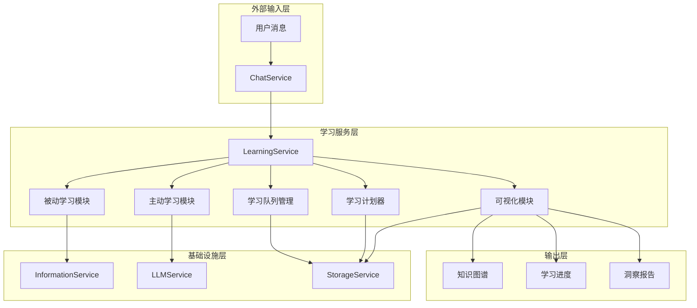

## 三、功能模块详解

### 3.1 被动学习模块（Passive Learning）

**原理**：基于模式匹配从对话消息中自动提取知识，无需用户主动触发。

| 子功能 | 实现方法 | 解决的问题 |
|--------|----------|------------|
| 知识提取 | 正则表达式模式匹配（定义式、过程式、能力式、键值对） | 从自然语言中识别结构化知识 |
| 偏好提取 | 模式匹配用户表达偏好的语句 | 理解用户喜好，个性化响应 |
| 知识缺口检测 | 模式匹配疑问句式和表达不确定的语句 | 识别用户知识盲区，主动填补 |
| 入队学习 | 将提取的知识加入优先级队列 | 有序管理待学习内容 |

**知识提取模式**：

```typescript
// 定义式: "X is Y"
{ regex: /(\w+(?:\s+\w+){0,5})\s+is\s+(?:a\s+)?(\w+(?:\s+\w+){0,10})/gi, confidence: 0.6 }

// 过程式: "to X, you need to Y"
{ regex: /to\s+(\w+(?:\s+\w+){0,5}),?\s+you\s+(?:need\s+to|should)\s+(\w+(?:\s+\w+){0,10})/gi, confidence: 0.5 }

// 能力式: "X can be used to Y"
{ regex: /(\w+(?:\s+\w+){0,5})\s+can\s+(?:be\s+used\s+to|help)\s+(\w+(?:\s+\w+){0,10})/gi, confidence: 0.5 }
```

**数据流**：
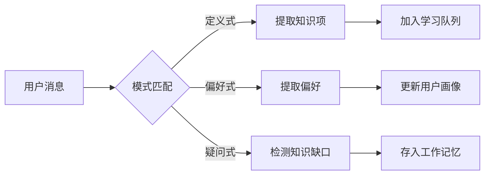

### 3.2 学习队列管理（Learning Queue）

**原理**：基于优先级队列管理待学习内容，支持用户干预。

| 子功能 | 实现方法 | 解决的问题 |
|--------|----------|------------|
| 队列查询 | 按优先级排序返回 | 用户查看待学习列表 |
| 优先级调整 | 修改队列项优先级 | 用户控制学习顺序 |
| 跳过学习项 | 修改状态为 skipped | 用户排除不需要学习的内容 |
| 批量批准 | 批量修改状态为 approved | 高效处理待学习项 |
| 队列统计 | 按状态分组计数 | 监控学习进度 |
| 队列限制 | 超过1000项时保留高优先级 | 防止内存溢出 |

**状态流转**：
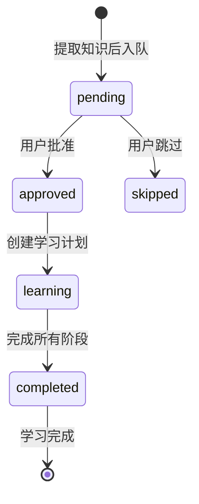

### 3.3 学习批处理（Learning Batcher）

**原理**：将相关知识分组，一起学习以提高效率。

| 子功能 | 实现方法 | 解决的问题 |
|--------|----------|------------|
| 标签分组 | 基于 InformationService 的标签提取 | 按主题聚类相关知识 |
| 相关性评分 | 综合置信度和优先级 | 确定学习批次的重要性 |
| 批次排序 | 按相关性评分排序 | 优先处理重要批次 |

**分组逻辑**：
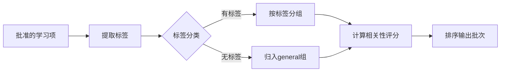

### 3.4 学习计划器（Learning Planner）

**原理**：分阶段渐进式学习，避免大型任务饿死其他任务。

| 阶段 | 名称 | 目标 | 占比 |
|------|------|------|------|
| Phase 1 | Exploration（探索） | 初步了解知识 | 25% |
| Phase 2 | Comprehension（理解） | 深入理解原理 | 25% |
| Phase 3 | Application（应用） | 实践应用 | 25% |
| Phase 4 | Mastery（掌握） | 融会贯通 | 25% |

**设计思想**：参考人类学习曲线，将学习任务分解为多个小阶段，每个阶段完成后才进入下一阶段，确保学习质量。

**计划创建流程**：
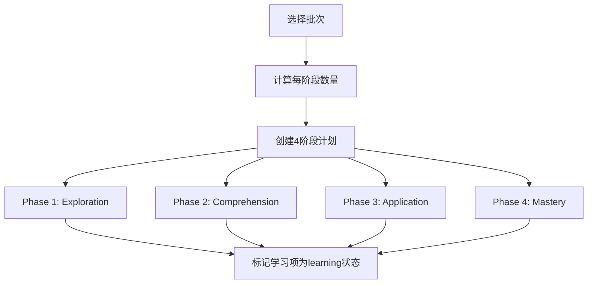

### 3.5 防饥饿机制（Starvation Prevention）

**原理**：基于时间的优先级提升，防止低优先级任务长期未被处理。

| 子功能 | 实现方法 | 解决的问题 |
|--------|----------|------------|
| 饥饿检测 | 检测最老待处理项的时间是否超过24小时 | 识别长期未处理的任务 |
| 队列重平衡 | 根据等待时间提升优先级（最大5倍） | 自动提升长期等待任务的优先级 |

**优先级提升公式**：
```
priority = min(original_priority * (1 + age_boost), 100)
age_boost = min(age_ms / 24小时, 5)  // 最大5倍提升
```

**重平衡流程**：
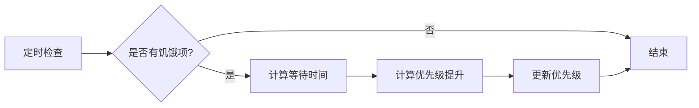

### 3.6 主动学习模块（Active Learning）

**原理**：系统空闲时主动执行学习任务，学习内容由三个驱动源共同生成，比例为 **4:4:2**。

| 驱动源 | 权重 | 目标 |
|--------|------|------|
| 图连通性驱动 | 40% | 增强知识图谱中 tag 之间的连接 |
| 节点激活驱动 | 40% | 加深被频繁访问的知识 |
| 近期输入驱动 | 20% | 跟进用户最近的兴趣和需求 |

#### 3.6.1 图连通性驱动（Graph Connectivity）

**原理**：通过分析知识图谱中的 tag 关系，发现潜在的连接机会，增强图的连通性。

| 子功能 | 实现方法 | 解决的问题 |
|--------|----------|------------|
| 高度数 tag 配对 | 找出度数 >= 2 的 tag，检查它们之间是否已有连接 | 发现潜在的知识关联 |
| 孤立节点检测 | 找出度数为 0 的 tag，标记为需要建立连接 | 避免知识孤岛 |
| 优先级计算 | `priority = 40 + (degreeA + degreeB) / 2 * 2` | 高连接度的 tag 优先学习 |

**图连通性学习流程**：
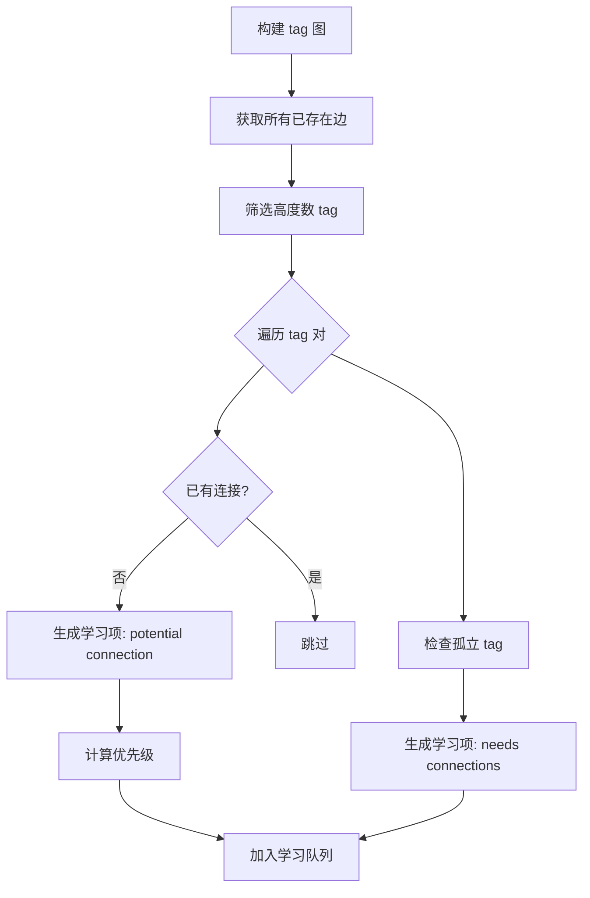

#### 3.6.2 节点激活驱动（Activation Driven）

**原理**：根据节点的访问频率和激活次数，确定需要加深学习的知识。

| 子功能 | 实现方法 | 解决的问题 |
|--------|----------|------------|
| 激活统计 | 统计 retrievalCount + accessHistory.length | 衡量节点活跃度 |
| 高频节点筛选 | 取前 10 个最活跃的节点 | 聚焦核心知识 |
| 优先级计算 | `priority = 40 + activationScore * 3` | 激活次数越多优先级越高 |

**节点激活学习流程**：
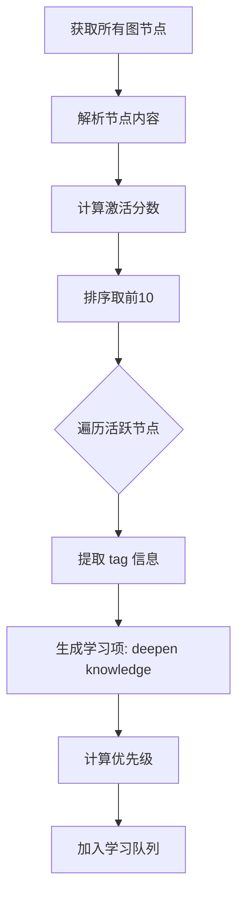

#### 3.6.3 近期输入驱动（Recent Input）

**原理**：分析用户最近的输入，发现用户当前的兴趣和需求，生成针对性学习内容。

| 子功能 | 实现方法 | 解决的问题 |
|--------|----------|------------|
| 近期记忆筛选 | 取最近 10 条用户消息 | 追踪用户当前兴趣 |
| tag 提取 | 从近期记忆中提取 tag | 识别用户关注领域 |
| 优先级计算 | `priority = 20 + index * 2` | 越近的输入优先级越高 |

**近期输入学习流程**：
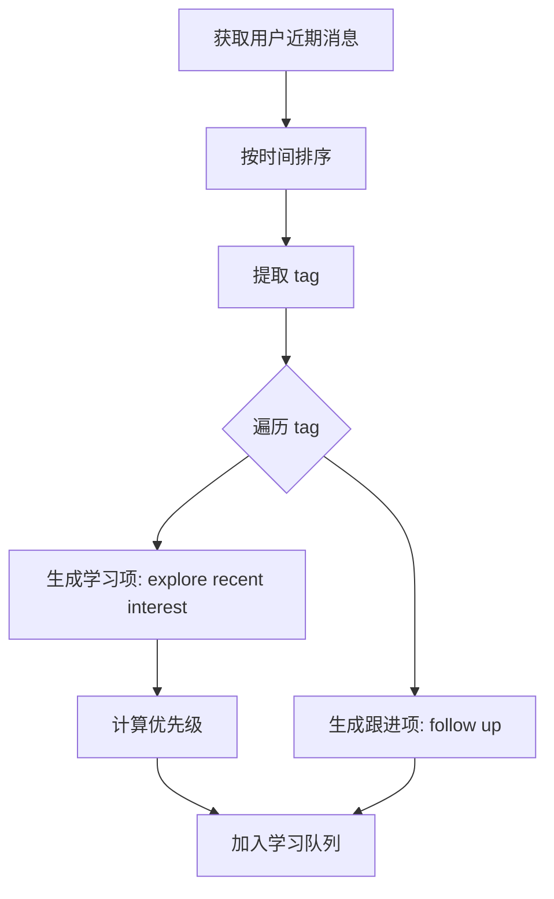

#### 3.6.4 主动学习调度

**原理**：系统空闲时定期执行主动学习，综合三个驱动源生成学习任务。

| 子功能 | 实现方法 | 解决的问题 |
|--------|----------|------------|
| 空闲检测 | 通过 isIdleState 状态判断 | 不影响主业务 |
| 并行生成 | Promise.all 并行调用三个驱动 | 提高效率 |
| 优先级排序 | 合并所有学习项后按优先级排序 | 确保重要内容优先 |
| 数量限制 | 每次最多生成 5 个学习项 | 防止队列过载 |

**完整主动学习流程**：
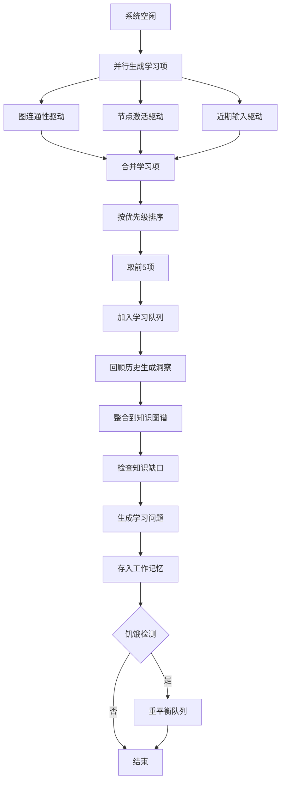

### 3.7 学习可视化（Learning Visualization）

**原理**：提供多种视角展示学习成果和进度。

| 子功能 | 实现方法 | 解决的问题 |
|--------|----------|------------|
| 已学知识列表 | 查询完成状态的学习项 | 用户查看已掌握的知识 |
| 学习进度 | 统计各状态数量和阶段进度 | 用户了解学习进展 |
| 知识图谱 | 构建节点-边图（知识节点+标签节点） | 用户可视化知识关联 |
| 洞察列表 | 查询最近生成的洞察 | 用户了解系统学习成果 |

**知识图谱结构**：
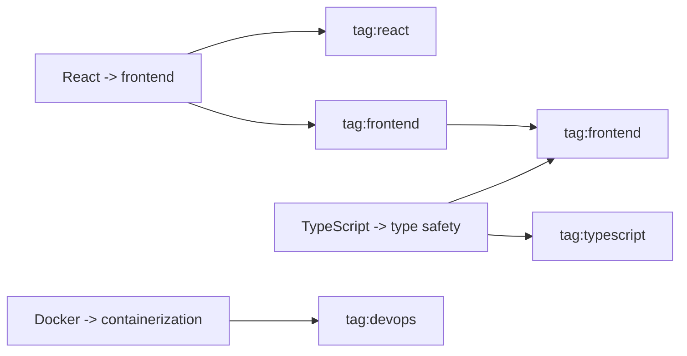

### 3.8 标签集成（Tag Integration）

**原理**：通过标签体系实现知识的分类和关联。

| 子功能 | 实现方法 | 解决的问题 |
|--------|----------|------------|
| 标签提取 | 调用 InformationService.extractTags | 自动分类知识 |
| 标签图集成 | 将标签关系存储为语义记忆 | 构建标签之间的关联图 |

**标签维度**：
| 维度 | 示例 |
|------|------|
| domain（领域） | frontend, backend, devops, ai-ml |
| industry（行业） | finance, healthcare, ecommerce, education |
| concept（概念） | architecture, performance, patterns, paradigms |
| action（动作） | create, modify, analyze, search |

## 四、API 接口设计

| 接口 | 方法 | 功能 |
|------|------|------|
| `/api/learning/queue` | GET | 获取学习队列 |
| `/api/learning/queue/stats` | GET | 获取队列统计 |
| `/api/learning/queue/:id/priority` | PUT | 设置优先级 |
| `/api/learning/queue/:id/skip` | PUT | 跳过学习项 |
| `/api/learning/queue/batch-approve` | POST | 批量批准 |
| `/api/learning/batches` | GET | 获取批处理分组 |
| `/api/learning/plans` | POST | 创建学习计划 |
| `/api/learning/plans/:id/next-phase` | GET | 获取下一阶段 |
| `/api/learning/plans/:id/complete-phase` | POST | 完成阶段 |
| `/api/learning/progress` | GET | 获取学习进度 |
| `/api/learning/knowledge` | GET | 获取已学习知识 |
| `/api/learning/knowledge/graph` | GET | 获取知识图谱 |
| `/api/learning/insights` | GET | 获取最近洞察 |
| `/api/learning/is-idle` | GET | 检查是否空闲 |
| `/api/learning/schedule` | POST | 配置主动学习间隔 |
| `/api/learning/starvation` | GET | 检查饥饿状态 |
| `/api/learning/rebalance` | POST | 重新平衡队列 |

## 五、数据模型

### 5.1 KnowledgeItem（知识项）
```typescript
interface KnowledgeItem {
  content: string;      // 知识内容，如 "React -> frontend library"
  source: string;       // 来源类型: definition/procedure/capability/key_value
  confidence: number;   // 置信度: 0-1
}
```

### 5.2 LearningQueueItem（学习队列项）
```typescript
interface LearningQueueItem {
  id: string;
  knowledgeItem: KnowledgeItem;
  priority: number;           // 优先级: 0-100
  status: 'pending' | 'approved' | 'skipped' | 'learning' | 'completed';
  createdAt: number;
}
```

### 5.3 LearningBatch（学习批次）
```typescript
interface LearningBatch {
  id: string;
  topic: string;              // 主题标签
  items: LearningQueueItem[];
  relevanceScore: number;     // 相关性评分
  createdAt: number;
}
```

### 5.4 LearningPlan（学习计划）
```typescript
interface LearningPlan {
  id: string;
  batchId: string;
  phases: [
    { phase: 1; name: 'Exploration'; status: string; items: string[]; startedAt?: number; completedAt?: number },
    { phase: 2; name: 'Comprehension'; status: string; items: string[]; startedAt?: number; completedAt?: number },
    { phase: 3; name: 'Application'; status: string; items: string[]; startedAt?: number; completedAt?: number },
    { phase: 4; name: 'Mastery'; status: string; items: string[]; startedAt?: number; completedAt?: number },
  ];
  createdAt: number;
}
```

### 5.5 Insight（洞察）
```typescript
interface Insight {
  content: string;    // 原始内容摘要
  insight: string;    // 洞察结论
  timestamp: number;
}
```

## 六、完整工作流程图

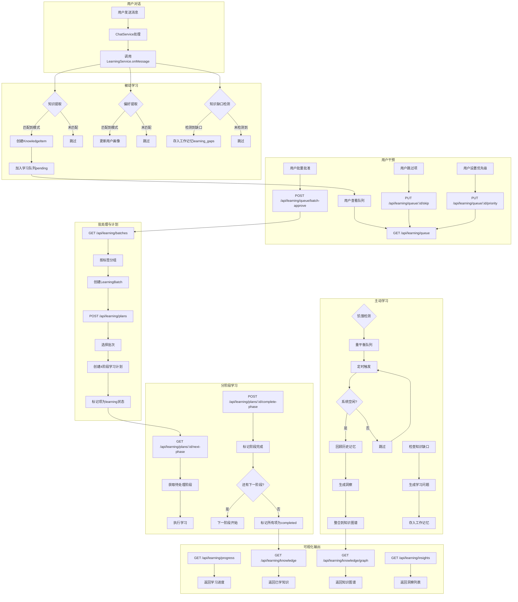

## 七、关键设计决策

| 决策 | 理由 |
|------|------|
| **模式匹配而非 LLM 提取** | 实时性要求高，模式匹配性能优于 LLM 调用 |
| **优先级队列** | 确保重要知识优先学习 |
| **四阶段学习** | 参考人类学习曲线，确保学习质量 |
| **防饥饿机制** | 防止低优先级任务被永久忽略 |
| **批处理学习** | 相关知识一起学习，提高学习效率 |
| **主动学习调度** | 空闲时持续学习，不影响主业务 |
| **标签体系** | 实现知识的分类和关联，支持语义搜索 |

## 八、性能考虑

| 方面 | 措施 |
|------|------|
| **队列大小限制** | 最大1000项，超出时保留高优先级 |
| **主动学习间隔** | 默认5分钟，可配置 |
| **历史回顾范围** | 最近24小时，最多20条 |
| **批量处理** | 相关知识一起学习，减少 LLM 调用次数 |
| **标签演化** | 每6小时执行一次，不影响实时性能 |

## 九、代码实现位置

| 模块 | 文件路径 |
|------|----------|
| LearningService | `backend/src/core/learning/index.ts` |
| InformationService | `backend/src/core/information/index.ts` |
| Learning Routes | `backend/src/routes/learning.ts` |
| Learning Tests | `backend/tests/core/learning.test.ts` |