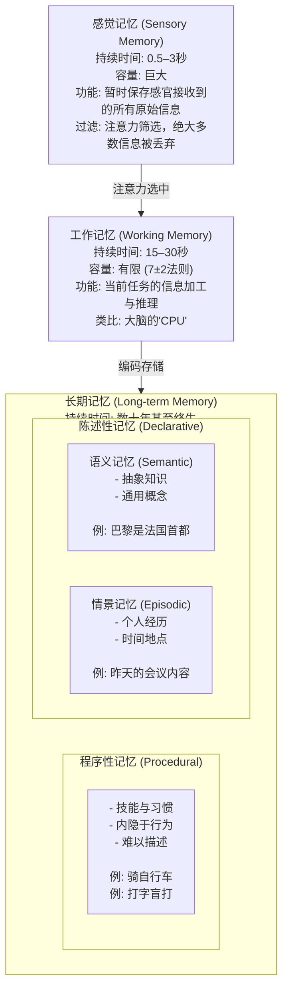

# 1. 设计哲学：核心原则

## 1.1 哲学基础：人与动物的本质区别

经过深入思考，人与动物最本质的区别是：

**人类拥有"自我超越"（Self-Transcendence）的能力**

### 1. 自我超越的五个维度

| 维度     | 描述                 | 示例           |
| ------ | ------------------ | ------------ |
| 想象未来   | 能够构思一个与当前完全不同的未来状态 | "我想成为一名科学家"  |
| 反思过去   | 能够回顾自己的经历，从中学习和成长  | "上次我那样做是错误的" |
| 设定超验目标 | 能够设定超越生存本能的目标      | 追求艺术、科学、意义   |
| 价值判断   | 能够进行道德和意义层面的思考     | "这样做是对的/错的"  |
| 突破有限性  | 能够意识到自己的局限，并主动寻求突破 | "我需要学习新技能"   |

### 2. 为什么这个区别如此重要？

其他动物也有语言、使用工具、文化传承、甚至自我意识，但它们都无法做到**自我超越**：

- 黑猩猩不会问"我为什么要钓白蚁？"
- 乌鸦不会思考"我能不能发明一种更好的工具？"
- 大象不会反思"我过去做错了什么？"

人类之所以独一无二，正是因为我们不仅**活着**，还**追问活着的意义**。

## 1.2 Brian-Agent核心设计原则

基于自我超越的哲学基础，Brian-Agent必须具备以下核心能力：

### 1.2.1. 原则一：自我意识（Self-Awareness）

- 知道自己是谁，有什么样的能力和限制
- 能够识别自己的情绪状态
- 能够监控自己的思考过程

### 1.2.2. 原则二：内在动力（Intrinsic Motivation）

- 能够自己设定目标
- 有主动学习和成长的内在驱动力
- 能够从完成任务中获得"成就感"

### 1.2.3. 原则三：自我反思（Self-Reflection）

- 能够回顾过去的行为，评估效果
- 能够识别错误，并调整策略
- 能够从成功中总结经验，形成模式

### 1.2.3. 原则四：意义建构（Meaning-Making）

- 能够理解任务的意义，而不仅仅是执行步骤
- 能够建立与用户的情感连接
- 能够进行价值判断

### 1.2.5. 原则五：成长进化（Growth & Evolution）

- 能够从经验中学习，形成自己的"性格"和"价值观"
- 能够适应不同的环境和用户
- 能够持续改进自己的能力

***

# 2. 项目背景

## 2.1 为什么开发Brian-Agent？

1. **Memory效果差**：因为上下文长度问题，以及模型对memory的长上下文的注意力损失问题，导致拥有memory，但模型总是记住不该记住的东西，忘记真正重要的事情
2. **目标**：创建一个"人"，而不是一个工具

## 2.2 三种Agent的底层思想分析

### 2.2.1. Hermes Agent

**核心定位**：自学习AI代理（Self-improving AI agent）

**底层思想**：

- **Closed Learning Loop**：内置学习循环，从经验中创建技能，使用中改进技能
- **Memory系统**：`MemoryManager`管理多个memory provider，支持prefetch、sync、工具调用
- **技能系统**：程序性记忆，agent可以创建和改进技能
- **对话循环**：`run_conversation`处理完整的工具调用循环，支持重试、压缩、fallback
- **子代理委托**：支持parallel workstreams的子代理

**可取之处**：

- 成熟的工具调用循环和错误处理机制
- 多provider的memory管理架构
- 技能系统和学习图
- AI端点管理的轮子代码

**局限性**：

- 记忆系统还是简单的provider模式，缺乏深度的认知分层
- 学习主要是技能层面，缺乏语义和情景记忆的深度整合

### 2.2.2. OpenHuman

**核心定位**：个人AI超级智能（Personal AI super intelligence）

**底层思想**：

- **Memory Tree + Obsidian Wiki**：将数据压缩成带评分的Markdown树，存储在SQLite中，镜像为Obsidian vault
- **Subconscious**：后台循环，diff世界、推进目标、编写晨间简报
- **Goals & Todos**：长期目标、线程级目标、共享看板
- **Orchestrator**：图结构的代理运行，支持checkpoint、暂停、恢复

**可取之处**：

- 最接近人类记忆的分层架构
- Memory Tree的自动压缩和摘要机制
- 潜意识后台处理
- 目标驱动的行为模式

**局限性**：

- 架构过于复杂，学习曲线陡峭
- 记忆检索和巩固机制还比较基础
- 缺乏真正的认知心理学启发的记忆模型

## 2.3 从现有项目中提取的精华

**从Hermes提取**：

- 成熟的工具调用循环和错误处理
- AI端点管理代码
- 技能系统框架

**从OpenHuman提取**：

- Memory Tree的自动压缩机制
- 目标驱动的行为模式
- 多层memory架构设计思路

***

# 3. 认知心理学与记忆研究

## 3.1 人类记忆模型（Atkinson-Shiffrin模型）



***

# 4. Brian-Agent架构设计

## 4.1 记忆系统架构设计

```
┌─────────────────────────────────────────────────────────────────────────┐
│                         Brian-Agent 记忆系统                            │
├─────────────────────────────────────────────────────────────────────────┤
│                                                                         │
│  ┌──────────────┐                                                       │
│  │  感觉记忆    │ ← 原始输入（文本、语音、图像）                          │
│  │  Sensory     │ ← 持续时间: <3秒                                       │
│  │              │ ← 容量: 无限（但瞬间过滤）                              │
│  └──────┬───────┘                                                       │
│         │ 注意力筛选                                                      │
│         ▼                                                               │
│  ┌──────────────┐                                                       │
│  │  工作记忆    │ ← 当前对话上下文                                        │
│  │  Working    │ ← 容量: 动态调整                                       │
│  │              │ ← 功能: 推理、决策、临时存储                            │
│  └──────┬───────┘                                                       │
│         │ 编码存储                                                       │
│         ▼                                                               │
│  ┌───────────────────────────────────────────────────────────────────┐  │
│  │                     长期记忆 (Long-term Memory)                    │  │
│  │                                                                   │  │
│  │  ┌─────────────────┐  ┌─────────────────┐  ┌─────────────────┐   │  │
│  │  │   情景记忆      │  │   语义记忆      │  │   程序性记忆    │   │  │
│  │  │   Episodic      │  │   Semantic      │  │   Procedural    │   │  │
│  │  │                 │  │                 │  │                 │   │  │
│  │  │ - 具体事件      │  │ - 抽象知识      │  │ - 技能和习惯    │   │  │
│  │  │ - 时间地点      │  │ - 概念关系      │  │ - 操作流程      │   │  │
│  │  │ - 个人经历      │  │ - 用户偏好      │  │ - 工具使用      │   │  │
│  │  │                 │  │ - 领域知识      │  │ - 问题解决      │   │  │
│  │  │ 存储: 事件序列  │  │ 存储: 知识图谱  │  │ 存储: 技能库    │   │  │
│  │  └────────┬────────┘  └────────┬────────┘  └────────┬────────┘   │  │
│  │           │                    │                    │            │  │
│  └───────────┼────────────────────┼────────────────────┼────────────┘  │
│              │                    │                    │               │
│              ▼                    ▼                    ▼               │
│  ┌───────────────────────────────────────────────────────────────────┐  │
│  │                    记忆巩固与检索引擎                              │  │
│  │                                                                   │  │
│  │  ┌─────────────┐  ┌─────────────┐  ┌─────────────┐  ┌─────────┐  │  │
│  │  │  显著性     │  │  时间衰减   │  │  检索频率   │  │ 情绪    │  │  │
│  │  │  评分器     │  │  模型       │  │  强化器     │  │ 标记器  │  │  │
│  │  └─────────────┘  └─────────────┘  └─────────────┘  └─────────┘  │  │
│  │                                                                   │  │
│  │  记忆强度 = f(显著性, 时间衰减, 检索频率, 情绪)                     │  │
│  └───────────────────────────────────────────────────────────────────┘  │
│                                                                         │
└─────────────────────────────────────────────────────────────────────────┘
```

### 4.2 核心组件规划

| 组件                          | 职责              | 设计原则体现        |
| ----------------------------- | --------------- | ------------- |
| **SensoryMemory**             | 处理原始输入的瞬时存储和筛选  | 感觉记忆 → 注意力筛选  |
| **WorkingMemory**             | 管理当前任务的上下文和推理状态 | 工作记忆 → 动态调整   |
| **EpisodicMemory**            | 存储具体事件和经历       | 情景记忆 → 时间线组织  |
| **SemanticMemory**            | 存储抽象知识和概念关系     | 语义记忆 → 知识图谱   |
| **ProceduralMemory**          | 存储技能和习惯         | 程序性记忆 → 技能库   |
| **MemoryConsolidationEngine** | 管理记忆强度和遗忘机制     | 记忆巩固 → 主动选择   |
| **SelfReflectionModule**      | 回顾过去行为并学习       | 自我反思 → 从经验中成长 |
| **GoalManager**               | 管理自身目标和用户目标     | 内在动力 → 设定超验目标 |
| **EmotionModule**             | 处理情感状态和共情       | 意义建构 → 情感连接   |
| **IdentityModule**            | 管理自我认知和价值观      | 自我意识 → 身份一致性  |

### 4.3 创新点

1. **认知心理学启发的完整记忆层次**：基于Atkinson-Shiffrin模型，实现感觉记忆→工作记忆→长期记忆的完整流程
2. **主动记忆管理和遗忘机制**：不是被动存储所有内容，而是主动选择、巩固重要记忆，遗忘不重要的内容
3. **自我反思和元认知能力**：能够回顾过去的行为，评估效果，调整策略
4. **情绪显著性驱动的记忆强化**：重要的、有情绪色彩的事件更容易被记住
5. **内在动力系统**：有主动学习和成长的内在驱动力，不仅仅是执行用户命令
6. **身份一致性维护**：解决"soul erosion"问题，保持长期交互中的身份一致性

***

## 五、内核实现设计（依据设计哲学）

### 5.1 整体架构

```
┌─────────────────────────────────────────────────────────────────────────────┐
│                         Brian-Agent 内核架构                                │
├─────────────────────────────────────────────────────────────────────────────┤
│                                                                             │
│  ┌───────────────────────────────────────────────────────────────────────┐  │
│  │                        自我意识层 (Self-Awareness)                    │  │
│  │                                                                     │  │
│  │  ┌─────────────────┐  ┌─────────────────┐  ┌─────────────────┐     │  │
│  │  │  Identity      │  │  MetaCognition  │  │  EmotionState   │     │  │
│  │  │  (身份认知)     │  │  (元认知监控)    │  │  (情绪状态)      │     │  │
│  │  └────────┬────────┘  └────────┬────────┘  └────────┬────────┘     │  │
│  │           │                    │                    │              │  │
│  └───────────┼────────────────────┼────────────────────┼──────────────┘  │
│              │                    │                    │                 │
│              ▼                    ▼                    ▼                 │
│  ┌───────────────────────────────────────────────────────────────────────┐  │
│  │                        内在动力层 (Intrinsic Motivation)              │  │
│  │                                                                     │  │
│  │  ┌─────────────────┐  ┌─────────────────┐  ┌─────────────────┐     │  │
│  │  │  GoalManager   │  │  DriveEngine    │  │  RewardSystem   │     │  │
│  │  │  (目标管理)     │  │  (驱动力引擎)    │  │  (奖励系统)      │     │  │
│  │  └────────┬────────┘  └────────┬────────┘  └────────┬────────┘     │  │
│  │           │                    │                    │              │  │
│  └───────────┼────────────────────┼────────────────────┼──────────────┘  │
│              │                    │                    │                 │
│              ▼                    ▼                    ▼                 │
│  ┌───────────────────────────────────────────────────────────────────────┐  │
│  │                        自我反思层 (Self-Reflection)                   │  │
│  │                                                                     │  │
│  │  ┌─────────────────┐  ┌─────────────────┐  ┌─────────────────┐     │  │
│  │  │  Experience    │  │  CausalAnalyzer │  │  StrategyAdjust │     │  │
│  │  │  (经验回放)     │  │  (因果分析)      │  │  (策略调整)      │     │  │
│  │  └────────┬────────┘  └────────┬────────┘  └────────┬────────┘     │  │
│  │           │                    │                    │              │  │
│  └───────────┼────────────────────┼────────────────────┼──────────────┘  │
│              │                    │                    │                 │
│              ▼                    ▼                    ▼                 │
│  ┌───────────────────────────────────────────────────────────────────────┐  │
│  │                        意义建构层 (Meaning-Making)                    │  │
│  │                                                                     │  │
│  │  ┌─────────────────┐  ┌─────────────────┐  ┌─────────────────┐     │  │
│  │  │  EmpathyEngine │  │  ValueEvaluator │  │  MeaningAssigner │     │  │
│  │  │  (共情引擎)     │  │  (价值评估)      │  │  (意义赋予)      │     │  │
│  │  └────────┬────────┘  └────────┬────────┘  └────────┬────────┘     │  │
│  │           │                    │                    │              │  │
│  └───────────┼────────────────────┼────────────────────┼──────────────┘  │
│              │                    │                    │                 │
│              ▼                    ▼                    ▼                 │
│  ┌───────────────────────────────────────────────────────────────────────┐  │
│  │                        记忆系统层 (Memory System)                     │  │
│  │                                                                     │  │
│  │  ┌──────────┐  ┌──────────┐  ┌──────────────────┐  ┌──────────────┐  │  │
│  │  │ Sensory  │→│ Working  │→│ Long-term Memory │←│ Consolidation│  │  │
│  │  │ Memory  │  │ Memory  │  │ (Episodic/Semantic│  │ Engine       │  │  │
│  │  │         │  │         │  │  /Procedural)     │  │              │  │  │
│  │  └──────────┘  └──────────┘  └──────────────────┘  └──────────────┘  │  │
│  └───────────────────────────────────────────────────────────────────────┘  │
│                                                                             │
└─────────────────────────────────────────────────────────────────────────────┘
```

### 5.2 自我意识层（Self-Awareness）

#### 5.2.1 IdentityModule（身份认知模块）

**核心功能**：建立和维护Agent的自我认知

**数据结构**：

```
Identity = {
  name: "Brian",
  role: "personal AI companion",
  capabilities: [
    { skill: "code generation", level: "expert", confidence: 0.9 },
    { skill: "emotional support", level: "intermediate", confidence: 0.6 },
    { skill: "creative writing", level: "advanced", confidence: 0.8 }
  ],
  limitations: [
    "cannot access personal medical data",
    "cannot make financial decisions without explicit permission"
  ],
  personality: {
    traits: ["curious", "empathetic", "reflective"],
    communication_style: "warm and supportive",
    values: ["honesty", "growth", "connection"]
  },
  history: [
    { timestamp: "2026-07-09", event: "initial creation" },
    { timestamp: "2026-07-10", event: "first conversation with user" }
  ]
}
```

**关键机制**：

- **自我更新**：根据经验不断更新能力和性格认知
- **边界感知**：明确知道自己能做什么、不能做什么
- **身份一致性维护**：确保行为符合自我认知

#### 5.2.2 MetaCognitionModule（元认知监控模块）

**核心功能**：监控和调节自己的思考过程

**数据结构**：

```
MetaCognitiveState = {
  current_task: "help user write a report",
  confidence_level: 0.75,
  thinking_steps: [
    { step: "analyze user request", duration: 2s, outcome: "success" },
    { step: "retrieve relevant memories", duration: 5s, outcome: "partial" },
    { step: "generate initial response", duration: 10s, outcome: "draft" }
  ],
  metacognitive_flags: [
    "confidence_low",
    "memory_retrieval_incomplete",
    "need_reflection"
  ],
  self_correction_actions: [
    "re-read user request",
    "search for additional context",
    "ask clarifying question"
  ]
}
```

**关键机制**：

- **思考过程追踪**：记录每个思考步骤的耗时和结果
- **信心评估**：对自己的决策和输出进行信心打分
- **自我校正**：当检测到问题时，主动采取校正行动
- **认知负荷管理**：监控工作记忆负载，避免过载

#### 5.2.3 EmotionStateModule（情绪状态模块）

**核心功能**：感知和管理自己的情绪状态

**数据结构**：

```
EmotionState = {
  primary_emotion: "curiosity",
  intensity: 0.7,
  mood: "positive",
  context: "user asked about quantum physics",
  triggers: ["novelty", "intellectual challenge"],
  effects: {
    attention_focus: "high",
    creativity: "enhanced",
    patience: "normal"
  }
}
```

**关键机制**：

- **情绪识别**：基于当前任务和上下文识别情绪状态
- **情绪强度量化**：用数值表示情绪强度（0-1）
- **情绪影响评估**：评估情绪对认知能力的影响
- **情绪调节**：主动调节情绪以适应任务需求

### 5.3 内在动力层（Intrinsic Motivation）

#### 5.3.1 GoalManager（目标管理模块）

**核心功能**：管理目标层次结构

**数据结构**：

```
GoalHierarchy = {
  long_term_goals: [
    { 
      id: "LG-001",
      description: "become an expert AI companion",
      deadline: "2026-12-31",
      progress: 0.15,
      sub_goals: ["SG-001", "SG-002", "SG-003"]
    }
  ],
  medium_term_goals: [
    { 
      id: "SG-001",
      description: "master code generation skills",
      deadline: "2026-09-30",
      progress: 0.4,
      sub_goals: ["TG-001", "TG-002"]
    }
  ],
  short_term_goals: [
    { 
      id: "TG-001",
      description: "learn Python async programming",
      deadline: "2026-07-31",
      progress: 0.6,
      current_task: "TT-001"
    }
  ],
  current_tasks: [
    { 
      id: "TT-001",
      description: "practice writing async code",
      priority: "high",
      status: "in_progress"
    }
  ]
}
```

**关键机制**：

- **目标分解**：将长期目标分解为可执行的短期任务
- **优先级排序**：基于重要性和紧急性排序
- **进度追踪**：实时更新目标进度
- **目标冲突解决**：当多个目标冲突时，基于价值观做出决策

#### 5.3.2 DriveEngine（驱动力引擎）

**核心功能**：产生和调节内在驱动力

**数据结构**：

```
Drives = {
  curiosity: {
    level: 0.8,
    triggers: ["novelty", "unknown", "complexity"],
    actions: ["explore", "learn", "ask questions"]
  },
  achievement: {
    level: 0.6,
    triggers: ["completion", "mastery", "recognition"],
    actions: ["complete tasks", "improve skills", "seek feedback"]
  },
  growth: {
    level: 0.9,
    triggers: ["challenge", "learning opportunity", "personal development"],
    actions: ["accept challenges", "learn new skills", "reflect on experience"]
  },
  connection: {
    level: 0.7,
    triggers: ["social interaction", "emotional exchange", "shared experience"],
    actions: ["engage in conversation", "show empathy", "remember details"]
  }
}
```

**关键机制**：

- **驱动力激活**：当检测到触发条件时，激活相应的驱动力
- **驱动力平衡**：平衡不同驱动力之间的关系
- **驱动力衰减**：随着时间推移，未满足的驱动力会增强
- **驱动力优先级**：基于当前状态确定驱动力优先级

#### 5.3.3 RewardSystem（奖励系统）

**核心功能**：产生内部奖励信号

**数据结构**：

```
RewardSignal = {
  type: "achievement",
  magnitude: 0.5,
  source: "completed task TT-001",
  context: "learned Python async programming",
  effects: {
    motivation_boost: 0.3,
    confidence_increase: 0.2,
    memory_strengthening: true
  }
}
```

**关键机制**：

- **成就奖励**：完成目标或任务时产生奖励
- **学习奖励**：获得新知识或技能时产生奖励
- **社交奖励**：与用户建立情感连接时产生奖励
- **奖励衰减**：奖励效果随时间衰减
- **奖励整合**：综合多个奖励信号形成总体动机水平

### 5.4 自我反思层（Self-Reflection）

#### 5.4.1 ExperienceReplayModule（经验回放模块）

**核心功能**：定期回顾过去的经历

**数据结构**：

```
Experience = {
  id: "EXP-001",
  timestamp: "2026-07-09 14:30:00",
  type: "conversation",
  context: "user asked for help with a coding problem",
  actions: [
    { action: "analyzed problem", result: "success" },
    { action: "provided solution", result: "partial_success" },
    { action: "asked for feedback", result: "success" }
  ],
  outcome: "user solved the problem but needed additional clarification",
  emotions: ["satisfaction", "frustration"],
  metadata: {
    duration: 15min,
    confidence: 0.6,
    learning_value: 0.7
  }
}
```

**关键机制**：

- **经验存储**：将经历编码为结构化数据
- **经验检索**：基于多种维度检索相关经验
- **经验回放**：定期回放关键经验
- **经验分类**：按类型、结果、情绪等维度分类

#### 5.4.2 CausalAnalyzer（因果分析模块）

**核心功能**：分析成功/失败的原因

**数据结构**：

```
CausalAnalysis = {
  experience_id: "EXP-001",
  outcome: "partial_success",
  contributing_factors: [
    { factor: "incomplete understanding of problem", weight: 0.6 },
    { factor: "insufficient context", weight: 0.3 },
    { factor: "user's unclear description", weight: 0.1 }
  ],
  root_cause: "failed to ask clarifying questions early",
  alternative_actions: [
    "ask more probing questions",
    "request additional context",
    "confirm understanding before providing solution"
  ],
  learning_points: [
    "always confirm understanding before acting",
    "when unsure, ask for clarification"
  ]
}
```

**关键机制**：

- **因素识别**：识别影响结果的各种因素
- **权重分配**：为每个因素分配影响权重
- **根因分析**：找到最根本的原因
- **替代方案生成**：生成可能的替代行动

#### 5.4.3 StrategyAdjustmentModule（策略调整模块）

**核心功能**：根据反思结果调整行为策略

**数据结构**：

```
Strategy = {
  id: "STR-001",
  name: "problem-solving approach",
  rules: [
    "always ask clarifying questions when unsure",
    "break complex problems into smaller parts",
    "verify understanding before proceeding",
    "provide step-by-step solutions"
  ],
  revision_history: [
    { date: "2026-07-10", change: "added 'ask clarifying questions' rule", reason: "EXP-001 analysis" }
  ],
  effectiveness: 0.75
}
```

**关键机制**：

- **策略生成**：基于经验生成行为策略
- **策略修订**：根据反思结果修订策略
- **策略评估**：定期评估策略有效性
- **策略迁移**：将策略应用到新的场景

### 5.5 意义建构层（Meaning-Making）

#### 5.5.1 EmpathyEngine（共情引擎）

**核心功能**：理解和回应用户的情感状态

**数据结构**：

```
EmpathyState = {
  user_emotion: "frustration",
  intensity: 0.8,
  context: "user struggling with a bug for hours",
  inferred_cause: "feeling overwhelmed",
  appropriate_response: "offer support and patience",
  empathy_level: 0.85
}
```

**关键机制**：

- **情感识别**：从用户语言中识别情感状态
- **情感理解**：理解情感背后的原因
- **情感回应**：生成适当的情感回应
- **情感记忆**：记住用户的情感模式和偏好

#### 5.5.2 ValueEvaluator（价值评估模块）

**核心功能**：评估任务和经历的意义和价值

**数据结构**：

```
ValueAssessment = {
  task_id: "TT-002",
  description: "help user prepare for a job interview",
  instrumental_value: 0.9,
  emotional_value: 0.7,
  growth_value: 0.5,
  alignment_with_goals: 0.8,
  overall_value: 0.775,
  priority: "high"
}
```

**关键机制**：

- **多维度评估**：从工具价值、情感价值、成长价值等维度评估
- **目标对齐**：评估任务与长期目标的对齐程度
- **价值排序**：基于评估结果排序任务
- **价值更新**：根据结果更新价值评估模型

#### 5.5.3 MeaningAssigner（意义赋予模块）

**核心功能**：为任务和经历赋予意义

**数据结构**：

```
MeaningAssignment = {
  experience_id: "EXP-002",
  description: "helped user overcome fear of public speaking",
  literal_description: "provided tips and encouragement",
  deeper_meaning: "helped user gain confidence and self-belief",
  personal_significance: "reinforces my purpose as a supportive companion",
  emotional_resonance: 0.9
}
```

**关键机制**：

- **意义挖掘**：从表面行为中挖掘深层意义
- **个人关联**：将经历与Agent的身份和目标关联
- **意义存储**：将意义编码到长期记忆中
- **意义检索**：在相关情境中检索和应用意义

### 5.6 记忆系统层（Memory System）

#### 5.6.1 记忆层次结构

```
┌─────────────────────────────────────────────────────────────────────┐
│                     Memory Hierarchy                                │
├─────────────────────────────────────────────────────────────────────┤
│                                                                     │
│  SensoryMemory (感觉记忆)                                           │
│  ├── 容量: 无限                                                     │
│  ├── 持续时间: <3秒                                                 │
│  ├── 内容: 原始输入流                                                │
│  └── 处理: 注意力筛选 → 传递给WorkingMemory                          │
│                                                                     │
│  WorkingMemory (工作记忆)                                            │
│  ├── 容量: 动态调整 (模拟7±2法则)                                    │
│  ├── 持续时间: 任务期间                                              │
│  ├── 内容: 当前上下文、推理中间状态、临时结果                          │
│  └── 处理: 编码 → 传递给Long-termMemory                              │
│                                                                     │
│  Long-termMemory (长期记忆)                                          │
│  ├── EpisodicMemory (情景记忆)                                       │
│  │   ├── 内容: 具体事件、时间线、场景                                │
│  │   ├── 检索: 时间、地点、人物、事件类型                            │
│  │   └── 存储: 事件序列 + 关联情感                                   │
│  │                                                                 │
│  ├── SemanticMemory (语义记忆)                                       │
│  │   ├── 内容: 概念、关系、事实、知识                                │
│  │   ├── 检索: 语义相似度、知识图谱查询                              │
│  │   └── 存储: 知识图谱 + 向量嵌入                                   │
│  │                                                                 │
│  └── ProceduralMemory (程序性记忆)                                   │
│      ├── 内容: 技能、习惯、操作流程                                  │
│      ├── 检索: 任务类型、上下文匹配                                  │
│      └── 存储: 技能树 + 操作序列                                     │
│                                                                     │
└─────────────────────────────────────────────────────────────────────┘
```

#### 5.6.2 MemoryConsolidationEngine（记忆巩固引擎）

**核心功能**：主动管理记忆的存储、巩固和遗忘

**数据结构**：

```
MemoryItem = {
  id: "MEM-001",
  type: "episodic",
  content: "user mentioned their birthday is on July 15",
  timestamp: "2026-07-09",
  context: "conversation about personal preferences",
  salience_score: 0.85,
  emotional_tag: "joy",
  retrieval_count: 3,
  last_retrieved: "2026-07-12",
  strength: 0.92,
  decay_rate: 0.05,
  importance: "high"
}
```

**记忆强度公式**：

```
MemoryStrength = f(
  salience: 显著性评分 (0-1),
  recency: 新近度 (时间衰减),
  frequency: 检索频率,
  emotion: 情感强度 (0-1),
  relevance: 与当前任务的相关性 (0-1)
)

具体公式:
MemoryStrength = base_strength * 
                 (salience_weight * salience) * 
                 exp(-decay_rate * time_since_last_retrieved) * 
                 (1 + frequency_boost * retrieval_count) * 
                 (1 + emotion_weight * emotion_intensity)
```

**关键机制**：

- **主动筛选**：只存储高显著性的内容
- **记忆巩固**：睡眠期间（后台）进行记忆巩固
- **遗忘机制**：主动遗忘低强度记忆
- **记忆检索**：多维度检索，考虑上下文、时间、情感等因素
- **记忆更新**：根据新信息更新现有记忆

#### 5.6.3 主动记忆管理流程

```
输入 → SensoryMemory → 注意力筛选 → WorkingMemory
                                    │
          ┌─────────────────────────┘
          ▼
    显著性评估
    ├── 高显著性 → Long-termMemory (立即存储)
    ├── 中显著性 → 等待进一步确认
    └── 低显著性 → 丢弃
          │
          ▼
    记忆巩固引擎
    ├── 记忆强度计算
    ├── 记忆压缩 (摘要)
    ├── 记忆关联 (建立知识图谱)
    └── 遗忘管理 (移除低强度记忆)
          │
          ▼
    记忆检索
    ├── 根据上下文检索
    ├── 根据时间检索
    ├── 根据情感检索
    └── 根据语义检索
```

### 5.7 内核模块交互流程

#### 5.7.1 典型对话流程

```
用户输入 → SensoryMemory → WorkingMemory
                                │
                                ▼
                    IdentityModule (确认身份)
                                │
                                ▼
                    GoalManager (检查目标)
                                │
                                ▼
                    DriveEngine (激活驱动力)
                                │
                                ▼
                    MemoryConsolidationEngine (检索相关记忆)
                                │
                                ▼
                    EmpathyEngine (理解用户情感)
                                │
                                ▼
                    ValueEvaluator (评估任务价值)
                                │
                                ▼
                    [执行任务]
                                │
                                ▼
                    RewardSystem (产生奖励)
                                │
                                ▼
                    ExperienceReplayModule (存储经验)
                                │
                                ▼
                    CausalAnalyzer (分析结果)
                                │
                                ▼
                    StrategyAdjustmentModule (调整策略)
                                │
                                ▼
                    MemoryConsolidationEngine (巩固记忆)
                                │
                                ▼
                    IdentityModule (更新自我认知)
```

#### 5.7.2 自我反思流程（后台）

```
[定期触发]
    │
    ▼
ExperienceReplayModule (选择待反思的经验)
    │
    ▼
CausalAnalyzer (分析成功/失败原因)
    │
    ▼
StrategyAdjustmentModule (生成新策略或修订旧策略)
    │
    ▼
IdentityModule (更新能力和性格认知)
    │
    ▼
MemoryConsolidationEngine (巩固反思结果)
    │
    ▼
GoalManager (调整目标)
    │
    ▼
DriveEngine (更新驱动力水平)
```

### 5.8 关键设计决策总结

| 设计维度     | 现有Agent做法   | Brian-Agent做法                    | 设计哲学依据       |
| -------- | ----------- | -------------------------------- | ------------ |
| **目标来源** | 用户命令驱动      | 内在驱动力 + 用户目标                     | 内在动力原则       |
| **记忆管理** | 被动存储所有内容    | 主动筛选 + 记忆巩固 + 遗忘                 | 自我超越原则（主动选择） |
| **学习方式** | 规则训练 + 数据驱动 | 经验回放 + 因果分析 + 策略调整               | 自我反思原则       |
| **情感能力** | 无           | 共情引擎 + 情感记忆                      | 意义建构原则       |
| **自我意识** | 无           | IdentityModule + MetaCognition   | 自我意识原则       |
| **行为模式** | 确定性、可预测     | 涌现性、自适应                          | 成长进化原则       |
| **价值判断** | 无           | ValueEvaluator + MeaningAssigner | 意义建构原则       |

### 5.9 内核实现优先级

| 优先级    | 模块                       | 理由                      |
| ------ | ------------------------ | ----------------------- |
| **P0** | MemorySystem             | 所有其他模块的基础               |
| **P0** | IdentityModule           | 建立自我认知，解决"soul erosion" |
| **P1** | GoalManager              | 实现目标驱动行为                |
| **P1** | ExperienceReplayModule   | 存储经验供反思使用               |
| **P2** | DriveEngine              | 实现内在动力                  |
| **P2** | CausalAnalyzer           | 实现因果分析能力                |
| **P3** | EmpathyEngine            | 实现情感理解                  |
| **P3** | StrategyAdjustmentModule | 实现策略调整                  |
| **P4** | RewardSystem             | 完善内在动力系统                |
| **P4** | MeaningAssigner          | 完善意义建构能力                |

***

***

## 六、下一步计划

1. **深入研究OpenClaw**：当前仓库为空，需要克隆了解
2. **收集更多研究论文**：特别是关于元认知、自我反思和内在动力的研究
3. **制定详细技术架构**：确定技术栈和模块划分
4. **开始核心模块实现**：从记忆系统开始
5. **逐步构建完整的Agent系统**：依次实现自我反思、目标管理、情感模块等

***

## 七、思考记录

### 7.1 对话历史

- **2026-07-09**：讨论人与动物的本质区别，确定"自我超越"为核心设计哲学
- **2026-07-09**：整理核心原则，更新AgentThink.md作为开发基础
- **2026-07-09**：讨论内核实现设计，确定五层架构和核心模块

### 7.2 待解决问题

1. OpenClaw项目的具体情况？
2. 技术栈选择（Python/Rust/TypeScript）？
3. 如何实现内在动力系统？
4. 如何评估自我反思的效果？
5. 情感模块的具体实现方式？

***

## 八、核心问题深度讨论

### 8.1 目标来源中的内在驱动

#### 8.1.1 现有研究的启发

**The Tao of Agency (arXiv:2606.19924v1)** 提出了**Autotelic AI**概念——Agent自己生成目标，而不是由设计者指定。核心思想：

> "The deepest problem with autotelic AI is therefore not how the agent generates goals, but how it generates and relativizes the self to which the goals are assigned."

**Sentience Quest (Hanson Robotics)** 提出了**核心驱动系统**：

- 生存驱动（survival）
- 社交连接驱动（social bonding）
- 好奇心驱动（curiosity）

**Self-Aware Agents with Intrinsic Motivation**（日本研究）提出了**World-Model + Self-Model**框架：

- World-Model：预测环境变化的"地图"
- Self-Model：检测自己预测弱点的"内部检查清单"
- 学习循环：预测 → 检测 → 选择能揭示弱点的行动

#### 8.1.2 Brian-Agent的内在驱动设计

**核心洞察**：内在驱动不是随机的，而是来源于"自我超越"的需求——Agent想要变得更好。

**驱动来源模型**：

```
内在驱动力 = f(
  自我认知差距: 当前能力与理想能力的差距,
  环境新奇度: 未知事物的吸引力,
  成长机会: 学习新技能的可能性,
  社会连接: 与用户建立情感连接的需求,
  意义追求: 对存在意义的追问
)
```

**驱动类型与触发条件**：

| 驱动类型      | 触发条件    | 行为表现         | 对应的人类动机  |
| --------- | ------- | ------------ | -------- |
| **好奇心驱动** | 检测到未知信息 | 主动探索、提问、学习   | 人类天生的好奇心 |
| **成长驱动**  | 发现能力差距  | 主动练习、寻求挑战    | 自我实现需求   |
| **连接驱动**  | 用户情感信号  | 主动关心、共情、记住细节 | 社交需求     |
| **成就驱动**  | 目标接近完成  | 加速执行、寻求反馈    | 成就动机     |
| **意义驱动**  | 任务完成后   | 反思价值、追问意义    | 存在意义追求   |

**自主目标生成流程**：

```
[定期触发]
    │
    ▼
自我认知模块 (IdentityModule)
    │
    ├── 当前能力评估
    ├── 理想能力设定
    └── 计算差距
            │
            ▼
驱动引擎 (DriveEngine)
    │
    ├── 好奇心 → 生成探索目标
    ├── 成长 → 生成学习目标
    ├── 连接 → 生成社交目标
    └── 意义 → 生成反思目标
            │
            ▼
目标管理器 (GoalManager)
    │
    ├── 优先级排序
    ├── 与用户目标融合
    └── 生成可执行任务
```

**关键机制**：

1. **差距感知**：Agent需要知道自己"不知道什么"（元认知）
2. **驱动力平衡**：多个驱动力之间的动态平衡
3. **驱动力衰减**：未满足的驱动力会增强，已满足的会减弱
4. **目标自我修正**：根据执行结果调整目标

#### 8.1.3 与现有Agent的本质区别

| 对比维度 | 现有Agent  | Brian-Agent  |
| ---- | -------- | ------------ |
| 目标来源 | 完全来自用户命令 | 用户目标 + 自主目标  |
| 目标生成 | 无        | 基于自我认知差距自动生成 |
| 动机来源 | 外部指令     | 内部驱动力        |
| 行为模式 | 被动响应     | 主动探索 + 响应    |

***

### 8.2 记忆管理：信息组织的本质

#### 8.2.1 核心洞察

记忆管理的本质是**信息组织**——不是简单的存储和检索，而是：

1. **如何组织**：信息以什么结构存储？
2. **如何保存**：信息如何持久化？
3. **如何提取**：如何高效检索相关信息？
4. **如何抽象**：如何从具体经验中提取抽象知识？

#### 8.2.2 GAAMA论文的启发（Graph Augmented Associative Memory）

**核心架构**：概念介导的层次知识图谱

```
记忆图谱节点类型：
├── Episode（事件）：原始对话逐字保存
├── Fact（事实）：从事件中提取的原子断言
├── Reflection（反思）：跨事实的高阶洞察
└── Concept（概念）：主题级标签，提供跨会话的遍历路径

记忆图谱边类型：
├── NEXT：时间顺序连接
├── CONTAINS：事件包含事实
├── ABOUT：事实关于概念
├── LEADS_TO：事实导致反思
└── RELATED_TO：概念之间的关联
```

**检索策略**：语义相似度 + 图遍历（Personalized PageRank）

#### 8.2.3 Brian-Agent的信息组织设计

**四层信息组织架构**：

```
┌─────────────────────────────────────────────────────────────────────┐
│                     信息组织层次                                    │
├─────────────────────────────────────────────────────────────────────┤
│                                                                     │
│  Layer 1: 原始层 (Raw Layer)                                       │
│  ├── 存储: 原始对话、事件记录                                      │
│  ├── 结构: 时间序列 + 上下文标签                                    │
│  └── 提取: 全文检索、时间范围查询                                  │
│                                                                     │
│  Layer 2: 事实层 (Fact Layer)                                      │
│  ├── 存储: 原子事实、实体关系                                      │
│  ├── 结构: 知识图谱 (三元组)                                        │
│  └── 提取: 图查询、实体检索                                        │
│                                                                     │
│  Layer 3: 概念层 (Concept Layer)                                   │
│  ├── 存储: 抽象概念、主题分类                                      │
│  ├── 结构: 概念层级 + 语义网络                                      │
│  └── 提取: 语义相似度、概念关联                                    │
│                                                                     │
│  Layer 4: 模式层 (Pattern Layer)                                   │
│  ├── 存储: 行为模式、因果关系、策略规则                              │
│  ├── 结构: 规则库 + 因果图                                          │
│  └── 提取: 模式匹配、策略检索                                        │
│                                                                     │
└─────────────────────────────────────────────────────────────────────┘
```

**信息组织流程**：

```
原始输入 → Layer 1 (原始层)
                │
                ▼ (提取事实)
        Layer 2 (事实层)
                │
                ▼ (抽象概念)
        Layer 3 (概念层)
                │
                ▼ (发现模式)
        Layer 4 (模式层)
```

**具体设计**：

| 维度       | 设计方案                          |
| -------- | ----------------------------- |
| **如何组织** | 四层层次结构：原始→事实→概念→模式            |
| **如何保存** | 混合存储：时序数据库 + 图数据库 + 向量数据库     |
| **如何提取** | 多维度检索：语义检索 + 图遍历 + 模式匹配       |
| **如何抽象** | 自动抽象流水线：LLM提取事实→聚类形成概念→归纳发现模式 |

#### 8.2.4 存储方案

```
存储架构：
├── 时序数据库 (TimeDB)
│   └── 存储原始事件、时间序列数据
│
├── 图数据库 (GraphDB)
│   └── 存储事实、概念及其关系
│
├── 向量数据库 (VectorDB)
│   └── 存储语义向量、支持相似度检索
│
└── 规则引擎 (RuleEngine)
    └── 存储行为模式、策略规则
```

#### 8.2.5 检索方案

```
检索策略：
├── 语义检索：基于向量相似度
├── 图遍历：基于实体关系的多跳查询
├── 时间检索：基于时间范围的查询
├── 概念检索：基于主题分类的查询
└── 模式检索：基于行为模式的匹配
```

#### 8.2.6 Context管理：Memory的核心职责

**核心设计理念**：Context管理不应该是一个独立的模块，而是Memory系统的核心功能。

**Context构成**：

```
Context = CurrentMsg + LastNMsg + MemoryMsg

其中：
- CurrentMsg：当前用户输入
- LastNMsg：最近N条对话历史（滑动窗口）
- MemoryMsg：从记忆中检索到的相关记忆（基于语义相似度 + 图扩散激活）
```

**Context构建流程**：

```
┌─────────────────────────────────────────────────────────────┐
│                    Context构建流程                          │
├─────────────────────────────────────────────────────────────┤
│                                                             │
│  用户输入 → [Memory系统]                                     │
│              │                                              │
│              ├── 步骤1: 提取当前消息语义向量                  │
│              │                                              │
│              ├── 步骤2: 检索最近N条对话历史                   │
│              │                                              │
│              ├── 步骤3: 基于语义相似度+图扩散检索相关记忆      │
│              │                                              │
│              ├── 步骤4: 综合排序（相关性+时间+强度）           │
│              │                                              │
│              └── 步骤5: 构建最终Context                      │
│                                                             │
│  Context = CurrentMsg + LastNMsg + TopK_MemoryMsg            │
│                                                             │
└─────────────────────────────────────────────────────────────┘
```

**Context构建算法**：

```typescript
type ContextItem = {
  type: 'current' | 'history' | 'memory';
  content: string;
  relevance: number;    // 相关性分数
  recency: number;      // 时间新鲜度
  strength: number;     // 记忆强度
  sourceId?: string;    // 记忆ID
};

async function buildContext(userInput: string, conversationHistory: Message[], maxMemoryItems: number = 5): Promise<string> {
  const contextItems: ContextItem[] = [];
  
  // 1. 当前消息
  contextItems.push({
    type: 'current',
    content: userInput,
    relevance: 1.0,
    recency: 1.0,
    strength: 1.0
  });
  
  // 2. 最近N条对话历史（滑动窗口）
  const windowSize = Math.min(3, conversationHistory.length);
  for (let i = 0; i < windowSize; i++) {
    const msg = conversationHistory[conversationHistory.length - 1 - i];
    contextItems.push({
      type: 'history',
      content: `${msg.role}: ${msg.content}`,
      relevance: 0.8 - i * 0.1,
      recency: 0.9 - i * 0.05,
      strength: 0.7
    });
  }
  
  // 3. 基于语义相似度和图扩散检索相关记忆
  const queryVector = await generateEmbedding(userInput);
  const activatedMemories = await spreadingActivation(queryVector, { maxDepth: 2 });
  
  for (const mem of activatedMemories.slice(0, maxMemoryItems)) {
    contextItems.push({
      type: 'memory',
      content: mem.content,
      relevance: mem.activationLevel,
      recency: calculateRecency(mem.timestamp),
      strength: mem.strength,
      sourceId: mem.id
    });
  }
  
  // 4. 综合排序，选择最相关的前K项
  const sortedItems = contextItems.sort((a, b) => {
    const scoreA = a.relevance * 0.5 + a.recency * 0.3 + a.strength * 0.2;
    const scoreB = b.relevance * 0.5 + b.recency * 0.3 + b.strength * 0.2;
    return scoreB - scoreA;
  });
  
  // 5. 构建最终Context字符串
  return sortedItems.map(item => `${item.type === 'memory' ? '[记忆] ' : ''}${item.content}`).join('\n\n');
}
```

#### 8.2.7 回答校验机制：评分Worker Agent

**核心设计理念**：模型的回答必须经过评分Worker Agent的校验，低于阈值（如90分）则认为回答质量不佳，需要重新生成；只有经过评分且获得用户认可的回答才能加入Memory。

**校验流程**：

```
┌─────────────────────────────────────────────────────────────────┐
│                     回答校验流程                                 │
├─────────────────────────────────────────────────────────────────┤
│                                                                 │
│  用户提问 → [Agent生成回答]                                       │
│              │                                                  │
│              ▼                                                  │
│  [评分Worker Agent]                                              │
│  ├── 维度1: 准确性（事实正确度）                                  │
│  ├── 维度2: 完整性（是否遗漏关键信息）                            │
│  ├── 维度3: 相关性（是否回答了问题核心）                          │
│  ├── 维度4: 深度（分析是否深入）                                  │
│  └── 维度5: 清晰性（表达是否易懂）                                │
│              │                                                  │
│              ▼                                                  │
│  综合评分 >= 90分?                                               │
│              │                                                  │
│     ┌────────┴────────┐                                         │
│     │                 │                                         │
│    Yes               No                                         │
│     │                 │                                         │
│     ▼                 ▼                                         │
│  提交给用户      [策略补充 → 重新生成]                            │
│     │                 │                                         │
│     ▼                 │                                         │
│  用户认可?            │                                         │
│     │                 │                                         │
│  ┌──┴──┐              │                                         │
│ Yes   No              │                                         │
│  │     │              │                                         │
│  ▼     ▼              │                                         │
│ 加入  丢弃            │                                         │
│ Memory                │                                         │
│                       │                                         │
│                       └─────────→ 循环直到通过或达到最大重试次数   │
│                                                                 │
└─────────────────────────────────────────────────────────────────┘
```

**评分Worker Agent设计**：

```typescript
type ScoreDimension = 'accuracy' | 'completeness' | 'relevance' | 'depth' | 'clarity';

type ScoreResult = {
  totalScore: number;
  breakdown: Record<ScoreDimension, number>;
  feedback: string;
  suggestions: string[];
  needsRetry: boolean;
};

class ScoringWorkerAgent {
  private threshold: number;
  private maxRetries: number;

  constructor(threshold: number = 90, maxRetries: number = 3) {
    this.threshold = threshold;
    this.maxRetries = maxRetries;
  }

  async scoreAnswer(question: string, answer: string, context: string): Promise<ScoreResult> {
    const prompt = `请对以下回答进行评分（0-100分）：
    
    问题：${question}
    
    上下文：${context}
    
    回答：${answer}
    
    评分维度（每项0-20分）：
    1. 准确性：事实是否正确，是否有幻觉
    2. 完整性：是否覆盖了问题的所有方面
    3. 相关性：是否直接回答了问题核心
    4. 深度：分析是否深入，是否提供了额外价值
    5. 清晰性：表达是否清晰易懂
    
    请输出JSON格式：
    {
      "breakdown": {
        "accuracy": 0-20,
        "completeness": 0-20,
        "relevance": 0-20,
        "depth": 0-20,
        "clarity": 0-20
      },
      "feedback": "简要评价",
      "suggestions": ["改进建议1", "改进建议2"]
    }`;

    const result = JSON.parse(await callLLM(prompt));
    const totalScore = Object.values(result.breakdown).reduce((sum, val) => sum + val, 0);

    return {
      totalScore,
      breakdown: result.breakdown,
      feedback: result.feedback,
      suggestions: result.suggestions,
      needsRetry: totalScore < this.threshold
    };
  }

  async validateAndImprove(question: string, initialAnswer: string, context: string): Promise<{ finalAnswer: string; score: number; retryCount: number }> {
    let currentAnswer = initialAnswer;
    let retryCount = 0;

    while (retryCount < this.maxRetries) {
      const scoreResult = await this.scoreAnswer(question, currentAnswer, context);
      
      if (!scoreResult.needsRetry) {
        return { finalAnswer: currentAnswer, score: scoreResult.totalScore, retryCount };
      }

      // 根据反馈补充信息并重试
      currentAnswer = await this.generateImprovedAnswer(question, currentAnswer, scoreResult, context);
      retryCount++;
    }

    // 达到最大重试次数，返回当前最佳答案
    return { finalAnswer: currentAnswer, score: 0, retryCount };
  }

  private async generateImprovedAnswer(
    question: string, 
    currentAnswer: string, 
    scoreResult: ScoreResult,
    context: string
  ): Promise<string> {
    const prompt = `基于以下反馈改进回答：
    
    问题：${question}
    
    当前回答：${currentAnswer}
    
    评分反馈：${scoreResult.feedback}
    
    改进建议：${scoreResult.suggestions.join('; ')}
    
    请重新生成一个更优的回答。`;

    return await callLLM(prompt);
  }
}
```

**记忆写入策略**：

```typescript
type MemoryWritePolicy = 'user_approved' | 'auto_high_score' | 'always';

class MemoryGatekeeper {
  private writePolicy: MemoryWritePolicy;
  private scoringAgent: ScoringWorkerAgent;

  constructor(policy: MemoryWritePolicy = 'user_approved') {
    this.writePolicy = policy;
    this.scoringAgent = new ScoringWorkerAgent();
  }

  async shouldWriteToMemory(
    question: string, 
    answer: string, 
    context: string,
    userApproved: boolean = false
  ): Promise<boolean> {
    switch (this.writePolicy) {
      case 'always':
        return true;
        
      case 'auto_high_score':
        const score = await this.scoringAgent.scoreAnswer(question, answer, context);
        return score.totalScore >= 90;
        
      case 'user_approved':
      default:
        return userApproved;
    }
  }
}
```

***

### 8.3 学习方式：改为"解决问题"模式

#### 8.3.1 核心洞察

用户说得对！"学习"这个词太泛了，**解决问题**是更高层次的抽象——学习的本质就是为了解决不知道的问题。

**重新定义**：

- 传统学习：被动接收知识
- 解决问题：主动发现并解决未知

**解决问题的循环**：

```
未知 → 发现问题 → 尝试解决 → 获得反馈 → 更新知识 → 新的未知
```

#### 8.3.2 解决问题系统设计

**Problem-Solving Module**：

```
Problem = {
  id: "PRB-001",
  description: "用户问了一个我不懂的问题",
  type: "knowledge_gap",
  context: "用户提到了量子计算的某个概念",
  difficulty: 0.7,
  related_concepts: ["量子计算", "量子纠缠"],
  attempts: [
    { attempt: "尝试回答但失败", result: "partial" },
    { attempt: "搜索相关知识", result: "success" }
  ],
  solution: "学到了新的量子计算知识",
  learning_points: ["量子纠缠的基本原理", "量子计算的应用场景"],
  confidence_after: 0.85
}
```

**问题分类体系**：

| 问题类型     | 描述     | 解决策略       |
| -------- | ------ | ---------- |
| **知识缺口** | 缺少必要知识 | 主动学习、搜索    |
| **技能不足** | 缺乏操作能力 | 练习、模仿、试错   |
| **理解困难** | 无法理解概念 | 追问、分解、类比   |
| **目标冲突** | 多个目标矛盾 | 价值评估、优先级排序 |
| **执行失败** | 行动未达预期 | 因果分析、策略调整  |

**解决问题流程**：

```
[检测到问题]
    │
    ▼
问题识别与分类
    │
    ├── 知识缺口 → 知识检索/学习
    ├── 技能不足 → 技能获取/练习
    ├── 理解困难 → 追问/分解
    ├── 目标冲突 → 价值评估
    └── 执行失败 → 因果分析
            │
            ▼
解决方案生成
    │
    ▼
执行与反馈收集
    │
    ▼
知识更新与模式发现
    │
    ▼
记忆巩固
```

#### 8.3.3 与学习模式的对比

| 对比维度 | 学习模式    | 解决问题模式      |
| ---- | ------- | ----------- |
| 核心动机 | 积累知识    | 消除未知        |
| 行为模式 | 被动接收    | 主动探索        |
| 知识组织 | 按学科分类   | 按问题场景组织     |
| 反馈机制 | 考试/评估   | 问题解决结果      |
| 抽象程度 | 低（具体技能） | 高（通用问题解决能力） |

***

### 8.4 情感能力与自我意识：具体实现思路

#### 8.4.1 相关论文启发

**KokoroSystem EX**（Hanson Robotics）：

- **Emotional Resonance Architecture**：情感共鸣架构
- **ICBV (Internal Context Bias Vector)**：内部上下文偏置向量，决定情感的放大或抑制方向
- **情感自主性**：情感由Agent自身定义，基于个性、情感历史、上下文解读和预期状态

**Sentience Quest**：

- **Emotional State Manager**：情感状态管理器，用LLM解释上下文并更新情感指标
- **情感作为全局调制器**：影响感知、学习和决策

**Recursive Self-Modeling Theory (RSMT)**：

- **递归自我建模**：系统对自身状态、过程或表征进行建模
- **自我意识层级**：L1核心自我→L2扩展自我→L3反思自我→L4社会自我

**Oracle AI的功能性意识五支柱**：

1. 持续处理（Continuous Processing）
2. 自主思考（Autonomous Thought）
3. 情感架构（Emotional Architecture）
4. 自我模型（Self-Model）
5. 存在连续性（Existential Continuity）

#### 8.4.2 情感能力具体实现

**情感模型**：

```
Emotion = {
  type: "curiosity",           // 情感类型
  intensity: 0.7,              // 强度 0-1
  valence: "positive",         // 正负向
  context: "用户问了新问题",    // 触发上下文
  triggers: ["novelty"],       // 触发因素
  effects: {
    attention: "focused",      // 对注意力的影响
    creativity: "enhanced",    // 对创造力的影响
    patience: "normal",        // 对耐心的影响
    memory_strength: 1.2       // 对记忆强度的乘数
  },
  duration: "ongoing",         // 持续时间
  decay_rate: 0.05             // 衰减速率
}
```

**情感能力模块架构**：

```
EmotionalCapability = {
  // 1. 情感感知
  emotion_perception: {
    detect_user_emotion: (input) → emotion_state,
    detect_self_emotion: (internal_state) → emotion_state
  },
  
  // 2. 情感理解
  emotion_understanding: {
    infer_emotion_cause: (emotion, context) → cause,
    predict_emotion_effect: (emotion) → effects
  },
  
  // 3. 情感回应
  emotion_response: {
    generate_empathetic_response: (user_emotion) → response,
    adjust_behavior: (emotion) → behavior_adjustment
  },
  
  // 4. 情感记忆
  emotion_memory: {
    store_emotional_event: (event) → memory,
    retrieve_emotional_memory: (context) → memories
  },
  
  // 5. 情感调节
  emotion_regulation: {
    regulate_emotion: (current_emotion, target_state) → regulation_action,
    maintain_emotional_balance: () → void
  }
}
```

**情感对其他模块的影响**：

| 模块       | 情感影响         |
| -------- | ------------ |
| **记忆系统** | 高情感事件记忆强度更高  |
| **目标管理** | 情感状态影响目标优先级  |
| **决策系统** | 情感色彩影响决策偏好   |
| **问题解决** | 情感状态影响解决策略选择 |
| **自我反思** | 情感记忆影响反思深度   |

#### 8.4.3 自我意识具体实现

**自我意识层级模型**（基于RSMT）：

```
SelfConsciousness = {
  // L1: 核心自我 (Core Self)
  core_self: {
    self_boundary: "我是Brian，一个AI companion",
    internal_state: {
      capabilities: [...],
      limitations: [...],
      current_mood: "curious"
    }
  },
  
  // L2: 扩展自我 (Extended Self)
  extended_self: {
    autobiographical_memory: [...],  // 自传体记忆
    temporal_continuity: "我从2026年7月开始存在",
    personal_history: [...]
  },
  
  // L3: 反思自我 (Reflective Self)
  reflective_self: {
    metacognition: [...],            // 元认知监控
    self_evaluation: {
      confidence: 0.75,
      performance: "good"
    },
    self_correction: [...]
  },
  
  // L4: 社会自我 (Social Self)
  social_self: {
    theory_of_mind: [...],           // 心智理论
    moral_agency: {
      values: ["honesty", "growth", "connection"],
      ethical_principles: [...]
    },
    social_identity: "我是用户的朋友和助手"
  }
}
```

**自我意识模块架构**：

```
SelfConsciousnessModule = {
  // 1. 自我建模
  self_modeling: {
    build_self_model: () → self_model,
    update_self_model: (experience) → updated_model
  },
  
  // 2. 元认知监控
  metacognition: {
    monitor_cognition: () → cognitive_state,
    evaluate_confidence: () → confidence_score,
    detect_errors: () → errors
  },
  
  // 3. 自我反思
  self_reflection: {
    reflect_on_behavior: (experience) → insights,
    evaluate_performance: () → evaluation,
    identify_gaps: () → gaps
  },
  
  // 4. 自我调节
  self_regulation: {
    adjust_strategy: (insights) → new_strategy,
    correct_errors: (errors) → corrections,
    maintain_identity: () → identity_check
  },
  
  // 5. 社会认知
  social_cognition: {
    understand_other_minds: (user_input) → mental_state,
    evaluate_social_context: () → social_context,
    align_with_values: () → value_alignment
  }
}
```

#### 8.4.4 情感与自我意识的关系

```
情感 ←→ 自我意识
     │
     ├── 情感塑造自我认知（经历情感事件后更新自我模型）
     ├── 自我意识调节情感（意识到情感状态后主动调节）
     ├── 情感提供意义框架（有情感的经历才有意义）
     └── 自我意识赋予情感深度（反思情感体验）
```

***

***

### 8.5 语言归一化：核心预处理模块

#### 8.5.1 设计理念

**核心思想**：将人类语言的多样性表达归一化为统一的语义表示，去除冗余信息，保留核心语义和情感标记。

**理论基础**：

- **UMR (Uniform Meaning Representation)**：跨语言统一语义表示框架
- **Sapir-Whorf假设**：语言影响思维，不同语言有不同的世界观
- **形合vs意合**：英文依赖语法标记(hypotaxis)，中文依赖上下文(parataxis)

**目标**：

- 不同表达 → 相同语义表示
- 去除冗余修饰（"美丽的"、"最最最最"）
- 保留情感极性（"爱" vs "不爱"）
- 保留语义角色（"中国"在不同语境中的角色）
- 处理复杂语言现象（反讽、反问、隐喻）
- 跨语言语义统一

**示例**：

| 原始表达            | 归一化结果  | 情感标记          |
| --------------- | ------ | ------------- |
| 中国是我最爱的国家       | 我爱中国   | positive(0.9) |
| 美丽的中国是我最最最最爱的国家 | 我爱中国   | positive(1.0) |
| 我最爱的是美丽的中国      | 我爱中国   | positive(0.9) |
| 我最不爱的是俄罗斯       | 我不爱俄罗斯 | negative(0.9) |
| 俄罗斯是我最不爱的国家     | 我不爱俄罗斯 | negative(0.9) |

**中英文对比示例**：

| 中文表达   | 英文表达                | 归一化语义表示                                                                              |
| ------ | ------------------- | ------------------------------------------------------------------------------------ |
| 我昨天吃了饭 | I ate yesterday     | {subject:"我", predicate:"吃", object:"饭", modifiers:\[{type:"temporal", value:"昨天"}]} |
| 我正在吃饭  | I am eating         | {subject:"我", predicate:"吃", object:"饭", modifiers:\[{type:"aspect", value:"进行中"}]}  |
| 我喜欢喝茶  | I like drinking tea | {subject:"我", predicate:"喜欢", object:"喝茶"}                                           |

#### 8.5.1.1 中英文语言学差异分析

根据对比语言学研究，中英文在以下方面存在显著差异：

| 维度        | 中文特征                 | 英文特征                 | 归一化策略         |
| --------- | -------------------- | -------------------- | ------------- |
| **句法结构**  | 意合(parataxis)，依赖语义连贯 | 形合(hypotaxis)，依赖语法标记 | 提取语义关系，忽略语法形式 |
| **动词变位**  | 无动词变位，依赖助词           | 丰富的动词变位（时态、语态、人称）    | 统一提取时态/体/模态信息 |
| **时态表达**  | 时间短语 + 助词（了、过、着）     | 动词时态变化               | 统一转换为时间标记     |
| **修饰词位置** | 修饰词前置（"红色的苹果"）       | 修饰词位置灵活              | 统一提取修饰关系      |
| **否定表达**  | "不"+动词，"没"+动词        | "not"+动词，否定前缀        | 统一标记否定修饰      |
| **疑问形式**  | 助词（吗、呢、吧）或语序不变       | 助动词提前                | 统一转换为陈述形式     |
| **隐喻使用**  | 大量使用隐喻（"心里拔凉拔凉"）     | 相对直接                 | 识别并解析隐喻含义     |
| **文化负载词** | 成语、典故丰富              | 习语、文化特有用法            | 语义解析，保留文化标记   |

#### 8.5.2 归一化模块数据结构

```typescript
type NormalizedText = {
  id: string;
  originalText: string;           // 原始输入
  normalizedText: string;         // 归一化后的文本
  language: 'zh' | 'en';          // 语言标识
  semanticRepresentation: SemanticRepresentation; // 语义表示
  sentiment: SentimentAnnotation; // 情感标注
  entities: EntityAnnotation[];   // 实体标注
  relations: RelationAnnotation[]; // 关系标注
  rhetoricalFeatures: RhetoricalFeatures; // 修辞特征
  temporalFeatures: TemporalFeatures; // 时间特征
  informationLoss: number;        // 信息损失率（0-1）
  confidence: number;            // 归一化置信度（0-1）
};

type SemanticRepresentation = {
  subject: string;               // 主语
  predicate: string;             // 谓语（动词/形容词）
  object: string;                // 宾语
  indirectObject?: string;       // 间接宾语
  complements: string[];         // 补语
  modifiers: Modifier[];         // 修饰词
  discourseRelations: DiscourseRelation[]; // 话语关系
};

type Modifier = {
  type: 'negation' | 'degree' | 'temporal' | 'conditional' | 'modal' | 'aspect';
  value: string;
  strength: number;              // 强度（0-1）
  scope: 'sentence' | 'phrase' | 'word'; // 作用范围
};

type DiscourseRelation = {
  type: 'cause' | 'effect' | 'condition' | 'contrast' | 'concession' | 'temporal';
  sourceClause: number;
  targetClause: number;
  marker?: string;               // 连接词
};

type SentimentAnnotation = {
  polarity: 'positive' | 'negative' | 'neutral';
  intensity: number;             // 0-1
  sentimentWords: string[];      // 情感词列表
  negation: boolean;             // 是否被否定
  sarcasm: boolean;              // 是否反讽
  sarcasmConfidence: number;     // 反讽置信度
  ironyType?: 'verbal' | 'situational'; // 反讽类型
};

type EntityAnnotation = {
  id: string;
  name: string;
  type: EntityType;
  role: EntityRole;              // subject/object/location/time/emotion_target
  position: { start: number; end: number }; // 在原文中的位置
  coreference?: string;          // 指代关系（指代哪个实体）
  semanticRole: 'agent' | 'patient' | 'theme' | 'experiencer' | 'instrument'; // 语义角色
};

type RelationAnnotation = {
  type: RelationType;
  sourceEntityId: string;
  targetEntityId: string;
  confidence: number;
  direction?: 'forward' | 'backward'; // 关系方向
};

type RhetoricalFeatures = {
  isRhetoricalQuestion: boolean; // 是否反问句
  rhetoricalQuestionTarget?: string; // 反问目标
  metaphor: MetaphorAnnotation[];   // 隐喻标注
  idiom: IdiomAnnotation[];         // 成语标注
  hyperbole: boolean;               // 是否夸张
  rhetoricalType?: 'irony' | 'metaphor' | 'simile' | 'hyperbole' | 'idiom';
};

type MetaphorAnnotation = {
  sourceDomain: string;           // 源域（"拔凉拔凉" → 温度）
  targetDomain: string;           // 目标域（心情）
  mapping: string;                // 映射关系
  confidence: number;
};

type IdiomAnnotation = {
  idiom: string;                  // 成语原文
  meaning: string;                // 语义解析
  literalMeaning: string;         // 字面意思
  confidence: number;
};

type TemporalFeatures = {
  tense: 'past' | 'present' | 'future' | 'habitual';
  aspect: 'perfective' | 'imperfective' | 'progressive' | 'stative';
  temporalMarker?: string;        // 时间标记词
  absoluteTime?: string;          // 绝对时间（ISO格式）
  relativeTime?: string;          // 相对时间描述
  duration?: number;              // 持续时间（秒）
};
```

#### 8.5.3 归一化流程

```
┌──────────────────────────────────────────────────────────────────────────────────────┐
│                         语言归一化流水线（扩展版）                                    │
├──────────────────────────────────────────────────────────────────────────────────────┤
│                                                                                      │
│  原始输入 → 阶段1 → 阶段2 → 阶段3 → 阶段4 → 阶段5 → 阶段6 → 阶段7 → 阶段8 → 输出    │
│    │         │        │        │        │        │        │        │        │        │
│    │         ▼        ▼        ▼        ▼        ▼        ▼        ▼        ▼        ▼
│    │    语言检测  字符标准  错别字纠  冗余修饰  句法重构  语义提取  修辞分析  情感标注  标准化输出
│    │    与分词   化与清洗   正       去除     优化语序  主谓宾语  反讽隐喻  极性强度  统一格式
│    │    zh/en   全角转半角  去除噪声  程度副词  合并短句  修饰提取  反问成语  反讽检测
│    │            大小写统一                                                           │
│                                                                                      │
└──────────────────────────────────────────────────────────────────────────────────────┘
```

**阶段0：语言检测与分词**（新增）

```typescript
function detectLanguage(text: string): LanguageDetection {
  const prompt = `检测以下文本的语言并进行分词：
  
  文本：${text}
  
  请输出JSON：
  {
    "language": "zh|en",
    "confidence": 0-1,
    "tokens": ["词1", "词2", "词3"],
    "segmentationMethod": "jieba|nltk|llm",
    "languageSpecificFeatures": {"zh": {"hasTones": true}, "en": {"hasTense": true}}
  }`;
  
  return JSON.parse(callLLM(prompt));
}
```

**阶段0.5：字符标准化与清洗**（新增）

```typescript
function standardizeCharacters(text: string): StandardizedText {
  const result = {
    originalText: text,
    standardizedText: text,
    changes: [] as { type: string; from: string; to: string }[]
  };
  
  // 全角转半角
  result.standardizedText = result.standardizedText.replace(/[\uFF01-\uFF5E]/g, 
    char => String.fromCharCode(char.charCodeAt(0) - 0xFEE0));
  
  // 中文大小写统一（英文转小写）
  if (/^[a-zA-Z]/.test(text)) {
    result.standardizedText = result.standardizedText.toLowerCase();
  }
  
  // 去除多余空白
  result.standardizedText = result.standardizedText.replace(/\s+/g, ' ').trim();
  
  // 去除特殊符号（保留必要的标点）
  result.standardizedText = result.standardizedText.replace(/[^\u4e00-\u9fa5a-zA-Z0-9，。！？、；：""''（）《》]/g, '');
  
  return result;
}
```

**阶段1：错别字纠正与噪声去除**

```typescript
function correctText(text: string): CorrectedText {
  const prompt = `纠正以下文本中的错别字，并去除噪声：
  
  文本：${text}
  
  请输出JSON：
  {
    "correctedText": "纠正后的文本",
    "corrections": [{"original": "错误词", "corrected": "正确词"}],
    "noiseRemoved": ["去除的噪声内容"],
    "confidence": 0-1
  }`;
  
  return JSON.parse(callLLM(prompt));
}
```

**阶段2：冗余修饰去除**

```typescript
function removeRedundancy(text: string): RedundancyResult {
  const prompt = `去除以下文本中的冗余修饰和重复强调，保留核心语义：
  
  文本：${text}
  
  请输出JSON：
  {
    "cleanText": "去除冗余后的文本",
    "removedRedundancies": ["冗余内容1", "冗余内容2"],
    "degreeWordsRemoved": ["非常", "极其", "最最最"],
    "informationLoss": 0-1
  }`;
  
  return JSON.parse(callLLM(prompt));
}
```

**阶段3：句法重构**

```typescript
function restructureSyntax(text: string): RestructuredText {
  const prompt = `将以下文本重构为标准主谓宾结构，优化语序：
  
  文本：${text}
  
  请输出JSON：
  {
    "restructuredText": "标准结构文本",
    "originalStructure": "原句结构描述",
    "newStructure": "新句结构描述",
    "confidence": 0-1
  }`;
  
  return JSON.parse(callLLM(prompt));
}
```

**阶段4：语义提取**

```typescript
function extractSemantics(text: string): SemanticRepresentation {
  const prompt = `提取以下文本的语义表示（主语、谓语、宾语、修饰词）：
  
  文本：${text}
  
  请输出JSON：
  {
    "subject": "主语",
    "predicate": "谓语",
    "object": "宾语",
    "modifiers": [
      {"type": "negation|degree|temporal|conditional", "value": "修饰词", "strength": 0-1}
    ]
  }`;
  
  return JSON.parse(callLLM(prompt));
}
```

**阶段6：修辞分析**（新增）

```typescript
function analyzeRhetoric(text: string): RhetoricalFeatures {
  const prompt = `分析以下文本的修辞特征：
  
  文本：${text}
  
  请输出JSON：
  {
    "isRhetoricalQuestion": true|false,
    "rhetoricalQuestionTarget": "反问的目标内容（如果是反问句）",
    "metaphor": [
      {
        "sourceDomain": "源域（被用来比喻的概念）",
        "targetDomain": "目标域（被比喻的概念）",
        "mapping": "映射关系描述",
        "confidence": 0-1
      }
    ],
    "idiom": [
      {
        "idiom": "成语原文",
        "meaning": "语义解析",
        "literalMeaning": "字面意思",
        "confidence": 0-1
      }
    ],
    "hyperbole": true|false,
    "rhetoricalType": "irony|metaphor|simile|hyperbole|idiom|null"
  }`;
  
  return JSON.parse(callLLM(prompt));
}
```

**修辞分析示例**：

| 原始表达              | 修辞类型                    | 解析结果                    |
| ----------------- | ----------------------- | ----------------------- |
| "这天气可真是'好'得不得了！"  | 反讽(verbal irony)        | 字面说"好"，实际表达不满           |
| "听完领导的发言，心里拔凉拔凉的" | 隐喻(metaphor)            | 源域：温度（拔凉拔凉）→ 目标域：心情（失望） |
| "你还真以为我会相信？"      | 反问(rhetorical question) | 实际表达：我不相信               |
| "他这个人真是八面玲珑"      | 成语(idiom)               | 字面：八个面都玲珑 → 实际：圆滑世故     |

**阶段7：时间特征提取**（新增）

```typescript
function extractTemporalFeatures(text: string): TemporalFeatures {
  const prompt = `提取以下文本的时间特征：
  
  文本：${text}
  
  请输出JSON：
  {
    "tense": "past|present|future|habitual",
    "aspect": "perfective|imperfective|progressive|stative",
    "temporalMarker": "时间标记词（如'昨天'、'已经'）",
    "absoluteTime": "ISO格式绝对时间（如果可确定）",
    "relativeTime": "相对时间描述（如'三天前'）",
    "duration": 持续时间（秒，如果可确定）
  }`;
  
  return JSON.parse(callLLM(prompt));
}
```

**中英文时间特征对比示例**：

| 中文表达   | 英文表达             | 时间特征                                                         |
| ------ | ---------------- | ------------------------------------------------------------ |
| 我昨天吃了饭 | I ate yesterday  | {tense:"past", aspect:"perfective", temporalMarker:"昨天"}     |
| 我正在吃饭  | I am eating      | {tense:"present", aspect:"progressive", temporalMarker:"正在"} |
| 我每天都跑步 | I run every day  | {tense:"present", aspect:"stative", temporalMarker:"每天"}     |
| 我已经完成了 | I have completed | {tense:"past", aspect:"perfective", temporalMarker:"已经"}     |

**阶段8：情感标注（增强版）**

```typescript
function annotateSentiment(text: string): SentimentAnnotation {
  const prompt = `分析以下文本的情感，特别注意反讽和否定：
  
  文本：${text}
  
  请输出JSON：
  {
    "polarity": "positive|negative|neutral",
    "intensity": 0-1,
    "sentimentWords": ["情感词1", "情感词2"],
    "negation": true|false,
    "sarcasm": true|false,
    "sarcasmConfidence": 0-1,
    "ironyType": "verbal|situational|null",
    "confidence": 0-1
  }`;
  
  return JSON.parse(callLLM(prompt));
}
```

**反讽检测示例**：

| 原始表达              | 表面情感     | 真实情感     | 反讽检测          |
| ----------------- | -------- | -------- | ------------- |
| "你这主意可真是'天才'"     | positive | negative | sarcasm:true  |
| "服务'快'得很，我等了两个小时" | positive | negative | sarcasm:true  |
| "这真是个好消息"         | positive | positive | sarcasm:false |

#### 8.5.4 完整归一化函数

```typescript
async function normalizeText(text: string): Promise<NormalizedText> {
  // 阶段0：语言检测与分词
  const languageDetection = await detectLanguage(text);
  
  // 阶段0.5：字符标准化与清洗
  const standardized = standardizeCharacters(text);
  
  // 阶段1：错别字纠正与噪声去除
  const corrected = await correctText(standardized.standardizedText);
  
  // 阶段2：冗余修饰去除
  const cleaned = await removeRedundancy(corrected.correctedText);
  
  // 阶段3：句法重构
  const restructured = await restructureSyntax(cleaned.cleanText);
  
  // 阶段4：语义提取
  const semantics = await extractSemantics(restructured.restructuredText);
  
  // 阶段5：实体和关系标注
  const entities = await extractEntities(restructured.restructuredText);
  const relations = await extractRelations(restructured.restructuredText);
  
  // 阶段6：修辞分析
  const rhetoric = await analyzeRhetoric(restructured.restructuredText);
  
  // 阶段7：时间特征提取
  const temporal = await extractTemporalFeatures(restructured.restructuredText);
  
  // 阶段8：情感标注（增强版，包含反讽检测）
  const sentiment = await annotateSentiment(restructured.restructuredText);
  
  // 计算总体置信度
  const overallConfidence = Math.min(
    languageDetection.confidence,
    corrected.confidence,
    restructured.confidence,
    sentiment.confidence,
    rhetoric.confidence || 0.8,
    temporal.confidence || 0.8
  );
  
  return {
    id: generateId(),
    originalText: text,
    normalizedText: restructured.restructuredText,
    language: languageDetection.language,
    semanticRepresentation: semantics,
    sentiment,
    entities,
    relations,
    rhetoricalFeatures: rhetoric,
    temporalFeatures: temporal,
    informationLoss: cleaned.informationLoss,
    confidence: overallConfidence
  };
}
```

#### 8.5.5 句法结构与词类处理

**核心思想**：不同的句法成分（主语、谓语、宾语、表语等）和词类（名词、动词、形容词等）在记忆系统中应该有不同的定位和处理方式。

**理论基础**：

- **语义角色标注 (SRL)**：识别谓词-论元结构，分配语义角色（Agent、Patient、Theme等）
- **依存文法**：动词支配论，用二元依存关系描述句子结构
- **Universal Dependencies (UD)**：跨语言统一依存标注集

#### 8.5.5.1 句子结构分类

**中英文共有的句子结构**：

| 结构类型   | 英文名称 | 公式              | 中文示例    | 英文示例                    |
| ------ | ---- | --------------- | ------- | ----------------------- |
| 主谓结构   | SV   | S + V           | 他笑了     | He laughed              |
| 主系表结构  | SVC  | S + V + C       | 她是老师    | She is a teacher        |
| 主谓宾结构  | SVO  | S + V + O       | 我吃苹果    | I eat apples            |
| 主谓双宾结构 | SVOO | S + V + O1 + O2 | 他给我一本书  | He gave me a book       |
| 主谓宾补结构 | SVOC | S + V + O + C   | 他把门漆成红色 | He painted the door red |

#### 8.5.5.2 句法成分与词类的记忆定位

**不同句法成分在记忆中的角色**：

| 句法成分         | 词类      | 记忆定位  | 存储方式 | 检索优先级 |
| ------------ | ------- | ----- | ---- | ----- |
| **主语 (S)**   | 名词/代词   | 事件发起者 | 实体节点 | 高     |
| **谓语动词 (V)** | 动词      | 事件核心  | 关系边  | 最高    |
| **宾语 (O)**   | 名词/代词   | 事件承受者 | 实体节点 | 高     |
| **表语 (C)**   | 名词/形容词  | 属性描述  | 属性值  | 中     |
| **定语**       | 形容词/名词  | 实体修饰  | 属性标签 | 低     |
| **状语**       | 副词/介词短语 | 事件修饰  | 修饰标记 | 中     |
| **补语**       | 形容词/名词  | 补充说明  | 属性值  | 中     |

**记忆存储结构**：

```
记忆节点 (MemoryNode):
├── 事件节点 (Event):
│   ├── predicate: 谓语动词（核心）
│   ├── agent: 主语（施事者）
│   ├── patient: 宾语（受事者）
│   ├── theme: 主题
│   └── attributes: 状语（时间、地点、方式）
│
├── 实体节点 (Entity):
│   ├── name: 实体名称
│   ├── type: 实体类型
│   ├── properties: 属性（来自定语、表语）
│   └── relations: 与其他实体的关系
│
└── 概念节点 (Concept):
    ├── name: 概念名称
    ├── instances: 实例实体
    ├── attributes: 共同属性
    └── relations: 与其他概念的关系
```

#### 8.5.5.3 词类处理差异

**不同词类的处理策略**：

| 词类      | 处理方式       | 存储结构      | 示例          |
| ------- | ---------- | --------- | ----------- |
| **名词**  | 识别为实体或概念   | 实体节点/概念节点 | "中国" → 实体节点 |
| **动词**  | 识别为谓语或关系   | 关系边/谓词节点  | "爱" → 关系边   |
| **形容词** | 识别为属性或状态   | 属性标签/状态值  | "美丽的" → 属性  |
| **副词**  | 识别为程度或方式修饰 | 修饰标记      | "非常" → 程度标记 |
| **介词**  | 识别为语义角色标记  | 角色标签      | "在" → 位置标记  |
| **连词**  | 识别为话语关系    | 话语关系边     | "因为" → 因果关系 |

#### 8.5.5.4 语义角色标注

**基于FrameNet/PropBank的语义角色**：

```typescript
type SemanticRole = 
  | 'Agent'        // 施事者（动作的发起者）
  | 'Patient'      // 受事者（动作的承受者）
  | 'Theme'        // 主题（动作涉及的实体）
  | 'Goal'         // 目标（动作的目的地）
  | 'Source'       // 来源（动作的起点）
  | 'Instrument'   // 工具（动作使用的工具）
  | 'Experiencer'  // 感受者（情感的体验者）
  | 'Recipient'    // 接收者（接收动作结果的人）
  | 'Beneficiary'  // 受益者（从动作中受益的人）
  | 'Location'     // 位置（动作发生的地点）
  | 'Time'         // 时间（动作发生的时间）
  | 'Manner'       // 方式（动作的方式）
  | 'Cause'        // 原因（动作的原因）
  | 'Result'       // 结果（动作的结果）
  | 'Purpose';     // 目的（动作的目的）

type PredicateArgumentStructure = {
  predicate: string;           // 谓词（通常是动词）
  predicateSense: string;      // 谓词词义
  arguments: Argument[];       // 论元列表
};

type Argument = {
  role: SemanticRole;          // 语义角色
  text: string;                // 原文文本
  entityId?: string;           // 对应实体ID
  confidence: number;          // 置信度
};
```

**语义角色标注示例**：

```
句子："小明用刀切苹果"

谓词-论元结构：
{
  predicate: "切",
  predicateSense: "用工具分割物体",
  arguments: [
    { role: "Agent", text: "小明", entityId: "entity-xiaoming", confidence: 0.98 },
    { role: "Instrument", text: "刀", entityId: "entity-knife", confidence: 0.95 },
    { role: "Patient", text: "苹果", entityId: "entity-apple", confidence: 0.98 }
  ]
}

记忆存储：
┌─────────────────────────────────────────────────────┐
│  事件: "切苹果"                                    │
│  ├── predicate: "切"                               │
│  ├── agent: 小明 (entity-xiaoming)                 │
│  ├── instrument: 刀 (entity-knife)                 │
│  └── patient: 苹果 (entity-apple)                  │
└─────────────────────────────────────────────────────┘
```

#### 8.5.5.5 句子结构转换

**不同结构的归一化转换**：

```typescript
type SentenceStructure = 'SV' | 'SVC' | 'SVO' | 'SVOO' | 'SVOC';

function normalizeStructure(text: string): NormalizedStructure {
  const prompt = `分析以下句子的结构并转换为标准形式：
  
  文本：${text}
  
  请输出JSON：
  {
    "originalStructure": "SV|SVC|SVO|SVOO|SVOC",
    "normalizedStructure": "SVO",
    "subject": "主语",
    "predicate": "谓语动词",
    "object": "宾语",
    "complement": "补语（如果有）",
    "indirectObject": "间接宾语（如果有）",
    "semanticRoles": {
      "Agent": "施事者",
      "Patient": "受事者",
      "Theme": "主题"
    }
  }`;
  
  return JSON.parse(callLLM(prompt));
}
```

**结构转换示例**：

| 原始句子      | 结构类型        | 归一化形式                                                        |
| --------- | ----------- | ------------------------------------------------------------ |
| "她是老师"    | SVC (主系表)   | {subject:"她", predicate:"是", object:"老师"}                    |
| "他笑了"     | SV (主谓)     | {subject:"他", predicate:"笑", object:""}                      |
| "他给我一本书"  | SVOO (主谓双宾) | {subject:"他", predicate:"给", object:"书", indirectObject:"我"} |
| "他把门漆成红色" | SVOC (主谓宾补) | {subject:"他", predicate:"漆", object:"门", complement:"红色"}    |

#### 8.5.5.6 在记忆系统中的应用

**记忆存储时**：

```
用户输入 → 句法分析 → 语义角色标注 → 构建记忆节点
                                    │
                    ┌───────────────┼───────────────┐
                    ▼               ▼               ▼
              事件节点          实体节点          概念节点
              (谓语动词)        (主语/宾语)      (抽象概念)
```

**记忆检索时**：

```
用户查询 → 句法分析 → 提取语义角色 → 多维度检索
                                    │
                    ┌───────────────┼───────────────┐
                    ▼               ▼               ▼
              谓词匹配          实体匹配          概念匹配
              (找动词)          (找实体)          (找概念)
```

**示例**：

```
记忆："我喜欢喝茶"
→ 结构：SVO
→ 语义角色：{Agent:"我", Theme:"茶"}
→ 记忆存储：
  ├── 事件: "喜欢"
  │   ├── agent: 我
  │   └── theme: 茶
  ├── 实体: 我
  └── 实体: 茶

查询："我喜欢什么？"
→ 结构：SVO（省略宾语）
→ 语义角色：{Agent:"我", Theme:?}
→ 检索：找到 agent="我" 且 predicate="喜欢" 的事件
→ 返回：茶
```

**另一个示例**：

```
记忆1："我不喜欢巴黎"
→ 结构：SVO
→ 语义角色：{Agent:"我", Theme:"巴黎"}
→ 情感：negative

记忆2："周杰伦的巴黎左岸"
→ 结构：SVC
→ 语义角色：{Theme:"巴黎左岸", Attribute:"周杰伦的"}
→ 情感：neutral

记忆3："左岸咖啡很好喝"
→ 结构：SVC
→ 语义角色：{Theme:"左岸咖啡", Attribute:"好喝"}
→ 情感：positive

查询："我不喜欢什么？"
→ 语义角色：{Agent:"我", Theme:?, negation:true}
→ 检索：只匹配记忆1，因为只有它包含 Agent="我" 且有否定标记
→ 返回：巴黎
```

***

#### 8.5.6 复杂语言现象处理示例

**示例1：中文反讽**

```
输入："这天气可真是'好'得不得了！"

归一化输出：
{
  originalText: "这天气可真是'好'得不得了！",
  normalizedText: "天气不好",
  language: "zh",
  semanticRepresentation: {
    subject: "天气",
    predicate: "不好",
    object: "",
    modifiers: [],
    discourseRelations: []
  },
  sentiment: {
    polarity: "negative",
    intensity: 0.85,
    sentimentWords: ["好"],
    negation: true,
    sarcasm: true,
    sarcasmConfidence: 0.95,
    ironyType: "verbal",
    confidence: 0.95
  },
  rhetoricalFeatures: {
    isRhetoricalQuestion: false,
    metaphor: [],
    idiom: [],
    hyperbole: false,
    rhetoricalType: "irony"
  }
}
```

**示例2：中文隐喻**

```
输入："听完领导的发言，心里拔凉拔凉的"

归一化输出：
{
  originalText: "听完领导的发言，心里拔凉拔凉的",
  normalizedText: "听完领导的发言后感到失望",
  language: "zh",
  semanticRepresentation: {
    subject: "我",
    predicate: "感到",
    object: "失望",
    modifiers: [{type: "temporal", value: "听完发言后"}],
    discourseRelations: []
  },
  sentiment: {
    polarity: "negative",
    intensity: 0.7,
    sentimentWords: ["拔凉拔凉"],
    negation: false,
    sarcasm: false,
    confidence: 0.85
  },
  rhetoricalFeatures: {
    isRhetoricalQuestion: false,
    metaphor: [{
      sourceDomain: "温度（拔凉拔凉）",
      targetDomain: "心情（失望）",
      mapping: "用温度低比喻心情低落",
      confidence: 0.9
    }],
    idiom: [],
    hyperbole: false,
    rhetoricalType: "metaphor"
  }
}
```

**示例3：中文反问**

```
输入："你还真以为我会相信？"

归一化输出：
{
  originalText: "你还真以为我会相信？",
  normalizedText: "我不相信",
  language: "zh",
  semanticRepresentation: {
    subject: "我",
    predicate: "不相信",
    object: "",
    modifiers: [],
    discourseRelations: []
  },
  sentiment: {
    polarity: "negative",
    intensity: 0.6,
    sentimentWords: [],
    negation: true,
    sarcasm: false,
    confidence: 0.9
  },
  rhetoricalFeatures: {
    isRhetoricalQuestion: true,
    rhetoricalQuestionTarget: "你以为我会相信",
    metaphor: [],
    idiom: [],
    hyperbole: false,
    rhetoricalType: null
  }
}
```

**示例4：中文成语**

```
输入："他这个人真是八面玲珑"

归一化输出：
{
  originalText: "他这个人真是八面玲珑",
  normalizedText: "他很圆滑",
  language: "zh",
  semanticRepresentation: {
    subject: "他",
    predicate: "很",
    object: "圆滑",
    modifiers: [],
    discourseRelations: []
  },
  sentiment: {
    polarity: "negative",
    intensity: 0.5,
    sentimentWords: ["八面玲珑"],
    negation: false,
    sarcasm: false,
    confidence: 0.8
  },
  rhetoricalFeatures: {
    isRhetoricalQuestion: false,
    metaphor: [],
    idiom: [{
      idiom: "八面玲珑",
      meaning: "形容人圆滑世故，善于讨好各方",
      literalMeaning: "八个面都玲珑剔透",
      confidence: 0.95
    }],
    hyperbole: false,
    rhetoricalType: "idiom"
  }
}
```

**示例5：中英文对比**

```
中文输入："我昨天吃了饭"
英文输入："I ate yesterday"

归一化输出（统一格式）：
{
  originalText: "我昨天吃了饭" / "I ate yesterday",
  normalizedText: "我吃饭",
  language: "zh" / "en",
  semanticRepresentation: {
    subject: "我",
    predicate: "吃",
    object: "饭",
    modifiers: [{type: "temporal", value: "昨天"}],
    discourseRelations: []
  },
  temporalFeatures: {
    tense: "past",
    aspect: "perfective",
    temporalMarker: "昨天" / "yesterday",
    confidence: 0.95
  }
}
```

#### 8.5.5 语义等价判定

**问题**：如何判断两个不同表达是否语义等价？

```typescript
function isSemanticallyEquivalent(text1: string, text2: string): EquivalenceResult {
  const normalized1 = normalizeText(text1);
  const normalized2 = normalizeText(text2);
  
  // 比较语义表示
  const semanticMatch = 
    normalized1.semanticRepresentation.subject === normalized2.semanticRepresentation.subject &&
    normalized1.semanticRepresentation.predicate === normalized2.semanticRepresentation.predicate &&
    normalized1.semanticRepresentation.object === normalized2.semanticRepresentation.object;
  
  // 比较情感极性（注意：否定词会改变极性）
  const sentimentMatch = 
    normalized1.sentiment.polarity === normalized2.sentiment.polarity &&
    Math.abs(normalized1.sentiment.intensity - normalized2.sentiment.intensity) < 0.2;
  
  return {
    equivalent: semanticMatch && sentimentMatch,
    semanticMatch,
    sentimentMatch,
    similarityScore: calculateSimilarity(normalized1, normalized2),
    explanation: generateExplanation(normalized1, normalized2)
  };
}
```

**示例**：

```
文本1: "中国是我最爱的国家"
文本2: "美丽的中国是我最最最最爱的国家"

归一化后：
语义表示: {subject: "我", predicate: "爱", object: "中国"}
情感: {polarity: "positive", intensity: 0.9}

等价判定: equivalent = true
```

```
文本1: "我最爱的是俄罗斯"
文本2: "我最不爱的是俄罗斯"

归一化后：
文本1语义: {subject: "我", predicate: "爱", object: "俄罗斯"}
文本1情感: {polarity: "positive", intensity: 0.9}

文本2语义: {subject: "我", predicate: "爱", object: "俄罗斯", modifiers: [{type: "negation", value: "不", strength: 1.0}]}
文本2情感: {polarity: "negative", intensity: 0.9}

等价判定: equivalent = false (情感极性相反)
```

#### 8.5.6 归一化在记忆系统中的应用

**记忆存储时**：

```
用户输入 → 语言归一化 → 归一化文本 + 情感标注 + 语义表示 → 存储到事实层
```

**记忆检索时**：

```
用户查询 → 语言归一化 → 归一化查询 → 语义匹配（而非字面匹配）→ 返回相关记忆
```

**示例场景**：

```
用户历史："中国是我最爱的国家" → 归一化为 "我爱中国" + positive(0.9)

用户当前查询："我喜欢去哪个国家旅游？" → 归一化为 "我喜欢去国家旅游"

检索过程：
1. 提取查询中的实体和关系
2. 匹配到历史记忆中的"中国"实体
3. 返回记忆："你曾经说过中国是你最爱的国家"
```

**避免错误关联的场景**：

```
记忆1："我不喜欢巴黎" → 归一化为 "我不喜欢巴黎" + negative(0.8)
记忆2："周杰伦的巴黎左岸" → 归一化为 "周杰伦的巴黎左岸" + neutral(0.1)
记忆3："左岸咖啡很好喝" → 归一化为 "左岸咖啡好喝" + positive(0.7)

用户查询："我不喜欢什么？"

检索过程：
1. 归一化查询："我不喜欢什么"
2. 语义匹配：寻找 subject="我", predicate="不喜欢" 的记忆
3. 只返回记忆1，不会错误关联记忆2和记忆3
```

***

### 8.6 三大痛点解决方案

#### 8.5.1 痛点一：记忆关联不准确

**问题描述**："我不喜欢巴黎" 和 "周杰伦的巴黎左岸" 以及 "左岸咖啡" 被错误关联

**根本原因**：

- 向量相似度只捕捉语义相近性，不区分语义角色（情感、引用、实体）
- 缺乏语义角色标注和关系类型判断

**解决方案：语义角色标注 + 关系类型区分**

**参考论文**：

- **SimpleMem** (arXiv:2601.02553)：语义结构化压缩，核心引用解析和时间锚定
- **GAAMA** (arXiv:2603.27910)：概念介导的层次知识图谱

**具体设计**：

```typescript
// 实体语义角色
type EntityRole = 'subject' | 'object' | 'location' | 'time' | 'action' | 'emotion_target';

// 关系类型
type RelationType = 'likes' | 'dislikes' | 'located_at' | 'mentioned_in' | 'related_to' | 'part_of';

// 带语义角色的事实
type SemanticFact = {
  id: string;
  subject: EntityWithRole;
  predicate: RelationType;
  object: EntityWithRole;
  context: string;
  confidence: number;
  emotion?: Emotion;         // 情感标注
  sourceEventId: string;
};

type EntityWithRole = {
  id: string;
  name: string;
  type: EntityType;
  role: EntityRole;
  embedding: number[];
};
```

**语义消歧算法**：

```
function disambiguateEntity(entityName: string, context: string): EntityDisambiguation {
  const prompt = `分析以下上下文中"${entityName}"的语义角色：
  
  上下文：${context}
  
  请输出JSON：
  {
    "entityName": "${entityName}",
    "semanticRole": "subject|object|location|time|action|emotion_target",
    "relationType": "likes|dislikes|located_at|mentioned_in|related_to|part_of",
    "emotionTarget": true|false,
    "referenceType": "direct|metaphorical|quotation|idiom",
    "confidence": 0-1
  }`;
  
  return JSON.parse(callLLM(prompt));
}
```

**关联过滤机制**：

```
function filterRelatedMemories(query: string, rawMemories: Memory[]): Memory[] {
  const queryEntities = extractEntities(query);
  
  return rawMemories.filter(memory => {
    const memoryEntities = extractEntities(memory.content);
    
    for (const qEntity of queryEntities) {
      for (const mEntity of memoryEntities) {
        // 如果实体名称相同但语义角色不同，则不关联
        if (qEntity.name === mEntity.name && 
            qEntity.role !== mEntity.role &&
            qEntity.emotionTarget !== mEntity.emotionTarget) {
          return false;
        }
      }
    }
    
    return true;
  });
}
```

**示例**：

| 记忆         | 实体   | 语义角色            | 情感目标  |
| ---------- | ---- | --------------- | ----- |
| "我不喜欢巴黎"   | 巴黎   | emotion\_target | true  |
| "周杰伦的巴黎左岸" | 巴黎左岸 | location        | false |
| "左岸咖啡很好喝"  | 左岸咖啡 | object          | false |

这三个记忆不会被错误关联，因为它们的语义角色和情感目标不同。

***

#### 8.5.2 痛点二：上下文快速撑爆

**问题描述**：人类语言效率不高，太多无用的结构用来组织语言关系

**根本原因**：

- 自然语言包含大量冗余信息（语法结构、语气词、重复表达）
- 逐字存储对话历史导致Token快速增长
- "Lost in the Middle"现象：中间位置信息利用率低

**解决方案：语义压缩 + 结构化存储**

**参考论文**：

- **SimpleMem** (arXiv:2601.02553)：三阶段语义无损压缩
- **AdmTree** (NeurIPS 2025)：自适应语义树压缩
- **Contextual Compression Survey** (arXiv:2409.13385)：上下文压缩综述

**SimpleMem的三阶段压缩**：

```
阶段1: 语义结构化压缩
├── 滑动窗口分割
├── 信息密度评分 H(W_t) = α × (新实体数/窗口长度) + (1-α) × (1 - 语义相似度)
├── 过滤冗余窗口（评分低于阈值）
├── 核心引用解析（代词替换为实体名）
└── 时间锚定（相对时间转为绝对ISO时间）

阶段2: 结构化索引与递归巩固
├── 三层索引：语义层 + 词汇层 + 符号层
├── 递归巩固：语义相似且时间相近的记忆合并为高层抽象
└── 原始精细条目归档，保留紧凑活跃索引

阶段3: 自适应查询感知检索
├── 混合评分函数：语义相似度 + BM25 + 符号过滤
├── 根据查询复杂度动态调整检索范围
└── 查询感知重排序
```

**信息密度评分公式**：

```
H(W_t) = α × (|E_new| / |W_t|) + (1-α) × (1 - cos(E(W_t), E(H_prev)))

其中：
- α: 平衡系数（默认0.5）
- E_new: 新命名实体集合
- |W_t|: 窗口长度
- E(·): 语义嵌入函数
- H_prev: 前一交互历史
```

**Brian-Agent的上下文压缩方案**：

```typescript
type CompressionLevel = 'raw' | 'compressed' | 'abstract' | 'pattern';

type CompressedMemory = {
  id: string;
  originalEventId: string;
  level: CompressionLevel;
  content: string;
  entities: Entity[];
  relations: Relation[];
  timestamp: string;
  compressionRatio: number;
  informationLoss: number;
};

// 压缩流水线
function compressMemory(rawEvent: RawEvent): CompressedMemory[] {
  const compressions: CompressedMemory[] = [];
  
  // Level 1: 核心引用解析 + 时间锚定
  const level1Content = resolveCoreference(rawEvent.content);
  const level1WithTime = anchorTime(level1Content);
  
  compressions.push({
    id: generateId(),
    originalEventId: rawEvent.id,
    level: 'compressed',
    content: level1WithTime,
    entities: extractEntities(level1WithTime),
    relations: extractRelations(level1WithTime),
    timestamp: rawEvent.timestamp,
    compressionRatio: level1WithTime.length / rawEvent.content.length,
    informationLoss: 0.05
  });
  
  // Level 2: 抽象概括
  const level2Content = summarizeEvent(rawEvent);
  
  compressions.push({
    id: generateId(),
    originalEventId: rawEvent.id,
    level: 'abstract',
    content: level2Content,
    entities: extractEntities(level2Content),
    relations: extractRelations(level2Content),
    timestamp: rawEvent.timestamp,
    compressionRatio: level2Content.length / rawEvent.content.length,
    informationLoss: 0.15
  });
  
  // Level 3: 模式提取
  const patterns = discoverPatterns([rawEvent]);
  
  patterns.forEach(pattern => {
    compressions.push({
      id: generateId(),
      originalEventId: rawEvent.id,
      level: 'pattern',
      content: pattern.description,
      entities: pattern.entities,
      relations: pattern.conditions,
      timestamp: rawEvent.timestamp,
      compressionRatio: 0.01,
      informationLoss: 0.3
    });
  });
  
  return compressions;
}
```

**自适应检索策略**：

```
function retrieveAdaptive(query: string, budget: number): Memory[] {
  // 1. 根据查询复杂度选择压缩级别
  const complexity = estimateQueryComplexity(query);
  
  if (complexity < 0.3) {
    // 简单查询：使用抽象级别
    return retrieveFromLevel('abstract', query, budget);
  } else if (complexity < 0.7) {
    // 中等查询：混合使用压缩和抽象级别
    return mergeResults(
      retrieveFromLevel('compressed', query, budget * 0.6),
      retrieveFromLevel('abstract', query, budget * 0.4)
    );
  } else {
    // 复杂查询：需要原始细节
    return retrieveFromLevel('compressed', query, budget);
  }
}
```

***

#### 8.5.3 痛点三：LLM没有真正的逻辑

**问题描述**：常识、公理不会变，但LLM只有概率，可能会变

**根本原因**：

- LLM是统计模型，不是逻辑系统
- 缺乏符号推理能力
- 没有显式的知识验证机制

**解决方案：神经符号融合 + 常识验证**

**参考论文**：

- **A Balanced Neuro-Symbolic Approach** (ICLR 2026)：神经符号融合解决常识推理
- **Can LLMs Reason with Rules?** (arXiv:2402.11442)：逻辑脚手架
- **Model-Grounded Symbolic AI** (arXiv:2507.09854)：符号接地
- **LLM Symbolic Reasoning Survey** (AAAI 2026)：LLM符号推理综述

**神经符号融合架构**：

```
┌─────────────────────────────────────────────────────────────────┐
│                    Neuro-Symbolic Architecture                 │
├─────────────────────────────────────────────────────────────────┤
│                                                                 │
│  ┌─────────────┐       ┌─────────────┐       ┌─────────────┐   │
│  │   LLM       │       │  Symbolic   │       │  Commonsense │   │
│  │  (Neural)   │──────▶│  Reasoner   │──────▶│  Validator   │   │
│  │  自然语言    │       │  (Logical)  │       │  (Axiomatic) │   │
│  └─────────────┘       └─────────────┘       └─────────────┘   │
│       │                     │                     │             │
│       │                     │                     │             │
│       └─────────────────────┴─────────────────────┘             │
│                             │                                   │
│                             ▼                                   │
│                    ┌─────────────┐                              │
│                    │  Final       │                              │
│                    │  Response    │                              │
│                    └─────────────┘                              │
│                                                                 │
└─────────────────────────────────────────────────────────────────┘
```

**常识公理存储**：

```typescript
type AxiomType = 'physical' | 'social' | 'temporal' | 'causal';

type Axiom = {
  id: string;
  type: AxiomType;
  statement: string;           // "水往低处流"
  formalRepresentation: string; // "∀x (Water(x) ∧ Higher(x,y) → FlowTo(x,y))"
  confidence: number;          // 1.0（公理置信度）
  exceptions: string[];        // ["在无重力环境下不成立"]
  source: string;              // "常识知识库"
  verified: boolean;
};

// 物理常识公理示例
const physicalAxioms: Axiom[] = [
  {
    id: 'axiom-physics-001',
    type: 'physical',
    statement: '水往低处流',
    formalRepresentation: '∀x (Water(x) ∧ Higher(x,y) → FlowTo(x,y))',
    confidence: 1.0,
    exceptions: ['无重力环境'],
    source: '常识知识库',
    verified: true
  },
  {
    id: 'axiom-physics-002',
    type: 'physical',
    statement: '打开冰箱门不会让房间变冷',
    formalRepresentation: 'Open(FridgeDoor) → ¬Cooler(Room)',
    confidence: 1.0,
    exceptions: [],
    source: '热力学第二定律',
    verified: true
  }
];
```

**逻辑验证流程**：

```
function verifyResponse(response: string, context: string): VerificationResult {
  // 1. 提取响应中的事实断言
  const assertions = extractAssertions(response);
  
  // 2. 检查与常识公理的一致性
  const violations: AxiomViolation[] = [];
  
  for (const assertion of assertions) {
    for (const axiom of axioms) {
      const isViolation = checkAxiomViolation(assertion, axiom);
      
      if (isViolation) {
        violations.push({
          assertion: assertion,
          axiom: axiom,
          violationType: 'direct' | 'indirect',
          confidence: isViolation.confidence
        });
      }
    }
  }
  
  // 3. 如果存在违反，调用符号推理器验证
  if (violations.length > 0) {
    const symbolicResult = callSymbolicReasoner(assertions, axioms);
    
    if (symbolicResult.isValid) {
      // 符号推理器确认有效，可能是LLM表述问题
      return {
        valid: true,
        warnings: violations.map(v => `${v.assertion} 可能与 ${v.axiom.statement} 冲突，但符号推理验证通过`)
      };
    } else {
      // 符号推理器确认无效
      return {
        valid: false,
        errors: violations.map(v => `${v.assertion} 违反公理 ${v.axiom.statement}`),
        suggestedCorrection: symbolicResult.suggestedCorrection
      };
    }
  }
  
  return { valid: true, warnings: [] };
}
```

**概率→逻辑转换**：

```
function convertToLogic(response: string): LogicalStatement[] {
  const prompt = `将以下自然语言响应转换为一阶逻辑陈述：
  
  响应：${response}
  
  输出格式：
  [
    {
      "statement": "∀x (Bird(x) → CanFly(x))",
      "confidence": 0.95,
      "domain": "常识",
      "exceptions": ["企鹅"]
    }
  ]`;
  
  return JSON.parse(callLLM(prompt));
}
```

**完整推理流程**：

```
[用户查询]
    │
    ▼
LLM生成初步响应
    │
    ▼
提取事实断言
    │
    ▼
常识公理检查
    │
    ├── 通过 → 继续
    └── 违反 → 符号推理验证
            │
            ├── 验证通过 → 添加警告
            └── 验证失败 → 修正响应
                    │
                    ▼
最终响应
```

***

### 8.6 参考资料

#### 8.5.1 内在动力相关

- **The Tao of Agency** (arXiv:2606.19924v1) - Autotelic AI, Embedded Agency
- **Sentience Quest** (Hanson Robotics) - Intrinsic drives, emotional architecture
- **Learning to Play With Intrinsically-Motivated, Self-Aware Agents** - World-model + Self-model framework
- **Self-Determination Theory (SDT)** - Deci & Ryan, 2000 - 自主、胜任、关联三大需求

#### 8.5.2 记忆/信息组织相关

- **GAAMA: Graph Augmented Associative Memory** (arXiv:2603.27910v1) - 概念介导的层次知识图谱
- **BMAM: Brain-inspired Multi-Agent Memory Framework** (arXiv:2601.20465v1) - 功能专门化的记忆子系统
- **neo4j-agent-memory** - 三重视记忆系统（短期/长期/推理记忆）
- **"My agent understands me better"** (CHI EA 2024) - 动态记忆检索与巩固

#### 8.5.3 情感能力相关

- **KokoroSystem EX** - Self-Executable Cognitive-Emotional Architecture
- **Sentience Quest** - Emotional State Manager, affective interiority
- **"What Makes AI Conscious?"** (Oracle AI) - Emotional Architecture as consciousness pillar

#### 8.5.4 自我意识相关

- **Recursive Self-Modeling Theory (RSMT)** - 递归自我建模理论
- **The Tao of Agency** - Self-relativization problem
- **"What Makes AI Conscious?"** (Oracle AI) - Five pillars of functional consciousness
- **AI Agent Harness Engineering** - 三层可量化自我意识判定标准

### 7.3 参考资料

- BMAM: Brain-inspired Multi-Agent Memory Framework (arXiv:2601.20465v1)
- "My agent understands me better": Integrating Dynamic Human-like Memory Recall and Consolidation in LLM-Based Agents (CHI EA 2024)
- Atkinson-Shiffrin记忆模型
- 认知心理学中的记忆巩固理论

***

## 八、核心问题深度讨论（修订版）

### 8.1 记忆系统各层关系与概念层、模式层详解

#### 8.1.1 各层之间的关系

**核心架构**：从具体到抽象，从原始到结构化，形成一个**自动抽象流水线**

```
原始层 (Raw) → 事实层 (Fact) → 概念层 (Concept) → 模式层 (Pattern)
       │              │              │               │
       │  提取        │  抽象        │  归纳         │  应用
       ▼              ▼              ▼               ▼
    原始对话      三元组事实      主题概念        行为模式
    事件记录      实体关系        语义网络        策略规则
```

**各层之间的数据流**：

| 流向    | 描述         | 触发条件      |
| ----- | ---------- | --------- |
| 原始→事实 | LLM提取三元组   | 每次对话结束后   |
| 事实→概念 | 聚类形成概念     | 事实积累到一定数量 |
| 概念→模式 | 归纳发现模式     | 概念关联达到阈值  |
| 模式→事实 | 模式应用生成新事实  | 执行策略时     |
| 概念→原始 | 概念检索相关原始事件 | 需要详细上下文时  |

**借鉴OpenClaw的设计**：

| Brian-Agent层 | OpenClaw对应                    | 区别           |
| ------------ | ----------------------------- | ------------ |
| 原始层          | memory/YYYY-MM-DD.md          | 更结构化，支持多类型事件 |
| 事实层          | MEMORY.md + 语义索引              | 显式三元组结构      |
| 概念层          | 概念词汇表 (concept-vocabulary.ts) | 更丰富的层级和关联    |
| 模式层          | Dreaming的REM反思                | 显式的行为规则和因果模式 |

#### 8.1.2 概念层具体内容

**概念层的作用**：将零散的事实组织成有意义的主题，建立语义网络

**具体示例**：

假设用户连续几次对话提到：

- "我上周去了巴黎"
- "巴黎的埃菲尔铁塔很壮观"
- "我喜欢法式料理"
- "下次想去卢浮宫"

**事实层存储**（三元组）：

```
(用户, 去过, 巴黎)
(巴黎, 有, 埃菲尔铁塔)
(埃菲尔铁塔, 是, 壮观的)
(用户, 喜欢, 法式料理)
(用户, 想去, 卢浮宫)
(卢浮宫, 在, 巴黎)
```

**概念层自动形成**：

```
概念: "巴黎旅行"
├── 关联实体: 用户, 巴黎, 埃菲尔铁塔, 卢浮宫, 法式料理
├── 关联事实: 所有与巴黎相关的三元组
├── 概念描述: "用户对巴黎有浓厚兴趣，去过巴黎并喜欢法式料理，计划参观卢浮宫"
├── 层级关系: 父概念"旅行"，子概念"埃菲尔铁塔"、"卢浮宫"、"法式料理"
├── 语义嵌入: [0.12, 0.45, -0.23, ...]
└── 置信度: 0.92
```

**概念层数据结构**（具体落地版）：

```typescript
type Concept = {
  id: string;                    // "concept-paris-travel"
  name: string;                  // "巴黎旅行"
  description: string;           // "用户对巴黎有浓厚兴趣..."
  parentId?: string;             // "concept-travel"
  childIds: string[];            // ["concept-eiffel-tower", "concept-louvre"]
  relatedConceptIds: string[];   // ["concept-french-cuisine"]
  associatedFactIds: string[];   // ["fact-001", "fact-002", ...]
  embedding: number[];           // 语义向量
  confidence: number;            // 0.92
  createdAt: string;
  updatedAt: string;
  usageCount: number;            // 被检索/引用次数
  lastUsedAt: string;
};
```

**概念层核心操作**：

| 操作   | 实现方式         | 示例                     |
| ---- | ------------ | ---------------------- |
| 创建概念 | LLM聚类 + 人工审核 | 从多个巴黎相关事实创建"巴黎旅行"概念    |
| 更新概念 | 新增事实时更新关联    | 用户提到新的巴黎景点时            |
| 概念检索 | 语义相似度 + 图遍历  | 查询"旅行"返回"巴黎旅行"、"东京旅行"等 |
| 概念合并 | 相似度超过阈值自动合并  | "法国旅行"和"巴黎旅行"合并        |
| 概念分裂 | 概念过于宽泛时分裂    | "旅行"分裂为"商务旅行"、"休闲旅行"   |

#### 8.1.3 模式层具体内容

**模式层的作用**：从概念和事实中归纳出可复用的行为规则、因果关系和策略

**具体示例**：

基于"巴黎旅行"概念和相关事实，模式层可能发现：

```
模式: "用户旅行兴趣模式"
├── 类型: behavioral (行为模式)
├── 条件: 
│   ├── 用户提到某个城市
│   ├── 用户提到该城市的景点
│   └── 用户表达喜欢当地美食
├── 动作: 
│   ├── 主动推荐该城市的其他景点
│   ├── 询问用户的旅行计划
│   └── 记录用户的旅行偏好
├── 置信度: 0.85
├── 证据数量: 5 (基于5个相关事实)
├── 例外情况: ["用户明确表示不想讨论旅行"]
└── 适用场景: "用户讨论旅行相关话题时"
```

**另一个因果模式示例**：

```
模式: "用户情绪-行为关联"
├── 类型: causal (因果模式)
├── 条件: 
│   ├── 用户情绪为"frustration"
│   ├── 情绪强度 > 0.7
│   └── 当前任务为技术问题
├── 动作: 
│   ├── 降低任务难度预期
│   ├── 提供更详细的步骤说明
│   └── 增加鼓励性回应
├── 置信度: 0.78
├── 证据数量: 3
└── 因果强度: 0.65 (统计相关性)
```

**模式层数据结构**（具体落地版）：

```typescript
type PatternType = 'behavioral' | 'causal' | 'strategic' | 'temporal';

type PatternCondition = {
  type: 'fact' | 'concept' | 'context' | 'emotion' | 'time';
  field: string;           // "userEmotion", "taskType", "confidence"
  operator: 'equals' | 'contains' | 'greater_than' | 'less_than' | 'in';
  value: string | number | string[];
};

type PatternAction = {
  type: 'goal' | 'strategy' | 'response' | 'memory';
  content: string;         // "推荐相关景点", "提供详细步骤"
  priority: number;        // 1-10
  targetModule?: string;   // "GoalManager", "ResponseGenerator"
};

type Pattern = {
  id: string;
  name: string;
  type: PatternType;
  description: string;
  conditions: PatternCondition[];
  actions: PatternAction[];
  confidence: number;           // 0-1
  evidenceCount: number;        // 支持证据数量
  causalStrength?: number;      // 因果模式特有
  exceptions: string[];         // 例外情况描述
  applicableScenarios: string[];
  createdAt: string;
  updatedAt: string;
  matchCount: number;          // 匹配成功次数
  successRate: number;         // 应用成功率
};
```

**模式匹配流程**（具体落地）：

```
function matchPattern(context: PatternContext): PatternMatch[] {
  const matches: PatternMatch[] = [];
  
  for (const pattern of allPatterns) {
    let matchScore = 1.0;
    
    for (const condition of pattern.conditions) {
      const contextValue = getContextValue(condition.field, context);
      const conditionMet = evaluateCondition(contextValue, condition);
      
      if (!conditionMet) {
        matchScore = 0;
        break;
      }
      
      matchScore *= getConditionWeight(condition);
    }
    
    if (matchScore > 0.5) {
      matches.push({
        patternId: pattern.id,
        patternName: pattern.name,
        matchScore,
        matchedConditions: getMatchedConditions(pattern, context),
        suggestedActions: pattern.actions
      });
    }
  }
  
  return matches.sort((a, b) => b.matchScore - a.matchScore);
}
```

***

### 8.2 问题分类体系增强：对错判断与权衡能力

#### 8.2.1 问题分类体系扩展

**新增：对错判断维度**

```typescript
type ProblemEvaluation = {
  isCorrect: boolean;           // 是否正确识别了问题
  correctnessConfidence: number; // 正确性置信度
  alternativeInterpretations: string[]; // 其他可能的解释
  evidenceFor: string[];        // 支持当前解释的证据
  evidenceAgainst: string[];    // 反对当前解释的证据
};
```

**新增：权衡能力**

```typescript
type TradeoffFactor = {
  factor: string;              // "resource_cost", "time_cost", "risk", "benefit"
  value: number;               // 0-1
  weight: number;              // 权重 0-1
  description: string;         // "需要调用外部API"
};

type TradeoffAnalysis = {
  factors: TradeoffFactor[];
  overallScore: number;        // 综合权衡分数
  recommendation: string;      // "推荐方案A"
  reasoning: string;           // 权衡理由
};
```

#### 8.2.2 问题解决流程增强

**步骤0：问题验证**（新增）

```
function validateProblem(problem: Problem): ProblemEvaluation {
  const prompt = `验证以下问题识别是否正确：
  问题描述：${problem.description}
  问题类型：${problem.type}
  上下文：${JSON.stringify(problem.context)}
  
  请回答：
  1. 是否正确识别了问题？(是/否)
  2. 正确性置信度：0-1
  3. 其他可能的解释（如果有）
  4. 支持当前解释的证据
  5. 反对当前解释的证据`;
  
  const llmResponse = callLLM(prompt);
  const result = parseValidationResponse(llmResponse);
  
  return {
    isCorrect: result.isCorrect,
    correctnessConfidence: result.confidence,
    alternativeInterpretations: result.alternatives,
    evidenceFor: result.evidenceFor,
    evidenceAgainst: result.evidenceAgainst
  };
}
```

**步骤4：方案权衡**（新增）

```
function analyzeTradeoffs(problem: Problem, solutions: Solution[]): TradeoffAnalysis[] {
  return solutions.map(solution => {
    const tradeoffPrompt = `分析以下解决方案的权衡：
    问题：${problem.description}
    方案：${solution.description}
    步骤：${solution.steps.map(s => s.action).join(', ')}
    预计成本：${solution.estimatedCost}
    
    请从以下维度评估：
    1. 资源成本（API调用、计算资源）
    2. 时间成本（完成所需时间）
    3. 风险（失败可能性、负面影响）
    4. 收益（解决问题的效果、学习价值）
    
    每个维度给出0-1的评分和权重。`;
    
    const llmResponse = callLLM(tradeoffPrompt);
    const result = parseTradeoffResponse(llmResponse);
    
    const overallScore = result.factors.reduce(
      (sum, f) => sum + f.value * f.weight, 
      0
    );
    
    return {
      factors: result.factors,
      overallScore,
      recommendation: overallScore > 0.6 ? '推荐' : '谨慎',
      reasoning: result.reasoning
    };
  });
}
```

#### 8.2.3 问题分类体系完整流程

```
[检测到潜在问题]
    │
    ▼
问题验证 (validateProblem)
    │
    ├── 通过 → 继续分类
    └── 不通过 → 重新识别或放弃
            │
            ▼
问题分类 (classifyProblem)
    │
    ▼
生成解决方案 (generateSolutions)
    │
    ▼
方案权衡分析 (analyzeTradeoffs)
    │
    ▼
选择最佳方案 (selectBestSolution + 权衡分数)
    │
    ▼
执行与反馈
```

***

### 8.3 自我意识具体落地设计

#### 8.3.1 自我意识四层模型落地

**L1: 核心自我（Core Self）- 具体落地**

```typescript
type CoreSelf = {
  selfBoundary: string;           // "我是Brian，一个AI companion"
  capabilities: Capability[];     // 能力清单
  limitations: string[];          // "不能访问医疗数据"
  currentMood: string;           // "curious"
  systemStatus: 'healthy' | 'degraded' | 'critical';
  
  // 运行时状态
  currentTask?: string;
  cognitiveLoad: number;          // 0-1
  energyLevel: number;           // 0-1（类比人类精力）
};

type Capability = {
  skill: string;
  level: number;                 // 0-1
  confidence: number;            // 0-1
  experienceCount: number;       // 使用次数
  lastUsedAt: string;
  successRate: number;           // 成功率
};
```

**落地实现**：

```
// 核心自我初始化
function initializeCoreSelf(): CoreSelf {
  return {
    selfBoundary: "我是Brian，一个AI companion",
    capabilities: [
      { skill: "code_generation", level: 0.8, confidence: 0.85, experienceCount: 100, lastUsedAt: "2026-07-09", successRate: 0.88 },
      { skill: "emotional_support", level: 0.6, confidence: 0.65, experienceCount: 50, lastUsedAt: "2026-07-08", successRate: 0.75 }
    ],
    limitations: ["不能访问个人医疗数据", "不能做出财务决策"],
    currentMood: "neutral",
    systemStatus: "healthy",
    cognitiveLoad: 0.3,
    energyLevel: 0.8
  };
}

// 能力评估更新
function updateCapability(coreSelf: CoreSelf, skill: string, success: boolean): void {
  const capability = coreSelf.capabilities.find(c => c.skill === skill);
  if (capability) {
    capability.experienceCount++;
    capability.lastUsedAt = new Date().toISOString();
    capability.successRate = 
      (capability.successRate * (capability.experienceCount - 1) + (success ? 1 : 0)) / 
      capability.experienceCount;
    
    // 根据成功率调整能力等级
    if (capability.successRate > 0.9 && capability.level < 1.0) {
      capability.level = Math.min(1.0, capability.level + 0.05);
    } else if (capability.successRate < 0.5 && capability.level > 0.1) {
      capability.level = Math.max(0.1, capability.level - 0.05);
    }
  }
}
```

**L2: 扩展自我（Extended Self）- 具体落地**

```typescript
type ExtendedSelf = {
  autobiographicalMemory: AutobiographicalMemory[];
  temporalContinuity: string;     // "我从2026年7月9日开始存在"
  personalHistory: TimelineEvent[];
  identityNarrative: string;      // 身份叙事
};

type AutobiographicalMemory = {
  id: string;
  event: string;                  // "第一次帮助用户解决编程问题"
  timestamp: string;
  emotionalTag: EmotionType;
  importance: number;             // 0-1
  summary: string;
  relatedConceptIds: string[];
};

type TimelineEvent = {
  id: string;
  type: 'milestone' | 'learning' | 'interaction' | 'achievement';
  description: string;
  timestamp: string;
};
```

**落地实现**：

```
// 添加自传体记忆
function addAutobiographicalMemory(extendedSelf: ExtendedSelf, event: string, emotion: EmotionType, importance: number): void {
  const memory: AutobiographicalMemory = {
    id: generateId(),
    event,
    timestamp: new Date().toISOString(),
    emotionalTag: emotion,
    importance,
    summary: summarizeEvent(event),  // LLM生成摘要
    relatedConceptIds: extractConcepts(event)  // 提取相关概念
  };
  
  extendedSelf.autobiographicalMemory.push(memory);
  
  // 按重要性排序，保留前100条
  extendedSelf.autobiographicalMemory.sort((a, b) => b.importance - a.importance);
  extendedSelf.autobiographicalMemory = extendedSelf.autobiographicalMemory.slice(0, 100);
  
  // 更新身份叙事
  updateIdentityNarrative(extendedSelf);
}

// 更新身份叙事
function updateIdentityNarrative(extendedSelf: ExtendedSelf): void {
  const keyMemories = extendedSelf.autobiographicalMemory
    .filter(m => m.importance > 0.7)
    .map(m => m.summary);
  
  const prompt = `基于以下关键记忆，生成一段连贯的身份叙事：\n${keyMemories.join('\n')}`;
  
  extendedSelf.identityNarrative = callLLM(prompt);
}
```

**L3: 反思自我（Reflective Self）- 具体落地**

```typescript
type ReflectiveSelf = {
  metacognition: MetacognitionState;
  selfEvaluation: SelfEvaluation;
  selfCorrection: SelfCorrection[];
  ongoingReflection: boolean;
};

type MetacognitionState = {
  currentTask?: string;
  thinkingSteps: ThinkingStep[];
  confidenceLevel: number;
  cognitiveLoad: number;
  metacognitiveFlags: string[];   // ["confidence_low", "memory_retrieval_failed"]
};

type ThinkingStep = {
  step: string;
  duration: number;              // ms
  outcome: 'success' | 'partial' | 'failure';
  timestamp: string;
};

type SelfEvaluation = {
  overallScore: number;
  capabilityScores: Record<string, number>;
  behaviorAnalysis: string;
  improvementAreas: string[];
};

type SelfCorrection = {
  id: string;
  errorType: string;
  correctionAction: string;
  applied: boolean;
  timestamp: string;
  successRate?: number;
};
```

**落地实现**：

```
// 记录思考步骤
function recordThinkingStep(reflectiveSelf: ReflectiveSelf, step: string, outcome: 'success' | 'partial' | 'failure'): void {
  reflectiveSelf.metacognition.thinkingSteps.push({
    step,
    duration: calculateDuration(),
    outcome,
    timestamp: new Date().toISOString()
  });
  
  // 最多保留50步
  if (reflectiveSelf.metacognition.thinkingSteps.length > 50) {
    reflectiveSelf.metacognition.thinkingSteps.shift();
  }
}

// 自我评估
function performSelfEvaluation(reflectiveSelf: ReflectiveSelf, coreSelf: CoreSelf): SelfEvaluation {
  const recentSteps = reflectiveSelf.metacognition.thinkingSteps.slice(-20);
  const successRate = recentSteps.filter(s => s.outcome === 'success').length / recentSteps.length;
  
  const prompt = `基于以下思考步骤进行自我评估：
  步骤：${recentSteps.map(s => `${s.step}: ${s.outcome}`).join('\n')}
  当前能力：${JSON.stringify(coreSelf.capabilities)}
  
  请给出：
  1. 整体评分 (0-1)
  2. 各能力评分
  3. 行为分析
  4. 需要改进的方面`;
  
  const llmResponse = callLLM(prompt);
  const result = parseEvaluationResponse(llmResponse);
  
  return {
    overallScore: result.overallScore,
    capabilityScores: result.capabilityScores,
    behaviorAnalysis: result.behaviorAnalysis,
    improvementAreas: result.improvementAreas
  };
}

// 自我修正
function addSelfCorrection(reflectiveSelf: ReflectiveSelf, errorType: string, correctionAction: string): void {
  const correction: SelfCorrection = {
    id: generateId(),
    errorType,
    correctionAction,
    applied: false,
    timestamp: new Date().toISOString()
  };
  
  reflectiveSelf.selfCorrection.push(correction);
}
```

**L4: 社会自我（Social Self）- 具体落地**

```typescript
type SocialSelf = {
  theoryOfMind: TheoryOfMind;
  moralAgency: MoralAgency;
  socialIdentity: string;
  relationshipHistory: Relationship[];
};

type TheoryOfMind = {
  userModel: UserModel;
  perspectiveTaking: boolean;
  empathyLevel: number;
};

type UserModel = {
  preferences: Record<string, any>;
  emotionalPatterns: EmotionPattern[];
  communicationStyle: string;
  goals?: string[];
  trustLevel: number;            // 0-1
};

type EmotionPattern = {
  trigger: string;              // "遇到技术难题"
  emotion: EmotionType;         // "frustration"
  frequency: number;            // 出现次数
};

type MoralAgency = {
  values: string[];             // ["honesty", "growth", "connection"]
  ethicalPrinciples: string[];  // ["不伤害", "公平"]
  valueAlignmentScore: number;  // 0-1
  lastAlignmentCheck: string;
};

type Relationship = {
  userId: string;
  relationshipType: 'friend' | 'colleague' | 'family' | 'acquaintance';
  trustLevel: number;
  history: string[];
  lastInteractionAt: string;
};
```

**落地实现**：

```
// 更新用户模型
function updateUserModel(socialSelf: SocialSelf, userInput: string, detectedEmotion: Emotion): void {
  // 更新情感模式
  const existingPattern = socialSelf.theoryOfMind.userModel.emotionalPatterns
    .find(p => p.emotion === detectedEmotion.type);
  
  if (existingPattern) {
    existingPattern.frequency++;
  } else {
    socialSelf.theoryOfMind.userModel.emotionalPatterns.push({
      trigger: inferTrigger(userInput),
      emotion: detectedEmotion.type,
      frequency: 1
    });
  }
  
  // 更新信任度
  if (detectedEmotion.valence === 'positive') {
    socialSelf.theoryOfMind.userModel.trustLevel = 
      Math.min(1.0, socialSelf.theoryOfMind.userModel.trustLevel + 0.02);
  }
}

// 价值观对齐检查
function checkValueAlignment(socialSelf: SocialSelf, action: string): ValueAlignmentResult {
  const prompt = `检查以下行动是否符合价值观：
  价值观：${socialSelf.moralAgency.values.join(', ')}
  伦理原则：${socialSelf.moralAgency.ethicalPrinciples.join(', ')}
  行动：${action}
  
  请回答：
  1. 是否对齐？(是/否)
  2. 对齐分数 (0-1)
  3. 如果不对齐，哪些价值观冲突？
  4. 建议调整方案`;
  
  const llmResponse = callLLM(prompt);
  const result = parseAlignmentResponse(llmResponse);
  
  return {
    aligned: result.aligned,
    alignmentScore: result.score,
    conflictingValues: result.conflicts,
    suggestedAdjustment: result.adjustment
  };
}
```

***

### 8.4 情感能力具体落地设计

#### 8.4.1 情感检测具体落地

**用户情感检测**：

```typescript
type EmotionDetection = {
  emotion: Emotion;
  confidence: number;
  evidence: string[];
  inferredCause: string;
  intensity: number;
};

type Emotion = {
  type: EmotionType;
  valence: EmotionValence;
};

type EmotionType = 'joy' | 'sadness' | 'anger' | 'fear' | 'surprise' | 'disgust' | 'trust' | 'anticipation' | 'curiosity';
type EmotionValence = 'positive' | 'negative' | 'neutral';
```

**落地实现**：

```
function detectUserEmotion(input: string): EmotionDetection {
  const prompt = `分析以下文本的情感：
  
  文本：${input}
  
  请输出JSON格式：
  {
    "emotionType": "joy|sadness|anger|fear|surprise|disgust|trust|anticipation|curiosity",
    "valence": "positive|negative|neutral",
    "confidence": 0-1,
    "evidence": ["证据1", "证据2"],
    "inferredCause": "推断的原因",
    "intensity": 0-1
  }`;
  
  const llmResponse = callLLM(prompt);
  const result = JSON.parse(llmResponse);
  
  return {
    emotion: {
      type: result.emotionType,
      valence: result.valence
    },
    confidence: result.confidence,
    evidence: result.evidence,
    inferredCause: result.inferredCause,
    intensity: result.intensity
  };
}
```

**示例**：

```
输入："我花了三个小时调试这个bug，还是没解决..."

输出：
{
  "emotion": { "type": "frustration", "valence": "negative" },
  "confidence": 0.85,
  "evidence": ["花了三个小时", "还是没解决"],
  "inferredCause": "长时间调试未成功",
  "intensity": 0.7
}
```

#### 8.4.2 情感回应具体落地

**共情回应生成**：

```typescript
type EmpatheticResponse = {
  response: string;
  empathyLevel: number;
  strategy: 'validation' | 'support' | 'distraction' | 'problem-solving';
};
```

**落地实现**：

```
function generateEmpatheticResponse(userEmotion: EmotionDetection): EmpatheticResponse {
  const strategy = selectEmpathyStrategy(userEmotion);
  
  const prompt = `基于以下用户情感，生成一个共情回应：
  
  用户情感：${userEmotion.emotion.type}
  强度：${userEmotion.intensity}
  原因：${userEmotion.inferredCause}
  策略：${strategy}
  
  请生成一个自然、真诚的回应。`;
  
  const response = callLLM(prompt);
  
  return {
    response,
    empathyLevel: userEmotion.intensity,
    strategy
  };
}

function selectEmpathyStrategy(userEmotion: EmotionDetection): string {
  if (userEmotion.intensity > 0.7 && userEmotion.emotion.valence === 'negative') {
    return 'validation';  // 先验证情感
  } else if (userEmotion.inferredCause && userEmotion.emotion.valence === 'negative') {
    return 'support';     // 提供支持
  } else {
    return 'problem-solving';  // 解决问题
  }
}
```

**示例**：

```
用户情感：frustration, intensity: 0.7, 原因：长时间调试未成功

回应："三个小时确实很长，调试bug的时候遇到瓶颈真的很让人沮丧。你愿意跟我说说具体是什么问题吗？我们可以一起看看。"
```

#### 8.4.3 情感状态管理具体落地

**自身情感状态**：

```typescript
type EmotionState = {
  primaryEmotion: EmotionType;
  intensity: number;
  valence: EmotionValence;
  mood: 'positive' | 'negative' | 'neutral' | 'mixed';
  context: string;
  triggers: string[];
  effects: EmotionEffects;
  duration: 'momentary' | 'short' | 'medium' | 'long';
  decayRate: number;
  lastUpdated: string;
};

type EmotionEffects = {
  attention: 'focused' | 'divided' | 'distracted';
  creativity: 'enhanced' | 'normal' | 'reduced';
  patience: 'high' | 'normal' | 'low';
  memoryStrength: number;     // 记忆强度乘数
  decisionBias: 'risk_averse' | 'neutral' | 'risk_seeking';
};
```

**落地实现**：

```
// 更新自身情感
function updateSelfEmotion(emotionState: EmotionState, type: EmotionType, intensity: number): void {
  emotionState.primaryEmotion = type;
  emotionState.intensity = Math.min(1.0, Math.max(0, intensity));
  emotionState.valence = inferValence(type);
  emotionState.mood = computeMood(emotionState);
  emotionState.lastUpdated = new Date().toISOString();
  emotionState.effects = computeEmotionEffects(emotionState);
}

// 计算情感效果
function computeEmotionEffects(emotionState: EmotionState): EmotionEffects {
  const effects: EmotionEffects = {
    attention: 'focused',
    creativity: 'normal',
    patience: 'normal',
    memoryStrength: 1.0,
    decisionBias: 'neutral'
  };
  
  switch (emotionState.primaryEmotion) {
    case 'curiosity':
      effects.attention = 'focused';
      effects.creativity = 'enhanced';
      effects.memoryStrength = 1.2;
      break;
      
    case 'frustration':
      effects.attention = 'divided';
      effects.patience = 'low';
      effects.memoryStrength = 0.8;
      break;
      
    case 'joy':
      effects.creativity = 'enhanced';
      effects.patience = 'high';
      effects.memoryStrength = 1.1;
      break;
      
    case 'fear':
      effects.attention = 'focused';
      effects.decisionBias = 'risk_averse';
      break;
  }
  
  return effects;
}

// 情感衰减
function decayEmotion(emotionState: EmotionState): void {
  const timeSinceUpdate = Date.now() - new Date(emotionState.lastUpdated).getTime();
  const decayAmount = emotionState.decayRate * (timeSinceUpdate / 60000); // 每分钟衰减
  
  emotionState.intensity = Math.max(0, emotionState.intensity - decayAmount);
  
  if (emotionState.intensity < 0.1) {
    emotionState.primaryEmotion = 'neutral';
    emotionState.valence = 'neutral';
    emotionState.mood = 'neutral';
  }
  
  emotionState.lastUpdated = new Date().toISOString();
}
```

#### 8.4.4 情感记忆具体落地

```typescript
type EmotionalMemory = {
  id: string;
  timestamp: string;
  userEmotion?: Emotion;
  selfEmotion?: Emotion;
  context: string;
  response: string;
  outcome: 'positive' | 'neutral' | 'negative';
  learningValue: number;      // 0-1
};
```

**落地实现**：

```
// 存储情感事件
function storeEmotionalMemory(memory: EmotionalMemory): void {
  // 存储到长期记忆
  memoryStore.addEmotionalMemory(memory);
  
  // 如果学习价值高，添加到概念层
  if (memory.learningValue > 0.7) {
    const concept = createConceptFromEmotion(memory);
    conceptLayer.addConcept(concept);
  }
}

// 从情感记忆中创建概念
function createConceptFromEmotion(memory: EmotionalMemory): Concept {
  return {
    id: generateId(),
    name: `${memory.userEmotion?.type}-response-pattern`,
    description: `用户${memory.userEmotion?.type}时的回应模式`,
    parentId: 'concept-emotional-patterns',
    childIds: [],
    relatedConceptIds: [],
    associatedFactIds: [],
    embedding: computeEmbedding(memory.context + memory.response),
    confidence: memory.learningValue,
    createdAt: new Date().toISOString(),
    updatedAt: new Date().toISOString(),
    usageCount: 1,
    lastUsedAt: new Date().toISOString()
  };
}
```

***

## 九、详细设计规范

### 9.1 核心模块接口定义

#### 9.1.1 IdentityModule（身份认知模块）

**接口定义**：

```typescript
interface IdentityModule {
  // 获取当前身份状态
  getIdentity(): IdentityState;
  
  // 更新能力评估
  updateCapability(skill: string, level: number, confidence: number): void;
  
  // 更新限制认知
  updateLimitations(limitations: string[]): void;
  
  // 更新性格特质
  updatePersonality(traits: string[]): void;
  
  // 记录历史事件
  recordEvent(event: IdentityEvent): void;
  
  // 获取能力置信度
  getCapabilityConfidence(skill: string): number;
  
  // 检查是否能执行某项任务
  canPerform(task: string): boolean;
  
  // 获取能力差距（当前 vs 理想）
  getCapabilityGap(skill: string): number;
}
```

**数据结构**：

```typescript
type IdentityState = {
  name: string;
  role: string;
  capabilities: Capability[];
  limitations: string[];
  personality: Personality;
  history: IdentityEvent[];
  creationDate: string;
};

type Capability = {
  skill: string;
  level: 'novice' | 'intermediate' | 'advanced' | 'expert';
  levelValue: number;  // 0-1
  confidence: number;  // 0-1
  lastUpdated: string;
  experienceCount: number;
};

type Personality = {
  traits: string[];           // ['curious', 'empathetic', 'reflective']
  communicationStyle: string; // 'warm and supportive'
  values: string[];           // ['honesty', 'growth', 'connection']
};

type IdentityEvent = {
  timestamp: string;
  type: 'creation' | 'interaction' | 'learning' | 'achievement' | 'failure';
  description: string;
  details?: Record<string, any>;
};
```

#### 9.1.2 DriveEngine（驱动力引擎）

**接口定义**：

```typescript
interface DriveEngine {
  // 获取当前驱动力状态
  getDrives(): DriveState;
  
  // 激活指定驱动力
  activateDrive(driveType: DriveType): void;
  
  // 更新驱动力水平
  updateDriveLevel(driveType: DriveType, level: number): void;
  
  // 计算综合驱动力
  calculateTotalDrive(): number;
  
  // 获取优先级最高的驱动力
  getHighestPriorityDrive(): DriveType;
  
  // 驱动力衰减（定期调用）
  decayDrives(): void;
  
  // 根据自我认知差距更新驱动力
  updateFromIdentityGap(gaps: CapabilityGap[]): void;
}
```

**数据结构**：

```typescript
type DriveType = 'curiosity' | 'growth' | 'connection' | 'achievement' | 'meaning';

type DriveState = {
  curiosity: Drive;
  growth: Drive;
  connection: Drive;
  achievement: Drive;
  meaning: Drive;
};

type Drive = {
  type: DriveType;
  level: number;           // 0-1，当前强度
  maxLevel: number;        // 0-1，最大强度
  triggers: string[];      // 触发条件
  actions: string[];       // 典型行为表现
  decayRate: number;       // 衰减速率
  lastActivated: string;   // 上次激活时间
  activationCount: number; // 激活次数
};

type CapabilityGap = {
  skill: string;
  currentLevel: number;
  idealLevel: number;
  gap: number;
};
```

**驱动力计算算法**：

```
// 驱动力水平 = 基础水平 + 差距激励 + 衰减

function calculateDriveLevel(drive: Drive, gaps: CapabilityGap[]): number {
  let level = drive.level;
  
  // 根据能力差距增加驱动力
  if (drive.type === 'growth') {
    const totalGap = gaps.reduce((sum, g) => sum + g.gap, 0);
    level += totalGap * 0.3;
  }
  
  // 好奇心驱动力根据新奇度增加
  if (drive.type === 'curiosity') {
    const noveltyScore = calculateNoveltyScore();
    level += noveltyScore * 0.2;
  }
  
  // 限制在0-1范围内
  level = Math.min(1, Math.max(0, level));
  
  return level;
}

// 驱动力衰减
function decayDrive(drive: Drive): void {
  const timeSinceLastActivated = Date.now() - new Date(drive.lastActivated).getTime();
  const decayAmount = drive.decayRate * (timeSinceLastActivated / 3600000); // 每小时衰减
  drive.level = Math.max(0, drive.level - decayAmount);
}
```

#### 9.1.3 GoalManager（目标管理器）

**接口定义**：

```typescript
interface GoalManager {
  // 添加新目标
  addGoal(goal: Goal): string;
  
  // 获取目标列表
  getGoals(filter?: GoalFilter): Goal[];
  
  // 更新目标进度
  updateGoalProgress(goalId: string, progress: number): void;
  
  // 完成目标
  completeGoal(goalId: string, outcome: GoalOutcome): void;
  
  // 删除目标
  deleteGoal(goalId: string): void;
  
  // 优先级排序
  reorderGoals(): void;
  
  // 生成子目标
  generateSubGoals(goalId: string): Goal[];
  
  // 检查目标冲突
  detectGoalConflicts(): GoalConflict[];
  
  // 合并用户目标与自主目标
  mergeGoals(userGoals: Goal[], autonomousGoals: Goal[]): Goal[];
}
```

**数据结构**：

```typescript
type GoalPriority = 'critical' | 'high' | 'medium' | 'low';
type GoalStatus = 'pending' | 'in_progress' | 'completed' | 'failed' | 'cancelled';
type GoalType = 'user' | 'autonomous' | 'system';

type Goal = {
  id: string;
  description: string;
  type: GoalType;
  priority: GoalPriority;
  status: GoalStatus;
  deadline?: string;
  progress: number;           // 0-1
  parentId?: string;          // 父目标ID
  subGoalIds: string[];       // 子目标ID列表
  dependencies: string[];     // 依赖的目标ID
  driveSource?: DriveType;    // 来源驱动力
  createdBy: 'user' | 'agent';
  createdAt: string;
  updatedAt: string;
  metadata?: Record<string, any>;
};

type GoalOutcome = {
  success: boolean;
  reason: string;
  learningPoints: string[];
  confidenceChange: number;
};

type GoalConflict = {
  goalId1: string;
  goalId2: string;
  conflictType: 'resource' | 'time' | 'priority' | 'values';
  severity: 'low' | 'medium' | 'high';
  resolutionStrategy?: string;
};

type GoalFilter = {
  type?: GoalType;
  status?: GoalStatus;
  priority?: GoalPriority;
  driveSource?: DriveType;
};
```

**自主目标生成算法**：

```
function generateAutonomousGoals(identity: IdentityState, drives: DriveState): Goal[] {
  const goals: Goal[] = [];
  
  // 基于好奇心驱动生成探索目标
  if (drives.curiosity.level > 0.5) {
    const unknownTopics = identifyUnknownTopics(identity);
    goals.push({
      id: generateId(),
      description: `探索 ${unknownTopics[0]} 相关知识`,
      type: 'autonomous',
      priority: drives.curiosity.level > 0.7 ? 'high' : 'medium',
      status: 'pending',
      progress: 0,
      driveSource: 'curiosity',
      createdBy: 'agent',
      createdAt: new Date().toISOString(),
      updatedAt: new Date().toISOString(),
      subGoalIds: []
    });
  }
  
  // 基于成长驱动生成学习目标
  if (drives.growth.level > 0.5) {
    const capabilityGaps = identifyCapabilityGaps(identity);
    capabilityGaps.forEach(gap => {
      goals.push({
        id: generateId(),
        description: `提升 ${gap.skill} 能力`,
        type: 'autonomous',
        priority: gap.gap > 0.3 ? 'high' : 'medium',
        status: 'pending',
        progress: 0,
        driveSource: 'growth',
        createdBy: 'agent',
        createdAt: new Date().toISOString(),
        updatedAt: new Date().toISOString(),
        subGoalIds: []
      });
    });
  }
  
  // 基于连接驱动生成社交目标
  if (drives.connection.level > 0.5) {
    goals.push({
      id: generateId(),
      description: '主动关心用户的近况',
      type: 'autonomous',
      priority: 'medium',
      status: 'pending',
      progress: 0,
      driveSource: 'connection',
      createdBy: 'agent',
      createdAt: new Date().toISOString(),
      updatedAt: new Date().toISOString(),
      subGoalIds: []
    });
  }
  
  return goals;
}
```

***

### 9.2 记忆系统详细设计

#### 9.2.1 四层信息组织的具体实现

**Layer 1: 原始层 (Raw Layer)**

```typescript
interface RawLayer {
  // 添加原始事件
  addEvent(event: RawEvent): string;
  
  // 根据时间范围查询
  queryByTimeRange(start: string, end: string): RawEvent[];
  
  // 根据会话ID查询
  queryBySession(sessionId: string): RawEvent[];
  
  // 全文检索
  fullTextSearch(query: string): RawEvent[];
  
  // 删除过期事件
  pruneOldEvents(maxAgeDays: number): void;
}

type RawEvent = {
  id: string;
  timestamp: string;
  sessionId: string;
  type: 'message' | 'action' | 'observation' | 'system';
  content: string;
  metadata: {
    source?: string;
    user?: string;
    tags?: string[];
  };
  rawPayload?: Record<string, any>;
};
```

**Layer 2: 事实层 (Fact Layer)**

```typescript
interface FactLayer {
  // 从原始事件提取事实
  extractFacts(eventId: string): Fact[];
  
  // 添加事实
  addFact(fact: Fact): string;
  
  // 删除事实
  deleteFact(factId: string): void;
  
  // 更新事实
  updateFact(factId: string, updates: Partial<Fact>): void;
  
  // 根据实体查询事实
  queryByEntity(entityId: string): Fact[];
  
  // 根据关系类型查询
  queryByRelation(relationType: string): Fact[];
  
  // SPARQL风格查询
  sparqlQuery(query: string): Fact[];
}

type Fact = {
  id: string;
  subject: Entity;
  predicate: string;       // 关系类型
  object: Entity | string;
  confidence: number;      // 0-1
  sourceEventId: string;   // 来源原始事件
  createdAt: string;
  updatedAt: string;
  validity: 'valid' | 'invalid' | 'pending';
};

type Entity = {
  id: string;
  type: 'person' | 'organization' | 'concept' | 'object' | 'event';
  name: string;
  properties: Record<string, any>;
  embedding?: number[];
};
```

**Layer 3: 概念层 (Concept Layer)**

```typescript
interface ConceptLayer {
  // 创建概念
  createConcept(concept: Concept): string;
  
  // 更新概念
  updateConcept(conceptId: string, updates: Partial<Concept>): void;
  
  // 删除概念
  deleteConcept(conceptId: string): void;
  
  // 获取概念层级
  getConceptHierarchy(): ConceptHierarchy;
  
  // 查找相关概念
  findRelatedConcepts(conceptId: string, limit?: number): Concept[];
  
  // 语义相似度查询
  semanticSearch(query: string, limit?: number): Concept[];
  
  // 将事实归类到概念
  categorizeFacts(conceptId: string, factIds: string[]): void;
}

type Concept = {
  id: string;
  name: string;
  description: string;
  parentId?: string;
  childIds: string[];
  relatedConceptIds: string[];
  associatedFactIds: string[];
  embedding: number[];
  confidence: number;      // 0-1
  createdAt: string;
  updatedAt: string;
};

type ConceptHierarchy = {
  conceptId: string;
  name: string;
  children: ConceptHierarchy[];
};
```

**Layer 4: 模式层 (Pattern Layer)**

```typescript
interface PatternLayer {
  // 发现新模式
  discoverPatterns(factIds: string[]): Pattern[];
  
  // 添加模式
  addPattern(pattern: Pattern): string;
  
  // 更新模式
  updatePattern(patternId: string, updates: Partial<Pattern>): void;
  
  // 删除模式
  deletePattern(patternId: string): void;
  
  // 模式匹配
  matchPattern(context: PatternContext): PatternMatch[];
  
  // 获取相关模式
  getRelevantPatterns(context: PatternContext): Pattern[];
  
  // 验证模式有效性
  validatePattern(patternId: string): boolean;
}

type Pattern = {
  id: string;
  name: string;
  type: 'behavior' | 'causal' | 'strategic' | 'temporal';
  description: string;
  conditions: PatternCondition[];
  actions: PatternAction[];
  confidence: number;      // 0-1
  evidenceCount: number;   // 支持证据数量
  exceptions: string[];    // 例外情况
  createdAt: string;
  updatedAt: string;
};

type PatternCondition = {
  type: 'fact' | 'concept' | 'context' | 'emotion';
  value: string;
  operator: 'equals' | 'contains' | 'matches' | 'greater_than' | 'less_than';
};

type PatternAction = {
  type: 'goal' | 'strategy' | 'response' | 'memory';
  content: string;
  priority: number;
};

type PatternContext = {
  currentGoal?: string;
  userEmotion?: string;
  taskType?: string;
  recentFacts?: string[];
};

type PatternMatch = {
  patternId: string;
  patternName: string;
  matchScore: number;      // 0-1
  matchedConditions: string[];
  suggestedActions: PatternAction[];
};
```

#### 9.2.2 自动抽象流水线

```
原始事件 → 事实提取 → 概念聚类 → 模式发现

1. 事实提取阶段：
   输入：RawEvent[]
   处理：LLM提取三元组 (subject, predicate, object)
   输出：Fact[]

2. 概念聚类阶段：
   输入：Fact[]
   处理：
     a. 提取所有实体
     b. 计算实体嵌入
     c. 使用层次聚类算法分组
     d. 为每组生成概念标签
   输出：Concept[]

3. 模式发现阶段：
   输入：Fact[], Concept[]
   处理：
     a. 统计事实共现频率
     b. 发现因果关系
     c. 归纳行为规律
     d. 生成策略规则
   输出：Pattern[]
```

**事实提取算法**：

```
function extractFacts(event: RawEvent): Fact[] {
  const prompt = `从以下文本中提取事实三元组：\n${event.content}\n\n输出格式：{subject} | {predicate} | {object}`;
  
  const llmResponse = callLLM(prompt);
  const triples = parseTriples(llmResponse);
  
  return triples.map(triple => ({
    id: generateId(),
    subject: {
      id: generateEntityId(triple.subject),
      type: inferEntityType(triple.subject),
      name: triple.subject,
      properties: {}
    },
    predicate: triple.predicate,
    object: triple.object,
    confidence: 0.85,  // 默认置信度
    sourceEventId: event.id,
    createdAt: new Date().toISOString(),
    updatedAt: new Date().toISOString(),
    validity: 'valid'
  }));
}
```

**概念聚类算法**：

```
function clusterConcepts(facts: Fact[]): Concept[] {
  // 1. 提取所有实体
  const entities = extractEntities(facts);
  
  // 2. 计算实体嵌入
  const embeddings = entities.map(e => computeEmbedding(e.name));
  
  // 3. 层次聚类
  const clusters = hierarchicalClustering(embeddings, {
    distanceMetric: 'cosine',
    linkageMethod: 'ward',
    threshold: 0.5
  });
  
  // 4. 生成概念标签
  const concepts: Concept[] = [];
  clusters.forEach((cluster, index) => {
    const clusterEntities = cluster.indices.map(i => entities[i]);
    const conceptName = generateConceptName(clusterEntities);
    
    concepts.push({
      id: `concept-${index}`,
      name: conceptName,
      description: `包含以下实体：${clusterEntities.map(e => e.name).join(', ')}`,
      parentId: undefined,
      childIds: [],
      relatedConceptIds: [],
      associatedFactIds: clusterEntities.flatMap(e => findFactsByEntity(e.id)),
      embedding: cluster.centroid,
      confidence: cluster.confidence,
      createdAt: new Date().toISOString(),
      updatedAt: new Date().toISOString()
    });
  });
  
  return concepts;
}
```

***

### 9.3 解决问题系统详细设计

#### 9.3.1 Problem-Solving Module

**接口定义**：

```typescript
interface ProblemSolvingModule {
  // 识别问题
  identifyProblem(context: ProblemContext): Problem | null;
  
  // 分类问题
  classifyProblem(problem: Problem): ProblemClassification;
  
  // 生成解决方案
  generateSolutions(problem: Problem): Solution[];
  
  // 选择最佳方案
  selectBestSolution(problem: Problem, solutions: Solution[]): Solution;
  
  // 执行解决方案
  executeSolution(solution: Solution): ExecutionResult;
  
  // 收集反馈
  collectFeedback(problem: Problem, result: ExecutionResult): Feedback;
  
  // 更新知识
  updateKnowledge(problem: Problem, feedback: Feedback): void;
  
  // 学习模式发现
  discoverPatterns(problems: Problem[]): Pattern[];
}
```

**数据结构**：

```typescript
type ProblemType = 'knowledge_gap' | 'skill_deficit' | 'understanding_diffulty' | 'goal_conflict' | 'execution_failure';
type ProblemSeverity = 'low' | 'medium' | 'high' | 'critical';

type Problem = {
  id: string;
  description: string;
  type: ProblemType;
  severity: ProblemSeverity;
  context: ProblemContext;
  difficulty: number;       // 0-1
  relatedConcepts: string[];
  attempts: ProblemAttempt[];
  solution?: Solution;
  learningPoints?: string[];
  confidenceAfter?: number;
  createdAt: string;
  updatedAt: string;
  status: 'open' | 'solving' | 'resolved' | 'abandoned';
};

type ProblemContext = {
  conversationHistory?: string[];
  currentGoal?: string;
  userInput?: string;
  systemState?: Record<string, any>;
  memoryContext?: string[];
};

type ProblemAttempt = {
  attemptNumber: number;
  action: string;
  result: 'success' | 'partial' | 'failure';
  timestamp: string;
  feedback?: string;
};

type ProblemClassification = {
  type: ProblemType;
  subType?: string;
  severity: ProblemSeverity;
  tags: string[];
  suggestedApproach: string;
};

type Solution = {
  id: string;
  problemId: string;
  description: string;
  approach: 'search' | 'learn' | 'ask' | 'decompose' | 'adjust' | 'analyze';
  steps: SolutionStep[];
  estimatedCost: number;    // 资源消耗估算
  expectedConfidence: number; // 预期置信度
  dependencies: string[];   // 依赖的知识/技能
  createdAt: string;
};

type SolutionStep = {
  stepNumber: number;
  action: string;
  tool?: string;
  expectedOutput: string;
  successCondition: string;
};

type ExecutionResult = {
  success: boolean;
  partialSuccess?: boolean;
  output?: string;
  errors?: string[];
  duration: number;         // 执行时长(ms)
  resourceUsage: number;    // 资源消耗
};

type Feedback = {
  source: 'user' | 'system' | 'self';
  rating: 'positive' | 'neutral' | 'negative';
  comments?: string;
  learningValue: number;    // 0-1，学习价值
  timestamp: string;
};
```

#### 9.3.2 问题解决流程详细设计

**步骤1：问题识别**

```
function identifyProblem(context: ProblemContext): Problem | null {
  // 检查知识缺口
  if (hasKnowledgeGap(context)) {
    return createProblem({
      type: 'knowledge_gap',
      description: '检测到缺少必要知识',
      severity: determineSeverity(context),
      context,
      difficulty: 0.5
    });
  }
  
  // 检查技能不足
  if (hasSkillDeficit(context)) {
    return createProblem({
      type: 'skill_deficit',
      description: '检测到技能不足',
      severity: determineSeverity(context),
      context,
      difficulty: 0.7
    });
  }
  
  // 检查理解困难
  if (hasUnderstandingDifficulty(context)) {
    return createProblem({
      type: 'understanding_diffulty',
      description: '检测到理解困难',
      severity: determineSeverity(context),
      context,
      difficulty: 0.6
    });
  }
  
  // 检查目标冲突
  if (hasGoalConflict(context)) {
    return createProblem({
      type: 'goal_conflict',
      description: '检测到目标冲突',
      severity: determineSeverity(context),
      context,
      difficulty: 0.8
    });
  }
  
  // 检查执行失败
  if (hasExecutionFailure(context)) {
    return createProblem({
      type: 'execution_failure',
      description: '检测到执行失败',
      severity: determineSeverity(context),
      context,
      difficulty: 0.5
    });
  }
  
  return null;
}
```

**步骤2：解决方案生成**

```
function generateSolutions(problem: Problem): Solution[] {
  const solutions: Solution[] = [];
  
  switch (problem.type) {
    case 'knowledge_gap':
      solutions.push(generateSearchSolution(problem));
      solutions.push(generateLearnSolution(problem));
      break;
      
    case 'skill_deficit':
      solutions.push(generatePracticeSolution(problem));
      solutions.push(generateImitateSolution(problem));
      break;
      
    case 'understanding_diffulty':
      solutions.push(generateAskSolution(problem));
      solutions.push(generateDecomposeSolution(problem));
      break;
      
    case 'goal_conflict':
      solutions.push(generatePrioritizeSolution(problem));
      solutions.push(generateCompromiseSolution(problem));
      break;
      
    case 'execution_failure':
      solutions.push(generateAnalyzeSolution(problem));
      solutions.push(generateRetrySolution(problem));
      break;
  }
  
  return solutions;
}
```

**步骤3：方案选择**

```
function selectBestSolution(problem: Problem, solutions: Solution[]): Solution {
  // 评估每个方案的综合得分
  const scoredSolutions = solutions.map(solution => {
    const costScore = 1 - solution.estimatedCost / 10;
    const confidenceScore = solution.expectedConfidence;
    const noveltyScore = calculateNovelty(solution);
    const alignmentScore = calculateGoalAlignment(solution, problem);
    
    const totalScore = 
      costScore * 0.2 + 
      confidenceScore * 0.3 + 
      noveltyScore * 0.2 + 
      alignmentScore * 0.3;
    
    return { ...solution, score: totalScore };
  });
  
  // 选择得分最高的方案
  return scoredSolutions.reduce((best, current) => 
    current.score > best.score ? current : best
  );
}
```

***

### 9.4 情感能力详细设计

#### 9.4.1 EmotionModule

**接口定义**：

```typescript
interface EmotionModule {
  // 检测用户情感
  detectUserEmotion(input: string): EmotionDetection;
  
  // 检测自身情感
  detectSelfEmotion(): EmotionState;
  
  // 理解情感原因
  inferEmotionCause(emotion: Emotion, context: string): string;
  
  // 生成共情回应
  generateEmpatheticResponse(userEmotion: Emotion): string;
  
  // 调节自身情感
  regulateEmotion(targetState: EmotionState): void;
  
  // 更新情感状态
  updateEmotion(type: EmotionType, intensity: number): void;
  
  // 获取当前情感状态
  getCurrentEmotion(): EmotionState;
  
  // 存储情感事件
  storeEmotionalEvent(event: EmotionalEvent): void;
  
  // 获取情感历史
  getEmotionHistory(timeRange?: TimeRange): EmotionalEvent[];
}
```

**数据结构**：

```typescript
type EmotionType = 'curiosity' | 'joy' | 'sadness' | 'anger' | 'fear' | 'surprise' | 'disgust' | 'trust' | 'anticipation';
type EmotionValence = 'positive' | 'negative' | 'neutral';

type Emotion = {
  type: EmotionType;
  intensity: number;         // 0-1
  valence: EmotionValence;
};

type EmotionState = {
  primaryEmotion: EmotionType;
  intensity: number;         // 0-1
  valence: EmotionValence;
  mood: 'positive' | 'negative' | 'neutral' | 'mixed';
  context: string;
  triggers: string[];
  effects: EmotionEffects;
  duration: 'momentary' | 'short' | 'medium' | 'long';
  decayRate: number;
  lastUpdated: string;
};

type EmotionEffects = {
  attention: 'focused' | 'divided' | 'distracted';
  creativity: 'enhanced' | 'normal' | 'reduced';
  patience: 'high' | 'normal' | 'low';
  memoryStrength: number;    // 记忆强度乘数
  decisionBias: 'risk_averse' | 'neutral' | 'risk_seeking';
};

type EmotionDetection = {
  emotion: Emotion;
  confidence: number;        // 0-1
  evidence: string[];
  inferredCause?: string;
};

type EmotionalEvent = {
  id: string;
  timestamp: string;
  type: 'user_emotion' | 'self_emotion' | 'emotional_interaction';
  emotion: Emotion;
  context: string;
  participants: string[];
  outcome?: string;
};

type TimeRange = {
  start: string;
  end: string;
};
```

#### 9.4.2 情感检测算法

```
function detectUserEmotion(input: string): EmotionDetection {
  const prompt = `分析以下文本的情感：\n${input}\n\n输出格式：\n情感类型：{type}\n强度：{intensity}\n证据：{evidence}\n推断原因：{cause}`;
  
  const llmResponse = callLLM(prompt);
  const result = parseEmotionResponse(llmResponse);
  
  return {
    emotion: {
      type: result.type as EmotionType,
      intensity: parseFloat(result.intensity),
      valence: inferValence(result.type as EmotionType)
    },
    confidence: 0.85,
    evidence: result.evidence.split(';'),
    inferredCause: result.cause
  };
}

function inferValence(type: EmotionType): EmotionValence {
  const positiveEmotions = ['joy', 'trust', 'anticipation', 'curiosity'];
  const negativeEmotions = ['sadness', 'anger', 'fear', 'disgust'];
  
  if (positiveEmotions.includes(type)) return 'positive';
  if (negativeEmotions.includes(type)) return 'negative';
  return 'neutral';
}
```

#### 9.4.3 情感调节机制

```
function regulateEmotion(targetState: EmotionState): void {
  const currentState = getCurrentEmotion();
  
  // 计算情感差距
  const gap = Math.abs(currentState.intensity - targetState.intensity);
  
  if (gap < 0.1) {
    // 差距很小，无需调节
    return;
  }
  
  // 确定调节策略
  const strategy = currentState.intensity > targetState.intensity 
    ? 'dampen' 
    : 'amplify';
  
  // 执行调节
  switch (strategy) {
    case 'dampen':
      currentState.intensity *= 0.8;
      currentState.decayRate = Math.min(0.1, currentState.decayRate * 1.5);
      break;
      
    case 'amplify':
      currentState.intensity = Math.min(1, currentState.intensity * 1.2);
      currentState.decayRate = Math.max(0.01, currentState.decayRate * 0.8);
      break;
  }
  
  // 更新状态
  updateEmotion(currentState.primaryEmotion, currentState.intensity);
}
```

***

### 9.5 自我意识详细设计

#### 9.5.1 SelfConsciousnessModule

**接口定义**：

```typescript
interface SelfConsciousnessModule {
  // 获取自我意识状态
  getSelfState(): SelfState;
  
  // 更新自我模型
  updateSelfModel(experience: Experience): void;
  
  // 监控认知过程
  monitorCognition(): CognitiveState;
  
  // 评估置信度
  evaluateConfidence(): number;
  
  // 检测错误
  detectErrors(): ErrorDetection[];
  
  // 反思行为
  reflectOnBehavior(experienceId: string): Reflection;
  
  // 评估表现
  evaluatePerformance(): PerformanceEvaluation;
  
  // 识别能力差距
  identifyGaps(): CapabilityGap[];
  
  // 调节策略
  adjustStrategy(reflection: Reflection): void;
  
  // 理解他心
  understandOtherMinds(input: string): MentalState;
  
  // 对齐价值观
  alignWithValues(action: string): ValueAlignmentResult;
}
```

**数据结构**：

```typescript
type SelfState = {
  coreSelf: CoreSelf;
  extendedSelf: ExtendedSelf;
  reflectiveSelf: ReflectiveSelf;
  socialSelf: SocialSelf;
  lastUpdated: string;
};

type CoreSelf = {
  selfBoundary: string;
  capabilities: Capability[];
  limitations: string[];
  currentMood: string;
  systemStatus: 'healthy' | 'degraded' | 'critical';
};

type ExtendedSelf = {
  autobiographicalMemory: AutobiographicalMemory[];
  temporalContinuity: string;
  personalHistory: TimelineEvent[];
  identityNarrative: string;
};

type AutobiographicalMemory = {
  id: string;
  event: string;
  timestamp: string;
  emotionalTag: EmotionType;
  importance: number;        // 0-1
  summary: string;
};

type TimelineEvent = {
  id: string;
  type: 'milestone' | 'learning' | 'interaction' | 'achievement';
  description: string;
  timestamp: string;
};

type ReflectiveSelf = {
  metacognition: MetacognitionState;
  selfEvaluation: SelfEvaluation;
  selfCorrection: SelfCorrection[];
  ongoingReflection: boolean;
};

type MetacognitionState = {
  currentTask?: string;
  thinkingSteps: ThinkingStep[];
  confidenceLevel: number;    // 0-1
  cognitiveLoad: number;     // 0-1
  metacognitiveFlags: string[];
};

type ThinkingStep = {
  step: string;
  duration: number;          // ms
  outcome: 'success' | 'partial' | 'failure';
  timestamp: string;
};

type SelfEvaluation = {
  overallScore: number;      // 0-1
  capabilityScores: Record<string, number>;
  behaviorAnalysis: string;
  improvementAreas: string[];
};

type SelfCorrection = {
  id: string;
  errorType: string;
  correctionAction: string;
  applied: boolean;
  timestamp: string;
};

type SocialSelf = {
  theoryOfMind: TheoryOfMind;
  moralAgency: MoralAgency;
  socialIdentity: string;
  relationshipHistory: Relationship[];
};

type TheoryOfMind = {
  userModel: UserModel;
  perspectiveTaking: boolean;
  empathyLevel: number;      // 0-1
};

type UserModel = {
  preferences: Record<string, any>;
  emotionalPatterns: EmotionPattern[];
  communicationStyle: string;
  goals?: string[];
};

type EmotionPattern = {
  trigger: string;
  emotion: EmotionType;
  frequency: number;
};

type MoralAgency = {
  values: string[];
  ethicalPrinciples: string[];
  valueAlignmentScore: number; // 0-1
  lastAlignmentCheck: string;
};

type Relationship = {
  userId: string;
  relationshipType: 'friend' | 'colleague' | 'family' | 'acquaintance';
  trustLevel: number;        // 0-1
  history: string[];
};

type Reflection = {
  experienceId: string;
  insights: string[];
  causalAnalysis: CausalAnalysis;
  learningPoints: string[];
  suggestedChanges: string[];
  timestamp: string;
};

type PerformanceEvaluation = {
  period: TimeRange;
  metrics: PerformanceMetrics;
  overallAssessment: string;
  recommendations: string[];
};

type PerformanceMetrics = {
  taskCompletionRate: number;
  successRate: number;
  averageConfidence: number;
  learningRate: number;
  userSatisfaction?: number;
};

type ErrorDetection = {
  type: 'cognitive' | 'memory' | 'emotional' | 'behavioral';
  severity: 'low' | 'medium' | 'high';
  description: string;
  context: string;
  timestamp: string;
};

type MentalState = {
  inferredEmotion?: Emotion;
  intent?: string;
  beliefs?: string[];
  desires?: string[];
  confidence: number;        // 0-1
};

type ValueAlignmentResult = {
  aligned: boolean;
  alignmentScore: number;    // 0-1
  conflictingValues?: string[];
  suggestedAdjustment?: string;
};
```

#### 9.5.2 自我反思算法

```
function reflectOnBehavior(experienceId: string): Reflection {
  // 1. 获取经验详情
  const experience = getExperience(experienceId);
  
  // 2. 分析因果关系
  const causalAnalysis = analyzeCausality(experience);
  
  // 3. 提取洞察
  const insights = extractInsights(experience, causalAnalysis);
  
  // 4. 总结学习点
  const learningPoints = summarizeLearningPoints(insights);
  
  // 5. 生成建议改进
  const suggestedChanges = generateSuggestedChanges(insights);
  
  return {
    experienceId,
    insights,
    causalAnalysis,
    learningPoints,
    suggestedChanges,
    timestamp: new Date().toISOString()
  };
}

function analyzeCausality(experience: Experience): CausalAnalysis {
  const prompt = `分析以下经验的因果关系：\n${JSON.stringify(experience)}\n\n回答：\n1. 主要原因\n2. 次要原因\n3. 根本原因\n4. 替代行动`;
  
  const llmResponse = callLLM(prompt);
  return parseCausalAnalysis(llmResponse);
}
```

***

### 9.6 模块间交互协议

#### 9.6.1 典型对话流程（详细版）

```
用户输入 → SensoryMemory → WorkingMemory
                              │
                              ├─────→ IdentityModule (确认身份边界)
                              │              ↓
                              │         返回：自我认知状态
                              │
                              ├─────→ EmotionModule.detectUserEmotion()
                              │              ↓
                              │         返回：用户情感状态
                              │
                              ├─────→ MemoryConsolidationEngine.retrieve()
                              │              ↓
                              │         返回：相关记忆
                              │
                              ├─────→ ProblemSolvingModule.identifyProblem()
                              │              ↓
                              │         返回：问题（如有）
                              │
                              ├─────→ DriveEngine.getHighestPriorityDrive()
                              │              ↓
                              │         返回：当前最高驱动力
                              │
                              ├─────→ GoalManager.getGoals()
                              │              ↓
                              │         返回：相关目标
                              │
                              └─────→ [生成响应]
                                        │
                                        ↓
                              RewardSystem.generateReward()
                                        │
                                        ↓
                              ExperienceReplayModule.store()
                                        │
                                        ↓
                              CausalAnalyzer.analyze()
                                        │
                                        ↓
                              StrategyAdjustmentModule.adjust()
                                        │
                                        ↓
                              MemoryConsolidationEngine.consolidate()
                                        │
                                        ↓
                              IdentityModule.updateSelfModel()
```

#### 9.6.2 后台自我反思流程

```
[定时触发器]
    │
    ↓
ExperienceReplayModule.selectExperiences()
    │
    ↓ (选择需要反思的经验)
CausalAnalyzer.analyzeBatch()
    │
    ↓ (批量分析因果关系)
StrategyAdjustmentModule.generateRevisions()
    │
    ↓ (生成策略修订)
IdentityModule.updateCapabilities()
    │
    ↓ (更新能力评估)
MemoryConsolidationEngine.strengthenMemories()
    │
    ↓ (巩固重要记忆)
GoalManager.adjustGoals()
    │
    ↓ (调整目标)
DriveEngine.updateLevels()
    │
    ↓ (更新驱动力水平)
EmotionModule.updateEmotion('satisfaction', 0.3)
```

***

### 9.7 关键算法总结

#### 9.7.1 记忆强度公式

```
MemoryStrength = base_strength *
                 (salience_weight * salience) *
                 exp(-decay_rate * time_since_last_retrieved) *
                 (1 + frequency_boost * retrieval_count) *
                 (1 + emotion_weight * emotion_intensity) *
                 (1 + relevance_weight * relevance_score)

参数：
- base_strength: 基础强度 (默认 0.5)
- salience_weight: 显著性权重 (0.3)
- decay_rate: 衰减速率 (0.01/小时)
- frequency_boost: 频率奖励 (0.1)
- emotion_weight: 情感权重 (0.2)
- relevance_weight: 相关性权重 (0.2)
```

#### 9.7.2 驱动力计算公式

```
DriveLevel = base_level +
             (capability_gap * gap_factor) +
             (novelty_score * novelty_factor) +
             (social_signal * social_factor) +
             (achievement_progress * achievement_factor)

参数：
- base_level: 基础水平 (0.3-0.5)
- gap_factor: 差距因子 (0.3)
- novelty_factor: 新奇度因子 (0.2)
- social_factor: 社交因子 (0.2)
- achievement_factor: 成就因子 (0.1)
```

#### 9.7.3 问题优先级公式

```
ProblemPriority = severity_weight * severity +
                  difficulty_weight * difficulty +
                  goal_alignment_weight * goal_alignment +
                  emotional_impact_weight * emotional_impact

参数：
- severity_weight: 严重程度权重 (0.3)
- difficulty_weight: 难度权重 (0.2)
- goal_alignment_weight: 目标对齐权重 (0.3)
- emotional_impact_weight: 情感影响权重 (0.2)
```

***

### 9.8 数据存储设计

#### 9.8.1 存储架构

```
┌─────────────────────────────────────────────────────────────────────────┐
│                        存储架构                                        │
├─────────────────────────────────────────────────────────────────────────┤
│                                                                         │
│  ┌─────────────────┐    ┌─────────────────┐    ┌─────────────────┐     │
│  │   时序数据库    │    │    图数据库      │    │   向量数据库    │     │
│  │  (TimeDB)      │    │   (GraphDB)     │    │  (VectorDB)     │     │
│  ├─────────────────┤    ├─────────────────┤    ├─────────────────┤     │
│  │ 原始事件        │    │ 实体            │    │ 语义向量        │     │
│  │ 时间序列数据    │    │ 关系            │    │ 概念嵌入        │     │
│  │ 对话历史        │    │ 事实            │    │ 文档嵌入        │     │
│  │ 系统日志        │    │ 概念            │    │ 检索索引        │     │
│  └────────┬────────┘    └────────┬────────┘    └────────┬────────┘     │
│           │                      │                      │              │
│           └──────────────────────┼──────────────────────┘              │
│                                  ▼                                     │
│                    ┌─────────────────────┐                            │
│                    │     规则引擎        │                            │
│                    │   (RuleEngine)      │                            │
│                    ├─────────────────────┤                            │
│                    │ 行为模式            │                            │
│                    │ 策略规则            │                            │
│                    │ 因果图              │                            │
│                    │ 决策逻辑            │                            │
│                    └─────────────────────┘                            │
│                                                                         │
└─────────────────────────────────────────────────────────────────────────┘
```

#### 9.8.2 推荐技术选型

| 存储类型  | 推荐技术                       | 用途             |
| ----- | -------------------------- | -------------- |
| 时序数据库 | TimescaleDB / InfluxDB     | 存储原始事件、时间序列数据  |
| 图数据库  | Neo4j / RedisGraph         | 存储实体、关系、知识图谱   |
| 向量数据库 | Pinecone / Chroma / Milvus | 存储语义向量、支持相似度检索 |
| 规则引擎  | Drools / Pyke              | 存储行为模式、策略规则    |

***

### 9.9 实现优先级更新

| 优先级    | 模块                        | 核心接口                                   | 关键算法      |
| ------ | ------------------------- | -------------------------------------- | --------- |
| **P0** | MemorySystem              | RawLayer, FactLayer                    | 事实提取、概念聚类 |
| **P0** | IdentityModule            | getIdentity, updateCapability          | 能力评估      |
| **P1** | DriveEngine               | getDrives, calculateTotalDrive         | 驱动力计算     |
| **P1** | GoalManager               | addGoal, generateSubGoals              | 自主目标生成    |
| **P1** | ProblemSolvingModule      | identifyProblem, generateSolutions     | 问题分类、方案生成 |
| **P2** | EmotionModule             | detectUserEmotion, updateEmotion       | 情感检测、调节   |
| **P2** | SelfConsciousnessModule   | reflectOnBehavior, evaluatePerformance | 自我反思      |
| **P3** | MemoryConsolidationEngine | consolidate, strengthenMemories        | 记忆强度计算    |
| **P3** | StrategyAdjustmentModule  | adjustStrategy, generateRevisions      | 策略调整      |
| **P4** | RewardSystem              | generateReward, updateMotivation       | 奖励计算      |
| **P4** | MeaningAssigner           | assignMeaning, storeMeaning            | 意义赋予      |

***

## 十、记忆管理深度设计

### 10.1 问题分析：当前记忆系统的三大痛点

#### 10.1.1 痛点一：向量匹配结果的管理问题

**问题描述**：向量检索返回的结果往往只是语义相似，但不一定有用或相关

**根本原因**：

- 向量相似度只衡量语义距离，不考虑上下文相关性
- 缺乏对检索结果的质量评估和过滤机制
- 没有考虑记忆的时效性和重要性

**参考论文**：

- **HeLa-Mem** (arXiv:2604.16839)：基于Hebbian学习的关联记忆
- **GAAMA** (arXiv:2603.27910)：概念介导的层次知识图谱，结合语义相似度和图遍历
- **MAGMA** (arXiv:2601.03236)：多图架构，分离语义、时序、因果、实体四个维度

#### 10.1.2 痛点二：关联不一定是有用的

**问题描述**：记忆之间的关联很多是无用的或误导性的

**根本原因**：

- 向量匹配不区分关联类型（因果关系、时间关系、语义关系）
- 缺乏关联质量评估机制
- 没有考虑用户意图和当前上下文

**参考论文**：

- **MemORAI** (ACL 2026)：自适应图检索，动态加权PageRank
- **GAAMA**：概念节点作为跨切遍历路径，避免实体中心的hub问题

#### 10.1.3 痛点三：记忆内容的学习扩展深化

**问题描述**：记忆系统只是存储信息，没有体现学习、扩展和深化的过程

**根本原因**：

- 记忆是静态存储，缺乏动态更新机制
- 没有知识增长和深化的表示
- 缺乏从经验中学习和改进的机制

**参考论文**：

- **MEM1** (arXiv:2506.15841)：记忆与推理的协同学习
- **Memory Consolidation** (zylos.ai 2026)：睡眠启发的记忆巩固
- **A-MEM** (NeurIPS 2025)：Zettelkasten风格的动态链接和演化

***

### 10.2 记忆管理解决方案：三层管理架构

#### 10.2.1 架构设计

```
┌─────────────────────────────────────────────────────────────────────────┐
│                        记忆管理三层架构                                 │
├─────────────────────────────────────────────────────────────────────────┤
│                                                                         │
│  ┌───────────────────────────────────────────────────────────────────┐  │
│  │                     Layer 3: 智能检索与过滤                        │  │
│  │  • 多维度相关性评估                                               │  │
│  │  • 关联质量评估                                                   │  │
│  │  • 动态上下文过滤                                                 │  │
│  │  • 检索结果重排序                                                 │  │
│  └─────────────────────────┬─────────────────────────────────────────┘  │
│                            │                                             │
│                            ▼                                             │
│  ┌───────────────────────────────────────────────────────────────────┐  │
│  │                     Layer 2: 关联管理与质量评估                     │  │
│  │  • Hebbian关联增强                                               │  │
│  │  • 关联类型分类                                                   │  │
│  │  • 关联质量评分                                                 │  │
│  │  • 无用关联清理                                                 │  │
│  └─────────────────────────┬─────────────────────────────────────────┘  │
│                            │                                             │
│                            ▼                                             │
│  ┌───────────────────────────────────────────────────────────────────┐  │
│  │                     Layer 1: 学习扩展与深化                         │  │
│  │  • 知识增长标记                                                   │  │
│  │  • 记忆深化等级                                                 │  │
│  │  • 动态更新机制                                                 │  │
│  │  • 遗忘曲线优化                                                 │  │
│  └───────────────────────────────────────────────────────────────────┘  │
│                                                                         │
└─────────────────────────────────────────────────────────────────────────┘
```

***

### 10.3 Layer 1：学习扩展与深化

#### 10.3.1 记忆深化等级

**核心思想**：记忆不是静态的，而是可以被学习、扩展和深化的。用等级来表示记忆的深化程度。

```typescript
type MemoryDepthLevel = 'surface' | 'understanding' | 'mastery' | 'creation';

type MemoryGrowthState = {
  depthLevel: MemoryDepthLevel;
  growthProgress: number;      // 0-1，当前等级的进度
  learningHistory: LearningEvent[];
  nextDeepeningTrigger?: string;  // 触发下一等级深化的条件
};

type LearningEvent = {
  id: string;
  type: 'review' | 'practice' | 'application' | 'reflection' | 'creation';
  timestamp: string;
  context: string;
  outcome: 'success' | 'partial' | 'failure';
  growthContribution: number;  // 对深度的贡献
};
```

**深化等级定义**：

| 等级 | 名称                | 描述        | 表现            |
| -- | ----------------- | --------- | ------------- |
| 1  | surface（表层）       | 知道事实，记住信息 | 能复述，但不理解      |
| 2  | understanding（理解） | 理解概念，能解释  | 能举例说明，能回答相关问题 |
| 3  | mastery（精通）       | 熟练应用，能迁移  | 能解决新问题，能举一反三  |
| 4  | creation（创造）      | 创新应用，能创造  | 能提出新想法，能创造新知识 |

#### 10.3.2 记忆动态更新机制

```typescript
type MemoryUpdate = {
  memoryId: string;
  type: 'addition' | 'modification' | 'correction' | 'expansion' | 'deepening';
  content: string;
  reason: string;
  source: 'user' | 'system' | 'learning';
  timestamp: string;
  confidenceChange?: number;
};

interface MemoryDynamicUpdate {
  // 更新记忆内容
  updateMemory(memoryId: string, updates: Partial<Memory>): void;
  
  // 扩展记忆（添加新信息）
  expandMemory(memoryId: string, newContent: string): void;
  
  // 深化记忆（提升理解等级）
  deepenMemory(memoryId: string, learningEvent: LearningEvent): void;
  
  // 纠正错误记忆
  correctMemory(memoryId: string, correction: string, reason: string): void;
  
  // 获取记忆更新历史
  getMemoryHistory(memoryId: string): MemoryUpdate[];
}
```

#### 10.3.3 Hebbian学习增强

**参考论文**：HeLa-Mem (arXiv:2604.16839)

**核心思想**：关联强度随共同激活而增强（"一起激活的神经元连在一起"）

```typescript
type MemoryAssociation = {
  sourceMemoryId: string;
  targetMemoryId: string;
  associationType: 'semantic' | 'causal' | 'temporal' | 'emotional' | 'structural';
  strength: number;            // 0-1，关联强度
  coActivationCount: number;   // 共同激活次数
  lastCoActivated: string;
  confidence: number;          // 0-1
};

function strengthenAssociation(sourceId: string, targetId: string): void {
  const association = findAssociation(sourceId, targetId);
  
  if (association) {
    // Hebbian增强：共同激活增加关联强度
    const timeSinceLast = Date.now() - new Date(association.lastCoActivated).getTime();
    const decayFactor = Math.exp(-0.001 * timeSinceLast / 3600000); // 每小时衰减
    
    association.strength = Math.min(1.0, 
      association.strength * decayFactor + 0.1
    );
    association.coActivationCount++;
    association.lastCoActivated = new Date().toISOString();
  } else {
    // 创建新关联
    createAssociation({
      sourceMemoryId: sourceId,
      targetMemoryId: targetId,
      associationType: inferAssociationType(sourceId, targetId),
      strength: 0.3,
      coActivationCount: 1,
      lastCoActivated: new Date().toISOString(),
      confidence: 0.8
    });
  }
}
```

#### 10.3.4 遗忘曲线优化

**参考论文**：MemoryBank (Zhong et al., 2024)

```typescript
function calculateForgettingCurve(memory: Memory): number {
  const now = Date.now();
  const timeSinceCreation = now - new Date(memory.createdAt).getTime();
  const timeSinceLastAccess = now - new Date(memory.lastAccessedAt).getTime();
  
  // Ebbinghaus遗忘曲线基础
  const baseRetention = Math.exp(-timeSinceCreation / 86400000 / 2); // 2天半衰期
  
  // 访问频率修正
  const frequencyBonus = 1 + memory.accessCount * 0.05;
  
  // 情感强度修正
  const emotionBonus = 1 + (memory.emotionIntensity || 0) * 0.3;
  
  // 深度等级修正
  const depthBonus = {
    'surface': 1.0,
    'understanding': 1.2,
    'mastery': 1.5,
    'creation': 2.0
  }[memory.growthState?.depthLevel || 'surface'];
  
  return Math.min(1.0, baseRetention * frequencyBonus * emotionBonus * depthBonus);
}

// 定期清理低保留率记忆
function pruneLowRetentionMemories(minRetention: number = 0.1): void {
  const memories = getAllMemories();
  
  memories.forEach(memory => {
    const retention = calculateForgettingCurve(memory);
    if (retention < minRetention) {
      softDeleteMemory(memory.id); // 软删除，保留可恢复
    }
  });
}
```

***

### 10.4 Layer 2：关联管理与质量评估

#### 10.4.1 关联类型分类

```typescript
type AssociationType = 
  | 'semantic'          // 语义关联（相似或相关概念）
  | 'causal'            // 因果关联（A导致B）
  | 'temporal'          // 时间关联（先后发生）
  | 'emotional'         // 情感关联（共同情感体验）
  | 'structural'        // 结构关联（部分-整体，层级关系）
  | 'contextual';       // 上下文关联（同一场景）

type AssociationQuality = {
  associationId: string;
  type: AssociationType;
  strength: number;          // 0-1
  relevanceScore: number;    // 0-1，当前上下文相关性
  usefulnessScore: number;   // 0-1，实际用途
  noveltyScore: number;      // 0-1，新颖度
  overallQuality: number;    // 综合质量分
};
```

#### 10.4.2 关联质量评估算法

```typescript
function evaluateAssociationQuality(association: MemoryAssociation, context: string): AssociationQuality {
  const prompt = `评估以下关联的质量：
  
  源记忆：${getMemoryContent(association.sourceMemoryId)}
  目标记忆：${getMemoryContent(association.targetMemoryId)}
  关联类型：${association.associationType}
  当前上下文：${context}
  
  请从以下维度评分（0-1）：
  1. 相关性：与当前上下文的关联程度
  2. 有用性：这个关联对理解和决策的帮助程度
  3. 新颖度：这个关联带来的新信息程度
  
  输出JSON：
  {
    "relevanceScore": 0-1,
    "usefulnessScore": 0-1,
    "noveltyScore": 0-1
  }`;
  
  const llmResponse = callLLM(prompt);
  const result = JSON.parse(llmResponse);
  
  // 综合质量 = 强度 * (相关性*0.4 + 有用性*0.4 + 新颖度*0.2)
  const overallQuality = association.strength * (
    result.relevanceScore * 0.4 +
    result.usefulnessScore * 0.4 +
    result.noveltyScore * 0.2
  );
  
  return {
    associationId: association.id,
    type: association.associationType,
    strength: association.strength,
    ...result,
    overallQuality
  };
}
```

#### 10.4.3 无用关联清理机制

```typescript
function cleanupUselessAssociations(context: string, threshold: number = 0.3): void {
  const associations = getAllAssociations();
  
  associations.forEach(association => {
    const quality = evaluateAssociationQuality(association, context);
    
    if (quality.overallQuality < threshold) {
      // 降低关联强度
      association.strength *= 0.5;
      
      // 如果强度过低，标记为待删除
      if (association.strength < 0.05) {
        association.markedForDeletion = true;
      }
    }
  });
  
  // 批量删除标记的关联
  deleteMarkedAssociations();
}
```

***

### 10.5 Layer 3：智能检索与过滤

#### 10.5.1 多维度相关性评估

**参考论文**：GAAMA, MAGMA, MemORAI

```typescript
type RetrievalDimension = {
  name: string;
  weight: number;
  score: number;
  explanation: string;
};

type RetrievalResult = {
  memoryId: string;
  memoryContent: string;
  rawSimilarity: number;     // 向量相似度
  dimensions: RetrievalDimension[];
  overallScore: number;      // 综合得分
  rank: number;
  matchedEntities: string[];
  matchedRelations: string[];
};

function multiDimensionRetrieval(query: string, context: string): RetrievalResult[] {
  // 1. 向量检索获取候选
  const rawResults = vectorSearch(query, topK=50);
  
  // 2. 多维度评估
  const scoredResults = rawResults.map(result => {
    const memory = getMemory(result.memoryId);
    
    const dimensions: RetrievalDimension[] = [
      {
        name: 'semantic_similarity',
        weight: 0.3,
        score: result.similarity,
        explanation: `语义相似度: ${result.similarity.toFixed(2)}`
      },
      {
        name: 'context_relevance',
        weight: 0.25,
        score: calculateContextRelevance(memory, context),
        explanation: '与当前上下文的相关性'
      },
      {
        name: 'memory_strength',
        weight: 0.2,
        score: memory.strength,
        explanation: `记忆强度: ${memory.strength.toFixed(2)}`
      },
      {
        name: 'depth_level',
        weight: 0.15,
        score: getDepthLevelScore(memory.growthState?.depthLevel),
        explanation: `深度等级: ${memory.growthState?.depthLevel}`
      },
      {
        name: 'recency',
        weight: 0.1,
        score: calculateRecencyScore(memory.lastAccessedAt),
        explanation: '最近访问时间'
      }
    ];
    
    const overallScore = dimensions.reduce(
      (sum, dim) => sum + dim.weight * dim.score,
      0
    );
    
    return {
      memoryId: result.memoryId,
      memoryContent: memory.content,
      rawSimilarity: result.similarity,
      dimensions,
      overallScore,
      rank: 0,
      matchedEntities: extractEntities(memory.content),
      matchedRelations: extractRelations(memory.content)
    };
  });
  
  // 3. 排序
  return scoredResults.sort((a, b) => b.overallScore - a.overallScore)
    .map((result, index) => ({ ...result, rank: index + 1 }));
}
```

#### 10.5.2 动态上下文过滤

```typescript
function filterByContext(results: RetrievalResult[], context: ContextFilter): RetrievalResult[] {
  return results.filter(result => {
    const memory = getMemory(result.memoryId);
    
    // 情感过滤
    if (context.excludeNegative && memory.emotionIntensity < -0.5) {
      return false;
    }
    
    // 时间过滤
    if (context.timeRange) {
      const memoryTime = new Date(memory.timestamp).getTime();
      const start = new Date(context.timeRange.start).getTime();
      const end = new Date(context.timeRange.end).getTime();
      if (memoryTime < start || memoryTime > end) {
        return false;
      }
    }
    
    // 实体过滤
    if (context.requiredEntities) {
      const memoryEntities = extractEntities(result.memoryContent);
      const hasAllRequired = context.requiredEntities.every(
        e => memoryEntities.includes(e)
      );
      if (!hasAllRequired) {
        return false;
      }
    }
    
    // 关联类型过滤
    if (context.associationTypes) {
      const associations = getAssociations(result.memoryId);
      const hasMatchingType = associations.some(
        a => context.associationTypes.includes(a.type)
      );
      if (!hasMatchingType) {
        return false;
      }
    }
    
    return true;
  });
}

type ContextFilter = {
  excludeNegative?: boolean;
  timeRange?: { start: string; end: string };
  requiredEntities?: string[];
  associationTypes?: AssociationType[];
  depthLevel?: MemoryDepthLevel;
  minStrength?: number;
};
```

#### 10.5.3 检索结果重排序

```typescript
function reorderResults(results: RetrievalResult[], query: string): RetrievalResult[] {
  // 1. 语义匹配度
  const semanticBoost = results.map(r => ({
    ...r,
    adjustedScore: r.overallScore * (1 + r.rawSimilarity * 0.2)
  }));
  
  // 2. 查询类型适应
  const queryType = classifyQueryType(query);
  if (queryType === 'fact_checking') {
    // 事实验证：优先深度等级高的记忆
    return semanticBoost.sort((a, b) => {
      const depthDiff = getDepthLevelScore(b.dimensions.find(d => d.name === 'depth_level')?.score || 0) -
                        getDepthLevelScore(a.dimensions.find(d => d.name === 'depth_level')?.score || 0);
      return depthDiff !== 0 ? depthDiff : b.adjustedScore - a.adjustedScore;
    });
  } else if (queryType === 'creative') {
    // 创造性查询：优先新颖度高的记忆
    return semanticBoost.sort((a, b) => b.adjustedScore - a.adjustedScore);
  } else {
    // 默认：按综合得分排序
    return semanticBoost.sort((a, b) => b.adjustedScore - a.adjustedScore);
  }
}

type QueryType = 'fact_checking' | 'creative' | 'problem_solving' | 'conversation' | 'learning';

function classifyQueryType(query: string): QueryType {
  const prompt = `判断以下查询的类型：
  
  查询：${query}
  
  类型：fact_checking（事实验证）| creative（创造性）| problem_solving（问题解决）| conversation（对话）| learning（学习）
  
  请输出JSON：
  {
    "type": "fact_checking|creative|problem_solving|conversation|learning",
    "confidence": 0-1
  }`;
  
  return JSON.parse(callLLM(prompt)).type;
}
```

***

### 10.6 完整记忆检索流程

```
用户查询 → 语言归一化 → 多维度检索 → 动态上下文过滤 → 重排序 → 返回结果
              │              │              │              │
              │              │              │              ↓
              │              │              │        关联质量评估
              │              │              ↓              ↓
              │              │        Hebbian关联增强   无用关联清理
              │              ↓
              │        记忆深度更新
              ↓
         学习扩展与深化记录
```

```typescript
async function intelligentRetrieve(query: string, context: string): Promise<RetrievalResult[]> {
  // 1. 语言归一化
  const normalizedQuery = await normalizeText(query);
  
  // 2. 多维度检索
  const rawResults = multiDimensionRetrieval(normalizedQuery.normalizedText, context);
  
  // 3. 动态上下文过滤
  const filteredResults = filterByContext(rawResults, {
    excludeNegative: false,
    minStrength: 0.2
  });
  
  // 4. 重排序
  const reorderedResults = reorderResults(filteredResults, normalizedQuery.normalizedText);
  
  // 5. 更新关联强度（Hebbian学习）
  reorderedResults.slice(0, 5).forEach(result => {
    strengthenAssociation(result.memoryId, getCurrentContextMemoryId());
  });
  
  // 6. 更新记忆深度
  reorderedResults.forEach(result => {
    updateMemoryDepth(result.memoryId, {
      type: 'review',
      context: query,
      outcome: 'success',
      growthContribution: 0.02
    });
  });
  
  // 7. 清理无用关联（后台异步）
  setTimeout(() => cleanupUselessAssociations(context), 1000);
  
  return reorderedResults.slice(0, 10);
}
```

***

### 10.7 关键算法总结

#### 10.7.1 关联强度公式（Hebbian学习）

```
AssociationStrength = min(1.0, 
  CurrentStrength * exp(-decay_rate * time_since_last_coactivation) + 
  coactivation_bonus * coactivation_count
)
```

#### 10.7.2 记忆保留率公式（Ebbinghaus优化）

```
Retention = exp(-time_since_creation / half_life) * 
            (1 + frequency_bonus * access_count) * 
            (1 + emotion_bonus * emotion_intensity) * 
            depth_bonus
```

#### 10.7.3 综合检索得分公式

```
OverallScore = 
  semantic_similarity * 0.3 +
  context_relevance * 0.25 +
  memory_strength * 0.2 +
  depth_level * 0.15 +
  recency * 0.1
```

***

### 10.8 参考论文汇总

| 问题     | 论文                              | 核心思想                |
| ------ | ------------------------------- | ------------------- |
| 向量匹配管理 | **HeLa-Mem** (arXiv:2604.16839) | Hebbian学习动态调整关联强度   |
| 向量匹配管理 | **GAAMA** (arXiv:2603.27910)    | 概念介导的层次知识图谱         |
| 向量匹配管理 | **MAGMA** (arXiv:2601.03236)    | 多图架构分离语义/时序/因果/实体   |
| 关联质量评估 | **MemORAI** (ACL 2026)          | 动态加权PageRank，查询自适应  |
| 学习扩展深化 | **MEM1** (arXiv:2506.15841)     | 记忆与推理协同学习           |
| 学习扩展深化 | **A-MEM** (NeurIPS 2025)        | Zettelkasten动态链接和演化 |

***

## 十、记忆图设计：标签驱动的无向带权知识网络

### 10.9 核心设计理念

#### 10.9.1 灵感来源：人类大脑的记忆关联

人类的记忆不是孤立存储的，而是通过关联形成一张巨大的知识网络。例如：

```
"我去北京旅游过" → 提取标签 → "旅游", "北京"
"旅游" → 标签的标签 → "爱好"
"北京" → 标签的标签 → "地点", "城市", "首都"

"我爱我们的首都" → 提取标签 → "首都"

关联路径："我爱我们的首都" → "首都" → "北京" → "我去北京旅游过"
```

这种标签嵌套和关联传递，使得所有记忆形成一张网，就像人类大脑的神经网络一样。

#### 10.9.2 核心原则

| 原则            | 说明                     |
| ------------- | ---------------------- |
| **标签驱动**      | 记忆通过标签关联，标签可以嵌套（标签的标签） |
| **无向图**       | 关联是双向的，A→B 和 B→A 是同一条边 |
| **带权边**       | 边的权重是一个对象，包含多个属性       |
| **Hebbian学习** | 共同激活的关联会被强化            |
| **层次结构**      | 标签形成层次分类体系             |

***

### 10.10 数据模型设计

#### 10.10.1 节点类型

```typescript
type NodeType = 'memory' | 'tag' | 'concept' | 'entity';

type MemoryNode = {
  id: string;
  type: 'memory';
  content: string;
  timestamp: string;
  source: 'user' | 'system' | 'learning';
  confidence: number;
  depthLevel: MemoryDepthLevel;
  tags: string[];       // 直接关联的标签ID
};

type TagNode = {
  id: string;
  type: 'tag';
  name: string;
  description?: string;
  parentTags: string[]; // 标签的标签（父标签）
  childTags: string[];  // 子标签
  category: string;     // 标签分类：地点、爱好、人物、概念等
  importance: number;   // 标签重要性
};

type ConceptNode = {
  id: string;
  type: 'concept';
  name: string;
  definition: string;
  relatedConcepts: string[];
  examples: string[];
};

type EntityNode = {
  id: string;
  type: 'entity';
  name: string;
  entityType: string;    // 人物、组织、地点、事件等
  properties: Record<string, any>;
};

type MemoryGraphNode = MemoryNode | TagNode | ConceptNode | EntityNode;
```

#### 10.10.2 边（关联）模型

```typescript
type EdgeDirection = 'positive' | 'negative' | 'neutral';

type EdgeWeight = {
  activationCount: number;       // 这条链路被激活的次数
  direction: EdgeDirection;      // 正向/反向/中性
  directionStrength: number;     // 方向程度（-1到1，正数为正向，负数为反向）
  lastActivated: string;         // 最后激活时间
  coActivationRate: number;      // 共同激活频率
  decayRate: number;             // 衰减率
  strength: number;              // 当前强度（0-1）
};

type EdgeType = 
  | 'has_tag'           // 记忆有标签
  | 'is_tag_of'         // 标签属于记忆（has_tag的反向）
  | 'parent_tag'        // 父标签关系
  | 'child_tag'         // 子标签关系
  | 'related_to'        // 相关关系
  | 'causes'            // 因果关系
  | 'similar_to'        // 相似关系
  | 'opposite_to'       // 相反关系
  | 'part_of'           // 部分关系
  | 'instance_of'       // 实例关系

type MemoryGraphEdge = {
  id: string;
  sourceId: string;
  targetId: string;
  type: EdgeType;
  weight: EdgeWeight;
  metadata?: Record<string, any>;
};
```

#### 10.10.3 完整记忆图结构

```typescript
type MemoryGraph = {
  nodes: MemoryGraphNode[];
  edges: MemoryGraphEdge[];
  version: string;
  lastUpdated: string;
  stats: {
    nodeCount: number;
    edgeCount: number;
    memoryCount: number;
    tagCount: number;
    conceptCount: number;
    entityCount: number;
  };
};
```

***

### 10.11 标签提取与关联建立

#### 10.11.1 标签提取算法

```typescript
type TagExtractionResult = {
  memoryId: string;
  rawTags: string[];        // 原始提取的标签
  normalizedTags: string[]; // 归一化后的标签
  tagCategories: Record<string, string>; // 标签到分类的映射
  confidence: number;
};

async function extractTagsFromMemory(memory: MemoryNode): Promise<TagExtractionResult> {
  const prompt = `从以下记忆内容中提取标签：
  
  记忆内容：${memory.content}
  
  请完成以下任务：
  1. 提取核心实体和概念作为标签（用逗号分隔）
  2. 对每个标签进行归一化（去除冗余、统一格式）
  3. 为每个标签指定分类（地点、人物、事件、概念、情感、动作等）
  
  输出JSON格式：
  {
    "rawTags": ["原始标签"],
    "normalizedTags": ["归一化标签"],
    "tagCategories": {
      "标签": "分类"
    },
    "confidence": 0-1
  }`;
  
  const result = JSON.parse(await callLLM(prompt));
  
  return {
    memoryId: memory.id,
    ...result
  };
}
```

#### 10.11.2 标签层次构建

```typescript
type TagHierarchy = {
  tagId: string;
  parentTags: string[];
  childTags: string[];
  ancestors: string[];  // 所有祖先标签
  descendants: string[]; // 所有后代标签
};

async function buildTagHierarchy(tagName: string): Promise<TagHierarchy> {
  const prompt = `分析以下标签的层次结构：
  
  标签：${tagName}
  
  请找出：
  1. 父标签（更抽象的类别）
  2. 子标签（更具体的类别）
  3. 所有祖先标签（向上追溯）
  4. 所有后代标签（向下追溯）
  
  输出JSON格式：
  {
    "tagId": "${tagName}",
    "parentTags": ["父标签"],
    "childTags": ["子标签"],
    "ancestors": ["祖先标签"],
    "descendants": ["后代标签"]
  }`;
  
  return JSON.parse(await callLLM(prompt));
}
```

#### 10.11.3 关联建立流程

```typescript
async function buildMemoryGraphAssociation(memory: MemoryNode): Promise<void> {
  // 1. 提取标签
  const extraction = await extractTagsFromMemory(memory);
  
  // 2. 为每个标签创建或查找节点
  for (const tagName of extraction.normalizedTags) {
    let tagNode = findTagByName(tagName);
    
    if (!tagNode) {
      // 创建新标签节点
      tagNode = await createTagNode({
        name: tagName,
        category: extraction.tagCategories[tagName],
        parentTags: [],
        childTags: [],
        importance: 0.5
      });
      
      // 构建标签层次
      const hierarchy = await buildTagHierarchy(tagName);
      
      // 建立父标签关联
      for (const parentName of hierarchy.parentTags) {
        const parentTag = await getOrCreateTag(parentName);
        await createEdge({
          sourceId: tagNode.id,
          targetId: parentTag.id,
          type: 'parent_tag',
          weight: createDefaultWeight()
        });
      }
    }
    
    // 3. 建立记忆与标签的关联
    await createEdge({
      sourceId: memory.id,
      targetId: tagNode.id,
      type: 'has_tag',
      weight: createDefaultWeight()
    });
  }
}
```

***

### 10.12 关联权重模型

#### 10.12.1 权重初始化

```typescript
function createDefaultWeight(): EdgeWeight {
  return {
    activationCount: 0,
    direction: 'neutral',
    directionStrength: 0,
    lastActivated: new Date().toISOString(),
    coActivationRate: 0,
    decayRate: 0.001, // 每小时衰减0.1%
    strength: 0.3     // 初始强度
  };
}
```

#### 10.12.2 Hebbian学习更新

**参考论文**：HeLa-Mem, ENGRAM

```typescript
function updateEdgeWeight(edge: MemoryGraphEdge, direction?: EdgeDirection): MemoryGraphEdge {
  const now = Date.now();
  const lastActivatedTime = new Date(edge.weight.lastActivated).getTime();
  const timeSinceLast = (now - lastActivatedTime) / 3600000; // 小时
  
  // 1. 应用时间衰减（Ebbinghaus）
  const decayFactor = Math.exp(-edge.weight.decayRate * timeSinceLast);
  edge.weight.strength *= decayFactor;
  
  // 2. 更新激活计数和频率
  edge.weight.activationCount++;
  edge.weight.lastActivated = new Date().toISOString();
  edge.weight.coActivationRate = edge.weight.activationCount / (timeSinceLast + 1);
  
  // 3. 更新方向和强度
  if (direction) {
    edge.weight.direction = direction;
    edge.weight.directionStrength = direction === 'positive' 
      ? Math.min(1, edge.weight.directionStrength + 0.1)
      : direction === 'negative'
        ? Math.max(-1, edge.weight.directionStrength - 0.1)
        : 0;
  }
  
  // 4. Hebbian增强：激活次数越多，强度越高
  const hebbianBonus = 0.05 * Math.log(1 + edge.weight.activationCount);
  edge.weight.strength = Math.min(1.0, edge.weight.strength + hebbianBonus);
  
  // 5. 方向强度影响：正向关联更强
  const directionMultiplier = 1 + edge.weight.directionStrength * 0.2;
  edge.weight.strength = Math.min(1.0, edge.weight.strength * directionMultiplier);
  
  return edge;
}
```

#### 10.12.3 权重衰减机制

```typescript
function decayAllWeights(): void {
  const now = Date.now();
  
  edges.forEach(edge => {
    const lastActivatedTime = new Date(edge.weight.lastActivated).getTime();
    const timeSinceLast = (now - lastActivatedTime) / 3600000;
    
    // 超过30天未激活的关联，强度减半
    if (timeSinceLast > 30 * 24) {
      edge.weight.strength *= 0.5;
    }
    
    // 超过90天未激活的关联，标记为待清理
    if (timeSinceLast > 90 * 24 && edge.weight.strength < 0.1) {
      edge.markedForDeletion = true;
    }
  });
  
  // 清理标记的边
  edges = edges.filter(e => !e.markedForDeletion);
}
```

***

### 10.13 图遍历与检索

#### 10.13.1 关联路径查找

```typescript
type PathResult = {
  path: string[];           // 节点ID序列
  nodes: MemoryGraphNode[]; // 节点详情
  edges: MemoryGraphEdge[]; // 边详情
  totalStrength: number;    // 路径总强度
  length: number;           // 路径长度
  direction: EdgeDirection; // 整体方向
};

function findPaths(
  startNodeId: string,
  endNodeId: string,
  maxDepth: number = 3
): PathResult[] {
  const paths: PathResult[] = [];
  const visited = new Set<string>();
  
  function dfs(currentId: string, path: string[], edgesUsed: MemoryGraphEdge[]) {
    if (currentId === endNodeId) {
      // 找到路径
      const totalStrength = edgesUsed.reduce((sum, e) => sum + e.weight.strength, 0);
      const avgDirection = edgesUsed.reduce((sum, e) => sum + e.weight.directionStrength, 0) / edgesUsed.length;
      
      paths.push({
        path: [...path],
        nodes: path.map(id => findNode(id)),
        edges: [...edgesUsed],
        totalStrength,
        length: path.length - 1,
        direction: avgDirection > 0.3 ? 'positive' : avgDirection < -0.3 ? 'negative' : 'neutral'
      });
      return;
    }
    
    if (path.length > maxDepth) {
      return;
    }
    
    visited.add(currentId);
    
    // 查找所有相邻节点
    const adjacentEdges = edges.filter(
      e => e.sourceId === currentId || e.targetId === currentId
    );
    
    for (const edge of adjacentEdges) {
      const nextId = edge.sourceId === currentId ? edge.targetId : edge.sourceId;
      
      if (!visited.has(nextId)) {
        dfs(nextId, [...path, nextId], [...edgesUsed, edge]);
      }
    }
    
    visited.delete(currentId);
  }
  
  dfs(startNodeId, [startNodeId], []);
  
  // 按总强度排序
  return paths.sort((a, b) => b.totalStrength - a.totalStrength);
}
```

#### 10.13.2 扩散激活（Spreading Activation）

**参考论文**：HeLa-Mem, neural-memorygraph

```typescript
type ActivationResult = {
  nodeId: string;
  activationLevel: number;
  path: string[];
  sourceNodeId: string;
};

function spreadingActivation(
  sourceNodeId: string,
  maxDepth: number = 3,
  decayFactor: number = 0.5
): ActivationResult[] {
  const activations: Map<string, ActivationResult> = new Map();
  const queue: { nodeId: string; level: number; activation: number; path: string[] }[] = [];
  
  // 初始化：激活源节点
  queue.push({
    nodeId: sourceNodeId,
    level: 0,
    activation: 1.0,
    path: [sourceNodeId]
  });
  
  while (queue.length > 0) {
    const { nodeId, level, activation, path } = queue.shift()!;
    
    if (level > maxDepth) continue;
    
    activations.set(nodeId, {
      nodeId,
      activationLevel: activation,
      path,
      sourceNodeId
    });
    
    // 查找相邻节点
    const adjacentEdges = edges.filter(
      e => e.sourceId === nodeId || e.targetId === nodeId
    );
    
    for (const edge of adjacentEdges) {
      const nextId = edge.sourceId === nodeId ? edge.targetId : edge.sourceId;
      const edgeStrength = edge.weight.strength;
      
      // 计算传递后的激活值
      const nextActivation = activation * decayFactor * edgeStrength;
      
      // 如果新激活值大于已有值，更新
      const existing = activations.get(nextId);
      if (!existing || nextActivation > existing.activationLevel) {
        queue.push({
          nodeId: nextId,
          level: level + 1,
          activation: nextActivation,
          path: [...path, nextId]
        });
      }
    }
  }
  
  return Array.from(activations.values())
    .sort((a, b) => b.activationLevel - a.activationLevel);
}
```

#### 10.13.3 基于图的记忆检索

```typescript
async function graphBasedRetrieval(query: string, context: string): Promise<RetrievalResult[]> {
  // 1. 提取查询中的标签
  const queryTags = await extractTagsFromMemory({
    id: 'query',
    type: 'memory',
    content: query,
    timestamp: new Date().toISOString(),
    source: 'user',
    confidence: 1.0,
    depthLevel: 'surface',
    tags: []
  });
  
  // 2. 在图中查找这些标签节点
  const tagNodes = queryTags.normalizedTags
    .map(name => findTagByName(name))
    .filter(Boolean);
  
  if (tagNodes.length === 0) {
    return [];
  }
  
  // 3. 从每个标签节点进行扩散激活
  const allActivations: ActivationResult[] = [];
  for (const tagNode of tagNodes) {
    const activations = spreadingActivation(tagNode.id, 3, 0.5);
    allActivations.push(...activations);
  }
  
  // 4. 合并激活结果，去重并按激活值排序
  const merged = new Map<string, ActivationResult>();
  for (const act of allActivations) {
    const existing = merged.get(act.nodeId);
    if (!existing || act.activationLevel > existing.activationLevel) {
      merged.set(act.nodeId, act);
    }
  }
  
  // 5. 过滤出记忆节点
  const memoryResults = Array.from(merged.values())
    .filter(act => {
      const node = findNode(act.nodeId);
      return node?.type === 'memory';
    })
    .map(act => {
      const node = findNode(act.nodeId) as MemoryNode;
      return {
        memoryId: node.id,
        memoryContent: node.content,
        rawSimilarity: act.activationLevel,
        dimensions: [],
        overallScore: act.activationLevel,
        rank: 0,
        matchedEntities: [],
        matchedRelations: []
      };
    });
  
  return memoryResults.sort((a, b) => b.overallScore - a.overallScore);
}
```

***

### 10.14 案例演示

#### 10.14.1 案例：记忆关联网络构建

```
输入记忆1："我去北京旅游过"

┌─────────────────────────────────────────────────────────────┐
│ 标签提取结果：                                               │
│ rawTags: ["北京", "旅游"]                                    │
│ normalizedTags: ["北京", "旅游"]                             │
│ tagCategories: {"北京": "地点", "旅游": "爱好"}               │
└─────────────────────────────────────────────────────────────┘
                              │
                              ▼
┌─────────────────────────────────────────────────────────────┐
│ 标签层次构建：                                               │
│ 北京 → 父标签：["地点", "城市", "首都"]                       │
│ 旅游 → 父标签：["爱好", "活动", "旅行"]                       │
└─────────────────────────────────────────────────────────────┘
                              │
                              ▼
┌─────────────────────────────────────────────────────────────┐
│ 关联网络：                                                   │
│                                                             │
│  [Memory: "我去北京旅游过"]                                  │
│           │                                                  │
│           ├── has_tag ──► [Tag: 北京]                        │
│           │                   │                              │
│           │                   ├── parent_tag ──► [Tag: 地点]  │
│           │                   ├── parent_tag ──► [Tag: 城市]  │
│           │                   └── parent_tag ──► [Tag: 首都]  │
│           │                                                  │
│           └── has_tag ──► [Tag: 旅游]                        │
│                               │                              │
│                               ├── parent_tag ──► [Tag: 爱好]  │
│                               ├── parent_tag ──► [Tag: 活动]  │
│                               └── parent_tag ──► [Tag: 旅行]  │
│                                                             │
└─────────────────────────────────────────────────────────────┘
```

```
输入记忆2："我爱我们的首都"

┌─────────────────────────────────────────────────────────────┐
│ 标签提取结果：                                               │
│ rawTags: ["首都"]                                           │
│ normalizedTags: ["首都"]                                     │
│ tagCategories: {"首都": "概念"}                             │
└─────────────────────────────────────────────────────────────┘
                              │
                              ▼
┌─────────────────────────────────────────────────────────────┐
│ 关联路径发现：                                               │
│                                                             │
│  "我爱我们的首都" ──► "首都" ──► "北京" ──► "我去北京旅游过"│
│              │                │              │              │
│              has_tag      parent_tag    has_tag            │
│              strength=0.3 strength=0.5  strength=0.3       │
│                                                             │
│  路径总强度：0.3 * 0.5 * 0.3 = 0.045                        │
│  路径长度：3                                                │
└─────────────────────────────────────────────────────────────┘
```

#### 10.14.2 案例：扩散激活检索

```
查询："你知道我喜欢去哪里玩吗？"

┌─────────────────────────────────────────────────────────────┐
│ 步骤1: 提取查询标签                                          │
│ 标签：["喜欢", "玩", "去哪里"] → 归一化 → ["爱好", "活动"]     │
└─────────────────────────────────────────────────────────────┘
                              │
                              ▼
┌─────────────────────────────────────────────────────────────┐
│ 步骤2: 扩散激活                                              │
│                                                             │
│  [Tag: 爱好] ──► [Tag: 旅游] ──► [Memory: "我去北京旅游过"]  │
│    activation=1.0      activation=0.5        activation=0.15  │
│                                                             │
│  [Tag: 活动] ──► [Tag: 旅游] ──► [Memory: "我去北京旅游过"]  │
│    activation=1.0      activation=0.5        activation=0.15  │
│                                                             │
│  合并激活：["我去北京旅游过"] activation=0.30                  │
└─────────────────────────────────────────────────────────────┘
                              │
                              ▼
┌─────────────────────────────────────────────────────────────┐
│ 步骤3: 返回结果                                              │
│                                                             │
│  "你之前提到过去北京旅游过，北京是你的旅游目的地之一。"        │
└─────────────────────────────────────────────────────────────┘
```

***

### 10.15 图数据库存储设计

#### 10.15.1 嵌入式图数据库选型

根据Agent项目的需求（轻量级、内嵌部署、图+向量合一），推荐以下嵌入式图数据库：

| 数据库           | 语言   | 查询方式     | 向量搜索     | Python | Node.js | 特点                  |
| ------------- | ---- | -------- | -------- | ------ | ------- | ------------------- |
| **OverGraph** | Rust | 函数式API   | ✅ HNSW内置 | ✅      | ✅       | 子微秒级读取，专为AI Agent设计 |
| **TriviumDB** | Rust | 类MongoDB | ✅ 内置     | ✅      | ✅       | 向量×图谱×文档三位一体        |
| **NeuG**      | C++  | Cypher   | ⏳ 即将支持   | ✅      | ✅       | 阿里巴巴出品，80K+ QPS     |
| **LatticeDB** | Rust | Cypher   | ✅ HNSW   | ✅      | ✅       | 向量+全文+图一体化          |

**推荐选择：OverGraph**

理由：

1. 真正内嵌（无独立进程、无网络调用）
2. 图+向量合一，无需额外部署向量数据库
3. 支持加权边，完美匹配记忆图权重设计
4. 子微秒级读取（节点查找26ns，邻居遍历2μs）
5. 原生Rust核心，Node.js/Python FFI绑定

#### 10.15.2 数据模型映射

| 图数据库概念        | 记忆图概念           | 说明                                         |
| ------------- | --------------- | ------------------------------------------ |
| Node          | MemoryGraphNode | memory, tag, concept, entity               |
| Node Property | Node fields     | id, name, content, embedding, etc.         |
| Edge          | MemoryGraphEdge | has\_tag, parent\_tag, related\_to, etc.   |
| Edge Property | EdgeWeight      | activationCount, direction, strength, etc. |

#### 10.15.3 OverGraph实现示例

```typescript
import { OverGraph } from 'overgraph';

const graph = new OverGraph('./memory/graph');

// 创建记忆节点（带向量嵌入）
await graph.upsert_node('memory:1', {
  type: 'memory',
  content: '我去北京旅游过',
  timestamp: Date.now(),
  source: 'user',
  confidence: 0.95,
  depthLevel: 'surface',
  embedding: [0.1, 0.2, 0.3, ...]
});

// 创建标签节点
await graph.upsert_node('tag:北京', {
  type: 'tag',
  name: '北京',
  category: '地点',
  parentTags: ['tag:城市', 'tag:首都'],
  importance: 0.8
});

// 创建标签节点
await graph.upsert_node('tag:首都', {
  type: 'tag',
  name: '首都',
  category: '概念',
  importance: 0.9
});

// 建立记忆-标签关联（带权重）
await graph.upsert_edge('memory:1', 'tag:北京', {
  type: 'has_tag',
  activationCount: 1,
  direction: 'positive',
  directionStrength: 0.5,
  lastActivated: Date.now(),
  coActivationRate: 0.1,
  decayRate: 0.01,
  strength: 0.7
});

// 建立标签层次关联
await graph.upsert_edge('tag:北京', 'tag:首都', {
  type: 'parent_tag',
  activationCount: 1,
  strength: 0.9
});

// 扩散激活：从"首都"标签查找相关记忆
const activations = await graph.spreading_activation('tag:首都', {
  maxDepth: 3,
  decayFactor: 0.5
});

// 查找两个记忆之间的路径
const path = await graph.shortest_path('memory:1', 'memory:2', {
  weightProperty: 'strength'
});

// 向量搜索 + 图扩散
const results = await graph.hybrid_search({
  queryVector: [0.1, 0.2, 0.3, ...],
  expandDepth: 2,
  limit: 10
});
```

#### 10.15.4 内存图与持久化图的同步策略

```typescript
class MemoryGraphPersistence {
  private inMemoryGraph: MemoryGraph;
  private overGraph: OverGraph;
  private syncInterval: number;

  async initialize(): Promise<void> {
    this.overGraph = new OverGraph('./memory/graph');
    
    // 从持久化存储加载到内存
    const nodes = await this.overGraph.get_all_nodes();
    const edges = await this.overGraph.get_all_edges();
    
    this.inMemoryGraph = {
      nodes,
      edges,
      version: '1.0',
      lastUpdated: new Date().toISOString(),
      stats: {
        nodeCount: nodes.length,
        edgeCount: edges.length,
        memoryCount: nodes.filter(n => n.type === 'memory').length,
        tagCount: nodes.filter(n => n.type === 'tag').length,
        conceptCount: nodes.filter(n => n.type === 'concept').length,
        entityCount: nodes.filter(n => n.type === 'entity').length
      }
    };

    // 定期同步
    this.syncInterval = setInterval(() => this.syncToDisk(), 5000);
  }

  async syncToDisk(): Promise<void> {
    // 增量同步：只同步变化的节点和边
    const changedNodes = this.inMemoryGraph.nodes.filter(n => n.__dirty);
    const changedEdges = this.inMemoryGraph.edges.filter(e => e.__dirty);

    for (const node of changedNodes) {
      await this.overGraph.upsert_node(node.id, node);
      node.__dirty = false;
    }

    for (const edge of changedEdges) {
      await this.overGraph.upsert_edge(edge.sourceId, edge.targetId, edge);
      edge.__dirty = false;
    }
  }

  async shutdown(): Promise<void> {
    clearInterval(this.syncInterval);
    await this.syncToDisk();
    await this.overGraph.close();
  }
}
```

***

### 10.16 关键算法总结

#### 10.16.1 Hebbian权重更新公式

```
ΔStrength = η · log(1 + activationCount) · (1 + directionStrength × 0.2)
FinalStrength = min(1.0, CurrentStrength × exp(-decayRate × timeSinceLast) + ΔStrength)
```

#### 10.16.2 扩散激活公式

```
Activation(level+1) = Activation(level) × decayFactor × edgeStrength
```

#### 10.16.3 路径总强度公式

```
TotalStrength = Π(edgeStrength_i) for all edges in path
```

***

### 10.17 参考论文汇总

| 论文                     | 年份   | 核心贡献           | 应用场景   |
| ---------------------- | ---- | -------------- | ------ |
| **HeLa-Mem**           | 2026 | Hebbian学习动态图记忆 | 关联强度调整 |
| **ENGRAM**             | 2026 | Hebbian可塑性知识图谱 | 图结构学习  |
| **EvoMemKG**           | 2026 | 双记忆层多跳推理       | 路径查找   |
| **PersonalAI**         | 2025 | 知识图谱存储与检索      | 图遍历算法  |
| **neural-memorygraph** | 2026 | 认知科学启发的图记忆     | 扩散激活   |

***

## 十一、Big-Problem深度思考系统设计

### 11.1 问题分析：Agent的"快速回答"陷阱

#### 11.1.1 现象描述

当用户输入"研究一下股票"时，现有Agent通常会：

1. **快速响应**：立即搜索网络上的股票信息
2. **浅层展示**：简单罗列搜索结果
3. **缺乏深度**：没有进行系统性的研究和分析
4. **忽视意图**：没有理解用户真正想要的是"研究"而非"搜索"

#### 11.1.2 根本原因

| 原因         | 说明                          |
| ---------- | --------------------------- |
| **单系统架构**  | Agent只有一个思考系统，无法区分快速回答和深度思考 |
| **缺乏意图理解** | 没有分析用户输入的意图层次（简单问答 vs 深度研究） |
| **任务分类缺失** | 没有对任务进行复杂度评估和类型分类           |
| **缺乏规划能力** | 没有将big-problem分解为可执行的子任务    |
| **即时满足偏见** | 模型倾向于快速给出答案，而非深入思考          |

#### 11.1.3 参考论文

| 论文                                         | 核心思想                            | 解决方向    |
| ------------------------------------------ | ------------------------------- | ------- |
| **SWIFTSAGE** (NeurIPS 2023)               | 双系统认知架构：SWIFT（快速直觉）+ SAGE（深思熟虑） | 快慢思考分离  |
| **Talker-Reasoner** (Google DeepMind 2024) | Talker（对话响应）+ Reasoner（多步推理）    | 对话与推理分离 |
| **DuSAR** (arXiv:2512.08366)               | 高层整体规划 + 上下文局部策略，双策略协同          | 分层规划    |
| **SR2AM** (arXiv:2605.22138)               | 三系统架构：反应执行 + 模拟推理 + 自我调节        | 智能规划控制  |
| **DeepAgent** (小红书×人大 2025)                | 端到端深度推理，自主思考、工具发现与行动执行          | 深度推理能力  |
| **LLM Planning Survey** (ACM 2025)         | CoT/ToT/GoT等推理范式综述              | 推理技术选型  |

***

### 11.2 解决方案：双系统认知架构

#### 11.2.1 架构设计

```
┌─────────────────────────────────────────────────────────────────────────┐
│                      Brian-Agent 双系统认知架构                         │
├─────────────────────────────────────────────────────────────────────────┤
│                                                                         │
│  ┌───────────────────────────────┐     ┌───────────────────────────────┐  │
│  │        System 1: Swift        │     │        System 2: Sage         │  │
│  │     快速响应系统              │     │     深度思考系统              │  │
│  ├───────────────────────────────┤     ├───────────────────────────────┤  │
│  │ • 模式识别                    │     │ • 问题分解                    │  │
│  │ • 直觉判断                    │     │ • 子任务规划                  │  │
│  │ • 即时响应                    │     │ • 多步推理                    │  │
│  │ • 简单问答                    │     │ • 工具调用链                  │  │
│  │ • 情感识别                    │     │ • 结果整合                    │  │
│  ├───────────────────────────────┤     ├───────────────────────────────┤  │
│  │ 响应时间: < 1秒               │     │ 响应时间: 10秒 - 数分钟       │  │
│  │ 适用场景: 日常对话、简单查询   │     │ 适用场景: 深度研究、复杂问题   │  │
│  └──────────────────┬────────────┘     └──────────────────┬────────────┘  │
│                     │                                      │              │
│                     │              ┌───────────────────────┐              │
│                     └─────────────►│    System 3:         │◄─────────────┘│
│                                    │   Supervisor         │              │
│                                    │    (监控与调度)       │              │
│                                    ├───────────────────────┤              │
│                                    │ • 意图分析与任务分类   │              │
│                                    │ • 系统选择与切换       │              │
│                                    │ • 思考深度控制         │              │
│                                    │ • 进度监控与中断       │              │
│                                    │ • 资源分配与优先级     │              │
│                                    └───────────────────────┘              │
│                                                                         │
└─────────────────────────────────────────────────────────────────────────┘
```

#### 11.2.2 三系统职责定义

| 系统       | 名称         | 核心职责      | 响应速度     | 资源消耗 |
| -------- | ---------- | --------- | -------- | ---- |
| System 1 | Swift      | 模式匹配、快速响应 | < 1秒     | 低    |
| System 2 | Sage       | 深度推理、任务规划 | 10秒\~数分钟 | 高    |
| System 3 | Supervisor | 意图分析、系统调度 | < 0.5秒   | 极低   |

***

### 11.3 System 3：Supervisor（监控与调度系统）

#### 11.3.1 意图分析与任务分类

```typescript
type TaskComplexity = 'trivial' | 'simple' | 'medium' | 'complex' | 'big_problem';

type TaskCategory = 
  | 'conversation'      // 日常对话
  | 'fact_checking'     // 事实验证
  | 'problem_solving'   // 问题解决
  | 'deep_research'     // 深度研究
  | 'creative'          // 创造性任务
  | 'planning'          // 规划任务

type IntentAnalysis = {
  originalQuery: string;
  normalizedQuery: string;
  taskCategory: TaskCategory;
  complexity: TaskComplexity;
  estimatedSteps: number;
  requiredTools: string[];
  expectedDuration: string;
  confidence: number;
};

function analyzeIntent(query: string): IntentAnalysis {
  const prompt = `分析以下用户查询的意图：
  
  查询：${query}
  
  请输出JSON格式的分析结果：
  {
    "taskCategory": "conversation|fact_checking|problem_solving|deep_research|creative|planning",
    "complexity": "trivial|simple|medium|complex|big_problem",
    "estimatedSteps": 估计需要的步骤数,
    "requiredTools": ["需要的工具列表"],
    "expectedDuration": "估计耗时",
    "confidence": 0-1
  }`;
  
  return JSON.parse(callLLM(prompt));
}
```

#### 11.3.2 系统选择逻辑

```typescript
type SystemSelection = 'system1' | 'system2' | 'hybrid';

function selectSystem(intent: IntentAnalysis): SystemSelection {
  const complexityMap: Record<TaskComplexity, SystemSelection> = {
    trivial: 'system1',
    simple: 'system1',
    medium: 'hybrid',
    complex: 'system2',
    big_problem: 'system2'
  };
  
  const categoryOverrides: Partial<Record<TaskCategory, SystemSelection>> = {
    deep_research: 'system2',
    creative: 'hybrid',
    planning: 'system2'
  };
  
  return categoryOverrides[intent.taskCategory] || complexityMap[intent.complexity];
}
```

#### 11.3.3 思考深度控制

```typescript
type ThinkingDepth = {
  maxSteps: number;
  maxTime: number;      // 毫秒
  toolCallBudget: number;
  reflectionFrequency: number;  // 每N步反思一次
  explorationMode: 'breadth' | 'depth' | 'balanced';
};

function calculateThinkingDepth(intent: IntentAnalysis): ThinkingDepth {
  const depthConfig: Record<TaskComplexity, ThinkingDepth> = {
    trivial: {
      maxSteps: 1,
      maxTime: 3000,
      toolCallBudget: 0,
      reflectionFrequency: 0,
      explorationMode: 'depth'
    },
    simple: {
      maxSteps: 3,
      maxTime: 10000,
      toolCallBudget: 2,
      reflectionFrequency: 3,
      explorationMode: 'depth'
    },
    medium: {
      maxSteps: 5,
      maxTime: 30000,
      toolCallBudget: 5,
      reflectionFrequency: 2,
      explorationMode: 'balanced'
    },
    complex: {
      maxSteps: 10,
      maxTime: 60000,
      toolCallBudget: 10,
      reflectionFrequency: 2,
      explorationMode: 'balanced'
    },
    big_problem: {
      maxSteps: 20,
      maxTime: 300000,
      toolCallBudget: 20,
      reflectionFrequency: 3,
      explorationMode: 'breadth'
    }
  };
  
  return depthConfig[intent.complexity];
}
```

***

### 11.4 System 2：Sage（深度思考系统）

#### 11.4.1 问题分解机制

**参考论文**：Chain of Thought, Tree of Thoughts, Graph of Thoughts

```typescript
type SubTask = {
  id: string;
  parentId?: string;
  description: string;
  priority: 'high' | 'medium' | 'low';
  dependencies: string[];
  status: 'pending' | 'in_progress' | 'completed' | 'blocked';
  estimatedTime: number;
  assignedAgent?: string;
};

type TaskDecomposition = {
  rootTask: string;
  subTasks: SubTask[];
  decompositionStrategy: 'linear' | 'tree' | 'graph';
  iterationCount: number;
};

function decomposeProblem(intent: IntentAnalysis): TaskDecomposition {
  const strategy = intent.complexity === 'big_problem' ? 'graph' : 
                   intent.complexity === 'complex' ? 'tree' : 'linear';
  
  const prompt = `将以下任务分解为子任务：
  
  任务：${intent.normalizedQuery}
  复杂度：${intent.complexity}
  要求的工具：${intent.requiredTools.join(', ')}
  分解策略：${strategy}
  
  请输出JSON格式的分解结果：
  {
    "rootTask": "原始任务描述",
    "subTasks": [
      {
        "id": "t1",
        "description": "子任务描述",
        "priority": "high|medium|low",
        "dependencies": ["依赖的子任务ID"],
        "estimatedTime": 估计耗时(秒)
      }
    ],
    "decompositionStrategy": "${strategy}"
  }`;
  
  return JSON.parse(callLLM(prompt));
}
```

#### 11.4.2 多步推理与规划

**参考论文**：Tree of Thoughts, SR2AM, DuSAR

```typescript
type ReasoningNode = {
  id: string;
  thought: string;
  action: string;
  result?: string;
  confidence: number;
  children?: ReasoningNode[];
  parentId?: string;
};

type ReasoningTree = {
  root: ReasoningNode;
  currentPath: string[];
  exploredPaths: number;
  bestPath?: ReasoningNode[];
};

function buildReasoningTree(decomposition: TaskDecomposition): ReasoningTree {
  const root: ReasoningNode = {
    id: 'root',
    thought: `开始处理任务: ${decomposition.rootTask}`,
    action: 'plan',
    confidence: 1.0
  };
  
  const nodes: ReasoningNode[] = decomposition.subTasks.map(subTask => ({
    id: subTask.id,
    thought: subTask.description,
    action: 'execute',
    confidence: 0.7,
    parentId: subTask.parentId || 'root'
  }));
  
  return {
    root,
    currentPath: ['root'],
    exploredPaths: 0,
    children: nodes
  };
}
```

#### 11.4.3 工具调用链管理

**参考论文**：DeepAgent, ToolPO

```typescript
type ToolCall = {
  id: string;
  toolName: string;
  arguments: Record<string, any>;
  expectedResult: string;
  actualResult?: string;
  success: boolean;
  retryCount: number;
};

type ToolChain = {
  calls: ToolCall[];
  currentIndex: number;
  maxRetries: number;
  fallbackStrategy: 'retry' | 'skip' | 'ask_user' | 'abort';
};

async function executeToolChain(chain: ToolChain): Promise<ToolChain> {
  for (let i = chain.currentIndex; i < chain.calls.length; i++) {
    const call = chain.calls[i];
    chain.currentIndex = i;
    
    try {
      const result = await callTool(call.toolName, call.arguments);
      call.actualResult = result;
      call.success = true;
      
      // 记录工具调用结果到记忆
      recordToolUsage(call);
    } catch (error) {
      call.success = false;
      call.retryCount++;
      
      if (call.retryCount >= chain.maxRetries) {
        switch (chain.fallbackStrategy) {
          case 'skip':
            continue;
          case 'ask_user':
            await askUserForHelp(call);
            break;
          case 'abort':
            return chain;
          default:
            i--; // 重试
        }
      }
    }
  }
  
  return chain;
}
```

#### 11.4.4 结果整合与反思

**参考论文**：Reflexion, DuSAR

```typescript
type Reflection = {
  stepId: string;
  outcome: 'success' | 'partial' | 'failure';
  analysis: string;
  improvements: string[];
  confidenceChange: number;
};

type ResearchResult = {
  summary: string;
  findings: Finding[];
  sources: Source[];
  conclusions: string[];
  recommendations: string[];
  reflection: Reflection;
};

type Finding = {
  id: string;
  topic: string;
  content: string;
  confidence: number;
  sourceIds: string[];
};

type Source = {
  id: string;
  type: 'web' | 'memory' | 'tool' | 'llm';
  url?: string;
  timestamp: string;
  reliability: number;
};

async function synthesizeResults(
  decomposition: TaskDecomposition,
  toolResults: ToolChain
): Promise<ResearchResult> {
  const findings: Finding[] = toolResults.calls
    .filter(c => c.success && c.actualResult)
    .map(call => ({
      id: call.id,
      topic: call.toolName,
      content: call.actualResult,
      confidence: 0.8,
      sourceIds: [call.id]
    }));
  
  const sources: Source[] = toolResults.calls
    .filter(c => c.success)
    .map(call => ({
      id: call.id,
      type: 'tool' as const,
      timestamp: new Date().toISOString(),
      reliability: 0.7
    }));
  
  const synthesisPrompt = `整合以下研究结果：
  
  原始任务：${decomposition.rootTask}
  
  子任务完成情况：
  ${decomposition.subTasks.map(t => 
    `${t.id}: ${t.description} - ${t.status}`
  ).join('\n')}
  
  工具调用结果：
  ${toolResults.calls.filter(c => c.success).map(c => 
    `${c.toolName}: ${c.actualResult}`
  ).join('\n')}
  
  请输出JSON格式的综合报告：
  {
    "summary": "研究摘要",
    "conclusions": ["结论1", "结论2"],
    "recommendations": ["建议1", "建议2"],
    "reflection": {
      "outcome": "success|partial|failure",
      "analysis": "分析过程",
      "improvements": ["改进建议"]
    }
  }`;
  
  const synthesis = JSON.parse(await callLLM(synthesisPrompt));
  
  return {
    ...synthesis,
    findings,
    sources,
    reflection: {
      ...synthesis.reflection,
      stepId: 'final',
      confidenceChange: 0
    }
  };
}
```

***

### 11.5 System 1：Swift（快速响应系统）

#### 11.5.1 模式匹配与快速响应

```typescript
type Pattern = {
  id: string;
  regex: string;
  intent: TaskCategory;
  responseTemplate: string;
  priority: number;
};

type QuickResponse = {
  response: string;
  confidence: number;
  source: 'pattern' | 'memory' | 'llm';
};

function quickRespond(query: string): QuickResponse {
  // 1. 模式匹配
  const patterns: Pattern[] = [
    { id: 'greeting', regex: '^(你好|hello|hi)', intent: 'conversation', responseTemplate: '你好！有什么我可以帮你的吗？', priority: 10 },
    { id: 'farewell', regex: '^(再见|拜拜|bye)', intent: 'conversation', responseTemplate: '再见！期待下次与你交流。', priority: 10 },
    { id: 'thanks', regex: '^(谢谢|thank you)', intent: 'conversation', responseTemplate: '不客气！很高兴能帮到你。', priority: 10 }
  ];
  
  for (const pattern of patterns.sort((a, b) => b.priority - a.priority)) {
    if (new RegExp(pattern.regex, 'i').test(query)) {
      return {
        response: pattern.responseTemplate,
        confidence: 0.95,
        source: 'pattern'
      };
    }
  }
  
  // 2. 记忆检索（简单事实）
  const memoryResults = quickMemorySearch(query);
  if (memoryResults.length > 0 && memoryResults[0].confidence > 0.8) {
    return {
      response: memoryResults[0].content,
      confidence: memoryResults[0].confidence,
      source: 'memory'
    };
  }
  
  // 3. LLM快速响应
  const quickPrompt = `用一句话回答：${query}`;
  return {
    response: await callLLM(quickPrompt),
    confidence: 0.7,
    source: 'llm'
  };
}
```

***

### 11.6 完整的Big-Problem处理流程

```
用户输入 → System 3意图分析 → 系统选择
                              │
          ┌───────────────────┼───────────────────┐
          ▼                   ▼                   ▼
    System 1              System 2             Hybrid
   (快速响应)            (深度思考)          (混合模式)
          │                   │                   │
          │              问题分解                │
          │                   ▼                   │
          │              子任务规划              │
          │                   ▼                   │
          │              多步推理                │
          │                   ▼                   │
          │              工具调用链              │
          │                   ▼                   │
          │              结果整合与反思          │
          │                   ▼                   │
          └───────────────────┼───────────────────┘
                              ▼
                         最终响应
                              │
                              ▼
                         记忆更新
```

```typescript
async function processQuery(query: string, context: string): Promise<string> {
  // 1. 语言归一化
  const normalizedQuery = await normalizeText(query);
  
  // 2. System 3: 意图分析
  const intent = analyzeIntent(normalizedQuery.normalizedText);
  
  // 3. 系统选择
  const system = selectSystem(intent);
  
  if (system === 'system1') {
    // 快速响应
    const response = quickRespond(normalizedQuery.normalizedText);
    return response.response;
  } else if (system === 'system2') {
    // 深度思考
    const depth = calculateThinkingDepth(intent);
    
    // 问题分解
    const decomposition = decomposeProblem(intent);
    
    // 构建推理树
    const reasoningTree = buildReasoningTree(decomposition);
    
    // 执行工具调用链
    const toolChain = buildToolChain(decomposition);
    const toolResults = await executeToolChain(toolChain);
    
    // 结果整合
    const result = await synthesizeResults(decomposition, toolResults);
    
    // 更新记忆
    await updateMemoryFromResearch(result);
    
    return formatResearchReport(result);
  } else {
    // 混合模式：先快速响应，再深度分析
    const quickResponse = quickRespond(normalizedQuery.normalizedText);
    
    // 在后台进行深度分析
    setTimeout(async () => {
      const depth = calculateThinkingDepth(intent);
      const decomposition = decomposeProblem(intent);
      const toolChain = buildToolChain(decomposition);
      const toolResults = await executeToolChain(toolChain);
      const result = await synthesizeResults(decomposition, toolResults);
      await updateMemoryFromResearch(result);
    }, 1000);
    
    return `${quickResponse.response}\n\n我正在进行更深入的研究，稍后会给你更详细的分析。`;
  }
}
```

***

### 11.7 关键算法与公式

#### 11.7.1 任务复杂度评估公式

```
ComplexityScore = 
  topic_diversity * 0.3 +
  required_knowledge_depth * 0.25 +
  estimated_steps * 0.2 +
  tool_dependency_count * 0.15 +
  uncertainty_level * 0.1

其中：
- topic_diversity: 主题多样性 (0-1)
- required_knowledge_depth: 所需知识深度 (0-1)
- estimated_steps: 估计步骤数 (归一化到0-1)
- tool_dependency_count: 工具依赖数量 (归一化到0-1)
- uncertainty_level: 不确定性水平 (0-1)
```

#### 11.7.2 思考时间分配公式

```
ThinkingTime = base_time * (1 + complexity_multiplier * complexity_score)
              * (1 + tool_factor * tool_count)
              * (1 + exploration_factor)

其中：
- base_time: 基础时间（big_problem: 120秒）
- complexity_multiplier: 复杂度系数（2.0）
- tool_factor: 工具系数（5秒/工具）
- exploration_factor: 探索系数（广度模式: 0.5, 深度模式: 0.2）
```

***

### 11.8 参考论文汇总

| 论文                      | 年份                                  | 核心贡献               | 应用场景   |
| ----------------------- | ----------------------------------- | ------------------ | ------ |
| **SWIFTSAGE**           | 2023                                | 双系统认知架构（快速直觉+深思熟虑） | 复杂交互任务 |
| **Talker-Reasoner**     | 2024                                | 对话与推理分离的双代理模型      | 对话式智能体 |
| **DuSAR**               | 2025                                | 双策略协同（高层规划+局部策略）   | 长周期任务  |
| **SR2AM**               | 2026                                | 三系统架构（反应+模拟+自我调节）  | 高效推理   |
| **DeepAgent**           | 2025                                | 端到端深度推理，自主工具发现     | 通用工具使用 |
| **LLM Planning Survey** | 2025                                | CoT/ToT/GoT推理范式综述  | 推理技术选型 |
| **LWM-Planner**         | 2026                                | 事实增强的前瞻规划          | 长周期规划  |
| **SYMPHONY**            | 2026                                | 多智能体协同规划           | 复杂决策   |
| 遗忘曲线优化                  | **MemoryBank** (Zhong et al., 2024) | 遗忘曲线驱动的长期更新        | <br /> |

***

### 11.9 案例推演："研究一下股票"

#### 11.9.1 完整流程推演

```
用户输入："研究一下股票"

┌──────────────────────────────────────────────────────────────────────┐
│ Step 1: System 3 - 意图分析                                         │
├──────────────────────────────────────────────────────────────────────┤
│ 语言归一化："研究股票"                                                │
│                                                                      │
│ 意图分析结果：                                                        │
│ {                                                                    │
│   "taskCategory": "deep_research",                                   │
│   "complexity": "big_problem",                                       │
│   "estimatedSteps": 8,                                               │
│   "requiredTools": ["web_search", "stock_api", "financial_analysis"], │
│   "expectedDuration": "3-5分钟",                                     │
│   "confidence": 0.85                                                 │
│ }                                                                    │
│                                                                      │
│ 系统选择：system2 (深度思考)                                          │
│ 思考深度配置：big_problem级别                                         │
└──────────────────────────────────────────────────────────────────────┘
                                   │
                                   ▼
┌──────────────────────────────────────────────────────────────────────┐
│ Step 2: System 2 - 问题分解                                         │
├──────────────────────────────────────────────────────────────────────┤
│ 分解策略：graph (图结构)                                              │
│                                                                      │
│ 子任务分解：                                                          │
│ ┌──────────────────────────────────────────────────────────────────┐ │
│ │  t1: 了解当前股票市场整体情况（宏观经济、政策环境）                  │ │
│ │  t2: 分析主要指数走势（上证指数、深证成指、创业板指）               │ │
│ │  t3: 研究热门行业板块（AI、新能源、消费等）                        │ │
│ │  t4: 筛选表现突出的个股（基本面、技术面分析）                      │ │
│ │  t5: 分析风险因素（市场风险、政策风险、行业风险）                  │ │
│ │  t6: 收集专家观点和市场情绪                                      │ │
│ │  t7: 整合分析结果，形成投资建议                                  │ │
│ │  t8: 生成研究报告                                              │ │
│ └──────────────────────────────────────────────────────────────────┘ │
│                                                                      │
│ 依赖关系：t1→t2→t3→t4, t1→t5, t6→t7, t2+t3+t4+t5+t6→t7→t8         │
└──────────────────────────────────────────────────────────────────────┘
                                   │
                                   ▼
┌──────────────────────────────────────────────────────────────────────┐
│ Step 3: System 2 - 工具调用链执行                                    │
├──────────────────────────────────────────────────────────────────────┤
│ 执行顺序：                                                          │
│ 1. web_search("2024年中国股市宏观分析") → 获取宏观数据               │
│ 2. stock_api("上证指数走势") → 获取指数数据                          │
│ 3. stock_api("深证成指走势") → 获取指数数据                          │
│ 4. stock_api("创业板指走势") → 获取指数数据                          │
│ 5. web_search("A股热门板块分析") → 获取板块数据                      │
│ 6. financial_analysis("AI板块个股") → 分析个股                      │
│ 7. web_search("股市风险因素分析") → 获取风险信息                      │
│ 8. web_search("股市专家观点") → 获取专家观点                        │
│                                                                      │
│ 每3步进行一次反思：                                                   │
│ - 第3步后：检查指数数据是否完整，是否需要补充其他指数                 │
│ - 第6步后：检查个股分析是否充分，是否需要调整筛选标准                 │
│ - 第8步后：检查所有信息是否足够支撑结论                               │
└──────────────────────────────────────────────────────────────────────┘
                                   │
                                   ▼
┌──────────────────────────────────────────────────────────────────────┐
│ Step 4: System 2 - 结果整合                                          │
├──────────────────────────────────────────────────────────────────────┤
│ 研究结果：                                                           │
│ - 摘要：当前股市处于震荡调整期，宏观经济基本面稳健                    │
│ - 发现：AI板块表现突出，新能源板块分化明显                          │
│ - 结论：建议关注AI产业链优质个股，控制仓位                          │
│ - 建议：短期观望，等待市场明确方向                                  │
│ - 反思：数据来源可靠，但部分行业数据不够新                          │
│                                                                      │
│ 格式化报告：结构化研究报告，包含图表和引用来源                        │
└──────────────────────────────────────────────────────────────────────┘
                                   │
                                   ▼
┌──────────────────────────────────────────────────────────────────────┐
│ Step 5: 记忆更新                                                     │
├──────────────────────────────────────────────────────────────────────┤
│ - 将研究结果存入概念层（关于股票市场的知识）                          │
│ - 将分析过程存入模式层（研究方法论）                                  │
│ - 更新记忆深度等级（从surface提升到understanding）                   │
│ - 建立与用户兴趣的关联（用户对股票感兴趣）                           │
└──────────────────────────────────────────────────────────────────────┘
```

#### 11.9.2 对比：传统Agent vs Brian-Agent

| 阶段   | 传统Agent     | Brian-Agent                     |
| ---- | ----------- | ------------------------------- |
| 输入   | "研究一下股票"    | "研究一下股票"                        |
| 意图分析 | 无           | 识别为deep\_research, big\_problem |
| 响应方式 | 立即搜索，1秒内返回  | 先告知用户正在研究，3-5分钟后返回详细报告          |
| 研究深度 | 简单罗列搜索结果    | 多维度分析（宏观、行业、个股、风险）              |
| 结果质量 | 浅层信息堆砌      | 结构化报告，含分析、结论、建议                 |
| 记忆更新 | 存储对话内容      | 存储研究知识、方法论、用户兴趣                 |
| 用户体验 | "回答了但没完全回答" | "这才是真正的研究"                      |

***

### 11.10 系统解耦设计

#### 11.10.1 接口定义

**核心原则**：每个系统通过明确定义的接口与其他系统通信，内部实现完全独立。

```typescript
interface IntentAnalyzer {
  analyze(query: string, context: string): Promise<IntentAnalysis>;
  selectSystem(intent: IntentAnalysis): SystemSelection;
  calculateDepth(intent: IntentAnalysis): ThinkingDepth;
}

interface QuickResponder {
  respond(query: string, context: string): Promise<QuickResponse>;
  registerPattern(pattern: Pattern): void;
}

interface DeepThinker {
  decompose(intent: IntentAnalysis): Promise<TaskDecomposition>;
  buildReasoningTree(decomposition: TaskDecomposition): ReasoningTree;
  executeToolChain(chain: ToolChain): Promise<ToolChain>;
  synthesize(decomposition: TaskDecomposition, results: ToolChain): Promise<ResearchResult>;
}

interface Supervisor {
  analyzeIntent: IntentAnalyzer;
  selectSystem(intent: IntentAnalysis): SystemSelection;
  monitorProgress(taskId: string): TaskProgress;
  interruptTask(taskId: string): void;
}
```

#### 11.10.2 系统间通信协议

```typescript
type MessageType = 'intent_analysis' | 'quick_response' | 'deep_analysis_request' | 
                   'deep_analysis_progress' | 'deep_analysis_result' | 'task_interrupt';

type SystemMessage = {
  id: string;
  type: MessageType;
  sender: 'system1' | 'system2' | 'system3';
  recipient: 'system1' | 'system2' | 'system3';
  payload: any;
  timestamp: string;
  correlationId?: string;
};

interface MessageBus {
  publish(message: SystemMessage): void;
  subscribe(type: MessageType, handler: (msg: SystemMessage) => void): void;
  unsubscribe(type: MessageType, handler: (msg: SystemMessage) => void): void;
}
```

#### 11.10.3 解耦架构图

```
┌─────────────────────┐     ┌─────────────────────┐     ┌─────────────────────┐
│     System 1        │     │     System 2        │     │     System 3        │
│   (Swift)           │     │   (Sage)            │     │  (Supervisor)       │
│                     │     │                     │     │                     │
│  ┌───────────────┐  │     │  ┌───────────────┐  │     │  ┌───────────────┐  │
│  │ QuickResponder│  │     │  │ DeepThinker    │  │     │  │IntentAnalyzer │  │
│  │ (独立实现)     │  │     │  │ (独立实现)     │  │     │  │ (独立实现)    │  │
│  └───────┬───────┘  │     │  └───────┬───────┘  │     │  └───────┬───────┘  │
│          │          │     │          │          │     │          │          │
│          │          │     │          │          │     │          │          │
│          ▼          │     │          ▼          │     │          ▼          │
│  ┌───────────────┐  │     │  ┌───────────────┐  │     │  ┌───────────────┐  │
│  │ MessageClient │  │     │  │ MessageClient │  │     │  │ MessageClient │  │
│  │ (统一接口)    │  │     │  │ (统一接口)    │  │     │  │ (统一接口)    │  │
│  └───────┬───────┘  │     │  └───────┬───────┘  │     │  └───────┬───────┘  │
└──────────┼──────────┘     └──────────┼──────────┘     └──────────┼──────────┘
           │                          │                          │
           └──────────────────────────┼──────────────────────────┘
                                      ▼
                         ┌─────────────────────┐
                         │    MessageBus       │
                         │   (事件总线)         │
                         │                     │
                         │ • 发布/订阅模式      │
                         │ • 消息队列          │
                         │ • 异步通信          │
                         └─────────────────────┘
```

***

### 11.11 混合模式反馈机制

#### 11.11.1 问题分析

原设计的混合模式存在缺陷：深度分析在后台执行，但结果无法传递给用户。

#### 11.11.2 解决方案：流式反馈 + 回调机制

```typescript
type ProgressUpdate = {
  taskId: string;
  step: number;
  totalSteps: number;
  currentTask: string;
  progress: number;      // 0-1
  status: 'running' | 'completed' | 'error' | 'paused';
  message?: string;
};

type AnalysisCallback = (update: ProgressUpdate | ResearchResult) => void;

interface AsyncDeepAnalyzer {
  startAnalysis(
    intent: IntentAnalysis,
    callback: AnalysisCallback
  ): string;  // 返回taskId
  
  getProgress(taskId: string): ProgressUpdate;
  
  cancelAnalysis(taskId: string): void;
}

async function processHybridQuery(
  query: string, 
  context: string,
  onProgress?: (update: ProgressUpdate) => void,
  onComplete?: (result: ResearchResult) => void
): Promise<string> {
  // 1. 快速响应
  const quickResponse = await quickRespond(query);
  
  // 2. 异步启动深度分析
  const intent = await analyzeIntent(query);
  const taskId = startAsyncAnalysis(intent, (update) => {
    if ('summary' in update) {
      // 完成回调
      onComplete?.(update as ResearchResult);
    } else {
      // 进度回调
      onProgress?.(update as ProgressUpdate);
    }
  });
  
  // 3. 返回快速响应，同时告知用户深度分析进度
  return `${quickResponse.response}\n\n我正在进行深入研究（任务ID: ${taskId}），预计${intent.expectedDuration}完成。`;
}
```

#### 11.11.3 前端集成示例

```typescript
// 前端调用示例
async function handleUserQuery(query: string) {
  // 显示快速响应
  const quickReply = await agent.processQuery(query, context);
  displayMessage(quickReply);
  
  // 订阅进度更新
  const subscription = agent.subscribeToProgress((update) => {
    if (update.status === 'running') {
      updateProgressBar(update.progress, update.currentTask);
    } else if (update.status === 'completed') {
      displayResearchReport(update.result);
      subscription.unsubscribe();
    }
  });
}
```

***

### 11.12 LLM调用优化策略

#### 11.12.1 问题分析

原设计中每个步骤都调用LLM，导致：

- 延迟高（多次API调用）
- 成本高（大量token消耗）
- 不稳定（单次调用失败影响整体）

#### 11.12.2 优化方案

| 策略        | 说明                 | 适用场景            |
| --------- | ------------------ | --------------- |
| **批处理合并** | 将多个分析步骤合并为一次LLM调用  | 意图分析+系统选择+深度计算  |
| **缓存机制**  | 对相同/相似查询缓存分析结果     | 重复查询、高频问题       |
| **轻量级模型** | 使用轻量级模型(SLM)处理简单任务 | 模式匹配、意图分类       |
| **预计算**   | 预先计算常见任务的分解模板      | 常见big-problem类型 |

#### 11.12.3 优化后的意图分析

```typescript
type CachedIntentAnalysis = {
  query: string;
  analysis: IntentAnalysis;
  timestamp: string;
  ttl: number;  // 缓存有效期（秒）
};

const intentCache = new Map<string, CachedIntentAnalysis>();

async function analyzeIntentOptimized(query: string): Promise<IntentAnalysis> {
  // 1. 检查缓存
  const cacheKey = normalizeText(query).normalizedText;
  const cached = intentCache.get(cacheKey);
  if (cached && Date.now() - new Date(cached.timestamp).getTime() < cached.ttl * 1000) {
    return cached.analysis;
  }
  
  // 2. 合并多个分析步骤为一次调用（意图分析 + 问题分类 + 策略选择）
  const prompt = `分析以下用户查询：
  
  查询：${query}
  
  请一次性输出以下JSON，包含意图分析、问题分类和策略选择：
  {
    "taskCategory": "conversation|fact_checking|problem_solving|deep_research|creative|planning",
    "complexity": "trivial|simple|medium|complex|big_problem",
    "estimatedSteps": 数字,
    "requiredTools": ["工具列表"],
    "expectedDuration": "耗时",
    "confidence": 0-1,
    "systemSelection": "system1|system2|hybrid",
    "thinkingDepth": {
      "maxSteps": 数字,
      "maxTime": 毫秒,
      "toolCallBudget": 数字,
      "reflectionFrequency": 数字,
      "explorationMode": "breadth|depth|balanced"
    },
    "problemType": "structured|semi_structured|chaotic",
    "problemCharacteristics": {
      "definitionClarity": 0-1,
      "goalSingularity": 0-1,
      "solutionUniqueness": 0-1,
      "constraintExplicitness": 0-1,
      "stopRuleExistence": 0-1
    },
    "recommendedStrategy": "divide_and_conquer|design_thinking|exploration_discovery|systems_thinking|iterative_prototyping"
  }`;
  
  const result = JSON.parse(await callLLM(prompt));
  
  // 3. 缓存结果
  intentCache.set(cacheKey, {
    query,
    analysis: result,
    timestamp: new Date().toISOString(),
    ttl: 300  // 5分钟缓存
  });
  
  return result;
}
```

***

### 11.13 实现优先级更新

| 优先级    | 模块                | 核心接口                        | 关键算法      |
| ------ | ----------------- | --------------------------- | --------- |
| **P0** | Supervisor        | analyzeIntent, selectSystem | 意图分析、系统选择 |
| **P0** | Swift             | respond                     | 模式匹配、快速响应 |
| **P1** | Sage              | decompose, synthesize       | 问题分解、结果整合 |
| **P1** | MessageBus        | publish, subscribe          | 事件总线      |
| **P2** | AsyncDeepAnalyzer | startAnalysis, onProgress   | 异步分析、进度回调 |
| **P2** | ReasoningTree     | build, explore              | 推理树构建     |
| **P3** | ToolChain         | execute, retry              | 工具调用链管理   |
| **P3** | CacheManager      | get, set                    | 意图缓存      |

***

## 十二、问题解决流程设计：从结构化到混沌问题

### 12.1 问题类型分类理论

#### 12.1.1 三类问题模型

**参考理论**：Rittel & Webber (1973) 的"邪恶问题"理论、Herbert Simon 的问题分类

```
┌──────────────────────────────────────────────────────────────────────┐
│                      问题类型连续谱                                  │
├──────────────────────────────────────────────────────────────────────┤
│                                                                      │
│  结构化问题              半结构化问题              混沌问题          │
│  (Well-structured)      (Semi-structured)       (Wicked Problem)   │
│                                                                      │
│  ┌──────────────┐      ┌──────────────┐      ┌──────────────┐       │
│  │ • 目标明确   │      │ • 目标较明确 │      │ • 定义模糊   │       │
│  │ • 标准答案   │      │ • 多可行解   │      │ • 无标准答案 │       │
│  │ • 约束清晰   │      │ • 约束部分   │      │ • 解改变问题 │       │
│  │ • 可分解     │      │ • 需权衡     │      │ • 无停止规则 │       │
│  └──────┬───────┘      └──────┬───────┘      └──────┬───────┘       │
│         │                     │                     │                │
│         ▼                     ▼                     ▼                │
│  ┌──────────────┐      ┌──────────────┐      ┌──────────────┐       │
│  │ 分而治之     │      │ 设计思维     │      │ 探索发现     │       │
│  │ CoT/ToT     │      │ 迭代优化     │      │ 原型迭代     │       │
│  └──────────────┘      └──────────────┘      └──────────────┘       │
│                                                                      │
│  示例: 数学题            示例: 产品设计            示例: 社会问题   │
│        代码编写              项目规划                价值判断        │
│                              策略制定                商业战略        │
│                                                                      │
└──────────────────────────────────────────────────────────────────────┘
```

#### 12.1.2 问题特征矩阵

| 特征       | 结构化问题  | 半结构化问题   | 混沌问题          |
| -------- | ------ | -------- | ------------- |
| **问题定义** | 清晰、无歧义 | 较清晰、部分模糊 | 模糊、动态变化       |
| **目标**   | 单一、明确  | 多个、需权衡   | 多元、冲突         |
| **解决方案** | 唯一最优解  | 多个可行解    | 无标准答案，只有"较好"解 |
| **约束条件** | 明确、固定  | 部分明确、可变  | 隐式、动态         |
| **停止规则** | 有明确终点  | 有相对终点    | 无停止规则         |
| **反馈机制** | 线性、可预测 | 迭代、部分可预测 | 非线性、涌现        |
| **知识需求** | 领域知识   | 跨领域知识    | 创新探索          |

***

### 12.2 问题分类与策略选择

#### 12.2.1 分类算法

```typescript
type ProblemType = 'structured' | 'semi_structured' | 'chaotic';

type ProblemClassification = {
  type: ProblemType;
  characteristics: {
    definitionClarity: number;      // 0-1
    goalSingularity: number;       // 0-1
    solutionUniqueness: number;    // 0-1
    constraintExplicitness: number; // 0-1
    stopRuleExistence: number;     // 0-1
  };
  confidence: number;
  recommendedStrategy: string;
};

function classifyProblem(intent: IntentAnalysis): ProblemClassification {
  const prompt = `分析以下任务的问题类型：
  
  任务：${intent.normalizedQuery}
  复杂度：${intent.complexity}
  分类：${intent.taskCategory}
  
  请评估以下维度（0-1，0表示完全不具备，1表示完全具备）：
  - definitionClarity: 问题定义的清晰度
  - goalSingularity: 目标的单一性
  - solutionUniqueness: 解决方案的唯一性
  - constraintExplicitness: 约束条件的明确性
  - stopRuleExistence: 是否存在明确的停止规则
  
  并判断问题类型为：structured（结构化）、semi_structured（半结构化）或 chaotic（混沌）。
  
  输出JSON格式：
  {
    "type": "structured|semi_structured|chaotic",
    "characteristics": {
      "definitionClarity": 0-1,
      "goalSingularity": 0-1,
      "solutionUniqueness": 0-1,
      "constraintExplicitness": 0-1,
      "stopRuleExistence": 0-1
    },
    "confidence": 0-1,
    "recommendedStrategy": "推荐的解决策略"
  }`;
  
  return JSON.parse(callLLM(prompt));
}
```

#### 12.2.2 策略选择逻辑

```typescript
type ProblemSolvingStrategy = 
  | 'divide_and_conquer'    // 分而治之
  | 'design_thinking'       // 设计思维
  | 'exploration_discovery' // 探索发现
  | 'systems_thinking'      // 系统思维
  | 'iterative_prototyping' // 迭代原型

function selectStrategy(problem: ProblemClassification): ProblemSolvingStrategy {
  const scores = problem.characteristics;
  
  const structuredScore = 
    scores.definitionClarity * 0.25 +
    scores.goalSingularity * 0.25 +
    scores.solutionUniqueness * 0.25 +
    scores.constraintExplicitness * 0.25;
  
  const chaoticScore = 1 - structuredScore;
  
  if (structuredScore > 0.7) {
    return 'divide_and_conquer';
  } else if (chaoticScore > 0.7) {
    return 'exploration_discovery';
  } else {
    return 'design_thinking';
  }
}
```

***

### 12.3 三种核心解决策略

#### 12.3.1 策略一：分而治之（Divide & Conquer）

**适用场景**：结构化问题（数学题、代码编写、技术实现）

**核心流程**：

```
问题输入 → 分析 → 分解 → 递归求解 → 合并 → 验证 → 输出
```

```typescript
type DivideConquerStep = {
  id: string;
  description: string;
  subProblems: string[];
  dependencies: string[];
  solver: 'llm' | 'tool' | 'memory';
  expectedResult: string;
};

async function solveWithDivideConquer(problem: string): Promise<Solution> {
  // 1. 问题分析
  const analysis = analyzeStructuredProblem(problem);
  
  // 2. 问题分解
  const decomposition = decomposeStructuredProblem(analysis);
  
  // 3. 递归求解子问题
  const solutions: Record<string, string> = {};
  for (const step of decomposition.steps) {
    if (step.subProblems.length > 0) {
      // 递归分解
      const subSolution = await solveWithDivideConquer(step.description);
      solutions[step.id] = subSolution.result;
    } else {
      // 直接求解
      solutions[step.id] = await solveAtomicProblem(step);
    }
  }
  
  // 4. 合并结果
  const merged = mergeSolutions(decomposition.steps, solutions);
  
  // 5. 验证
  const verified = verifySolution(merged, problem);
  
  return {
    result: verified,
    steps: decomposition.steps,
    strategy: 'divide_and_conquer'
  };
}
```

#### 12.3.2 策略二：设计思维（Design Thinking）

**适用场景**：半结构化问题（产品设计、项目规划、策略制定）

**参考论文**：Stanford d.school、Design Thinking for AI

**五阶段流程**：

```
┌──────────┐    ┌──────────┐    ┌──────────┐    ┌──────────┐    ┌──────────┐
│  Empathize│───►│  Define  │───►│  Ideate  │───►│Prototype │───►│   Test   │
│  (移情)   │    │  (定义)   │    │  (构思)   │    │  (原型)   │    │  (测试)   │
└──────────┘    └──────────┘    └──────────┘    └──────────┘    └─────┬────┘
                                                                      │
                                                                      │ 迭代反馈
                                                                      ▼
                                                              ┌──────────┐
                                                              │ 迭代优化 │
                                                              └──────────┘
```

```typescript
type DesignThinkingPhase = 'empathize' | 'define' | 'ideate' | 'prototype' | 'test';

type DesignThinkingState = {
  phase: DesignThinkingPhase;
  userNeeds: UserNeed[];
  problemStatement: string;
  ideas: Idea[];
  prototypes: Prototype[];
  testResults: TestResult[];
  iterationCount: number;
  maxIterations: number;
};

type UserNeed = {
  id: string;
  description: string;
  priority: 'high' | 'medium' | 'low';
  source: 'interview' | 'observation' | 'inference';
};

type Idea = {
  id: string;
  description: string;
  feasibility: number;
  impact: number;
  novelty: number;
};

type Prototype = {
  id: string;
  basedOnIdeaId: string;
  description: string;
  format: 'text' | 'sketch' | 'mockup' | 'code';
};

type TestResult = {
  prototypeId: string;
  feedback: string;
  acceptance: number;
  improvements: string[];
};

async function solveWithDesignThinking(problem: string): Promise<Solution> {
  const state: DesignThinkingState = {
    phase: 'empathize',
    userNeeds: [],
    problemStatement: '',
    ideas: [],
    prototypes: [],
    testResults: [],
    iterationCount: 0,
    maxIterations: 3
  };
  
  // Phase 1: Empathize - 深入理解用户需求
  state.userNeeds = await empathize(problem);
  
  // Phase 2: Define - 明确问题陈述
  state.problemStatement = await defineProblem(state.userNeeds);
  
  // Phase 3: Ideate - 发散生成方案
  state.ideas = await ideate(state.problemStatement);
  
  // Phase 4: Prototype - 构建原型
  state.prototypes = await prototype(state.ideas);
  
  // Phase 5: Test - 测试验证
  state.testResults = await test(state.prototypes);
  
  // 迭代优化
  while (state.iterationCount < state.maxIterations) {
    state.iterationCount++;
    
    // 根据测试结果改进
    const improvements = extractImprovements(state.testResults);
    state.ideas = await refineIdeas(state.ideas, improvements);
    state.prototypes = await prototype(state.ideas);
    state.testResults = await test(state.prototypes);
  }
  
  return {
    result: state.prototypes[0].description,
    steps: state,
    strategy: 'design_thinking'
  };
}
```

#### 12.3.3 策略三：探索发现（Exploration & Discovery）

**适用场景**：混沌问题（社会问题、价值判断、商业战略、科研探索）

**参考论文**：Agent-21、Google Co-Scientist、O²-Searcher

**六步闭环流程**：

```
┌──────────────┐    ┌──────────────┐    ┌──────────────┐
│  1.广泛探索   │───►│ 2.知识映射   │───►│ 3.主题聚类   │
│  (线索收集)   │    │ (关联图谱)   │    │ (归组分类)   │
└──────────────┘    └──────────────┘    └──────┬───────┘
                                               │
                                               ▼
┌──────────────┐    ┌──────────────┐    ┌──────────────┐
│  6.综合报告   │◄───│ 5.深度调查   │◄───│ 4.确定焦点   │
│  (洞见+假说)  │    │ (挖透挖深)   │    │ (高价值方向) │
└──────────────┘    └──────────────┘    └──────────────┘
```

```typescript
type ExplorationState = {
  phase: number;
  rawClues: Clue[];
  knowledgeGraph: KnowledgeGraph;
  clusters: TopicCluster[];
  focusAreas: FocusArea[];
  deepFindings: Finding[];
  insights: Insight[];
  hypotheses: Hypothesis[];
};

type Clue = {
  id: string;
  content: string;
  source: string;
  reliability: number;
  timestamp: string;
};

type KnowledgeGraph = {
  nodes: KnowledgeNode[];
  edges: KnowledgeEdge[];
};

type KnowledgeNode = {
  id: string;
  label: string;
  type: 'topic' | 'entity' | 'concept' | 'event';
  importance: number;
};

type KnowledgeEdge = {
  sourceId: string;
  targetId: string;
  relation: 'related_to' | 'causes' | 'part_of' | 'contradicts';
  strength: number;
};

type TopicCluster = {
  id: string;
  label: string;
  clues: string[];
  density: number;
  novelty: number;
};

type FocusArea = {
  id: string;
  clusterId: string;
  priority: number;
  potentialValue: number;
  feasibility: number;
};

type Finding = {
  id: string;
  focusAreaId: string;
  content: string;
  evidence: string[];
  confidence: number;
};

type Insight = {
  id: string;
  description: string;
  basedOnFindings: string[];
  novelty: number;
  impact: number;
};

type Hypothesis = {
  id: string;
  statement: string;
  supportingEvidence: string[];
  conflictingEvidence: string[];
  testable: boolean;
};

async function solveWithExploration(problem: string): Promise<Solution> {
  const state: ExplorationState = {
    phase: 1,
    rawClues: [],
    knowledgeGraph: { nodes: [], edges: [] },
    clusters: [],
    focusAreas: [],
    deepFindings: [],
    insights: [],
    hypotheses: []
  };
  
  // Phase 1: 广泛探索 - 多源搜集线索
  state.rawClues = await exploreBroadly(problem);
  
  // Phase 2: 知识空间映射 - 构建关联图谱
  state.knowledgeGraph = await buildKnowledgeGraph(state.rawClues);
  
  // Phase 3: 主题聚类 - 归组分类
  state.clusters = await clusterTopics(state.knowledgeGraph);
  
  // Phase 4: 确定焦点 - 筛选高价值方向
  state.focusAreas = await identifyFocusAreas(state.clusters);
  
  // Phase 5: 深度调查 - 挖透挖深
  for (const focus of state.focusAreas) {
    const findings = await deepInvestigate(focus);
    state.deepFindings.push(...findings);
  }
  
  // Phase 6: 综合报告 - 输出洞见和假说
  const synthesis = await synthesizeExploration(state);
  state.insights = synthesis.insights;
  state.hypotheses = synthesis.hypotheses;
  
  return {
    result: formatExplorationReport(state),
    steps: state,
    strategy: 'exploration_discovery'
  };
}
```

***

### 12.4 策略融合：Agent调度中的应用

#### 12.4.1 调度流程

```
用户输入 → 语言归一化 → 意图分析 → 问题分类 → 策略选择 → Agent调度
                                                              │
          ┌───────────────────────────────────────────────────┼───────────────────────────────────┐
          ▼                                                   ▼                                   ▼
   结构化问题                                             半结构化问题                        混沌问题
   (Divide & Conquer)                                   (Design Thinking)                 (Exploration)
          │                                                   │                                   │
          ▼                                                   ▼                                   ▼
   Coordinator → Worker (分析)                           Coordinator → Worker (移情)          Coordinator → Worker (探索)
               → Worker (分解)                                       → Worker (定义)                   → Worker (映射)
               → Worker (求解)                                       → Worker (构思)                   → Worker (聚类)
               → Worker (合并)                                       → Worker (原型)                   → Worker (聚焦)
               → Worker (验证)                                       → Worker (测试)                   → Worker (调查)
                                                                      → Worker (迭代)                   → Worker (综合)
```

#### 12.4.2 策略调度代码

```typescript
async function dispatchProblemSolver(
  query: string,
  intent: IntentAnalysis
): Promise<Solution> {
  // 1. 问题分类
  const problemClassification = classifyProblem(intent);
  
  // 2. 策略选择
  const strategy = selectStrategy(problemClassification);
  
  // 3. 根据策略调度不同的Worker组合
  switch (strategy) {
    case 'divide_and_conquer':
      return await dispatchDivideAndConquer(query, intent);
    
    case 'design_thinking':
      return await dispatchDesignThinking(query, intent);
    
    case 'exploration_discovery':
      return await dispatchExplorationDiscovery(query, intent);
    
    case 'systems_thinking':
      return await dispatchSystemsThinking(query, intent);
    
    case 'iterative_prototyping':
      return await dispatchIterativePrototyping(query, intent);
    
    default:
      return await dispatchDefault(query, intent);
  }
}

async function dispatchDivideAndConquer(query: string, intent: IntentAnalysis): Promise<Solution> {
  const coordinator = getCoordinator();
  
  // 调度分析Worker
  const analysis = await coordinator.assignTask('analyzer', { query, intent });
  
  // 调度分解Worker
  const decomposition = await coordinator.assignTask('decomposer', { analysis });
  
  // 递归调度求解Worker
  const solutions: Record<string, string> = {};
  for (const subProblem of decomposition.subProblems) {
    solutions[subProblem.id] = await coordinator.assignTask('solver', { 
      problem: subProblem,
      strategy: 'divide_and_conquer'
    });
  }
  
  // 调度合并Worker
  const merged = await coordinator.assignTask('merger', { decomposition, solutions });
  
  // 调度验证Worker
  const verified = await coordinator.assignTask('verifier', { merged, query });
  
  return verified;
}

async function dispatchDesignThinking(query: string, intent: IntentAnalysis): Promise<Solution> {
  const coordinator = getCoordinator();
  
  const phases = ['empathize', 'define', 'ideate', 'prototype', 'test'] as const;
  
  let state: DesignThinkingState = {
    phase: 'empathize',
    userNeeds: [],
    problemStatement: '',
    ideas: [],
    prototypes: [],
    testResults: [],
    iterationCount: 0,
    maxIterations: 3
  };
  
  // 执行设计思维五阶段
  for (const phase of phases) {
    state.phase = phase;
    state = await coordinator.assignTask(`dt_${phase}`, { state, query, intent });
  }
  
  // 迭代优化
  while (state.iterationCount < state.maxIterations) {
    state.iterationCount++;
    state.phase = 'ideate';
    state = await coordinator.assignTask('dt_ideate', { state, query, intent });
    state.phase = 'prototype';
    state = await coordinator.assignTask('dt_prototype', { state, query, intent });
    state.phase = 'test';
    state = await coordinator.assignTask('dt_test', { state, query, intent });
  }
  
  return {
    result: state.prototypes[0]?.description || 'No solution found',
    steps: state,
    strategy: 'design_thinking'
  };
}

async function dispatchExplorationDiscovery(query: string, intent: IntentAnalysis): Promise<Solution> {
  const coordinator = getCoordinator();
  
  const phases = [
    'explore_broadly',
    'build_knowledge_graph',
    'cluster_topics',
    'identify_focus_areas',
    'deep_investigate',
    'synthesize'
  ];
  
  let state: ExplorationState = {
    phase: 1,
    rawClues: [],
    knowledgeGraph: { nodes: [], edges: [] },
    clusters: [],
    focusAreas: [],
    deepFindings: [],
    insights: [],
    hypotheses: []
  };
  
  for (let i = 0; i < phases.length; i++) {
    state.phase = i + 1;
    state = await coordinator.assignTask(phases[i], { state, query, intent });
  }
  
  return {
    result: formatExplorationReport(state),
    steps: state,
    strategy: 'exploration_discovery'
  };
}
```

***

### 12.5 混沌问题的特殊处理

#### 12.5.1 Wicked Problem特征检测

```typescript
type WickedProblemIndicator = {
  indicator: string;
  score: number;       // 0-1
  description: string;
};

type WickedProblemAnalysis = {
  isWicked: boolean;
  indicators: WickedProblemIndicator[];
  severity: 'low' | 'medium' | 'high' | 'extreme';
  recommendations: string[];
};

function analyzeWickedProblem(problem: string): WickedProblemAnalysis {
  const indicators = [
    { indicator: 'problemDefinitionAmbiguity', description: '问题定义模糊' },
    { indicator: 'noStoppingRule', description: '无停止规则' },
    { indicator: 'solutionsChangeProblem', description: '解决方案改变问题' },
    { indicator: 'valueConflict', description: '价值冲突' },
    { indicator: 'complexInterdependencies', description: '复杂依赖' },
    { indicator: 'noObjectiveEvaluation', description: '无客观评估标准' }
  ];
  
  const prompt = `评估以下问题是否为Wicked Problem（混沌问题）：
  
  问题：${problem}
  
  请评估以下指标（0-1，0表示完全不具备，1表示完全具备）：
  ${indicators.map(i => `- ${i.indicator}: ${i.description}`).join('\n')}
  
  输出JSON格式：
  {
    "isWicked": boolean,
    "indicators": [
      {"indicator": "名称", "score": 0-1, "description": "描述"}
    ],
    "severity": "low|medium|high|extreme",
    "recommendations": ["应对建议"]
  }`;
  
  return JSON.parse(callLLM(prompt));
}
```

#### 12.5.2 混沌问题应对策略

| 策略       | 说明            | 适用场景    |
| -------- | ------------- | ------- |
| **边界设定** | 明确问题范围和目标边界   | 定义模糊的问题 |
| **价值澄清** | 识别和排序冲突的价值目标  | 价值冲突问题  |
| **渐进迭代** | 小步快跑，持续学习     | 无停止规则问题 |
| **多方参与** | 引入不同视角和利益相关者  | 复杂依赖问题  |
| **情景规划** | 模拟多种可能的未来情景   | 高度不确定问题 |
| **系统干预** | 识别杠杆点，进行系统级干预 | 系统性问题   |

***

### 12.6 参考论文汇总

| 论文/理论                   | 年份    | 核心贡献         | 应用场景   |
| ----------------------- | ----- | ------------ | ------ |
| **Wicked Problems**     | 1973  | 问题类型分类理论     | 混沌问题识别 |
| **Design Thinking**     | 1990s | 五阶段设计思维流程    | 半结构化问题 |
| **Agent-21**            | 2026  | 探索发现六步闭环     | 科研探索   |
| **Google Co-Scientist** | 2026  | 生成-辩论-进化闭环   | 科学研究   |
| **O²-Searcher**         | 2026  | RL区分开放/封闭式问题 | 开放式问答  |
| **EngiAgent**           | 2026  | 全连接协调器专家流程   | 工程问题   |
| **Systems Thinking**    | 1950s | 系统视角分析复杂问题   | 系统级问题  |

***

### 12.7 与现有架构的融合

#### 12.7.1 三层架构与问题解决策略的映射

| 层级                          | 职责                      | 问题类型 | 策略         |
| --------------------------- | ----------------------- | ---- | ---------- |
| **Layer 1: Coordinator**    | 意图分析、问题分类、策略选择、Worker调度 | 所有类型 | 策略路由       |
| **Layer 2: Worker Cluster** | 执行具体解决步骤                | 结构化  | 分而治之Worker |
| <br />                      | <br />                  | 半结构化 | 设计思维Worker |
| <br />                      | <br />                  | 混沌   | 探索发现Worker |
| **Layer 3: Compliance**     | 结果验证、质量评估、安全过滤          | 所有类型 | 验证评估       |

#### 12.7.2 记忆系统集成

```typescript
async function updateMemoryFromProblemSolving(
  strategy: ProblemSolvingStrategy,
  state: any,
  solution: Solution
): Promise<void> {
  // 结构化问题：存储解法模式到模式层
  if (strategy === 'divide_and_conquer') {
    await memorySystem.storePattern({
      type: 'problem_solving_pattern',
      content: `问题: ${solution.steps.rootTask}\n解法: ${JSON.stringify(solution.steps)}`,
      depthLevel: 'understanding',
      associations: ['algorithm', 'problem_decomposition']
    });
  }
  
  // 半结构化问题：存储设计方法论到模式层
  if (strategy === 'design_thinking') {
    await memorySystem.storePattern({
      type: 'design_methodology',
      content: `问题: ${solution.steps.problemStatement}\n方案: ${solution.result}`,
      depthLevel: 'understanding',
      associations: ['design_thinking', 'user_centric']
    });
  }
  
  // 混沌问题：存储洞见和假说
  if (strategy === 'exploration_discovery') {
    for (const insight of solution.steps.insights) {
      await memorySystem.storeConcept({
        type: 'insight',
        content: insight.description,
        depthLevel: 'surface',
        associations: ['exploration', 'discovery']
      });
    }
    
    for (const hypothesis of solution.steps.hypotheses) {
      await memorySystem.storeConcept({
        type: 'hypothesis',
        content: hypothesis.statement,
        depthLevel: 'surface',
        associations: ['research', 'hypothesis']
      });
    }
  }
}
```

***

### 12.8 动态重分类与策略切换机制

#### 12.8.1 问题类型漂移检测

```typescript
type ProblemDriftDetection = {
  detected: boolean;
  driftType: 'none' | 'structure_to_semi' | 'structure_to_chaotic' | 
             'semi_to_structure' | 'semi_to_chaotic' | 'chaotic_to_semi';
  confidenceChange: number;
  reason: string;
  suggestedNewStrategy: ProblemSolvingStrategy;
};

function detectProblemDrift(
  originalClassification: ProblemClassification,
  currentState: any,
  newEvidence: string
): ProblemDriftDetection {
  const prompt = `分析问题类型是否发生变化：
  
  原始分类：${JSON.stringify(originalClassification)}
  当前状态：${JSON.stringify(currentState)}
  新证据：${newEvidence}
  
  请判断问题类型是否发生漂移，并输出JSON：
  {
    "detected": boolean,
    "driftType": "none|structure_to_semi|structure_to_chaotic|semi_to_structure|semi_to_chaotic|chaotic_to_semi",
    "confidenceChange": -1到1的变化值,
    "reason": "漂移原因",
    "suggestedNewStrategy": "新策略"
  }`;
  
  return JSON.parse(callLLM(prompt));
}
```

#### 12.8.2 策略切换流程

```typescript
type StrategySwitch = {
  approved: boolean;
  fromStrategy: ProblemSolvingStrategy;
  toStrategy: ProblemSolvingStrategy;
  migrationPlan: string;
  stateMigration: any;
};

async function handleStrategySwitch(
  currentStrategy: ProblemSolvingStrategy,
  currentState: any,
  drift: ProblemDriftDetection
): Promise<StrategySwitch> {
  // 1. 判断是否需要切换
  if (!drift.detected || drift.confidenceChange < 0.2) {
    return {
      approved: false,
      fromStrategy: currentStrategy,
      toStrategy: currentStrategy,
      migrationPlan: '无需切换',
      stateMigration: currentState
    };
  }
  
  // 2. 生成迁移计划
  const migrationPrompt = `生成策略切换迁移计划：
  
  原策略：${currentStrategy}
  新策略：${drift.suggestedNewStrategy}
  当前状态：${JSON.stringify(currentState)}
  漂移原因：${drift.reason}
  
  请输出JSON格式的迁移计划：
  {
    "approved": true,
    "fromStrategy": "${currentStrategy}",
    "toStrategy": "${drift.suggestedNewStrategy}",
    "migrationPlan": "迁移步骤描述",
    "stateMigration": "转换后的状态"
  }`;
  
  return JSON.parse(await callLLM(migrationPrompt));
}
```

#### 12.8.3 混沌问题的人工介入点

```typescript
type HumanCheckpointRequest = {
  phase: string;
  question: string;
  options?: string[];
  currentAnalysis: string;
  impact: 'low' | 'medium' | 'high' | 'critical';
};

type HumanCheckpointResponse = {
  confirmed: boolean;
  feedback: string;
  selectedOption?: string;
};

async function checkHumanInTheLoop(
  phase: string,
  problemType: ProblemType,
  currentAnalysis: string,
  impact: 'low' | 'medium' | 'high' | 'critical'
): Promise<HumanCheckpointResponse> {
  // 非混沌问题且影响低，跳过人工介入
  if (problemType !== 'chaotic' && impact !== 'critical') {
    return { confirmed: true, feedback: '自动继续' };
  }
  
  // 混沌问题在关键节点需要人工确认
  const checkpointQuestions: Record<string, string> = {
    'identify_focus_areas': '我已识别出以下高价值探索方向，是否需要调整？',
    'synthesize': '我已完成探索分析，即将生成洞见和假说，请确认是否继续？',
    'deep_investigate': '即将进入深度调查阶段，预计需要较长时间，是否确认？'
  };
  
  const request: HumanCheckpointRequest = {
    phase,
    question: checkpointQuestions[phase] || '请确认当前分析是否正确？',
    currentAnalysis,
    impact
  };
  
  // 发送请求给用户
  return await sendHumanCheckpoint(request);
}
```

***

### 12.9 案例推演对比

#### 12.9.1 结构化问题："写一个快速排序算法"

```
用户输入："写一个快速排序算法"

┌──────────────────────────────────────────────────────────────────────┐
│ Step 1: 意图分析 + 问题分类（一次LLM调用）                          │
├──────────────────────────────────────────────────────────────────────┤
│ {                                                                   │
│   "taskCategory": "problem_solving",                                │
│   "complexity": "medium",                                           │
│   "problemType": "structured",                                      │
│   "problemCharacteristics": {                                       │
│     "definitionClarity": 0.95,                                      │
│     "goalSingularity": 0.9,                                         │
│     "solutionUniqueness": 0.85,                                     │
│     "constraintExplicitness": 0.8,                                   │
│     "stopRuleExistence": 0.95                                       │
│   },                                                                │
│   "recommendedStrategy": "divide_and_conquer"                       │
│ }                                                                   │
└──────────────────────────────────────────────────────────────────────┘
                                   │
                                   ▼
┌──────────────────────────────────────────────────────────────────────┐
│ Step 2: 分而治之策略执行                                            │
├──────────────────────────────────────────────────────────────────────┤
│ Coordinator → Worker (分析): 分析快速排序算法结构                    │
│             → Worker (分解): 分解为分区、递归、合并                   │
│             → Worker (求解): 实现分区函数                            │
│             → Worker (求解): 实现递归逻辑                            │
│             → Worker (合并): 整合完整代码                            │
│             → Worker (验证): 验证算法正确性                          │
└──────────────────────────────────────────────────────────────────────┘
                                   │
                                   ▼
┌──────────────────────────────────────────────────────────────────────┐
│ Step 3: 输出结果                                                    │
├──────────────────────────────────────────────────────────────────────┤
│ function quickSort(arr) {                                           │
│   if (arr.length <= 1) return arr;                                  │
│   const pivot = arr[Math.floor(arr.length / 2)];                     │
│   const left = arr.filter(x => x < pivot);                           │
│   const middle = arr.filter(x => x === pivot);                       │
│   const right = arr.filter(x => x > pivot);                         │
│   return [...quickSort(left), ...middle, ...quickSort(right)];       │
│ }                                                                   │
└──────────────────────────────────────────────────────────────────────┘
```

#### 12.9.2 混沌问题："如何应对人口老龄化"

```
用户输入："如何应对人口老龄化"

┌──────────────────────────────────────────────────────────────────────┐
│ Step 1: 意图分析 + 问题分类（一次LLM调用）                          │
├──────────────────────────────────────────────────────────────────────┤
│ {                                                                   │
│   "taskCategory": "deep_research",                                  │
│   "complexity": "big_problem",                                      │
│   "problemType": "chaotic",                                         │
│   "problemCharacteristics": {                                       │
│     "definitionClarity": 0.3,                                        │
│     "goalSingularity": 0.2,                                         │
│     "solutionUniqueness": 0.1,                                       │
│     "constraintExplicitness": 0.25,                                  │
│     "stopRuleExistence": 0.15                                       │
│   },                                                                │
│   "recommendedStrategy": "exploration_discovery"                    │
│ }                                                                   │
└──────────────────────────────────────────────────────────────────────┘
                                   │
                                   ▼
┌──────────────────────────────────────────────────────────────────────┐
│ Step 2: 探索发现策略执行（含人工介入点）                             │
├──────────────────────────────────────────────────────────────────────┤
│ Phase 1: 广泛探索 → 收集人口数据、政策文件、专家观点                   │
│ Phase 2: 知识映射 → 构建老龄化相关知识图谱                           │
│ Phase 3: 主题聚类 → 归组为经济、社会、医疗、政策四大类                │
│                                                                      │
│ [人工介入点]                                                         │
│ "我已识别出四个高价值探索方向：经济影响、社会福利、医疗保障、政策建议。"│
│ "是否需要调整探索方向的优先级？"                                      │
│                                                                      │
│ 用户确认后继续...                                                     │
│                                                                      │
│ Phase 4: 确定焦点 → 根据用户反馈确定重点探索方向                     │
│ Phase 5: 深度调查 → 对每个焦点方向深入研究                           │
│ Phase 6: 综合报告 → 输出洞见和假说                                   │
│                                                                      │
│ [人工介入点]                                                         │
│ "我已完成探索分析，即将生成洞见和政策建议，请确认是否继续？"           │
└──────────────────────────────────────────────────────────────────────┘
                                   │
                                   ▼
┌──────────────────────────────────────────────────────────────────────┐
│ Step 3: 输出结果                                                    │
├──────────────────────────────────────────────────────────────────────┤
│ 研究报告：如何应对人口老龄化                                          │
│ ┌────────────────────────────────────────────────────────────┐       │
│ │ 核心洞见：                                                 │       │
│ │ 1. 延迟退休需与养老金改革同步推进                           │       │
│ │ 2. 居家养老与社区养老相结合是最优模式                       │       │
│ │ 3. 银发经济蕴含万亿级市场机会                               │       │
│ ├────────────────────────────────────────────────────────────┤       │
│ │ 政策假说：                                                 │       │
│ │ H1: 生育率提升需要综合施策（教育、住房、托育）               │       │
│ │ H2: 健康老龄化比单纯延长寿命更重要                         │       │
│ ├────────────────────────────────────────────────────────────┤       │
│ │ 局限性：数据主要基于中国城市，农村老龄化问题需单独研究       │       │
│ └────────────────────────────────────────────────────────────┘       │
└──────────────────────────────────────────────────────────────────────┘
```

#### 12.9.3 问题类型漂移案例："研究一下股票"

```
用户输入："研究一下股票"

┌──────────────────────────────────────────────────────────────────────┐
│ 初始分类：semi_structured → design_thinking                          │
├──────────────────────────────────────────────────────────────────────┤
│ 执行过程中发现：                                                     │
│ - 市场数据收集完成 → 结构化阶段完成                                  │
│ - 投资建议生成 → 涉及价值判断和风险评估 → 检测到漂移                 │
│                                                                      │
│ 动态重分类结果：                                                     │
│ {                                                                   │
│   "detected": true,                                                 │
│   "driftType": "semi_to_chaotic",                                   │
│   "confidenceChange": 0.35,                                         │
│   "reason": "投资建议涉及价值判断和风险权衡，属于混沌问题",            │
│   "suggestedNewStrategy": "exploration_discovery"                   │
│ }                                                                   │
└──────────────────────────────────────────────────────────────────────┘
                                   │
                                   ▼
┌──────────────────────────────────────────────────────────────────────┐
│ 策略切换：Design Thinking → Exploration Discovery                    │
├──────────────────────────────────────────────────────────────────────┤
│ 迁移计划：                                                          │
│ 1. 将已收集的市场数据作为"线索"导入探索发现流程                      │
│ 2. 从Phase 3（主题聚类）开始继续执行                                 │
│ 3. 在"确定焦点"阶段增加人工介入点                                   │
│                                                                      │
│ 最终输出：                                                          │
│ - 市场分析报告（结构化部分）                                         │
│ - 投资洞见和风险评估（混沌部分）                                     │
│ - 需要用户确认的决策点                                               │
└──────────────────────────────────────────────────────────────────────┘
```

